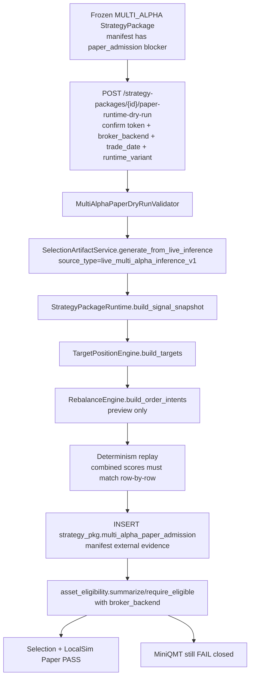

# 多 Alpha StrategyPackage LocalSim Paper Admission F2 设计

日期：2026-06-28  
分支：`feature/multi-alpha-localsim-paper-admission-20260628`  
类型：F2 feature delivery（生产关键 DB/API/Paper/Selection eligibility 变更）  
范围：多 Alpha `StrategyPackage` 经真实 LocalSim 信号层 dry-run 留证后，按 `broker_backend=local_sim` 清除 `multi_alpha_runtime_not_validated_until_dry_run` blocker，允许进入 Selection / LocalSim Paper；MiniQMT 继续 fail-closed。

## Background

当前 `MultiAlphaPackagePromotionService._paper_admission()` 在 promotion 时把：

```json
{"eligible": false, "blocking": ["multi_alpha_runtime_not_validated_until_dry_run"]}
```

固化进 frozen manifest 的 `source_evidence.multi_alpha.paper_admission`。`StrategyPackageAssetEligibilityService.summarize()` 在 `backend/services/strategy_package/asset_eligibility.py` 里调用 `_multi_alpha_runtime_blockers()` 读取该 blocker，并通过 `eligible = not blockers` 输出 hard FAIL。全后端没有任何 writer 可以把该 blocker 清掉；直接改 frozen manifest 会破坏 `manifest_sha256`，因此放行状态必须存放在 manifest 之外。

本设计承接：

- `docs/analysis/multi_alpha_paper_v2_route_architecture_20260626.md`：MULTI_ALPHA 作为单个 parent package 接入 Paper v2；`PaperPortfolio.package_id` 主契约不变；LocalSim 不依赖 MiniQMT 路线 A；MiniQMT 真实 paper 继续等待路线 A。
- PR #1701 文档 `docs/analysis/qe_to_paper_chain_closure_gap_and_multi_alpha_paper_admission_design_20260628.md` §3：C1-C5 的高层设计，本文件把它细化为 DDL/API/函数签名/验证矩阵。

### 第 0 步 Ground-Truth 结论

代码核实结果更正了“多 Alpha 已可选股”的旧判断：

1. `selection_center.service.SelectionCenterService.list_selectable_packages()` 调用 `asset_eligibility_service.summarize(record)`，若 `eligible=False` 直接过滤。因此当前 MULTI_ALPHA 包不仅无法创建 paper portfolio，也不会出现在 selection center 的 selectable package 列表中。
2. `SelectionCenterService._prepare_package_runtime_configs()` 在真正跑 selection run 前调用 `asset_eligibility_service.require_eligible(record)`。即使绕过列表直接传 package_id，也会被同一 blocker 拒绝。
3. `PaperTradingV2PortfolioService.create_portfolio()` 当前调用 `asset_eligibility_service.require_eligible(record)`，所以 paper 创建同样被 blocker 拒绝。
4. `StrategyPackageService.enable_selection()` / `enable_paper()` 是 asset eligibility 一次性校验，不持久化状态；因此清除 blocker 后会同时影响“可选股”和“可建 LocalSim paper”。

由此本轮准入语义定义为：

- dry-run admission 命中 `broker_backend=local_sim` 且 `eligible=true` 后，Selection Center 与 LocalSim Paper 的 eligibility 都放行。
- `broker_backend=minqmt_sim` 不复用 `local_sim` admission，继续 fail-closed，直到后续 MiniQMT 路线 A 单独准入。
- Selection Center 没有显式 `broker_backend` 字段；它只消费信号层，因此本轮给 `summarize()` 默认传 `broker_backend="local_sim"`，代表“可用于 LocalSim/Selection 的信号层准入”。Paper 创建必须传真实 portfolio `broker_backend`。

## Scope

本轮实现组件 C1-C5：

- C1：新增 `strategy_pkg.multi_alpha_paper_admission` 表与 rollback 迁移，DDL 仅提交文件，不执行生产 DDL。
- C2：新增 `MultiAlphaPaperDryRunValidator`，复用真实 `StrategyPackageSelectionArtifactService` / `StrategyPackageRuntime` / `TargetPositionEngine` / `RebalanceEngine` 信号层链路，只到 order intents preview，不撮合、不下单。
- C3：新增 `POST /api/v1/strategy-packages/{id}/paper-runtime-dry-run`，带 confirm token，只受理 `alpha_mode=multi_alpha`，成功写 C1。
- C4：升级 `StrategyPackageAssetEligibilityService.summarize/require_eligible` 支持 `broker_backend` 上下文和 admission reader；默认 fail-closed。
- C5：`PaperTradingV2PortfolioService.create_portfolio()` 把 `broker_backend` 传给 `require_eligible()`；Selection Center 使用默认 `local_sim` 语义。

## Non-Goals

- 不改 `PaperPortfolio.package_id` 单 package 主契约。
- 不放行 `broker_backend=minqmt_sim`；MiniQMT 真实 paper 继续等待路线 A。
- 不实现真实撮合、真实下单、MiniQMT canary、UI、advisory 集成、live approval UI。
- 不原地修改 frozen manifest，不重算已存在 package 的 manifest hash。
- 不给 SINGLE_ALPHA 写 admission 表；`alpha_mode != multi_alpha` 路径提前 return。
- 不启动/重启服务，不写生产 DB，不执行生产 DDL/DML。

## Architecture



核心原则：

- Admission 绑定 `(package_id, manifest_sha256, broker_backend, runtime_variant)`；任何 manifest 漂移或 topK 变体变化都需要重新 dry-run。
- dry-run 证据必须包含 component artifact sha、weight artifact sha、combined artifact sha、target positions、order intents preview、determinism replay sha。
- 所有失败用 typed exception 抛出，`context.reason_code` 必填，不写 admission。

## Contracts

### DB Contract：`strategy_pkg.multi_alpha_paper_admission`

Forward migration 文件：`backend/migrations/strategy_pkg_multi_alpha_paper_admission_20260628.sql`  
Rollback migration 文件：`backend/migrations/strategy_pkg_multi_alpha_paper_admission_20260628.rollback.sql`

```sql
CREATE TABLE IF NOT EXISTS strategy_pkg.multi_alpha_paper_admission (
    admission_id TEXT PRIMARY KEY,
    package_id TEXT NOT NULL REFERENCES strategy_pkg.package(package_id) ON DELETE CASCADE,
    manifest_sha256 TEXT NOT NULL,
    broker_backend TEXT NOT NULL,
    runtime_variant TEXT NOT NULL,
    eligible BOOLEAN NOT NULL DEFAULT FALSE,
    dry_run_run_id TEXT NOT NULL,
    artifact_shas JSONB NOT NULL DEFAULT '{}'::jsonb,
    evidence_json JSONB NOT NULL DEFAULT '{}'::jsonb,
    validated_at TIMESTAMPTZ NOT NULL DEFAULT now(),
    validated_by TEXT NOT NULL,
    created_at TIMESTAMPTZ NOT NULL DEFAULT now(),
    CONSTRAINT multi_alpha_paper_admission_broker_backend_chk CHECK (broker_backend IN ('local_sim', 'minqmt_sim')),
    CONSTRAINT multi_alpha_paper_admission_runtime_variant_chk CHECK (runtime_variant ~ '^top_k=(25|50)$'),
    CONSTRAINT multi_alpha_paper_admission_manifest_sha_chk CHECK (manifest_sha256 ~ '^[0-9a-f]{64}$'),
    CONSTRAINT multi_alpha_paper_admission_dry_run_chk CHECK (length(dry_run_run_id) > 0),
    CONSTRAINT multi_alpha_paper_admission_validated_by_chk CHECK (length(validated_by) > 0),
    CONSTRAINT multi_alpha_paper_admission_unique UNIQUE (package_id, manifest_sha256, broker_backend, runtime_variant)
);

CREATE INDEX IF NOT EXISTS idx_multi_alpha_paper_admission_lookup
ON strategy_pkg.multi_alpha_paper_admission(package_id, manifest_sha256, broker_backend, runtime_variant)
WHERE eligible = TRUE;
```

每列必须有 `COMMENT ON COLUMN`：

| column | comment 要点 |
|---|---|
| `admission_id` | `mapa_` 前缀的稳定准入记录 id，由 canonical evidence hash 派生 |
| `package_id` | MULTI_ALPHA parent package id；SINGLE_ALPHA 不写此表 |
| `manifest_sha256` | frozen parent manifest hash；manifest 变化后 admission 不再命中 |
| `broker_backend` | Paper v2 backend：本轮仅 `local_sim` 可写 eligible=true，`minqmt_sim` 保留 fail-closed |
| `runtime_variant` | `top_k=25` 或 `top_k=50`，与 runtime profile selection.top_k 对齐 |
| `eligible` | dry-run 是否通过；eligibility 只接受 true |
| `dry_run_run_id` | validator 生成的 dry-run evidence id，不是 PaperRun 真撮合 id |
| `artifact_shas` | JSONB：component/weight/combined/target/order/determinism sha，schema `multi_alpha_paper_admission_artifacts_v1` |
| `evidence_json` | JSONB：trade_date、runtime_config_hash、target/order preview、reason/source metadata，schema `multi_alpha_paper_admission_evidence_v1` |
| `validated_at` | dry-run 通过时间 |
| `validated_by` | operator/API actor，默认 `aistock_api` |
| `created_at` | row insert time |

Rollback：`DROP TABLE IF EXISTS strategy_pkg.multi_alpha_paper_admission;`

### Repository Contract

新增 `backend/services/strategy_package/multi_alpha_paper_admission.py`：

```python
class MultiAlphaPaperAdmissionRecord(BaseModel):
    admission_id: str
    package_id: str
    manifest_sha256: str
    broker_backend: BrokerBackendId
    runtime_variant: str
    eligible: bool
    dry_run_run_id: str
    artifact_shas: dict[str, Any]
    evidence_json: dict[str, Any]
    validated_at: datetime
    validated_by: str
    created_at: datetime

class MultiAlphaPaperAdmissionRepository:
    def get_eligible(self, *, package_id: str, manifest_sha256: str, broker_backend: BrokerBackendId, runtime_variant: str) -> MultiAlphaPaperAdmissionRecord | None: ...
    def upsert_success(self, record: MultiAlphaPaperAdmissionRecord) -> MultiAlphaPaperAdmissionRecord: ...
```

测试用 `InMemoryMultiAlphaPaperAdmissionRepository` 提供相同接口。

### Service Contract

新增 `backend/services/strategy_package/multi_alpha_paper_dry_run.py`：

```python
MULTI_ALPHA_PAPER_DRY_RUN_CONFIRMATION = "MULTI_ALPHA_LOCALSIM_DRY_RUN"
REASON_MULTI_ALPHA_DRY_RUN_NOT_APPLICABLE = "multi_alpha_paper_dry_run_not_applicable"
REASON_MULTI_ALPHA_DRY_RUN_UNSUPPORTED_BROKER = "multi_alpha_paper_dry_run_unsupported_broker_backend"
REASON_MULTI_ALPHA_DRY_RUN_DETERMINISM_MISMATCH = "multi_alpha_paper_dry_run_determinism_mismatch"
REASON_MULTI_ALPHA_DRY_RUN_NO_ORDER_PREVIEW = "multi_alpha_paper_dry_run_no_order_preview"

class MultiAlphaPaperDryRunValidator:
    def run(
        self,
        *,
        package_id: str,
        broker_backend: BrokerBackendId,
        trade_date: date,
        runtime_variant: str,
        confirmation: str,
        validated_by: str = "aistock_api",
        runtime_config: dict[str, Any] | None = None,
        initial_cash: float = 1_000_000.0,
    ) -> MultiAlphaPaperDryRunResult: ...
```

Semantics：

1. confirmation 必须匹配，否则 `StrategyPackageValidationError` + `reason_code=multi_alpha_paper_dry_run_confirmation_required`。
2. `record.current_manifest().alpha_mode != multi_alpha` -> 400 not-applicable，`reason_code=multi_alpha_paper_dry_run_not_applicable`。
3. `broker_backend != local_sim` -> fail-loud，`reason_code=multi_alpha_paper_dry_run_unsupported_broker_backend`。
4. `runtime_variant` 只允许 `top_k=25` / `top_k=50`；注入 `runtime_profile.selection.top_k`。
5. 调用真实 `StrategyPackageSelectionArtifactService.generate_from_live_inference(...include_reference_price=True...)`，再由 `StrategyPackageRuntime.build_signal_snapshot()` 读取 authoritative artifact。
6. 用 `TargetPositionEngine.build_targets()` + `RebalanceEngine.build_order_intents()` 生成 target positions 与 order intents preview；不创建 PaperRun，不撮合，不下单。
7. 第二次用同一 `(manifest, runtime_config, trade_date)` 重跑 combined artifact，按 `(rank, symbol, score, target_weight, reference_price, component_scores)` 逐行比对；不一致则 `reason_code=multi_alpha_paper_dry_run_determinism_mismatch`，不写 admission。
8. 成功后写 admission；失败不写 admission，并透传 P1a 既有 reason_code：`multi_alpha_leg_missing`、`multi_alpha_child_manifest_mismatch`、`multi_alpha_seed_prediction_missing`、`multi_alpha_component_coverage_low`、`multi_alpha_weight_unavailable`、`multi_alpha_label_window_insufficient`、`multi_alpha_weight_all_non_positive`、`multi_alpha_topk_runtime_mismatch`、`multi_alpha_prediction_not_authoritative`、`multi_alpha_selection_artifact_deadline_exceeded`。

### API Contract

新增 router request/endpoint：

```python
class MultiAlphaPaperRuntimeDryRunRequest(BaseModel):
    broker_backend: BrokerBackendId = "local_sim"
    trade_date: date
    runtime_variant: str = Field(pattern="^top_k=(25|50)$")
    confirmation: str
    validated_by: str = "aistock_api"
    runtime_config: dict[str, Any] = Field(default_factory=dict)
    initial_cash: float = Field(default=1_000_000.0, gt=0)

POST /api/v1/strategy-packages/{package_id}/paper-runtime-dry-run
```

Success response：

```json
{
  "ok": true,
  "package_id": "pkg_...",
  "broker_backend": "local_sim",
  "runtime_variant": "top_k=50",
  "trade_date": "2024-07-02",
  "admission": {},
  "dry_run": {
    "dry_run_run_id": "mapdry_...",
    "selection_artifact_id": "ssa_...",
    "target_count": 50,
    "order_intent_count": 50,
    "deterministic_replay": true
  }
}
```

Failure response follows existing `_raise_http(exc)` behavior and must include `detail.context.reason_code`。

### Eligibility Contract

Modify signatures：

```python
class StrategyPackageAssetEligibilityService:
    def __init__(..., admission_reader: Any | None = None) -> None: ...
    def summarize(self, record: Any, *, broker_backend: BrokerBackendId = "local_sim", runtime_variant: str | None = None) -> StrategyPackageAssetEligibilityResult: ...
    def require_eligible(self, record: Any, *, broker_backend: BrokerBackendId = "local_sim", runtime_variant: str | None = None) -> StrategyPackageAssetEligibilityResult: ...

def _multi_alpha_runtime_blockers(manifest, *, broker_backend, runtime_variant, admission_reader) -> list[StrategyPackageAssetEligibilityCheck]: ...
```

Rules：

- `alpha_mode != multi_alpha` -> return `[]` before admission lookup。
- `blocking` 不含 `multi_alpha_runtime_not_validated_until_dry_run` -> return manifest blocking as before。
- `runtime_variant is None` -> derive from manifest `backtest_context.daily_strategy.topk` as `top_k=<N>`。
- admission 命中 `eligible=true` for `(package_id, manifest_sha256, broker_backend, runtime_variant)` -> return PASS check `multi_alpha_runtime_not_validated_until_dry_run` with admission context, not blocker。
- no admission -> preserve hard FAIL with context `{package_id, manifest_sha256, broker_backend, runtime_variant}`。
- `broker_backend=minqmt_sim` with only `local_sim` admission -> no hit -> hard FAIL。

### Paper/Selection Integration Contract

- `PaperTradingV2PortfolioService.create_portfolio()` calls `require_eligible(record, broker_backend=broker_backend)` after broker backend validation input is available and before persistence。
- Selection Center calls default `summarize/require_eligible(...broker_backend="local_sim")` so dry-run admission clears selection listing and selection run preflight。
- SINGLE_ALPHA behavior unchanged because `_multi_alpha_runtime_blockers()` exits before admission lookup。

## Design Acceptance Index

| 设计项 | 标题 |
|---|---|
| F-001 | Ground-truth：Selection 和 Paper 都经过 asset eligibility gate，LocalSim admission 应同时放行 Selection + LocalSim Paper |
| F-002 | DB：新增 manifest 外 `multi_alpha_paper_admission` 表，含 forward/rollback、唯一键、每列 COMMENT |
| F-003 | Dry-run：`MultiAlphaPaperDryRunValidator` 复用真实 LocalSim 信号层产物到 order intents preview，不撮合不下单 |
| F-004 | Determinism：同 manifest/runtime_config/trade_date 重跑 combined score 逐行一致，不一致 fail-loud 不写 admission |
| F-005 | API：`POST /strategy-packages/{id}/paper-runtime-dry-run` confirm token，multi_alpha only，local_sim only |
| F-006 | Eligibility：venue-aware admission lookup 清除 local_sim blocker，MiniQMT 继续 fail-closed |
| F-007 | Paper：`create_portfolio` 传入真实 `broker_backend`，不改 `PaperPortfolio.package_id` 主契约 |
| F-008 | SINGLE_ALPHA 零回归：alpha_mode != multi_alpha 提前 return，selection/paper 既有测试不受影响 |
| F-009 | No-silent：失败路径均有具体 `reason_code` + context，失败不写 admission |
| F-010 | 生产门禁：DDL 只提交迁移文件，生产执行由 DDL gate 单独授权；不启停服务 |

## Implementation Plan

1. 写入迁移 `backend/migrations/strategy_pkg_multi_alpha_paper_admission_20260628.sql` 与 rollback。
2. 新增 `multi_alpha_paper_admission.py`：record、PG repository、in-memory repository、canonical id/hash helper。
3. 新增 `multi_alpha_paper_dry_run.py`：dry-run validator、request/result model、determinism compare、artifact/evidence sha。
4. 改 `asset_eligibility.py`：`broker_backend/runtime_variant/admission_reader` 参数、admission lookup、PASS/FAIL check context。
5. 改 `paper_trading_v2/service.py`：`create_portfolio` 传 `broker_backend` 到 `require_eligible`；未知 broker validation 仍 fail-fast。
6. 改 `strategy_packages.py`：新增 request model 和 endpoint；router tests 覆盖 success + not-applicable + unsupported broker。
7. 测试：新增 `backend/tests/strategy_package/test_multi_alpha_paper_admission.py`，复用 P1a fake live provider 但走真实 `SelectionArtifactService`/`StrategyPackageRuntime`/`TargetPositionEngine`/`RebalanceEngine` 链路，不 mock 核心业务路径。
8. 更新 PR 自审矩阵，运行 feature workflow validate F2 与 targeted tests。

## Verification Plan

最低验证命令：

- `rtk python scripts/aistock_feature_workflow.py validate --design docs/analysis/multi_alpha_paper_admission_localsim_f2_design_20260628.md --tier F2`
- `rtk python -m py_compile backend/services/strategy_package/multi_alpha_paper_admission.py backend/services/strategy_package/multi_alpha_paper_dry_run.py backend/services/strategy_package/asset_eligibility.py backend/services/paper_trading_v2/service.py backend/routers/strategy_packages.py backend/tests/strategy_package/test_multi_alpha_paper_admission.py`
- `rtk python -m ruff check backend/services/strategy_package/multi_alpha_paper_admission.py backend/services/strategy_package/multi_alpha_paper_dry_run.py backend/services/strategy_package/asset_eligibility.py backend/services/paper_trading_v2/service.py backend/routers/strategy_packages.py backend/tests/strategy_package/test_multi_alpha_paper_admission.py`
- `rtk python -m pytest -q backend/tests/strategy_package/test_multi_alpha_paper_admission.py backend/tests/strategy_package/test_multi_alpha_promotion.py backend/tests/strategy_package/test_multi_alpha_live_selection.py`
- `rtk python -m pytest -q backend/tests/selection_center/test_runtime_selection.py backend/tests/paper_trading_v2/test_portfolio_broker_backend.py backend/tests/strategy_package/test_enable_paper_router_409.py`
- `rtk python -m nox -s l0`
- `rtk git diff --check`

验收断言：

1. 真实两腿 MULTI_ALPHA parent package + fake live provider 的真实 signal path dry-run 产出 component/weight/combined artifacts、targets、orders preview，并写 admission。
2. 同 manifest/runtime_config/trade_date 重跑 combined score 逐行一致，artifact sha 一致。
3. admission 后 `summarize(...broker_backend="local_sim")` 和 `create_portfolio(broker_backend="local_sim")` 通过；`top_k=25/50` target/order 数量正确。
4. 缺 seed / 权重窗口不足 / child sha mismatch 分别 fail-loud，`context.reason_code` 可定位，admission 未写。
5. `broker_backend="minqmt_sim"` 仍 fail-closed。
6. SINGLE_ALPHA selection/paper 既有测试全绿。
7. 无 silent fallback / except pass；失败 response 保留 reason_code/context。

## Design Acceptance Matrix

| design_item | implementation_refs | test_or_evidence | status | gap_or_exception |
|---|---|---|---|---|
| F-001 | `asset_eligibility.py`; `selection_center/service.py`; `paper_trading_v2/service.py`; 本设计 Background | ground-truth rg/read evidence; tests assert selection summary and paper create semantics | verified | - |
| F-002 | `backend/migrations/strategy_pkg_multi_alpha_paper_admission_20260628.sql`; `.rollback.sql`; `multi_alpha_paper_admission.py` | migration comment/static test + repository upsert/get tests | verified | - |
| F-003 | `multi_alpha_paper_dry_run.py` | success dry-run test uses real SelectionArtifactService/Runtime/Target/Rebalance path | verified | - |
| F-004 | `multi_alpha_paper_dry_run.py` determinism comparator | deterministic replay test with same manifest/runtime_config/trade_date | verified | - |
| F-005 | `backend/routers/strategy_packages.py` | TestClient endpoint success/not-applicable/unsupported broker tests | verified | - |
| F-006 | `asset_eligibility.py`; `paper_trading_v2/service.py` | local_sim PASS after admission; minqmt_sim FAIL without matching admission | verified | - |
| F-007 | `paper_trading_v2/service.py` | create_portfolio local_sim succeeds after admission; PaperPortfolio single package contract unchanged | verified | - |
| F-008 | `asset_eligibility.py` early return for non-multi; existing tests | SINGLE_ALPHA paper/selection regression commands pass | verified | - |
| F-009 | typed exceptions in dry-run/eligibility/router | negative tests assert reason_code/context and no admission row | verified | - |
| F-010 | migration files only; no runtime DDL execution | PR production gates record `production_ddl_gate=pending` | verified | - |

## Rollout And Rollback

Rollout：

1. 合并代码后，先不声明生产可用；生产 DDL gate 处于 `pending`。
2. 用户授权后执行 forward migration，并验证表、唯一键、comments、index 存在。
3. 用户重启后端加载新 endpoint/service。
4. 对目标 MULTI_ALPHA package 分别执行 `runtime_variant=top_k=25` 与 `top_k=50` 的 LocalSim dry-run。
5. 验证 Selection list 与 LocalSim `create_portfolio` 放行；MiniQMT create 仍拒绝。

Rollback：

1. 若 runtime 出现问题，停止调用 dry-run endpoint；未写入 admission 的 package 保持 fail-closed。
2. 如需撤销已写 admission，可在 DB gate 下删除对应 `(package_id, manifest_sha256, broker_backend, runtime_variant)` 行，manifest 无需修改。
3. 如需完全回滚 schema，执行 rollback migration `DROP TABLE IF EXISTS strategy_pkg.multi_alpha_paper_admission;`，所有 MULTI_ALPHA 重新回到 manifest blocker hard FAIL。

## Risks

| 风险 | 影响 | 缓解 |
|---|---|---|
| LocalSim admission 被误用于 MiniQMT | 绕过路线 A | admission key 含 `broker_backend`; MiniQMT 查不到 local_sim row 继续 fail-closed |
| dry-run 使用 fake/mock 产物 | 假放行 | validator 调真实 SelectionArtifactService/Runtime/Target/Rebalance；测试禁止 mock 核心链路 |
| manifest sha 被修改 | 不可复现 | admission 存 manifest 外独立表；不改 frozen manifest |
| selection 默认 broker_backend 语义不清 | 误放行范围 | 明确 Selection 是 LocalSim/信号层准入，默认 `local_sim`；MiniQMT paper 必须传真实 backend |
| DDL 未执行但后端已重启 | runtime 查表失败 | repository 遇缺表必须 loud；上线报告 `production_ddl_gate=pending`，DDL 未完成不得宣称生产 ready |

## Production Gates

- `production_ddl_gate=pending`：本任务新增表和迁移文件；生产 DDL 必须在 merge 后由用户单独授权执行并验证。
- `production_frontend_dependency_gate=noop`：不改前端、不改前端依赖。
- `production_backend_dependency_gate=noop`：不新增 Python 依赖。
- 不启/重启服务；运行时生效由用户重启。
- 不写生产 DB、不执行生产 DDL/DML。
