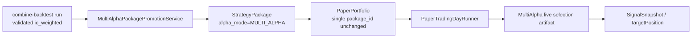
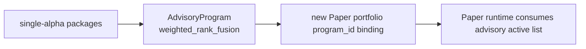

# 多 Alpha 多腿组合进入 Paper Trading v2 通路架构设计

版本：2026-06-26  
模式：`--mode plan`，设计先行，不写实现代码  
GitHub Issue：[#1648](https://github.com/licong01-cloud/AIstock/issues/1648)  
目标组合：`a1_plus3_LSTM_h20 + new_FUNDGROWTH_h20`，`ic_weighted`，`topk50/topk25`，`V25_1_SMALL_CAP`，`h20`，`filtered_pool_20260428`

## Background

多 Alpha 研究已选出一个可投产候选组合：两条独立 DGP 腿 `a1_plus3_LSTM_h20` 与 `new_FUNDGROWTH_h20`，在 combine-backtest 中用 `ic_weighted` 加权验证，用户提供的锚点为 top25 Sharpe 约 `2.845`、top50 Sharpe 约 `2.805`。当前要解决的问题不是再次回测，而是设计一条可审计、可冻结、可复现、可 fail-loud 的路径，把该组合进入 `paper_trading_v2` 模拟盘。

本设计只定义架构和验收，不改实现。模拟盘程序本身仍有独立问题待解决，因此本设计优先保证后续实现不会把多腿组合静默降级成单腿、不会用历史 pred-store 预测冒充实时预测、不会破坏现有 `SINGLE_ALPHA` Paper v2 通路。

## Scope

本设计覆盖：

1. 核实现状缺口：Paper v2、StrategyPackage、combine-backtest、advisory program、runtime/live inference 的当前能力边界。
2. 对比两条候选路线：
   - 路线 1：创建 `alpha_mode=MULTI_ALPHA` 的组合 StrategyPackage，Paper v2 仍绑定一个组合 package。
   - 路线 2：复用 advisory program 的多 package 加权，再新增 Paper v2 与 advisory 集成。
3. 推荐架构、运行时组合预测供给、`combine-backtest run -> MULTI_ALPHA strategy_package` 转换契约。
4. 冻结、manifest sha、prediction ref、资产准入、多腿 no-silent 错误语义。
5. P0/P1/P2 分阶段实施计划与真实 dry-run 验收标准。

## Non-goals

1. 不在本轮实现任何后端代码、前端 UI、MCP 工具、DDL/DML 或数据迁移。
2. 不修复当前 Paper v2 模拟盘运行问题；只给出后续接入多 Alpha 时应满足的接口与验收。
3. 不启动或重启 backend/frontend/TDX/MiniQMT 服务。
4. 不触碰 `research-assistant`。
5. 不把 `pred-store` 中历史验证窗口的 combined prediction 当成实盘每日预测；它只能作为验证证据和 replay 输入。

## Architecture

### 1. 现状核实

| 编号 | 用户给出的现状缺口 | 核实结论 | 证据 |
|---|---|---|---|
| G-1 | Paper v2 portfolio 当前 1:1 只绑定单个 `strategy_package_id` | 成立。`PaperPortfolio` 只有 `package_id` 与 `frozen_manifest`；`create_portfolio` 只接收一个 `package_id`，取该 package 的 current manifest 冻结进 portfolio。 | `backend/services/paper_trading_v2/models.py:40`、`backend/services/paper_trading_v2/models.py:45`、`backend/services/paper_trading_v2/models.py:47`、`backend/services/paper_trading_v2/models.py:65`；`backend/services/paper_trading_v2/service.py:208`、`backend/services/paper_trading_v2/service.py:221`、`backend/services/paper_trading_v2/service.py:258`；`backend/routers/paper_trading_v2.py:34`、`backend/routers/paper_trading_v2.py:391` |
| G-2 | combine-backtest 是诊断工具，无 `promote_to_package/export` 方法 | 成立。`MultiAlphaCombineBacktestService` 暴露 `submit_run/execute_run`，组合执行入口是 `combine_legs`，只在配置 upload URL 时上传 combined prediction；代码检索未发现 `promote_to_package` 或 package export。 | `backend/services/multi_alpha/combine_backtest.py:1032`、`backend/services/multi_alpha/combine_backtest.py:1055`、`backend/services/multi_alpha/combine_backtest.py:1809`、`backend/services/multi_alpha/combine_backtest.py:2055` |
| G-3 | strategy_package 创建入口只来自 QE/candidate，无 multi-alpha combine -> package 入口 | 基本成立。当前 router 入口为 `/from-qe-experiment`、`/from-qe-evolution-loop`、`/from-candidate/{candidate_id}`；service 只有对应 `create_from_qe_experiment/create_from_qe_evolution_loop/create_from_candidate`。同时需要补充：schema 已存在 `AlphaMode.MULTI_ALPHA` 与 `AlphaCombinationPolicy`，但没有从 combine-backtest 生成 MULTI_ALPHA package 的服务。 | `backend/routers/strategy_packages.py:317`、`backend/routers/strategy_packages.py:329`、`backend/routers/strategy_packages.py:342`；`backend/services/strategy_package/service.py:118`、`backend/services/strategy_package/service.py:131`；`backend/services/strategy_package/models.py:19`、`backend/services/strategy_package/models.py:21`、`backend/services/strategy_package/models.py:96`、`backend/services/strategy_package/models.py:273` |
| G-4 | advisory program 支持多 package 加权，但与 Paper v2 零集成 | 成立但需精确表述：advisory 支持 `weighted_rank_fusion/fusion_pool/union/intersection` 这类多 package 组合和 `package_weights`，不是 combine-backtest 的 score-level `ic_weighted`；Paper v2 代码中未引用 advisory program，仅出现 PostgreSQL advisory lock 语义。 | `backend/services/advisory_program.py:45`、`backend/services/advisory_program.py:47`、`backend/services/advisory_program.py:51`、`backend/services/advisory_program.py:2304`、`backend/services/advisory_program.py:2308`、`backend/services/advisory_program.py:2916`；`backend/routers/advisory.py:27`、`backend/routers/advisory.py:326` |
| G-5 | 实时 `ic_weighted` 多腿组合预测无现成实现 | 成立。`StrategyPackageRuntime` 对 `MULTI_ALPHA` 明确要求 component runtime artifacts，否则抛 `UnsupportedFeatureError("multi_alpha runtime artifacts are not available")`；live selection artifact 生成流程当前按单 package/source/provider 运行。 | `backend/services/strategy_package/runtime.py:129`、`backend/services/strategy_package/runtime.py:130`、`backend/services/strategy_package/runtime.py:133`、`backend/services/strategy_package/runtime.py:287`；`backend/services/strategy_package/selection_artifact.py:372`、`backend/services/strategy_package/selection_artifact.py:390`、`backend/services/strategy_package/selection_artifact.py:409`、`backend/services/strategy_package/selection_artifact.py:421` |

结论：用户的 5 点调研方向成立；重要补充是 `StrategyPackageManifest` 已有 `MULTI_ALPHA` schema 入口，但现有创建服务与 runtime 仍未把该 schema 接到 Paper v2 可运行路径。

### 2. 架构路线对比

#### 路线 1：MULTI_ALPHA StrategyPackage，Paper v2 仍绑定单个 package

核心思想：



设计要点：

1. 现有 Paper v2 的 `portfolio.package_id` 不变；组合本身成为一个 package。
2. `StrategyPackageManifest.alpha_mode=MULTI_ALPHA`，`alpha_components` 表示腿；`alpha_combination_policy` 表示 `ic_weighted`、normalization、walk-forward、weight horizon 与 no-silent 策略。
3. 新增 package 创建服务从 combine-backtest run 固化 manifest，冻结 `manifest_sha256`。
4. 新增 runtime provider 生成“组合 selection artifact”：先生成每腿/每 seed 的 live score 面板，再 seed ensemble，再按 live rolling `ic_weighted` 组合，最后输出 Paper v2 已会消费的 `SelectionScoreArtifact`。
5. Paper v2 仍消费一个 authoritative selection artifact，不需要把 portfolio 改为多个 package 或 program binding。

优点：

- 与现有 Paper v2 抽象最契合：Paper v2 从一开始就是“一个 portfolio 绑定一个 frozen package”。
- 能利用已有 `AlphaMode.MULTI_ALPHA`、`AlphaCombinationPolicy`、`manifest_sha256`、asset eligibility、selection artifact、runtime profile 体系。
- 不破坏单腿 `SINGLE_ALPHA` 通路；只是新增 `MULTI_ALPHA` runtime artifact 生成能力。
- 能精确表达 score-level `ic_weighted`，而不是 advisory 的 weighted rank fusion。
- 后续 package governance、paper enable、manifest integrity、prediction ref 都有自然落点。

成本/风险：

- 需要补齐多腿 live inference 与 rolling IC 权重计算，复杂度集中在 runtime artifact provider。
- 需要定义子腿/seed 的冻结和资产准入规则。
- 需要小心 selection artifact 不能只用腿自己的 topK 截断结果，否则组合 topK 会失真；组件层必须拿到足够大的候选全集或明确 coverage 阈值。

#### 路线 2：Advisory program + Paper v2 集成

核心思想：



优点：

- advisory 已有 `package_ids/package_weights`、binding version、review/replay 的数据结构。
- 若目标只是“多个包的推荐池合并”，可复用 advisory 的 active-pool/review 语义。

缺点：

- 当前 advisory 的多 package 模式是 `weighted_rank_fusion/fusion_pool/union/intersection`，不等价于 combine-backtest 的 score-level `ic_weighted`。直接复用会改变策略语义。
- Paper v2 现在没有 `program_id`；要改 portfolio/session/day-runner/live approval 多处契约，改动面大于路线 1。
- Advisory 更像“选股建议与持仓 review 层”，而不是可冻结的执行策略包；把 paper runtime 绑定 advisory 会引入第二套 package 真源。
- seed ensemble、实时 rolling IC、manifest freeze、asset eligibility 仍然需要另行实现，不能由 advisory 自动解决。

推荐：路线 1。Advisory 可在 P2 作为组合 package 的 review/监控消费方，而不是 Paper v2 的主执行入口。

### 3. 推荐目标架构

推荐新增三个后端能力，但保持 Paper v2 portfolio schema 不变：

1. `MultiAlphaPackagePromotionService`
   - 输入 combine-backtest `run_id` + `weighting_scheme=ic_weighted` + `topk` + confirmation。
   - 输出 `alpha_mode=MULTI_ALPHA` 的 frozen StrategyPackage。
   - 严格校验 run、scheme_result、roster、weights、metrics、child packages、seed runs、prediction refs。

2. `MultiAlphaLivePredictionProvider`
   - 作为 `StrategyPackageSelectionArtifactService.generate_from_live_inference_dates` 下的一个 provider/branch。
   - 对 `MULTI_ALPHA` manifest 读取 `alpha_combination_policy` 和 `source_evidence.multi_alpha`.
   - 对每个 leg 的每个 seed 运行现有 live inference 原语，生成组件全域 score 面板。
   - 每腿按 `(trade_date, instrument)` 对 seed score 做均值 ensemble。
   - 对腿 score 使用 combine-backtest 同一套 normalize 口径。
   - 按 live rolling `ic_weighted` 权重组合后生成 authoritative `SelectionScoreArtifact`。

3. `MultiAlphaWeightService`
   - 计算实盘可用的 `ic_weighted` 权重。
   - 每个 apply date 只使用 `< apply_date` 且 forward label 已完整成熟的数据。
   - 权重结果持久化为 artifact，供 Paper v2 日内运行只读消费。

## Contracts

### 1. 新建 package 端点

建议新增：

`POST /api/v1/strategy-packages/from-multi-alpha-combine-run`

请求：

```json
{
  "combine_backtest_run_id": "macb_...",
  "weighting_scheme": "ic_weighted",
  "scheme_result_id": "optional_explicit_scheme_result_id",
  "topk": 50,
  "secondary_topk": [25],
  "package_name": "MA2_a1_plus3_LSTM_new_FUNDGROWTH_icw_h20",
  "component_package_ids": {
    "a1_plus3_LSTM_h20": "pkg_...",
    "new_FUNDGROWTH_h20": "pkg_..."
  },
  "weight_policy": {
    "mode": "live_rolling_ic_weighted",
    "metric": "rank_ic",
    "lookback_trading_days": 252,
    "min_periods": 60,
    "label_horizon": 20,
    "label_maturity_lag_days": 20,
    "clip_negative_to_zero": true
  },
  "confirmation": "MULTI_ALPHA_PACKAGE_PROMOTE"
}
```

响应：

```json
{
  "ok": true,
  "package_id": "pkg_...",
  "alpha_mode": "multi_alpha",
  "manifest_sha256": "...",
  "source_run_id": "macb_...",
  "paper_admission": {
    "eligible": false,
    "blocking": ["multi_alpha_runtime_not_validated_until_dry_run"]
  }
}
```

校验失败必须 loud：

| reason_code | 触发条件 |
|---|---|
| `multi_alpha_combine_run_missing` | run_id 不存在 |
| `multi_alpha_scheme_not_succeeded` | scheme_result skipped/failed/指标为空 |
| `multi_alpha_roster_mismatch` | run roster 与请求腿/seed 不一致 |
| `multi_alpha_child_package_missing` | 任一腿 package 不存在 |
| `multi_alpha_child_package_not_frozen` | 任一子 package 缺 `manifest_sha256` |
| `multi_alpha_prediction_ref_missing` | 作为证据需要的 pred-store ref 缺失 |
| `multi_alpha_manifest_incomplete` | manifest 缺 component、weight_policy、topk、execution policy、filtered pool 等关键字段 |
| `multi_alpha_metrics_below_gate` | combine-backtest 指标不满足显式 promotion gate |

### 2. MULTI_ALPHA manifest 扩展建议

不建议新增 `AlphaMode` 枚举；已有 `multi_alpha` 可用。建议在现有可扩展字段中固化：

```json
{
  "alpha_mode": "multi_alpha",
  "alpha_components": [
    {
      "alpha_id": "a1_plus3_LSTM_h20",
      "alpha_name": "a1 PLUS3 LSTM h20 seed ensemble",
      "component_weight": 0.5,
      "holding_period": "20d",
      "score_direction": "higher_better",
      "lineage": {
        "qe_artifact_id": "multi-seed",
        "model_artifact_ref": "child_package:pkg_a1"
      }
    },
    {
      "alpha_id": "new_FUNDGROWTH_h20",
      "alpha_name": "new FUNDGROWTH h20 seed ensemble",
      "component_weight": 0.5,
      "holding_period": "20d",
      "score_direction": "higher_better",
      "lineage": {
        "qe_artifact_id": "multi-seed",
        "model_artifact_ref": "child_package:pkg_fundgrowth"
      }
    }
  ],
  "alpha_combination_policy": {
    "method": "ic_weighted",
    "weights": {
      "a1_plus3_LSTM_h20": 0.5,
      "new_FUNDGROWTH_h20": 0.5
    },
    "normalization_scope": "per_trade_date_universe",
    "conflict_resolution": "weighted_sum",
    "explainability": {
      "store_component_scores": true,
      "store_component_rank": true,
      "store_component_reason": true
    },
    "runtime": {
      "mode": "live_rolling_ic_weighted",
      "metric": "rank_ic",
      "lookback_trading_days": 252,
      "min_periods": 60,
      "label_horizon": 20,
      "label_maturity_lag_days": 20,
      "clip_negative_to_zero": true,
      "no_weight_fallback": "fail_loud"
    }
  },
  "source_evidence": {
    "multi_alpha": {
      "source_type": "multi_alpha_combine_backtest",
      "combine_backtest_run_id": "macb_...",
      "weighting_scheme": "ic_weighted",
      "scheme_result_id": "...",
      "combined_prediction_ref_uri": "prediction-store://...",
      "combined_prediction_ref_sha256": "...",
      "legs": [
        {
          "leg_id": "a1_plus3_LSTM_h20",
          "child_package_id": "pkg_a1",
          "child_manifest_sha256": "...",
          "seed_run_ids": ["qear_run_..."],
          "ensemble_method": "mean_by_trade_date_instrument"
        },
        {
          "leg_id": "new_FUNDGROWTH_h20",
          "child_package_id": "pkg_fundgrowth",
          "child_manifest_sha256": "...",
          "seed_run_ids": ["qear_run_..."],
          "ensemble_method": "mean_by_trade_date_instrument"
        }
      ]
    }
  },
  "portfolio_policy": {
    "topk": 50,
    "n_drop": 2,
    "rebalance_frequency": "1day"
  },
  "strategy_config": {
    "stock_pool": "V25_1_SMALL_CAP",
    "filtered_pool": "filtered_pool_20260428",
    "label_horizon": 20,
    "execution_algo": "V25_1_SMALL_CAP",
    "topk_variants": [25, 50]
  }
}
```

说明：

- `alpha_components[].component_weight` 存 promotion 当时的 terminal/frozen 权重，只做解释与 cold-start 参考。
- 真正每日实盘权重由 `alpha_combination_policy.runtime` 指定；若选择固定权重，必须显式 `mode=frozen_backtest_terminal_weights`，不得伪装成 rolling `ic_weighted`。
- `source_evidence.multi_alpha.legs[].seed_run_ids` 是 seed ensemble 的冻结证据；`child_package_id` 与 `child_manifest_sha256` 保证腿 package 不漂移。

### 3. 实时组合预测供给

#### 3.1 pred-store 还是每日重算

推荐：每日重算 live inference，不从 pred-store 取当日预测。

理由：

1. pred-store 中的 run artifacts 是训练/回测/OOS 验证产物，不能代表当日最新数据下的 live inference。
2. Paper v2 当前 runtime 要求 authoritative live selection artifact；`StrategyPackageRuntime` 会拒绝非 authoritative artifact 或 manifest 中的非权威 scores/scores_path。
3. pred-store 可作为校验与 replay 的证据源：验证 seed run、params、历史 combined_prediction sha、promotion 时的 backtest 指标，但不能当作 daily signal source。

#### 3.2 组件预测生成顺序

每日 trade_date `D`：

1. 读取 frozen MULTI_ALPHA manifest。
2. 对每个 leg：
   - 校验 child package 存在、manifest sha 匹配、seed_run_ids 完整；
   - 对每个 seed run 运行现有 live inference 原语，使用 `cutoff_date <= D`；
   - 将 seed score 规范化为 `(trade_date, instrument, score)`；
   - 按 `(trade_date, instrument)` 均值 ensemble，缺 seed 覆盖低于阈值则 fail-loud。
3. 对每个 leg 的 ensemble score 用 combine-backtest 同口径归一化。
4. 调 `MultiAlphaWeightService` 取 `D` 的 live weights。
5. 计算 `combined_score = sum(weight_i * normalized_score_i)`。
6. 在组合后再取 final `topk=50` 或 `topk=25`，写 authoritative `SelectionScoreArtifact`，metadata 包含：
   - `source_type=live_multi_alpha_inference_v1`
   - `authority_scope=authoritative_selection`
   - `component_score_artifact_ids`
   - `weight_artifact_id`
   - `component_manifest_sha256`
   - `seed_run_ids`
   - `combine_backtest_run_id`
   - `normalization_method`
   - `final_topk`

关键约束：组件层不能只取每腿 topK 后再合成。至少要使用足够大的共同候选集合，推荐 P1 要求 full universe score；如果因性能原因使用候选缓冲池，必须记录 `component_candidate_universe_size` 与 `coverage_threshold`，低覆盖直接失败。

#### 3.3 `ic_weighted` 实盘权重如何定

推荐生产口径：`live_rolling_ic_weighted`。

定义：

- apply date `D` 的权重只能使用 `< D` 且 forward label 已成熟的数据。
- 对 `h20`，权重训练窗口末日应满足 `label_date + 20 trading days <= D - data_settlement_lag`。
- 默认 `lookback_trading_days=252`，`min_periods=60`，metric 优先 `rank_ic`，可配置为 `topk_return`。
- 负值 clip 到 0；若全部非正或样本不足，不得 fallback equal，必须 fail-loud，除非 manifest 显式声明 `mode=frozen_backtest_terminal_weights`。

P0/P1 过渡：

- P0 可以先固化 `frozen_backtest_terminal_weights` 做 package promotion 与离线 dry-run 骨架验证，但 package 必须显示 `weight_policy.mode=frozen_backtest_terminal_weights`，不能宣称 live rolling。
- P1 必须实现 `live_rolling_ic_weighted` 后才允许进入真实自动 paper daily run。

### 4. 冻结与可复现

1. `manifest_sha256` 必须包含：
   - parent MULTI_ALPHA manifest 全量；
   - child package ids；
   - child `manifest_sha256`；
   - seed run ids；
   - combine-backtest run id；
   - scheme_result id；
   - weighting policy；
   - topk / n_drop / stock_pool / filtered_pool / label_horizon / execution_algo；
   - combined prediction ref sha；
   - runtime provider version。
2. `prediction_ref_uri`：
   - parent package 的 `prediction_ref_uri` 指向 promotion 时验证过的 `combined_prediction.pkl`，作为 backtest/replay 证据；
   - live daily signal 使用 `SelectionScoreArtifact`，不直接读 parent prediction ref。
3. Asset eligibility：
   - parent package 继承现有 package eligibility；
   - 新增 multi-alpha child gate：所有 child packages frozen、status 至少 `ASSET_VALIDATED`，paper run 前建议 `PAPER_ENABLED`；
   - 所有 seed run 的 model params、factor order、feature artifacts 可解析；
   - `label_horizon` 一致为 h20；
   - `stock_pool/filtered_pool` 一致；
   - runtime provider 支持 `multi_alpha`；
   - weight artifact 对当前 apply date 可用。
4. 可复现：
   - dry-run replay 给定 parent package manifest sha、runtime_config_hash、trade_date，应能重建相同 combined score；
   - component score、weights、combined score 均要有 artifact id 与 sha；
   - 任一 child package 升级必须创建新的 parent package，不得原地漂移。

### 5. No-silent failure policy

所有失败都必须终止当日 selection artifact 生成或 paper session，并写具体 `reason_code/context`：

| reason_code | 触发条件 |
|---|---|
| `multi_alpha_runtime_not_enabled` | `alpha_mode=MULTI_ALPHA` 但 runtime provider 未启用 |
| `multi_alpha_leg_missing` | manifest 中声明腿缺失或 child package 不存在 |
| `multi_alpha_child_manifest_mismatch` | child package 当前 sha 与 parent 冻结 sha 不一致 |
| `multi_alpha_seed_prediction_missing` | 任一 required seed 当日 live inference 缺失 |
| `multi_alpha_component_coverage_low` | 组件候选覆盖不足，无法可信组合 |
| `multi_alpha_weight_unavailable` | apply date 无可用 rolling IC 权重 |
| `multi_alpha_label_window_insufficient` | 权重训练窗口成熟 label 少于 min_periods |
| `multi_alpha_weight_all_non_positive` | clip 后权重全为 0 |
| `multi_alpha_topk_runtime_mismatch` | manifest topk 与 runtime profile top_k 不一致且未显式允许 variant |
| `multi_alpha_prediction_not_authoritative` | 试图用非 live authoritative artifact 进入 Paper v2 |

禁止行为：

- 禁止缺腿时降级为单腿。
- 禁止权重不可算时默认 equal。
- 禁止 seed 缺失时静默跳过。
- 禁止 child package sha 漂移后继续运行。
- 禁止用 combine-backtest 历史 prediction 当 live selection。

## Design Acceptance Index

- F-001：Paper v2 继续保持单 `package_id` 绑定，MULTI_ALPHA 组合被封装为一个 StrategyPackage。
- F-002：从 combine-backtest run 创建 MULTI_ALPHA package 的服务/端点必须校验 run、scheme、roster、weights、metrics、seed、child package 与 prediction ref。
- F-003：MULTI_ALPHA manifest 必须冻结 legs、seed_run_ids、child package sha、weight policy、topk、execution policy、prediction ref 与 backtest evidence。
- F-004：实时预测必须每日 live inference 重算，pred-store 仅作验证/replay 证据。
- F-005：`ic_weighted` live 权重必须使用 label 已成熟的历史窗口，不能泄漏 apply date 或未来 label。
- F-006：组件 score 必须先 seed ensemble、再腿归一化、再组合、最后取 topK，不能先腿 topK 截断后组合。
- F-007：所有缺腿、缺 seed、缺权重、覆盖不足、manifest 不完整必须 loud fail，不得降级单腿/equal/旧 prediction。
- F-008：SINGLE_ALPHA package 与现有 Paper v2 流程必须保持兼容，不改现有 portfolio 主契约。
- F-009：分阶段实施必须包含真实 Paper dry-run 验收，不能只依赖 unit test。
- F-010：上线与回滚必须把 MULTI_ALPHA runtime 开关、package status 与 Paper auto-run activation 分离。

## Implementation Plan

### P0：Promotion 与 manifest 冻结

目标：只把验证过的 combine-backtest run 固化为 frozen MULTI_ALPHA package，不进入自动 Paper daily run。

实现范围：

1. 新增 `MultiAlphaPackagePromotionService`。
2. 新增 `POST /strategy-packages/from-multi-alpha-combine-run`。
3. 生成 parent MULTI_ALPHA manifest。
4. 对 child packages、seed runs、prediction refs、scheme_result 指标、topk/filtered_pool/horizon 做 fail-loud 校验。
5. Asset eligibility 暂标 `multi_alpha_runtime_not_validated_until_dry_run`，不自动 `PAPER_ENABLED`。

验收：

1. 用目标 2 腿 run 生成 package，manifest sha 稳定。
2. 故意删 child package / seed ref / scheme_result，端点分别 loud fail。
3. `SINGLE_ALPHA` package create/list/enable paper 既有测试不变。
4. `git diff --stat` 不触碰 research-assistant。

### P1：MULTI_ALPHA live selection artifact + Paper dry-run

目标：让组合 package 在受控 dry-run 中生成 authoritative selection artifact 并跑通 Paper v2 local/miniqmt_sim 干跑，不启真实自动盘。

实现范围：

1. 新增 `MultiAlphaLivePredictionProvider`。
2. 新增 `MultiAlphaWeightService` 与 weight artifact。
3. `StrategyPackageSelectionArtifactService` 对 `alpha_mode=MULTI_ALPHA` 分支调用新 provider。
4. Paper v2 day runner 仍按现有 `_ensure_authoritative_selection_artifact -> StrategyPackageRuntime -> TargetPositionEngine` 消费一个 package。
5. runtime profile 支持 `top_k=25/50` 明确 variant；variant hash 进入 selection artifact hash。

真实 dry-run 验收：

1. 用 `MA2(a1_plus3_LSTM_h20 + new_FUNDGROWTH_h20)` package，在一个已知历史交易日生成 component score artifacts、weight artifact、combined selection artifact。
2. 同一 manifest/runtime_config/trade_date 重跑 combined score 逐行一致。
3. Paper v2 local_sim dry-run 生成目标持仓，topk50 与 topk25 数量正确。
4. 缺一个 seed、权重窗口不足、child sha 不匹配均导致 failed run，reason_code 可定位。
5. 现有 a1 单腿 Paper v2 dry-run 继续通过。

### P2：运营化与 advisory 旁路集成

目标：把组合 package 纳入 operator workflow、监控与 advisory review，但 advisory 不作为主执行入口。

实现范围：

1. Strategy Package UI/MCP 展示 MULTI_ALPHA 组件、weights、component score coverage、weight artifact。
2. Advisory program 可消费 parent MULTI_ALPHA package 做 review/active pool 观察。
3. Paper v2 live approval 展示 multi-alpha readiness：component artifacts、weight freshness、manifest freeze、dry-run evidence。
4. 增加 drift monitor：child package retired、seed artifact stale、weight artifact stale、component coverage 下降时阻断 auto-run。

验收：

1. Operator 能看到 parent package 与两条 leg 的 component score/weight explainability。
2. advisory review 只读消费 parent package，不改变 Paper v2 执行真源。
3. runtime rollback 可禁用 MULTI_ALPHA provider，不影响 SINGLE_ALPHA paper run。

## Verification Plan

设计阶段验证：

1. `python scripts/aistock_feature_workflow.py validate --design docs/analysis/multi_alpha_paper_v2_route_architecture_20260626.md --tier F2`
2. `git diff --check`
3. `git diff --name-only` 确认本轮只新增设计文档，没有 Research Assistant、后端实现、前端、迁移或运行时文件变更。

实现阶段最低验证：

1. Unit：promotion manifest freeze、child package sha mismatch、scheme_result skipped、seed missing、weight unavailable。
2. Integration：selection artifact 生成 `source_type=live_multi_alpha_inference_v1` 或兼容 authoritative source，并能被 `StrategyPackageRuntime` 读取。
3. Real dry-run：用目标 2 腿 package 跑 Paper v2 dry-run，生成 selection artifact、target positions、orders preview。
4. Regression：现有 `SINGLE_ALPHA` package -> Paper v2 portfolio/session/day-runner 测试全绿。
5. No-silent：所有失败路径断言具体 `reason_code` 和 context。

## Design Acceptance Matrix

| design_item | implementation_refs | test_or_evidence | status | gap_or_exception |
|---|---|---|---|---|
| F-001 | P0: `StrategyPackageManifest.alpha_mode=MULTI_ALPHA`; Paper v2 uses existing `portfolio.package_id` | P0 unit + existing Paper v2 single package regression | pass | - |
| F-002 | P0: `MultiAlphaPackagePromotionService` + new strategy package endpoint | Missing run/scheme/seed/child package negative tests | pass | - |
| F-003 | P0: frozen manifest source_evidence + manifest_sha256 | Manifest deterministic hash test | pass | - |
| F-004 | P1: `MultiAlphaLivePredictionProvider`; pred-store only in source_evidence | Dry-run verifies live artifact metadata, not historical pred path | pass | - |
| F-005 | P1: `MultiAlphaWeightService` with label maturity gate | Weight window test proves no `>= apply_date` labels | pass | - |
| F-006 | P1: component full-universe/coverage gate before final topK | Component coverage and topK order tests | pass | - |
| F-007 | P0/P1: reason_code table enforced in service/runtime | Negative tests for missing leg/seed/weight/coverage | pass | - |
| F-008 | P0/P1: no change to `PaperPortfolio.package_id` contract | Existing SINGLE_ALPHA paper tests and dry-run | pass | - |
| F-009 | P1: real Paper dry-run with target 2-leg package | Dry-run evidence includes artifact ids, targets, orders preview | pass | - |
| F-010 | P2: runtime feature flag + package status/live approval gates | Rollout/rollback checklist and kill-switch test | pass | - |

## Rollout And Rollback

Rollout：

1. 合并 P0 后只允许创建 `DRAFT/ASSET_VALIDATED` 的 MULTI_ALPHA package，不允许自动 Paper run。
2. P1 dry-run 通过后，才允许把特定 parent package transition 到 `PAPER_ENABLED`。
3. Paper auto-run 必须显式选择该 parent package 与 runtime config hash。
4. 每次启用 topk25/topk50 作为 runtime variant，分别产生 selection artifact hash 与 dry-run evidence。

Rollback：

1. 关闭 `multi_alpha_live_inference_enabled` feature flag 后，MULTI_ALPHA package selection artifact 生成直接 fail-loud，不影响 SINGLE_ALPHA。
2. 将 parent package transition 到 `RETIRED` 或禁用 Paper approval。
3. Paper portfolio 可回切到已验证的 a1 单腿 package，因 portfolio 仍绑定单 package，不需要迁移 portfolio schema。
4. 保留所有 component/weight/combined artifacts 作为审计证据，不删除历史 dry-run。

## Risks

| 风险 | 影响 | 缓解 |
|---|---|---|
| 组件 score 只取腿 topK 导致组合失真 | topk50/topk25 排名与 backtest 不一致 | P1 要求 full universe 或显式 coverage 阈值；不足 fail-loud |
| live rolling IC 权重样本不足 | 早期实盘无法计算 `ic_weighted` | P0 允许显式 frozen 权重 dry-run；P1 paper auto-run 要求成熟 label 窗口 |
| child package 漂移 | parent package 不可复现 | parent manifest 固化 child manifest sha，漂移即 fail |
| seed inference 成本上升 | 每日运行耗时增加 | 并行 seed inference；artifact reuse；先 2 腿小规模 dry-run |
| advisory 与 StrategyPackage 双真源 | 执行语义混乱 | advisory 只读消费 parent package，Paper v2 主入口保持 StrategyPackage |
| Paper v2 现有模拟盘问题影响验收 | 多 Alpha 接入被误判 | 先做 package/runtime dry-run，再等模拟盘问题修复后做完整 paper dry-run |

## Production Gates

- `production_ddl_gate=noop`：本设计文档不交付 DDL；后续实现如需新表保存 weight artifact，应单独进入 DDL gate。
- `production_frontend_dependency_gate=noop`：本设计不改前端依赖。
- `production_backend_dependency_gate=noop`：本设计不改后端依赖。
- 本轮不启/重启服务，不写生产 DB，不执行 DDL/DML，不触碰 research-assistant。
