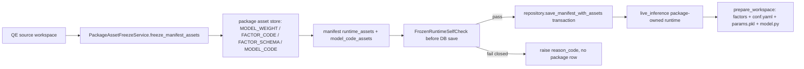

# StrategyPackage 冻结完整性与建包验证门 F2 设计（2026-07-01）

## Background / 背景

2026-07-01 战略 session 在真实 WSL `rdagent-gpu` qlib 环境（非 stub，交易日 2026-06-30，只读）验证：现有资产固化对 13 个 active 存量包只有 2 个真正 self-contained，其余 11 个在删除 QE 源后会失败。该结论来自 `F:\Dev\AIstock\docs\analysis\strategy_package_asset_freeze_runtime_oracle_findings_20260701.md`（当前为战略 session 取证文档；本设计把验收关键事实内嵌，避免依赖未合入文件）。

已定性缺陷在公共冻结路径 `backend/services/strategy_package/package_asset_freeze.py:821`：

1. `PackageAssetFreezeService.freeze_manifest_assets()` 当前只冻结 `FACTOR_CODE` 与 `MODEL_WEIGHT`，不冻结 Alpha158 schema；运行时 `backend/services/strategy_package/live_inference.py:461` 将 `disable_alpha158` 无条件改为 `True`，并在 `backend/services/strategy_package/live_inference.py:757` 写空 `conf.yaml`。
2. 自定义 NN 模型的 pickle 依赖 QE workspace 根目录 `model.py`，但冻结只复制 `params.pkl`；`backend/inference_engine.py:198` 的 `load_model_from_pkl()` 会把 `params.pkl` 所在目录加入 `sys.path`，因此 `model.py` 必须被释放到 `params.pkl` 同级。
3. 单 Alpha 建包 `backend/services/strategy_package/service.py:116` / `:131` / `:148`、组件包 `backend/services/strategy_package/components.py:101`、多 Alpha promotion `backend/services/strategy_package/multi_alpha_promotion.py:347` 均进入同一 freeze 契约；修复必须共用，不允许 single/multi 分叉。

### Phase 0 source-backed 取证

本轮按用户要求只读打开真实 QE 源，不写生产 DB，不启动服务：

- `pkg_006a42323f7c4e81a468fdaad2cb16a3`：生产只读 DB 显示 `source_type=qe_experiment`、`source_id=qe_20260413_084216`、`loop_id=Loop1`、`factor_count=32`，模型资产来自 `qe-workspace://node/wsl2-5080/tasks/qe_20260413_084216/loops/Loop1/mlruns/artifacts/params.pkl`。真实 WSL 路径 `F:\Dev\RD-Agent-main\qe_workspace\qe_20260413_084216\Loop1\conf.yaml` 存在 `qlib.contrib.data.loader.Alpha158DL` 节点，`kwargs.config.feature[1]` 为 20 个 aliases（首批 `RESI5/WVMA5/RSQR5/KLEN/RSQR10/...`）；该 workspace 根目录无 `model.py`，符合 qlib 原生 LGB 模型无需 `MODEL_CODE`。
- Tier2 correction: `pkg_006a` MUST NOT be the positive Alpha158 fixture. Its `NestedDataLoader` also depends on `StaticDataLoader combined_factors_df.parquet`; the current freeze can only reconstruct dynamic 32 + Alpha158 20 = 52 while model expected=63, leaving a +11 gap. Use it only as a fail-closed negative fixture.
- `pkg_99142cb1440c40a7824e83902f4e7da9` (`qe_20260416_082012/Loop1`) is the positive Alpha158 fixture. Real WSL oracle evidence: dynamic=50, Alpha158 aliases=20, model expected=70, factor_order=70.
- `pkg_2a9fccb83da840c9a27a2d7a4118af9a`：生产只读 DB 显示 `source_type=qe_evolution_loop`、`source_id=qe_20260513_151128_12ea`、`loop_id=Loop1`、`factor_count=57`，模型资产来自 `qe-workspace://node/wsl2-5080/tasks/qe_20260513_151128_12ea/loops/Loop1/mlruns/artifacts/params.pkl`。真实 WSL 路径 `F:\Dev\RD-Agent-main\qe_workspace\qe_20260513_151128_12ea\Loop1\model.py` 存在，文件 932 bytes，定义 `class LSTM_10D_hs64_d02(nn.Module)` 与 `model_cls = LSTM_10D_hs64_d02`；同目录 `conf.yaml` 含 `pt_model_uri: model.model_cls`，`mlruns/.../artifacts/` 下只有 `params.pkl`，无 `model.py`。
- `infra.compute_nodes` 只读显示 `wsl2-5080.workspace_base=/mnt/f/Dev/RD-Agent-main/qe_workspace`，映射到 `F:\Dev\RD-Agent-main\qe_workspace`；SSH 只读 `lc999@192.168.50.215` 的 `/home/lc999/projects/RD-Agent-main/qe_workspace` 存在但上述两个源路径不存在，因此本轮真实结构取证以 WSL 本机 workspace 为准。
- 15 个生产包终态只读复核：2 个 retired（`pkg_b4ce634c24bd470fac2c7b581a4e106f`、`pkg_95523262439644e49ae52f9b5087165d`），2 个 self-contained（`pkg_5a5ccb56ea5c4e3daaf6d836c8edfc27`、`pkg_b668f8a633c44b72a5d557a2cb8970e3`），其余 active 11 个需要 deprecated 标记但不回填、不删 QE 源。

Allowed APIs / 允许复用接口：

- `QEWorkspaceClient.download_mlruns_params()` 与 `download_workspace_file_bytes()`：见 `backend/services/quantevolver/qe_workspace_client.py:202`、`:271`，用于只读下载 `params.pkl` archive、`conf.yaml`、`model.py` 等 workspace 文件。
- `LocalPackageAssetStore.put/get/exists()`：见 `backend/services/strategy_package/package_asset_store.py:28`、`:43`、`:85`，用于内容寻址包自有 blob。
- Alpha158 解析现成逻辑：`backend/services/strategy_package/live_inference.py:1962`、`:1973`。
- 模型反序列化与特征数读取：`backend/inference_engine.py:198`。
- manifest hash 兼容点：`backend/services/strategy_package/manifest.py` 的 `_canonical_payload()` 会 neutralize `manifest_sha256/package_status`；新增默认字段必须在 canonical payload 中保持 legacy hash 兼容。

## Scope / 范围

本设计覆盖：

1. Alpha158 schema 随包冻结，并让 package-owned runtime 按 manifest 标记决定是否重算 Alpha158。
2. 自定义模型代码（通常 `model.py`，以及由它直接引用的本地 `.py` helper）随包冻结，并在运行时释放到 `params.pkl` 同级。
3. 建包后、入库前执行 fail-closed 冻结完整性自检；自检失败不写 `strategy_pkg.package` / `strategy_pkg.package_asset`，只返回具体错误。
4. 旧 11 个 active 但冻结不完整包只做 deprecated 标记方案：保留原 `package_status`、不回填、不删 QE 源、不触碰 2 个 self-contained 包资产。

## Non-Goals / 非目标与边界

- 不回填、修复、重冻旧 11 个包。
- 不删除任何 QE 源，不修改 QE workspace 文件。
- 不放宽 strict feature count 校验，不 pad/truncate，不把缺 Alpha158 当作 0 特征。
- 不改 PaperPortfolio 单 `package_id` 契约，不改 `qe_archive` 数仓，不改回测预测生成/存储。
- 不新增 `PackageStatus.DEPRECATED`；deprecated 使用轻量审计标记，避免扩张状态机。
- 本轮设计文档不执行生产 DML；旧包标记 SQL 进入生产 DML gate，需后续双授权窗口执行。
- 不启动/重启 backend/frontend/TDX/QE 服务。

## Architecture / 架构

### 总体流向



核心原则：freeze 产生的 manifest 与 `package_asset` ledger 是运行时唯一依据；运行时若进入 package-owned 路径，必须 `origin=package_asset`，不得因缺资产回退 QE DB/node。QE 源只在建包/冻结阶段读取，数仓不参与实验构建，UI 不依赖数仓。

### 新 runtime asset contract

在 `StrategyPackageManifest` 增加可选字段，legacy manifest 缺省为 `None`，新建包 freeze 后必须写入：

```python
class RuntimeAssetManifest(BaseModel):
    contract_version: Literal["strategy_package_runtime_assets_v2"]
    alpha158: Alpha158SchemaAsset

class Alpha158SchemaAsset(BaseModel):
    enabled: bool
    aliases: list[str] = Field(default_factory=list)
    alias_count: int = 0
    loader_class: str | None = None
    asset_ref: str | None = None
    sha256: str | None = None
    size_bytes: int | None = None
    source_uri: str | None = None

class ModelCodeAsset(BaseModel):
    module_name: str
    relative_path: str
    asset_ref: str
    sha256: str
    size_bytes: int
    source_uri: str | None = None
    required: bool = True
```

`ModelAsset` 增加 `model_code_assets: list[ModelCodeAsset] = []` 与 `model_code_required: bool = False`。`StrategyPackageManifest.runtime_assets` 与 `ModelAsset.model_code_assets=[]` 必须在 `manifest.py` 的 canonical hash 逻辑里对 legacy 空值做 drop-empty，避免 15 个既有 manifest 因 Pydantic default 注入再次产生 hash drift。

### 资产类型

- 复用现有 `StrategyPackageAssetType.FACTOR_SCHEMA`（`backend/services/strategy_package/package_asset.py:15`）存 Alpha158 schema payload，不新增 DB CHECK/DDL。
- 新增 Python enum `StrategyPackageAssetType.MODEL_CODE = "model_code"`，DB `strategy_pkg.package_asset.asset_type` 为 `TEXT` 且无 CHECK，因此 `production_ddl_gate=noop`。可选地在后续文档或评论中补充 asset_type 说明，但不作为运行时依赖。
- 继续使用 `MODEL_WEIGHT` / `FACTOR_CODE` 既有语义。

## Contracts / 契约

### Alpha158 schema asset payload

`FACTOR_SCHEMA` blob 内容为 UTF-8 JSON，例：

```json
{
  "schema_version": "strategy_package_alpha158_schema_v1",
  "loader_class": "qlib.contrib.data.loader.Alpha158DL",
  "loader_node": {"class": "qlib.contrib.data.loader.Alpha158DL", "kwargs": {"config": {"feature": [["..."], ["RESI5"]]}}},
  "aliases": ["RESI5", "WVMA5"],
  "expression_count": 20,
  "alias_count": 20,
  "source_conf_relpath": "conf.yaml"
}
```

契约：

- `enabled=True` 时 `asset_ref/sha256/aliases` 均必填，runtime 读取 blob 后校验 sha 与 aliases 一致；任一缺失抛 `strategy_package_alpha158_schema_missing` 或 `strategy_package_alpha158_schema_sha_mismatch`。
- `enabled=False` 时不得写假 aliases；runtime 设置 `disable_alpha158=True`。
- 新建包 freeze 必须从 QE 源 `conf.yaml` 抽取 `Alpha158DL` 节点；若 QE 源 `custom_params.disable_alpha158=False` 但 `conf.yaml` 未暴露 `Alpha158DL`，建包 fail-closed。

### Model code asset contract

- `model_code_required=True` 的判定来源：QE `conf.yaml` 中 `pt_model_uri` 指向非 qlib 内建模块（如 `model.model_cls`），或 build self-check 在无 model code 情况下捕获 `ModuleNotFoundError` / `Can't get attribute ... module 'model'`。
- `model_code_assets` 存 `model.py` 及其本地 direct import closure（仅 `.py`，相对路径必须位于 QE source root 内；禁止绝对路径、`..`、symlink escape）。
- qlib 原生模型（如 `LGBModel`）允许 `model_code_required=False` 且 `model_code_assets=[]`，但 build self-check 必须能反序列化通过。
- 有自定义类但代码缺失时抛 `strategy_package_model_code_missing`，不得把缺代码包保存为可用包。

### Runtime package-owned path contract

`live_inference.py::_source_from_package_assets()` 进入 package-owned runtime 后：

1. 从 manifest/ledger 读取 `FACTOR_CODE`、`MODEL_WEIGHT`、`FACTOR_SCHEMA`、`MODEL_CODE`，逐个 sha 校验。
2. 写 `factors/<factor>.py`。
3. 写 `mlruns/package_asset/artifacts/params.pkl`。
4. 将 `MODEL_CODE` 释放到 `params.pkl` 同级目录；`model.py` 目标路径为 `mlruns/package_asset/artifacts/model.py`。
5. 按 `runtime_assets.alpha158.enabled` 写 `conf.yaml`：启用时写包含真实 `Alpha158DL` node 的最小 conf；未启用时才 `disable_alpha158=True`。
6. `_manifest_runtime_custom_params()` 不再无条件覆盖为 True；如果新 contract 缺失或冲突，抛具体 reason_code。

## Design Acceptance Index / 设计验收索引

| id | 验收项 |
| --- | --- |
| F-001 | Alpha158 使用标记与 aliases/schema 从真实 QE `conf.yaml` 抽取并冻结为 package-owned `FACTOR_SCHEMA`。 |
| F-002 | Runtime 按 `runtime_assets.alpha158.enabled` 决定 `disable_alpha158`，启用时重建可被 `_extract_alpha158_aliases()` 读取的 `conf.yaml`。 |
| F-003 | Alpha158 标记启用但 schema/asset/sha/aliases 缺失时 fail-closed，禁止 silent disable。 |
| F-004 | 自定义模型代码解析并冻结为 `MODEL_CODE`；`pt_model_uri: model.model_cls` 对应 root `model.py`。 |
| F-005 | Runtime 将 `MODEL_CODE` 释放到 `params.pkl` 同级，使 `load_model_from_pkl()` 可反序列化自定义类。 |
| F-006 | qlib 原生模型允许无 `MODEL_CODE`，但必须通过建包自检。 |
| F-007 | 建包自检在入库前执行，断言 `origin=package_asset`、模型可反序列化、`expected_features == prepared.factor_order`。 |
| F-008 | 自检失败不写 `strategy_pkg.package` / `package_asset`，只返回带 package/source/asset context 的 reason_code。 |
| F-009 | single-alpha、component package、多 Alpha promotion 共用同一 freeze + self-check 契约，不分叉语义。 |
| F-010 | Manifest hash 对 legacy 默认空字段保持兼容，不再次制造 manifest_sha256 drift。 |
| F-011 | 旧 11 个 active 冻结不完整包只做 deprecated 审计标记，保留原 `package_status`、不回填、不删源。 |
| F-012 | 不触碰 `pkg_5a5ccb56ea5c4e3daaf6d836c8edfc27` 与 `pkg_b668f8a633c44b72a5d557a2cb8970e3` 的资产。 |
| F-013 | 生产 DDL 为 noop；旧包 deprecated 是单独生产 DML gate，需双授权。 |
| F-014 | 测试覆盖 Alpha158 特征数、自定义 NN 反序列化、自检 fail-closed 三个杀手场景。 |

## Implementation Plan / 实施方案

### Phase 1: Manifest 与 asset type

文件：`backend/services/strategy_package/models.py:127`、`:243`，`backend/services/strategy_package/package_asset.py:12`，`backend/services/strategy_package/manifest.py`。

- 新增 `RuntimeAssetManifest`、`Alpha158SchemaAsset`、`ModelCodeAsset`。
- `StrategyPackageManifest` 增 `runtime_assets: RuntimeAssetManifest | None = None`。
- `ModelAsset` 增 `model_code_required: bool = False`、`model_code_assets: list[ModelCodeAsset] = []`。
- `StrategyPackageAssetType` 增 `MODEL_CODE = "model_code"`。
- `_drop_empty_asset_fields()` / `_drop_empty_asset_field_defaults()` 对 `runtime_assets is None`、`model_code_assets == []`、`model_code_required is False` 做 legacy drop-empty，避免旧 manifest hash drift。

### Phase 2: Freeze Alpha158 schema

文件：`backend/services/strategy_package/package_asset_freeze.py:40`、`:85`、`:821`。

- 扩展 `PackageAssetBytes` 为 `PackageAssetBytes(data, source_uri, local_path=None, source_root=None, locator=None)`，保留 params 来源定位能力。
- 在 `StrategyPackageAssetSource` 增 `conf_yaml_bytes(manifest)`：优先中心/本地 source root，fallback `QEWorkspaceClient.download_workspace_file_bytes(..., "conf.yaml")`，所有 miss 写入 attempts。
- 复用/抽取 `live_inference.py` 的 `_load_qe_conf_yaml()`、`_find_alpha158_aliases()` 逻辑到可共享模块（如 `runtime_schema.py`），避免 copy-paste 解析漂移。
- `freeze_manifest_assets()` 在冻结 factor/model 前后调用 `_freeze_alpha158_schema()`：
  - `conf.yaml` 有 `Alpha158DL`：生成 `FACTOR_SCHEMA` blob 与 `runtime_assets.alpha158.enabled=True`。
  - `conf.yaml` 无 `Alpha158DL` 且源 custom params 未要求 Alpha158：写 `enabled=False`。
  - 源 custom params 表明 `disable_alpha158=False` 但 `conf.yaml` 无 schema：抛 `strategy_package_alpha158_schema_missing`。

### Phase 3: Freeze model code

文件：`backend/services/strategy_package/package_asset_freeze.py:85`、`:263`、`:899`、`:1373`。

- `model_params_bytes()` 返回 params bytes 时保留 `source_root/local_path/locator`。
- 新增 `model_code_bytes(manifest, model, params_source)`：
  - 从同一 QE source `conf.yaml` 解析 `task.model.kwargs.pt_model_uri`，例如 `model.model_cls` -> module `model` -> `model.py`。
  - 对 module 文件做 safe path 校验；读取 `model.py` 后用 `ast` 收集本地 direct import closure（同 source root 下 `.py`），递归深度有限且记录 closure 列表。
  - 中心 store miss 时走 locator：`download_workspace_file_bytes(..., "model.py")` 或 closure 中相对路径；WSL/local roots 同理。
  - 如果 `pt_model_uri` 指向 qlib/sklearn/lightgbm 等内建模块，`model_code_required=False`。
- `_freeze_model()` 冻结 `MODEL_WEIGHT` 后冻结 `MODEL_CODE` assets 并写入对应 `ModelAsset.model_code_assets`。已有 `asset_ref/sha256` 的模型仍需校验 `model_code_assets` sha，不允许只校验 weight。

### Phase 4: Runtime read 改造

文件：`backend/services/strategy_package/live_inference.py:461`、`:695`、`:757`、`:1769`、`:1962`。

- `_manifest_runtime_custom_params()`：
  - legacy manifest 无 `runtime_assets`：保持兼容，默认 `disable_alpha158=True`，但记录 `runtime_contract_source=strategy_package_package_assets_legacy`。
  - v2 manifest 且 `alpha158.enabled=True`：校验 schema asset 存在，设置 `disable_alpha158=False`。
  - v2 manifest 且 `alpha158.enabled=False`：设置 `disable_alpha158=True`。
- `_source_from_package_assets()`：
  - 读取 `runtime_assets.alpha158` schema asset，写最小 `conf.yaml`；禁止继续无条件写 `task: {}`。
  - 读取 `model_code_assets` 并释放到 `model_dir`；路径必须在 `model_dir` 下。
  - 所有 asset missing / sha mismatch 继续用 `PackageAssetInvalidError` 或 `DataUnavailableError` fail-closed。
- `prepare_workspace()` 不改 strict 逻辑；`_build_factor_order()` 继续 `disable_alpha158=False -> _extract_alpha158_aliases(conf_path)`。

### Phase 5: 建包自检门

新增文件建议：`backend/services/strategy_package/frozen_runtime_self_check.py`。

调用点：

- `backend/services/strategy_package/service.py:116`、`:131`、`:148`：`freeze_manifest_assets()` 与 `validator.validate_manifest()` 后、`repository.save_manifest_with_assets()` 前。
- `backend/services/strategy_package/components.py:101`：component/parent package 保存前。
- `backend/services/strategy_package/multi_alpha_promotion.py:347`：promotion manifest 保存前。

自检默认采用“轻量真实 runtime 组装”而不是全量选股：

1. 用 `QEExperimentRuntimeAssetResolver.load_source_for_strategy_package()` 传入故意不存在的 `source_id/loop_id`，迫使 package-owned 路径工作；断言 `source.model_params_origin == "package_asset"`。
2. 调 `prepare_workspace()` 释放 factor code、Alpha158 conf、params、model code。
3. 调 `load_model_from_pkl(prepared.model_params_path)`：捕获缺 `model.py` / 自定义类不可反序列化。
4. 若 loader 返回 `num_features_expected`，断言 `num_features_expected == len(prepared.factor_order)`：捕获 Alpha158 schema 缺失。
5. 对多模型 manifest：按 `model_asset` 列表逐个释放并反序列化；多 Alpha parent 还要对每个 child/component manifest 执行同一 helper，保证腿级 package 也满足契约。

选择轻量自检的理由：它覆盖缺陷 A（特征数 mismatch）和缺陷 B（pickle 反序列化失败），且不跑昂贵 WSL 全推理。L2/L5 验收仍需至少对 Alpha158 包与自定义 NN 包跑真实 WSL oracle，证明新建包在模拟删源后能出新交易日 signal。

### Phase 6: 旧 11 包 deprecated 标记

不新增状态、不改 `manifest_json`、不改 `manifest_sha256`、不写 `package_asset`。使用 `strategy_pkg.package_status_event` 追加同状态审计事件，作为轻量 deprecated marker。

需标记的 11 个 active 包（排除 2 good 与 2 retired）：

1. `pkg_006a42323f7c4e81a468fdaad2cb16a3`
2. `pkg_09750b4944ca434db03efd399ccf2144`
3. `pkg_1de32357724a4c5b874f2abd90f22da5`
4. `pkg_2563063e544f4d1fa601e740d019f8c7`
5. `pkg_2a9fccb83da840c9a27a2d7a4118af9a`
6. `pkg_378eb9c91e104c64935404e257e932ee`
7. `pkg_99142cb1440c40a7824e83902f4e7da9`
8. `pkg_a2f53f3f2f3e4095a910b939464c35e6`
9. `pkg_b2faccade8d549af9621c51d285bdc06`
10. `pkg_c4703dfc2fdf4e548cf8dd3027ef228b`
11. `pkg_cfa3c5b4068d4db1ad06db352bfece93`

生产 DML 计划（后续双授权后执行；本设计不执行）：

```sql
BEGIN;

WITH targets(package_id) AS (
    VALUES
      ('pkg_006a42323f7c4e81a468fdaad2cb16a3'),
      ('pkg_09750b4944ca434db03efd399ccf2144'),
      ('pkg_1de32357724a4c5b874f2abd90f22da5'),
      ('pkg_2563063e544f4d1fa601e740d019f8c7'),
      ('pkg_2a9fccb83da840c9a27a2d7a4118af9a'),
      ('pkg_378eb9c91e104c64935404e257e932ee'),
      ('pkg_99142cb1440c40a7824e83902f4e7da9'),
      ('pkg_a2f53f3f2f3e4095a910b939464c35e6'),
      ('pkg_b2faccade8d549af9621c51d285bdc06'),
      ('pkg_c4703dfc2fdf4e548cf8dd3027ef228b'),
      ('pkg_cfa3c5b4068d4db1ad06db352bfece93')
), locked AS (
    SELECT p.package_id, p.package_status, p.manifest_sha256
    FROM strategy_pkg.package p
    JOIN targets t USING (package_id)
    WHERE p.package_status <> 'RETIRED'
    FOR UPDATE
)
INSERT INTO strategy_pkg.package_status_event (
    package_id, from_status, to_status, reason, context
)
SELECT
    package_id,
    package_status,
    package_status,
    'strategy_package_runtime_deprecated',
    jsonb_build_object(
        'batch_id', 'strategy_package_freeze_completeness_20260701',
        'reason_code', 'strategy_package_legacy_freeze_incomplete_not_repaired',
        'deprecation_reason', 'legacy frozen package lacks Alpha158 schema and/or MODEL_CODE; QE source retained as last-resort fallback',
        'manifest_sha256', manifest_sha256,
        'status_preserved', true
    )
FROM locked
WHERE NOT EXISTS (
    SELECT 1
    FROM strategy_pkg.package_status_event e
    WHERE e.package_id = locked.package_id
      AND e.reason = 'strategy_package_runtime_deprecated'
      AND e.context->>'batch_id' = 'strategy_package_freeze_completeness_20260701'
);

-- Operator gate must assert inserted row count is exactly 11 on first apply, or 0 on idempotent re-run.
COMMIT;
```

Rollback 不删除审计行，而是追加 `strategy_package_runtime_deprecation_retracted` 事件，context 带 `retracted_batch_id`；这符合审计不可篡改原则。

## Verification Plan / 验证方案

### L0 static

- `python -m compileall backend/services/strategy_package backend/inference_engine.py`
- `python scripts/aistock_feature_workflow.py validate --design docs/analysis/strategy_package_freeze_completeness_and_build_gate_f2_design_20260701.md --tier F2`
- `git diff --check`

### L1 unit / component tests

新增或扩展 `backend/tests/strategy_package/`：

- Alpha158 freeze：构造含 `Alpha158DL` 的真实 `conf.yaml` fixture，断言 `FACTOR_SCHEMA` asset、`runtime_assets.alpha158.enabled=True`、aliases 数正确。
- Alpha158 runtime：用 frozen manifest 走 `_source_from_package_assets()`，断言写出的 `conf.yaml` 可被 `_extract_alpha158_aliases()` 读出相同 aliases。
- Alpha158 fail-closed：`enabled=True` 但 schema asset 缺失 / sha mismatch，断言 reason_code 为 `strategy_package_alpha158_schema_missing` / `strategy_package_alpha158_schema_sha_mismatch`。
- MODEL_CODE freeze：以 `pt_model_uri: model.model_cls` + `model.py` fixture 冻结，断言 `MODEL_CODE` row 与 `ModelAsset.model_code_assets`。
- MODEL_CODE runtime：冻结后删除 QE source fixture，只从 package asset materialize，`load_model_from_pkl()` 可反序列化 `LSTM_10D_hs64_d02`。
- Native model：LGB fixture 无 `model.py`，`model_code_required=False` 且 self-check pass。
- Build gate fail：故意删 Alpha158 schema 或 `model.py`，断言建包失败且 repository 无 package row / asset row。
- Multi-alpha parity：single 与 multi-alpha parent/component 均调用同一 self-check helper，并对缺资产报同一 reason_code family。

### L2 integration / oracle

- Positive `pkg_99142c` (`qe_20260416_082012/Loop1`): dev/test scratch package self-check must PASS with `dynamic=50`, `alpha158=20`, `model_expected_features=70`, `factor_order=70`, `feature_count_delta=0`; then a real WSL oracle must pass a nonexistent QE source id to force package-owned runtime, assert `origin=package_asset`, and produce a fresh 2026-06-30 selection signal without saving artifacts or writing production selection artifacts.
- Positive `pkg_2a9` (`qe_20260513_151128_12ea/Loop1`): scratch freeze must materialize `model.py` beside `params.pkl`; the WSL probe must deserialize `LSTM_10D_hs64_d02` and report `dynamic=57`, `alpha158=0`, `model_expected_features=57`, `factor_order=57`; then a real WSL oracle must pass a nonexistent QE source id to force package-owned runtime, assert `origin=package_asset`, and produce a 2026-06-30 selection signal.
- `pkg_006a` is negative/fail-closed only: self-check must explicitly report `dynamic=32` + `alpha158=20` still below expected=63 and include `feature_count_delta=11`; pad/truncate is forbidden, and this fixture must never be marked PASS.

### L3 regression / isolation

- StrategyPackage 现有 selection/paper/service/repository 测试全绿。
- grep 检查无 silent fallback：`except: pass`、`disable_alpha158=True` 无条件覆盖、`pad`/`truncate` 特征补齐均不得出现在新增路径。
- 旧 2 self-contained 包资产行数、manifest sha 不变。
- deprecated DML dry-run 只命中 11 个目标，排除 retired 与 2 good。

### 三个杀手测试

1. 模型使用 Alpha158 的包冻结后，package-owned runtime 的 `prepared.factor_order` 包含 Alpha158 aliases，特征数与模型期望一致。
2. 自定义 NN 包冻结后，在模拟删源下 `load_model_from_pkl()` 可反序列化自定义类。
3. 建包自检对缺 Alpha158 schema 或缺 `model.py` 的冻结结果 fail-closed，且不入库半包。

## Design Acceptance Matrix / 设计验收矩阵

| design_item | implementation_refs | test_or_evidence | status | gap_or_exception |
| --- | --- | --- | --- | --- |
| F-001 | `backend/services/strategy_package/package_asset_freeze.py`; `backend/services/strategy_package/runtime_schema.py`; `backend/services/strategy_package/models.py` | `backend/tests/strategy_package/test_freeze_completeness_build_gate.py::test_alpha158_schema_freezes_full_node_and_runtime_conf_is_readable`; WSL oracle `pkg_99142c` dynamic=50 + alpha158=20 = expected=70 | verified | - |
| F-002 | `backend/services/strategy_package/live_inference.py`; `backend/services/strategy_package/runtime_schema.py` | runtime conf aliases test; WSL oracle `pkg_99142c` `origin=package_asset`, `factor_order_count=70`, `score_count=1359` | verified | - |
| F-003 | `backend/services/strategy_package/live_inference.py`; `backend/services/strategy_package/package_asset_freeze.py` | `test_alpha158_schema_missing_and_sha_mismatch_fail_closed`; reason_code `strategy_package_alpha158_schema_missing` / `strategy_package_alpha158_schema_sha_mismatch` | verified | - |
| F-004 | `backend/services/strategy_package/package_asset.py`; `backend/services/strategy_package/models.py`; `backend/services/strategy_package/package_asset_freeze.py` | `test_model_code_freeze_and_runtime_materializes_next_to_params`; `test_custom_model_missing_code_fails_closed`; `test_custom_model_missing_import_helper_fails_closed`; WSL oracle `pkg_2a9` model_kind=pytorch | verified | - |
| F-005 | `backend/services/strategy_package/live_inference.py`; `scripts/strategy_package_frozen_self_check.py`; `backend/inference_engine.py` | `MODEL_CODE` materialized beside `params.pkl`; WSL self-check probe `pkg_2a9` expected=57, factor_order=57, `score_count=1032` | verified | - |
| F-006 | `backend/services/strategy_package/frozen_runtime_self_check.py`; `backend/services/strategy_package/package_asset_freeze.py` | `test_self_check_passes_when_model_expected_matches_alpha158_and_dynamic`; qlib-native `pkg_99142c` WSL probe model_kind=lgb without MODEL_CODE | verified | - |
| F-007 | `backend/services/strategy_package/frozen_runtime_self_check.py`; `backend/services/strategy_package/service.py`; `backend/services/strategy_package/components.py`; `backend/services/strategy_package/multi_alpha_promotion.py` | L1 self-check origin/model/features assertions; WSL oracle `self_check.origin=package_asset`, `feature_count_delta=0` for both fixtures | verified | - |
| F-008 | `backend/services/strategy_package/service.py`; `backend/services/strategy_package/repository.py`; `backend/tests/strategy_package/test_package_asset_freeze_batch1.py` | freeze missing factor/model tests keep repository empty; self-check failure happens before `save_manifest_with_assets` call sites | verified | - |
| F-009 | `backend/services/strategy_package/service.py`; `backend/services/strategy_package/components.py`; `backend/services/strategy_package/multi_alpha_promotion.py` | `python -m pytest backend/tests/strategy_package/test_multi_alpha_promotion.py -q`; common `FrozenRuntimeSelfCheckService` injected into single/component/promotion paths | verified | - |
| F-010 | `backend/services/strategy_package/manifest.py`; `backend/services/strategy_package/models.py` | `python scripts/strategy_package_manifest_hash_repair.py --env-file F:\Dev\AIstock\.env --target-db prod --limit 500` => total_scanned=15 clean_count=15 drifted_count=0 | verified | - |
| F-011 | `scripts/strategy_package_runtime_deprecated_marker.py` | dry-run `counts.insert_deprecation_event=11`; SQL effect append-only `package_status_event`; no status/manifest/asset mutation | verified | explicitly approved by user for PR scope: production DML pending dual authorization; not executed in PR |
| F-012 | `scripts/strategy_package_runtime_deprecated_marker.py` | dry-run protected exclusions include `pkg_5a5ccb56...`, `pkg_b668f8a...`, retired `pkg_b4ce...`, `pkg_9552...`; blocked_count=0 | verified | - |
| F-013 | no DB schema change; `package_asset.asset_type` is TEXT; DML script gated | `production_ddl_gate=noop`; `production_dml_gate=pending_user_dual_authorization` | verified | - |
| F-014 | `backend/tests/strategy_package/test_freeze_completeness_build_gate.py`; WSL oracle summary `rdagent_assets/strategy_package_runtime/freeze_completeness_oracle/oracle_summary.json` | three killer tests covered; real WSL oracle `pkg_99142c` and `pkg_2a9` both produced 2026-06-30 signals from package assets | verified | - |

## Rollout / Rollback / 发布回滚

### Rollout

1. Merge code after design approval and implementation Tier2 review.
2. No production DDL.
3. Restart remains user-owned; merged code is not live activation.
4. Run dev/test DB package creation for Alpha158 and custom NN fixtures.
5. Run real WSL oracle for at least one Alpha158 package and one custom NN package under bogus QE source id.
6. After code is live and user separately authorizes DML, execute deprecated marker plan for 11 old packages.

### Rollback

- Code rollback：revert PR；legacy manifests with no v2 runtime assets continue using legacy package-owned behavior or existing QE fallback logic where applicable。
- Asset blobs：content-addressed immutable blobs may remain orphaned if build self-check fails before DB save；they are not referenced by `package_asset` and can be handled by later GC，不影响 runtime。
- Deprecated marker rollback：append `strategy_package_runtime_deprecation_retracted` event；不删除审计。

## Risks / Failure Modes / 风险与失败模式

- Alpha158 schema 只冻 aliases 不冻 expression 会导致 qlib 重算不一致：缓解为 `FACTOR_SCHEMA` asset 保存完整 `Alpha158DL` node（含 expressions 与 aliases），runtime 从 asset 写 conf。
- 新字段默认值改变 legacy hash：缓解为 `manifest.py` drop-empty 兼容并加 15 包 integrity scan。
- 自定义模型不止 `model.py`：缓解为解析 `pt_model_uri` module + AST 本地 import closure；无法解析即 fail-closed。
- 中心 store 只有 `params.pkl` 无 source root：缓解为复用 locator 查 QE node/WSL source；所有 miss 写 attempts。
- 自检过重影响建包：默认轻量 prepare + pickle + feature count；全 WSL oracle 仅验收/CI 特定样本执行。
- 多 Alpha parent feature mapping 复杂：缓解为 parent 与 component/child manifest 均执行同一 contract helper；若 parent 多模型无法安全映射，helper fail-closed，不保存半包。

## Production Gates / 生产门禁

- `production_ddl_gate=noop`：本设计不新增/修改 DB schema；`package_asset.asset_type` 是 TEXT，无 CHECK 变更。
- `production_dml_gate=pending_user_dual_authorization`：旧 11 包 deprecated marker 是生产 DML，只插入 `package_status_event`，不更新 package status/manifest/assets；本设计不执行。
- `production_frontend_dependency_gate=noop`：无前端依赖变化。
- `production_backend_dependency_gate=noop`：无 Python 依赖清单变化；真实 WSL oracle 环境依赖由用户/运行环境独立管理。
- Runtime activation：不启/重启服务；合并后是否重启由用户决定。
