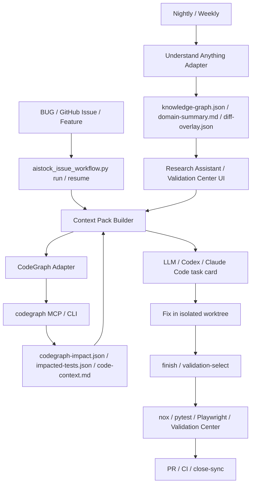
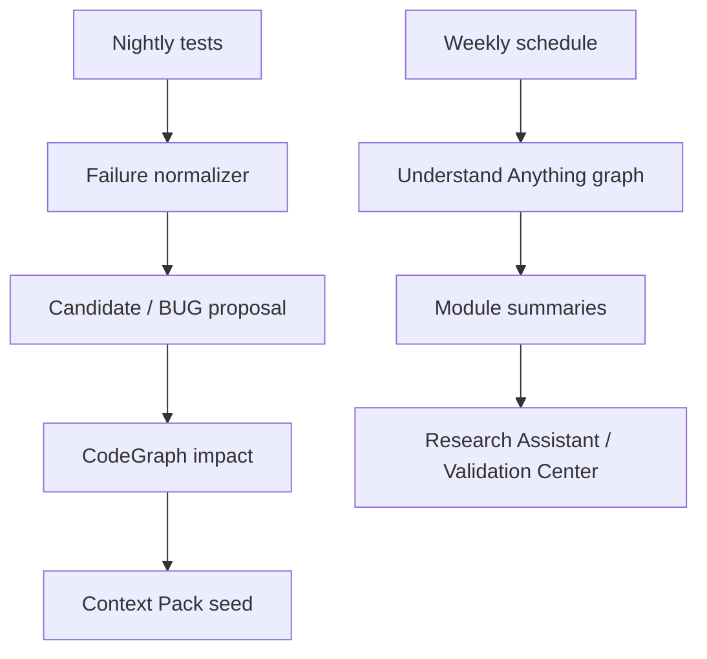

# AIstock CodeGraph / Understand Anything 代码知识图谱集成设计方案

版本：v1.0  
日期：2026-05-26  
状态：设计草案，待实施  
继承基线：`docs/architecture/aistock_issue_workflow_opensource_cicd_design_v2_20260525.md`、`docs/architecture/aistock_issue_workflow_opensource_cicd_design_20260524.md`、`docs/architecture/aistock_research_agent_console_design_20260520.md`、`docs/architecture/research_assistant_memory_graph_bootstrap_design_20260523.md`  
新增组件：CodeGraph、Understand Anything  
边界：本文只设计集成方案，不修改业务代码、不安装依赖、不生成索引、不触碰生产端口 `8001/3000`、不执行生产 DB DDL。

## 1. 执行结论

这个方案应该在下一轮大规模后续阶段开始前完成设计，并建议在下一阶段研发中优先落地 CodeGraph 的最小集成，再把 Understand Anything 放入 Nightly / Weekly / Research Assistant 方向逐步接入。

原因不是“增加一个新工具”，而是解决 AIstock 当前 issue 处理慢、token 消耗大、重复扫描多的根因之一：每个 Codex / Claude Code 窗口都在重新探索代码结构、调用链、受影响测试和模块关系。CodeGraph 与 Understand Anything 正好对应两类不同层级的代码智能：

1. **CodeGraph**：本地、确定性、MCP 优先的代码结构索引。适合在 issue 修复、PR 验证、CI 影响分析中作为默认代码结构入口，减少 grep/read 循环和重复探索。
2. **Understand Anything**：结构 + LLM 语义的交互式知识图谱。适合 Nightly / Weekly、Research Assistant、模块 onboarding、架构理解和人类审阅，不适合作为每个 PR 的 blocking gate。
3. 二者都不应替代 GitHub Issues、BUG JSON、Validation Center、nox、GitHub Actions 或 `scripts/aistock_issue_workflow.py`。它们只作为“代码智能与知识图谱适配层”，为 Context Pack、task card、validation selector 和 Research Assistant 提供证据。
4. 集成方式应优先使用上游 MCP / skill / CLI，不 fork、不深度改造、不把 AIstock 强绑定到工具内部 schema。AIstock 只保存 adapter 输出的轻量 manifest、impact summary、context refs 和 validation evidence。
5. 先完成这两个组件的设计，可以避免后续 issue workflow Phase 2-8、Nightly、Research Assistant、Validation Center UI 各自重复做一套代码关系索引。

## 2. 事实源与工具能力核对

### 2.1 CodeGraph

| 项 | 当前事实 |
| --- | --- |
| 仓库 | `https://github.com/colbymchenry/codegraph` |
| NPM 包 | `@colbymchenry/codegraph` |
| 当前核对版本 | `0.9.4`，release `v0.9.4`，2026-05-24 发布 |
| License | MIT |
| 安装入口 | `npx @colbymchenry/codegraph`、`npm i -g @colbymchenry/codegraph`、Windows PowerShell installer |
| Agent 支持 | Claude Code、Cursor、Codex CLI、opencode、Hermes Agent |
| 项目索引 | `.codegraph/codegraph.db`，本地 SQLite + FTS5 |
| MCP 启动 | `codegraph serve --mcp` |
| 主要 CLI | `init`、`index`、`sync`、`status`、`query`、`files`、`context`、`callers`、`callees`、`impact`、`affected` |
| 主要 MCP tools | `codegraph_context`、`codegraph_trace`、`codegraph_explore`、`codegraph_search`、`codegraph_callers`、`codegraph_callees`、`codegraph_impact`、`codegraph_node`、`codegraph_status`、`codegraph_files` |
| 适合场景 | 快速定位代码入口、调用链、影响半径、受影响测试、Context Pack 代码片段 |
| 不适合场景 | 业务语义权威、数据质量判断、production gate、替代 nox/pytest/Playwright |

### 2.2 Understand Anything

| 项 | 当前事实 |
| --- | --- |
| 仓库 | `https://github.com/Lum1104/Understand-Anything` |
| 当前核对版本 | release `v2.7.3`，2026-05-19 发布 |
| License | MIT |
| 安装入口 | Claude plugin：`/plugin install understand-anything`；Codex 等平台：`install.sh codex` / `install.ps1` |
| Agent 支持 | Claude Code、Codex、Cursor、Copilot、Gemini CLI、OpenCode、Hermes、Cline、KIMI 等 |
| 项目图谱 | `.understand-anything/knowledge-graph.json` |
| 主要 skills | `understand`、`understand-dashboard`、`understand-diff`、`understand-chat`、`understand-domain`、`understand-knowledge` |
| 分析机制 | Tree-sitter 确定性结构抽取 + LLM 语义总结、层级、业务域、tour、review |
| schema | 节点包括 `file/function/class/module/concept/config/document/service/table/endpoint/pipeline/schema/resource`；边包括 `imports/calls/tested_by/routes/reads_from/writes_to/...` |
| 适合场景 | 模块 onboarding、架构图谱、业务域映射、Research Assistant 语义检索、Validation Center 可视化 |
| 不适合场景 | 每个小 issue 的同步阻断检查、无预算限制的全仓 LLM 扫描、替代确定性测试选择 |

## 3. 与现有 AIstock 方案的关系

### 3.1 不改变的 source of truth

| 领域 | 事实源不变 | CodeGraph / Understand Anything 角色 |
| --- | --- | --- |
| Issue 协作 | GitHub Issues | 只补充定位上下文和影响范围 |
| Bug 机器记录 | `tests/aistock_validation/bugs/*.json` | 只引用 BUG ID、scope、evidence refs |
| 验证执行 | `noxfile.py`、pytest、Playwright、Validation Center | CodeGraph 可建议 impacted tests；最终仍由 nox / CI 执行 |
| 代码合入 | PR + GitHub Actions + branch protection | 只提供 PR impact summary 和 review 辅助 |
| 生产门禁 | `production_ddl_gate`、dependency gates、runtime owner rules | 不替代、不自动豁免 |
| Research Assistant 长期记忆 | AIstock Memory Ledger / graph tables / approved facts | Understand Anything 可作为候选图谱输入，需带 provenance 和 approval |

### 3.2 插入位置



### 3.3 决策

1. **下一阶段前必须完成本文档设计**：否则后续 issue workflow、Nightly、Research Assistant 仍会按旧方式各自扩展，容易产生三套 context/graph/impact 逻辑。
2. **下一阶段研发优先级为 CodeGraph first**：因为它有 MCP、CLI、affected tests、SQLite 本地索引，更直接改善 issue 修复与 token 消耗。
3. **Understand Anything 作为第二条线**：先纳入设计与轻量 manifest，后续放入 Nightly / Weekly 和 Research Assistant，不作为小 issue 的必跑步骤。
4. **不做深度定制**：AIstock 只写 wrapper 和 adapter，不改上游工具，不复制其内部算法，不把 `.codegraph` / `.understand-anything` 的大文件默认纳入 Git。

## 4. 集成原则

1. **MCP / skill / CLI 优先**：优先使用 CodeGraph MCP、Understand Anything skills；CLI 作为 CI / headless fallback。
2. **轻适配，不 fork**：AIstock 只维护 `scripts/code_intelligence_adapter.py` 这类薄包装，把上游输出转换为 Context Pack 可消费的 summary。
3. **索引不是事实源**：图谱结果必须带 `generated_at`、`tool_version`、`git_commit`、`source_files`、`staleness`。
4. **按需加载，不全文注入**：Context Pack 只纳入 top symbols、call paths、impact summary、affected tests，不读完整 graph DB / JSON。
5. **分层预算**：T0/T1 小 issue 默认只用 CodeGraph；T2/T3 或 onboarding 才使用 Understand Anything。
6. **可降级**：CodeGraph / Understand Anything 缺失或过期时，不阻断 issue workflow；降级到现有 `rg` + `file_ownership.yaml` + `test_plans.yaml`，并记录 warning。
7. **不污染 root**：索引与图谱生成必须在 task worktree 或专用 artifact 目录执行，root `F:\Dev\AIstock` 只作为 clean sync baseline。
8. **不触碰生产**：不得因图谱生成启动生产 `8001/3000`、执行 DB DDL 或改变 runtime dependency。
9. **可升级**：版本锁定在配置中，上游升级只需改版本与重跑 adapter tests。
10. **安全排除**：必须通过 `.gitignore`、`.codegraph` 默认规则、`.understandignore` 或 wrapper 排除 secrets、大型数据、构建产物和本地缓存。

## 5. 目标架构

### 5.1 新增目录和文件建议

| 路径 | 类型 | 作用 |
| --- | --- | --- |
| `docs/architecture/aistock_code_intelligence_integration_design_20260526.md` | 文档 | 本设计方案 |
| `docs/standards/aistock_code_intelligence_usage_standard.md` | 后续可选 | 工具使用规范；初期可先不拆分 |
| `scripts/code_intelligence_adapter.py` | 后续实现 | CodeGraph / Understand Anything 的统一薄适配 CLI |
| `tests/aistock_validation/catalog/code_intelligence.yaml` | 后续实现 | 工具版本、启用策略、预算、排除规则 |
| `tests/aistock_validation/catalog/issue_workflow.yaml` | 已规划/补充 | issue workflow 引用 code intelligence selector |
| `.codegraph/` | 本地 artifact | CodeGraph SQLite index；默认不提交 |
| `.understand-anything/` | 本地 artifact | Understand Anything graph；默认不提交，精选 snapshot 需单独审批 |
| `tmp/issue_workflow/<ID>/codegraph-impact.json` | workflow artifact | issue 级 impact summary |
| `tmp/issue_workflow/<ID>/codegraph-context.md` | workflow artifact | issue 级代码上下文摘要 |
| `tmp/issue_workflow/<ID>/affected-tests.json` | workflow artifact | suggested impacted tests |
| `tests/aistock_validation/history/<run>/code-intelligence/` | validation artifact | CI / nightly code intelligence 证据 |

### 5.2 Adapter CLI 设计

后续新增统一命令，不直接把上游命令散落在 workflow 脚本里：

```bash
python scripts/code_intelligence_adapter.py doctor
python scripts/code_intelligence_adapter.py ensure-index --tool codegraph --path F:\Dev\AIstock_worktrees\...
python scripts/code_intelligence_adapter.py context --bug-id BUG-XXX --query "..." --max-symbols 12
python scripts/code_intelligence_adapter.py impact --changed-files changed-files.txt --json-out tmp/.../codegraph-impact.json
python scripts/code_intelligence_adapter.py affected-tests --changed-files changed-files.txt --json-out tmp/.../affected-tests.json
python scripts/code_intelligence_adapter.py ua-status --path F:\Dev\AIstock
python scripts/code_intelligence_adapter.py ua-summary --module paper_v2 --json-out tmp/.../ua-summary.json
```

CLI 输出统一 schema：

```json
{
  "tool": "codegraph",
  "tool_version": "0.9.4",
  "adapter_version": "1.0",
  "repo": "licong01-cloud/AIstock",
  "git_commit": "<sha>",
  "worktree": "<path>",
  "generated_at": "<iso8601>",
  "status": "ok|warning|blocked|unavailable",
  "staleness": {
    "index_commit": "<sha-or-null>",
    "working_tree_dirty": true,
    "needs_sync": false
  },
  "outputs": {
    "context_markdown": "tmp/issue_workflow/BUG-XXX/codegraph-context.md",
    "impact_json": "tmp/issue_workflow/BUG-XXX/codegraph-impact.json",
    "affected_tests_json": "tmp/issue_workflow/BUG-XXX/affected-tests.json"
  },
  "fallback": {
    "used": false,
    "reason": null
  }
}
```

## 6. CodeGraph 详细集成方案

### 6.1 安装与版本策略

建议：

1. 本机全局安装或由用户级工具安装，项目不 vendoring CodeGraph。
2. CI / self-hosted runner 使用 `npx @colbymchenry/codegraph@0.9.4` 或缓存后的全局 `codegraph`。
3. 版本写入 `tests/aistock_validation/catalog/code_intelligence.yaml`，默认 pinned，升级走独立 PR。
4. `doctor` 检查 `codegraph --version`、`codegraph status`、MCP server 配置和 `.codegraph` 存在性。
5. 如果未安装，workflow 不失败，只输出：`code_intelligence_status=unavailable`，并使用现有 fallback。

配置示例：

```yaml
codegraph:
  enabled: true
  required_for_p0: false
  version: "0.9.4"
  install_mode: "global_or_npx"
  mcp_server: "codegraph serve --mcp"
  project_index_dir: ".codegraph"
  commit_index: false
  ci_mode: "warning"
  max_context_symbols_t1: 8
  max_context_symbols_t2: 16
  max_impact_depth: 3
```

### 6.2 本地开发工作流

#### 6.2.1 新 issue 启动

`aistock_issue_workflow.py run --bug-id BUG-XXX --mode plan` 后续应调用：

1. `code_intelligence_adapter.py doctor`
2. 如果 `.codegraph` 不存在：
   - T0/T1：提示/记录 warning，不阻断。
   - T2/T3 或用户要求：运行 `codegraph init -i` 或 `codegraph index`。
3. 调用 `codegraph context <task>` 或 MCP `codegraph_context`，生成 `codegraph-context.md`。
4. 调用 `codegraph files` / `query` / `impact` 补充候选文件。
5. 把结果写入 `context-pack.json`：

```json
{
  "code_intelligence": {
    "provider": "codegraph",
    "status": "ok",
    "summary_ref": "tmp/issue_workflow/BUG-XXX/codegraph-context.md",
    "impact_ref": "tmp/issue_workflow/BUG-XXX/codegraph-impact.json",
    "top_symbols": [
      {"name": "PaperTradingReadinessService", "path": "backend/services/...", "reason": "matched issue query"}
    ],
    "token_saving_strategy": "use symbol summaries before raw file reads"
  }
}
```

#### 6.2.2 修复中

Codex / Claude Code 应遵循：

1. 先查询 CodeGraph MCP，避免全仓 `rg` / Read 循环。
2. CodeGraph 返回的 source snippet 可视为已读上下文；只有修改前才读取目标文件。
3. 修改后运行 `codegraph sync` 或依赖 MCP watcher。
4. 需要扩大 scope 时先用 `codegraph impact` 解释扩大原因，再写入 state event。

#### 6.2.3 finish / validation-select

修复后：

1. 收集 changed files。
2. 调用 `codegraph affected --stdin` 生成 `affected-tests.json`。
3. 将 affected tests 与 `test_plans.yaml` / `issue_workflow.yaml` 合并：
   - CodeGraph 建议 test files；
   - AIstock catalog 决定 nox session / production gate；
   - 最终 validation plan 以 AIstock catalog 为准。
4. PR body 新增 `Code Intelligence` 小节。

### 6.3 CI 集成

第一阶段不做 blocking gate，只做 artifact：

```yaml
- name: CodeGraph impact summary
  run: |
    npx @colbymchenry/codegraph@0.9.4 init --index
    git diff --name-only origin/main...HEAD > changed-files.txt
    npx @colbymchenry/codegraph@0.9.4 affected --stdin < changed-files.txt > affected-tests.txt || true
    python scripts/code_intelligence_adapter.py ci-summary \
      --changed-files changed-files.txt \
      --affected-tests affected-tests.txt \
      --out tests/aistock_validation/history/${{ github.run_id }}/code-intelligence/codegraph-summary.json
```

Gate 策略：

| 阶段 | CI 强度 | 说明 |
| --- | --- | --- |
| KG-1 | 不运行 CI，只本地/agent 使用 | 验证工具稳定性 |
| KG-2 | PR warning artifact | 不阻断 PR |
| KG-3 | P0/P1 warning + PR comment | 用于优化验证选择 |
| KG-4 | 仅当 AIstock catalog 与 CodeGraph 都认为测试缺失时 warning/blocking | 避免误阻断 |

### 6.4 MCP 集成

CodeGraph 的 MCP 是首选路径：

```json
{
  "mcpServers": {
    "codegraph": {
      "command": "codegraph",
      "args": ["serve", "--mcp"]
    }
  }
}
```

AIstock 不应复制 CodeGraph MCP server，而是：

1. `install-client` / `doctor` 检查 Codex、Claude Code 的 MCP 配置是否存在 CodeGraph。
2. `fix-aistock-issue` skill 中加入薄提示：若 `.codegraph/` 存在，先用 CodeGraph 查结构。
3. 对不能调用 MCP 的工具，使用 `scripts/code_intelligence_adapter.py` 的 CLI fallback。
4. 记录 `code_intelligence_channel=mcp|cli|fallback`。

### 6.5 安全与排除

必须加入或确认忽略：

```gitignore
.codegraph/
.understand-anything/
```

CodeGraph 尊重 `.gitignore`；AIstock 仍应确保以下路径不被索引或不进入 Context Pack：

- `.env*`、secrets、token 文件。
- `node_modules/`、`.next/`、`dist/`、`build/`、coverage。
- Qlib Bin、PKL、CSV 大型数据、实验产物。
- `F:\Dev\AIstock_backups`、`F:\Dev\AIstock_artifacts`。
- production DB dump 或用户本地私有配置。

## 7. Understand Anything 详细集成方案

### 7.1 定位

Understand Anything 不用于每个小 issue 的即时阻断验证，而用于：

1. 每周或夜间生成可视化 `knowledge-graph.json`。
2. Research Assistant 回答“这个模块如何工作”“新同事如何理解 Paper v2 / QE / Validation Center”。
3. 大型 T3 设计、跨模块 refactor、模块 onboarding、架构审查。
4. Validation Center 展示模块关系、变更影响和 diff overlay。
5. 为 `Context Pack Builder` 提供模块级、语义级摘要，不替代 CodeGraph 的即时调用链。

### 7.2 安装与版本策略

建议：

1. 通过上游 installer 安装到用户/agent 侧，AIstock 不 vendoring 插件源码。
2. 版本记录在 `code_intelligence.yaml`：`understand_anything.version: v2.7.3`。
3. 初期只运行 manual / weekly，不进入 PR blocking。
4. 生成中文摘要时使用 `--language zh`。
5. 默认不启用自动 post-commit 更新；AIstock 的 worktree 很多，自动 hook 容易造成根目录或临时 worktree 污染。

配置示例：

```yaml
understand_anything:
  enabled: true
  version: "v2.7.3"
  install_mode: "agent_plugin_or_installer"
  project_graph_dir: ".understand-anything"
  commit_graph: false
  default_language: "zh"
  auto_update: false
  schedule: "weekly_or_manual"
  ci_mode: "off"
  research_assistant_mode: "summary_only"
  max_context_nodes_t2: 20
  max_context_nodes_t3: 60
```

### 7.3 生成策略

#### 7.3.1 全仓图谱

建议只在以下场景运行：

- 用户明确要求。
- Nightly / Weekly runner。
- T3 架构任务开始前。
- Research Assistant 图谱刷新任务。

命令形态：

```bash
/understand F:\Dev\AIstock --language zh --no-auto-update
```

或通过对应平台 skill 执行。

#### 7.3.2 子域图谱

AIstock 代码量大，优先按子域生成：

| 子域 | 路径 |
| --- | --- |
| backend validation | `backend/services/validation`、`backend/routers/validation*`、`tests/aistock_validation` |
| issue workflow | `scripts/aistock_issue_workflow.py`、`scripts/issue_flow.py`、`.github/workflows`、`docs/standards/aistock_issue_workflow_quickstart.md` |
| paper_v2 | `backend/services/paper_trading_v2`、`backend/routers/paper_v2*`、`frontend/src/app/paper-v2` |
| research assistant | `backend/services/research_assistant`、`backend/routers/research_assistant.py`、相关前端路由 |
| QE | `backend/services/quantevolver`、`backend/routers/quantevolver*`、`rdagent_assets` |

上游支持 subdomain graph 合并；AIstock adapter 只维护子域列表和产物 manifest，不改内部 merge 算法。

### 7.4 Research Assistant 集成

Research Assistant 不直接读取完整 `knowledge-graph.json`，而通过 adapter 读取摘要：

```json
{
  "graph_provider": "understand_anything",
  "graph_version": "v2.7.3",
  "graph_commit": "<sha>",
  "module": "paper_v2",
  "summary_ref": "tests/aistock_validation/history/<run>/code-intelligence/ua-paper-v2-summary.md",
  "nodes_used": 18,
  "edges_used": 42,
  "omitted_relevant_refs": ["..."]
}
```

接入规则：

1. 图谱节点可成为 `research_memory_entities` 的候选，不自动成为 approved memory。
2. LLM 生成的语义摘要必须标记 `provenance=understand_anything_llm`。
3. 关键架构关系进入长期记忆前必须通过人工或测试证据确认。
4. Context Pack 只加载摘要和引用，不加载完整 JSON。
5. Dashboard 可作为人类审阅入口，但不替代 Validation Center 的测试证据。

### 7.5 Validation Center 集成

新增只读展示，不新增写路径：

| 页面/区域 | 展示内容 |
| --- | --- |
| Issue detail | CodeGraph impact summary、affected tests、top symbols |
| PR quality detail | changed files -> symbols -> tests mapping |
| Nightly candidate | failure -> suspected module -> graph neighborhood |
| Research Assistant trace | Context Pack 中使用的 graph refs |
| Architecture graph | Understand Anything dashboard link / exported static summary |

UI 要求：使用 shadcn/ui Blocks 风格；Raw JSON 只作为高级审计详情。

## 8. 对 issue workflow v2.0 的更新

### 8.1 阶段调整

在原 v2.0 Phase 1-8 基础上，插入 KG 子阶段，不破坏原阶段：

| 新阶段 | 位置 | 目标 | 是否阻断原阶段 |
| --- | --- | --- | --- |
| KG-0 | 立即，下一阶段研发前 | 文档和 PoC 设计，确认工具边界 | 不阻断已在做的 Phase 1.5 hardening，但建议先合入设计 |
| KG-1 | 原 Phase 1/2 并行 | CodeGraph doctor + 本地 context/impact adapter | 不阻断 issue 修复；失败 fallback |
| KG-2 | 原 Phase 2/3 | `run/resume/finish` 使用 CodeGraph summary 和 affected tests | 不阻断；提升默认效率 |
| KG-3 | 原 Phase 3/4 | PR Quality 输出 CodeGraph impact artifact / comment | warning |
| KG-4 | 原 Phase 6 | batch runner 使用 shared codegraph context / impact | warning，可减少重复验证 |
| KG-5 | 原 Phase 7 | Nightly candidate 接入 CodeGraph impact；Understand Anything weekly graph | candidate-only |
| KG-6 | 原 Phase 8 | Research Assistant / task card 消费 CodeGraph + UA 摘要 | 人工确认执行 |

### 8.2 更新后的最小可交付

在“Codex / Claude Code 窗口内全流程 issue 处理”最小可交付中，增加但不强制：

1. `doctor` 输出 CodeGraph / Understand Anything 状态。
2. `run --mode plan` 生成 `code_intelligence` block。
3. CodeGraph 可用时，Context Pack 优先包含 `codegraph-context.md`。
4. `finish` 使用 `codegraph affected` 补充验证建议。
5. CodeGraph 不可用时，不阻断，明确 fallback。
6. Understand Anything 仅报告是否有近期图谱，不作为小 issue 必需条件。

### 8.3 更新 task card schema

```json
{
  "task_card_id": "TC-BUG-XXX-<hash>",
  "bug_id": "BUG-XXX",
  "module": "paper_v2",
  "context_pack": "tmp/issue_workflow/BUG-XXX/context-pack.md",
  "code_intelligence": {
    "primary": "codegraph",
    "codegraph": {
      "status": "ok",
      "tool_version": "0.9.4",
      "context_ref": "tmp/issue_workflow/BUG-XXX/codegraph-context.md",
      "impact_ref": "tmp/issue_workflow/BUG-XXX/codegraph-impact.json",
      "affected_tests_ref": "tmp/issue_workflow/BUG-XXX/affected-tests.json"
    },
    "understand_anything": {
      "status": "available|stale|missing|not_required",
      "tool_version": "v2.7.3",
      "summary_ref": null,
      "staleness_reason": "weekly graph older than current main"
    }
  },
  "validation": {
    "catalog_plan": [],
    "codegraph_suggested_tests": [],
    "final_required_commands": []
  },
  "stop_conditions": []
}
```

## 9. 对 Nightly / CI-CD 的更新

### 9.1 Nightly

Nightly 不应由 LLM 主导测试。当前优先级仍是脚本化 CI/CD + issue workflow。加入两个代码智能步骤：

1. **CodeGraph Nightly index freshness**：检查索引是否能在 self-hosted runner 生成；失败只建 warning artifact。
2. **Understand Anything weekly graph**：每周或手动生成图谱和模块摘要，供 Research Assistant / Validation Center 使用。

Nightly flow：



### 9.2 PR CI

PR 阶段只做轻量：

| Step | 是否 blocking | 输出 |
| --- | --- | --- |
| changed files list | yes | `changed-files.txt` |
| CodeGraph affected | no，初期 warning | `affected-tests.json` |
| AIstock validation selector | yes for required gates | `validation-plan.json` |
| CodeGraph impact comment | no | PR comment |
| Understand Anything diff | no，默认不跑 | 可选 manual artifact |

## 10. 对 Research Assistant 方案的更新

原 Research Assistant 方案中“Phase 1 不引入图数据库”仍然成立。CodeGraph 与 Understand Anything 不要求引入 Neo4j / Kuzu / FalkorDB，也不替代 AIstock 原生 memory graph。更新为：

1. Phase 1 继续使用 AIstock 原生 Memory Ledger / graph tables。
2. CodeGraph 作为代码结构 MCP，可被 Research Assistant task planner 查询。
3. Understand Anything 作为外部语义图谱 artifact，可转成候选 memory / graph refs。
4. 所有外部图谱事实进入长期记忆前必须有 provenance、staleness 和 approval。
5. Context Pack Builder 增加 `code_intelligence_refs`，但仍由预算 planner 控制。

## 11. 对开发工具客户端的更新

### 11.1 Codex

- 保留 `fix-aistock-issue` skill 作为入口。
- 新增提示：如果 `.codegraph/` 存在，先用 CodeGraph MCP；不要让探索子代理重复 grep/read。
- 不要求 Codex 安装 Understand Anything 才能修 issue。

### 11.2 Claude Code

- Claude Code command 继续调用 repo CLI。
- 若 CodeGraph MCP 已配置，Claude Code 优先使用 MCP tools。
- Understand Anything 可以作为 Claude plugin 单独运行，但 issue workflow 不依赖其 slash command。

### 11.3 Cursor / Generic CLI

- 不依赖私有 skill。
- 通过 `scripts/code_intelligence_adapter.py` 与 repo quickstart 消费同一 artifacts。
- CodeGraph 可通过 MCP 或 CLI；Understand Anything 可通过 graph JSON summary。

## 12. 上线方案

| 阶段 | 交付 | Gate 强度 | 回滚 |
| --- | --- | --- | --- |
| KG-0 | 本设计文档合入 | docs-only | revert doc |
| KG-1 | CodeGraph doctor / adapter PoC | 不阻断 | adapter disabled |
| KG-2 | issue Context Pack 接入 CodeGraph | warning/fallback | 关闭 `codegraph.enabled` |
| KG-3 | finish / PR Quality affected tests artifact | warning | 删除 CI step / adapter flag |
| KG-4 | batch runner shared graph context | warning | fallback 到现有 batch context |
| KG-5 | Understand Anything weekly graph + summary | non-blocking artifact | 停用 schedule |
| KG-6 | Research Assistant / Validation Center 消费摘要 | 只读 | 隐藏 UI / disable adapter |
| KG-7 | 评估是否将部分 CodeGraph missing-test check 设为 blocking | P0/P1 only | branch protection 移除 |

## 13. 功能验收矩阵

| ID | 要求 | 验收方式 | 阶段 |
| --- | --- | --- | --- |
| KG-F-001 | CodeGraph 版本可检测 | `code_intelligence_adapter.py doctor` 输出 version/status | KG-1 |
| KG-F-002 | CodeGraph 缺失可降级 | 临时移除 PATH 后 workflow 仍能 plan，并记录 fallback | KG-1 |
| KG-F-003 | Context Pack 包含 CodeGraph 摘要 | `run --mode plan` 产物含 `code_intelligence` block | KG-2 |
| KG-F-004 | 不重复全仓扫描 | 小 issue plan 不读取完整 memory/standards/graph JSON | KG-2 |
| KG-F-005 | changed files 生成 impacted tests | `finish` 产出 `affected-tests.json` | KG-2 |
| KG-F-006 | PR comment 展示 impact summary | PR Quality artifact/comment 可见 | KG-3 |
| KG-F-007 | batch 共享 CodeGraph context | batch state 有 shared graph refs 和 per-issue map | KG-4 |
| KG-F-008 | Understand Anything graph 可生成 | manual/weekly 产出 `knowledge-graph.json` 和 summary | KG-5 |
| KG-F-009 | UA 图谱不作为 blocking gate | 删除/过期 graph 不影响普通 issue 修复 | KG-5 |
| KG-F-010 | Research Assistant 可读 graph summary | task card / context pack 引用 `ua-summary.json` | KG-6 |
| KG-F-011 | Codex / Claude Code 都能消费 | 两个客户端均通过 repo CLI 或 MCP 读取同一 artifacts | KG-2/KG-6 |
| KG-F-012 | 上游升级低成本 | 改 version config + adapter tests 即可升级 | KG-7 |

## 14. 数据验收矩阵

| ID | 数据对象 | 必须字段 |
| --- | --- | --- |
| KG-D-001 | `code_intelligence.yaml` | tool, enabled, version, install_mode, ci_mode, budgets |
| KG-D-002 | `codegraph-context.md` | query, top symbols, paths, call paths, generated_at, tool_version |
| KG-D-003 | `codegraph-impact.json` | changed_files, impacted_symbols, impacted_files, depth, confidence, staleness |
| KG-D-004 | `affected-tests.json` | changed_files, suggested_tests, filter, source, fallback_used |
| KG-D-005 | `context-pack.json.code_intelligence` | provider, status, refs, token budget, omitted refs |
| KG-D-006 | `task-card.json.code_intelligence` | codegraph refs, UA refs, status, stop conditions |
| KG-D-007 | `ua-summary.json` | module, graph_version, graph_commit, nodes_used, edges_used, summary_ref |
| KG-D-008 | `graph-manifest.json` | provider, version, generated_at, git_commit, files_count, node_count, edge_count, ignored_paths |
| KG-D-009 | PR quality artifact | impact summary, affected tests, validation selector merge result |
| KG-D-010 | Validation Center record | code intelligence run id, artifact paths, status, warnings |

## 15. 风险与缓解

| 风险 | 影响 | 缓解 |
| --- | --- | --- |
| 工具热度高但版本变化快 | schema / 命令变动 | 版本 pin + adapter tests + upgrade PR |
| CodeGraph MCP 未配置 | 新窗口仍回到 grep/read | `doctor` 检查 + CLI fallback + skill 提示 |
| 索引过期 | 错误影响分析 | 记录 git commit / dirty 状态；修改后 sync；stale 时 warning |
| UA LLM 图谱成本高 | token/time 上升 | 只 Nightly/Weekly/T3；小 issue 不跑 |
| UA 语义关系不准确 | 错误架构事实 | provenance + approval；不直接写入 approved memory |
| 大型图谱污染 repo | repo 膨胀 | `.codegraph/`、`.understand-anything/` 默认 gitignore；精选 artifact 需审批 |
| 自动 hook 污染 worktree | 多 worktree 并行混乱 | 默认 `--no-auto-update`；不启用 post-commit hook |
| CI 时间增加 | PR 等待变慢 | PR 只跑 CodeGraph lightweight；UA 不在 PR 跑 |
| 隐私/secret 泄露到图谱 | 安全风险 | ignore 规则 + secret grep + artifact 审计 |
| 与现有 Validation Center 重叠 | 平台分裂 | Validation Center 只消费 artifacts，不被替换 |

## 16. 成本与效率预期

| 阶段 | 当前问题 | CodeGraph / UA 后预期 |
| --- | --- | --- |
| issue 启动 | 反复读取 memory、标准、全仓 grep | CodeGraph context + Context Pack，减少全仓探索 |
| 定位 | 多轮 `rg` / Read / 子代理探索 | `context/trace/impact` 少量调用定位入口和影响半径 |
| 验证选择 | 人工判断或全量验证倾向 | `affected` + AIstock catalog 合并，减少不必要测试 |
| batch issue | 每个 issue 重复模块扫描 | shared graph context + per-issue closure map |
| PR review | 审阅者难判断影响范围 | impact artifact / PR comment |
| Research Assistant | 容易读旧设计或全量历史 | UA module summary + approved memory refs |

注意：这不是为了跳过验证，而是为了减少“找到应该看什么”和“该跑哪些验证”的成本。最终质量仍由 AIstock validation gates 保证。

## 17. 与原设计冲突检查

| 原设计内容 | 本方案处理 | 是否冲突 |
| --- | --- | --- |
| GitHub Issues + BUG JSON 是 issue 事实源 | 保留 | 否 |
| Validation Center 不被 ReportPortal 替换 | 保留；只增加 code intelligence artifacts | 否 |
| GitHub Actions + nox 是 CI/CD 基础 | 保留；CodeGraph 只补充 impact / affected tests | 否 |
| Context Pack 降低 token | 强化；新增 `code_intelligence` block | 否 |
| Agent-neutral | 强化；CodeGraph/UA 均支持多客户端，AIstock 仍以 repo CLI 为统一入口 | 否 |
| Research Assistant Phase 1 不引入图数据库 | 不引入图数据库；UA 是 JSON artifact，CodeGraph 是本地 SQLite tool artifact | 否 |
| 不让 LLM 绕过验证 | 保留；UA LLM 摘要不能关闭 issue | 否 |
| Batch issue 保留 per-issue evidence | 保留；shared graph context 只是共享上下文 | 否 |
| 不触碰生产端口/DB | 保留 | 否 |

## 18. 后续开发方案必须更新的内容

后续任何 issue workflow / Nightly / Research Assistant 设计应显式加入：

1. `code_intelligence` 输入是否需要、使用哪个 provider、预算是多少。
2. CodeGraph 不可用时的 fallback 路径。
3. 是否允许运行 Understand Anything；如果允许，运行范围、语言、是否 auto-update、artifact 保存位置。
4. Context Pack 中加载哪些 graph refs，哪些被省略。
5. Validation selector 如何合并 `affected-tests.json` 与 `test_plans.yaml`。
6. PR body / Validation Center 是否展示 impact summary。
7. 是否产生长期 memory / graph 候选；如果产生，审批流程是什么。

## 19. 下一阶段建议

建议下一阶段不要直接“全部集成完”，而是按以下顺序：

1. **先合入本设计文档**，作为后续 Phase 1.5/2/3 的一致性约束。
2. **实现 KG-1 / KG-2**：CodeGraph doctor、adapter、Context Pack block、affected tests artifact。
3. **在一个真实小 issue 上 A/B 对比**：记录无 CodeGraph 与有 CodeGraph 的启动 token、定位耗时、文件读取次数、验证选择时间。
4. **再接入 KG-3 PR Quality warning**。
5. **最后实现 KG-5/KG-6**：Understand Anything weekly summary、Research Assistant / Validation Center 只读消费。


## 20. 上游资料来源与版本核对

本文设计基于 2026-05-26 的公开资料和本地命令核对，后续实施前应在 `doctor` 中重新检测版本：

| 工具 | 来源 | 本文使用的信息 |
| --- | --- | --- |
| CodeGraph GitHub | `https://github.com/colbymchenry/codegraph` | MIT、local-first、MCP、agent 支持、README 能力描述 |
| CodeGraph NPM | `https://www.npmjs.com/package/@colbymchenry/codegraph` | 包名、版本 `0.9.4`、bin `codegraph` |
| CodeGraph CLI docs | `https://colbymchenry.github.io/codegraph/reference/cli/` | `init/index/sync/status/query/files/context/callers/callees/impact/affected/serve --mcp` |
| CodeGraph MCP docs | `https://colbymchenry.github.io/codegraph/reference/mcp-server/` | `codegraph_context/trace/explore/search/callers/callees/impact/node/status/files` |
| CodeGraph affected tests docs | `https://colbymchenry.github.io/codegraph/guides/affected-tests/` | `codegraph affected` 可用于 changed files -> tests 建议 |
| CodeGraph configuration docs | `https://colbymchenry.github.io/codegraph/getting-started/configuration/` | `.codegraph/codegraph.db`、本地 SQLite、尊重 `.gitignore` |
| Understand Anything GitHub | `https://github.com/Lum1104/Understand-Anything` | MIT、Claude/Codex/Cursor 等平台支持、skills、dashboard、graph JSON |
| Understand Anything release | `https://github.com/Lum1104/Understand-Anything/releases/tag/v2.7.3` | 当前核对 release `v2.7.3` |
| Understand Anything README | `https://github.com/Lum1104/Understand-Anything#readme` | `.understand-anything/knowledge-graph.json`、Tree-sitter + LLM hybrid、`/understand` / `/understand-dashboard` |

实施时不得把这些资料中的命令当作永久不变 API；所有命令必须经 adapter tests 和 `doctor` live check 复核。

## 21. 最终结论

CodeGraph 与 Understand Anything 应该被纳入 AIstock 下一阶段总体设计，但角色必须分清：

- CodeGraph 是近期 issue workflow 提效组件，应优先接入 MCP / CLI / Context Pack / validation selector。
- Understand Anything 是中长期架构理解与 Research Assistant 图谱组件，应走 skill / weekly artifact / summary adapter，不进入小 issue blocking 流程。
- AIstock 的价值仍在 workflow 状态机、Validation Center、BUG/GitHub sync、nox、CI/CD 和 production gates。两个新工具只增强“代码理解和影响分析”，不能成为新的事实源或新的平行流水线。

因此，下一阶段开始前完成本文档是合理的；后续所有开发设计应以 v2.0 issue workflow + 本 code intelligence 方案作为共同基线。

