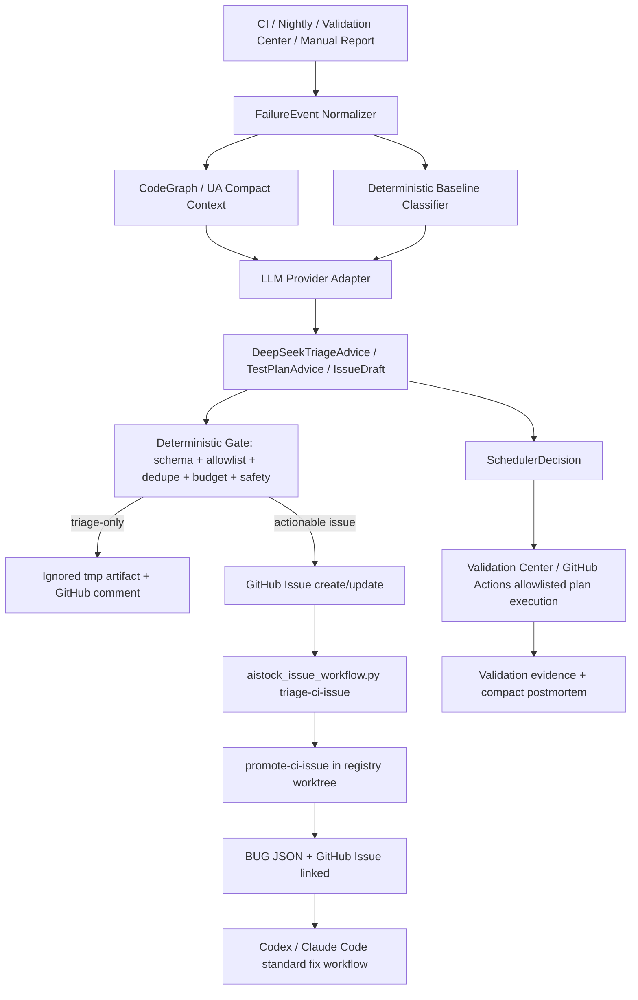
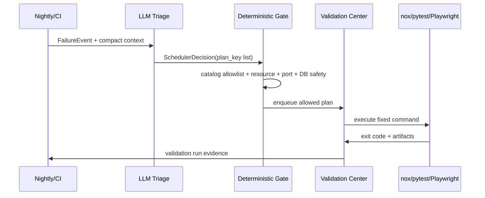

# AIstock GitHub Models / DeepSeek 智能验证与 Issue Intake 增强设计方案

版本：v1.0
日期：2026-06-08
状态：设计方案待审阅
目标分支：`docs/deepseek-github-models-validation-design-20260608`
合入策略：本文档完成后先提交到独立设计分支，等待用户审阅确认后再合入 `main`。

## 1. 执行结论

AIstock 后续应把 GitHub Models（配置 DeepSeek）和 AIstock 自有 DeepSeek 调用能力作为“智能增强层”接入现有 Issue / Feature / CI-CD / Validation Center 体系，而不是替换现有体系。

本方案的核心结论如下：

1. GitHub Models + DeepSeek 只负责低成本智能 triage、失败摘要、Issue 草案、测试计划建议、夜间测试调度建议、验证结果解释和 prompt/evaluation 治理。
2. DeepSeek 不负责写代码、不负责合入 PR、不负责关闭 Issue、不直接判定最终验收通过、不执行任意 shell、不绕过 `test_plans.yaml`、Validation Center、BUG JSON、GitHub Actions、nox、production gates。
3. “DeepSeek 调度测试”必须采用受控意图模式：模型只输出 `plan_key` / `reason` / `risk` / `budget` / `expected_evidence`，确定性 gate 校验后由 GitHub Actions、Validation Center 或 nox 执行固定 allowlist 命令。
4. GitHub Models 作为 GitHub Actions 内部的首选 LLM provider；AIstock 后端和本地工具可使用同一个 provider adapter，并允许在显式配置下 fallback 到 DeepSeek 官方 API。
5. 所有自动提交 GitHub Issue 的场景必须先生成可审计的 `FailureEvent`、`DeepSeekTriageAdvice`、`IssueCreationGate` 和精简 `LLMInvocationEvidence`，且默认不直接写 BUG JSON；正式 BUG 仍通过现有 workflow 在 clean registry worktree 中创建。
6. CodeGraph / Understand Anything 必须作为 LLM 输入压缩和测试影响分析的上游证据源，给 DeepSeek 提供结构化图谱摘要，而不是让模型重新扫描全仓。
7. 成功路径输出必须保持 compact；大 JSON、完整日志、完整 `statusCheckRollup`、模型完整 prompt 默认不写 tracked 文件，不粘贴到聊天窗口，失败或审计需要时才落到 ignored artifact。
8. 每个阶段都必须有验收标准、数据验收矩阵、回滚方案和 anti-pattern guard；不得以“最小实现”“简化版”“POC”替代完整设计约束。

## 2. 设计来源与基线

### 2.1 AIstock 内部基线

| 来源 | 本方案引用的约束 |
| --- | --- |
| `docs/codex_project_memory.md` | 根目录是同步/运行时基线；开发使用独立 worktree；CI/CD、issue workflow、production gates、上下文预算和文档规则必须分层报告。 |
| `docs/standards/aistock_development_standard_v1.5_20260523.md` | 设计驱动任务必须有完整验收矩阵；Issue 创建同步 GitHub；禁止根目录污染；禁止业务隐式 DDL；上下文/token 预算；批处理 issue；production DDL gate。 |
| `docs/standards/aistock_issue_fix_parallel_workflow_standard_20260514.md` | Issue 修复使用独立 worktree/branch；同模块 batch 必须保留 per-issue evidence；不得直接污染 `main`。 |
| `docs/standards/aistock_issue_workflow_quickstart.md` | `aistock_issue_workflow.py` 是高层入口；CI/Nightly intake 不得从 GitHub Actions 或 canonical root 直接写 BUG JSON；compact success output；CodeGraph/UA 是 warning-only accelerator。 |
| `docs/architecture/aistock_issue_workflow_opensource_cicd_design_v2_20260525.md` | GitHub Issues + BUG JSON + Validation Center + nox + GitHub Actions 的分层架构；agent-neutral Context Pack；Nightly candidate；Research Assistant task card。 |
| `docs/architecture/aistock_code_intelligence_integration_design_20260526.md` | CodeGraph / Understand Anything 用作 Context Pack、impact summary、affected tests、provenance，不替代验证真源。 |
| `docs/architecture/aistock_codegraph_nightly_freshness_design_20260602.md` | Nightly CodeGraph freshness artifact 是 warning-only，普通 T0/T1 不因图谱缺失阻断。 |
| `docs/architecture/aistock_automated_testing_coverage_observability_design_20260504.md` | 测试中心只调度受控 nox/aistock_validate 计划，不直接拼接任意命令；失败进入缺陷闭环。 |

### 2.2 官方能力来源

| 官方来源 | 设计采用点 |
| --- | --- |
| [GitHub Models REST inference docs](https://docs.github.com/en/rest/models/inference) | GitHub Models 支持 OpenAI、DeepSeek、Microsoft、Llama 等模型；inference request 需要 `models:read` 权限；请求使用模型 ID、messages、`response_format`、`tools`、`tool_choice` 等字段。 |
| [GitHub Models catalog docs](https://docs.github.com/en/rest/models/catalog) | `GET https://models.github.ai/catalog/models` 可列出模型 ID、publisher、capabilities、limits、rate limits；本方案要求运行时发现/校验 DeepSeek model id，不硬编码未验证 ID。 |
| [GitHub Models overview](https://docs.github.com/en/github-models/about-github-models) | GitHub Models 提供模型目录、prompt 管理、`.prompt.yml`、评估和 REST API 集成能力，适合作为仓库内可审阅的 LLM prompt/evaluation 管理层。 |
| [GitHub Issues REST docs](https://docs.github.com/en/rest/issues/issues) | 创建 Issue 需要 Issues write 权限，过快创建可能触发 secondary rate limit；自动提 Issue 必须做节流和 dedupe。 |
| [GitHub Actions workflow syntax docs](https://docs.github.com/en/actions/writing-workflows/workflow-syntax-for-github-actions) | `on.schedule` 支持 POSIX cron，按 UTC 运行，计划任务运行在默认分支最新 commit；本方案的 nightly LLM job 必须符合这些调度边界。 |
| [DeepSeek API quick start](https://api-docs.deepseek.com/) | DeepSeek API 兼容 OpenAI/Anthropic；当前推荐模型为 `deepseek-v4-flash` / `deepseek-v4-pro`；`deepseek-chat` / `deepseek-reasoner` 将在 2026-07-24 15:59 UTC deprecated。 |
| [DeepSeek pricing/model details](https://api-docs.deepseek.com/quick_start/pricing) | DeepSeek V4 Flash / Pro 支持 JSON Output 与 Tool Calls；本方案要求 provider adapter 读取可配置模型名，避免未来模型升级带来流程失效。 |
| [DeepSeek JSON Output](https://api-docs.deepseek.com/guides/json_mode/) 与 [Function Calling](https://api-docs.deepseek.com/guides/function_calling) | LLM 输出必须走 JSON schema / function calling 形式；严格 schema 校验失败时不得创建 Issue 或调度测试。 |

## 3. v1.0 不变原则

以下原则继承 AIstock 现有设计，不因引入 GitHub Models / DeepSeek 改变：

1. 不用 GitHub Models 替代 GitHub Actions、Validation Center、nox、BUG JSON、GitHub Issues 或 AIstock issue workflow。
2. 不用 DeepSeek 替代 Codex / Claude Code 的代码修复职责；DeepSeek 只提供建议、摘要和调度意图。
3. 不新增与 `tests/aistock_validation/catalog/test_plans.yaml` 竞争的测试计划事实源。
4. 不让 LLM 直接执行 shell、SQL、DDL、DB write、生产端口重启、PR merge、Issue close 或 BUG JSON status mutation。
5. 不把 CodeGraph / Understand Anything 的可用性变成 PR 合入阻断；缺失时 warning，并用现有 workflow fallback。
6. 不把成功验证路径变成 verbose JSON 堆积；默认只输出简明状态和证据链接。
7. 不从 GitHub Actions 或 canonical root `main` 直接写正式 BUG JSON；需要 BUG registry 时必须走 `promote-ci-issue --create-registry-worktree --apply` 或同等 registry worktree 流程。
8. 不因为 LLM 参与就降低人工可审计性：所有模型建议都必须保存最小证据、schema 版本、输入摘要、输出摘要、provider、model、token/cost 估计和 deterministic gate 结论。

## 4. 目标与非目标

### 4.1 目标

| ID | 目标 | 说明 |
| --- | --- | --- |
| DS-GM-001 | 低成本智能 triage | 使用 DeepSeek 解析 CI/Nightly/Validation Center 失败，给出模块、风险、是否 actionable、是否 infra-only、是否可自动提 Issue。 |
| DS-GM-002 | 高质量 Issue 草案 | 自动 Issue 必须包含失败摘要、复现命令、suspected files/modules、fingerprint、Agent Handoff、token policy、production gates。 |
| DS-GM-003 | 受控测试建议 | DeepSeek 只建议 `plan_key`，确定性 catalog validator 决定能否执行。 |
| DS-GM-004 | 夜间自适应测试调度 | 根据最近失败、变更模块、CodeGraph freshness、历史 flakiness、资源预算生成 nightly validation queue。 |
| DS-GM-005 | 与 GitHub 能力融合 | 在 GitHub Actions 中使用 GitHub Models API；prompt/eval 配置可进入仓库审阅；Issue/PR 评论复用 GitHub 原生协作。 |
| DS-GM-006 | 与 AIstock 能力融合 | 后端、Validation Center、MCP、本地 CLI、Codex、Claude Code 读取同一 schema 和 Context Pack。 |
| DS-GM-007 | 降低 token 和时间浪费 | 利用图谱摘要、失败片段、compact output、schema 输出减少全仓扫描和无效 JSON。 |
| DS-GM-008 | 完整阶段验收 | 每个阶段都有功能验收、数据验收、风险门禁、回滚方案。 |

### 4.2 非目标

| 非目标 | 原因 |
| --- | --- |
| 让 DeepSeek 自动修代码 | 修复仍由 Codex / Claude Code / 人工开发窗口通过标准 worktree 和 issue workflow 完成。 |
| 让 DeepSeek 自动合入 PR | 合入需要 CI、PR Quality、用户授权和 aftercare，不由模型控制。 |
| 让 DeepSeek 直接关闭 GitHub Issue 或 BUG JSON | close-sync 是确定性流程，必须有 merge commit、validation evidence 和 production gates。 |
| 让 DeepSeek 直接执行 nox 命令 | 执行由 GitHub Actions / Validation Center runner / 本地 nox 完成。 |
| 用 GitHub Models 替代 AIstock Validation Center | GitHub Models 只增强总结、建议和调度，Validation Center 仍是验证证据平台。 |
| 为 LLM 新建一套测试 catalog | 所有测试建议必须收敛到现有 `test_plans.yaml` / `module_registry.yaml` / `file_ownership.yaml`。 |

## 5. 角色边界

| 组件 | 可以做 | 禁止做 |
| --- | --- | --- |
| GitHub Models | 在 GitHub Actions 内调用 DeepSeek；使用 repository prompt/evaluation；生成结构化建议。 | 绕过 AIstock gate 直接改代码、合 PR、关 Issue。 |
| DeepSeek 官方 API | 作为本地/后端 fallback provider；处理结构化 JSON/function calling。 | 直接读取 secrets、完整仓库、生产数据、完整日志。 |
| GitHub Actions | 调度 nightly / CI / issue-on-fail；上传 artifact；创建或更新 GitHub Issue。 | 直接提交正式 BUG JSON、修改业务代码、执行任意生产动作。 |
| Validation Center | 执行 allowlisted `plan_key`；保存 run evidence；暴露只读历史和受控 runner。 | 运行非 allowlist 命令、写生产 DB、信任 LLM 判定为最终 pass。 |
| `aistock_issue_workflow.py` | submit/triage/promote/run/finish/merge/close-sync/cleanup/postmortem。 | 因 LLM 建议而跳过 GitHub/BUG linkage、scope、validation、production gates。 |
| CodeGraph | 提供代码结构、影响范围、affected tests、freshness artifact。 | 作为质量门禁真源或自动阻断普通 issue。 |
| Understand Anything | 提供架构图谱、领域流程摘要、跨模块解释。 | 替代 nox/pytest/Validation Center evidence。 |
| Codex / Claude Code | 根据 Context Pack 修复问题、运行验证、提交 PR、按授权 aftercare。 | 忽略 workflow，直接在 root/main 修改代码。 |
| Research Assistant | 读取任务卡、Context Pack、LLM triage summary，辅助分析。 | 执行任意 shell 或替代开发客户端修复合入。 |

## 6. 总体架构



### 6.1 分层职责

| 层 | 新增能力 | 复用资产 | 关键边界 |
| --- | --- | --- | --- |
| Provider 层 | `llm_provider_adapter` 统一 GitHub Models 与 DeepSeek API | GitHub Models REST、DeepSeek OpenAI-compatible API | provider 只返回 JSON/function-call，不做业务写入。 |
| Intake 层 | FailureEvent + DeepSeek triage + Issue draft | `scripts/ci_failure_issue_summary.py`、GitHub issue workflows | GitHub Issue 可写，BUG JSON 不由 CI/root 写。 |
| Gate 层 | schema validator、dedupe、budget、policy、safety gate | `test_plans.yaml`、GitHub Issues search、workflow quickstart | Gate 不通过时只写 ignored artifact。 |
| Scheduler 层 | Nightly adaptive queue、plan suggestions | `.github/workflows/nightly.yml`、Validation Center runner | 只调度 runner-enabled allowlisted plan。 |
| Evidence 层 | `LLMInvocationEvidence`、compact postmortem | `tmp/validation`、Validation history、PR artifacts | 成功路径默认 compact，full detail 仅 ignored artifact。 |
| Client 层 | Codex/Claude 可读取 LLM-enhanced Context Pack | `fix-aistock-issue` skill、Claude commands、Context Pack | 不需要客户端知道 provider 细节。 |

## 7. Provider Adapter 设计

### 7.1 Provider 优先级

| 场景 | 首选 | Fallback | 说明 |
| --- | --- | --- | --- |
| GitHub Actions 内 CI/Nightly | GitHub Models DeepSeek | 跳过 LLM，使用 deterministic summary | 不能依赖外部个人 API key。 |
| 本地 CLI / Codex / Claude | GitHub Models（如 token 可用） | DeepSeek 官方 API / deterministic summary | 本地 provider 必须显式配置。 |
| Validation Center 后端 | DeepSeek 官方 API 或 internal gateway | GitHub Models（如组织配置允许） | 后端不应把 GitHub token 扩散到业务日志。 |
| 离线/无网络 | deterministic summary | 无 | 不得因 LLM 不可用阻断标准 issue workflow。 |

### 7.2 配置项

建议新增配置文件（实施阶段再落地）：

`configs/validation/llm_triage.yaml`

```yaml
schema_version: aistock_llm_triage_config_v1
default_provider: github_models
providers:
  github_models:
    enabled: true
    base_url: https://models.github.ai
    model_selector:
      publisher: DeepSeek
      required_capabilities:
        - tool-calling
      preferred_models:
        - deepseek/deepseek-v4-flash
        - deepseek/deepseek-v4-pro
    auth:
      token_env: GITHUB_TOKEN
      required_permissions:
        - models:read
  deepseek_api:
    enabled: false
    base_url: https://api.deepseek.com
    model: deepseek-v4-flash
    auth:
      token_env: DEEPSEEK_API_KEY
limits:
  max_prompt_tokens: 12000
  max_output_tokens: 4000
  max_log_excerpt_chars: 12000
  max_issue_body_chars: 12000
  max_suggestions_per_failure: 5
  daily_issue_create_limit: 10
  daily_llm_call_limit: 100
  fail_closed_when_schema_invalid: true
redaction:
  redact_env_vars: true
  redact_tokens: true
  redact_db_urls: true
  redact_private_keys: true
```

说明：

1. `deepseek/deepseek-v4-flash` / `deepseek/deepseek-v4-pro` 是预期 model selector 示例，不作为硬编码事实；实施时必须调用 GitHub Models catalog 验证真实 ID。
2. DeepSeek 官方 API 当前推荐 `deepseek-v4-flash` / `deepseek-v4-pro`；禁止新代码默认使用即将 deprecated 的 `deepseek-chat` / `deepseek-reasoner`。
3. 所有 provider output 必须经过 JSON schema validator；schema 不通过时只保留 failure artifact，不创建 Issue、不调度测试。

### 7.3 Prompt 与 evaluation 管理

建议新增 prompt 目录：

```text
prompt_packs/validation_llm/
  triage_failure.prompt.yml
  issue_draft.prompt.yml
  test_plan_advisor.prompt.yml
  nightly_scheduler.prompt.yml
  result_interpreter.prompt.yml
  evaluation_cases/
    ci_failure_actionable.jsonl
    ci_failure_infra_only.jsonl
    nightly_flaky.jsonl
    issue_draft_quality.jsonl
```

原则：

1. Prompt 文件作为代码资产走 PR 审阅，不在 workflow YAML 中内联复杂 prompt。
2. Prompt 中只允许引用压缩后的 failure summary、log excerpt、CodeGraph/UA refs、test catalog 摘要，不允许注入完整仓库或 secrets。
3. Evaluation 初期作为 warning-only，用固定历史失败样本评估：actionability、dedupe、plan selection、false positive、token usage。
4. Prompt 修改必须触发 prompt evaluation gate；失败不阻断普通业务 PR，但阻断 validation_llm 自身功能 PR。

## 8. 数据模型

### 8.1 FailureEvent

```json
{
  "schema_version": "aistock_failure_event_v1",
  "event_id": "fe_<date>_<hash>",
  "source": "github_actions|nightly|validation_center|manual|mcp",
  "source_run": {
    "workflow": "Nightly",
    "run_id": "123",
    "run_url": "https://github.com/.../actions/runs/123",
    "attempt": 1,
    "branch": "main",
    "commit": "abcdef"
  },
  "failure": {
    "severity_hint": "P0|P1|P2|P3",
    "failed_job": "paper_v2_backend",
    "failed_step": "pytest",
    "exit_code": 1,
    "error_signature": "AssertionError: ...",
    "log_excerpt_ref": "tmp/validation/.../log_excerpt.txt",
    "log_excerpt_sha256": "sha256:...",
    "first_failed_test": "backend/tests/...",
    "suspected_files": ["backend/services/..."],
    "suspected_modules": ["paper_v2.backend"]
  },
  "context": {
    "changed_files": [],
    "codegraph_refs": [],
    "understand_anything_refs": [],
    "recent_related_issues": [],
    "test_plan_catalog_snapshot": "sha256:..."
  },
  "safety": {
    "production_ddl_gate": "noop|unknown|pending",
    "production_frontend_dependency_gate": "noop|unknown|pending",
    "production_backend_dependency_gate": "noop|unknown|pending",
    "contains_secrets": false,
    "redaction_applied": true
  }
}
```

### 8.2 DeepSeekTriageAdvice

```json
{
  "schema_version": "aistock_deepseek_triage_advice_v1",
  "provider": "github_models|deepseek_api",
  "model": "deepseek-v4-flash",
  "actionability": "actionable_bug|infra_only|flaky|triage_only|not_enough_information",
  "severity": "P0|P1|P2|P3",
  "confidence": 0.0,
  "module": "paper_v2.backend",
  "suspected_files": [],
  "root_cause_hypothesis": "short bounded hypothesis",
  "reproduce_command": "python -m nox -s ...",
  "required_evidence": [],
  "recommended_next_action": "create_github_issue|comment_existing_issue|skip|rerun_validation|manual_triage",
  "dedupe_keys": {
    "fingerprint": "sha256:...",
    "search_terms": []
  },
  "stop_conditions": []
}
```

### 8.3 DeepSeekIssueDraft

```json
{
  "schema_version": "aistock_deepseek_issue_draft_v1",
  "title": "[P1] paper_v2_backend fails on ...",
  "labels": ["bug", "P1", "module:paper_v2"],
  "body_sections": {
    "summary": "...",
    "failure_evidence": "...",
    "reproduce": "...",
    "suspected_scope": "...",
    "agent_handoff": "...",
    "token_policy": "...",
    "production_gates": "..."
  },
  "body_markers": {
    "fingerprint_marker": "<!-- aistock-ci-failure:fingerprint=... -->",
    "source_run_marker": "<!-- aistock-source-run:... -->"
  },
  "requires_bug_json": false,
  "promotion_command": "python scripts/aistock_issue_workflow.py promote-ci-issue --issue <issue-number> --create-registry-worktree --apply",
  "repair_command": "python scripts/aistock_issue_workflow.py run --bug-id BUG-XXX --mode fix --create-worktree"
}
```

### 8.4 DeepSeekTestPlanAdvice

```json
{
  "schema_version": "aistock_deepseek_test_plan_advice_v1",
  "recommended_plans": [
    {
      "plan_key": "paper_v2_backend",
      "reason": "failure is in backend service path",
      "expected_evidence": ["pytest result", "validation run id"],
      "risk_level": "P1",
      "estimated_runtime_seconds": 600,
      "requires_frontend": false,
      "requires_backend": false,
      "requires_db": false
    }
  ],
  "plans_to_avoid": [
    {
      "plan_key": "paper_v2_live",
      "reason": "live trading window not required for this regression"
    }
  ],
  "catalog_validation_required": true
}
```

### 8.5 SchedulerDecision

```json
{
  "schema_version": "aistock_scheduler_decision_v1",
  "decision_id": "sched_<date>_<hash>",
  "trigger": "nightly|manual|post_merge|release_candidate",
  "input_refs": {
    "changed_files": [],
    "recent_failures": [],
    "codegraph_freshness": "tmp/validation/code-intelligence/...",
    "historical_flakiness": "..."
  },
  "queue": [
    {
      "plan_key": "qe_read_l3",
      "priority": 80,
      "reason": "recent QE UI metric bug and changed frontend route",
      "max_runtime_seconds": 1800,
      "resource_policy": "standard",
      "allowed_runner": "validation_center|github_actions"
    }
  ],
  "budget": {
    "max_total_runtime_seconds": 14400,
    "max_parallel": 2,
    "max_llm_calls": 10
  },
  "deterministic_gate": {
    "allowed": true,
    "blocking_reasons": []
  }
}
```

### 8.6 IssueCreationGate

```json
{
  "schema_version": "aistock_issue_creation_gate_v1",
  "allowed": true,
  "reason": "actionable P1 backend regression with failed test and suspected files",
  "severity": "P1",
  "dedupe": {
    "fingerprint": "sha256:...",
    "existing_issue_number": null,
    "query": "repo:licong01-cloud/AIstock is:issue ..."
  },
  "required_fields_present": {
    "failed_job": true,
    "error_signature": true,
    "reproduce_command": true,
    "suspected_files": true,
    "agent_handoff": true,
    "production_gates": true
  },
  "write_target": "github_issue_only",
  "bug_json_write_allowed": false,
  "rate_limit": {
    "daily_remaining": 8,
    "secondary_rate_limit_safe": true
  }
}
```

### 8.7 LLMInvocationEvidence

```json
{
  "schema_version": "aistock_llm_invocation_evidence_v1",
  "invocation_id": "llm_<date>_<hash>",
  "provider": "github_models",
  "model": "publisher/model-id",
  "purpose": "triage_failure|issue_draft|test_plan_advisor|nightly_scheduler|result_interpreter",
  "input_digest": {
    "failure_event_sha256": "sha256:...",
    "prompt_pack_version": "git:<commit>:prompt_packs/validation_llm/triage_failure.prompt.yml",
    "redacted": true,
    "max_prompt_tokens": 12000
  },
  "output_digest": {
    "schema": "aistock_deepseek_triage_advice_v1",
    "json_valid": true,
    "schema_valid": true,
    "output_sha256": "sha256:..."
  },
  "usage": {
    "prompt_tokens": 0,
    "completion_tokens": 0,
    "estimated_cost_usd": 0.0
  },
  "gate": {
    "allowed_to_write_issue": false,
    "allowed_to_schedule_validation": false,
    "blocking_reasons": []
  }
}
```

说明：`prompt_tokens` 和 `completion_tokens` 如果 provider 不返回用量，必须写 `unknown` 或 `null`，不得再用 `0` 假装无消耗。

## 9. GitHub Actions 集成设计

### 9.1 当前基线

当前仓库已有：

1. `.github/workflows/test.yml`：失败时构建 `tmp/validation/ci_failure_issue/*`，可创建/更新 GitHub Issue。
2. `.github/workflows/nightly.yml`：生成 CodeGraph freshness artifact、Nightly failure issue context，并可自动登记 GitHub Issue。
3. `.github/workflows/pr-quality.yml`：运行 `issue_flow.py pr-check` 和 code intelligence summary，上传 artifact 并评论 PR。
4. `.github/workflows/issue-on-test-fail.yml` / `issue-on-guardrail-fail.yml`：失败 issue filed workflow，支持 dry-run。

### 9.2 新增 Job 模式

建议新增 reusable workflow：

`/.github/workflows/llm-triage.yml`

输入：

```yaml
workflow_call:
  inputs:
    failure_event_path:
      required: true
      type: string
    mode:
      required: true
      type: string # dry-run|issue-draft|schedule-advice
    provider:
      required: false
      type: string # github_models|deepseek_api|deterministic
```

输出：

```yaml
outputs:
  triage_advice_path:
  issue_draft_path:
  scheduler_decision_path:
  issue_creation_gate_path:
  llm_evidence_path:
```

关键约束：

1. Workflow 默认 `dry-run`，不创建 Issue。
2. `issue-draft` 模式只生成 payload，不直接写 BUG JSON。
3. `auto-file` 必须由当前已有 issue creation step 执行，且读取 `IssueCreationGate.allowed=true`。
4. GitHub Models token 权限只要求 `models:read` 和必要的 `issues:write`；secrets 不进入模型上下文。
5. LLM job 失败不应导致原始测试失败被掩盖；其结果单独标记为 `llm_triage=failed|skipped|passed`。

### 9.3 与现有 `ci_failure_issue_summary.py` 的关系

不替换现有脚本，而是分三层增强：

1. `ci_failure_issue_summary.py` 继续生成 deterministic baseline summary。
2. 新增 `llm_failure_triage.py` 读取 baseline summary + compact code intelligence，生成 DeepSeek 结构化建议。
3. 新增 `issue_creation_gate.py` 合并 deterministic baseline 和 LLM advice，决定是否生成 GitHub issue payload。

Deterministic baseline 永远拥有最终否决权：

| 情况 | 处理 |
| --- | --- |
| LLM 建议 actionable，但缺 failed test/error signature | 不创建 Issue，triage-only artifact。 |
| LLM 建议 P0，但 deterministic severity 只能 P2 | 降级或人工复核，不自动 P0。 |
| LLM 建议 plan_key 不存在 | gate failed，不调度。 |
| LLM 建议执行非 allowlist shell | gate failed，并记录 prompt safety violation。 |
| LLM 不可用 | fallback deterministic summary，不阻断 CI/Nightly。 |

## 10. Validation Center 集成设计

### 10.1 受控调度接口

建议在后续实施中新增 Validation Center 内部 API 或 service 方法：

```python
class ValidationLlmScheduleService:
    def advise_plans(self, failure_event: FailureEvent) -> DeepSeekTestPlanAdvice:
        ...

    def validate_scheduler_decision(self, decision: SchedulerDecision) -> SchedulerGateResult:
        ...

    def enqueue_allowed_plans(self, decision: SchedulerDecision) -> list[ValidationRunRef]:
        ...
```

关键规则：

1. `enqueue_allowed_plans` 只接受 gate 已通过的 `SchedulerDecision`。
2. `plan_key` 必须存在于当前 workspace 的 `test_plans.yaml`。
3. `runner_enabled=true` 且 `command_key` 在 `ValidationPlanCatalog.ALLOWED_COMMAND_KEYS` 中。
4. `workspace_path` 必须是本仓库合法 git worktree。
5. 端口/DB/resource policy 继续由 `test_plans.yaml` / `resource_policies.yaml` 决定。
6. LLM 不接触 raw DB credentials、不打印 secrets、不允许 DDL。

### 10.2 执行链路



最终 pass/fail 只来自 nox/pytest/Playwright/Validation Center exit code 和业务 oracle；模型只能解释失败原因和建议下一步。

## 11. Issue Intake 与 Dedupe 设计

### 11.1 自动 Issue 的质量标准

一个自动 Issue 必须包含：

1. 明确标题：严重度、模块、失败类型。
2. 失败摘要：failed workflow/job/step/test/error signature。
3. 复现命令：尽可能映射到 `nox` 或 `aistock_issue_workflow.py triage-ci-issue`。
4. 影响范围：suspected modules/files，来自 deterministic classifier + CodeGraph/UA + LLM advice。
5. Dedupe marker：fingerprint、source run、commit、workflow。
6. Agent Handoff：先 `triage-ci-issue`，只有 actionable regression 才给 `promote-ci-issue`。
7. Token policy：Issue + Context Pack 是第一上下文；完整日志按需下载。
8. Production gates：默认 `noop`，除非证据证明需要 `pending`。
9. Links：workflow run、artifact、Context Pack、CodeGraph freshness。
10. LLM evidence 摘要：provider/model/schema/gate，不粘贴完整 prompt。

### 11.2 自动 Issue 的禁止条件

以下情况不得自动创建 actionable Issue：

1. 只有 CodeGraph/UA freshness 失败。
2. 只有 runner offline、token missing、workspace locked、GitHub API rate limit、dependency installation timeout 等 infra-only 信号。
3. 没有 failed test、error signature 或 suspected file/module。
4. 仅有人工短描述且无法复现。
5. LLM schema invalid、confidence 低于阈值、输出要求执行非 allowlist 命令。
6. Dedupe 命中已有 open Issue，除非只更新 comment。
7. 当天已达到自动创建上限。

### 11.3 BUG JSON promotion

GitHub Issue 创建后，不立即创建正式 BUG JSON。后续流程为：

1. Codex / Claude Code / 人工窗口读取 Issue。
2. 执行 `python scripts/aistock_issue_workflow.py triage-ci-issue --issue <number>`。
3. 如果确认是代码/测试回归，执行 `promote-ci-issue --create-registry-worktree --apply`。
4. Registry worktree 创建正式 BUG JSON，并回填 GitHub linkage。
5. 之后通过 `run --bug-id BUG-XXX` 正常修复。

这样避免 GitHub Actions 和 root/main 直接写 `tests/aistock_validation/bugs/*.json`，也避免重号、半提交、根目录污染。

## 12. Nightly 自适应测试调度

### 12.1 输入信号

| 信号 | 来源 | 用途 |
| --- | --- | --- |
| 最近 24/72 小时失败 | GitHub Actions / Validation Center | 提升相关 plan 优先级。 |
| 最近合入文件 | GitHub commits / PR labels | 推导受影响模块。 |
| CodeGraph affected tests | `scripts/code_intelligence_adapter.py` artifact | 缩小测试范围，减少全仓扫描。 |
| Understand Anything domain flow | UA summary artifact | 识别跨模块业务流。 |
| flakiness 历史 | Validation history | flaky plan 不自动提 BUG，先 rerun 或标 triage。 |
| resource policy | `resource_policies.yaml` / `test_plans.yaml` | 控制长任务、DB、端口、并发。 |
| production gate | issue/workflow context | 防止误触生产动作。 |

### 12.2 调度策略

1. 基础 nightly 继续按固定计划执行。
2. DeepSeek scheduler 在固定计划基础上生成增量候选 queue。
3. Gate 根据 allowlist、资源、最近失败、重复度、runtime budget 选取可执行子集。
4. 执行顺序：
   - L0 / catalog / guardrail。
   - 最近变更模块 L1/L2。
   - 高风险业务 L3。
   - 跨模块 L4 / release candidate L5（仅在配置允许时）。
5. 长耗时任务默认 nightly，不进入普通 PR 阻断，除非 release candidate。

### 12.3 夜间 Issue 策略

| 情况 | 行为 |
| --- | --- |
| 首次失败且证据完整 | 可创建 GitHub Issue；`needs_bug_json=false`，先 triage。 |
| 同 fingerprint 重复失败 | 更新已有 Issue comment，不新建。 |
| flakiness 可能性高 | 先 rerun 或标 `triage-only`，不自动 promote BUG。 |
| infra-only | 创建/更新 infra tracking issue 或只写 artifact；不进入 BUG 修复。 |
| P0/P1 业务回归 | GitHub Issue + Agent Handoff；等待标准 workflow promote。 |

## 13. CodeGraph / Understand Anything 使用方式

### 13.1 Context 压缩原则

DeepSeek 输入优先级：

1. FailureEvent deterministic summary。
2. CodeGraph `affected_files`、`affected_tests`、`call_chain_summary`、`freshness`。
3. Understand Anything `domain_flow_summary`、`architecture_refs`。
4. `test_plans.yaml` 中相关 plan 的 compact 摘要。
5. 日志 excerpt 的最小片段。
6. 必要时才包含相关代码 snippet；禁止默认全仓扫描。

### 13.2 图谱缺失时的行为

| 图谱状态 | 行为 |
| --- | --- |
| fresh | 使用图谱摘要，记录 freshness ref。 |
| stale | 使用图谱但标 warning；对高风险 issue 追加 targeted `rg` 验证。 |
| missing | 不阻断；用 deterministic classifier + scoped search fallback。 |
| failed | 不创建 code-intelligence-only BUG；记录 artifact。 |

### 13.3 对 Codex / Claude Code 的收益

1. 新 issue 的 Context Pack 中直接包含 `code_intelligence_context`，减少 broad `rg` 和全文打开。
2. TestPlanAdvice 中包含 affected tests，减少无效 L3 重跑。
3. postmortem 中记录是否使用图谱、节省了哪些 broad scan、fallback 原因。
4. Claude Code 和 Codex 通过同一 Markdown/JSON Context Pack 使用，不依赖 Codex 私有能力。

## 14. Token / 时间 / 成本控制

### 14.1 默认预算

| 项 | 默认上限 | 说明 |
| --- | --- | --- |
| failure log excerpt | 12k chars | 超出只保留首个 error signature 周边。 |
| LLM prompt tokens | 12k | Triage 默认低成本；高风险才扩大。 |
| LLM output tokens | 4k | JSON schema 输出。 |
| 每个 FailureEvent LLM 调用 | 1-3 次 | triage、issue draft、test plan；能合并则合并。 |
| 每日自动 Issue | 10 个 | 防止循环刷 Issue。 |
| 每日 LLM 调用 | 100 次 | 防止成本失控。 |
| chat 输出 | compact | 成功只输出 gate、Issue/PR/run id、next action。 |

### 14.2 禁止的 token 浪费

1. 成功验证时输出完整 JSON、完整 `statusCheckRollup`、完整 nox log。
2. 每个小 issue 都读取完整历史设计方案。
3. LLM prompt 注入完整仓库、完整测试 catalog、完整日志。
4. GitHub Issue body 粘贴完整 artifact JSON。
5. postmortem 再次展开所有 workflow events。
6. 图谱已可用时仍做 broad full-repo scan。

### 14.3 必须保留的审计信息

为了不牺牲代码质量，只压缩展示，不删除审计：

| 信息 | 保存位置 | 默认 tracked? |
| --- | --- | --- |
| FailureEvent | `tmp/validation/...` artifact | 否 |
| LLMInvocationEvidence summary | artifact / PR comment summary | 否，除非历史证据需要 |
| GitHub Issue body | GitHub Issue | 是，外部协作层 |
| BUG JSON | `tests/aistock_validation/bugs/` | 是，但只能 registry workflow 写 |
| Validation evidence | Validation Center / selected history | 视计划而定 |
| Postmortem compact metrics | workflow state / final report | 可 tracked 或 artifact |

## 15. 安全与合规 Guardrails

| 风险 | Guardrail |
| --- | --- |
| Prompt 泄露 secrets | redaction layer；禁止传 env dump、DB URL、token、private key；日志扫描。 |
| LLM hallucinate plan_key | `test_plans.yaml` + `ValidationPlanCatalog` 校验；不存在即失败。 |
| LLM 执行任意 shell | schema 中不允许 shell 字段；只允许 `plan_key`。 |
| LLM 误判通过 | 最终通过只来自 deterministic validation exit code。 |
| 自动 Issue 泛滥 | dedupe fingerprint、daily cap、secondary rate limit handling。 |
| 根目录污染 | GitHub Actions 只写 `tmp/validation` artifact；BUG JSON promotion 使用 registry worktree。 |
| 生产 DB/DDL 风险 | LLM path 不执行 DDL；production gates 只报告；DDL 仍按 main merge 后明确授权执行。 |
| 图谱陈旧 | freshness metadata；stale warning；高风险走 targeted verification。 |
| Prompt 漂移 | prompt pack PR 审阅 + evaluation cases。 |
| Provider 不可用 | deterministic fallback；不阻断标准 workflow。 |

## 16. 分阶段实施方案与验收标准

> 本节是完整实施蓝图，不是最小实现。每个 Phase 都有明确验收标准；后续开发可按阶段独立 worktree/branch 执行，但不得裁剪安全门禁。

### Phase 0：设计基线合入

**交付内容**

1. 本设计文档。
2. 与现有 issue workflow、CodeGraph、Validation Center、automated testing 设计的冲突检查。
3. 官方 GitHub Models / DeepSeek 能力边界记录。

**验收标准**

| ID | 验收项 | 验收方式 |
| --- | --- | --- |
| DS-GM-P0-F-001 | 方案明确“增强而非替换” | 文档包含角色边界和非目标。 |
| DS-GM-P0-F-002 | 每个阶段有验收标准 | 文档 Phase 0-10 均包含验收。 |
| DS-GM-P0-F-003 | 不引入平行测试真源 | 文档明确收敛到 `test_plans.yaml`。 |
| DS-GM-P0-F-004 | 官方来源已核验 | 文档含 GitHub/DeepSeek 官方链接。 |
| DS-GM-P0-F-005 | docs-only 无 DDL/runtime | `git diff --check`；completion report 写 `production_ddl_gate=noop`。 |

**Anti-pattern guard**

- 不提交 runtime code。
- 不修改 workflow YAML。
- 不声称 GitHub Models DeepSeek model ID 已最终确定；必须在 Phase 1 用 catalog 验证。

### Phase 1：Provider Adapter 与配置校验

**交付内容**

1. `configs/validation/llm_triage.yaml`。
2. `scripts/llm_provider_adapter.py` 或同等模块，支持：
   - `provider=github_models`
   - `provider=deepseek_api`
   - `provider=deterministic`
3. GitHub Models catalog discovery：列出 publisher/capabilities/model id。
4. DeepSeek API model config validation。
5. Secret redaction unit tests。

**验收标准**

| ID | 验收项 | 验收方式 |
| --- | --- | --- |
| DS-GM-P1-F-001 | GitHub Models catalog 可发现 DeepSeek 候选模型 | dry-run 输出 model id、publisher、capabilities；不打印 token。 |
| DS-GM-P1-F-002 | 不硬编码未验证模型 ID | unit test mock catalog 返回不同 ID 时仍能选择。 |
| DS-GM-P1-F-003 | DeepSeek fallback 可配置但默认不启用 | config test 验证 `enabled=false`。 |
| DS-GM-P1-F-004 | JSON schema invalid fail-closed | unit test 模拟 invalid JSON，不产生 issue draft。 |
| DS-GM-P1-F-005 | secrets redaction | fixture 含 token/db url，prompt input 不含原文。 |

**Anti-pattern guard**

- 不把 API key 写入配置文件。
- 不在日志中输出 Authorization header。
- 不因 provider 不可用阻断原有 deterministic summary。

### Phase 2：Failure Summarizer Dry-run

**交付内容**

1. `FailureEvent` builder 从 CI/Nightly/Validation Center summary 生成标准事件。
2. `llm_failure_triage.py --dry-run` 读取 FailureEvent，输出 `DeepSeekTriageAdvice`。
3. 结果只写 `tmp/validation/llm_triage/...`，不创建 GitHub Issue。

**验收标准**

| ID | 验收项 | 验收方式 |
| --- | --- | --- |
| DS-GM-P2-F-001 | CI fixture 可生成 FailureEvent | unit test 覆盖 failed job/test/signature。 |
| DS-GM-P2-F-002 | Nightly fixture 可生成 FailureEvent | unit test 覆盖 multi-job status。 |
| DS-GM-P2-F-003 | LLM triage 输出 schema valid | JSON schema test。 |
| DS-GM-P2-F-004 | dry-run 不写 GitHub、不写 BUG JSON | smoke 检查 `unexpected_dirty_paths=[]`。 |
| DS-GM-P2-F-005 | compact output | 命令通过时 stdout 只含 gate、artifact path、actionability。 |

**Anti-pattern guard**

- 不把完整日志喂给模型。
- 不把 dry-run artifact 提交进 tracked source。

### Phase 3：Issue Draft Generator + Deterministic Gate Dry-run

**交付内容**

1. `DeepSeekIssueDraft` 生成器。
2. `IssueCreationGate` deterministic validator。
3. Dedupe marker 和 GitHub search query 生成。
4. Actionable/infra-only/flaky/triage-only fixture。

**验收标准**

| ID | 验收项 | 验收方式 |
| --- | --- | --- |
| DS-GM-P3-F-001 | actionable fixture 生成完整 issue draft | body 包含 summary/reproduce/handoff/token policy/gates。 |
| DS-GM-P3-F-002 | infra-only fixture 不创建 actionable draft | gate `allowed=false`，reason 为 infra-only。 |
| DS-GM-P3-F-003 | code-intelligence-only 失败不提 BUG | fixture gate false。 |
| DS-GM-P3-F-004 | dedupe marker 稳定 | 同输入 fingerprint 相同。 |
| DS-GM-P3-F-005 | 缺 required fields fail-closed | 缺 failed test/signature 时只 triage-only。 |

**Anti-pattern guard**

- 不在 Issue body 粘贴完整 JSON。
- 不输出 `promote-ci-issue`，除非 gate 确认 actionable regression。

### Phase 4：GitHub Issue Auto-file Controlled Mode

**交付内容**

1. 在 `test.yml` / `nightly.yml` / `issue-on-test-fail.yml` 中接入 LLM-enhanced issue payload。
2. 默认 `dry_run=true` 或 warning-only。
3. opt-in `auto_file=true` 时创建/更新 GitHub Issue。
4. 不写 BUG JSON。

**验收标准**

| ID | 验收项 | 验收方式 |
| --- | --- | --- |
| DS-GM-P4-F-001 | dry-run 不创建 Issue | workflow_dispatch dry-run log。 |
| DS-GM-P4-F-002 | opt-in 可创建 Issue | 测试仓库或手动 dispatch 创建 issue，body 符合标准。 |
| DS-GM-P4-F-003 | dedupe 命中只评论/更新 | 同 fingerprint 二次运行不新建。 |
| DS-GM-P4-F-004 | BUG JSON 不被 CI 写入 | `git status` 和 artifact 检查。 |
| DS-GM-P4-F-005 | rate limit 保护 | unit test mock secondary rate limit。 |

**Anti-pattern guard**

- 不在 workflow 里提交 commit。
- 不在 default branch 之外误创建生产 Issue，除非显式 manual dispatch。

### Phase 5：Test-plan Advisor Dry-run + Catalog Validator

**交付内容**

1. `DeepSeekTestPlanAdvice`。
2. Catalog validator：
   - `plan_key` exists。
   - `runner_enabled=true`。
   - `command_key` allowlisted。
   - `workspace_path` legal worktree。
   - production port/DB rules。
3. Advice 与 `issue_flow.py validation-select` 对齐。

**验收标准**

| ID | 验收项 | 验收方式 |
| --- | --- | --- |
| DS-GM-P5-F-001 | 存在且 runner-enabled plan 通过 gate | fixture plan。 |
| DS-GM-P5-F-002 | 不存在 plan 被拒绝 | unit test。 |
| DS-GM-P5-F-003 | 非 runner-enabled plan 被拒绝或仅建议人工 | unit test。 |
| DS-GM-P5-F-004 | production port 被拒绝 | fixture 含 8001/3000/19080。 |
| DS-GM-P5-F-005 | 与 validation-select 无冲突 | 对同一 changed file 输出兼容 plan。 |

**Anti-pattern guard**

- 不让 LLM 输出 shell command。
- 不新增第二套 allowlist。

### Phase 6：Controlled Validation Scheduling

**交付内容**

1. `SchedulerDecision` gate。
2. Validation Center enqueue allowed plans。
3. GitHub Actions dispatch allowed plans。
4. Run evidence 与 FailureEvent/Issue 链接。

**验收标准**

| ID | 验收项 | 验收方式 |
| --- | --- | --- |
| DS-GM-P6-F-001 | allowed plan 可被 VC 执行 | `start_validation_execution(plan_key=...)` 返回 run_id。 |
| DS-GM-P6-F-002 | 非法 workspace_path 拒绝 | 测试任意路径 400。 |
| DS-GM-P6-F-003 | plan execution cwd 为合法 worktree | runner log / test。 |
| DS-GM-P6-F-004 | LLM 不判定最终 pass | result 来源为 runner exit_code。 |
| DS-GM-P6-F-005 | 失败 evidence 可进入 issue triage | 生成 FailureEvent ref。 |

**Anti-pattern guard**

- 不允许 LLM 传入 shell。
- 不允许 writes_business_state plan 自动执行。

### Phase 7：Nightly Adaptive Scheduler

**交付内容**

1. Nightly 中新增 scheduler advice job。
2. 根据 changed files、recent failures、CodeGraph freshness、resource budget 生成增量 queue。
3. Queue 通过 gate 后才执行。
4. 生成 compact nightly report。

**验收标准**

| ID | 验收项 | 验收方式 |
| --- | --- | --- |
| DS-GM-P7-F-001 | 无变更/无失败时只跑固定 baseline | dry-run queue empty 或低优先级。 |
| DS-GM-P7-F-002 | 近期 QE UI 失败推荐 QE UI/L3 plan | fixture。 |
| DS-GM-P7-F-003 | resource budget 生效 | 超预算 plan 被 defer。 |
| DS-GM-P7-F-004 | CodeGraph missing 不阻断 nightly | warning-only。 |
| DS-GM-P7-F-005 | Nightly issue 只在 actionable 时创建 | smoke。 |

**Anti-pattern guard**

- 不让 DeepSeek 调度 live trading 或 production actions。
- 不因 LLM failure 让 nightly 主验证误报成功/失败。

### Phase 8：PR Quality / Postmortem / Token Metrics 收敛

**交付内容**

1. PR Quality comment 增加 LLM triage summary（compact）。
2. Postmortem 记录真实 token/cost 或 `unknown`，不再 `0` 假装无消耗。
3. 记录 CodeGraph/UA 是否使用、fallback 原因、节省的 broad scan。
4. 成功路径只输出摘要。

**验收标准**

| ID | 验收项 | 验收方式 |
| --- | --- | --- |
| DS-GM-P8-F-001 | postmortem 不出现误导性 `total_estimated_tokens=0` | unit test。 |
| DS-GM-P8-F-002 | 成功输出 compact | workflow-smoke stdout snapshot。 |
| DS-GM-P8-F-003 | full JSON 只在显式 flag 或失败时出现 | CLI test。 |
| DS-GM-P8-F-004 | CodeGraph usage/fallback 可审计 | postmortem fields。 |
| DS-GM-P8-F-005 | PR comment 不超长 | body length gate。 |

**Anti-pattern guard**

- 不把完整 LLM prompt 放 PR comment。
- 不把所有 artifacts 转为 tracked history。

### Phase 9：Evaluation / Feedback Loop

**交付内容**

1. Prompt evaluation cases。
2. 指标：
   - actionability precision。
   - false positive auto-file rate。
   - dedupe hit rate。
   - plan recommendation accuracy。
   - issue body completeness。
   - average prompt/output tokens。
3. 模型和 prompt A/B dry-run。

**验收标准**

| ID | 验收项 | 验收方式 |
| --- | --- | --- |
| DS-GM-P9-F-001 | 至少 20 个历史 failure fixture | evaluation data。 |
| DS-GM-P9-F-002 | 每次 prompt 修改跑 evaluation | CI job warning/blocking for validation_llm paths。 |
| DS-GM-P9-F-003 | false positive 超阈值时禁用 auto-file | policy gate test。 |
| DS-GM-P9-F-004 | prompt/model version 可追踪 | LLMInvocationEvidence。 |
| DS-GM-P9-F-005 | 评估结果 compact 展示 | artifact + summary。 |

**Anti-pattern guard**

- 不用模型自评替代 fixture expected labels。
- 不因 evaluation warning 阻断无关业务 PR。

### Phase 10：Guarded Rollout

**交付内容**

1. 运行模式从 warning-only 到 opt-in auto-file。
2. 模块级 allowlist：
   - workflow/validation 自身。
   - selected QE/Paper v2/P1 modules。
3. Rollback 开关。
4. 运维手册。

**验收标准**

| ID | 验收项 | 验收方式 |
| --- | --- | --- |
| DS-GM-P10-F-001 | 全局 kill switch 可关闭 LLM | env/config test。 |
| DS-GM-P10-F-002 | 模块 allowlist 生效 | 不在 allowlist 的模块只 dry-run。 |
| DS-GM-P10-F-003 | auto-file issue 质量达标 | 抽样 issue checklist。 |
| DS-GM-P10-F-004 | Codex/Claude 可从新 issue 直接进入 workflow | 新窗口执行 `triage-ci-issue` / `run`。 |
| DS-GM-P10-F-005 | 回滚不影响原 CI/Nightly | 关闭 LLM 后 deterministic issue workflow 正常。 |

**Anti-pattern guard**

- 不一次性全仓强制启用 auto-file。
- 不把 LLM failure 当作 CI 主失败。

## 17. 功能验收矩阵

| ID | 功能要求 | 验收方式 |
| --- | --- | --- |
| DS-GM-F-001 | DeepSeek/GitHub Models 是增强层 | 架构图和 role boundary 明确不替代现有组件。 |
| DS-GM-F-002 | Provider adapter 支持 GitHub Models catalog discovery | mock + live dry-run。 |
| DS-GM-F-003 | DeepSeek API fallback 可配置 | config unit test。 |
| DS-GM-F-004 | FailureEvent 标准化 | CI/Nightly/VC fixture。 |
| DS-GM-F-005 | LLM triage schema 输出 | JSON schema test。 |
| DS-GM-F-006 | Issue draft 质量完整 | snapshot test 检查必备章节。 |
| DS-GM-F-007 | Deterministic gate 可否决 LLM | infra-only、missing signature fixture。 |
| DS-GM-F-008 | 自动 GitHub Issue dedupe | mock GitHub search/create/update。 |
| DS-GM-F-009 | BUG JSON 不由 CI/root 直接写 | smoke `unexpected_dirty_paths=[]`。 |
| DS-GM-F-010 | TestPlanAdvice 收敛到 `test_plans.yaml` | 不存在/非 runner plan 被拒绝。 |
| DS-GM-F-011 | Validation Center 受控调度 | allowed plan 返回 run_id。 |
| DS-GM-F-012 | Nightly adaptive queue | fixture 生成 queue 且 resource budget 生效。 |
| DS-GM-F-013 | CodeGraph/UA 用于 context compression | Context Pack 包含 refs，不展开全仓。 |
| DS-GM-F-014 | compact success output | stdout snapshot。 |
| DS-GM-F-015 | Postmortem token/cost 不误报 | `unknown|null|actual`，不得假 0。 |
| DS-GM-F-016 | Codex/Claude 使用同一 handoff | Issue body 和 Context Pack 均包含 agent-neutral commands。 |
| DS-GM-F-017 | Provider 不可用时 fallback | deterministic summary 仍可用。 |
| DS-GM-F-018 | Prompt evaluation 可审计 | evaluation artifact + prompt version。 |

## 18. 数据验收矩阵

| ID | 数据对象 | 必须字段 | 验收方式 |
| --- | --- | --- | --- |
| DS-GM-D-001 | `FailureEvent` | `event_id`, `source`, `failed_job`, `error_signature`, `safety` | schema test。 |
| DS-GM-D-002 | `DeepSeekTriageAdvice` | `actionability`, `severity`, `module`, `confidence`, `recommended_next_action` | schema test。 |
| DS-GM-D-003 | `DeepSeekIssueDraft` | `title`, `labels`, `body_sections`, `body_markers` | snapshot。 |
| DS-GM-D-004 | `DeepSeekTestPlanAdvice` | `recommended_plans[].plan_key`, `reason`, `expected_evidence` | catalog validation。 |
| DS-GM-D-005 | `SchedulerDecision` | `queue`, `budget`, `deterministic_gate` | scheduler fixture。 |
| DS-GM-D-006 | `IssueCreationGate` | `allowed`, `reason`, `dedupe`, `required_fields_present` | gate tests。 |
| DS-GM-D-007 | `LLMInvocationEvidence` | `provider`, `model`, `purpose`, `input_digest`, `output_digest`, `usage`, `gate` | redaction + schema。 |
| DS-GM-D-008 | GitHub Issue body | summary, reproduce, handoff, token policy, gates, marker | issue body snapshot。 |
| DS-GM-D-009 | Validation run evidence | run_id, plan_key, exit_code, artifact refs | VC run test。 |
| DS-GM-D-010 | Postmortem metrics | phase timing, token/cost, code-intelligence usage | postmortem test。 |

## 19. 上线与回滚方案

| 阶段 | 默认强度 | 可回滚方式 |
| --- | --- | --- |
| Phase 0 | docs-only | revert doc branch。 |
| Phase 1 | local dry-run | 禁用 provider config。 |
| Phase 2 | dry-run artifact | 不调用 LLM triage script。 |
| Phase 3 | dry-run issue payload | 不读取 issue draft。 |
| Phase 4 | opt-in auto-file | 设置 `AISTOCK_LLM_TRIAGE_MODE=off` 或 workflow input dry-run。 |
| Phase 5 | advisor-only | 不 enqueue validation。 |
| Phase 6 | controlled runner only | 关闭 scheduler enqueue。 |
| Phase 7 | warning-only adaptive nightly | 只跑固定 nightly。 |
| Phase 8 | PR Quality summary warning | 移除 LLM summary step。 |
| Phase 9 | evaluation only | 跳过 prompt evaluation job。 |
| Phase 10 | guarded auto-file | kill switch + module allowlist 清空。 |

全局回滚开关建议：

```text
AISTOCK_LLM_TRIAGE_ENABLED=false
AISTOCK_LLM_ISSUE_AUTOCREATE=false
AISTOCK_LLM_SCHEDULER_ENABLED=false
AISTOCK_LLM_PROVIDER=deterministic
```

## 20. 对现有架构影响

| 现有组件 | 影响 | 是否替换 |
| --- | --- | --- |
| `scripts/ci_failure_issue_summary.py` | 增加上游/下游 LLM enhancement，但 deterministic summary 保留。 | 否 |
| `scripts/aistock_issue_workflow.py` | 读取 LLM-enhanced Context Pack；triage/promote/run 不变。 | 否 |
| `tests/aistock_validation/catalog/test_plans.yaml` | 成为 TestPlanAdvice 的唯一 plan 真源。 | 否 |
| Validation Center | 增加受控 scheduler decision enqueue；runner gate 不变。 | 否 |
| GitHub Actions | 增加 LLM triage reusable workflow；原 CI/Nightly 保留。 | 否 |
| GitHub Issues | Issue body 质量提升；dedupe 强化。 | 否 |
| BUG JSON | 创建时机不变，只能 registry workflow 写。 | 否 |
| CodeGraph/UA | 被更多使用为 LLM context source。 | 否 |
| Codex/Claude Code | Handoff 更清晰，减少手工读日志和扫描。 | 否 |

## 21. 后续开发项目建议

本设计审阅通过后，建议按以下项目拆分执行：

1. `feat(validation): add llm provider adapter and schema gates`
2. `feat(validation): add llm failure triage dry-run`
3. `feat(validation): add llm issue draft and creation gate`
4. `feat(ci): integrate llm triage dry-run with failure issue workflows`
5. `feat(validation): add llm test plan advisor catalog gate`
6. `feat(validation): add controlled scheduler decision enqueue`
7. `feat(nightly): add adaptive validation scheduler warning mode`
8. `feat(validation): add llm prompt evaluation and compact metrics`

每个项目都必须：

1. 使用独立 worktree/branch。
2. 运行 `workflow-smoke` 或相关 smoke，确保不污染 root。
3. 提供设计条款 -> 实现位置 -> 验证证据 -> 结论矩阵。
4. production gates 明确 `noop` / `pending` / `applied_and_verified`。

## 22. 当前设计交付验收清单

| 验收项 | 结论 |
| --- | --- |
| 是否使用独立 worktree/branch | 是，目标 worktree 为 `F:\Dev\AIstock_worktrees\deepseek-github-models-validation-design-20260608`。 |
| 是否修改运行时代码 | 否，仅新增设计文档。 |
| 是否要求简化版/最小实现 | 否，本文明确完整阶段、完整 gate、完整验收矩阵。 |
| 是否替换现有 AIstock pipeline | 否，只做增强。 |
| 是否引入新测试事实源 | 否，测试建议收敛到 `test_plans.yaml`。 |
| 是否涉及 DDL | 否，`production_ddl_gate=noop`。 |
| 是否触碰生产 runtime | 否，不触碰 `8001` / `3000` / `19080`。 |
| 是否可供用户审阅后再合入 | 是，本文档提交后等待确认。 |

## 23. 最终结论

GitHub Models + DeepSeek 对 AIstock 最合理的定位是“低成本智能增强层”：

1. 在 CI/Nightly/Validation Center 失败后，先做更好的失败理解、Issue 草案和测试建议。
2. 在夜间任务中，帮助选择更有价值的受控验证计划。
3. 在 Codex / Claude Code 修复前，提供更紧凑、更准确的 Context Pack，减少全仓扫描和无效 token。
4. 在 Issue 自动创建时，提高 body 质量、dedupe 质量和 agent handoff 质量。
5. 在 prompt/evaluation 层形成可审阅、可回滚、可量化的模型治理。

但它不能替代 AIstock 已经建立的工程质量体系。代码质量仍由标准 worktree、PR、CI、Validation Center、nox、BUG JSON、GitHub Issue close-sync、production gates 和人工授权合入共同保证。

本方案通过 Phase 0-10 的完整阶段划分，既能充分发挥 GitHub Models / DeepSeek 的低成本智能能力，又能避免 LLM 直接控制生产、合入、修复和关闭流程，从而在不降低代码质量的前提下提升夜间发现问题、Issue 提交质量、测试调度效率和 Codex/Claude Code 修复效率。
