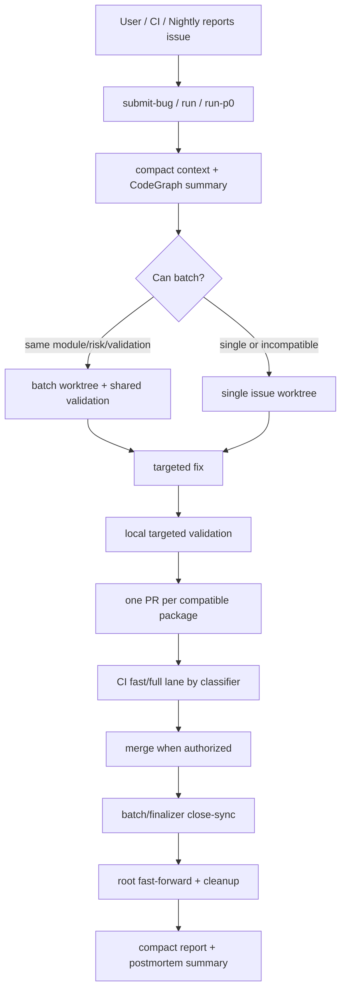

# AIstock Issue Workflow Efficiency Case Optimization Design v2.4

版本：v2.4
日期：2026-06-04
状态：实施设计稿
适用范围：AIstock issue / BUG 登记、修复、验证、PR、合入、close-sync、清理、复盘流程
继承基线：`docs/architecture/aistock_issue_workflow_efficiency_hardening_design_v2_2_20260529.md`
非目标：降低代码质量、绕过 PR/CI、跳过生产 Gate、修改业务功能、修改生产 DB 或运行时服务

## 1. 执行结论

最近两个真实案例暴露的主要问题不是验证标准过高，而是流程把固定成本重复放大：

- **长任务 5 小时案例**：约 5 小时 20 分内连续合入 29 个 PR，其中 PR 打开到合入累计约 126 分钟，剩余约 208 分钟主要消耗在 PR 间重复实现、验证、同步、清理、状态检查和上下文切换。
- **BUG-254 UI 案例**：Issue #714 13:17 创建，PR #730 15:57 合入，close-sync PR #732 16:01 合入；看似 2 小时 43 分，但集中修复与 PR/CI 阶段明显短得多，主要耗时来自排队穿插和 UI scope/验证计划不准。

v2.4 的目标是：**不降低质量，只减少重复闭环、重复上下文、重复输出和错误验证选择**。今后的 issue/BUG 处理应让代码定位、修复和必要验证成为主要耗时，而不是流程恢复和报告开销。

## 2. 设计原则

1. **质量不降级**：不跳过 PR、CI、required validation、production gates、GitHub/BUG 同步。
2. **减少重复闭环**：同一模块、同一风险域、同一验证链路的小修必须优先 batch，而不是每个微改单独 PR。
3. **成功路径 compact**：成功时只输出结果摘要；完整 JSON、CI rollup、事件列表、skipped map 只写 artifact 或失败时展开。
4. **Context Pack 优先**：默认读取 issue/context/CodeGraph 摘要和 scoped files；历史设计文档、归档记录、模块旧计划必须 opt-in。
5. **UI issue scope 必须准确**：UI Bug 登记时必须识别页面文件、API client、E2E spec、必要后端接口和验收步骤。
6. **验证按风险选择**：本地先跑 targeted tests + changed-only/static；完整矩阵由 PR CI 判定，避免开发中反复跑全量。
7. **close-sync 可批量**：registry-only close-sync 可集中 PR，但每个 BUG 仍保留独立证据、source PR、merge commit。
8. **耗时可观测**：workflow 必须区分 queue time、active fix time、local validation、PR/CI wait、merge/sync/cleanup。

## 3. 案例问题归因

### 3.1 多 PR 长任务

| 现象 | 根因 | 优化方向 |
| --- | --- | --- |
| 29 个 PR 连续合入，墙钟约 320 分钟 | 微小 workflow/docs/CI 改动逐个 PR | 同类小修 batch 成 1-3 个 PR |
| PR 累计打开到合入约 126 分钟 | 每个 PR 都重复 CI/merge/sync/cleanup | 减少 PR 数量，保留 per-issue evidence |
| 非 PR 间隔约 208 分钟 | 重复状态检查、切换、清理、报告 | 自动 postmortem + compact final report |
| docs-only 单独 PR | 文档说明与代码修复拆开 | docs-only 默认并入相关代码 PR |
| 成功路径输出过细 | JSON/rollup/token 噪声 | 成功只输出 PASS 摘要 |

### 3.2 BUG-254 UI 修复

| 现象 | 根因 | 优化方向 |
| --- | --- | --- |
| Issue 到 close-sync 约 2h43m | Issue 先登记后排队，期间穿插多个 PR | 记录 active_work_started_at，区分排队和修复 |
| 初始 Scope 不准 | 只列 API client 和 BUG JSON，实际主改 page/E2E/backend | UI intake 自动补全页面、spec、API、后端候选 scope |
| Reproduce/Evidence 为 n/a | UI Bug 缺少标准化复现字段 | UI BUG 必须有页面路径、操作步骤、期望/实际、验收项 |
| Initial required verification 偏窄 | 最终实际需要 tsc/E2E/backend target tests | validation selector 根据 UI scope 自动补充 frontend tsc + focused E2E |
| close-sync 单独 PR 固定 3 分钟 | registry-only 闭环单独执行 | 支持 close-sync batch 或 finalizer 合并处理 |

## 4. 目标工作流

## 5. 实施要求

### 5.1 Batch 默认策略

- workflow/CI/docs/code-intel/validation 小修：同一主题默认 batch。
- docs-only 说明：默认并入对应代码 PR；只有独立标准发布才单独 PR。
- 同模块 UI 小 Bug：如果页面、验证链路、风险一致，可共享一个 worktree 和 PR。
- 禁止 batch：跨业务域、不同风险级别、不同生产 gate、不同验证链路、scope 冲突。

### 5.2 Compact 输出

成功路径标准输出只保留：

- `workflow_gate`
- `bug_id` / `batch_id`
- `next_command`
- `changed_files_count`
- `validation_evidence_count`
- `pr_url` / `merge_commit`
- `production_*_gate`
- `postmortem_summary`

以下内容默认不直接输出到对话：

- 完整 `statusCheckRollup`
- 完整 `recent_events`
- 完整 `state.json/events.jsonl`
- skipped plans map
- 大段 CodeGraph/Understand Anything payload
- validation artifact JSON 全文

需要诊断时显式使用 `--output-format full-json` 或 `--output <path>`。

### 5.3 UI Bug Intake 增强

登记 UI Bug 时，workflow 必须生成或提示以下字段：

- `ui_route`：例如 `/paper-v2/advisory`
- `ui_component_scope`：页面、组件、API client、E2E spec
- `reproduce_steps`：至少 2-5 步；不能无理由写 `n/a`
- `visual_acceptance`：用户可见验收点
- `recommended_verification`：frontend tsc、targeted E2E、相关 backend target tests
- `labels`：`type:bug`、`ui`、`module:<module>`、`severity:<P0/P1/P2>`

当用户只给自然语言现象时，工具应基于 module/route/path 做候选 scope 推断，并在 Context Pack 中标记 `scope_source=inferred`，而不是登记空复现和错误 scope。

### 5.4 验证选择优化

- 开发中：先运行 targeted tests、frontend tsc、changed-only l0、scope check。
- PR 前：必须有与 risk/module 匹配的 evidence。
- PR CI：由 `ci_change_classifier.py` 选择 fast-lane/full-lane。
- UI 改动：如果仅触碰 frontend route/spec/API client，优先 `frontend tsc + focused E2E + changed-only l0`；只有触碰 backend router/service 才加入 targeted backend tests。
- BUG registry JSON 不应自动引入 `validation_center_backend`，除非实际变更影响 Validation Center。

### 5.5 Close-sync 和 aftercare 优化

- 已合入 source PR 后，优先使用 `merge-finalizer` 串联 close-sync、root sync、cleanup。
- 多个 registry-only close-sync 可使用批量 PR：每个 BUG 必须记录 source PR、merge commit、validation evidence、production gates。
- close-sync 评论语义必须准确：PR opened 时不能写 completed；只有 close-sync 持久化到 `origin/main` 后才能写 completed。

### 5.6 耗时与 token 复盘

每个 issue/batch 完成后，postmortem 至少输出 compact 摘要：

| 字段 | 含义 |
| --- | --- |
| `queue_minutes` | issue 创建到 active fix 开始 |
| `active_fix_minutes` | active fix 到首个修复 commit |
| `local_validation_minutes` | 本地验证累计 |
| `pr_ci_minutes` | PR 创建到 checks green |
| `merge_aftercare_minutes` | merge/close-sync/root sync/cleanup |
| `context_sources_count` | 读取的主要上下文源数量 |
| `full_json_suppressed` | 是否避免向对话输出完整 JSON |

## 6. 验收矩阵

| ID | 要求 | 验收方式 |
| --- | --- | --- |
| IWO24-001 | 成功路径输出 compact，不打印完整 JSON/CI rollup | workflow 单元测试 |
| IWO24-002 | UI BUG intake 能生成 route/scope/reproduce/verification hints | submit-bug/normalize 单元测试 |
| IWO24-003 | docs-only 可被建议合并到相关代码 PR | workflow recommendation 单元测试或 dry-run |
| IWO24-004 | close-sync completed 评论只在持久化后出现 | close-sync/finalizer 单元测试 |
| IWO24-005 | BUG registry metadata 不强制 validation_center_backend | validation-select 单元测试 |
| IWO24-006 | workflow/CI 小修保持 fast-lane | ci_change_classifier 单元测试 |
| IWO24-007 | postmortem 区分 queue 和 active fix | postmortem 单元测试 |
| IWO24-008 | Batch PR 保留 per-issue evidence | batch workflow smoke |

## 7. 预期收益

| 场景 | 当前浪费 | 目标改善 |
| --- | --- | --- |
| 7 个同类 workflow 小修 | 7 次 PR/CI/merge/cleanup | 合成 1-2 个 PR，墙钟节省 40-60% |
| 20+ 个小 PR 长任务 | 固定闭环重复放大 | batch 后从 5 小时级降到 2-3 小时级 |
| UI Bug 登记 | scope/reproduce/verification 不准 | 一次登记生成可修复 Context Pack |
| close-sync | 每 BUG 单独 2-4 分钟 | 批量或 finalizer 降低 aftercare 固定成本 |
| token | 成功 JSON/rollup 重复输出 | 成功路径 token 降低 50%+ |

## 8. 落地顺序

1. 合入本设计文档。
2. 在独立 worktree 实施 workflow 工具优化：compact recommendation、UI intake hints、postmortem timing 字段、close-sync completed 语义。
3. 增加/调整单元测试和 workflow-smoke。
4. 合入后刷新 Codex/Claude client skill/command 入口。
5. 用下一个真实 issue 验证：记录 active fix 时间和 compact 输出是否生效。

## 9. 生产 Gate

- `production_ddl_gate`: `noop`
- `production_frontend_dependency_gate`: `noop`
- `production_backend_dependency_gate`: `noop`

本设计只修改流程与文档，不触碰生产运行时、依赖或 DB。
