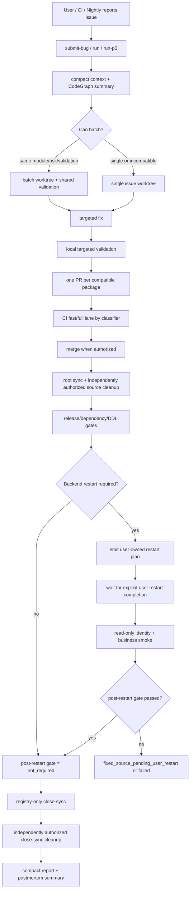

# AIstock Issue Workflow Efficiency, RTK and Restart Governance Design v2.5

版本：v2.5（稳定文件路径沿用 v2.4）
首次发布日期：2026-06-04
本次更新日期：2026-07-31
状态：设计审查修订完成，待 PR 检查与合入
适用范围：AIstock issue / BUG 登记、修复、验证、PR、合入、close-sync、清理、复盘流程
继承基线：`docs/architecture/aistock_issue_workflow_efficiency_hardening_design_v2_2_20260529.md`
稳定路径说明：沿用 v2.4 文件路径作为本主题唯一主设计，避免新增平行文档或复制第二套规范
非目标：降低代码质量、绕过 PR/CI、跳过生产 Gate、修改业务功能、修改生产 DB、替用户控制后端进程或把设计文档变成第二规范

## 1. 执行结论

最近两个真实案例暴露的主要问题不是验证标准过高，而是流程把固定成本重复放大：

- **长任务 5 小时案例**：约 5 小时 20 分内连续合入 29 个 PR，其中 PR 打开到合入累计约 126 分钟，剩余约 208 分钟主要消耗在 PR 间重复实现、验证、同步、清理、状态检查和上下文切换。
- **BUG-254 UI 案例**：Issue #714 13:17 创建，PR #730 15:57 合入，close-sync PR #732 16:01 合入；看似 2 小时 43 分，但集中修复与 PR/CI 阶段明显短得多，主要耗时来自排队穿插和 UI scope/验证计划不准。

v2.5 在保留 v2.4 提效目标的基础上增加三个必须同时落地的治理目标：

1. **RTK 纳入唯一开发规范**：支持时优先压缩高输出命令；不支持时明确回退，不把 RTK 变成阻塞任务的新门禁。
2. **后端重启默认归用户所有**：任何 Codex、Claude、子代理、Validation Center 或其他窗口都不能从修复、验证、合入或 aftercare 授权中推断后端重启权限。
3. **所有运行时相关 BUG 必须可跨重启生效**：修复必须落在持久化来源，并在用户完成重启后立即执行只读 smoke；仅在当前进程、热加载或手工缓存中成立的修复不能关闭 BUG。

最终目标仍是：**不降低质量，只减少重复闭环、重复上下文、重复输出和错误验证选择**。代码定位、修复和必要验证应成为主要耗时，流程恢复、报告和等待不应反复放大固定成本。

## 2. 设计原则

1. **质量不降级**：不跳过 PR、CI、required validation、production gates、GitHub/BUG 同步。
2. **减少重复闭环**：同一模块、同一风险域、同一验证链路的小修必须优先 batch，而不是每个微改单独 PR。
3. **成功路径 compact**：成功时只输出结果摘要；完整 JSON、CI rollup、事件列表、skipped map 只写 artifact 或失败时展开。
4. **Context Pack 优先**：默认读取 issue/context/CodeGraph 摘要和 scoped files；历史设计文档、归档记录、模块旧计划必须 opt-in。
5. **UI issue scope 必须准确**：UI Bug 登记时必须识别页面文件、API client、E2E spec、必要后端接口和验收步骤。
6. **验证按风险选择**：本地先跑 targeted tests + changed-only/static；完整矩阵由 PR CI 判定，避免开发中反复跑全量。
7. **close-sync 可批量**：registry-only close-sync 可集中 PR，但每个 BUG 仍保留独立证据、source PR、merge commit。
8. **耗时可观测**：workflow 必须区分 queue time、active fix time、local validation、PR/CI wait、merge/sync/cleanup。
9. **重启所有权与重启有效性分离**：窗口不得自行重启用户后端，但 workflow 必须产出可执行的用户重启计划和重启后验证计划。
10. **授权不扩散**：修复、PR、merge、close-sync、DDL、依赖安装、runtime activation、backend restart 分别授权和报告；任一状态不能推导另一个状态。
11. **文档不污染**：正式设计只进入 `docs/architecture/`，临时交换材料只进入忽略型 scratch；不得在根目录生成一次性 plan、日志、JSON 或 helper 脚本。

## 3. 案例问题归因

### 3.1 多 PR 长任务

| 现象 | 根因 | 优化方向 |
| --- | --- | --- |
| 29 个 PR 连续合入，墙钟约 320 分钟 | 微小 workflow/docs/CI 改动逐个 PR | 同类小修 batch 成 1-3 个 PR |
| PR 累计打开到合入约 126 分钟 | 每个 PR 都重复 CI/merge/sync/cleanup | 减少 PR 数量，保留 per-issue evidence |
| 非 PR 间隔约 208 分钟 | 重复状态检查、切换、清理、报告 | 自动 postmortem + compact final report |
| docs-only 单独 PR | 文档说明与代码修复拆开 | docs-only 默认并入相关代码 PR |
| 成功路径输出过细 | JSON/rollup/token 噪声 | 成功只输出 PASS 摘要 |

### 3.2 BUG-254 UI 修复

| 现象 | 根因 | 优化方向 |
| --- | --- | --- |
| Issue 到 close-sync 约 2h43m | Issue 先登记后排队，期间穿插多个 PR | 记录 active_work_started_at，区分排队和修复 |
| 初始 Scope 不准 | 只列 API client 和 BUG JSON，实际主改 page/E2E/backend | UI intake 自动补全页面、spec、API、后端候选 scope |
| Reproduce/Evidence 为 n/a | UI Bug 缺少标准化复现字段 | UI BUG 必须有页面路径、操作步骤、期望/实际、验收项 |
| Initial required verification 偏窄 | 最终实际需要 tsc/E2E/backend target tests | validation selector 根据 UI scope 自动补充 frontend tsc + focused E2E |
| close-sync 单独 PR 固定 3 分钟 | registry-only 闭环单独执行 | 支持 close-sync batch 或 finalizer 合并处理 |

## 4. 目标工作流



源码分支/worktree 的 cleanup 与 BUG close-sync 分离：它在 source merge 和 root sync 后即可按明确授权执行，不得因为等待用户重启而长期占用 worktree。未授权 cleanup 时记录 `cleanup=pending_user_authorization`，但不影响后续 post-restart 验证；close-sync 使用独立 registry worktree 或现有 batch close-sync 路径。

## 5. 实施要求

### 5.1 Batch 默认策略

- workflow/CI/docs/code-intel/validation 小修：同一主题默认 batch。
- docs-only 说明：默认并入对应代码 PR；只有独立标准发布才单独 PR。
- 同模块 UI 小 Bug：如果页面、验证链路、风险一致，可共享一个 worktree 和 PR。
- 禁止 batch：跨业务域、不同风险级别、不同生产 gate、不同验证链路、scope 冲突。

### 5.2 Compact 输出

成功路径标准输出只保留：

- `workflow_gate`
- `bug_id` / `batch_id`
- `next_command`
- `changed_files_count`
- `validation_evidence_count`
- `pr_url` / `merge_commit`
- `production_*_gate`
- `postmortem_summary`

以下内容默认不直接输出到对话：

- 完整 `statusCheckRollup`
- 完整 `recent_events`
- 完整 `state.json/events.jsonl`
- skipped plans map
- 大段 CodeGraph/Understand Anything payload
- validation artifact JSON 全文

需要诊断时显式使用 `--output-format full-json` 或 `--output <path>`。

### 5.3 UI Bug Intake 增强

登记 UI Bug 时，workflow 必须生成或提示以下字段：

- `ui_route`：例如 `/paper-v2/advisory`
- `ui_component_scope`：页面、组件、API client、E2E spec
- `reproduce_steps`：至少 2-5 步；不能无理由写 `n/a`
- `visual_acceptance`：用户可见验收点
- `recommended_verification`：frontend tsc、targeted E2E、相关 backend target tests
- `labels`：`type:bug`、`ui`、`module:<module>`、`severity:<P0/P1/P2>`

当用户只给自然语言现象时，工具应基于 module/route/path 做候选 scope 推断，并在 Context Pack 中标记 `scope_source=inferred`，而不是登记空复现和错误 scope。

### 5.4 验证选择优化

- 开发中：先运行 targeted tests、frontend tsc、changed-only l0、scope check。
- PR 前：必须有与 risk/module 匹配的 evidence。
- PR CI：由 `ci_change_classifier.py` 选择 fast-lane/full-lane。
- UI 改动：如果仅触碰 frontend route/spec/API client，优先 `frontend tsc + focused E2E + changed-only l0`；只有触碰 backend router/service 才加入 targeted backend tests。
- BUG registry JSON 不应自动引入 `validation_center_backend`，除非实际变更影响 Validation Center。

### 5.5 Close-sync 和 aftercare 优化

- 已合入 source PR 后，优先使用 `merge-finalizer` 串联 close-sync、root sync、cleanup。
- 多个 registry-only close-sync 可使用批量 PR：每个 BUG 必须记录 source PR、merge commit、validation evidence、production gates。
- close-sync 评论语义必须准确：PR opened 时不能写 completed；只有 close-sync 持久化到 `origin/main` 后才能写 completed。

### 5.6 耗时与 token 复盘

每个 issue/batch 完成后，postmortem 至少输出 compact 摘要：

| 字段 | 含义 |
| --- | --- |
| `queue_minutes` | issue 创建到 active fix 开始 |
| `active_fix_minutes` | active fix 到首个修复 commit |
| `local_validation_minutes` | 本地验证累计 |
| `pr_ci_minutes` | PR 创建到 checks green |
| `merge_aftercare_minutes` | merge/close-sync/root sync/cleanup |
| `context_sources_count` | 读取的主要上下文源数量 |
| `full_json_suppressed` | 是否避免向对话输出完整 JSON |

效率与 token 指标是持续优化观测项，不作为现阶段无法严格归因的合入阻断。优先复用现有 `context_estimated_tokens`、`artifact_estimated_tokens`、阶段耗时和事件计数，不为统计另起命令或重复读取日志。按 task tier/module/output mode 比较 P50/P90 趋势，目标是在不增加失败率、必需验证缺口和业务风险的前提下尽量降低：

- interactive compact stdout 的估算 token；
- task-card/Context Pack 的估算 token；
- workflow command count 与重复命令数；
- active fix 之外的固定流程时间；
- full JSON、完整 CI rollup 和重复文件片段的对话输出次数。

没有稳定样本时只报告 `baseline_status=insufficient_sample` 和当前观测值，不伪造百分比结论，也不阻断后续优化。普通 BUG 仍遵守 task-card-first；除非 BUG/用户/T3 直接引用，本设计全文不得自动注入 Context Pack。

### 5.7 RTK 使用契约

在唯一开发规范新增稳定规则 `[TOOL-RTK-001]`，由 Markdown 定义语义、同版本 YAML 提供机器引用：

- `git`、`rg`、`pytest`、`nox`、`npm` 等高输出外部命令在 RTK 可用且支持该子命令时优先使用 `rtk <command>`。
- `Get-Content`、`Test-Path`、PowerShell 控制语句或 RTK 不支持的子命令允许直接执行；回退必须基于能力缺失，而不是静默绕过。
- workflow 不强制追踪窗口执行的每条 shell 命令。只有调用方已经提供可观测 telemetry 时，postmortem 才以可选摘要记录 `rtk_used`、`rtk_version`、`fallback_used` 和 `fallback_reason`；缺失不触发额外探测、命令或阻断。
- RTK 不存在、子命令不受支持或过滤器未信任时不得阻断业务任务；不得由窗口自行执行 `rtk trust`，也不得把项目过滤器当作业务或安全权威。
- CI runner 不要求安装 RTK。CI 继续执行原始确定性命令，保证本地提效工具不会改变流水线语义。

该规则只解决交互窗口输出压缩，不改变测试选择、业务逻辑、退出码和持久证据。

### 5.8 后端重启所有权契约

在唯一开发规范新增稳定规则 `[BACKEND-RESTART-OWNERSHIP-001]`：

1. 默认所有 AIstock 后端实例均由用户负责重启，包括生产 `8001`、开发/验证 `8011/8012`、Validation Center、任务 worker、scheduler、WSL 后端和未固定端口的本地实例。
2. Codex、Claude、子代理、IDE 窗口、浏览器验证窗口、Validation Center、CI/nightly 编排器不得自行重启用户拥有的后端。
3. BUG 修复、测试、PR、merge、close-sync、aftercare、依赖安装、DDL、浏览器验证或“重启后验收”请求均不包含重启授权。
4. 只有用户在当前任务中明确给出具体目标（服务/进程/端口/节点）和明确执行授权时，对应窗口才能执行一次该目标的重启；授权不能跨目标、跨窗口或跨任务复用。
5. 未获授权时，窗口只输出 `backend_restart=pending_user_action`、受控 `operator_runbook_ref`、预期 runtime identity 和后续只读 smoke ref，然后等待用户执行；不得自行拼接或试运行重启命令。
6. CI/测试框架可以创建并销毁由该测试在隔离端口上自行拥有的临时进程，但不得探测后控制、停止或替换用户已有后端；临时进程必须有 runner-owned identity 和 teardown receipt。

这是用户明确要求的运维所有权，不是私增审批、RBAC 或业务门禁。它只约束实际进程控制，不阻止静态测试、subprocess 单测、隔离 cold-start 测试和重启计划生成。

### 5.9 BUG 重启后生效契约

在唯一开发规范新增稳定规则 `[BUG-RESTART-EFFECTIVE-001]`。每个正式 BUG 必须由 workflow 生成以下字段：

```yaml
runtime_impact: unknown | none | backend | worker | scheduler | frontend | client | database
backend_restart_required: unknown | true | false
backend_restart_owner: user | not_applicable
backend_restart_target_id: <catalog-id-or-not-required>
frontend_activation_required: true | false | not_applicable
client_reload_required: true | false | not_applicable
database_readback_required: true | false | not_applicable
persistence_basis_ref: <workflow-artifact-ref-or-not-required>
post_restart_smoke_ref: <catalog-or-workflow-artifact-ref-or-not-required>
post_restart_effective_gate: classification_required | not_required | pending_user_restart | passed | failed
```

该结构按影响 lazy 展开：

- `runtime_impact=none` 只在 compact task-card 保留 `runtime_impact`、`backend_restart_required=false` 和 `post_restart_effective_gate=not_required`，其余字段留在 machine state 或省略。
- `backend/worker/scheduler` 才展开 backend restart target、persistence 和 post-restart smoke。
- `frontend/client/database` 分别进入 activation、reload、readback 状态，不借用后端重启授权。
- 无法可靠分类时保持 `runtime_impact=unknown`、`post_restart_effective_gate=classification_required`；在 `finish` 前必须解析，禁止默认成 `none`。

### 5.9.1 Runtime target catalog

新增受控 workflow catalog（建议 `configs/workflow/runtime_targets.yaml`，实现前由 ownership/catalog review 确认最终位置），每个目标至少包含：

```yaml
target_id: <stable-id>
service_kind: backend | worker | scheduler
owner: user
node_ref: <non-secret-node-ref>
port_ref: <config-ref>
health_probe_ref: <allowlisted-read-only-probe>
identity_probe_ref: <merge/config/schema/dependency-probe>
business_smoke_ref: <allowlisted-read-only-smoke>
startup_budget_ref: <versioned-config-ref>
operator_runbook_ref: <existing-user-runbook>
```

workflow 只渲染 catalog 中的 allowlisted ref，不根据端口、进程名或 changed files 自行拼接 process-control 命令。catalog 缺失、target 不唯一或 probe 不完整时显式返回 `restart_plan_unavailable`；不得猜测、扫描并控制用户进程或降级为成功。catalog 不保存密码、token、私钥或原始连接串。

验收语义：

- 运行时相关修复必须持久化到已合入源码、版本化配置、数据库 migration/DML readback、不可变 release 或持久任务状态；禁止只依赖 monkey patch、热加载、当前内存、手工 cache clear 或未追踪文件。
- PR 前至少提供一次 fresh-process/subprocess/cold-import 直接测试，证明修复不依赖当前解释器或 Node 进程残留。
- 涉及任务、队列、scheduler、idempotency key、远程 task mapping 或运行状态的修复，必须证明从 DB/CAS/outbox/manifest 等正式来源恢复。
- 源码 PR 可以在 `post_restart_effective_gate=pending_user_restart` 时合入，且已合入源码的 root sync 与获授权的 source cleanup 不等待用户重启；BUG/GitHub Issue 不能 close-sync 为完成，状态保持 `fixed_source_pending_user_restart`。
- 用户完成目标后端重启后，窗口只执行健康、runtime identity 与业务行为的只读 smoke。`merge_sha/config/schema/dependency` 任一不匹配或首个业务 smoke 失败时，gate 为 `failed`。
- `runtime_impact=none` 的纯文档、纯测试或 registry 修复使用 `backend_restart_required=false`、`post_restart_effective_gate=not_required`，并记录分类依据，禁止用 `not_required` 掩盖运行时影响。

“立即生效”定义为：目标后端在其配置化 startup budget 内进入 ready，随后第一次只读业务 smoke 通过，不需要窗口再次改代码、补配置、清缓存或执行第二次重启。

### 5.10 Workflow CLI 与状态机修改

优先扩展现有 `scripts/aistock_issue_workflow.py`，不新建第二套 orchestrator：

- `start/build_task_card`：根据 changed-file ownership、模块和 BUG 描述生成 runtime impact；不确定时为 `unknown`。compact task-card 只内联最小状态，完整 restart contract 使用 artifact/catalog ref。
- `finish`：验证 persistence basis、fresh-process evidence 和 restart plan；缺少时 `closure_ready=false`，但不要求在 PR 前实际控制生产后端。
- `merge-finalizer/close-sync`：当 `backend_restart_required=true` 且 gate 未通过时仅停止 BUG 关闭，返回 `fixed_source_pending_user_restart`；source cleanup 作为独立状态继续按授权处理，不得把 source merged 改写为 BUG completed。
- `restart-plan --bug-id BUG-NNN` 是可选详情命令；`finish/finalizer` 默认已在 compact receipt 返回 `operator_runbook_ref`、target id、预期 identity 与 smoke ref，避免为常规路径增加一次命令。该命令只展开 catalog 引用，不执行进程控制。
- `post-restart-verify --bug-id BUG-NNN --target <target>` 是 runtime/API/DB 只读命令，但允许向忽略型 workflow state/artifact 写验证 receipt；tracked BUG JSON 和 GitHub 状态只由后续 close-sync 持久化。命令实现中不得包含 start/stop/restart 动作。
- compact receipt 增加 `backend_restart`、`post_restart_effective_gate`、`runtime_identity_match` 和 `next_user_action`；完整证据仍只写任务 workflow artifact。
- `postmortem` 分离 `waiting_for_user_restart_minutes`，避免把用户操作等待误算为 active fix time。

验证结果支持内容寻址复用：`validation_receipt_key = commit_sha + changed_files_hash + dependency_lock_hash + environment_fingerprint + normalized_test_command`。五项完全一致且 receipt 未过期时可复用；任一项变化立即失效。复用只减少重复执行，不改变 required plan，也不得复用失败、部分或环境阻断结果。

Git 状态检查固定在开始、提交前、交付前三个节点；只有并发写入、远端移动、dirty-file 变化或 workflow 明确要求时追加检查，避免循环执行 status/stash/rebase。

`scripts/issue_flow.py` 只承载共享 schema/Context Pack 字段；不得复制标准正文。已有 BUG JSON 的兼容策略是缺失新字段时按 changed files 重新推断并标记 `schema_upgrade_required`，不得默认为 `not_required`。

### 5.11 Skill、Claude command 与客户端同步

实现 PR 必须同步修改以下入口的职责描述，但它们只引用标准 rule ID，不复制完整规范：

| 入口 | 必须新增的行为 |
| --- | --- |
| `.codex/skills/aistock-task-router/SKILL.md` | 默认用户拥有后端重启；路由不得把验证或 aftercare 解释为重启授权；支持命令优先 RTK |
| `.codex/skills/fix-aistock-issue/SKILL.md` | task-card 读取最小 runtime impact/ref；PR 前 fresh-process evidence；未重启时保持 pending |
| `.codex/skills/aistock-merge-aftercare/SKILL.md` | merge/源码 cleanup/部署/重启/close-sync 分离；默认输出用户 runbook ref，不执行后端重启 |
| `.codex/skills/aistock-validation-delegation/SKILL.md` | VC/CI 只能管理 runner-owned 隔离进程；不得重启用户后端 |
| `.codex/skills/aistock-readonly-triage/SKILL.md` | 明确所有后端 restart 都超出只读范围 |
| `.codex/skills/verify-aistock-feature/SKILL.md` | feature runtime acceptance 复用相同重启所有权与 post-restart evidence |
| `.codex/skills/aistock-docs-handoff/SKILL.md` | 受控规范/skill 变更必须独立 worktree、workflow smoke，过程文件不得落根目录 |
| 对应 `.claude/commands/*.md` | 与 Codex 入口保持相同语义和 hash 同步 |

合入上述 client 文件后执行 `install-client --apply`，再用 `verify-clients --workflow-only` 校验所有目标 hash。旧客户端窗口重开只用于加载新入口，不等于、也不授权后端重启。

### 5.12 CI、guardrail 与测试修改

不新增独立长流水线，复用现有 workflow validation fast lane：

- `docs/standards/aistock_development_standard_v1.5_20260523.md`：增加三个稳定 rule ID。
- 同版本 YAML：更新 `source_sha256/updated_at`，新增 RTK machine reference、backend restart ownership manual control、BUG post-restart required evidence。
- runtime target catalog：保存非秘密 target identity、read-only probe、startup budget 和 operator runbook ref；缺项 fail closed。
- `scripts/ci_change_classifier.py`：确保标准、相关 skills/commands、workflow CLI 和 guardrail 测试仍路由到 `workflow_validation_only/docs_controlled`，不触发无关 backend 全矩阵。
- `scripts/aistock_guardrail_scan.py` 或一个被其调用的窄检查：扫描 workflow/client/CI 路径中的未授权用户后端 process-control 命令；runner-owned 临时进程只允许通过显式结构化标记和隔离端口规则。
- `.github/workflows/test.yml`：继续使用现有 workflow-validation-tests job，只增加目标测试；不得新增真实后端重启步骤。
- `.github/workflows/pr-quality.yml`：在 compact summary 中显示 restart policy 检查结果和 docs-controlled 分类，不打印完整 receipt。
- `backend/tests/test_aistock_guardrail_scan.py`：验证 Markdown/YAML 引用、source digest 和 process-control guardrail。
- `backend/tests/scripts/test_aistock_issue_workflow.py`：覆盖 task-card、finish、restart-plan、post-restart-verify、close-sync pending/pass/fail 和旧 BUG schema 升级。
- `backend/tests/scripts/test_ci_change_classifier.py`：覆盖标准+skill+workflow 混合变更仍使用 focused workflow lane。
- `backend/tests/scripts/test_issue_flow.py`：覆盖新 Context Pack 字段和唯一标准引用。

### 5.13 文档流程与目录洁净

本设计及后续实现必须遵守：

1. 设计更新使用最新 `origin/main` 创建 task branch 与独立 worktree；`F:\Dev\AIstock` 仅作为 sync/runtime root。
2. 本主题只保留当前主设计文件；不得再创建 `proposal-final.md`、`new-plan.md` 或重复标准。
3. 正式设计进入 `docs/architecture/`；临时 handoff 仅进入 `tmp/handoff/`、`docs/handoff/_scratch/` 或 `docs/handoff/local/`。
4. 禁止新增或改写项目根目录的 `task_plan.md`、`findings.md`、`progress.md`、一次性 JSON、日志或调试脚本。最新 `origin/main` 已存在的三个同名 tracked 文件属于本设计之外的历史库存；本设计只读识别，不修改、不删除，后续清理必须由用户对明确文件另行授权。
5. 设计 PR 使用 docs-fast-update：`git diff --check`、docs classifier dry-run、确认仅变更本主设计文件。
6. 后续标准/skill/workflow 实现使用独立 docs-controlled/workflow PR，不与本设计 PR 偷渡；运行 workflow smoke、标准 digest/anchor 一致性、focused unit tests 和 client hash dry-run。
7. 未经明确授权不合入设计或实现 PR，不同步生产根目录，不执行 `install-client --apply`，不清理 task worktree/branch。

### 5.14 文件级实施清单

| 阶段 | 文件 | 修改目的 |
| --- | --- | --- |
| D0 设计 | 本设计文件 | 固化边界、验收 ID、实施顺序；不改执行行为 |
| D1 唯一规范 | `docs/standards/aistock_development_standard_v1.5_20260523.md/.yaml` | 新增 RTK、重启所有权、重启后生效 rule ID 与派生元数据 |
| D2 Workflow | `scripts/aistock_issue_workflow.py`, `scripts/issue_flow.py`, runtime target catalog | lazy restart contract、状态机、catalog refs、runtime-read-only verify、receipt 复用、兼容升级 |
| D3 Guardrail/CI | `scripts/aistock_guardrail_scan.py`, `scripts/ci_change_classifier.py`, `.github/workflows/test.yml`, `.github/workflows/pr-quality.yml` | 拒绝未授权后端控制并保持 focused lane，不新增真实 restart job |
| D4 客户端入口 | 上表 Codex skills 与对应 Claude commands | 跨窗口一致执行，不复制规范正文 |
| D5 测试 | guardrail、issue workflow、classifier、issue flow focused tests | 证明门禁、兼容、无真实重启和最小流水线路由 |
| D6 客户端 aftercare | `install-client`, `verify-clients` 运行证据 | 合入后同步入口；与后端重启完全分离 |

## 6. 验收矩阵

| ID | 要求 | 验收方式 |
| --- | --- | --- |
| IWO24-001 | 成功路径输出 compact，不打印完整 JSON/CI rollup | workflow 单元测试 |
| IWO24-002 | UI BUG intake 能生成 route/scope/reproduce/verification hints | submit-bug/normalize 单元测试 |
| IWO24-003 | docs-only 可被建议合并到相关代码 PR | workflow recommendation 单元测试或 dry-run |
| IWO24-004 | close-sync completed 评论只在持久化后出现 | close-sync/finalizer 单元测试 |
| IWO24-005 | BUG registry metadata 不强制 validation_center_backend | validation-select 单元测试 |
| IWO24-006 | workflow/CI 小修保持 fast-lane | ci_change_classifier 单元测试 |
| IWO24-007 | postmortem 区分 queue 和 active fix | postmortem 单元测试 |
| IWO24-008 | Batch PR 保留 per-issue evidence | batch workflow smoke |
| IWO25-001 | 唯一规范包含 `[TOOL-RTK-001]`，支持时优先 RTK、缺失时显式回退 | Markdown/YAML anchor 与 workflow 单测 |
| IWO25-002 | 所有用户后端默认 `backend_restart_owner=user`，任何窗口不得推断授权；frontend/client/database 使用独立状态 | guardrail scan + skill/command contract 测试 |
| IWO25-003 | runner-owned 临时进程与用户后端严格区分 | CI fixture + isolation/port contract 测试 |
| IWO25-004 | task-card lazy 输出 runtime impact/ref；只有 backend/worker/scheduler 展开完整 restart contract | issue workflow 单元测试 |
| IWO25-005 | 缺少 fresh-process evidence 时 `closure_ready=false` | finish 单元测试 |
| IWO25-006 | source merge 后 gate pending 时不能 close-sync completed | merge-finalizer/close-sync 单元测试 |
| IWO25-007 | `restart-plan` 只展开受控 catalog/runbook refs，不拼接或执行 process control | subprocess mock/forbidden-call 单元测试 |
| IWO25-008 | `post-restart-verify` 对 runtime/API/DB 只读，仅向 workflow artifact 写 receipt | HTTP/DB readback fixture 与 tracked-write rejection 测试 |
| IWO25-009 | 旧 BUG 缺字段时要求 schema upgrade，不默认为 no-op | compatibility 单元测试 |
| IWO25-010 | 标准/skill/workflow 混合变更只进入 focused workflow CI | classifier 单元测试和 CI dry-run |
| IWO25-011 | 客户端同步后 Codex/Claude workflow lane hash 一致 | install-client dry-run + verify-clients |
| IWO25-012 | 设计和实现均不新增或改写项目根目录过程文件；历史库存不被本任务触碰 | changed-files/root-pollution 检查 |
| IWO25-013 | DESIGN-COMPLIANCE-001 四项逐项有直接证据 | 设计/代码/PR review matrix |
| IWO25-014 | source cleanup 不等待用户重启，且 cleanup 未授权时保持独立 pending | finalizer 状态机单元测试 |
| IWO25-015 | runtime target catalog 缺失、冲突或 probe 不完整时 fail closed | catalog schema/negative fixture 测试 |
| IWO25-016 | `runtime_impact=unknown` 不能静默转成 `none` | finish compatibility 单元测试 |
| IWO25-017 | RTK telemetry 缺失不触发探测、额外命令或阻断 | workflow/postmortem 单元测试 |
| IWO25-018 | 完全相同 validation receipt 可复用，任一 identity 输入变化即失效 | receipt-key 单元测试 |
| IWO25-019 | 普通成功路径不会因为 restart governance 增加必执行的 `restart-plan` 命令 | fast-path/workflow-smoke 命令计数断言 |
| IWO25-020 | 旧 IWO24 能力标记为 baseline regression，不重复实现 | current-state mapping review |

### 6.1 当前状态映射

| 验收组 | 当前状态 | 后续动作 |
| --- | --- | --- |
| IWO24-001~008 | 现有 workflow 已具备 compact、UI intake、batch/finalizer、postmortem 等主要基础；具体项以实现 PR 的 live test 为准 | 作为 regression baseline，只补缺口，不重复开发 |
| IWO25-001~020 | 本设计定义，尚未进入唯一规范、skills 或执行代码 | 在独立 docs-controlled/workflow PR 实现和逐项验证 |

当前状态映射只用于避免重复步骤，不把“已有相似能力”冒充为新验收已通过。

## 7. 预期收益

| 场景 | 当前浪费 | 目标改善 |
| --- | --- | --- |
| 7 个同类 workflow 小修 | 7 次 PR/CI/merge/cleanup | 在兼容时合成 1-2 个 PR，尽量消除重复 CI/aftercare 固定成本 |
| 20+ 个小 PR 长任务 | 固定闭环重复放大 | 优先 batch、receipt 复用和三节点 Git 检查，持续压缩非 active-fix 时间 |
| UI Bug 登记 | scope/reproduce/verification 不准 | 一次登记生成可修复 Context Pack |
| close-sync | 每 BUG 单独 2-4 分钟 | 批量或 finalizer 降低 aftercare 固定成本 |
| token | 成功 JSON/rollup、重复上下文和大段命令输出 | 复用现有估算指标持续最大化降低；样本不足时不伪造固定百分比 |
| 重启验证 | merge 后临时热状态被误当完成 | 首次 cold-start smoke 可判定、可追溯 |
| 后端控制 | 多窗口可能把验证请求解释为重启授权 | 默认用户执行，窗口只生成计划和只读验证 |
| 文档管理 | 同主题方案和根目录过程文件扩散 | 单一主设计 + 独立 worktree + scratch 隔离 |

## 8. 落地顺序

1. 通过 docs-fast-update PR 审查并合入本设计，设计 PR 不改规范、skill 或执行代码。
2. 新建独立 docs-controlled/workflow worktree，一次性更新唯一标准 Markdown/YAML、workflow schema 与 focused tests。
3. 增加 runtime target catalog，更新 Codex skills、Claude commands、classifier 与现有 CI jobs，运行标准 digest、catalog negative fixtures、workflow smoke、focused tests 和 client dry-run。
4. 经明确授权合入实现 PR；分别报告 source merge、root sync、client install、backend restart 和 runtime verification。
5. 合入后执行 `install-client --apply` 与 `verify-clients --workflow-only`；只要求客户端窗口重开加载入口，不触碰后端。
6. 用下一个 runtime 相关真实 BUG 验证 `source merge -> root sync/获授权 source cleanup -> fixed_source_pending_user_restart -> 用户重启 -> post-restart passed -> registry-only close-sync` 完整状态机。
7. 用一个 `runtime_impact=none` 的 docs/test BUG 验证 no-op 分类不会额外制造重启步骤。

## 9. 生产 Gate

- `production_ddl_gate`: `noop`
- `production_frontend_dependency_gate`: `noop`
- `production_backend_dependency_gate`: `noop`

本设计 PR 只修改主设计文档，不触碰生产运行时、依赖或 DB，也不执行客户端同步。

后续实现 PR 预计仍为：

- `production_ddl_gate`: `noop`
- `production_frontend_dependency_gate`: `noop`
- `production_backend_dependency_gate`: `noop`
- `backend_restart`: `pending_user_action` 或 `not_required`，绝不由实现窗口自行执行

## 10. DESIGN-COMPLIANCE-001 预审

| 检查项 | 本设计约束 | 当前结论 |
| --- | --- | --- |
| 禁止简化交付 | 标准、YAML、runtime catalog、workflow、skills/commands、CI、测试和 client sync 全部纳入 D1-D6；IWO25-001~020 覆盖实现与负例 | `PASS` for design scope；实现证据待后续 PR |
| 禁止静默错误 | `runtime_impact=unknown`、catalog 缺失/冲突、schema upgrade、identity mismatch、post-restart failure 均为显式非成功状态 | `PASS` for design scope；实现证据待后续 PR |
| 禁止改变业务逻辑 | 本设计只调整开发流程和进程控制所有权；backend restart、frontend activation、client reload、DB readback 分开，不修改交易、研究或数据业务语义 | `PASS` for design scope |
| 禁止私增门禁审批 | 后端用户重启所有权来自本次明确用户要求；指标样本不足不阻断，且不增加 RBAC、ACK、研究审批或 frontend/client/database 人工门禁 | `PASS` for design scope |

本表只表示设计范围预审，不代表后续实现、PR、merge、client sync 或 runtime 验证已经完成。
