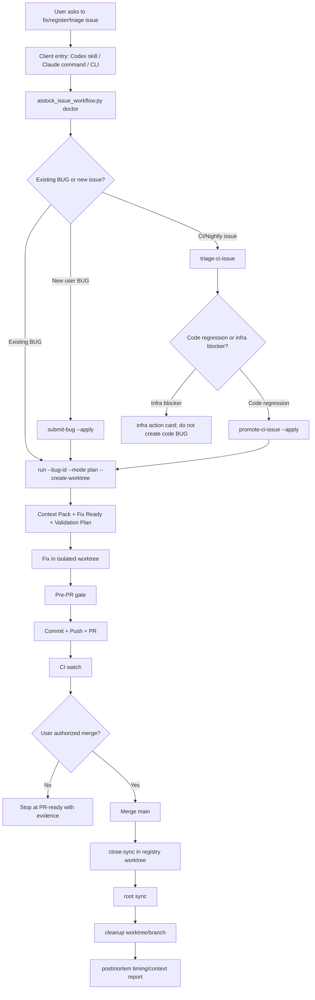

# AIstock Issue Workflow Efficiency Hardening Design v2.2

Version: v2.2
Date: 2026-05-29
Status: implementation baseline
Scope: issue workflow, CI/CD intake, PR quality, merge/close-sync/cleanup telemetry
Non-goals: historical business BUG fixes, Paper v2 business changes, StrategyPackage manifest repair, Research Assistant feature repair, production DB/runtime changes

## 1. Executive Summary

AIstock issue handling is currently correct in intent but still too expensive in practice. Small and medium issues can become several-hour tasks because developer windows repeatedly rediscover context, split registration from repair, create duplicate worktrees, run overly broad validation, and manually recover after merge/close-sync/cleanup gaps.

This design keeps the current governance and quality model intact while reducing waste. The main change is to make `scripts/aistock_issue_workflow.py` and CI gates the enforceable workflow source of truth for Codex, Claude Code, Cursor, and generic CLI/IDE agents.

The expected result is not lower standards. The expected result is that time shifts back from workflow recovery to actual code repair and required validation.

## 2. Current Workflow Model

## 3. Failure Modes Observed

| Area | Symptom | Cost impact | Required hardening |
| --- | --- | --- | --- |
| Startup context | Agents read old project memory, archived designs, or full module plans | Tens of thousands of tokens before code | Context Pack and CodeGraph first, historical docs only on demand |
| Registration | BUG JSON, GitHub Issue, registry PR, fix PR split | 30-60 minutes before repair | `submit-bug` must continue to fix by default |
| Worktree state | Dirty or duplicate worktrees | Manual recovery and duplicated validation | Single-active worktree guard and resume-first behavior |
| CI/Nightly intake | Runner outage promoted as code BUG | Wasted repair loops | Classify infra blockers and stop before BUG promotion |
| Validation | T0/T1 changes run T2/T3 style validation | Slow feedback | Risk-tiered selector and batch shared validation |
| Scope seed | Initial BUG scope misses shared root-cause files such as `backend/core/data_source_manager_impl.py` | Manual scope expansion before actual repair | File ownership must cover shared product support files and tests |
| PR quality | `linked_issues: none`, `scope_check: not_provided` | Manual review and merge risk | PR Quality must infer BUG linkage and scope evidence |
| Merge close | close-sync and cleanup require manual fallback | 10-60 minutes after merge | Merge finalizer and cleanup evidence |
| Telemetry | Timing is reconstructed manually | Repeated debates without data | Default postmortem in PR/final report |

## 4. Design Principles

1. Preserve quality gates. Do not skip validation, production gates, or GitHub/BUG sync.
2. Make the repo CLI authoritative. Skills and commands are thin entry wrappers.
3. Prevent wrong paths instead of documenting them repeatedly.
4. Optimize by risk tier and scope, not by weakening checks.
5. Batch only compatible same-module issues and keep per-issue evidence.
6. Treat CodeGraph and Understand Anything as accelerators, not truth sources.
7. Keep root `F:\Dev\AIstock` clean; generated artifacts must stay under ignored workflow/artifact directories.
8. Do not touch production backend `8001`, frontend `3000`, DB, DDL, or dependencies in this hardening slice.

## 5. Immediate Implementation Scope

### 5.1 CI/Nightly Infra Classification

`triage-ci-issue` already detects `infra_flaky` for runner outage signatures. This phase makes the behavior enforceable:

- `promote-ci-issue --apply` must refuse infra-only issues unless explicitly overridden in a future audited mode.
- The output must contain an infra action card instead of a code BUG next command.
- Nightly auto-filed issues must use normalized labels such as `severity:p1`, `module:validation`, and `source:nightly` when available.
- Runner health diagnostics must use `AISTOCK_RUNNER_HEALTH_TOKEN`, `GH_TOKEN`, `GITHUB_TOKEN`, and then `gh auth token` fallback for local diagnostics.

### 5.2 Submit-Bug Continue-To-Fix

`submit-bug` should make the normal path obvious:

- Default `next_command` after successful submit points to `run --bug-id <id> --mode plan --create-worktree`.
- `registry-pr-only` is explicitly marked as intake-only and not the default repair path.
- The output includes `fix_chain` with `next_command`, `stop_reason`, and `registry_pr_only`.

### 5.3 PR Quality Linkage And Scope Inference

PR Quality currently comments but can miss linkage and scope. This phase improves evidence without becoming overly strict:

- Infer linked BUG IDs from PR title, body, branch name, commit messages, and changed BUG JSON filenames.
- Pass PR title/body into PR Quality through `AISTOCK_PR_TITLE` and `AISTOCK_PR_BODY` so GitHub issue references can be inferred without an extra API call.
- Infer GitHub issue numbers from BUG JSON changed in the PR when available.
- Report `scope_source=inferred_from_bug_json`, `scope_source=issue_record`, or `scope_check=missing` instead of ambiguous `not_provided`.
- Keep this warning-only initially; do not block unrelated open PRs.

### 5.4 Postmortem Default Path

Every PR-ready or merged workflow should expose a `postmortem` next command. This phase ensures:

- PR body and final output mention the postmortem command.
- `postmortem` includes phase timing, known command durations, context token estimates, duplicate worktree count, stale PR check, and production gates.

### 5.5 BUG-195 Follow-Up: Small-BUG Lower-Bound Path

BUG-195 completed the full issue-to-cleanup loop in roughly 24 minutes, which is a major improvement over earlier 1-3 hour workflow loops, but its postmortem still exposed avoidable overhead. The next repair slice is therefore part of v2.2 efficiency hardening, not a new platform direction:

- **Scope seeding**: product support files used by small operator-facing bugs must be covered by `file_ownership.yaml`. For the BUG-195 class, `backend/core/data_source_manager_impl.py`, watchlist service/router code, and focused watchlist tests map to the `watchlist` module so future runs do not require manual scope expansion.
- **Metadata validation weight**: BUG registry JSON is workflow metadata. Registration and close-sync metadata should keep schema/module-quality validation, but they must not automatically add `validation_center_backend` to every product bug fix.
- **CodeGraph reuse in worktrees**: `doctor` may report CodeGraph ready in canonical `F:\Dev\AIstock` while a new git worktree has no local `.codegraph` directory. Context and postmortem steps should reuse the canonical repo graph for matching commits/paths and only fall back to targeted `rg` when no usable graph index exists.
- **Compact success output**: successful workflow commands keep stdout to compact PASS/summary fields. Full JSON, skipped-plan maps, raw check rollups, and verbose CodeGraph payloads stay in artifact files and require explicit `--output-format full-json` or `--output`.
- **Quality boundary**: these optimizations do not skip tests. They replace broad default validation with narrower catalog/context selection and preserve production dependency/DDL gates.

### 5.6 Workflow/Validation CI Fast Lane

Workflow and CI/CD hardening PRs should not pay the full business backend matrix cost when they only touch issue-flow scripts, workflow YAML, workflow docs, and their focused unit tests.

- `ci_change_classifier.py` must classify a conservative allowlist as `workflow_validation_only`.
- `workflow_validation_only` must set `backend_required=false` and `workflow_validation_required=true`.
- GitHub Actions must still run static gate, PR Quality, Semgrep, CodeQL, and a focused workflow validation test job.
- Any backend router/service, business module, Paper v2, QE, Research Assistant, or production-adjacent file must keep `classification=full_ci_required`.
- Close-sync metadata-only behavior remains a separate lane and must not be weakened.

## 6. Deferred But Required Follow-Up

| Phase | Item | Reason for deferral |
| --- | --- | --- |
| v2.3 | Full merge finalizer including close-sync PR merge authorization loop | Needs careful GitHub merge edge-case testing |
| v2.3 | Batch validation selector hardening | Implemented baseline; continue module catalog tuning as real batches expose gaps |
| v2.4 | PR Quality warning-to-blocking for P0/P1 workflow evidence | Should bake in warning mode first |
| v2.4 | Nightly CodeGraph freshness artifact | Depends on self-hosted runner restoration |
| v2.5 | Understand Anything weekly graph | Not needed for small issue workflow |

## 6.1 v2.3 Merge Finalizer Implementation Baseline

The first v2.3 slice adds a `merge-finalizer` command to reduce post-merge manual chaining without adding a hard gate to normal issue repair:

- Verify the source/fix PR is already merged.
- Run `close-sync` through an isolated registry worktree and reuse an existing clean close-sync worktree when a previous attempt was interrupted.
- Commit and open or reuse the close-sync PR while staging only `tests/aistock_validation/bugs/**`.
- Optionally merge the close-sync PR and run cleanup only when the user authorized the full aftercare loop.
- Always return next actions and postmortem data so a restarted Codex or Claude Code window can continue without rediscovery.

This keeps the default safe path unchanged: normal agents can stop at a close-sync PR, while authorized full aftercare can proceed to cleanup. It does not touch production runtime, DB, DDL, or dependencies.

## 6.2 v2.3 Batch Validation Selector Implementation Baseline

The second v2.3 slice hardens same-module batching without making ordinary single-issue repair slower:

- `start-batch` now emits `batch_selector` with shared allowed scope, selected required plans, production/dependency gates, and per-issue validation coverage.
- `start-batch` blocks records that have no `allowed_write_scope` / `suggested_scope`, so a batch cannot start with ambiguous write ownership.
- `finish-batch` re-runs the selector against the actual changed files and emits `scope_check`; changed files outside the shared scope return `workflow_gate=blocked`.
- Batch scope expansion, non-noop production gates, or missing shared validation coverage require a split batch or explicit issue scope correction before PR.
- The selector reuses `test_plans.yaml` / ownership catalog selection instead of introducing a new validation truth source.

This improves efficiency by allowing compatible issues to share context and validation while preserving per-issue evidence and preventing hidden cross-scope changes.

## 6.3 BUG-197 Follow-Up: Close-Sync Finalizer Persistence State

BUG-196 aftercare exposed a merge-finalizer edge case: a close-sync BUG JSON can be fixed in an existing close-sync branch and open PR while not yet merged into `origin/main`. That state must not be reported as `already_merged`.

The v2.3 finalizer must distinguish three states without rebuilding duplicate registry work:

- `origin_main_ref`: fixed BUG JSON is already visible from `origin/main`; finalizer can report `already_merged`.
- `merged_close_sync_pr`: an existing close-sync PR is merged; finalizer can report `already_merged` and proceed to cleanup checks.
- `open_close_sync_pr`: an existing close-sync PR is open; finalizer must report `pr_opened`, optionally merge it only when `--merge-close-sync-pr` is set, and otherwise return a merge next action.

If a fixed BUG JSON is found only in the current snapshot and neither a merged nor open close-sync PR can be found, the finalizer blocks with an explicit persistence message instead of silently treating the state as merged. This keeps the common aftercare path fast while preventing false completion reports and duplicate close-sync PRs.

## 7. Acceptance Matrix

| ID | Requirement | Validation |
| --- | --- | --- |
| IWEH-001 | Infra Nightly runner issues are not promoted as code BUGs | Unit test for `promote-ci-issue` with runner outage summary |
| IWEH-002 | Runner health local diagnostics can use `gh auth token` fallback | Unit test with mocked token provider |
| IWEH-003 | Submit BUG output returns fix-chain next command | Unit test for `submit-bug` dry-run/apply payload |
| IWEH-004 | PR Quality can infer BUG linkage from branch/body/BUG JSON | Unit test or script dry-run with representative inputs |
| IWEH-005 | PR Quality reports scope evidence instead of `not_provided` when BUG JSON is present | PR Quality script/test output |
| IWEH-006 | Quickstart documents infra stop, continue-to-fix, and postmortem defaults | Markdown review |
| IWEH-007 | Root remains clean after validation | `git status -sb --untracked-files=all` |
| IWEH-008 | PR title/body issue references are available to PR Quality without GitHub API calls | Workflow env review plus unit test for `AISTOCK_PR_TITLE`/`AISTOCK_PR_BODY` |
| IWEH-009 | Batch selector records shared scope and validation coverage | Unit test for `start-batch` payload and batch state |
| IWEH-010 | Batch finish blocks changed files outside shared scope | Unit test for `finish-batch` with out-of-scope changed file |
| IWEH-011 | Watchlist/shared quote files do not require manual scope expansion | `validation-select` unit test for `backend/core/data_source_manager_impl.py` + watchlist tests |
| IWEH-012 | BUG registry metadata does not force `validation_center_backend` for product BUG fixes | `validation-select` unit test including BUG JSON plus product code |
| IWEH-013 | CodeGraph context in a git worktree can reuse the canonical root index | Code intelligence adapter unit test for canonical worktree graph root |
| IWEH-014 | CodeGraph detail failures downgrade to repo-index context, not full fallback, when the index is ready | Code intelligence adapter unit test for `repo_index_ready` context |
| IWEH-015 | Merge finalizer does not treat an open close-sync PR as already merged | Unit tests for `open_close_sync_pr` ready-for-merge and auto-merge paths |
| IWEH-016 | Workflow/validation-only PRs run focused workflow validation instead of full backend matrix | `ci_change_classifier` tests plus GitHub workflow wiring test |

## 8. Expected Efficiency Impact

| Issue type | Current common waste | Expected improvement |
| --- | --- | --- |
| T0 docs/registry/workflow | Registration and close-sync overhead | 30-60% faster |
| T1 single-module bug | Context rediscovery and PR aftercare | 25-50% faster |
| T2 cross-module bug | Repeated validation and scope uncertainty | 15-35% faster |
| Infra/CI blocker | Misrouted code repair attempts | Avoids wasted repair loop entirely |
| Workflow/validation hardening | Full backend matrix for issue-flow-only changes | Avoids unrelated business-session wait while preserving focused workflow tests |

The key success metric is not a fixed minute target. The key metric is code/verification time as the majority of total elapsed time, with workflow overhead becoming bounded and visible.
