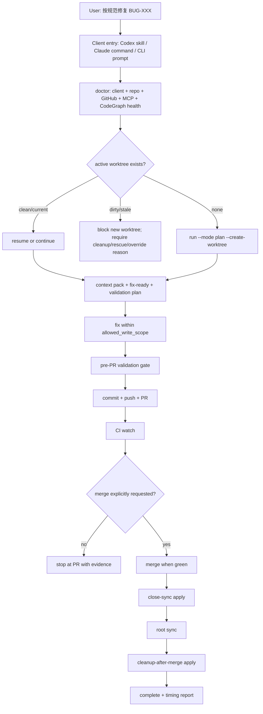
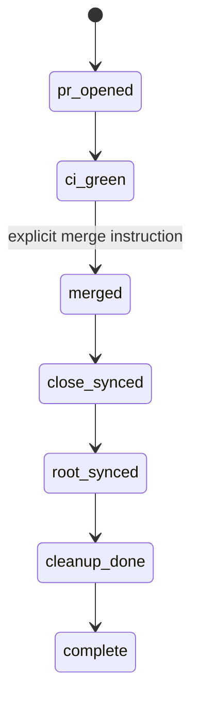

# AIstock Issue Workflow Hardening 下一阶段设计与实施计划 v2.1

版本：v2.1
日期：2026-05-26
状态：下一阶段实施基线
继承基线：`docs/architecture/aistock_issue_workflow_opensource_cicd_design_v2_20260525.md`
新增重点：优先修复 issue 流程与流水线编排问题，确保 Codex、Claude Code、Cursor、Generic CLI/IDE agent 都能用同一最优流程处理 BUG；在该阶段完成前，后续研发功能降级为次优先级。

## 1. 执行结论

重启旧 Codex / Claude Code 窗口是必要但不充分的动作。

- 重启只能让旧窗口重新加载最新 global skill、repo-local skill、Claude command 和 prompt 触发规则。
- BUG-120 暴露的问题主要不在 GitHub Actions / nox 基础 CI，而在 issue workflow 的编排层：重复 worktree、登记 PR 与修复 PR 分裂、脏 worktree 未及时阻断、PR 前 lint 未强制、merge 后 close-sync / cleanup 闭环不够强。
- 下一阶段必须先做 workflow hardening，再继续 CodeGraph / Understand Anything / Nightly / Research Assistant 等后续研发。
- 目标不是降低代码质量，而是把时间消耗从“重复流程、人工串命令、脏目录治理、后置补救”转移回“真实代码修复和必要验证”。

本阶段的最小成功标准：

1. 新开的 Codex、Claude Code、Cursor、Generic CLI/IDE agent 窗口都能通过同一 repo CLI 进入流程。
2. 旧窗口 / 旧客户端 wrapper / 旧 command 能被 `doctor` 明确识别为 stale，并给出重启或 install-client 指令。
3. 同一个 BUG 默认只能有一个 active worktree；存在脏 worktree 时必须 `resume`、清理或显式记录 override reason。
4. PR 创建前必须完成 changed-file lint / guardrail / required local evidence，不再 PR 后补救 style commit。
5. PR merge 后必须执行 close-sync、root sync、cleanup evidence；否则 workflow 不能标记 complete。
6. 每个 issue 处理必须输出阶段耗时和 token/context 预算指标，便于继续优化。

## 2. 背景与现状

### 2.1 已完成的基础能力

当前主线已经具备以下基础：

- 高层 orchestration CLI：`scripts/aistock_issue_workflow.py`
- 底层 issue primitives：`scripts/issue_flow.py`
- Codex global skill / repo skill：`fix-aistock-issue`
- Claude Code repo command：`.claude/commands/fix-aistock-issue.md`
- Quickstart：`docs/standards/aistock_issue_workflow_quickstart.md`
- BUG JSON + GitHub Issue 双事实源协同
- GitHub Actions + nox + PR Quality + Semgrep + CodeQL 基础 CI/CD
- `submit-bug`、`doctor`、`run`、`resume`、`run-p0`、`start-batch`、`finish-batch`、`close-sync`、`cleanup-after-merge` 等命令雏形
- CodeGraph / Understand Anything warning-only context acceleration 设计和部分实现

这些能力说明路线正确，不应推倒重做。

### 2.2 BUG-120 暴露的问题

BUG-120 的最终修复 PR `#227` 已合入，GitHub Issue `#223` 已关闭，并且 BUG JSON 已通过 `4286f02b chore(issue): close BUG-120 after merge` 完成 close-sync，记录了 `fix_commit=124b0e73...`、`status=fixed`。本文引用 BUG-120 不是说明该 BUG 当前仍未关闭，而是复盘它在处理过程中曾暴露出的流程缺陷：close-sync 需要后续补救、重复 worktree 需要人工判断、registry-only PR 和 fix PR 曾经分裂。下一阶段应把这些补救动作前移并状态机化。

具体缺陷如下：

| 现象 | 风险 | 应归属问题 |
| --- | --- | --- |
| 先创建 registry-only PR `#224`，后续 fix PR `#227` 又包含 BUG JSON | 重复 PR、状态漂移、review 噪音 | submit-bug 与 run/fix 流程未合并成单一路径 |
| 旧 worktree `BUG-120-qe-mcp-payload-fix` 进入 dirty 状态并残留大量 `.codex_tmp`、`.coverage`、未跟踪脚本 | 后续窗口误判、token 浪费、污染风险 | active worktree / dirty guard 不足 |
| 后续又创建 clean worktree `BUG-120-qe-mcp-payload-clean` 才完成修复 | 重复上下文、重复验证、重复分支管理 | 缺少单活跃 worktree 和 resume 强制 |
| PR 创建后追加 `style(qe-mcp)` commit 才满足 changed-file lint | PR 后补救、CI 循环增加 | pre-PR gate 未强制 |
| merge 后需要额外 close-sync / cleanup / stale PR 处理 | GitHub 与 BUG JSON 可能短暂不一致 | post-merge 状态机不够强 |
| 阶段耗时不能自动分解 | 无法持续优化 | 缺少 timing / context telemetry |

### 2.3 哪些不是本阶段问题

- 不是要替换 GitHub Actions / nox / PR Quality。
- 不是要引入 Jira、Linear、Plane 或新 CI/CD 引擎。
- 不是要让 LLM 主导夜间测试。
- 不是要降低验证标准。
- 不是要让 workflow 直接修改生产 DB、重启 `8001` 或改动生产前端 `3000`。

## 3. 设计目标

### 3.1 核心目标

下一阶段优先修复 issue workflow 的流程和流水线编排问题，使所有开发客户端都能使用同一最优路径：



### 3.2 客户端覆盖目标

| 客户端 | 入口 | v2.1 要求 |
| --- | --- | --- |
| Codex | global skill + repo skill | 新窗口自动识别 issue 请求；旧窗口 stale 时 doctor 明确提示重启 |
| Claude Code | `.claude/commands/fix-aistock-issue.md` | 不依赖 Codex 私有能力；命令内容与 repo CLI 保持一致 |
| Cursor | `.devtools` prompt + repo CLI | 能按同一 Context Pack 和 task card 执行 |
| Generic CLI/IDE agent | `docs/standards/aistock_issue_workflow_quickstart.md` + repo CLI | 不需要人工记忆长命令，按 CLI 输出的 next_command 继续 |
| 人工执行者 | repo CLI | 可复现每一步，生成同一 evidence |

### 3.3 时间与 token 优化目标

本计划不设置硬性时间限制，但要求记录和暴露阶段耗时。目标是让流程损耗持续下降：

| 阶段 | 现状风险 | v2.1 目标 |
| --- | --- | --- |
| 入口/doctor | 旧窗口 prompt 漂移 | 1 次健康检查给出可执行 next_command |
| issue 登记 | registry-only PR 与 fix PR 分裂 | 默认登记与修复同一 workflow；仅显式要求时才单独 registry PR |
| 定位 | 反复读旧文档和全仓扫描 | Context Pack + CodeGraph warning-only context 优先 |
| 修复 | 脏 worktree 后继续堆脚本 | 单活跃 worktree，脏状态阻断新建 |
| 验证 | 后置补救、重复跑无关计划 | selected validation + changed-file gate 前置 |
| PR/CI | PR 后补 lint commit | pre-PR gate 必过再 create PR |
| merge 后 | BUG/GitHub/worktree 不一致 | close-sync + cleanup 进入 complete 前置条件 |

## 4. v2.1 原则

1. **CI/CD 保留，workflow 编排硬化**：GitHub Actions、nox、PR Quality、Semgrep、CodeQL 继续作为质量基础。
2. **入口薄，逻辑集中在 repo CLI**：Codex skill、Claude command、Cursor prompt 只做触发，不复制业务逻辑。
3. **一个 BUG 默认一个 active worktree**：除非显式 `--force-new-worktree --reason`，否则已有 active/dirty worktree 时不得新建。
4. **registration 与 fix 默认同链路**：避免同一个 BUG 出现“登记 PR + 修复 PR”双 PR 噪音。
5. **PR 前完成本地 guard**：changed-file lint、scope check、required local validation evidence 必须在 PR 创建前明确。
6. **merge 后闭环强制**：合入 main 后，BUG JSON、GitHub Issue、root sync、branch/worktree cleanup 至少要完成或报告阻断原因。
7. **CodeGraph/UA 是加速，不是事实源**：图谱缺失不阻断 issue workflow，但要提供 bootstrap 建议和 fallback。
8. **不碰生产运行**：本阶段不重启 `8001` / `3000`，不做生产 DDL，不改 runtime dependency。

## 5. 目标架构增量

### 5.1 Client manifest 与 stale 检测

新增或完善一个轻量 client manifest 概念：

```json
{
  "schema_version": "aistock_issue_client_manifest_v1",
  "repo_commit": "<origin/main sha>",
  "workflow_cli_sha256": "...",
  "codex_skill_sha256": "...",
  "claude_command_sha256": "...",
  "quickstart_sha256": "...",
  "generated_at": "..."
}
```

`doctor` 输出新增：

- `client_entry_status=ready|stale|missing|unknown`
- `repo_codex_skill_hash`
- `global_codex_skill_hash`
- `claude_command_hash`
- `quickstart_hash`
- `restart_recommended=true|false`
- `install_client_next_command`

旧窗口不能被程序直接重启，但可以被明确诊断：

- 如果 global skill 文件比 repo skill 旧：提示运行 `install-client --apply` 并重启 Codex。
- 如果 Claude command 缺失或 hash 不一致：提示从最新 repo 打开新 Claude Code 窗口或刷新 command。
- 如果 `.codex` / `.claude` 存在但当前窗口没有触发：在 final report 中记录 `client_trigger_miss`。

### 5.2 Active worktree registry

新增 workflow active index：

```text
tmp/issue_workflow/index/active_bugs.json
```

建议字段：

```json
{
  "BUG-120": {
    "bug_id": "BUG-120",
    "active_state": "fix_in_progress",
    "branch": "bug/BUG-120-qe-mcp-payload-clean",
    "worktree": "F:/Dev/AIstock_worktrees/BUG-120-qe-mcp-payload-clean",
    "dirty": false,
    "pr_url": "https://github.com/licong01-cloud/AIstock/pull/227",
    "last_event_at": "2026-05-26T04:31:21Z",
    "next_command": "python scripts/aistock_issue_workflow.py resume --bug-id BUG-120"
  }
}
```

`run --bug-id --create-worktree` 行为调整：

| 条件 | 默认行为 |
| --- | --- |
| 已有 active clean worktree | 不新建；返回 resume plan |
| 已有 active dirty worktree | 阻断；要求 rescue/commit/cleanup 或显式 override |
| 已有 merged PR 但未 close-sync | 不新建；返回 close-sync next_command |
| 已有 close-sync 但未 cleanup | 不新建；返回 cleanup next_command |
| 无 active state | 允许新建 worktree |

### 5.3 Registration 与 fix 合并

`submit-bug` 分成两种策略：

| 模式 | 用途 | 是否默认 |
| --- | --- | --- |
| `submit-bug --apply --continue-to-fix` | 创建 GitHub Issue + BUG JSON + workflow state，然后直接进入 `run --mode plan` | 默认 |
| `submit-bug --registry-pr-only` | 只做 registry PR，不修复 | 仅用户显式要求 |

默认不再为普通 BUG 单独创建 registry-only PR。这样可以避免 BUG-120 的 `#224` / `#227` 分裂。

如果发现已有 registry-only PR：

1. 如果 fix PR 已包含同一 BUG JSON 并已 merge，则输出 `stale_registry_pr` cleanup plan。
2. 如果 registry PR 是唯一 BUG JSON 来源，则要求先合并或 cherry-pick 后再修复。
3. 不允许两个 open PR 同时 claim 同一个 BUG 且都带 closing keyword。

### 5.4 Pre-PR validation gate

`run --mode pr --create-pr` 前新增 hard gate：

- root/canonical guard：不得从 `F:\Dev\AIstock` main 创建 PR。
- worktree guard：task worktree 必须 clean 或仅有已 staged/committed task files。
- scope guard：changed files 必须在 `allowed_write_scope` 或明确 expanded scope 内。
- lint guard：changed Python files 先跑 Ruff；changed frontend files 先跑 repo 现有 frontend lint/typecheck 选择器或记录不可运行原因。
- local selected validation guard：必须有 `validation-evidence.json` 或 CLI 参数 evidence。
- temporary artifact guard：`.codex_tmp`、`.coverage`、cache、one-off scripts 不得出现在 staged files。

PR body 必须包含：

- linked BUG / GitHub Issue
- changed files
- selected validation
- validation evidence
- production gates
- timing summary
- active worktree / branch
- cleanup next step

### 5.5 Merge / close-sync / cleanup 闭环

新增 complete 判定：



`complete` 之前必须满足：

- PR merged commit 已确认。
- GitHub Issue 状态和 BUG JSON 状态一致，或记录不能一致的阻断原因。
- BUG JSON 至少包含 `status=fixed`、`fix_commit`、`pr_url`、`fixed_at`、`validation_evidence`、production gates。
- root main 与 origin/main 同步，除非 root dirty，必须报告阻断。
- task worktree/branch cleanup 已 dry-run；如果用户授权 merge，同一流程可 apply cleanup。
- stale registry PR / stale branch / duplicate active worktree 已报告。

### 5.6 Timing 与 context telemetry

`events.jsonl` 每一行新增或规范字段：

```json
{
  "timestamp": "...",
  "actor": "aistock_issue_workflow.py",
  "client": "codex|claude|cursor|cli|unknown",
  "state": "validation_running",
  "command": "python -m nox -s l0",
  "duration_seconds": 64.2,
  "context_pack_bytes": 12345,
  "changed_files_count": 4,
  "validation_plan_count": 3,
  "result": "ok|failed|blocked"
}
```

Final report 必须生成阶段表：

| 阶段 | 开始 | 结束 | 耗时 | 结果 | 备注 |
| --- | --- | --- | --- | --- | --- |
| submit/register | ... | ... | ... | ok | GitHub Issue / BUG JSON |
| context | ... | ... | ... | ok | Context Pack bytes |
| fix | ... | ... | ... | ok | changed files |
| validation | ... | ... | ... | ok | commands |
| PR/CI | ... | ... | ... | ok | checks |
| merge/close/cleanup | ... | ... | ... | ok/block | evidence |

## 6. 分阶段实施计划

### Phase H0：本设计文档合入

交付：

- 新增本 v2.1 hardening 设计计划文档。
- 在 v2.0 设计中标记下一阶段优先级从“继续后续研发”切换为“先 workflow hardening”。

验收：

- docs-only PR 合入 main。
- 不触碰 runtime、DB、依赖文件。

### Phase H1：Client stale 检测和安装一致性

交付：

- `doctor` 输出 client manifest/hash/stale 状态。
- `install-client --apply` 更新 Codex global skill，并校验 Claude command 存在。
- Quickstart 增加“旧窗口需要重启”的机器可判定规则。
- Tests 覆盖：global skill hash 一致、不一致、缺失；Claude command 缺失。

验收：

- 新 Codex 窗口输入“按规范修复 BUG-XXX”时先进入 `doctor/run`。
- Claude Code 可通过 command 进入同一 repo CLI。
- stale 状态不阻断业务，但必须给出明确重启/刷新建议。

### Phase H2：单 active worktree / resume 强制

交付：

- `run --bug-id --create-worktree` 扫描 existing state + git worktree list + branch/PR 状态。
- 已有 active worktree 时返回 `resume`，不重复创建。
- Dirty worktree 阻断新建，并输出 rescue checklist。
- 增加 `--force-new-worktree --reason <text>`，默认禁用；reason 写入 evidence。

验收：

- 模拟 BUG 已有 clean worktree：`run` 返回 resume next_command。
- 模拟 BUG 已有 dirty worktree：`run` 返回 blocked，不创建新目录。
- `events.jsonl` 记录 active-worktree decision。

### Phase H3：submit-bug 与 fix 链路合并

交付：

- `submit-bug` 默认创建 BUG/GitHub linkage 后直接生成 workflow state 和 next `run` command。
- `--registry-pr-only` 仅在用户显式要求时可用。
- stale registry PR detection：同一 BUG 已有 merged fix PR 时，提示关闭 registry-only PR。
- PR Quality 或 workflow dry-run 检查同 BUG 多 open PR 风险。

验收：

- 新 BUG 不再默认生成单独 registry-only PR。
- 已有 registry-only PR + fix PR 场景输出 cleanup plan。
- BUG JSON 与 GitHub Issue 不出现 local-only drift。

### Phase H4：Pre-PR gate 前置

交付：

- `run --mode pr --create-pr` 前执行或验证：scope、Ruff/changed-file lint、artifact quarantine、required validation evidence。
- 对不可自动运行的验证项记录 `blocked_validation`，不得假装通过。
- PR body 自动写 timing summary 和 cleanup next step。

验收：

- 未跑 required evidence 时 PR creation blocked。
- `.codex_tmp` / `.coverage` 被 staged 时 PR creation blocked。
- changed Python lint 失败时 PR creation blocked，避免 PR 后 style commit。

### Phase H5：Merge / close-sync / cleanup 完整状态机

交付：

- `run --mode merge` 在用户明确要求时 watch CI、merge PR、close-sync、root sync、cleanup。
- `close-sync --apply` 自动写 BUG JSON 状态和 evidence；若 GitHub Issue 已自动关闭，也要验证一致性。
- `cleanup-after-merge --apply` 支持 squash/merge commit 安全判断，不使用 destructive reset/clean。
- Final report 列出 stale PR / stale branch / stale worktree。

验收：

- 一个真实小 BUG 可完成从 issue 到 merge/main sync/cleanup 的闭环。
- BUG JSON status、GitHub Issue status、PR merged status 一致。
- root `F:\Dev\AIstock` clean 且 main == origin/main。

### Phase H6：Timing / token / context telemetry

交付：

- workflow state 和 events 记录阶段耗时。
- Context Pack 记录 byte/token estimate。
- Final report 输出耗时表和“流程耗时 vs 代码修复耗时”拆分。
- 支持用一个命令生成 issue postmortem。

验收：

- BUG-120 类似流程可以自动定位耗时集中在 context、fix、validation、CI、cleanup 哪一段。
- 后续优化不依赖手工翻 reflog / GitHub timestamps。

### Phase H7：CodeGraph / Understand Anything 加速接入完善

交付：

- `doctor` 对 CodeGraph root index 缺失给出可执行 bootstrap command。
- `run` / `context-pack` 在图谱可用时自动引用 CodeGraph context / affected-tests artifact。
- Understand Anything 继续保持 summary-only / warning-only；缺失不阻断 issue workflow。

验收：

- CodeGraph 可用时，Context Pack 不再需要大范围 `rg` 扫描。
- CodeGraph 不可用时，workflow 自动 fallback 到 ownership/catalog/targeted rg。

### Phase H8：Batch 与 nightly 后续恢复

只有 H1-H6 达到稳定后，才继续推进：

- same-module batch runner 强化。
- Nightly candidate integration。
- Research Assistant / MCP task card。
- 更深的 CodeGraph / Understand Anything 知识图谱化。

## 7. 验收矩阵

### 7.1 功能验收

| ID | 要求 | 验收方式 | 阶段 |
| --- | --- | --- | --- |
| HWF-F-001 | Codex 新窗口可触发 workflow | 输入“按规范修复 BUG-XXX”后先运行 doctor/run | H1 |
| HWF-F-002 | Claude Code 可触发 workflow | `.claude/commands/fix-aistock-issue.md` 执行 doctor/run | H1 |
| HWF-F-003 | 旧 client stale 可诊断 | 修改/模拟 hash 不一致，doctor 输出 restart/install 建议 | H1 |
| HWF-F-004 | 单 active worktree | 已有 state 时 run 返回 resume，不新建 | H2 |
| HWF-F-005 | Dirty worktree 阻断 | dirty active worktree 时 run blocked | H2 |
| HWF-F-006 | submit 与 fix 合并 | 新 BUG 默认进入同一 workflow，不开 registry-only PR | H3 |
| HWF-F-007 | stale registry PR 识别 | 同 BUG 多 open PR 输出 cleanup plan | H3 |
| HWF-F-008 | PR 前 evidence gate | 无 validation evidence 时 create-pr blocked | H4 |
| HWF-F-009 | PR 前 artifact gate | `.codex_tmp` / `.coverage` staged 时 blocked | H4 |
| HWF-F-010 | PR 前 lint gate | changed-file Ruff 失败时 blocked | H4 |
| HWF-F-011 | merge 后 close-sync | merged PR 后 BUG JSON/GitHub status 一致 | H5 |
| HWF-F-012 | cleanup evidence | merged clean branch/worktree 可安全删除并记录 evidence | H5 |
| HWF-F-013 | timing report | final report 包含阶段耗时表 | H6 |
| HWF-F-014 | CodeGraph fallback | index missing 不阻断；可用时生成 context artifact | H7 |

### 7.2 数据验收

| ID | 数据对象 | 必须字段 |
| --- | --- | --- |
| HWF-D-001 | `state.json` | `bug_id`, `state`, `branch`, `worktree`, `active_decision`, `next_actions` |
| HWF-D-002 | `events.jsonl` | `timestamp`, `client`, `state`, `command`, `duration_seconds`, `result` |
| HWF-D-003 | `client-manifest.json` | `repo_commit`, `workflow_cli_sha256`, `codex_skill_sha256`, `claude_command_sha256` |
| HWF-D-004 | `context-pack.json` | `problem`, `allowed_scope`, `code_intelligence`, `context_budget` |
| HWF-D-005 | `validation-evidence.json` | `command`, `status`, `duration_seconds`, `artifact`, `blocking` |
| HWF-D-006 | `pr-body.md` | linked issue, changed files, evidence, gates, timing, cleanup next step |
| HWF-D-007 | `close-sync-evidence.json` | PR URL, merge commit, GitHub issue status, BUG JSON status |
| HWF-D-008 | `cleanup-evidence.json` | branch, worktree, remote branch, safety checks, applied actions |
| HWF-D-009 | `postmortem.json` | phase timings, duplicate worktree count, stale PR count, flow overhead estimate |

## 8. 风险与缓解

| 风险 | 影响 | 缓解 |
| --- | --- | --- |
| stale client 无法自动更新正在运行的旧窗口 | 旧窗口继续使用旧流程 | doctor 明确提示重启；install-client 只负责文件一致性 |
| active worktree guard 过严 | 合法并行修复被阻断 | 提供 `--force-new-worktree --reason`，但写入 evidence |
| submit/fix 合并影响单独 registry 需求 | 需要先登记再排期的 BUG 不方便 | 保留显式 `--registry-pr-only` |
| pre-PR gate 增加早期等待 | PR 创建稍慢 | 换取减少 PR 后补救和 CI 重跑 |
| cleanup 自动化误删 | 丢工作 | 只删除 clean、merged、可验证 branch/worktree；禁止 reset/clean |
| CodeGraph 不稳定 | 上下文生成受影响 | warning-only + ownership/catalog/rg fallback |
| merge 自动化过度 | 绕过用户控制 | merge 仍需用户明确指令；无明确指令停在 PR |

## 9. 与 v2.0 / CodeGraph 设计的一致性

| 原设计内容 | v2.1 处理 | 是否冲突 |
| --- | --- | --- |
| GitHub Issues + BUG JSON 双事实源 | 保留，并强化 close-sync | 否 |
| Validation Center / nox / GitHub Actions | 保留，不引入新 CI 引擎 | 否 |
| Codex / Claude / Cursor / CLI agent-neutral | 强化 client manifest 与入口一致性 | 否 |
| Context Pack 降低 token | 保留，增加 timing/context telemetry | 否 |
| same-module batch | 后移到 H8，先修单 BUG 流程稳定性 | 否 |
| CodeGraph / Understand Anything | 保留为 warning-only acceleration | 否 |
| Nightly / Research Assistant | 后移到 workflow stable 后继续 | 否 |

## 10. 下一步研发顺序

在继续后续功能研发前，先按以下顺序执行：

1. H1：client stale 检测和 install-client 一致性。
2. H2：active worktree / resume 强制。
3. H4：pre-PR gate 前置。
4. H5：merge / close-sync / cleanup 完整状态机。
5. H6：timing / context telemetry。
6. 用一个真实小 BUG 或模拟 BUG 走完整闭环。
7. 再恢复 H7/H8 以及后续 CodeGraph、Nightly、Research Assistant 研发。

该顺序的理由：

- 先保证所有窗口进入同一流程。
- 再防止重复 worktree 和脏目录继续放大成本。
- 再把 PR 后补救前移到 PR 前。
- 最后用 close-sync / cleanup / telemetry 形成可审计闭环。

## 11. 完成定义

本阶段完成后，任意新 Codex 或 Claude Code 窗口只需要用户说：

```text
按规范修复 BUG-XXX，验证通过后创建 PR
```

或：

```text
按规范修复 BUG-XXX，验证通过后合入 main 并完成同步清理
```

系统应自动或半自动完成：

1. `doctor` 检查 client/repo/GitHub/MCP/CodeGraph 状态。
2. 检查同 BUG active worktree / stale PR / stale branch。
3. 创建或 resume 唯一 task worktree。
4. 生成 Context Pack、Fix Ready、Validation Plan。
5. 修复代码并限制 scope。
6. PR 前完成 lint、scope、artifact、validation evidence gate。
7. 创建 PR 并 watch CI。
8. 用户明确要求 merge 时，执行 merge、close-sync、root sync、cleanup。
9. 输出 timing report、production gates、cleanup 状态。

最终标准：流程耗时可以被量化，流程错误可以被阻断，所有窗口都走同一 repo CLI，代码质量不降低，后续研发不再被 issue workflow 本身反复拖慢。
