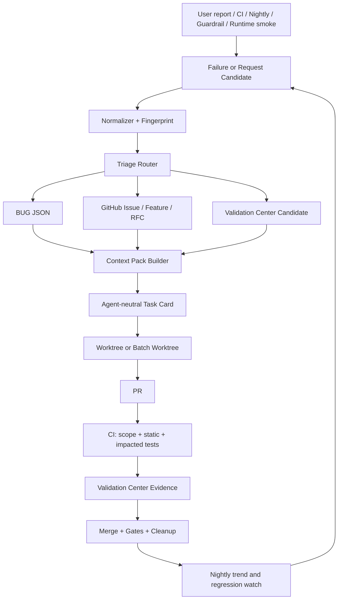
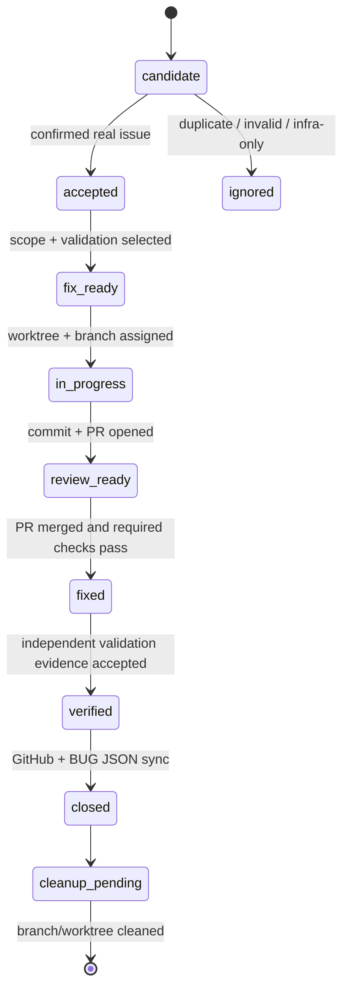
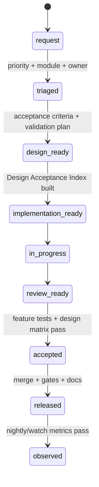
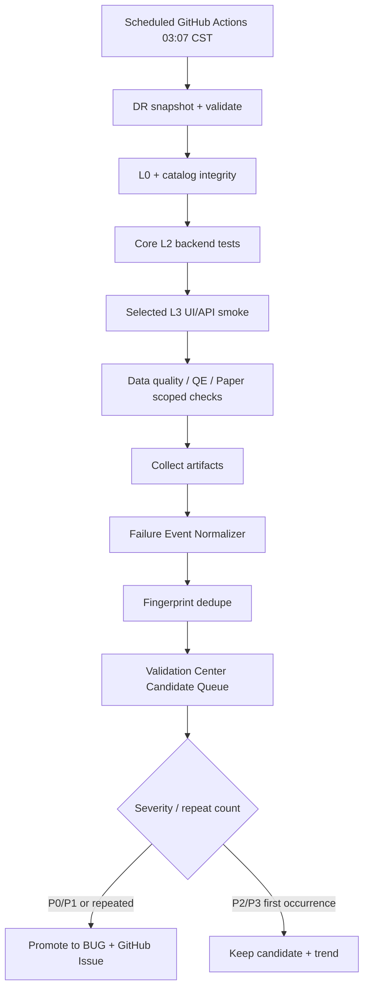

# AIstock 开源工具驱动的 Issue / Feature / CI-CD 智能验证平台设计方案

> 版本：v1.0  
> 日期：2026-05-24  
> 状态：设计落地稿  
> 范围：Issue / Bug 处理、新功能开发、CI/CD、Nightly 智能验证、Context Pack、Validation Center 平台化。  
> 本次提交边界：只新增设计文档；不改运行时代码、不改依赖、不触发生产端口 `8001/3000`、不执行生产 DB DDL。

## 1. 执行结论

AIstock 当前要解决的不是单点“issue 登记慢”，而是登记、定位、修复、验证、PR、合入、nightly 反馈之间缺少一条统一、机器可执行、对 LLM 友好的工程闭环。现有资产已经很有价值：`tests/aistock_validation/`、`noxfile.py`、Validation Center、BUG JSON、GitHub Issues 同步、GitHub Actions、nightly、MCP 工具和项目规范。本方案不替换它们，而是在其上叠加成熟开源工具和 AIstock 薄适配层。

总原则：

1. GitHub Actions、GitHub Issue Forms、pre-commit、Ruff、Semgrep、CodeQL、Renovate、reviewdog/Danger 风格 PR 注释器负责通用工程自动化。
2. `tests/aistock_validation`、nox、Validation Center、BUG JSON、MCP、production gates 继续承担 AIstock 的领域质量事实源。
3. LLM/IDE/智能助手只消费结构化 Context Pack，不再默认读取完整项目记忆、完整规范、完整 issue 列表和长日志。
4. bug、回归、新功能、架构 RFC 使用统一生命周期，但保持不同 source of truth。
5. PR 跑最小充分验证；长耗时、跨模块、数据质量和真实端口验证进入 nightly/L4/L5。
6. 同模块同验证链路 issue 可以 batch，但每个 issue 必须保留独立 BUG/GitHub Issue、独立 commit、独立 closure evidence。
7. 功能验收和数据验收同等重要；failure fingerprint、issue sync、validation run、coverage、artifact、status transition、production gate 都必须可审计。

## 2. 目标和非目标

### 2.1 目标

- 覆盖 bug、回归、新功能、架构 RFC、nightly 自动发现问题。
- 明确开源工具必须引入哪些、如何配置、落在哪些文件、由谁调用、怎么验收。
- 保留并强化当前 Validation Center / nox / BUG registry / GitHub Actions。
- 用 Context Pack、batch、impacted validation 降低重复上下文、重复分析和重复验证。
- 让 nightly 自动运行、去重、归因、生成候选 issue，并可升级为正式 BUG/GitHub Issue。
- 让新功能从设计阶段绑定 acceptance criteria、测试计划、数据验收和上线 gate。

### 2.2 非目标

- 不用 Jira/Linear/Plane 替换 GitHub Issues；当前优先使用 GitHub 生态。
- 不用 ReportPortal 替换 Validation Center；ReportPortal 仅作为后续评估对象。
- 不自研通用 CI/CD 引擎；GitHub Actions + nox 已足够。
- 不让 LLM 直接关闭 issue 或绕过验证。
- 不把所有 issue 都强行走重型 T3 设计流程。
- 不在本设计提交中改 runtime、DB schema、生产依赖或端口配置。

## 3. 当前架构基线

| 资产 | 当前位置 | 现状 | 本方案定位 |
|---|---|---|---|
| 项目规范 | `docs/standards/aistock_development_standard_v1.5_20260523.md` | 已定义上下文预算、batch issue、GitHub sync、UI、production gates | 继续作为标准事实源 |
| issue 并行规范 | `docs/standards/aistock_issue_fix_parallel_workflow_standard_20260514.md` | 已定义 worktree、scope、batch、CI gate | 继续保留，后续补充自动化落地 |
| BUG registry | `tests/aistock_validation/bugs/` | 本地机器可读 BUG 记录 | 正式 bug 的机器事实源 |
| 模块注册 | `tests/aistock_validation/catalog/module_registry.yaml` | 模块、风险、测试计划 | validation-selector 主输入 |
| 文件归属 | `tests/aistock_validation/catalog/file_ownership.yaml` | 文件到模块和风险的映射 | scope-check 和 impacted-test 主输入 |
| 测试计划 | `tests/aistock_validation/catalog/test_plans.yaml` | plan_key、nox session、runner_enabled | 受控验证目录 |
| nox | `noxfile.py` | 本地/CI 统一测试入口 | test execution source of truth |
| GitHub Actions | `.github/workflows/*.yml` | CI、nightly、issue auto-link/auto-file | 扩展为标准 CI/CD 和 nightly 闭环 |
| Validation Center | `backend/services/validation/`、前端相关路由 | 质量可视化、MCP 受控执行 | 升级为智能验证平台 |
| MCP | `scripts/aistock_mcp_server.py` | BUG、GitHub sync、validation run 工具 | agent-neutral 自动化入口 |

## 4. 总体架构



### 4.1 分层责任

| 层 | 责任 | 首选工具 | AIstock 适配 |
|---|---|---|---|
| 协作层 | issue、feature、RFC、PR 关联、看板 | GitHub Issues / Issue Forms / Projects | BUG JSON 双向 sync、GitHub labels 规范 |
| 本地快速门禁 | 开发前/提交前格式、lint、安全轻扫 | pre-commit、Ruff、Semgrep | AIstock 自定义 guardrail rules |
| CI/CD 层 | PR 门禁、状态检查、artifact 上传 | GitHub Actions、CodeQL、reviewdog | scope-check、validation-selector、nox impacted matrix |
| 测试执行层 | 可重复执行测试 | nox、pytest、Playwright、coverage | `tests/aistock_validation/catalog/test_plans.yaml` |
| 数据和证据层 | run record、history、artifact、coverage、failure event | JUnit/JSON/coverage reports | Validation Center ingestion |
| 智能定位层 | 去重、归因、Context Pack、建议修复 | AIstock 薄适配层 + LLM 可选 | 不做 source of truth |
| 领域治理层 | trading/data/DB/production gates | AIstock Validation Center | `production_ddl_gate`、dependency gate、asset gate |

## 5. 开源工具引入方案

本章是明确的引入清单，不是参考资料列表。

### 5.1 必须引入

| 工具 | 引入阶段 | 作用 | 落地文件 | 验收方式 |
|---|---:|---|---|---|
| GitHub Issue Forms | Phase 1 | 规范 bug/feature/RFC 输入，降低登记自由文本成本 | `.github/ISSUE_TEMPLATE/*.yml` | 表单字段校验；生成 issue body 可被 parser 读取 |
| GitHub Actions | 已有 + Phase 1/2 增强 | PR gate、nightly、workflow_run、artifact | `.github/workflows/test.yml`、`nightly.yml`、新增 workflow | PR 必跑；nightly 可定时和手动触发 |
| pre-commit | Phase 1 | 本地提交前快速检查 | `.pre-commit-config.yaml` | `pre-commit run --files <changed>` |
| Ruff | Phase 1 | Python lint/format/import 基础门禁 | `pyproject.toml` 或 `ruff.toml` | `ruff check`；CI 状态检查 |
| Semgrep CE | Phase 1 | 安全、危险模式、AIstock 自定义规则 | `.semgrep.yml`、`.github/workflows/semgrep.yml` 或 `test.yml` step | P0/P1 规则命中阻断或 warning |
| CodeQL | Phase 2 | GitHub code scanning | `.github/workflows/codeql.yml` | code scanning run 产出结果 |
| Renovate | Phase 2 | 依赖更新自动 PR 和分组 | `renovate.json` | dry-run config validate；自动 PR 分组 |
| reviewdog 或 Danger 风格 PR reporter | Phase 2 | 将脚本/测试/coverage/scope 结果注释到 PR | `.github/workflows/pr-quality.yml`、`scripts/pr_quality_report.py` | PR comment 包含 scope/test/gate summary |
| Playwright reporter/JUnit | Phase 2 | UI E2E 结构化证据 | `frontend/playwright*.config.ts` | JUnit/JSON artifact 可被 Validation Center 读取 |

### 5.2 条件引入或暂缓

| 工具 | 决策 | 原因 | 重新评估条件 |
|---|---|---|---|
| ReportPortal | 暂不引入 | 与 Validation Center 重叠，运行和权限成本高 | Validation Center 无法满足 flaky 聚类、团队多租户、趋势分析时再评估 |
| Allure Server | 暂不引入服务端 | 首期用 JUnit/Playwright report + Validation Center 展示 | 需要统一人类可读测试报告门户时再接入 Allure artifact |
| Temporal/Prefect/Argo | 暂不引入 | 当前 GitHub Actions + nox + MCP 足够 | 长耗时任务需要持久恢复、分布式重试、复杂 DAG 时再评估 |
| Jira/Linear/Plane | 暂不引入 | GitHub Issues 已满足当前协作和 PR 绑定 | 团队规模或跨项目权限模型超出 GitHub Projects 时再评估 |

### 5.3 工具配置细节

#### 5.3.1 pre-commit

建议新增 `.pre-commit-config.yaml`：

```yaml
repos:
  - repo: https://github.com/pre-commit/pre-commit-hooks
    rev: v5.0.0
    hooks:
      - id: check-yaml
      - id: check-json
      - id: end-of-file-fixer
      - id: trailing-whitespace
      - id: check-merge-conflict
  - repo: https://github.com/astral-sh/ruff-pre-commit
    rev: v0.11.0
    hooks:
      - id: ruff
        args: [--fix]
      - id: ruff-format
  - repo: https://github.com/semgrep/pre-commit
    rev: v1.119.0
    hooks:
      - id: semgrep
        args: [--config=.semgrep.yml, --error]
```

要求：首期只对改动文件强制；全量扫描放到 nightly；不得 sweeping 修复历史格式债务。

#### 5.3.2 Ruff

建议在 `pyproject.toml` 中新增或合并：

```toml
[tool.ruff]
target-version = "py312"
line-length = 100
extend-exclude = [".git", ".venv", "catboost_info", "frontend/node_modules", "tmp"]

[tool.ruff.lint]
select = ["E", "F", "I", "UP", "B", "SIM"]
ignore = ["E501"]

[tool.ruff.lint.per-file-ignores]
"backend/tests/**" = ["S101"]
"debug_tools/**" = ["T201"]
```

要求：首期以 changed files 为主；新增/改动 Python 文件强制 `F`、`E`、`I`；Ruff 不替代业务测试。

#### 5.3.3 Semgrep CE

建议新增 `.semgrep.yml`，首批规则：

```yaml
rules:
  - id: aistock-no-production-port-restart
    message: Do not restart production backend/frontend ports in automation.
    severity: ERROR
    languages: [python, javascript, typescript, bash]
    pattern-either:
      - pattern-regex: "(8001|3000).*(kill|taskkill|Stop-Process|restart|reload)"
      - pattern-regex: "(kill|taskkill|Stop-Process|restart|reload).*(8001|3000)"

  - id: aistock-no-silent-success
    message: Do not swallow exceptions and continue as success.
    severity: ERROR
    languages: [python]
    pattern-either:
      - pattern: |
          try:
            ...
          except Exception:
            pass
      - pattern: |
          except Exception as $E:
            return {"success": True, ...}

  - id: aistock-no-hardcoded-secret
    message: Do not hardcode credentials or API keys.
    severity: ERROR
    languages: [python, javascript, typescript]
    pattern-regex: "(?i)(password|passwd|secret|api[_-]?key|token)\\s*[:=]\\s*['\"][^'\"]{8,}['\"]"
```

要求：P0/P1 规则在 PR 阶段 blocking；P2/P3 规则先 warning 并进入 Validation Center findings。

#### 5.3.4 CodeQL

建议新增 `.github/workflows/codeql.yml`：

```yaml
name: CodeQL
on:
  pull_request:
    branches: [main]
  push:
    branches: [main]
  schedule:
    - cron: '13 18 * * 0'
permissions:
  security-events: write
  packages: read
  actions: read
  contents: read
jobs:
  analyze:
    name: CodeQL
    runs-on: ubuntu-latest
    strategy:
      fail-fast: false
      matrix:
        language: ['python', 'javascript-typescript']
    steps:
      - uses: actions/checkout@v4
      - uses: github/codeql-action/init@v3
        with:
          languages: ${{ matrix.language }}
      - uses: github/codeql-action/analyze@v3
```

要求：高危安全问题必须阻断 PR 或进入 P0/P1 candidate；Validation Center 记录 code scanning 摘要链接。

#### 5.3.5 Renovate

建议新增 `renovate.json`：

```json
{
  "$schema": "https://docs.renovatebot.com/renovate-schema.json",
  "extends": ["config:recommended"],
  "timezone": "Asia/Shanghai",
  "schedule": ["after 2am and before 6am every weekday"],
  "labels": ["dependencies", "renovate"],
  "dependencyDashboard": true,
  "packageRules": [
    {
      "matchManagers": ["npm"],
      "groupName": "frontend npm dependencies",
      "rangeStrategy": "bump"
    },
    {
      "matchManagers": ["pip_requirements", "pep621"],
      "groupName": "python dependencies",
      "rangeStrategy": "bump"
    },
    {
      "matchPackagePatterns": ["playwright", "@playwright/test"],
      "groupName": "playwright stack",
      "stabilityDays": 3
    }
  ]
}
```

要求：依赖 PR 必须触发相关 CI；高风险依赖不允许 automerge；合入后必须报告 `production_frontend_dependency_gate` / `production_backend_dependency_gate`。

#### 5.3.6 PR reporter

首期推荐实现 `scripts/pr_quality_report.py` 输出 Markdown/JSON，再用 `actions/github-script` 或 reviewdog 注释到 PR。PR comment 必须包含：

```text
AIstock PR Quality Summary
- linked_issues: BUG-xxx / GitHub #nnn / feature #nnn
- task_tier: T0/T1/T2/T3
- impacted_modules: [...]
- scope_check: passed/failed
- selected_validation: [...]
- validation_results: passed/failed/skipped_with_reason
- data_acceptance: passed/failed/not_required
- production_ddl_gate: noop/applied_and_verified/pending
- dependency_gate: noop/required/pending
- cleanup_status: branch/worktree cleanup required after merge
```

## 6. AIstock 薄适配层

### 6.1 新增 CLI

建议新增 `scripts/issue_flow.py`，作为所有 LLM/IDE/人工流程的统一入口。

| 命令 | 输入 | 输出 | 用途 |
|---|---|---|---|
| `candidate-create` | failure JSON / issue form / manual fields | candidate JSON | 快速登记候选问题 |
| `candidate-dedupe` | candidate JSON | fingerprint + existing match | 防重复 issue |
| `promote-bug` | candidate id | BUG JSON + GitHub Issue | 正式 bug 入库 |
| `promote-feature` | candidate id | GitHub Feature/RFC issue | 新功能或架构需求 |
| `fix-ready` | BUG/issue id | allowed_write_scope + selected_validation | 进入修复前准备 |
| `context-pack` | issue/batch/feature id | compact Markdown/JSON | LLM 修复上下文 |
| `batch-plan` | issue ids | batch_id + shared scope + validation | 同模块批处理 |
| `pr-check` | PR branch/base | quality summary JSON/MD | PR 门禁和注释 |
| `close-sync` | merged PR | BUG/GitHub/Validation 状态同步 | 合入后关闭/验证 |
| `cleanup-after-merge` | branch/worktree | cleanup plan/apply | 删除安全分支和 worktree |

### 6.2 Failure Event 模型

```json
{
  "schema_version": "aistock_failure_event_v1",
  "event_id": "FE-20260524-<hash>",
  "source": "github_actions|nightly|mcp_execution|local_nox|guardrail|user_report",
  "timestamp": "2026-05-24T03:07:00+08:00",
  "repo": "licong01-cloud/AIstock",
  "branch": "main",
  "commit": "<sha>",
  "workflow": "AIstock Nightly L3 + DR",
  "plan_key": "paper_v2_l3",
  "nox_session": "paper_v2_l3",
  "module_guess": "paper_v2",
  "severity_guess": "P1",
  "normalized_error": "Selection runtime gate missing selection_runtime artifact",
  "fingerprint": "sha256(module|plan|test|normalized_error|top_stack)",
  "reproduce_command": "python -m nox -s paper_v2_l3",
  "evidence_refs": ["github_run:<id>", "artifact:guardrail-evidence", "history:tests/aistock_validation/history/..."],
  "candidate_status": "new|deduped|accepted|ignored|promoted"
}
```

### 6.3 Issue Candidate 模型

```json
{
  "schema_version": "aistock_issue_candidate_v1",
  "candidate_id": "IC-20260524-<hash>",
  "source_event_id": "FE-20260524-<hash>",
  "module": "validation.center",
  "risk_level": "high",
  "candidate_type": "bug|regression|feature|rfc|infra_failure|flaky",
  "title": "Validation Center backend failed to parse test plan catalog",
  "expected": "Catalog integrity plan passes",
  "actual": "nox validation_catalog_integrity fails with missing session",
  "fingerprint": "<sha256>",
  "dedupe_key": "validation.center|validation_catalog_integrity|missing_session",
  "suggested_owner": "codex_app|claude_code|human",
  "suggested_validation": ["l0", "validation_catalog_integrity"],
  "suggested_scope": ["tests/aistock_validation/catalog/*", "noxfile.py"],
  "promotion_target": "bug_registry|github_issue|feature_issue|rfc|none"
}
```

### 6.4 Context Pack 模型

```json
{
  "schema_version": "aistock_context_pack_v1",
  "pack_id": "CP-20260524-<hash>",
  "task_tier": "T0|T1|T2|T3",
  "phase": "fix_ready|implementation|review",
  "module": "paper_v2.selection",
  "risk_level": "high",
  "issues": ["BUG-113"],
  "problem_statement": "...",
  "reproduce_command": "python -m nox -s paper_v2_backend",
  "allowed_write_scope": ["backend/services/selection_center/**", "frontend/src/app/paper-v2/selection/**"],
  "non_goals": ["do not change production DB schema", "do not restart 8001/3000"],
  "required_verification": ["l0", "paper_v2_backend"],
  "evidence_refs": ["tests/aistock_validation/history/..."],
  "standards_refs": [
    "docs/standards/aistock_development_standard_v1.5_20260523.md#CONTEXT-BUDGET-001",
    "docs/standards/aistock_issue_fix_parallel_workflow_standard_20260514.md"
  ],
  "token_budget": {
    "target_tokens": 12000,
    "max_tokens": 20000,
    "full_docs_allowed": false
  }
}
```

### 6.5 Validation Selector

`validation-selector` 根据以下输入自动选择测试：

1. `git diff --name-only origin/main...HEAD`
2. `tests/aistock_validation/catalog/file_ownership.yaml`
3. `tests/aistock_validation/catalog/module_registry.yaml`
4. `tests/aistock_validation/catalog/test_plans.yaml`
5. issue severity、risk_area、task_tier
6. 是否涉及 DB migration、dependencies、frontend routes、protected assets、paper/live/QMT path

输出示例：

```json
{
  "schema_version": "aistock_validation_selection_v1",
  "impacted_modules": ["research_assistant", "validation.center"],
  "required_plans": ["l0", "validation_catalog_integrity", "research_assistant_backend"],
  "recommended_plans": ["research_assistant_ui"],
  "nightly_plans": ["AIstock Nightly L3 + DR"],
  "skip_reasons": {
    "paper_v2_l3": "not impacted by changed files"
  },
  "production_gates": {
    "ddl": "noop",
    "frontend_dependency": "noop",
    "backend_dependency": "noop"
  }
}
```

## 7. 生命周期设计

### 7.1 Bug / Regression



### 7.2 Feature / RFC



### 7.3 Batch Issue

允许 batch 的条件：

- 同一模块或同一子域。
- 主要修改文件重叠或相邻。
- 复现路径或验证链路相同。
- 不涉及生产 DDL、protected asset、模型权重、HMM snapshot、QMT/实盘路径等特殊高风险变更。
- 每个 issue 可以独立 commit 和独立 revert。

Batch 输出必须包含 `batch_id`、issues、shared worktree/branch、shared validation、per_issue_commit_map、per_issue_closure_map。

## 8. CI/CD 方案

### 8.1 PR Gate 分层

| Gate | 触发 | 工具 | 阻断策略 | 输出 |
|---|---|---|---|---|
| G0 checkout/context | every PR | GitHub Actions | blocking | branch/base/commit metadata |
| G1 schema/catalog | every PR | nox `l0`、`validation_catalog_integrity` | blocking | catalog JSON + artifact |
| G2 scope check | every PR | `issue_flow.py pr-check` | P0/P1 blocking, others warning | scope result + PR comment |
| G3 static/lint | changed files | pre-commit、Ruff、Semgrep | P0/P1 blocking | lint/Semgrep report |
| G4 impacted tests | changed modules | validation-selector + nox | blocking for required plans | JUnit/coverage/history |
| G5 UI smoke | frontend routes impacted | Playwright | blocking when required | Playwright report |
| G6 data acceptance | data/DB/QE/Paper impacted | module-specific smoke | blocking for high risk | data acceptance JSON |
| G7 production gates | dependency/DDL/runtime impacted | custom gate check | blocking if pending without approval | gate summary |

### 8.2 GitHub Actions 文件设计

| 文件 | 动作 | 说明 |
|---|---|---|
| `.github/workflows/test.yml` | 扩展 | 保留现有 static/backend matrix，增加 impacted validation summary |
| `.github/workflows/pr-quality.yml` | 新增 | scope、issue link、Context Pack、production gate、PR comment |
| `.github/workflows/semgrep.yml` | 新增或并入 test.yml | Semgrep CE + AIstock rules |
| `.github/workflows/codeql.yml` | 新增 | weekly + PR code scanning |
| `.github/workflows/nightly.yml` | 增强 | failure normalizer、dedupe、candidate creation |
| `.github/workflows/dependency-update-validate.yml` | 新增 | Renovate PR 特定验证 |
| `.github/workflows/issue-on-test-fail.yml` | 增强 | 改为 FailureEvent -> Candidate -> Promotion |

### 8.3 Branch Protection

`main` 分支建议 required checks：

- `Static gate (l0 + module registry)`
- `validation_catalog_integrity`
- `AIstock PR Quality Summary`
- `Semgrep P0/P1`
- impacted `nox` required plans
- CodeQL high severity check

合并策略：

- docs-only 允许较轻 gate，但仍需 `l0` 或 markdown/schema 基础检查。
- P0/P1 bugfix 必须有 linked BUG/GitHub Issue 和 required verification。
- T2 batch PR 必须有 batch matrix 和 per-issue commit map。
- T3 feature 必须有 Design Acceptance Index 和设计验收矩阵。

## 9. Nightly 智能验证平台



Nightly 失败后自动生成：

- 最近一次 green run。
- failing run artifact 链接。
- commit range。
- changed files by commit。
- impacted modules by `file_ownership.yaml`。
- suspect nox session / test / route / API。
- normalized error top 20 lines。
- suggested reproduce command。
- suggested Context Pack。

去重 fingerprint：

```text
sha256(source + module + plan_key + failing_test + normalized_error_class + top_stack_symbol + route_or_api)
```

## 10. 功能验收矩阵

| 编号 | 功能 | 验收标准 | 验证方式 | 阶段 |
|---|---|---|---|---|
| OIWF-F-001 | Issue Candidate 创建 | 用户报告、CI failure、nightly failure 均可生成 candidate JSON，包含 module、severity_guess、fingerprint、evidence | 单测 + CLI smoke | Phase 1 |
| OIWF-F-002 | Fingerprint 去重 | 相同 failure 不重复创建 issue，只更新 run_count/last_seen/evidence | 单测 + 模拟两次 failure | Phase 1 |
| OIWF-F-003 | GitHub Issue Forms | bug/feature/RFC 表单字段可被 parser 读取并转换 candidate | YAML lint + parser 单测 | Phase 1 |
| OIWF-F-004 | BUG promotion | accepted bug 可生成 BUG JSON 并同步 GitHub Issue，失败时 fail-fast | MCP/CLI dry-run + sync 测试 | Phase 1 |
| OIWF-F-005 | Feature promotion | feature candidate 进入 GitHub Feature Issue，不污染 BUG registry | CLI + GitHub dry-run | Phase 1 |
| OIWF-F-006 | `fix_ready` 生成 | 根据 issue/module/file ownership 生成 allowed_write_scope、required_verification、non_goals | 单测 + 真实模块样例 | Phase 1 |
| OIWF-F-007 | Context Pack | 单 issue pack 不加载完整历史，包含最小复现、scope、validation、evidence、标准 refs | Golden file test | Phase 1 |
| OIWF-F-008 | Batch Plan | 同模块 issues 可生成 batch_id、共享验证、per-issue closure map | 单测 + 样例 BUG | Phase 1 |
| OIWF-F-009 | Validation Selector | 根据 changed files 自动选择 required/recommended/nightly plans | 单测 + catalog fixture | Phase 1 |
| OIWF-F-010 | Scope Check | PR diff 超出 allowed_write_scope 时给出阻断或 warning | CI dry-run + 单测 | Phase 2 |
| OIWF-F-011 | PR Quality Summary | PR comment 汇总 issue、scope、tests、data acceptance、production gates | GitHub Actions dry-run | Phase 2 |
| OIWF-F-012 | pre-commit 集成 | 改动文件可本地运行 pre-commit；历史债务不被 sweeping 修改 | `pre-commit run --files ...` | Phase 2 |
| OIWF-F-013 | Ruff 集成 | Python 改动文件 lint 可在本地和 CI 运行 | `ruff check` | Phase 2 |
| OIWF-F-014 | Semgrep 集成 | P0/P1 安全/红线规则命中时 PR 阻断 | Semgrep fixture test | Phase 2 |
| OIWF-F-015 | CodeQL 集成 | PR/weekly code scanning 可运行并上传结果 | GitHub code scanning run | Phase 2 |
| OIWF-F-016 | Renovate 集成 | 依赖 PR 自动分组、带 labels、触发验证 | Renovate dry-run/config validate | Phase 2 |
| OIWF-F-017 | Nightly Failure Normalizer | nightly failure 产出 FailureEvent 和 candidate | workflow_dispatch smoke | Phase 3 |
| OIWF-F-018 | Last-green 定位 | failure summary 包含最近 green run、commit range、suspect files | 模拟 runs + 单测 | Phase 3 |
| OIWF-F-019 | Validation Center UI | UI 显示 candidate、linked issue、run_count、evidence、建议验证 | API + Playwright smoke | Phase 3 |
| OIWF-F-020 | Cleanup | PR 合入后可生成安全 branch/worktree cleanup plan | CLI dry-run | Phase 3 |
| OIWF-F-021 | Agent-neutral | Codex/Claude/Cursor 均可使用同一 JSON/CLI Context Pack | 手工协议验证 | Phase 3 |
| OIWF-F-022 | Design Compliance | T3 feature PR 自动提示 Design Acceptance Matrix 缺失 | PR fixture | Phase 3 |

## 11. 数据验收矩阵

| 编号 | 数据对象 | 验收标准 | 验证方式 | 阶段 |
|---|---|---|---|---|
| OIWF-D-001 | FailureEvent schema | 必填字段完整，JSON schema 校验通过，时间含 timezone | JSON schema test | Phase 1 |
| OIWF-D-002 | Fingerprint 稳定性 | 同一错误多次运行 fingerprint 一致；不同模块/错误不误合并 | Fixture test | Phase 1 |
| OIWF-D-003 | Candidate state | 状态只能在允许状态机内转换，非法转换 fail-fast | State machine test | Phase 1 |
| OIWF-D-004 | BUG JSON sync | 新 BUG JSON 不得缺 `github_issue_number` / `github_issue_url` 后进入 main | CI schema gate | Phase 1 |
| OIWF-D-005 | GitHub Issue mirror | GitHub labels/status/module/severity 与 BUG JSON 一致 | Sync dry-run + API check | Phase 1 |
| OIWF-D-006 | Context Pack token budget | pack 记录 target/max token；不得默认引用完整 memory/standards | Golden file size check | Phase 1 |
| OIWF-D-007 | Validation selection | required_plans 全部存在于 `test_plans.yaml`，nox session 存在 | catalog integrity test | Phase 1 |
| OIWF-D-008 | Evidence refs | 每个 fixed/verified issue 至少有 run id、command、artifact/history path | PR quality check | Phase 2 |
| OIWF-D-009 | Coverage data | 覆盖率报告可解析，diff coverage 缺失时标记 unknown 不伪装 pass | coverage parser test | Phase 2 |
| OIWF-D-010 | Playwright evidence | UI failure 附带 console/pageerror/requestfailed 摘要和 artifact 链接 | Playwright report parse | Phase 2 |
| OIWF-D-011 | Nightly run trend | run_count、first_seen、last_seen 单调正确，重复失败不重复 issue | Integration test | Phase 3 |
| OIWF-D-012 | Production gates | `production_ddl_gate`、dependency gates 明确为 noop/required/pending/applied | PR quality check | Phase 2 |
| OIWF-D-013 | Batch data | batch 内每个 issue 有独立 commit 和 closure evidence | Batch PR check | Phase 2 |
| OIWF-D-014 | Cleanup data | 合入后 branch/worktree 状态可追踪，未清理有报告 | cleanup dry-run | Phase 3 |
| OIWF-D-015 | Auditability | 所有自动创建/更新 issue 的动作记录 actor、source、run、commit | Event log test | Phase 3 |

## 12. 对现有架构的影响

### 12.1 GitHub Issues

- 从辅助协作层升级为 bug/feature/RFC 的统一协作入口。
- 不取代 BUG JSON；BUG JSON 仍是正式 bug 的机器可读 source of truth。
- Issue body 必须保留可解析 marker，例如 `<!-- aistock-candidate:<id> -->`、`<!-- aistock-bug:<BUG-NNN> -->`。

### 12.2 Validation Center

- 从验证结果展示扩展为智能验证平台：candidate queue、failure clusters、linked issue、PR quality、nightly trend。
- 首期可不新增 DB，使用 JSON/artifact；当 candidate 和 trend 需要长期查询时再设计 DB schema。
- 新 UI 必须使用 shadcn/ui Blocks 视觉语言；raw JSON 只能作为高级审计详情。

### 12.3 nox / test plans

- nox 继续作为执行入口，不被 GitHub Actions 或 LLM 替代。
- `test_plans.yaml` 后续可增加 `risk_tags`、`changed_file_patterns`、`blocking_policy`、`nightly_only_reason`。
- 现有 session 不重命名，避免破坏 CI。

### 12.4 MCP / Research Assistant

- MCP 不直接运行任意 shell，只调用后端或受控 CLI。
- Research Assistant 读取 Context Pack 和 Validation Center API，不读取完整 repo 历史。
- issue 修复提示词必须来自 `context-pack`，而不是人工复制长标准。

### 12.5 生产运行

- 设计和首期工具落地不触碰生产端口 `8001/3000`。
- 需要生产 DB schema 的功能必须单独设计 migration 和 `production_ddl_gate`。
- nightly 可以读取 production-adjacent 状态，但写操作必须显式批准并记录。

## 13. 实施路线图

### Phase 0：文档和决策落地

交付：本文档；后续实现任务拆分 issue 或 RFC；明确首批工具。  
验收：文档合入 main；`production_ddl_gate=noop`；未修改 runtime、DB、依赖文件。

### Phase 1：CLI 与数据模型

交付：`scripts/issue_flow.py`、`tests/aistock_validation/catalog/issue_workflow.yaml`、FailureEvent / Candidate / ContextPack JSON schema、`validation-selector` 和 `context-pack` dry-run。  
验收：`OIWF-F-001` 至 `OIWF-F-009`，`OIWF-D-001` 至 `OIWF-D-007`。

### Phase 2：PR Gate 与开源工具接入

交付：`.pre-commit-config.yaml`、Ruff 配置、`.semgrep.yml`、`.github/workflows/pr-quality.yml`、`.github/workflows/codeql.yml`、`renovate.json`、PR quality reporter。  
验收：`OIWF-F-010` 至 `OIWF-F-016`，`OIWF-D-008` 至 `OIWF-D-013`。

### Phase 3：Nightly 闭环和 Validation Center UI

交付：Nightly Failure Normalizer、Candidate Queue API/UI、Failure cluster、last-green、commit range、linked issue 展示、`cleanup-after-merge`。  
验收：`OIWF-F-017` 至 `OIWF-F-022`，`OIWF-D-011`、`OIWF-D-014`、`OIWF-D-015`。

### Phase 4：自动化修复辅助

交付：Research Assistant / MCP 接入 Context Pack；P0/P1 candidate 自动生成修复 task card；同模块 batch proposal。  
验收：任意 LLM/IDE 可使用同一 Context Pack；小 issue 不需要读取完整项目记忆；Batch PR 有每 issue 独立 evidence。

## 14. 上线方案

| 阶段 | 策略 | Gate 强度 | 回滚方式 |
|---|---|---|---|
| Phase 0 | docs-only | 不影响 CI | revert 文档 commit |
| Phase 1 | CLI dry-run | 不阻断 PR | 删除/停用 CLI 调用 |
| Phase 2a | PR reporter warning | 只注释不阻断 | workflow disable |
| Phase 2b | P0/P1 blocking | 阻断严重红线 | branch protection 移除该 check |
| Phase 3a | nightly candidate-only | 不自动建 BUG | 关闭 candidate promotion |
| Phase 3b | P0/P1 auto-promotion | 自动建 BUG/Issue | 切回 dry-run，保留 evidence |
| Phase 4 | assistant integration | 人工确认执行 | 禁用 MCP tool 或 capability |

发布前必须确认：

- `git status --short --branch` 干净。
- nox/catalog integrity 通过。
- 新增 workflow 可 `workflow_dispatch` dry-run。
- GitHub token 权限最小化。
- 写 GitHub Issue/BUG JSON 的路径有 dry-run。
- 生产端口 `8001/3000` 未被启动、停止或重启。
- 若无 DB 变更，报告 `production_ddl_gate=noop`。

## 15. 运营指标

| 指标 | 目标 | 数据来源 |
|---|---|---|
| Candidate 创建耗时 | 小问题从发现到 candidate 显著缩短 | CLI/Validation Center event |
| fix_ready 耗时 | 标准 issue 明显低于当前人工分析流程 | issue_flow events |
| Context Pack 大小 | T1 目标 5k-12k tokens，T2 目标 10k-20k tokens | pack metadata |
| 重复 issue 率 | 同 fingerprint 重复创建率接近 0 | candidate dedupe |
| PR 重复验证次数 | 同模块 batch 验证次数下降 | PR quality summary |
| Nightly 闭环率 | P0/P1 nightly failure 100% 有 candidate/issue | nightly summary |
| MTTR | P0/P1 平均修复时间下降 | GitHub + Validation Center |
| 生产 gate 漏报 | 0 | PR quality check |

## 16. 风险和缓解

| 风险 | 影响 | 缓解 |
|---|---|---|
| 新工具导致 CI 变慢 | PR 反馈变慢 | 分层 gate，Ruff/Semgrep diff-only，长任务 nightly |
| Semgrep/Ruff 历史债务太多 | false positive 多 | 首期 changed files only，P0/P1 blocking，P2/P3 warning |
| GitHub Issue 与 BUG JSON 不一致 | 追溯混乱 | BUG JSON 优先，sync fail-fast，状态同步测试 |
| 自动 failure 生成噪音 | issue 泛滥 | fingerprint dedupe，candidate-only，重复阈值升级 |
| LLM 误判修复范围 | 改错文件或过度重构 | allowed_write_scope + scope-check blocking |
| Nightly 依赖 self-hosted runner | 失败可能是环境问题 | infra_failure 分类，runner health 展示，不直接作为产品 bug |
| Context Pack 缺信息 | 修复质量下降 | pack 可扩展 evidence refs；full detail 必须显式请求并记录原因 |
| Validation Center 变重 | 平台维护成本上升 | 首期文件/artifact，DB/UI 后置，避免引入 ReportPortal 重平台 |

## 17. 后续实现任务拆分建议

| 任务 | 类型 | 建议分支 | 验收重点 |
|---|---|---|---|
| OIWF-1 数据模型和 CLI dry-run | feature | `feature/issue-flow-cli-YYYYMMDD` | OIWF-F-001..009, D-001..007 |
| OIWF-2 pre-commit/Ruff/Semgrep | feature | `feature/dev-quality-tooling-YYYYMMDD` | OIWF-F-012..014 |
| OIWF-3 PR quality reporter | feature | `feature/pr-quality-report-YYYYMMDD` | OIWF-F-010..011, D-008..013 |
| OIWF-4 CodeQL/Renovate | feature | `feature/security-deps-ci-YYYYMMDD` | OIWF-F-015..016 |
| OIWF-5 Nightly failure normalizer | feature | `feature/nightly-failure-candidates-YYYYMMDD` | OIWF-F-017..018, D-011 |
| OIWF-6 Validation Center candidate UI | feature | `feature/validation-candidate-ui-YYYYMMDD` | OIWF-F-019 |
| OIWF-7 Context Pack assistant integration | feature | `feature/context-pack-agent-entry-YYYYMMDD` | OIWF-F-021 |

## 18. 设计验收矩阵

| 设计要求 | 本文覆盖位置 | 验收结论 |
|---|---|---|
| 明确开源工具引入方案 | §5 | 覆盖 |
| 不只是参考资料 | §5.1-§5.3 给出文件、配置、调用和验收 | 覆盖 |
| 包含实施细节 | §6-§14 给出 CLI、schema、CI、nightly、上线 | 覆盖 |
| 符合现有设计要求 | §3、§12 说明现有标准/流水线继承 | 覆盖 |
| 包含功能验收矩阵 | §10 | 覆盖 |
| 包含数据验收矩阵 | §11 | 覆盖 |
| 分析当前架构影响 | §12 | 覆盖 |
| 包含上线方案 | §14 | 覆盖 |
| 支持 bug 和新功能 | §7.1、§7.2 | 覆盖 |
| 保留现有流水线价值 | §4、§8、§9 | 覆盖 |
| 降低 token 和重复耗时 | §6.4、§6.5、§9 | 覆盖 |

## 19. 参考资料

后续实现时必须以官方文档复核版本参数。

- GitHub Issue Forms: https://docs.github.com/en/communities/using-templates-to-encourage-useful-issues-and-pull-requests/syntax-for-issue-forms
- GitHub Actions workflow events and schedule: https://docs.github.com/en/actions/writing-workflows/choosing-when-your-workflow-runs/events-that-trigger-workflows
- GitHub branch protection and required checks: https://docs.github.com/en/repositories/configuring-branches-and-merges-in-your-repository/managing-protected-branches
- GitHub CodeQL code scanning: https://docs.github.com/en/code-security/code-scanning
- pre-commit: https://pre-commit.com/
- Ruff: https://docs.astral.sh/ruff/
- Semgrep CI: https://semgrep.dev/docs/semgrep-ci/
- Renovate: https://docs.renovatebot.com/
- reviewdog: https://github.com/reviewdog/reviewdog
- Danger JS: https://danger.systems/js/
- Playwright CI: https://playwright.dev/docs/ci
- nox: https://nox.thea.codes/en/stable/

## 20. 本次文档提交的生产影响

- `production_ddl_gate=noop`：本文只新增架构设计文档，不包含 DB schema、migration 或生产数据写入。
- `production_frontend_dependency_gate=noop`：本文不修改前端依赖。
- `production_backend_dependency_gate=noop`：本文不修改后端依赖。
- 生产端口影响：未启动、停止或重启 `8001` / `3000`。
- 运行时影响：无。后续实现阶段必须按本文 Phase 拆分新分支和新 worktree。
