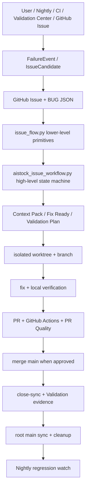

# AIstock Issue / Feature / CI-CD 智能验证平台设计实施方案 v2.0

版本：v2.0  
日期：2026-05-25  
状态：设计实施合并稿  
继承基线：`docs/architecture/aistock_issue_workflow_opensource_cicd_design_20260524.md`  
新增重点：Codex / Claude Code / Cursor / CLI 窗口内 issue 提交、处理、验证、PR、合入 `main`、同步、清理的全流程工作流。

## 1. 执行结论

AIstock 已经完成 Issue Workflow 的 Phase 0/1/2 部分基础：

- 已有正式设计文档：`docs/architecture/aistock_issue_workflow_opensource_cicd_design_20260524.md`
- 已有底层通用 CLI：`scripts/issue_flow.py`
- 已有高层 issue wrapper：`scripts/aistock_issue_workflow.py`
- 已有 repo-local Codex skill：`.codex/skills/fix-aistock-issue`
- 已有 PR Quality、Semgrep、CodeQL、Renovate、Ruff、pre-commit 等开源工具接入基础
- 已有 BUG JSON、GitHub Issues、Validation Center、nox、MCP、production gates 等领域资产

v2.0 的目标不是重做这些内容，而是补齐当前缺口：

1. 让 Codex 新窗口只需要说“按规范修复 BUG-XXX / 处理 P0 issue”，即可自动进入标准 workflow。
2. 让 Claude Code、Cursor、其他 IDE/CLI agent 和人工执行者都能通过同一 repo CLI 使用同一 Context Pack，而不是依赖 Codex 私有能力。
3. 让 issue 生命周期从登记、定位、修复、验证、PR、CI、合入、close-sync、本地同步、worktree 清理形成可恢复状态机。
4. 保留 GitHub Issues + BUG JSON + Validation Center + nox + GitHub Actions 的原有价值，不引入冲突性平台。
5. 为后续 Nightly 智能验证平台和 Research Assistant 修复辅助预留统一数据接口。

## 2. v2.0 不变原则

以下原 v1.0 原则继续有效：

- 不用 Jira / Linear / Plane 替换 GitHub Issues。
- 不用 ReportPortal 替换 Validation Center。
- 不自研通用 CI/CD 引擎；GitHub Actions + nox 继续作为执行基础。
- 不让 LLM 绕过验证直接关闭 issue。
- 不把所有 issue 都强行走重型 T3 设计流程。
- 不触碰生产端口 `8001` / `3000`，除非用户明确授权。
- 不在 issue workflow 中直接执行生产 DB DDL；只报告 `production_ddl_gate`。
- GitHub Issues 是协作层；BUG JSON 是机器可读 bug 事实源；Validation Center 是验证与证据平台。
- 同模块 batch 可以减少重复验证，但每个 issue 必须保留独立 GitHub Issue、BUG JSON、commit 或 evidence 映射。

## 3. v2.0 新增目标

### 3.1 开发工具窗口全流程目标

下一阶段必须实现：用户在任意 Codex、Claude Code、Cursor 或其他 CLI/IDE agent 窗口输入：

```text
按规范修复 BUG-XXX，完成验证并合入 main
```

或：

```text
处理当前 paper_v2 P0 issue，能 batch 的 batch，完成 PR 和验证
```

系统应自动执行或引导执行：

1. 检查全局 skill / repo / MCP / GitHub / CI 环境。
2. 读取 BUG / GitHub Issue。
3. 创建独立 worktree 和 task branch。
4. 生成 Context Pack 和 fix-ready scope。
5. 执行修复。
6. 自动选择验证计划。
7. 执行本地验证。
8. commit、push、创建 PR。
9. 监控 CI。
10. 若用户授权合入，则 merge main。
11. close-sync BUG JSON / GitHub Issue / validation evidence。
12. 同步 `F:\Dev\AIstock` 本地 main。
13. 安全删除 branch / worktree。
14. 输出 production gates 和最终证据。

### 3.2 Agent-neutral 目标

同一流程必须适用于：

- Codex
- Claude Code
- Cursor
- 其他 CLI/IDE agent
- 人工执行

因此：

- skill 只能是入口提示，不是业务逻辑。
- 真正状态机必须在 repo 内 CLI。
- Context Pack 必须是 Markdown + JSON。
- 所有关键步骤必须能被命令行复现。

## 4. v2.0 总体架构



### 4.1 分层职责

| 层 | 职责 | 工具/文件 | v2.0 要求 |
| --- | --- | --- | --- |
| 入口层 | 触发 Codex/Claude/Cursor/CLI 使用工作流 | global skill、repo skill、Claude slash command、quickstart | 不再依赖人工记命令 |
| 编排层 | 高层状态机 | `scripts/aistock_issue_workflow.py` | 新增 `doctor/submit-bug/run/resume/run-p0/start-batch/finish-batch` |
| 原语层 | candidate/context/validation/pr-check | `scripts/issue_flow.py` | 继续作为 lower-level helper |
| 协作层 | Issue / PR / labels / comments | GitHub Issues / `gh` / MCP | GitHub CLI/API 与 MCP 双通道 |
| 验证层 | 测试选择与执行 | `noxfile.py`、`test_plans.yaml`、Validation Center | 不新建平行测试体系 |
| 证据层 | run record / artifact / evidence | `tests/aistock_validation/history/`、PR artifacts | 所有 closure 可审计 |
| CI/CD 层 | PR gate / nightly / security / dependency | GitHub Actions、Semgrep、CodeQL、Renovate | 保留原 v1.0 工具方案 |
| 清理层 | branch/worktree/root sync | Git | 安全条件满足才 apply |

## 5. 当前实现基线

### 5.1 已完成

- `d9057c2 docs(architecture): design open source issue workflow (#188)`：原 v1.0 设计文档已合入。
- `82580b5 feat(validation): add issue workflow automation CLI`：
  - `scripts/issue_flow.py`
  - PR quality workflow
  - Semgrep / CodeQL / Renovate / Ruff / pre-commit 基础配置
- `05a439a feat(validation): add issue-fix workflow skill`：
  - `.codex/skills/fix-aistock-issue`
  - `scripts/aistock_issue_workflow.py`
  - `docs/standards/aistock_issue_workflow_quickstart.md`
- `f8b303f fix(quantevolver): resolve BUG-013 and BUG-014 factor metrics cache flow`：已通过该流程局部验证 PR/CI/merge/sync 可行。

### 5.2 已实现命令

`issue_flow.py` 已有：

- `issue-form-parse`
- `candidate-create`
- `candidate-dedupe`
- `promote-bug`
- `promote-feature`
- `candidate-transition`
- `fix-ready`
- `context-pack`
- `batch-plan`
- `validation-select`
- `pr-check`
- `close-sync` dry-run
- `cleanup-after-merge` dry-run

`aistock_issue_workflow.py` 已有：

- `start`
- `finish`
- `triage-p0`
- `close-sync` dry-run

### 5.3 当前缺口

- repo-local skill 尚未全局化，任意新 Codex 窗口不一定能发现。
- Claude Code / Cursor / Generic CLI 只有人工 prompt，没有 repo-local 标准入口。
- `aistock_issue_workflow.py` 还不是完整状态机。
- 缺 `doctor/submit-bug/run/resume/run-p0`。
- 缺 `start-batch/finish-batch`。
- `close-sync --apply` 未实现。
- `cleanup-after-merge --apply` 未实现。
- MCP 超时/断连时缺稳定 GitHub CLI fallback。
- 验证计划仍有自然语言验收项，需要映射到 `test_plans.yaml` / `issue_workflow.yaml`。
- PR 创建、CI watch、merge、root sync 仍主要靠 agent 手工串联。
- 全局 AGENTS 未强制绑定 `fix-aistock-issue` 入口。
- 中文触发示例存在编码污染风险，必须使用 UTF-8 进行持久化验证。

## 6. v2.0 核心设计

### 6.1 全局入口设计

#### 6.1.1 Global Codex skill

新增或同步：

```text
C:\Users\lc999\.codex\skills\fix-aistock-issue\SKILL.md
```

原则：

- 全局 skill 是薄入口。
- 不复制复杂业务逻辑。
- 只指向 repo canonical CLI。
- 使用绝对路径，避免 cwd 错误。

入口规则示例：

```text
When the user asks to fix, triage, batch, close, sync, or merge an AIstock BUG/GitHub Issue,
use F:\Dev\AIstock\scripts\aistock_issue_workflow.py first.
Do not manually inspect the whole repo before running doctor/start/triage.
```

#### 6.1.2 全局 AGENTS 触发规则

更新：

```text
C:\Users\lc999\.codex\AGENTS.md
```

新增规则：

```text
For AIstock issue work, if the user says fix/process/triage/batch/close/sync/merge BUG or Issue,
first invoke the fix-aistock-issue skill or run:
python F:\Dev\AIstock\scripts\aistock_issue_workflow.py doctor
Then follow the workflow output.
```

#### 6.1.3 Claude Code / Cursor / Generic CLI 入口

新增 repo-local 标准入口：

```text
.claude/commands/fix-aistock-issue.md
.claude/commands/aistock-issue-doctor.md
.devtools/aistock_issue_client_prompt.md
docs/standards/aistock_issue_workflow_quickstart.md
```

原则：

- Claude Code 不依赖 Codex skill。
- Cursor / Generic CLI 使用 `.devtools` prompt 和 quickstart。
- 所有客户端必须调用同一个 `scripts/aistock_issue_workflow.py`。

### 6.2 Workflow 状态机

新增状态文件：

```text
tmp/issue_workflow/<BUG-ID>/state.json
tmp/issue_workflow/<BUG-ID>/events.jsonl
tmp/issue_workflow/<BUG-ID>/context-pack.md
tmp/issue_workflow/<BUG-ID>/context-pack.json
tmp/issue_workflow/<BUG-ID>/fix-ready.json
tmp/issue_workflow/<BUG-ID>/finish-plan.json
tmp/issue_workflow/<BUG-ID>/validation-evidence.json
tmp/issue_workflow/<BUG-ID>/pr-body.md
tmp/issue_workflow/<BUG-ID>/close-sync-plan.json
```

状态枚举：

- `discovered`
- `linkage_checked`
- `claimed`
- `worktree_created`
- `context_ready`
- `fix_in_progress`
- `fix_applied`
- `validation_planned`
- `validation_running`
- `validation_passed`
- `committed`
- `pushed`
- `pr_opened`
- `ci_running`
- `ci_green`
- `merge_approved`
- `merged`
- `close_synced`
- `local_main_synced`
- `cleanup_done`
- `complete`
- `blocked`

每个状态必须记录：

- `timestamp`
- `actor/tool`
- `command`
- `cwd`
- `branch`
- `commit`
- `evidence`
- `next_allowed_actions`
- `stop_reason` when blocked

### 6.3 新增高层命令

扩展 `scripts/aistock_issue_workflow.py`。

#### `doctor`

用途：任意窗口启动前健康检查。

检查项：

- `F:\Dev\AIstock` 是否存在。
- root 是否 clean。
- root main 是否等于 `origin/main`。
- GitHub auth 是否正常。
- GitHub repo 是否是 `licong01-cloud/AIstock`。
- global skill 是否存在。
- repo-local skill 是否存在。
- Claude Code command 是否存在。
- MCP 配置是否指向 `F:\Dev\AIstock`。
- 是否存在 stale MCP worktree 路径。
- `GITHUB_REPOSITORY` 是否可用。
- 当前标准文件是否为 v1.5。
- `issue_flow.py` / `aistock_issue_workflow.py` 是否可执行。

输出：

```json
{
  "workflow_gate": "ready|blocked|warning",
  "blocking": [],
  "warnings": [],
  "next_command": "..."
}
```

#### `submit-bug`

用途：在 Codex / Claude Code / Cursor / Generic CLI 内登记新 BUG，并避免本地-only BUG JSON。

建议参数：

```powershell
python F:\Dev\AIstock\scripts\aistock_issue_workflow.py submit-bug `
  --title "<short title>" `
  --module paper_v2 `
  --severity P1 `
  --description "<observed problem>" `
  --reproduce-command "<command or n/a>" `
  --create-github `
  --apply
```

行为：

- dry-run 生成 candidate / BUG draft 和下一步命令。
- `--apply` 必须存在 GitHub linkage；可由 `--create-github` 通过 `gh issue create` 创建，也可由 `--github-issue-number` + `--github-issue-url` 传入。
- apply 成功后写入 BUG JSON、更新 `.bug_id_allocator.json`、写入 `state.json` / `events.jsonl`。
- GitHub 不可用时只允许保留草稿，不得提交 BUG JSON。

#### `run`

用途：单个 BUG 全流程。

建议参数：

```powershell
python F:\Dev\AIstock\scripts\aistock_issue_workflow.py run `
  --bug-id BUG-XXX `
  --mode plan|fix|pr|merge `
  --create-worktree `
  --merge-when-ci-green
```

模式：

- `plan`：只生成 Context Pack 和执行计划。
- `fix`：准备 worktree，停在修复前。
- `pr`：修复后 finish、验证、commit、push、create PR。
- `merge`：用户明确要求时，CI green 后合并 main 并 sync。

注意：`run` 不替代 LLM 写代码，它替代重复流程编排。

#### `resume`

用途：新窗口接手。

```powershell
python F:\Dev\AIstock\scripts\aistock_issue_workflow.py resume --bug-id BUG-XXX
```

输出：

- 当前状态
- worktree
- branch
- last command
- next command
- blocking reason
- validation still needed
- PR/CI/merge status

#### `run-p0`

用途：处理当前 P0/P1。

```powershell
python F:\Dev\AIstock\scripts\aistock_issue_workflow.py run-p0 `
  --module paper_v2 `
  --source both `
  --mode plan
```

数据源：

- local BUG JSON
- GitHub Issues
- both

输出：

- open P0/P1 list
- batch candidates
- split reason
- recommended first issue
- exact next command

#### `start-batch`

用途：同模块同验证链路 batch。

```powershell
python F:\Dev\AIstock\scripts\aistock_issue_workflow.py start-batch `
  --bug-id BUG-015 `
  --bug-id BUG-016 `
  --create-worktree
```

必须检查：

- module 相同
- risk compatible
- allowed write scope compatible
- required verification compatible
- GitHub linkage complete
- no existing active claim

#### `finish-batch`

用途：batch 验证和 PR body。

输出必须包含：

- per-issue closure map
- per-issue commit map
- shared validation evidence
- remaining risk
- production gates
- batch PR body

### 6.4 `close-sync --apply`

当前 `close-sync --apply` 未实现。v2.0 要求实现。

功能：

- 读取 merged PR。
- 验证 PR 已合入 main。
- 获取 merge commit。
- 验证 GitHub Issue closing 状态。
- 更新 BUG JSON：
  - `status`
  - `assigned_agent`
  - `fix_branch`
  - `fix_commit`
  - `pr_url`
  - `github_issue_number`
  - `github_issue_url`
  - `fixed_at`
  - `validation_evidence`
  - `production_ddl_gate`
  - `production_frontend_dependency_gate`
  - `production_backend_dependency_gate`
- 更新 GitHub Issue label/status/comment。
- 写 close-sync evidence。

原则：

- 默认 dry-run。
- `--apply` 只在 PR 已 merge、validation evidence 存在、production gates 明确时允许。
- 如果 BUG JSON 修改发生在 PR merge 后，应自动创建 registry-sync 小分支或提示需要独立 sync PR，不能直接污染 root main。

### 6.5 `cleanup-after-merge --apply`

当前 `cleanup-after-merge --apply` 未实现。v2.0 要求实现。

允许自动 cleanup 的条件：

- PR merged。
- branch merged into `origin/main`。
- remote branch 已删除或可安全删除。
- worktree clean。
- local branch 无未合入 commit。
- root `F:\Dev\AIstock` clean。
- root 可 fast-forward。
- 无功能性 untracked 文件。

执行动作：

- fetch/prune。
- fast-forward root main。
- remove worktree。
- delete local branch。
- verify branch/worktree gone。
- write cleanup evidence。

禁止动作：

- 不自动 `git reset --hard`。
- 不自动 `git clean -fd`。
- 不在 dirty root 上同步。
- 不删除未合并分支。

### 6.6 GitHub / MCP 双通道

v2.0 明确：

- GitHub CLI/API 是 issue sync 的可靠 fallback。
- MCP 是 agent-neutral 自动化入口，但不能成为单点依赖。
- MCP timeout 后自动 fallback 到 `gh`。
- MCP stale worktree 必须由 `doctor` 检查。

优先级：

```text
read:
  local state -> GitHub CLI/API -> MCP -> local BUG JSON

write:
  branch BUG JSON -> GitHub CLI/API -> MCP if available -> evidence
```

记录字段：

```json
{
  "sync_channel": "mcp|gh|api|local_draft",
  "fallback_used": true,
  "fallback_reason": "mcp_timeout"
}
```

### 6.7 验证选择与 catalog 收敛

不得新建与 `test_plans.yaml` 冲突的第三套验证体系。

v2.0 采用：

- `tests/aistock_validation/catalog/test_plans.yaml`：测试计划事实源
- `tests/aistock_validation/catalog/file_ownership.yaml`：文件归属与 scope
- `tests/aistock_validation/catalog/module_registry.yaml`：模块归属
- `tests/aistock_validation/catalog/issue_workflow.yaml`：issue workflow 路由、风险、validation selector 策略

`finish` / `run` 输出应包含：

```json
{
  "required_commands": [
    "python -m nox -s l0",
    "python -m pytest ..."
  ],
  "manual_acceptance": [
    "UI shows cache hit state",
    "production gates reported"
  ],
  "nightly_only": [],
  "blocked_validation": []
}
```

自然语言 closure requirements 不删除，但必须尽量映射到：

- 可执行 command
- API smoke
- DB read-only check
- UI E2E
- manual acceptance
- nightly / L4 / L5 pending

## 7. Issue / Feature 生命周期

### 7.1 Bug / Regression

```text
User/CI/Nightly reports failure
  -> candidate-create
  -> candidate-dedupe
  -> promote-bug
  -> GitHub Issue + BUG JSON
  -> run/start
  -> context-pack
  -> fix
  -> finish validation
  -> PR
  -> CI
  -> merge when approved
  -> close-sync apply
  -> cleanup apply
```

Stop conditions：

- missing GitHub linkage
- status not `open` / `in_progress`
- missing allowed write scope
- scope expansion needed
- required validation cannot run
- production action needed without approval
- CI failing without triage
- dirty root sync unsafe

### 7.2 Feature / RFC

v1.0 内容保留，v2.0 增加：

- Feature 也可以使用 Context Pack。
- Feature 必须有 acceptance criteria。
- T3 feature 必须有 Design Acceptance Index。
- Feature PR 也走 PR Quality / production gates。
- 不使用 BUG close-sync，而使用 feature/RFC completion sync。

建议新增高层命令：

```powershell
python scripts\aistock_issue_workflow.py feature-start --issue <number>
python scripts\aistock_issue_workflow.py feature-finish --issue <number>
```

优先级低于 BUG 全流程。

### 7.3 Batch Issue

Batch 条件：

- 同模块
- 同风险域
- 同验证链路
- 同一窗口负责
- scope 不冲突
- 无 production DDL / dependency 特殊阻断

Batch 不允许：

- 跨模块强行合并
- 把复杂 P0 和小 UI bug 混合
- 跳过单 issue closure
- 共享一个模糊 commit 但无 per-issue evidence

Batch PR 必须包含：

- batch_id
- issue list
- per-issue commit map
- per-issue closure map
- shared validation
- skipped/split reason
- production gates

## 8. Codex / Claude Code / Cursor 全流程工作流

### 8.1 用户只要求修复，不合入

输入：

```text
按规范修复 BUG-XXX，不要合入 main
```

自动流程：

1. `doctor`
2. `run --bug-id BUG-XXX --mode fix --create-worktree`
3. 切换 worktree
4. 读取 Context Pack
5. 修复代码
6. `finish --plan-only`
7. 执行 required validation
8. `finish --validation-evidence ...`
9. commit
10. push
11. create PR
12. stop before merge

### 8.2 用户要求修复并合入

输入：

```text
按规范修复 BUG-XXX，验证通过后合入本地和 GitHub
```

自动流程：

1. 执行 8.1 的所有步骤。
2. watch CI。
3. 如果 CI failure 是 lint/test，可在同分支修复并追加 commit。
4. CI green 后 merge PR。
5. `close-sync --apply`。
6. root `F:\Dev\AIstock` fast-forward。
7. `cleanup-after-merge --apply`。
8. final report。

### 8.3 用户要求处理当前 P0

输入：

```text
处理当前 paper_v2 P0，能 batch 的 batch
```

自动流程：

1. `doctor`
2. `run-p0 --module paper_v2 --source both --mode plan`
3. 输出 batch/split 计划。
4. 对可 batch group 执行 `start-batch`。
5. 对不可 batch issue 执行单 issue `run`。
6. 每个 PR 保留 per-issue evidence。
7. merge 需要用户授权或明确指令。

## 9. CI/CD 方案保持 v1.0，并补充 v2.0 Gates

原 v1.0 PR gate 保留：

- G0 checkout/context
- G1 schema/catalog
- G2 scope check
- G3 static/lint
- G4 impacted tests
- G5 UI smoke
- G6 data acceptance
- G7 production gates

v2.0 新增：

| Gate | 名称 | 阻断条件 |
| --- | --- | --- |
| G8 | workflow-state check | issue PR 缺 state/context/linked issue |
| G9 | close-readiness check | PR body 缺 validation evidence 或 production gates |
| G10 | batch integrity check | batch PR 缺 per-issue commit/evidence map |
| G11 | cleanup readiness check | merge 后 branch/worktree 未清理时给 warning |

注意：

- G8/G9 初期 warning。
- P0/P1 成熟后可 blocking。
- cleanup 不阻断 PR merge，但必须出现在 final report。

## 10. Nightly 智能验证平台

原 Phase 3 保留：

```text
Nightly run
  -> collect artifacts
  -> failure normalizer
  -> fingerprint dedupe
  -> candidate queue
  -> P0/P1 promote to BUG + GitHub Issue
```

v2.0 增加：

- Nightly 生成的 candidate 必须可直接生成 Context Pack。
- Nightly 失败必须记录 last green commit range。
- Nightly candidate 可进入 `run-p0 --source nightly`。
- Validation Center UI 展示：
  - candidate cluster
  - linked GitHub Issue
  - linked BUG JSON
  - context pack
  - suggested validation
  - repair status
  - PR / CI / merge status

## 11. Research Assistant / MCP 集成

原 Phase 4 保留并明确边界：

- Research Assistant 读取 Context Pack，不读取完整 repo 历史。
- MCP 不执行任意 shell，只调用受控 CLI/API。
- 修复 task card 来自 context-pack。
- MCP timeout 必须 fallback 到 GitHub CLI/API。
- MCP stale worktree 由 `doctor` 检查。

新增 task card schema：

```json
{
  "task_card_id": "TC-BUG-XXX-<hash>",
  "bug_id": "BUG-XXX",
  "github_issue": 123,
  "module": "paper_v2",
  "risk": "P0",
  "worktree": "...",
  "branch": "...",
  "context_pack": "...",
  "allowed_write_scope": [],
  "required_commands": [],
  "manual_acceptance": [],
  "production_gates": {},
  "stop_conditions": []
}
```

## 12. 上线方案

| 阶段 | 策略 | Gate 强度 | 回滚 |
| --- | --- | --- | --- |
| Phase 0 | v2.0 文档合入 | docs-only | revert doc |
| Phase 1 | global skill + doctor | 不阻断 PR | 删除 global skill / revert AGENTS |
| Phase 2 | run/resume 状态机 dry-run | warning | 停用新子命令 |
| Phase 3 | close-sync/cleanup apply opt-in | 用户显式触发 | 回到 dry-run |
| Phase 4 | PR gate workflow-state warning | warning | disable check |
| Phase 5 | P0/P1 workflow-state blocking | blocking | branch protection 移除 |
| Phase 6 | nightly candidate integration | candidate-only | disable promotion |
| Phase 7 | assistant task card integration | 人工确认执行 | disable MCP capability |

## 13. v2.0 实施阶段划分

### Phase 0：v2.0 设计合并

交付：

- 新增 v2.0 设计文档。
- 明确与 v1.0 不冲突。
- 标记已实现和未实现。
- 保留全部 v1.0 开源工具与后续内容。

验收：

- 文档合入 main。
- `production_ddl_gate=noop`
- `production_frontend_dependency_gate=noop`
- `production_backend_dependency_gate=noop`

### Phase 1：开发工具客户端入口和 doctor

交付：

- 全局 Codex skill wrapper。
- 全局 AGENTS issue trigger。
- repo-local Claude Code command。
- generic CLI prompt。
- 修复编码污染触发示例。
- `aistock_issue_workflow.py doctor`
- `submit-bug`，支持 GitHub-linked BUG 登记。
- doctor 测试。

验收：

- 新 Codex 窗口能看到或触发 issue skill。
- Claude Code 能通过 repo-local command 进入 workflow。
- 任意 cwd 下可运行 doctor。
- doctor 能发现 MCP stale worktree、GitHub auth、root dirty、skill 缺失。
- 新 BUG 登记必须有 GitHub linkage，否则不得提交 BUG JSON。
- 不触碰 runtime / DB / production port。

### Phase 2：run/resume 状态机

交付：

- `run --bug-id`
- `resume --bug-id`
- `state.json` / `events.jsonl`
- context/fix/validation/PR 状态恢复
- local tests

验收：

- 单个 BUG 可从 start 到 PR 生成全流程状态化。
- 中断后新窗口可 resume。
- 不重复读取完整规范。
- Context Pack 成为默认上下文。

### Phase 3：PR 自动化和 CI watch

交付：

- 自动 commit/push/create PR。
- PR body 使用 `pr-body.md`。
- CI watch。
- CI failure 分类。
- lint failure 支持同分支修复继续。

验收：

- 可完成“修复 -> 验证 -> PR”。
- PR Quality comment 正常。
- CI 状态被记录到 state。
- 默认不 merge。

### Phase 4：merge main / close-sync / root sync

交付：

- `run --mode merge`
- `close-sync --apply`
- GitHub Issue / BUG JSON 双向同步
- root `F:\Dev\AIstock` fast-forward
- final production gates report

验收：

- 用户明确要求时可完成“PR green -> merge -> close-sync -> root sync”。
- BUG JSON 和 GitHub Issue 状态一致。
- root clean 且 main 等于 `origin/main`。
- 无 production runtime / DB touched unless explicitly approved。

### Phase 5：cleanup-after-merge apply

交付：

- `cleanup-after-merge --apply`
- worktree safe removal
- local branch safe deletion
- remote branch verification
- cleanup evidence

验收：

- 已合并 clean worktree 自动清理。
- dirty / unmerged / unknown branch 阻断。
- 不使用 destructive reset/clean。

### Phase 6：batch runner

交付：

- `run-p0`
- `start-batch`
- `finish-batch`
- batch state
- per-issue commit/evidence map
- split reason

验收：

- 同模块同验证链路 issue 可共享 worktree。
- 每 issue closure 独立。
- 不兼容 issue 自动 split。
- Batch PR 满足 PR Quality。

### Phase 7：Validation Center / Nightly 集成

交付：

- FailureEvent normalizer。
- Candidate queue artifact/API。
- last-green / commit range。
- Nightly P0/P1 candidate promotion。
- Validation Center UI 增量展示。

验收：

- Nightly 失败能生成 candidate。
- repeated P0/P1 可自动建议 BUG/GitHub Issue。
- UI 使用 shadcn/ui Blocks。
- Raw JSON 只作为高级审计详情。

### Phase 8：Research Assistant / MCP task card

交付：

- Context Pack API / MCP tool。
- task card generation。
- P0/P1 repair suggestion。
- agent-neutral prompt pack。
- MCP + `gh` fallback。

验收：

- Codex / Claude Code / Cursor 可使用同一 task card。
- 小 issue 不需要完整项目记忆。
- MCP timeout 不阻断 GitHub sync。
- 修复仍需验证和 PR gate。

## 14. 功能验收矩阵

| ID | 要求 | 验收方式 | 阶段 |
| --- | --- | --- | --- |
| OIWF2-F-001 | 新 Codex 窗口可触发 issue workflow | 新窗口输入“按规范修复 BUG-XXX”后先执行 doctor/start | Phase 1 |
| OIWF2-F-002 | Claude Code 可触发 issue workflow | Claude Code command / quickstart 执行 doctor/run | Phase 1 |
| OIWF2-F-003 | Cursor / Generic CLI 可触发 issue workflow | `.devtools` prompt + repo CLI 执行 | Phase 1 |
| OIWF2-F-004 | 任意 cwd 可运行 workflow | 使用绝对路径执行 doctor/run | Phase 1 |
| OIWF2-F-005 | 单 BUG 可创建 worktree/context | `run --mode plan/fix` 输出 state/context | Phase 1 |
| OIWF2-F-006 | 中断可恢复 | `resume --bug-id` 输出 next command | Phase 1 |
| OIWF2-F-007 | PR 自动生成 | run 生成 PR URL 和 PR body | Phase 1 |
| OIWF2-F-008 | CI 状态记录 | state 包含 CI check rollup | Phase 1 |
| OIWF2-F-009 | 合入 main | 用户授权后 merge commit 记录 | Phase 1 |
| OIWF2-F-010 | close-sync apply | BUG JSON + GitHub Issue 状态一致 | Phase 1/2 |
| OIWF2-F-011 | root sync | `F:\Dev\AIstock` main 等于 `origin/main` | Phase 1 |
| OIWF2-F-012 | cleanup apply | safe branch/worktree 删除 | Phase 1/2 |
| OIWF2-F-013 | batch runner | batch PR 有 per-issue evidence | Phase 2 |
| OIWF2-F-014 | MCP fallback | MCP timeout 后 `gh` fallback 成功 | Phase 1 |
| OIWF2-F-015 | Nightly candidate | nightly failure 生成 candidate | Phase 4 |
| OIWF2-F-016 | Assistant task card | Context Pack 可被多工具消费 | Phase 5 |

## 15. 数据验收矩阵

| ID | 数据对象 | 必须字段 | 阶段 |
| --- | --- | --- | --- |
| OIWF2-D-001 | `state.json` | `bug_id`, `state`, `branch`, `worktree`, `base`, `head`, `next_actions` | Phase 1 |
| OIWF2-D-002 | `events.jsonl` | `timestamp`, `actor`, `client`, `command`, `cwd`, `result` | Phase 1 |
| OIWF2-D-003 | `context-pack.json` | `problem`, `scope`, `evidence_refs`, `token_budget` | Phase 1 |
| OIWF2-D-004 | `task-card.json` | `client_instructions`, `context_pack`, `validation`, `stop_conditions` | Phase 1 |
| OIWF2-D-005 | `fix-ready.json` | `allowed_write_scope`, `required_verification`, `production_gates` | Phase 1 |
| OIWF2-D-006 | `validation-evidence.json` | `command`, `result`, `duration`, `artifact`, `status` | Phase 1 |
| OIWF2-D-007 | `pr-body.md` | linked issue, changed files, evidence, gates | Phase 1 |
| OIWF2-D-008 | close-sync evidence | PR, merge commit, GitHub status, BUG JSON status | Phase 1/2 |
| OIWF2-D-009 | cleanup evidence | removed branch/worktree, safety checks | Phase 1/2 |
| OIWF2-D-010 | batch state | `batch_id`, `issues`, per-issue maps | Phase 2 |
| OIWF2-D-011 | task card | context pack, validation, stop conditions | Phase 5 |

## 16. 风险与缓解

| 风险 | 影响 | 缓解 |
| --- | --- | --- |
| global skill 与 repo skill 漂移 | 新窗口流程过期 | global skill 只做薄入口，业务逻辑留 repo |
| MCP timeout / stale worktree | issue sync 卡死 | `doctor` + `gh` fallback |
| batch 过度合并 | PR 难审查 | strict compatibility + split reason |
| close-sync 写错状态 | GitHub/BUG drift | dry-run 默认 + apply 前检查 PR merged |
| cleanup 删除误伤 | 丢工作 | 只删 clean/merged worktree，禁止 reset/clean |
| 验证配置重复 | 流水线分裂 | 收敛到 `test_plans.yaml` + `issue_workflow.yaml` |
| 自动 merge 过度 | 绕过用户控制 | 默认 stop at PR，merge 需明确指令 |
| production gate 遗漏 | 生产不可用 | final report 必须列三类 gates |
| 文档编码污染 | 触发规则不可读，设计失真 | UTF-8 写入并用脚本检查中文触发示例无 `?` 替代字符 |

## 17. 下一阶段最小可交付

为了最快实现“Codex / Claude Code 窗口内全流程 issue 处理”，下一阶段只做以下内容，不碰业务模块：

1. 全局 skill wrapper。
2. Claude Code repo command。
3. Generic CLI prompt。
4. `doctor`。
5. `submit-bug`。
6. `run --bug-id --mode plan|fix|pr`。
7. `resume`。
8. `state.json` / `events.jsonl`。
9. PR create + CI watch。
10. `close-sync` dry-run 增强，`apply` 可放到下一小阶段。
11. 针对一个真实小 BUG 走通 end-to-end，不自动 merge。

这一步完成后，新窗口应达到：

```text
按规范修复 BUG-XXX，不要合入 main
```

即可自动进入标准流程、创建 worktree、生成 context、修复、验证、提交 PR。

再下一步才启用：

```text
验证通过后合入本地和 GitHub
```

完成 merge / close-sync / root sync / cleanup。

## 18. 与原 v1.0 的冲突检查

| 原 v1.0 内容 | v2.0 处理 | 是否冲突 |
| --- | --- | --- |
| GitHub Issues 优先，不引入 Jira/Linear/Plane | 保留 | 否 |
| Validation Center 保留，不引入 ReportPortal | 保留 | 否 |
| GitHub Actions + nox，不引入通用 CI 引擎 | 保留 | 否 |
| `scripts/issue_flow.py` 作为统一入口 | 保留为 lower-level primitives | 否 |
| Context Pack 降低 token | 强化为默认入口 | 否 |
| batch issue | 增加 batch runner，但保持 per-issue evidence | 否 |
| close-sync / cleanup-after-merge | 从 dry-run 升级为安全 apply | 否 |
| Nightly 平台 | 保留并接入 candidate/task card | 否 |
| Research Assistant / MCP | 保留，并要求 consume Context Pack | 否 |
| 开源工具引入方案 | 全部保留 | 否 |
| 验证矩阵和数据矩阵 | 保留并扩展 OIWF2 | 否 |

唯一需要特别避免的是：不要新增一套独立 validation recipe 真源。v2.0 明确收敛到 `test_plans.yaml` + `issue_workflow.yaml`，因此不会和原设计冲突。

## 19. 最终结论

v2.0 是原设计的增强版，不是新路线。

- 原 v1.0 解决“应该采用什么成熟工程体系、开源工具和平台边界”。
- 当前已实现解决“基础 CLI、PR gate、repo skill 和局部 workflow”。
- v2.0 解决“Codex / Claude Code / Cursor / LLM 窗口如何一条指令走完整 issue 提交、修复、验证、PR、合入 main、同步和清理闭环”。

下一阶段应优先实现：

```text
client entry + doctor + submit-bug + run/resume state machine + PR/CI automation + merge/close/root sync
```

这会直接解决核心问题：其他 Codex 或 Claude Code 窗口不需要每次人工执行一系列脚本，而是只要说“按规范修复 issue”，就能自动进入统一、可恢复、可验证、可合入的工作流。
