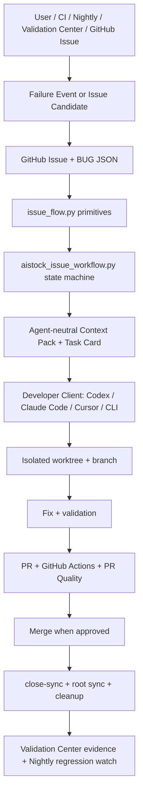
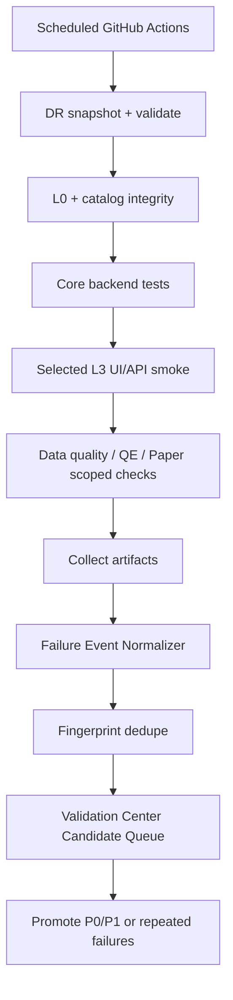

# AIstock Issue / Feature / CI-CD ???????????? v2.0

> ???v2.0  
> ???2026-05-25  
> ??????????  
> ?????`docs/architecture/aistock_issue_workflow_opensource_cicd_design_20260524.md`  
> ????????? Codex?Claude Code?Cursor??? CLI/IDE ?????????????????????????PR??? `main`?????? issue?  
> ??????????????????????? issue ???Nightly?Validation Center UI?Research Assistant ??????????????

## 1. ????

AIstock ??????????????`tests/aistock_validation/`?`noxfile.py`?Validation Center?BUG JSON?GitHub Issues ???GitHub Actions?MCP??????`scripts/issue_flow.py`?`scripts/aistock_issue_workflow.py` ? repo-local Codex skill?v2.0 ???????????? v1.0 ?????????????????????

v2.0 ??????

1. GitHub Issues?GitHub Issue Forms?GitHub Actions?pre-commit?Ruff?Semgrep?CodeQL?Renovate?reviewdog/Danger ?? PR reporter ????????????
2. `tests/aistock_validation`?nox?Validation Center?BUG JSON?MCP?production gates ???? AIstock ????????
3. ??????????????? Context Pack / Task Card????????????????????? issue ???????
4. Codex skill?Claude Code slash command / prompt?Cursor rule??? CLI/IDE agent prompt ????????????????? repo ?? CLI ?????
5. ???????????????? -> issue ??? -> worktree -> ?? -> ?? -> PR -> CI -> merge -> close-sync -> root sync -> cleanup??????
6. ???????? issue ?? batch???? issue ?????? BUG/GitHub Issue??? commit ? commit map??? closure evidence?
7. ??????????????failure fingerprint?issue sync?validation run?coverage?artifact?status transition?production gate ???????

## 2. ??????

### 2.1 ??

- ?? bug?????????? RFC?nightly ???????
- ???????????????????????????????????
- ????? Validation Center / nox / BUG registry / GitHub Actions?
- ? Context Pack?batch?impacted validation ??????????????????
- ? nightly ??????????????? issue???????? BUG/GitHub Issue?
- ??????????? acceptance criteria????????????? gate?
- ? Codex?Claude Code?Cursor??? CLI/IDE agent ?????? repo CLI ????? issue ???
- ????????????????????????????????

### 2.2 ???

- ?? Jira/Linear/Plane ?? GitHub Issues??????? GitHub ???
- ?? ReportPortal ?? Validation Center?ReportPortal ??????????
- ????? CI/CD ???GitHub Actions + nox ????
- ??? Temporal/Prefect/Argo ???? workflow ????? DAG ??????????????
- ?? LLM ???? issue ??????
- ???? issue ?????? T3 ?????
- ????????? runtime?DB schema???????????
- ?? Codex skill ? Claude Code prompt ??????????????? repo CLI?

## 3. ??????

| ?? | ???? | ?? | v2.0 ?? |
|---|---|---|---|
| ???? | `docs/standards/aistock_development_standard_v1.5_20260523.md` | ?????????batch issue?GitHub sync?UI?production gates | ????? |
| issue ???? | `docs/standards/aistock_issue_fix_parallel_workflow_standard_20260514.md` | ??? worktree?scope?batch?CI gate | ???????? |
| ? v1.0 ?? | `docs/architecture/aistock_issue_workflow_opensource_cicd_design_20260524.md` | ??? main | v2.0 ?? |
| BUG registry | `tests/aistock_validation/bugs/` | ?????? BUG ?? | ?? bug ?????? |
| GitHub Issues | `licong01-cloud/AIstock` | ???PR link?labels | ???????? |
| ???? | `tests/aistock_validation/catalog/module_registry.yaml` | ?????????? | validation selector ?? |
| ???? | `tests/aistock_validation/catalog/file_ownership.yaml` | ?????????? | scope-check ? impacted-test ?? |
| ???? | `tests/aistock_validation/catalog/test_plans.yaml` | plan_key?nox session?runner_enabled | ??????? |
| lower-level CLI | `scripts/issue_flow.py` | ?? candidate/context/batch/pr-check dry-run | LLM/IDE/??????? |
| high-level CLI | `scripts/aistock_issue_workflow.py` | ?? start/finish/triage-p0/close-sync dry-run | v2.0 ????????? |
| nox | `noxfile.py` | ??/CI ?????? | test execution source of truth |
| GitHub Actions | `.github/workflows/*.yml` | CI?PR quality?Semgrep?CodeQL?Renovate | ?? CI/CD ? nightly ?? |
| Validation Center | `backend/services/validation/` | ??????MCP ???? | ?????? |
| MCP | `scripts/aistock_mcp_server.py` | BUG?GitHub sync?Validation run ?? | agent-neutral ????????????? |
| Codex skill | `.codex/skills/fix-aistock-issue` | repo-local skill | ???????????? |
| Claude Code | ?????/???? | ???? | ?????????? CLI ??? |
| Cursor/?? IDE | rule/prompt ?? | ???? | ????????????? prompt/CLI |

## 4. ????



### 4.1 ????

| ? | ?? | ???? | AIstock ?? |
|---|---|---|---|
| ??? | Codex/Claude/Cursor/CLI ?? | global skill?slash command?rules?quickstart | ???? repo CLI |
| ??? | ?????????? run | `scripts/aistock_issue_workflow.py` | `doctor/run/resume/run-p0/start-batch/finish-batch` |
| ??? | candidate?context?batch?pr-check | `scripts/issue_flow.py` | ????????? |
| ??? | issue?feature?RFC?PR ????? | GitHub Issues / Issue Forms / Projects | BUG JSON ?? sync?GitHub labels |
| ?????? | ??????lint????? | pre-commit?Ruff?Semgrep | AIstock ??? guardrail rules |
| CI/CD ? | PR ????????artifact ?? | GitHub Actions?CodeQL?reviewdog/Danger ?? reporter | scope-check?validation-selector?nox impacted matrix |
| ????? | ??????? | nox?pytest?Playwright?coverage | `test_plans.yaml` |
| ?????? | run record?history?artifact?coverage?failure event | JUnit/JSON/coverage reports | Validation Center ingestion |
| ????? | ??????Context Pack????? | AIstock ??? + LLM ?? | ?? source of truth |
| ????? | trading/data/DB/production gates | AIstock Validation Center | `production_ddl_gate`?dependency gate?asset gate |

## 5. ????????

???? v1.0 ?????????????????

### 5.1 ???????

| ?? | ?? | ?? | ???? | ???? |
|---|---:|---|---|---|
| GitHub Issue Forms | Phase 1 | ?? bug/feature/RFC ????????????? | `.github/ISSUE_TEMPLATE/*.yml` | ???????issue body ?? parser ?? |
| GitHub Actions | ?? + Phase 1/2 ?? | PR gate?nightly?workflow_run?artifact | `.github/workflows/*.yml` | PR ???nightly ???????? |
| pre-commit | Phase 1 | ????????? | `.pre-commit-config.yaml` | `pre-commit run --files <changed>` |
| Ruff | Phase 1 | Python lint/format/import ???? | `ruff.toml` | `ruff check`?CI ???? |
| Semgrep CE | Phase 1 | ????????AIstock ????? | `.semgrep.yml`?`.github/workflows/semgrep.yml` | P0/P1 ????? warning |
| CodeQL | Phase 2 | GitHub code scanning | `.github/workflows/codeql.yml` | code scanning run ???? |
| Renovate | Phase 2 | ?????? PR ??? | `.github/renovate.json` | dry-run config validate??? PR ?? |
| reviewdog / Danger ?? PR reporter | Phase 2 | ???????coverage?scope ????? PR | `.github/workflows/pr-quality.yml`?`scripts/issue_flow.py pr-check` | PR comment ?? scope/test/gate summary |
| Playwright reporter/JUnit | Phase 2 | UI E2E ????? | `frontend/playwright*.config.ts` | JUnit/JSON artifact ?? Validation Center ?? |
| gh / GitHub REST API | Phase 1 | MCP ???? issue/PR fallback | `scripts/aistock_issue_workflow.py` adapter | MCP timeout ? gh fallback ?? |

### 5.2 ???????

| ?? | ?? | ?? | ?????? |
|---|---|---|---|
| ReportPortal | ???? | ? Validation Center ??????????? | Validation Center ???? flaky ??????????? |
| Allure Server | ??????? | ??? JUnit/Playwright report + Validation Center ?? | ?????????????????? artifact |
| Temporal/Prefect/Argo | ???? | ?? GitHub Actions + nox + MCP ?? | ???????????????????? DAG ???? |
| Jira/Linear/Plane | ???? | GitHub Issues ???????? PR ?? | ?????????????? GitHub Projects ???? |

## 6. ?????????

### 6.1 ???????

??????????????????

1. ??????? repo ????????
2. ??? `scripts/aistock_issue_workflow.py`?
3. ???? root `F:\Dev\AIstock` ???
4. ????? issue?????? evidence ? close-sync?
5. ????? `8001/3000` ??? DB???????? turn ?????
6. ?????? `tmp/issue_workflow/<id>/state.json` ? `events.jsonl`?
7. ???????? Context Pack / Task Card ????????

### 6.2 Codex ???

???????

- ?? skill?`C:\Users\lc999\.codex\skills\fix-aistock-issue`?
- repo-local skill ???`.codex/skills/fix-aistock-issue`?
- ?? `C:\Users\lc999\.codex\AGENTS.md` ???????
- Codex ????????????
  - `????? BUG-XXX`
  - `???? P0 issue`
  - `????? PR`
  - `?????????? GitHub main`

Codex skill ???????????

```powershell
python F:\Dev\AIstock\scripts\aistock_issue_workflow.py doctor
python F:\Dev\AIstock\scripts\aistock_issue_workflow.py run --bug-id BUG-XXX --mode pr
```

### 6.3 Claude Code ???

???????? Claude Code???????? Codex skill????? repo ?????? Claude Code ?????

???????

```text
docs/standards/aistock_issue_workflow_quickstart.md
.codex/skills/fix-aistock-issue/SKILL.md
.claude/commands/fix-aistock-issue.md        # ???????? Claude Code ??
.claude/commands/aistock-issue-doctor.md     # ??
```

??????? `.claude/` ??????? quickstart ??? Claude Code ??? prompt?

```text
??? F:\Dev\AIstock ???????? AIstock issue??????????
????python F:\Dev\AIstock\scripts\aistock_issue_workflow.py doctor
?????? BUG-XXX????python F:\Dev\AIstock\scripts\aistock_issue_workflow.py run --bug-id BUG-XXX --mode plan --create-worktree
???????? Context Pack ? Fix Ready?? allowed_write_scope ???
????? finish?required validation?commit?push?PR?
?????????? merge main?
```

Claude Code ?????

- ???? `aistock_issue_workflow.py`?
- ???? `state.json` / `events.jsonl`?
- ????? Claude ??????? Context Pack?
- ??? shared root worktree ?????
- PR / merge / close-sync / cleanup ??? Codex ?????

### 6.4 Cursor / ?? IDE ???

??????????????????????? CLI ???????

?????

```text
docs/standards/aistock_issue_workflow_quickstart.md
.devtools/aistock_issue_client_prompt.md       # ????? agent prompt
```

?????

- ????? shell?
- ????? Context Pack?
- ?????? worktree ?????
- ???? validation evidence ?? workflow?

## 7. AIstock ???? CLI

### 7.1 ?? lower-level CLI

`scripts/issue_flow.py` ?????? LLM/IDE/???????????

| ?? | ?? | v2.0 ?? |
|---|---|---|
| `issue-form-parse` | ?? GitHub Issue Form | ?? |
| `candidate-create` | ???????? | ?? |
| `candidate-dedupe` | ??? issue | ?? |
| `promote-bug` | ?? bug ?? | ????? GitHub sync |
| `promote-feature` | ???? RFC issue | ?? |
| `fix-ready` | ??? scope/validation | ?? |
| `context-pack` | LLM ??? | ?? |
| `batch-plan` | ??? batch ?? | ???? high-level batch ?? |
| `validation-select` | ?????? | ?? |
| `pr-check` | PR ????? | ?? |
| `close-sync` | ????? | ? dry-run ??? apply |
| `cleanup-after-merge` | ???? branch/worktree | ? dry-run ??? apply |

### 7.2 high-level ??? CLI

`scripts/aistock_issue_workflow.py` ?????????????v2.0 ?????

| ?? | ?? | ???? |
|---|---|---:|
| `doctor` | ?? repo?GitHub?MCP?skill????root ?? | ?? |
| `run` | ? BUG ????? | ?? |
| `resume` | ????? | ?? |
| `run-p0` | P0/P1 ????? | ???plan ?? |
| `start-batch` | batch worktree/context | ???? |
| `finish-batch` | batch validation/PR | ???? |
| `close-sync --apply` | ??????? | ?????????? |
| `cleanup-after-merge --apply` | ????? | ???? |

### 7.3 `doctor`

???

- canonical repo exists: `F:\Dev\AIstock`
- root clean
- root `main == origin/main`
- current standards path exists
- `scripts/issue_flow.py` executable
- `scripts/aistock_issue_workflow.py` executable
- repo-local skill exists
- global Codex skill exists
- Claude Code prompt/command exists or quickstart has Claude section
- `gh auth status` healthy
- repo resolves to `licong01-cloud/AIstock`
- MCP config points to `F:/Dev/AIstock`
- no stale AIstock MCP worktree path in config

???

```json
{
  "schema_version": "aistock_issue_workflow_doctor_v1",
  "workflow_gate": "ready|warning|blocked",
  "checks": [],
  "blocking": [],
  "warnings": [],
  "next_command": "..."
}
```

### 7.4 `run`

???

```text
plan  -> only context and task plan
fix   -> worktree/context ready, stop for code fix
pr    -> finish validation, commit, push, create PR
merge -> merge after CI green only when user explicitly requests
```

???

```powershell
python F:\Dev\AIstock\scripts\aistock_issue_workflow.py run --bug-id BUG-XXX --mode pr --create-worktree
```

### 7.5 `resume`

???

```powershell
python F:\Dev\AIstock\scripts\aistock_issue_workflow.py resume --bug-id BUG-XXX
```

?????

- current state
- worktree
- branch
- PR URL
- last event
- next allowed actions
- blocking reason
- validation still required

## 8. ????????

?? issue ???

```text
tmp/issue_workflow/<BUG-ID>/state.json
tmp/issue_workflow/<BUG-ID>/events.jsonl
tmp/issue_workflow/<BUG-ID>/context-pack.md
tmp/issue_workflow/<BUG-ID>/context-pack.json
tmp/issue_workflow/<BUG-ID>/fix-ready.json
tmp/issue_workflow/<BUG-ID>/finish-plan.json
tmp/issue_workflow/<BUG-ID>/validation-evidence.json
tmp/issue_workflow/<BUG-ID>/pr-body.md
tmp/issue_workflow/<BUG-ID>/close-sync-plan.json
tmp/issue_workflow/<BUG-ID>/cleanup-plan.json
```

???

```text
discovered
linkage_checked
claimed
worktree_created
context_ready
fix_in_progress
fix_applied
validation_planned
validation_running
validation_passed
committed
pushed
pr_opened
ci_running
ci_green
merge_approved
merged
close_synced
local_main_synced
cleanup_done
complete
blocked
```

`state.json` ?????

```json
{
  "bug_id": "BUG-XXX",
  "github_issue_number": 123,
  "module": "paper_v2",
  "state": "context_ready",
  "worktree": "F:/Dev/AIstock_worktrees/BUG-XXX-...",
  "branch": "bug/BUG-XXX-...",
  "base": "origin/main",
  "head": "HEAD",
  "allowed_write_scope": [],
  "required_verification": [],
  "validation_evidence": [],
  "pr_url": null,
  "ci_status": null,
  "merge_commit": null,
  "production_gates": {
    "ddl": "noop",
    "frontend_dependency": "noop",
    "backend_dependency": "noop"
  },
  "next_allowed_actions": []
}
```

## 9. GitHub / MCP ???

v2.0 ?? MCP ???????????????? MCP stale worktree ? `GITHUB_REPOSITORY` ?????????? `gh` / GitHub REST fallback?

??????

```text
state.json -> GitHub CLI/API -> MCP -> local BUG JSON
```

??????

```text
branch BUG JSON -> GitHub CLI/API -> MCP if available -> evidence
```

MCP timeout ???

- ?? fallback ? `gh`?
- ?? `sync_channel=gh_fallback`?
- ??????????????
- `doctor` ???? MCP config ?????? worktree?

## 10. ????? catalog ??

????? `test_plans.yaml` ????????????

???

- `tests/aistock_validation/catalog/test_plans.yaml`
- `tests/aistock_validation/catalog/file_ownership.yaml`
- `tests/aistock_validation/catalog/module_registry.yaml`

??????

- `tests/aistock_validation/catalog/issue_workflow.yaml`

`issue_workflow.yaml` ????

- issue risk route
- default validation selector
- client capabilities
- stop conditions
- merge policy
- close-sync policy

`finish/run` ???

```json
{
  "required_commands": [
    "python -m nox -s l0",
    "python -m pytest ..."
  ],
  "manual_acceptance": [
    "UI shows cache hit state",
    "production gates reported"
  ],
  "nightly_only": [],
  "blocked_validation": []
}
```

## 11. Issue / Feature ????

### 11.1 Bug / Regression

```text
User/CI/Nightly reports failure
  -> candidate-create
  -> candidate-dedupe
  -> promote-bug
  -> GitHub Issue + BUG JSON
  -> run/start
  -> context-pack
  -> fix
  -> finish validation
  -> PR
  -> CI
  -> merge when approved
  -> close-sync apply
  -> cleanup apply
```

Stop conditions?

- missing GitHub linkage
- status not open/in_progress
- missing allowed_write_scope
- scope expansion needed
- required validation cannot run
- production action needed without approval
- CI failing without triage
- dirty root sync unsafe

### 11.2 Feature / RFC

?? v1.0 ???Feature/RFC ?????????? source of truth ? closure ??? BUG ???

v2.0 ???

- Feature ????? Context Pack?
- Feature ??? acceptance criteria?
- T3 feature ??? Design Acceptance Index?
- Feature PR ?? PR Quality / production gates?
- ????? `feature-start` / `feature-finish`?????? BUG ????

### 11.3 Batch Issue

Batch ???

- ???
- ????
- ?????
- ??????
- scope ???
- ? production DDL/dependency ????

Batch PR ?????

- batch_id
- issue list
- per-issue commit map
- per-issue closure map
- shared validation
- skipped/split reason
- production gates

## 12. ?????????????

### 12.1 ???????????

???

```text
????? BUG-XXX????? main
```

?????

1. `doctor`
2. `run --bug-id BUG-XXX --mode fix --create-worktree`
3. ?? worktree
4. ?? Context Pack
5. ????
6. `finish --plan-only`
7. ?? required validation
8. `finish --validation-evidence ...`
9. commit
10. push
11. create PR
12. stop before merge

### 12.2 ?????????

???

```text
????? BUG-XXX??????????? GitHub main
```

?????

1. ?? 12.1 ?????
2. watch CI
3. ?? CI failure ? lint/test??????????? commit
4. CI green ? merge PR
5. `close-sync --apply`
6. root `F:\Dev\AIstock` fast-forward
7. `cleanup-after-merge --apply`
8. final report

### 12.3 ???????? P0

???

```text
???? paper_v2 P0?? batch ? batch
```

?????

1. `doctor`
2. `run-p0 --module paper_v2 --source both --mode plan`
3. ?? batch/split ??
4. ?? batch group ?? `start-batch`
5. ??? batch issue ??? issue `run`
6. ?? PR ?? per-issue evidence
7. merge ???????????

## 13. CI/CD ??

? v1.0 PR gate ???

| Gate | ?? | ?? | ???? | ?? |
|---|---|---|---|---|
| G0 checkout/context | every PR | GitHub Actions | blocking | branch/base/commit metadata |
| G1 schema/catalog | every PR | nox `l0`?catalog integrity | blocking | catalog JSON/artifact |
| G2 scope check | every PR | `issue_flow.py pr-check` | P0/P1 blocking, others warning | scope result + PR comment |
| G3 static/lint | changed files | pre-commit?Ruff?Semgrep | P0/P1 blocking | lint/Semgrep report |
| G4 impacted tests | changed modules | validation-selector + nox | blocking for required plans | JUnit/coverage/history |
| G5 UI smoke | frontend routes impacted | Playwright | blocking when required | Playwright report |
| G6 data acceptance | data/DB/QE/Paper impacted | module-specific smoke | blocking for high risk | data acceptance JSON |
| G7 production gates | dependency/DDL/runtime impacted | custom gate check | blocking if pending without approval | gate summary |

v2.0 ???

| Gate | ?? | ???? | ???? |
|---|---|---|---|
| G8 | workflow-state check | warning | P0/P1 blocking |
| G9 | close-readiness check | warning | P0/P1 blocking |
| G10 | batch integrity check | warning | batch PR blocking |
| G11 | client compatibility check | warning | blocking for workflow-owned PR |
| G12 | cleanup readiness check | final report required | no PR block |

## 14. Nightly ??????

??? v1.0 Phase 3?



v2.0 ???

- Nightly candidate ??????? Context Pack?
- Nightly ?????? last green commit range?
- Nightly candidate ??? `run-p0 --source nightly`?
- Validation Center ?? linked issue?context pack?suggested validation?repair status?PR/CI/merge status?

## 15. Validation Center / Research Assistant / MCP

### 15.1 Validation Center

- ?????????????????
- ????? JSON/artifact?????? DB?
- ? UI ???? shadcn/ui Blocks?
- Raw JSON ??????????

### 15.2 Research Assistant

- ?? Context Pack ? Validation Center API?
- ????? repo ???
- issue ????????? `context-pack`???????????
- ???????????????????? issue?

### 15.3 MCP

- MCP ??????? shell????????? CLI?
- MCP stale/timeout ?????? fallback?
- MCP ? GitHub CLI/API ???????? evidence?

## 16. ????

| ?? | ?? | Gate ?? | ???? |
|---|---|---|---|
| Phase 0 | v2.0 ???? | docs-only | revert ?? commit |
| Phase 1a | global Codex skill + Claude quickstart + doctor | ??? PR | ?? global skill / revert prompt |
| Phase 1b | run/resume ??? dry-run | warning | ?????? |
| Phase 1c | PR automation + CI watch | opt-in | ???? PR |
| Phase 1d | merge main + close-sync + root sync | ?????? | ?? PR-only |
| Phase 2 | cleanup apply | ?????? | ?? dry-run |
| Phase 3 | batch runner | warning | split single issue |
| Phase 4 | PR workflow-state gate | warning -> P0/P1 blocking | disable check |
| Phase 5 | nightly candidate integration | candidate-only | disable promotion |
| Phase 6 | Validation Center UI | read-only first | hide UI route |
| Phase 7 | Research Assistant / MCP task card | ?????? | disable MCP capability |

## 17. ??????

### Phase 0?v2.0 ????

???

- ??? v2.0 ?????
- ???? Codex?Claude Code?Cursor??? CLI/IDE agent?
- ?????????????????????
- ?? v1.0 ???????CI/CD?Nightly?Validation Center?Feature/RFC ???

???

- ???? `main`?
- `production_ddl_gate=noop`?
- `production_frontend_dependency_gate=noop`?
- `production_backend_dependency_gate=noop`?

### Phase 1???????????

???????????????????

#### Phase 1.1 ???????

???

- Global Codex skill wrapper?
- Claude Code quickstart / command prompt?
- Cursor/?? IDE prompt?
- `doctor` ???
- ???????

???

- Codex ?????? workflow?
- Claude Code ???? quickstart ?? workflow?
- ?? cwd ??? `doctor`?
- doctor ??? repo?GitHub?MCP?skill????root ???

#### Phase 1.2 run/resume ???

???

- `run --bug-id --mode plan|fix|pr`?
- `resume --bug-id`?
- state/events ???
- Context Pack / Task Card ???

???

- ? BUG ?? start ? PR ?????????
- ??? Codex ? Claude Code ? resume?
- ? issue ????????????

#### Phase 1.3 PR ???? CI watch

???

- ?? commit / push / PR?
- CI watch?
- CI failure ???
- lint/test failure ????????

???

- ????????????? -> ?? -> PR??
- PR body ?? linked issue?changed files?validation evidence?production gates?
- ???? PR???? merge?

#### Phase 1.4 merge main ???

???

- `run --mode merge`?
- CI green ? merge PR?
- `close-sync --apply` ?????
- root `F:\Dev\AIstock` fast-forward?
- final report?

???

- ???????????????????PR green -> merge -> close-sync -> local root sync??
- BUG JSON ? GitHub Issue ?????
- root clean ? `main == origin/main`?
- production gates ???

### Phase 2?????????

???

- `cleanup-after-merge --apply`?
- `run-p0` plan ???
- `start-batch` / `finish-batch`?
- batch state ? per-issue evidence?

???

- ??? clean worktree ?????
- ??? issue ? batch?
- ??? issue ?? split?

### Phase 3?PR Gate ??

???

- workflow-state check?
- close-readiness check?
- batch integrity check?
- client compatibility check?

???

- ?? warning?
- P0/P1 ??? blocking?

### Phase 4?Nightly Failure Candidate

???

- FailureEvent normalizer?
- Candidate queue artifact/API?
- last-green / commit range?
- P0/P1 promotion dry-run?

???

- Nightly ????? candidate?
- repeated P0/P1 ??? BUG/GitHub Issue?

### Phase 5?Validation Center UI

???

- Candidate queue UI?
- Failure cluster UI?
- linked issue / PR quality / repair status UI?
- shadcn/ui Blocks?

???

- ??? raw JSON ?????????
- UI ??? issue ? PR/CI/evidence?

### Phase 6?Research Assistant / MCP Task Card

???

- Context Pack API / MCP tool?
- task card generation?
- P0/P1 repair suggestion?
- MCP + gh fallback?

???

- Codex / Claude Code / Cursor ????? task card?
- MCP timeout ??? GitHub sync?

## 18. ??????

| ID | ?? | ???? | ?? |
|---|---|---|---|
| OIWF2-F-001 | ? Codex ????? issue workflow | ???????? BUG-XXX????? doctor/start | Phase 1 |
| OIWF2-F-002 | Claude Code ??????? | Claude Code ?? quickstart ?? doctor/run | Phase 1 |
| OIWF2-F-003 | Cursor/?? CLI ??????? | ?? prompt + repo CLI ??? | Phase 1 |
| OIWF2-F-004 | ?? cwd ??? workflow | ???????? doctor/run | Phase 1 |
| OIWF2-F-005 | ? BUG ?? worktree/context | `run --mode plan/fix` ?? state/context | Phase 1 |
| OIWF2-F-006 | ????? | `resume --bug-id` ?? next command | Phase 1 |
| OIWF2-F-007 | PR ???? | run ?? PR URL ? PR body | Phase 1 |
| OIWF2-F-008 | CI ???? | state ?? CI check rollup | Phase 1 |
| OIWF2-F-009 | ?? main | ????? merge commit ?? | Phase 1 |
| OIWF2-F-010 | close-sync apply | BUG JSON + GitHub Issue ???? | Phase 1/2 |
| OIWF2-F-011 | root sync | `F:\Dev\AIstock main == origin/main` | Phase 1 |
| OIWF2-F-012 | cleanup apply | safe branch/worktree ?? | Phase 2 |
| OIWF2-F-013 | batch runner | batch PR ? per-issue evidence | Phase 2 |
| OIWF2-F-014 | MCP fallback | MCP timeout ? gh fallback ?? | Phase 1 |
| OIWF2-F-015 | Nightly candidate | nightly failure ?? candidate | Phase 4 |
| OIWF2-F-016 | Assistant task card | Context Pack ??????? | Phase 6 |

## 19. ??????

| ID | ???? | ???? | ?? |
|---|---|---|---|
| OIWF2-D-001 | state.json | bug_id, state, branch, worktree, base, head, next_actions | Phase 1 |
| OIWF2-D-002 | events.jsonl | timestamp, actor, client, command, cwd, result | Phase 1 |
| OIWF2-D-003 | context-pack.json | problem, scope, evidence_refs, token_budget | Phase 1 |
| OIWF2-D-004 | task-card.json | client_instructions, context_pack, validation, stop_conditions | Phase 1 |
| OIWF2-D-005 | fix-ready.json | allowed_write_scope, required_verification, production_gates | Phase 1 |
| OIWF2-D-006 | validation-evidence.json | command, result, duration, artifact, status | Phase 1 |
| OIWF2-D-007 | pr-body.md | linked issue, changed files, evidence, gates | Phase 1 |
| OIWF2-D-008 | close-sync evidence | PR, merge commit, GitHub status, BUG JSON status | Phase 1/2 |
| OIWF2-D-009 | cleanup evidence | removed branch/worktree, safety checks | Phase 2 |
| OIWF2-D-010 | batch state | batch_id, issues, per_issue_commit_map, per_issue_closure_map | Phase 2 |

## 20. ?????

| ?? | ?? | ?? |
|---|---|---|
| Codex global skill ? repo skill ?? | ??????? | global skill ??????????? repo |
| Claude Code prompt ? Codex skill ??? | ???????? | ???????? `aistock_issue_workflow.py` |
| MCP timeout / stale worktree | issue sync ?? | `doctor` + gh fallback |
| batch ???? | PR ??? | strict compatibility + split reason |
| close-sync ???? | GitHub/BUG drift | dry-run ?? + apply ??? PR merged |
| cleanup ???? | ??? | ?? clean/merged worktree??? reset/clean |
| ?????? | ????? | ??? `test_plans.yaml` + `issue_workflow.yaml` |
| ?? merge ?? | ?????? | ?? stop at PR?merge ????? |
| production gate ?? | ????? | final report ????? gates |

## 21. ?????????

????????????????????????????????

?????

1. Codex global skill wrapper?
2. Claude Code quickstart / command prompt?
3. Cursor/?? IDE prompt?
4. `doctor`?
5. `run --bug-id --mode plan|fix|pr|merge`?
6. `resume`?
7. state.json / events.jsonl / task-card.json?
8. PR create + CI watch?
9. GitHub/MCP fallback?
10. close-sync ?? apply?
11. root main sync?
12. final report ?? gates?

???????? dry-run?

- Nightly failure candidate UI?
- Validation Center candidate UI?
- Research Assistant ?????
- batch apply ????
- ReportPortal/Allure/Temporal/Prefect/Argo?

?????????????

```text
Codex ? Claude Code ????
????? BUG-XXX??????????? GitHub main

?????doctor -> run -> worktree -> context -> fix -> validation -> PR -> CI -> merge -> close-sync -> root sync -> report
```

## 22. ? v1.0 ?????

| v1.0 ?? | v2.0 ?? | ???? |
|---|---|---|
| GitHub Issues ?????? Jira/Linear/Plane | ?? | ? |
| Validation Center ?????? ReportPortal | ?? | ? |
| GitHub Actions + nox?????? CI ?? | ?? | ? |
| `scripts/issue_flow.py` ?????? | ??? lower-level primitives | ? |
| Context Pack ?? token | ?????????? | ? |
| batch issue | ?? batch runner???? per-issue evidence | ? |
| close-sync / cleanup-after-merge | ? dry-run ????? apply | ? |
| Nightly ?? | ????? candidate/task card | ? |
| Research Assistant / MCP | ?????? consume Context Pack | ? |
| ???????? | ???? | ? |
| ????????? | ????? OIWF2 | ? |
| ?????? | v2.0 ?? Codex/Claude/Cursor/CLI ???? | ? |

## 23. ????????

| ?? | ?? | ???? | ???? |
|---|---|---|---|
| OIWF2-1 v2.0 ?? | docs | `docs/issue-workflow-v2-devtools-YYYYMMDD` | ????? main |
| OIWF2-2 global/client entry | feature | `feature/issue-client-entry-YYYYMMDD` | Codex + Claude Code ??? doctor/run |
| OIWF2-3 doctor | feature | `feature/issue-workflow-doctor-YYYYMMDD` | repo/GitHub/MCP/skill health check |
| OIWF2-4 state machine | feature | `feature/issue-workflow-state-YYYYMMDD` | run/resume/state/events |
| OIWF2-5 PR/CI automation | feature | `feature/issue-workflow-pr-ci-YYYYMMDD` | PR create + CI watch |
| OIWF2-6 merge/close/root sync | feature | `feature/issue-workflow-merge-sync-YYYYMMDD` | merge + close-sync + root sync |
| OIWF2-7 cleanup apply | feature | `feature/issue-workflow-cleanup-YYYYMMDD` | safe worktree/branch cleanup |
| OIWF2-8 batch runner | feature | `feature/issue-workflow-batch-YYYYMMDD` | per-issue evidence batch PR |
| OIWF2-9 nightly candidates | feature | `feature/nightly-failure-candidates-YYYYMMDD` | candidate generation |
| OIWF2-10 Validation Center UI | feature | `feature/validation-candidate-ui-YYYYMMDD` | shadcn UI candidate/repair status |
| OIWF2-11 Research Assistant task cards | feature | `feature/context-pack-agent-entry-YYYYMMDD` | multi-client task card |

## 24. ????

v2.0 ? v1.0 ???????????

- v1.0 ?????????????????????????
- ????????? CLI?PR gate?repo skill ??? workflow??
- v2.0 ???Codex?Claude Code?Cursor??????????????????? issue ?????????PR??? main??????????

???????????

```text
client entry + doctor + run/resume state machine + PR/CI automation + merge/close/root sync
```

???????????????????????Nightly?Validation Center UI?Research Assistant ?????batch ?????????????????????
