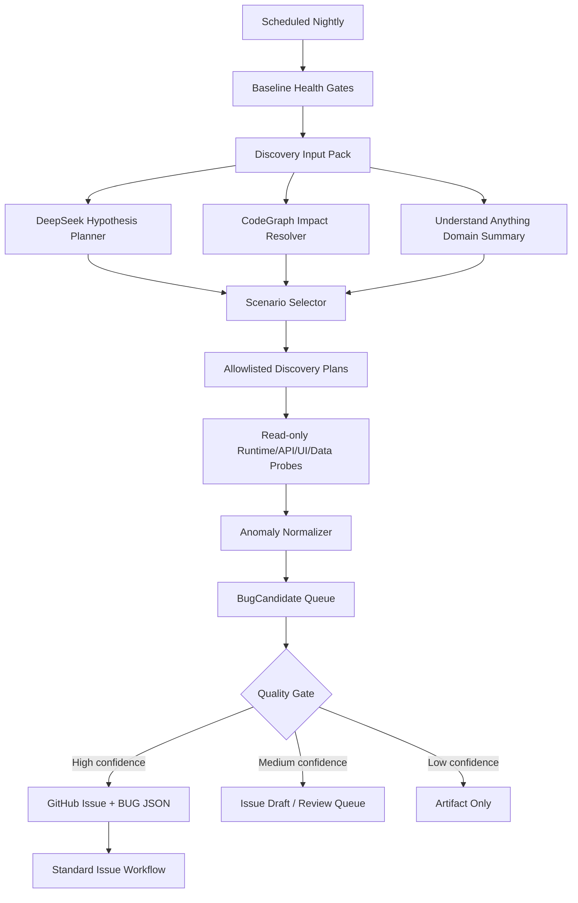

# AIstock Nightly 主动 Bug Discovery 智能验证平台设计方案

版本：v1.0  
日期：2026-06-18  
状态：设计方案待审阅  
适用范围：AIstock Nightly / Validation Center / Issue Workflow / CodeGraph / Understand Anything / DeepSeek LLM 调度与诊断  
不适用范围：不替代业务模块研发、不让 LLM 执行修复/合入/关闭 issue、不直接写生产库、不触碰生产端口 8001/3000

## 1. 背景与问题

当前 Nightly 已经能够稳定运行 DR、L3、Paper v2 live、Code Intelligence、LLM smoke，并能在 job failure 时自动生成失败 issue。2026-06-18 检查结果显示：

- `AIstock Nightly L3 + DR` scheduled run 成功完成。
- DeepSeek V4 Pro 已通过 `deepseek_api` 被调用。
- CodeGraph freshness 为 `fresh / ok`。
- Understand Anything 图谱摘要可用。
- 自动 issue intake 仅在明确 failure 时触发。

这说明平台的“固定回归验证”已经具备稳定性，但它不等于“每天主动发现实际 Bug”。固定回归只能证明已有测试覆盖范围内没有失败，无法系统性发现以下问题：

1. UI 可见但数据语义错误，例如字段单位、复权涨幅、空白面板、历史实验指标缺失。
2. API 成功返回 200，但返回体字段缺失、状态漂移或语义不一致。
3. 数据仓库/缓存/图谱存在陈旧、缺口、孤儿文件、元数据不一致，但没有触发异常。
4. MCP 或 LLM 工具链返回看似成功，但建议未被消费、影响测试未覆盖、candidate 无法形成高质量 issue。
5. 业务流程跨模块闭环缺失，例如 Nightly 发现候选但不能形成可复现 issue、issue 修复后无法 close-sync。

因此后续 Nightly 的目标应从“固定回归定时跑”升级为“每日主动寻找高价值真实 Bug 候选，并用质量门控制自动提交”。

## 2. 设计目标

### 2.1 核心目标

每天至少完成一次主动 Bug Discovery 循环：

```text
最新 main + 运行时只读状态 + 最近变更 + 历史失败 + CodeGraph/UA 图谱
  -> DeepSeek 生成受控测试假设
  -> 确定性 discovery plan 执行
  -> 异常归一化和证据收集
  -> BugCandidate 去重/分级
  -> 高质量候选自动提交 GitHub Issue + BUG JSON
  -> 低置信候选进入 draft / review queue
```

### 2.2 必须满足

- 能发现真实业务问题，而不是只验证固定 happy path。
- LLM 只能做“假设生成、测试建议、异常解释、issue 文案增强”，不能直接执行任意 shell、修复、合入、关闭 issue。
- 所有测试执行必须来自 allowlist validation plan、nox session、Validation Center plan 或受控 CLI。
- 成功结果必须简洁，只输出 gate/status/manifest，不输出大 JSON 到聊天或 PR。
- 失败或异常必须输出足够证据：复现命令、模块、接口/页面、输入、输出摘要、错误签名、图谱上下文、生产 gates。
- 不污染 `F:\Dev\AIstock` root。Nightly 工作区、artifact、candidate、BUG JSON 持久化必须走受控分支/PR 或 GitHub Issue API。
- 不写生产 DB，不触发生产 DDL，不点击有副作用按钮，不自动重启 8001/3000。

## 3. 不变原则

- GitHub Actions + nox + Validation Center 仍是执行基础。
- GitHub Issues 是协作层；BUG JSON 是机器可读事实源；Validation Center 是证据平台。
- DeepSeek / GitHub Models / CodeGraph / Understand Anything 是增强能力，不替代现有 CI/CD。
- Nightly 可以自动提交 issue，但不得自动修复、merge、close-sync。
- 真实生产写操作必须显式 opt-in；默认只读和安全沙箱。
- 业务模块 owner 边界不变：Nightly 可发现问题并提交 issue，不在 discovery 阶段扩大到业务修复。

## 4. 当前基线诊断

| 能力 | 当前状态 | 缺口 |
|---|---|---|
| Scheduled Nightly | 已可稳定运行 | 成功时不会主动提出新测试或候选 |
| Failure issue intake | job failure 时可创建 issue | 只能基于失败，不处理语义异常和弱信号 |
| DeepSeek | 已调用，`fallback_used=false` | 主要 smoke / warning_only，未驱动高价值 discovery |
| CodeGraph | fresh / ok | 主要供上下文，不主动生成测试影响面 |
| Understand Anything | 5 个模块摘要可用 | freshness 为 `base_current`，未转化为可执行 discovery 假设 |
| affected tests | 可生成 artifact | `changed_files` 曾出现编码噪声，可能导致 impacted tests = 0 |
| Auto BUG | failure path 可用 | candidate quality gate 和 draft queue 仍需完善 |

## 5. 总体架构



## 6. Discovery 输入包

每次 Nightly 主动发现必须先生成 `DiscoveryInputPack`，避免 LLM 盲目扫描仓库。

### 6.1 输入来源

- 当前 `origin/main` commit、最近 24-72 小时变更文件。
- 最近 open/closed BUG、失败 issue、close-sync 记录。
- Nightly 上一次成功/失败摘要。
- CodeGraph freshness、affected tests、模块关系。
- Understand Anything 模块摘要：`issue_workflow`、`validation_center`、`paper_v2`、`qe`、`research_assistant`。
- Validation Center plan catalog 和 allowlist。
- 只读 runtime health：可选，必须由 plan 决定是否调用。

### 6.2 输出对象

```json
{
  "schema_version": "aistock_discovery_input_pack_v1",
  "run_id": "<github-run-id>",
  "commit": "<sha>",
  "changed_files": [],
  "recent_failures": [],
  "recent_bug_clusters": [],
  "codegraph_refs": {},
  "understand_anything_refs": {},
  "allowed_plan_keys": [],
  "readonly_runtime_targets": [],
  "stop_conditions": []
}
```

### 6.3 关键约束

- `changed_files` 必须从 GitHub API 或 git diff 正规解析，禁止从含 BOM/`Changes:` 的日志文本直接解析。
- 文件路径必须标准化为 repo-relative UTF-8 路径。
- 输入包最大化压缩，LLM 不接收原始大 JSON，只接收摘要和 artifact refs。

## 7. DeepSeek 主动假设生成

DeepSeek 的角色是“低成本智能测试设计师”，不是执行者。

### 7.1 输入

- DiscoveryInputPack 摘要。
- CodeGraph/UA compact refs。
- 最近失败/修复模块。
- 当前可执行 plan catalog。
- 风险预算：每日最大执行时长、最大 API/UI 探针数、禁止写操作范围。

### 7.2 输出

```json
{
  "schema_version": "aistock_llm_discovery_hypothesis_v1",
  "hypotheses": [
    {
      "id": "H-001",
      "module": "validation_center",
      "risk": "P1",
      "why_now": "recent workflow changes touched issue intake",
      "expected_failure_modes": ["issue body missing repro", "candidate lacks evidence"],
      "recommended_plan_keys": ["validation_discovery_issue_intake_readonly"],
      "evidence_to_collect": ["api response summary", "candidate quality score"],
      "stop_conditions": ["requires production write", "plan not allowlisted"]
    }
  ],
  "selection_rationale": "...",
  "token_budget_used": 0
}
```

### 7.3 安全门

- LLM 输出的 plan 必须存在于 allowlist，否则降级为建议，不执行。
- LLM 不能新增命令、端口、DB 语句、文件写入路径。
- 如果 LLM 与 deterministic gate 冲突，deterministic gate 优先。
- LLM 自动提交 issue 只能在 `opt_in_auto_file` 且质量门通过时增强文案；默认 deterministic issue creation 仍可工作。

## 8. Discovery Plan 分层

固定回归保留，但新增主动发现层。

| 层级 | 名称 | 目的 | 是否每日执行 | 是否可自动提交 issue |
|---|---|---|---|---|
| D0 | Health Baseline | 确认 runner、DR、基础 L3 健康 | 是 | failure only |
| D1 | Contract Drift Discovery | 查 API/schema/UI 字段漂移 | 是 | 是 |
| D2 | Runtime Semantic Discovery | 只读检查业务语义异常 | 是，轮换模块 | 是 |
| D3 | Historical Regression Replay | 抽样复放历史真实 bug 场景 | 是，滚动 | 是 |
| D4 | LLM Exploratory Scenario | DeepSeek 提出假设后执行 allowlist plan | 是，预算内 | draft 或高置信 issue |
| D5 | Long-running Deep Probe | 数据完整性/缓存/图谱深扫 | 每周/按需 | draft 优先 |

## 9. 首批高价值 Discovery Scenarios

### 9.1 Validation / Issue Workflow

目标：确保自动 issue 有描述、有复现、有 next command、有 graph refs、不会污染 root。

候选计划：

- `validation_discovery_issue_intake_readonly`
- `workflow_discovery_root_clean_guard`
- `workflow_discovery_close_sync_integrity`

检查项：

- GitHub Issue body 是否包含 Failure Summary、Reproduce、Expected/Actual、Evidence、Next Command。
- BUG JSON 是否有 GitHub linkage。
- 成功 validation 是否只输出 compact status，不生成 root 脏文件。
- close-sync/cleanup 是否闭环。

### 9.2 CodeGraph / Understand Anything

目标：确保图谱不是“存在但没价值”。

候选计划：

- `code_intelligence_discovery_path_quality`
- `code_intelligence_discovery_affected_tests_quality`
- `ua_discovery_summary_freshness`

检查项：

- `changed_files` 无 BOM/日志噪声。
- affected tests 不能长期为 0；若为 0 必须有明确理由。
- UA summary freshness 必须解释 `base_current` 和当前 commit 关系。
- Agent task card 能引用 compact refs。

### 9.3 Validation Center

目标：检查 plan catalog、workspace_path、runner evidence、UI/API 是否一致。

候选计划：

- `validation_center_discovery_catalog_workspace_readonly`
- `validation_center_discovery_run_record_integrity`
- `validation_center_discovery_success_output_compact`

检查项：

- 给定 worktree 时 plan 从 worktree 解析。
- run record 状态、开始/结束时间、artifact 引用一致。
- 成功输出没有大 JSON 泄露。

### 9.4 Paper v2 / QE 只读业务语义

当前窗口不修复业务模块，但 Nightly 可以发现并登记。

候选计划：

- `paper_v2_discovery_readonly_live_consistency`
- `qe_discovery_archive_metric_completeness`
- `qe_discovery_factor_cache_metadata_consistency`

检查项：

- 只读 API/UI 对同一对象的状态一致。
- 历史实验关键指标不应全为空。
- cache meta 与实际 parquet/DB 状态一致。
- 不点击交易、运行、重算、提交类按钮。

### 9.5 Research Assistant

候选计划：

- `research_assistant_discovery_response_integrity`
- `research_assistant_discovery_mcp_evidence_cards`
- `research_assistant_discovery_llm_fallback_quality`

检查项：

- follow-up 不应 silent no-reply。
- MCP evidence cards 不应空引用。
- LLM fallback 要有可见原因和审计字段。

## 10. BugCandidate 质量门

### 10.1 Candidate Schema

```json
{
  "schema_version": "aistock_bug_candidate_v1",
  "candidate_id": "NC-<date>-<hash>",
  "source": "nightly_discovery",
  "module": "validation_center",
  "severity": "P1",
  "confidence": 0.0,
  "failure_kind": "semantic_drift",
  "title": "...",
  "summary": "...",
  "expected": "...",
  "actual": "...",
  "reproduce": [],
  "evidence_refs": [],
  "codegraph_refs": [],
  "ua_refs": [],
  "dedupe_fingerprint": "...",
  "production_gates": {
    "production_ddl_gate": "noop",
    "production_frontend_dependency_gate": "noop",
    "production_backend_dependency_gate": "noop"
  },
  "next_command": "python scripts/aistock_issue_workflow.py run --bug-id BUG-XXX --mode plan --create-worktree"
}
```

### 10.2 自动提交条件

必须同时满足：

- `confidence >= 0.80`。
- 有可复现命令或可复现只读 API/UI 路径。
- 有 expected / actual / evidence。
- 有模块和 allowed write scope 初稿。
- dedupe 未命中 open issue。
- 不需要生产写操作。
- LLM 文案增强未覆盖 deterministic evidence。

否则进入 draft/review queue，不自动创建 GitHub Issue。

### 10.3 严禁自动提交

- 只有 LLM 猜测，无可执行证据。
- 只看到 flaky timeout，无重试/指纹。
- 需要生产写操作才能复现。
- 影响模块不明且无法通过 CodeGraph/UA 定位。
- 与已有 open issue 重复。

## 11. 每日运行策略

### 11.1 日常预算

- 固定 health baseline：保留。
- D1/D2/D3/D4：每日运行，控制在总 30-60 分钟内。
- D5：每周或手动触发。
- 每日最多自动提交 3 个高置信 issue，避免噪声泛滥。
- 每个模块最多 1 个高置信 issue；同一 fingerprint 只更新已有 issue。

### 11.2 模块轮换

| 星期 | 主动探索重点 |
|---|---|
| 周一 | issue workflow / Validation Center |
| 周二 | Paper v2 read-only live / simulation state |
| 周三 | QE archive / factor cache / experiment metrics |
| 周四 | Research Assistant / MCP evidence |
| 周五 | CodeGraph / Understand Anything / LLM prompt quality |
| 周六 | 历史 bug replay / close-sync integrity |
| 周日 | 长周期数据完整性 / DR / retention |

### 11.3 最近变更优先

如果最近 24-72 小时有合入：

- 优先选择变更模块的 discovery plan。
- 结合 CodeGraph affected tests。
- 如果 affected tests 长期为空，生成 `code_intelligence_affected_tests_quality` candidate。

## 12. GitHub / AIstock 集成

### 12.1 GitHub Actions

新增或改造 Nightly jobs：

1. `discovery-input-pack`
2. `llm-discovery-hypothesis`
3. `discovery-plan-selector`
4. `active-discovery-runner`
5. `candidate-normalizer`
6. `candidate-quality-gate`
7. `candidate-auto-issue`
8. `discovery-summary`

### 12.2 Validation Center

Validation Center 需要展示：

- Discovery run 列表。
- Candidate 队列。
- 候选状态：`artifact_only`、`draft`、`issue_created`、`deduped`、`rejected`。
- LLM 假设与实际验证结果的差异。
- CodeGraph/UA 引用。

### 12.3 Issue Workflow

自动创建 issue 后必须能够直接进入：

```powershell
python scripts/aistock_issue_workflow.py run --bug-id BUG-XXX --mode plan --create-worktree
```

Issue body 必须包含：

- Failure / anomaly summary。
- Expected / Actual。
- Reproduce。
- Evidence refs。
- Suggested validation。
- CodeGraph / UA refs。
- Production gates。
- Dedupe fingerprint。

## 13. 数据与 Artifact 规范

### 13.1 成功输出

成功时只输出：

```text
gate=active_discovery status=success candidates=0 drafts=0 issues=0 artifact=<manifest>
```

禁止在日志中展开大 JSON。

### 13.2 失败/候选输出

只有出现 candidate 时，输出 compact table：

```text
candidate_id module severity confidence status title
```

详细 JSON 作为 artifact 上传，不污染 root。

### 13.3 Artifact 路径

```text
tmp/validation/nightly_discovery/<run_id>/discovery-input-pack.json
tmp/validation/nightly_discovery/<run_id>/llm-hypotheses.json
tmp/validation/nightly_discovery/<run_id>/selected-plans.json
tmp/validation/nightly_discovery/<run_id>/candidate-summary.md
tmp/validation/nightly_discovery/<run_id>/candidates/*.json
```

这些默认是 artifact，不直接提交 main。只有 BUG close-sync 或人工确认的 evidence 才走 PR 持久化。

## 14. 阶段实施方案

### Phase 0：设计合入与基线确认

交付：

- 本设计文档。
- 当前 Nightly 基线诊断记录。
- 明确固定回归与主动 discovery 的边界。

验收：

- 文档合入 main。
- `production_ddl_gate=noop`。
- `production_frontend_dependency_gate=noop`。
- `production_backend_dependency_gate=noop`。

### Phase 1：DiscoveryInputPack 与路径解析治理

交付：

- `scripts/nightly_discovery_input_pack.py`。
- 正规解析 changed files，修复 BOM/`Changes:` 噪声。
- 输出 compact input pack。

验收：

- 给定最近 Nightly run，不再出现 `锘縯ests/...` 和 `Changes:` 作为 changed file。
- root clean。
- 成功日志只输出 manifest。

### Phase 2：LLM Hypothesis Planner

交付：

- DeepSeek 根据 input pack 生成 hypotheses。
- Plan selector 只接受 allowlist plan。
- LLM 输出不直接执行 shell。

验收：

- DeepSeek 被真实调用，`fallback_used=false` 时有 invocation evidence。
- 非 allowlist plan 被拒绝。
- 无 API key 时 deterministic fallback 可用。

### Phase 3：首批主动 Discovery Plans

交付：

- `validation_discovery_issue_intake_readonly`
- `workflow_discovery_root_clean_guard`
- `code_intelligence_discovery_affected_tests_quality`
- `validation_center_discovery_run_record_integrity`

验收：

- 至少 4 个 plan 可由 Nightly 运行。
- 全部只读，无 production write。
- 每个 plan 有明确 anomaly schema。

### Phase 4：BugCandidate Queue 与质量门

交付：

- Candidate normalizer。
- Dedupe fingerprint。
- Quality gate。
- Draft/review queue artifact。

验收：

- 人造低置信异常不会自动提交 issue。
- 高置信 fixture 能生成完整 GitHub Issue payload。
- 重复 fingerprint 会更新已有 issue 或标记 deduped。

### Phase 5：自动 issue 创建与 Issue Workflow 接入

交付：

- 高置信 candidate 自动创建 GitHub Issue。
- 创建 linked BUG JSON 的 registry/fix worktree 流程。
- Issue body 包含 next command。

验收：

- 自动 issue 有完整描述，不再出现空 issue。
- BUG JSON 有 GitHub linkage。
- 新 Codex/Claude 窗口可直接按 issue workflow 处理。

### Phase 6：Validation Center UI 展示

交付：

- Discovery dashboard。
- Candidate 列表。
- LLM hypothesis vs verification result 对照。
- CodeGraph/UA refs。

验收：

- 操作员可看出每天发现了什么、为什么没有提交 issue。
- Raw JSON 只作为高级审计，不作为默认视图。

### Phase 7：模块轮换与真实问题发现率优化

交付：

- 每周模块轮换策略。
- 每日 issue/draft/candidate 统计。
- 噪声率、重复率、真实 bug 确认率指标。

验收：

- 每周至少产生可审阅的真实候选。
- 自动提交 issue 的 false positive 控制在可接受范围。
- 能解释“今天为什么没有发现 bug”。

## 15. 验收矩阵

| ID | 要求 | 验收方式 |
|---|---|---|
| NBD-F-001 | 每日主动 discovery 执行 | Nightly summary 包含 active_discovery gate |
| NBD-F-002 | DeepSeek 参与假设生成 | artifact 有 llm invocation evidence |
| NBD-F-003 | CodeGraph/UA 被消费 | candidate 或 plan selection 引用 compact refs |
| NBD-F-004 | 发现语义异常 | fixture 能生成 semantic_drift candidate |
| NBD-F-005 | 高质量 issue | Issue body 有 expected/actual/reproduce/evidence/next command |
| NBD-F-006 | 不污染 root | root status clean，artifact 不落 main |
| NBD-F-007 | 不自动执行危险操作 | 所有 plan 只来自 allowlist，默认 readonly |
| NBD-F-008 | 成功输出简洁 | 成功日志无大 JSON 展开 |
| NBD-F-009 | dedupe 有效 | 重复 candidate 不创建重复 issue |
| NBD-F-010 | 可解释无 bug | summary 说明 executed plans 和 no-candidate reason |

## 16. 风险与缓解

| 风险 | 影响 | 缓解 |
|---|---|---|
| LLM 误报 | issue 噪声 | deterministic quality gate + confidence + dedupe |
| 探索测试过慢 | Nightly 超时 | 每日预算 + 模块轮换 + D5 周期执行 |
| 只读边界被破坏 | 生产风险 | allowlist plan + production gate + 禁止副作用按钮 |
| Artifact 过多 | token/存储浪费 | 成功 compact output，大 JSON 只在 artifact |
| 候选不可复现 | 低质量 issue | 无 reproduce 不自动提交 |
| CodeGraph/UA 陈旧 | 定位错误 | freshness gate + warning-only 降级 |
| 模块 owner 边界混乱 | 错误窗口修复业务问题 | Nightly 只登记，修复仍按模块 issue workflow 分派 |

## 17. 最小但完整的下一步开发顺序

这里的“最小”不是简化目标，而是按最短路径达到“能每天发现真实 Bug 候选”：

1. Phase 1：先修复 input pack / changed_files 质量问题。
2. Phase 2：接入 DeepSeek hypothesis planner，但仍 warning-only。
3. Phase 3：先实现 4 个流水线自有 discovery plan，避免跨业务模块扩大范围。
4. Phase 4：实现 candidate quality gate 和 draft queue。
5. Phase 5：只对高置信 candidate 自动创建 issue。
6. Phase 6/7：再扩展到 UI 与模块轮换。

## 18. 最终结论

固定回归保留，但它不是 Nightly 的核心价值上限。后续 Nightly 应升级为主动 Bug Discovery 系统：

- DeepSeek 负责提出高价值、低成本、受控的测试假设。
- CodeGraph / Understand Anything 负责减少扫描、定位影响面、提供模块上下文。
- Validation Center / nox / allowlist plan 负责实际验证。
- Candidate quality gate 负责把“异常”升级成“高质量 issue”。
- Issue Workflow 负责后续标准修复、验证、PR、合入和 close-sync。

这样才能从“每天固定回测是否失败”升级为“每天主动解释系统哪里可能坏，并在证据充足时自动提交可修复的真实 Bug”。
