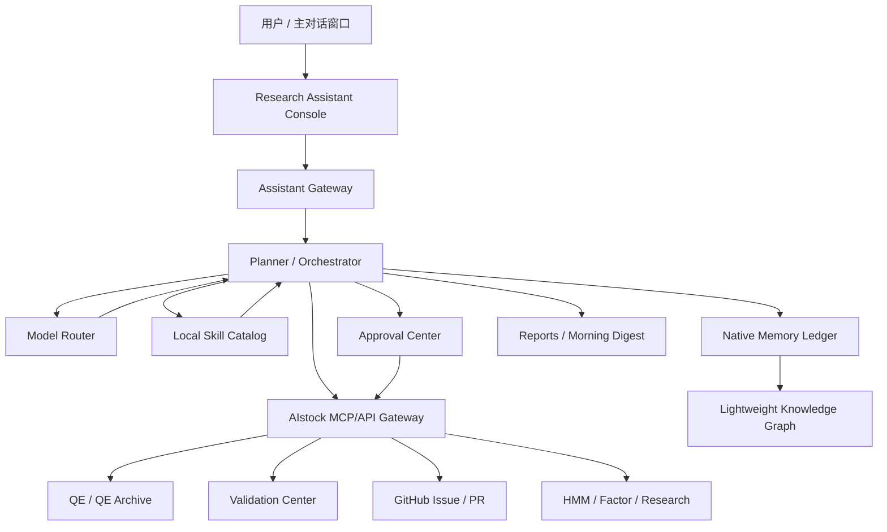
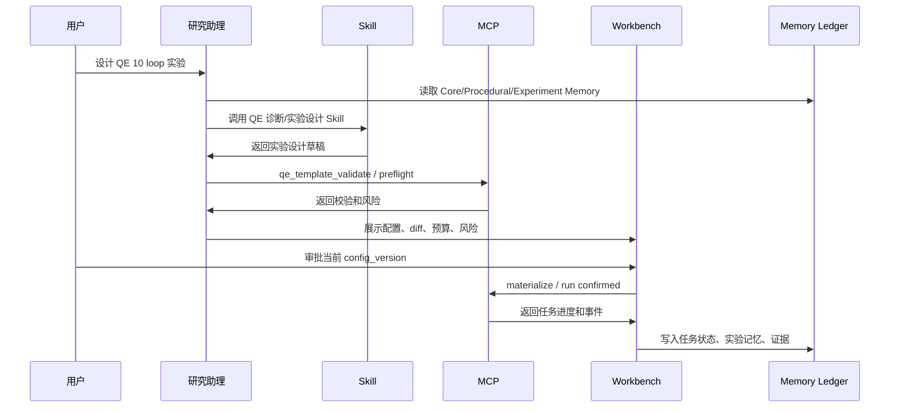

# AIstock 研究与实验综合助理控制台设计方案

> 日期：2026-05-21
> 类型：详细设计方案 v4
> 状态：正式实施设计稿；本文档定义功能边界、阶段目标和开发验收矩阵，不实现代码
> 分支：`docs/research-agent-console-design-20260520`
> Worktree：`F:\Dev\AIstock_worktrees\research-agent-console-design-20260520`
> 范围：研究与实验综合助理、原生长期记忆、轻量知识图谱、MCP 执行工作台、本地 Skill Catalog、Validation/Pipeline Discovery Stream、External Agent Connector、多模型路由、UI 页面模板、阶段实施目标和开发验收矩阵
> 非目标：不让该助理控制鼠标键盘，不让该助理编程、改代码、提交代码、合入 main、重启生产服务、绕过 GitHub Issue 审批或执行实盘交易

---

## 1. 设计结论

AIstock 应建设一个 **研究与实验综合助理控制台**。它不是浏览器点击助手，也不是独立于 AIstock 的另一个 Agent 系统，而是：

> 对话式研究助理 + 原生长期记忆事实源 + MCP/API 执行工作台 + 本地 Skill Catalog + 审批门禁 + 任务/实验/Issue/验证全链路记忆 + 可扩展 UI 控制台。

核心结论：

1. **所有业务操作优先通过 MCP/API 执行**，不控制鼠标键盘，不做页面识别式自动点击。
2. **长期记忆不是 RAG**。RAG/向量检索只能辅助召回，不能作为事实源、规则源、审批源或任务状态源。
3. **长期记忆核心必须由 AIstock 原生自研**。Mem0、Graphiti、LangMem、Letta 等只能作为后续 adapter/PoC/增强能力，不替代 AIstock 原生事实源。
4. **Phase 1 不引入图数据库**。轻量知识图谱先用 AIstock 原生关系表实现；Graphiti/Neo4j/FalkorDB/Kuzu 只作为后续增强候选。
5. **流水线 AI Agent 不再单独设计**。并入研究助理，作为 `Validation / Pipeline Discovery Stream`。
6. **Codex / Claude Code 可以接入助理**，甚至可作为外部主模型，但必须通过 External Agent Connector、MCP、审批、权限和审计，不能绕过风险操作门禁。
7. **多模型路由必须支持成本控制**。国内模型如 DeepSeek、GLM、Qwen、Kimi 可作为 first-class provider；低价模型可写 task-scoped 临时记忆，由主模型审核后提升为长期记忆。
8. **Skill Phase 1 只做本地 Skill Catalog**。不做公共市场、远程安装、多租户、评分发布；未来公共 skill 只能人工筛选、审查、版本锁定后本地导入。
9. **UI 采用 AIstock Console Template**。保留现有 AIstock 左侧导航，研究助理内部使用顶部功能导航、卡片、表格、时间线、抽屉和审批工作台，避免未来驾驶舱扩展时重构。
10. **允许分阶段实施，但禁止低完整度交付**。每个纳入阶段的功能都必须按设计完整实现、可验收、可扩展，不能用静态占位、脚本替代或简化版冒充完成。

---

## 2. 用户需求归纳

| 需求 | 设计结论 |
|---|---|
| 一个窗口和智能体交流 | 新增 `/research-assistant/chat` 主对话入口；其他窗口只展示状态 |
| 不控制鼠标键盘 | 所有业务动作走 MCP/API；UI 只做展示、确认和深链 |
| 看到实时进展 | 建立 `agent_task_events`，用 SSE/WebSocket 展示任务和 MCP 调用进展 |
| 创建 QE 多 loop 实验 | 助理生成模板草稿、preflight、配置 diff、审批后调用 MCP 执行 |
| 可讨论和修改配置 | 每次修改生成 config version 和 diff，旧审批自动失效 |
| 确认后执行 | Phase 1 UI 审批；Phase 2 支持对话确认并绑定 plan digest |
| 长期记忆准确可靠 | 结构化 Memory Ledger 为事实源，RAG 仅辅助召回 |
| 记录所有研究进展 | 每个 Research Stream、Task、Experiment、Issue、Validation run 都写入任务账本和记忆 |
| 流水线 AI 探测 | 并入 `Validation / Pipeline Discovery Stream`，不另建独立 Agent |
| Codex / Claude Code 接入 | 通过 External Agent Connector 受控接入，可做外部主模型但不可越权 |
| 低价模型降成本 | 多模型路由；低价模型做摘要、分类、重复任务，并写临时记忆 |
| 支持国内模型 | DeepSeek、GLM、Qwen、Kimi 等作为可配置 provider |
| 语音能力 | Phase 1 只预留；Phase 2/3 优先托管 Realtime 试点，保留本地 STT/TTS |
| 外部搜索 | 中文搜索优先评估博查/秘塔/SearXNG；Firecrawl 降级为高质量抓取备用 |
| UI 可扩展 | 控制台模板 + 顶部功能导航 + 卡片/表格/抽屉，后续驾驶舱不重构数据层 |

---

## 3. 总体架构



核心模块：

| 模块 | 职责 |
|---|---|
| Assistant Gateway | 统一接入 Web UI、未来语音/IM、Codex/Claude Connector |
| Planner / Orchestrator | 生成计划、选择 Skill/MCP/模型、控制任务状态机 |
| Model Router | 多模型路由、成本预算、风险等级、fallback |
| Native Memory Ledger | 原生长期记忆事实源，非 RAG |
| Lightweight Knowledge Graph | 模块、任务、实验、Issue、论文证据之间的关系 |
| MCP/API Gateway | 调用 AIstock 后端、MCP server、Validation、GitHub、QE |
| Local Skill Catalog | 本地专业能力目录，提供 QE/因子/实验诊断等方法能力 |
| Approval Center | L2+ 操作审批、配置版本、plan digest、风险确认 |
| Workbench | MCP 执行进度、配置预览、diff、日志、深链 |
| Reports | 晨报、实验报告、候选 Issue 报告、审计报告 |

---

## 4. 长期记忆核心架构

### 4.1 设计原则

1. **原生事实源**：AIstock 数据库是长期记忆唯一事实源。
2. **非 RAG**：RAG/向量检索只做辅助召回，不决定事实。
3. **结构化优先**：任务、审批、Issue、实验、验证、用户规则必须结构化存储。
4. **证据绑定**：关键结论必须有 `source_ref` 或 `evidence_refs`。
5. **审批治理**：Core/Procedural/Architecture 记忆必须可审批、废弃、替代。
6. **可回放**：每次助理回答和执行都能回放 Context Pack。
7. **可迁移**：支持 JSONL/Markdown/Parquet 导出，外部工具只通过 adapter 接入。

### 4.2 记忆分层

| 层级 | 名称 | 内容 | 写入方式 | 加载策略 |
|---|---|---|---|---|
| L0 | Core Memory | 助理身份、用户硬规则、生产边界 | 用户确认/标准文档 | 每次必载 |
| L1 | Procedural Memory | Issue 流程、验证门禁、工作规范 | 审批后写入 | 按任务类型必载 |
| L2 | Architecture Memory | 模块边界、MCP、API、DB、UI route | 文档/代码扫描 + 审核 | 按模块加载 |
| L3 | Roadmap Memory | 长期规划、阶段目标、研究方向 | 用户确认 | 规划时加载 |
| L4 | Task State Memory | 任务状态、阻塞、下一步 | 自动写入 | 绑定 task/stream |
| L5 | Experiment Memory | QE/HMM/因子实验配置、结果、失败经验 | 自动写入 + 审核 | 相似实验检索 |
| L6 | Episodic Memory | 对话、MCP 调用、日志摘要 | 自动写入 | 按需追溯 |
| L7 | External Evidence | 搜索、论文、网页、新闻、工具资料 | evidence 入库 | 结论需审核 |
| L8 | Personal Agenda | 用户个人事项、提醒、晨报 | 用户确认/任务生成 | 今日事项加载 |

### 4.3 Memory Ledger 数据模型

```text
research_memory_items
  id
  memory_type                -- core / procedural / architecture / roadmap / task_state / experiment / episodic / external / agenda
  namespace                  -- personal / aistock / project / module / stream / task / experiment / tool
  subject_key
  title
  content_json
  content_text
  source_type                -- conversation / mcp_result / doc_scan / validation_run / github_issue / web_search / manual
  source_ref
  source_timestamp
  confidence
  approval_status            -- draft / approved / rejected / expired / superseded
  risk_level                 -- low / medium / high / production_sensitive
  valid_from
  valid_to
  supersedes_id
  created_by
  approved_by
  checksum
  created_at
  updated_at

research_memory_access_log
  id
  memory_id
  task_id
  stream_id
  agent_id
  retrieval_reason
  used_in_prompt
  used_in_report
  retrieved_at
```

### 4.4 长期记忆不是 RAG

不允许的架构：

```text
把对话和文档切 chunk -> embedding -> 查询时向量召回 -> 让 LLM 判断事实
```

正确架构：

```text
Memory Ledger（事实源）
  - research_memory_items
  - research_memory_entities
  - research_memory_relations
  - research_evolution_paths
  - assistant_approval_requests
  - agent_tasks / agent_task_events
  - issue_candidates / GitHub sync records
  - source evidence tables

Retrieval Layer（辅助）
  - full-text search
  - vector search
  - graph traversal
  - time filter
  - module/task/stream scope filter
  - rerank

Context Pack Builder（确定性装配）
  - 必载 Core/Procedural 硬规则
  - approval_status 过滤
  - valid_from / valid_to 过滤
  - supersedes / contradicts 处理
  - source_ref / evidence_refs 绑定
  - omitted_relevant_refs 记录
```

| 事实类型 | 事实源 | 是否允许 RAG 决定 |
|---|---|---|
| 用户硬规则、生产边界 | approved Core/Procedural Memory | 不允许 |
| GitHub Issue 状态 | GitHub API + 本地同步记录 | 不允许 |
| QE/HMM/因子实验状态 | QE Archive / Task Ledger | 不允许 |
| 验证结果 | Validation Center | 不允许 |
| 审批状态 | Approval table | 不允许 |
| 模块依赖 | 原生轻量图谱 + source refs | RAG 仅辅助查说明 |
| 历史对话经验 | Memory Ledger + evidence | 可辅助召回，不能直接定论 |
| 外部论文/网页资料 | evidence table | 可辅助召回，结论需审核 |
| 相似实验经验 | Experiment Memory + graph relation | 可辅助候选召回，最终引用结构化记录 |

### 4.5 Context Pack

```text
assistant_context_packs
  id
  task_id
  agent_id
  model_profile
  token_budget
  core_memory_refs
  procedural_memory_refs
  architecture_memory_refs
  task_state_refs
  experiment_memory_refs
  graph_relation_refs
  external_source_refs
  temp_memory_refs
  omitted_relevant_refs
  pack_summary
  created_at
```

Context Pack 必须可回放：未来换模型后，也能知道当时助理基于哪些记忆、证据和规则做出判断。

---

## 5. 轻量知识图谱

### 5.1 Phase 1 不引入图数据库

Phase 1 不引入 Neo4j、FalkorDB、Kuzu、Amazon Neptune 或其他图数据库。原因：

1. 当前瓶颈是事实源、审批、证据和任务回放，不是图查询性能。
2. 新增图数据库会带来部署、备份、权限、健康检查和迁移成本。
3. 图谱质量控制比图数据库能力更关键。
4. 后续可把原生图谱镜像到 Graphiti，而不是反向依赖外部图引擎。

### 5.2 图谱数据模型

```text
research_memory_entities
  id
  entity_type              -- module / mcp_tool / skill / db_table / ui_route / experiment / factor / model / paper / issue / task / goal
  entity_key
  title
  summary
  namespace
  source_refs
  confidence
  approval_status
  valid_from
  valid_to
  created_at
  updated_at

research_memory_relations
  id
  source_entity_id
  target_entity_id
  relation_type            -- depends_on / exposes / reads / writes / validates / fixes / derived_from / supports / contradicts / next_candidate
  evidence_refs
  confidence
  approval_status
  valid_from
  valid_to
  created_at
  updated_at

research_evolution_paths
  id
  stream_id
  objective
  current_best_entity_id
  rejected_entities_json
  next_candidate_entities_json
  supporting_paper_refs
  decision_notes
  updated_at
```

### 5.3 Graphiti PoC 策略

Phase 2 Graphiti PoC 已确认：

1. 优先只读镜像 AIstock 原生图谱核心实体关系。
2. 只读镜像实体：module、mcp_tool、skill、experiment、issue、validation_run、PR、branch。
3. 只读镜像关系：exposes、requires、derived_from、blocks、fixes、verifies、supports。
4. 论文/外部资料图谱作为补充，不作为首要 PoC。
5. Graphiti 不回写 approved memory，不替代原生图谱。
6. PoC 失败可以直接移除，不影响 AIstock 主系统。

---

## 6. 外部长期记忆工具策略

长期记忆最终选型：**AIstock 原生事实源自研 + 外部工具 adapter 增强**。

| 工具 | 可借鉴优点 | 不直接作为核心事实源的限制 |
|---|---|---|
| Mem0 | 自托管记忆服务、API、metadata filtering、reranker、dashboard、用户/Agent/session 记忆模型 | 偏通用对话/偏好记忆，不天然掌握 AIstock 任务账本、审批门禁、GitHub 强同步、实验谱系和生产边界 |
| Graphiti | temporal knowledge graph、事实有效期、episode/provenance、hybrid retrieval、自定义 ontology | 需要图后端和图谱质量控制；LLM 抽取关系不能直接成为生产级架构事实 |
| LangMem | semantic/episodic/procedural memory、hot path/background memory formation、namespace | 更适合作为 Agent memory primitive，不是 AIstock 领域事实库和审批系统 |
| Letta | stateful agent、memory blocks、shared memory、runs/steps、tools/MCP/human-in-the-loop | 更像 Agent runtime；如果接管任务编排和记忆写入，会削弱 AIstock 原生治理边界 |

Adapter 原则：

1. 外部工具只做增强检索、图谱增强、用户偏好增强、迁移验证或效果对照。
2. 外部工具不得直接写入 approved 记忆。
3. 外部工具输出必须进入 `memory_candidate` 或 `assistant_temp_memories`。
4. 外部 adapter 故障不能影响原生任务账本、审批、Issue 状态、实验谱系和核心规则。

---

## 7. MCP 执行工作台

### 7.1 MCP 优先原则

MCP 负责“做动作”，Skill 负责“会做事”。

| 场景 | 首选 MCP | 原因 |
|---|---:|---|
| 查询 QE 实验状态 | 是 | 后端事实源，结构化返回 |
| 创建 QE 模板 | 是 | 有 schema、审批、任务 ID 和审计 |
| 物化/运行 QE 实验 | 是 | 涉及数据库、远程节点和长任务 |
| 查询 QE Archive | 是 | 数仓事实查询 |
| 查询 HMM timeline | 是 | 研究任务事实源 |
| 执行 Validation 计划 | 是 | 需要验证记录和 artifacts |
| 创建/同步 GitHub Issue | 是 | 必须强一致和审计 |
| 查询模块质量/覆盖率 | 是 | 来自 Validation Center |
| 数据同步任务 | 是 | 涉及生产/准生产数据边界 |
| 写长期任务状态 | 是 | 任务账本是事实源 |
| 写长期记忆 | 是，通过 Memory API/MCP | 需要权限、索引和审计 |

### 7.2 QE 实验示例流程



### 7.3 任务事件流

```text
agent_task_events
  id
  task_id
  event_type              -- planned / mcp_started / mcp_done / mcp_failed / approval_required / approved / rejected / report_ready
  severity
  message
  payload_json
  evidence_refs
  created_at
```

### 7.4 审批请求

```text
assistant_approval_requests
  id
  task_id
  approval_type            -- create_template / materialize / run_experiment / github_issue / long_compute / production_write
  risk_level
  plan_digest
  config_version_id
  summary
  required_confirmation_text
  status                   -- pending / approved / rejected / expired
  approved_by
  approval_source          -- ui_button / chat_text / codex_review
  approval_text
  approved_at
```

规则：

1. L2+ 写操作必须先生成 plan digest、配置快照和 preflight。
2. 配置版本变化后旧审批自动失效。
3. GitHub Issue 正式入库必须单独确认。
4. 长时间任务必须展示资源预算。
5. 失败后进入 triage，不允许 Agent 自行重复高风险写操作。

---

## 8. 本地 Skill Catalog

Phase 1 只做本地 Skill Catalog，不做公共市场、远程安装、多租户、评分发布。

已确认首批 Skill：

1. QE 诊断。
2. 因子库分析。
3. 因子研发任务包。
4. RDAgent 任务分析。
5. 数据健康检查。

```text
assistant_skill_registry
  id
  skill_key
  title
  version
  description
  domain                    -- qe / hmm / factor / model / strategy / validation / issue / generic
  skill_type                -- analysis / research / development_plan / diagnostics / report / handoff
  entrypoint_type           -- markdown / python / prompt_pack / external
  entrypoint_ref
  input_schema_json
  output_schema_json
  required_mcp_tools
  allowed_side_effect_level -- none / read_only / draft_only / controlled_write
  required_approval_level
  owner
  source_ref
  checksum
  status                    -- draft / approved / deprecated / blocked
  created_at
  updated_at
```

安全规则：

1. Skill 必须本地白名单注册。
2. Skill 必须版本锁定和 checksum 校验。
3. Skill 不能绕过 MCP 写 AIstock 状态。
4. Skill 不能直接创建正式 GitHub Issue。
5. Skill 不能直接写代码、提交代码或合入 main。
6. 公共 skill 未来只能人工筛选、人工审查、版本锁定后导入本地目录。

---

## 9. 流水线 AI Agent 与研究助理关系

流水线 AI Agent 不再作为独立 Agent 系统设计。它并入研究助理，成为 `Validation / Pipeline Discovery Stream`。

| 组件 | 负责内容 |
|---|---|
| 流水线平台 | 测试计划、验证执行、覆盖率、质量数据、夜间任务结果、报告页面、Validation MCP |
| 研究助理 | 跨模块推理、设计/实现一致性检查、夜间探索式测试调度、候选 Issue 归因、晨报、长期记忆沉淀 |
| Issue/GitHub 治理 | 正式 Issue 入库、GitHub 同步、去重、审批和状态一致性 |

约束：

1. 流水线 AI 探测、LLM 夜间报告和候选 Issue 都使用同一套长期记忆、模型路由、审批和证据链。
2. 流水线不另建独立长期记忆或独立 LLM 配置。
3. Validation Stream 产生的问题先进入 `issue_candidates`，正式 Issue 仍需用户或 Codex 审批并同步 GitHub。
4. 夜间测试报告既在流水线 UI 展示，也写入研究助理任务事件和晨报。

---

## 10. External Agent Connector

Codex / Claude Code 可以通过 External Agent Connector 接入助理，甚至作为外部主模型执行完整助理功能，但不能绕过 AIstock 权限和 MCP 门禁。

```text
assistant_external_agent_sessions
  id
  agent_type              -- codex / claude_code / cli / other
  agent_name
  model_profile_id
  auth_scope
  bound_task_id
  bound_stream_id
  can_act_as_primary
  status
  created_at
  last_seen_at

assistant_external_agent_events
  id
  session_id
  event_type              -- request_context / report_progress / attach_evidence / propose_issue / propose_memory / ask_decision
  payload_json
  evidence_refs
  risk_level
  created_at
```

允许能力：

- 查询任务状态。
- 获取 Context Pack。
- 写入任务进度。
- 附加证据。
- 创建候选 Issue。
- 提出记忆候选。
- 请求用户/Codex 审核。

禁止能力：

- 绕过审批启动 L2+ 操作。
- 直接写 approved Core/Procedural/Architecture 记忆。
- 直接创建正式 GitHub Issue。
- 直接合入 main。
- 直接触碰生产服务/DB。

---

## 11. 多模型路由、国内模型与 Persona

### 11.1 模型角色

| 模型角色 | 适合任务 | 记忆权限 |
|---|---|---|
| primary_reasoner | 架构分析、复杂实验方案、跨模块判断、候选 Issue 审核 | 可写 memory candidate，approved 仍走审批 |
| cheap_worker | 日志摘要、MCP 结果归纳、状态分类、重复性报告 | 可写 task-scoped 临时记忆 |
| long_context | 大文档、大代码结构、长实验历史分析 | 可写 evidence summary 和 memory candidate |
| structured | JSON 抽取、字段归一化、报告格式化 | 只写结构化中间结果 |
| embedding / rerank | 检索和证据重排 | 不写业务记忆 |
| reviewer | 候选 Issue、实验方案、研究结论复核 | 可写审核意见，不直接执行 |
| external_agent | Codex / Claude Code 作为外部主模型或执行代理 | 通过 Connector 受控写入 |

### 11.2 国内模型 provider

| Provider | 适合角色 | 设计要求 |
|---|---|---|
| DeepSeek | 主推理、低价推理、代码/Agent 后端候选 | 支持 OpenAI-compatible 调用时复用统一 client |
| 智谱 GLM | Agent、工具调用、结构化输出、MCP 场景 | 验证 function call、JSON 输出、长上下文和成本 |
| Qwen / 阿里 Model Studio | 通用模型、长文本、批量低成本任务 | 适合批量摘要、结构化抽取、成本可控任务 |
| Kimi / Moonshot | 长上下文、长文档、研究资料总结 | 适合大文档和论文资料分析 |
| 其他国内模型 | 补充 provider | 按工具调用、稳定性、价格、上下文、隐私策略评估 |

### 11.3 临时记忆

```text
assistant_temp_memories
  id
  task_id
  stream_id
  model_profile_id
  memory_type              -- progress / observation / log_summary / tool_result_summary / hypothesis
  content_json
  content_text
  evidence_refs
  confidence
  expires_at
  promoted_memory_id
  created_at
```

规则：

1. 低价模型可以写入 task-scoped 临时记忆。
2. 临时记忆默认有过期时间，不进入全局长期记忆检索。
3. 主模型可读取临时记忆并提升为 memory candidate。
4. 低价模型不得写 approved 长期记忆。

### 11.4 Persona

Persona 只影响表达风格和报告结构，不能改变权限、审批、风险等级、MCP、实盘边界或记忆写入规则。

| Persona | 适合场景 |
|---|---|
| 严谨审计型 | Issue 审核、合入前验证、风险分析 |
| 量化研究员型 | QE/HMM/因子实验讨论 |
| 项目经理型 | 今日事项、任务排期、晨报 |
| 简洁执行型 | 状态查询、批量任务、日志摘要 |
| 顾问教练型 | 长期规划、方案解释 |
| 质疑评审型 | 设计审查、Bug 探测 |

---

## 12. 外部搜索和资料证据

### 12.1 Provider 策略

Firecrawl 价格偏高，不作为默认搜索入口。外部搜索采用多 provider、成本可控、证据优先策略。

| 层级 | Provider | 用途 |
|---|---|---|
| L1 中文低成本搜索 | 博查 AI Search API、秘塔 API、SearXNG 自托管 | 中文财经、政策、行业新闻、国内资料 |
| L2 学术/技术搜索 | arXiv MCP、Semantic Scholar MCP、Paper Search MCP、GitHub search | 因子、模型、HMM、事件研究论文和技术资料 |
| L3 高质量抓取/抽取 | Firecrawl MCP、Jina Reader、自建 Playwright crawler | 复杂网页正文抽取、markdown、失败重试、PDF/网页深抓取 |
| L4 金融/宏观补充 | Alpha Vantage、Yahoo Finance、其他行情/宏观 API | 海外市场、商品、宏观指标补充 |

默认策略：

1. 中文财经/政策/行业新闻优先博查/秘塔/SearXNG。
2. 论文/模型/因子研究优先 arXiv/Semantic Scholar/Paper Search。
3. Firecrawl 只在需要完整正文、复杂网页解析或其他 provider 失败时调用。
4. 高频夜间任务默认不走 Firecrawl，除非预算允许或用户确认。
5. 所有 provider 必须记录价格、调用次数、来源、抓取时间、可信度和预算。

### 12.2 Firecrawl 使用边界

Firecrawl 作为高质量网页抓取/抽取候选工具，不作为默认搜索入口。

设计要求：

1. 接入前必须读取官方 pricing，确认 credits、免费额度、额外包和预算上限。
2. 每次调用记录 `creditsUsed`、query、source、task_id、model_profile。
3. 必须支持 daily/monthly budget，超过预算自动暂停外部搜索任务。
4. 中文搜索必须做 PoC，验证中文 query、中文网页抓取、正文抽取、发布时间和反爬稳定性。
5. Firecrawl 结果默认 `untrusted evidence`，不能直接写 Core/Procedural/Architecture memory。

### 12.3 自托管说明

自托管是指把搜索/抓取服务部署在自己的机器或服务器上，由 AIstock 调用本地服务。

优点：

- 成本可控。
- 数据更可控。
- 可以针对中文财经网站优化。
- 可减少对高价外部 API 的依赖。

缺点：

- 需要维护 Docker/Redis/Playwright/代理/升级/监控。
- 搜索质量依赖上游搜索源。
- 中文新闻和财经网页抽取需要调优。
- 反爬和网络稳定性需要持续维护。

### 12.4 证据管线

```text
query -> provider -> fetch/crawl -> source evidence -> trusted/untrusted 标记 -> summary -> memory candidate
```

```text
research_web_sources
  id
  task_id
  provider
  query
  url
  title
  publisher
  published_at
  fetched_at
  summary
  raw_ref
  source_type              -- docs / github / paper / blog / forum / news
  reliability_rating
  trust_level              -- trusted / untrusted / internal / official
  cost_json
  used_in_report
  memory_candidate_id
```

---

## 13. UI 页面设计

### 13.1 UI 模板选择

研究助理 UI 采用 **AIstock Console Template**：保留 AIstock 现有左侧导航；研究助理页面内部采用 Ant Design Pro 风格业务控制台结构，结合现有 `SectionCard`、`MetricCard`、`PaperTable`、`StatusBadge` 和 `components/ui` 基础组件；对话区后续可评估 Ant Design X；驾驶舱图形化后续可评估 React Flow。

### 13.2 页面结构

```text
AIstock 全局 Sidebar
  Research Assistant 页面
    顶部 Page Header：标题、当前模型、任务状态、快速操作
    顶部功能导航：总览 / 对话 / 工作台 / 任务 / 记忆 / 图谱 / MCP / Skill / 审批 / 报告 / 模型 / 设置
    主内容区：卡片 + 表格 + 时间线 + 抽屉详情
    右侧可选上下文栏：当前任务、等待审批、关联记忆、证据来源
```

### 13.3 路由

```text
/research-assistant
/research-assistant/chat
/research-assistant/workbench
/research-assistant/tasks
/research-assistant/streams
/research-assistant/memory
/research-assistant/graph
/research-assistant/mcp-tools
/research-assistant/skills
/research-assistant/approvals
/research-assistant/reports
/research-assistant/models
/research-assistant/settings
/research-assistant/cockpit          # Phase 2/3
/research-assistant/stock-analysis    # Phase 2
```

### 13.4 页面职责

| 页面 | 职责 | Phase 1 状态 |
|---|---|---|
| 总览 | 所有 stream 状态、待确认、失败、今日报告、成本摘要 | 完整实现 |
| Chat | 主对话、计划生成、配置讨论、文字汇报 | 完整实现主窗口 |
| Workbench | MCP 执行进度、配置预览、diff、业务深链、失败 triage | 完整实现 |
| Tasks | Agent 任务和事件流 | 完整实现 |
| Memory | 记忆搜索、审批、废弃、冲突处理、审计 | 完整实现 |
| Graph | 轻量知识图谱实体、关系、实验谱系 | 表格/列表/关系详情，不做复杂图形化 |
| MCP Tools | MCP server/tool/schema/risk/health | 完整实现 |
| Skills | 本地 Skill Catalog、版本、checksum、权限、使用记录 | 完整实现 |
| Approvals | 待确认动作、风险、参数快照、确认原文 | 完整实现 |
| Reports | 晨报、研究报告、实验报告、候选 Issue 报告 | 完整实现 |
| Models | provider、profile、routing policy、成本规则 | 完整实现基础配置 |
| Cockpit | 任务/实验/Issue/资源概览 | Phase 2/3 增强 |

---

## 14. 语音能力预留

语音不是 Phase 1 功能。Phase 2/3 优先托管 Realtime 语音模型做体验验证，再按隐私、成本和离线需求补充本地 STT/TTS。

| 子能力 | 作用 | 候选方案 |
|---|---|---|
| VAD | 判断用户是否正在说话 | Silero VAD、WebRTC VAD |
| Wake Word | 本地唤醒词 | openWakeWord |
| STT | 语音转文字 | OpenAI Speech-to-text、Whisper、whisper.cpp、Vosk、国内云 ASR |
| TTS | 助理播报 | OpenAI TTS、Piper、Coqui TTS、国内云 TTS |
| Realtime Voice Agent | 低延迟语音对话和打断 | OpenAI Realtime 或自建 STT + LLM + TTS |

安全规则：

1. 高风险操作不能只靠语音确认，必须转成文本并绑定 approval request、plan digest 和 config version。
2. 低置信度转写只能进入草稿或澄清，不得执行。
3. 语音不能绕过 MCP、审批、记忆写入和实盘不可达边界。

---

## 15. 通知和提醒

Phase 1 只实现 Web 内通知和通知数据模型；Phase 2 再接桌面通知、IM、邮件或语音提醒。

```text
assistant_notifications
  id
  user_id
  source_type          -- task / approval / report / reminder / issue_candidate
  source_id
  title
  message
  severity            -- info / warning / critical
  status              -- unread / read / dismissed / resolved
  action_route
  created_at
  read_at
```

Phase 1 UI 必须展示：

1. 顶部待处理计数。
2. 总览页“待我处理”卡片。
3. Approvals 页面待确认列表。
4. Reports 晨报提醒。
5. 任务详情中的“需要关注”。

---

## 16. 阶段实施目标和功能边界

### Phase 0：设计冻结和实施准备

| 目标 | 交付物 | 验收标准 |
|---|---|---|
| 设计冻结 | 本文档 v4、用户确认记录 | 不存在互相冲突的阶段目标 |
| 实施分支准备 | 独立 worktree、独立 feature 分支 | 不在 main 或生产根目录开发 |
| 数据迁移规划 | Phase 1 表结构、回滚方案 | DDL gate 明确 |
| API/MCP 契约规划 | API、MCP tools、risk level、schema | 写操作有 preflight/approval/idempotency |
| UI 原型规划 | 页面结构、顶部导航、卡片/表格/抽屉模式 | 与现有 Sidebar 不冲突 |

### Phase 1：核心助理能力完整交付

必须实现：

1. Research Assistant 主页面、主对话入口、顶部功能导航和页面模板。
2. MCP 工具目录、schema 展示、健康状态、risk level、preflight 和执行事件。
3. Task Ledger、Agent Task Event Stream、失败 triage、idempotency key。
4. MCP 执行工作台：配置草稿、配置 diff、preflight、执行进度、tool result、业务深链。
5. 原生 Memory Ledger 和非 RAG Context Pack。
6. 轻量知识图谱原生表和关系检索。
7. 本地 Skill Catalog 和首批 Skill。
8. Validation / Pipeline Discovery Stream。
9. External Agent Connector 合同。
10. 多模型路由和临时记忆。
11. UI 审批中心。
12. 候选 Issue 队列和 GitHub 正式入库门禁。
13. 今日事项、晨报、提醒和 personal namespace。
14. Web 内通知。
15. 原生 trace 和成本/耗时记录。

明确不做：

- 不控制鼠标键盘。
- 不写代码、提交代码、创建 PR 或合入 main。
- 不自动创建正式 Issue。
- 不自动运行长时间或高成本实验。
- 不接入语音。
- 不引入图数据库。
- 不接入外部 memory engine 到运行路径。
- 不接入公共 Skill 市场。
- 不注册任何实盘交易 MCP/Skill/审批入口。
- 不实现多窗口对话。

### Phase 2：协同展示、外部增强和业务扩展

必须实现：

1. 对话确认执行：NLU 意图识别、plan digest 匹配、确认原文回放。
2. 多状态窗口 workspace session。
3. HMM/QE/因子/事件 Research Streams 长期任务视图。
4. Mem0/Graphiti/LangMem/Letta adapter 只读或镜像 PoC。
5. QE 10 loop 配置版本、diff、preflight、审批、执行状态完整交互。
6. 股票分析 MCP：复用现有股票分析能力，输入股票代码生成报告，不触发交易。
7. 基础驾驶舱卡片。
8. 外部搜索 provider PoC：中文低成本 provider + 学术 MCP + Firecrawl/Jina 抽取备用。
9. 桌面通知或 IM 通知。
10. 语音 Realtime 试点。

### Phase 3：长期自治研究助手

必须实现：

1. 每日晨报和定时提醒自动化。
2. 自动推进 read-only/dry-run 白名单任务。
3. 多 Agent 分工和 orchestrator 仲裁。
4. 长期记忆审计报告和图谱审计报告。
5. 自动候选 Issue 生成和人工入库审批。
6. 本地 STT/TTS 混合路线验证。
7. Temporal 或同等级工作流引擎技术验证。
8. AIstock 架构图、MCP 拓扑、任务依赖图和资源状态图形化展示。

### Phase 4：独立产品化

必须实现：

1. 抽离 `assistant_product_core`，AIstock 成为首个 domain adapter。
2. 支持其他 MCP/API 应用接入同一助理框架。
3. 支持可替换 Memory Provider、Skill Provider、MCP Gateway、Channel Provider。
4. 支持人工筛选公共 skill 后本地导入。
5. 保持 AIstock 私有策略、生产边界和研究记忆不外泄。

---

## 17. 开发功能验证矩阵

### 17.1 总体验收红线

| 验收项 | 验收标准 | 阻断条件 |
|---|---|---|
| 阶段完整性 | Phase 1 清单中的每个模块均有数据模型、API/MCP、UI、审计和测试证据 | 任一 Phase 1 模块只有静态占位或脚本代替 |
| 真实数据 | UI 接真实 API/MCP 数据，空状态必须说明原因 | 用 mock 数据冒充完成 |
| 可回放 | 任务计划、Context Pack、MCP 调用、Skill 使用、审批、结果、记忆写入都可追溯 | 关键动作缺少 event/trace |
| 非 RAG 记忆 | Memory Ledger 是事实源，向量/RAG 只做辅助召回 | 用向量召回结果决定事实或审批 |
| 安全边界 | 默认无鼠标键盘控制、无代码写入、无 main 合入、无实盘路径 | 任一越权路径存在 |
| GitHub 一致 | 正式 Issue 必须有 GitHub URL 和状态回写 | 本地正式 BUG JSON 无 GitHub 链接 |

### 17.2 Phase 1 验收矩阵

| 模块 | 必须功能 | 验收证据 |
|---|---|---|
| UI 模板 | 顶部功能导航、卡片、表格、抽屉、审批按钮、空状态、详情深链 | Playwright/UI smoke；截图；路由清单 |
| MCP 目录 | server/tool/schema/risk/health、preflight | API 测试；MCP contract 测试 |
| Task Ledger | 创建任务、状态流转、事件写入、失败 triage、idempotency key | 后端单测；事件流回放测试 |
| Workbench | 配置草稿、diff、preflight、执行进度、tool result、业务深链 | E2E 流程测试 |
| Memory Ledger | 分层记忆写入、检索、审批、supersedes/contradicts/valid_to | 后端单测；记忆审计导出 |
| Context Pack | 必载规则、token budget、source refs、可回放 | 快照测试；回放测试 |
| 轻量知识图谱 | entity/relation/evolution path、证据绑定 | 图谱 API 测试；关系检索测试 |
| Skill Catalog | 本地 skill 注册、checksum、权限、trace、禁用 | 后端单测；UI 列表和详情测试 |
| Validation Discovery | 夜间报告、候选 Issue、流水线证据绑定 | Validation MCP 测试；候选 Issue 测试 |
| External Agent Connector | Codex/Claude session、context pack 读取、证据写入、候选 Issue | Contract test；权限边界测试 |
| 多模型路由 | model profile、routing policy、cost、fallback、temp memory | 单测；模型调用 trace 样例 |
| 审批中心 | risk、plan digest、config version、审批失效、审批回放 | E2E；状态机测试 |
| 候选 Issue | 去重、证据、复现、审批、GitHub 正式同步门禁 | 后端单测；GitHub dry-run/同步测试 |
| Web 通知 | assistant_notifications、待处理计数、详情跳转 | API/UI 测试 |
| Trace/成本 | LLM/MCP/Skill 调用次数、耗时、成本、model profile | trace 样例；报告验证 |

### 17.3 Phase 2 验收矩阵

| 模块 | 必须功能 | 验收证据 |
|---|---|---|
| 对话确认 | chat_text approval、plan digest 匹配、版本变化失效 | E2E；审批回放 |
| 多状态窗口 | 主窗口发令，状态窗口同步，SSE/WebSocket 推送 | 多标签测试；事件同步测试 |
| 外部 Memory Adapter PoC | 只读/镜像接入，效果对照，不写 approved 记忆 | PoC 报告；回滚测试 |
| 股票分析 MCP | 输入股票代码生成报告，不触发交易 | MCP 测试；安全测试 |
| 外部搜索 | 中文 provider、学术 MCP、Firecrawl/Jina 抽取备用、证据保存 | 搜索报告样例；中文搜索 PoC；prompt 注入测试 |
| 通知 | 桌面/IM 通知，任务完成/失败/待审批 | 通知测试；订阅配置 |
| 语音 Realtime | 语音转文本、播报、文本审批绑定 | transcript 测试；审批安全测试 |

### 17.4 UI 验收矩阵

| 页面 | 必须展示 | 必须交互 | 验收证据 |
|---|---|---|---|
| 总览 | 今日待确认、运行中任务、失败、候选 Issue、成本 | 点击卡片进入详情 | UI smoke / 截图 |
| Chat | 主对话、计划、配置讨论、确认入口 | 生成计划、提交确认、查看上下文 | E2E |
| Workbench | MCP 调用、配置 diff、preflight、日志、深链 | 执行 dry-run、打开详情、失败 triage | E2E |
| Tasks | 状态、事件、证据、耗时、模型 | 筛选、打开事件、暂停/恢复 | UI/API 测试 |
| Memory | 记忆类型、审批、冲突、来源 | 审批、废弃、查看 source_ref | UI/API 测试 |
| Graph | entity/relation/evolution path | 查看关系详情、证据、有效期 | UI/API 测试 |
| MCP Tools | server/tool/schema/risk/health | 查看 schema、执行 preflight | UI/API 测试 |
| Skills | 本地 skill、checksum、权限、trace | 启用/禁用、查看使用记录 | UI/API 测试 |
| Approvals | risk、plan digest、配置版本、确认原文 | 批准/拒绝、查看执行结果 | E2E |
| Reports | 晨报、实验报告、候选 Issue 报告 | 查看来源、导出、跳转详情 | UI/API 测试 |
| Models | provider、profile、routing、成本 | 启用/禁用、调整策略 | UI/API 测试 |

---

## 18. 已确认决策记录

| 决策项 | 结论 |
|---|---|
| 首批 Skill | QE 诊断、因子库分析、因子研发任务包、RDAgent 任务分析、数据健康检查 |
| Phase 1 通知 | Web 内通知和通知数据模型；桌面/IM 放 Phase 2 |
| 外部搜索 | Firecrawl 不做默认搜索入口；优先中文低成本 provider + 学术 MCP，Firecrawl/Jina 做抽取备用 |
| Graphiti PoC | 优先只读镜像 AIstock 原生图谱核心实体关系，论文图谱作为补充 |
| 语音路线 | Phase 2/3 优先托管 Realtime 试点，保留本地 STT/TTS 混合路线 |
| 长期记忆 | 不是 RAG；Memory Ledger 是事实源，向量/RAG 只做辅助召回 |
| Codex/Claude 接入 | 可作为外部主模型，但不可越权 |
| 图数据库 | Phase 1 不引入；后续只作为增强 PoC |
| Skill 公共平台 | 当前不设计；未来人工筛选后本地导入 |

---

## 19. 待后续确认问题

1. Phase 2 中文搜索 provider 首选博查、秘塔，还是先做 SearXNG 自托管。
2. Phase 2 Firecrawl/Jina/自建 Playwright crawler 的抽取备用优先级。
3. Phase 2 桌面通知优先浏览器通知、Windows toast，还是 IM/企业微信。
4. Phase 2 语音试点使用哪个托管 Realtime provider。
5. Phase 2 国内模型 provider 的首批上线清单和预算。

---

## 20. 参考资料

- Mem0 OSS：`https://docs.mem0.ai/open-source/overview`
- Graphiti GitHub：`https://github.com/getzep/graphiti`
- LangMem Docs：`https://langchain-ai.github.io/langmem/`
- Letta Stateful Agents：`https://docs.letta.com/guides/core-concepts/stateful-agents`
- LangGraph Persistence：`https://docs.langchain.com/oss/python/langgraph/persistence`
- Ant Design Pro Preview：`https://preview.pro.ant.design/`
- Ant Design X Overview：`https://x.ant.design/components/overview/`
- shadcn/ui Blocks：`https://ui.shadcn.com/blocks`
- React Flow：`https://reactflow.dev/`
- MCP Tools Specification：`https://modelcontextprotocol.io/specification/2025-06-18/server/tools`
- Firecrawl Pricing：`https://www.firecrawl.dev/pricing`
- Firecrawl Search API：`https://docs.firecrawl.dev/api-reference/endpoint/search`
- Firecrawl Self-hosting：`https://docs.firecrawl.dev/contributing/self-host`
- 博查 AI 开放平台：`https://open.bochaai.com/`
- SerpApi Baidu Search：`https://serpapi.com/baidu-search-api`
- SearXNG：`https://docs.searxng.org/`
- Perplexica GitHub：`https://github.com/ItzCrazyKns/Perplexica`
- arXiv MCP Server GitHub：`https://github.com/blazickjp/arxiv-mcp-server`
- Semantic Scholar MCP Server GitHub：`https://github.com/awwaiid/semantic-scholar-mcp-server`
- OpenAI Realtime：`https://platform.openai.com/docs/guides/realtime`
- Whisper：`https://github.com/openai/whisper`
- whisper.cpp：`https://github.com/ggml-org/whisper.cpp`
- Vosk：`https://github.com/alphacep/vosk-api`
- Piper TTS：`https://github.com/rhasspy/piper`
- Silero VAD：`https://github.com/snakers4/silero-vad`
- openWakeWord：`https://github.com/dscripka/openWakeWord`
- Temporal Platform Docs：`https://docs.temporal.io/temporal`
- PostgreSQL LISTEN/NOTIFY：`https://www.postgresql.org/docs/current/sql-notify.html`
- Redis Pub/Sub：`https://redis.io/docs/latest/develop/pubsub/`
