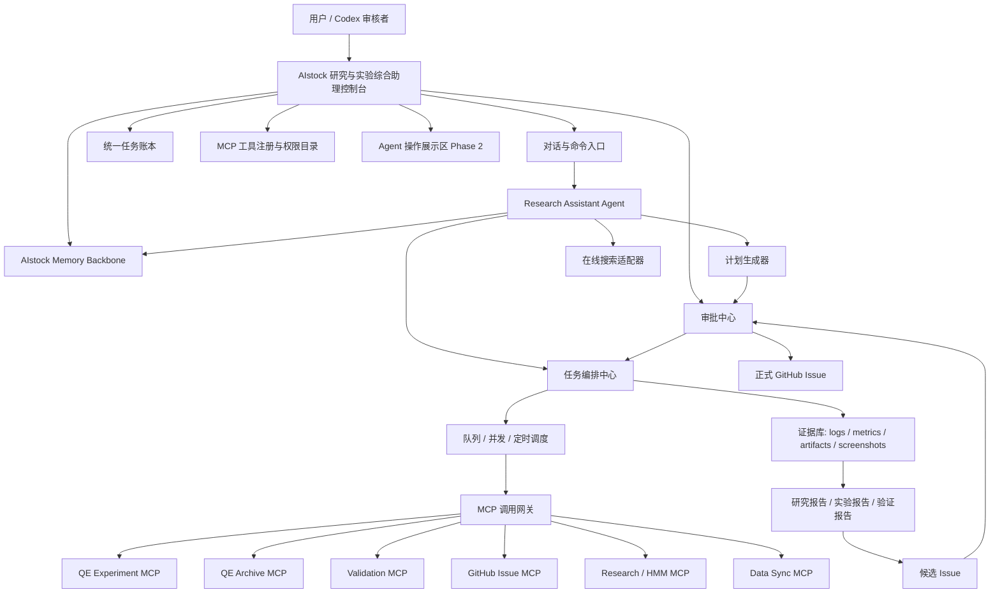
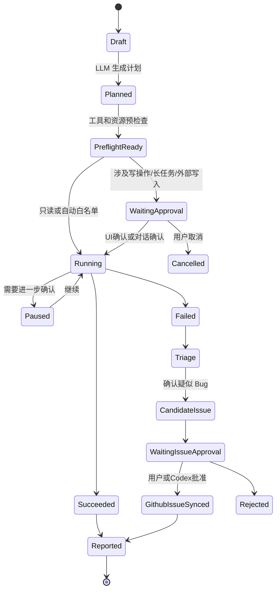

# AIstock 研究与实验综合助理控制台设计方案

> 日期：2026-05-20  
> 类型：详细设计方案  
> 状态：设计稿，等待评审；本文档只定义方案，不实现代码  
> 分支：`docs/research-agent-console-design-20260520`  
> Worktree：`F:\Dev\AIstock_worktrees\research-agent-console-design-20260520`  
> 范围：研究与实验综合助理、长期记忆、MCP 调度、人工确认、在线搜索、并行长期任务、操作展示区、语音能力预留  
> 非目标：不赋予该助理编程、改代码、提交代码、合入 main、重启生产服务、直接执行实盘交易的能力

---

## 1. 结论

可以在 AIstock 上新增一个“研究与实验综合助理控制台”，把自定义 LLM、MCP 服务、研究任务、QE 实验、HMM 演进、事件处理演进、因子研发、数仓分析、在线搜索、任务进度记忆和长期规划统一管理起来。

本方案建议把该能力定义为 **AIstock 研究助理智能体**，而不是简单聊天机器人。它的核心定位是：

1. 作为量化研发助手，记住 AIstock 的架构、长期规划、任务进度、实验历史和用户偏好。
2. 通过受控 MCP 工具执行研究、实验、验证、查询、报告生成等任务。
3. 第一阶段所有可写或长耗时动作必须人工确认。
4. 第二阶段支持用户在对话中确认后直接执行，无需打开 PowerShell 或手工调用脚本。
5. 允许 Agent 执行测试、验证、实验和分析，但最终正式入库 Issue 必须由用户或 Codex 审核批准。
6. 明确禁止该助理直接写代码、修改仓库、提交代码或合入 main；未来如果要增加编程能力，必须另开独立设计。

1M 上下文模型可以提升长文档阅读与跨模块分析能力，但不能替代长期记忆系统。长期记忆必须落在可查询、可审计、可纠错、可权限控制的持久化存储中。

---

## 2. 用户需求归纳

| 需求 | 设计结论 |
|---|---|
| 第一阶段人工确认执行 | 所有写操作、长任务、GitHub 写入、生产库写入、远程节点占用都进入审批中心 |
| 后续对话确认后直接执行 | 增加 `chat_approval`，用户在对话中明确确认后，由控制台记录审批快照并执行 |
| 长期记忆 | 建立 AIstock Memory Backbone，记录架构、任务、实验、用户规划、流程经验 |
| 记住整个程序架构 | 通过架构索引、设计文档索引、模块边界图、MCP resource 和周期性扫描更新 |
| 记住所有任务进度 | 所有任务进入统一任务账本，记录状态、阶段、证据、下一步、负责人 |
| 成为量化研发助手 | 定义 Research Assistant 角色，支持 HMM、QE、事件、因子、策略包等研发任务 |
| 能执行测试和验证 | 通过 Validation MCP、业务探针、Playwright/pytest/nox 计划执行，但不写代码 |
| 提 Issue 必须正式批准 | LLM 只能生成候选 Issue；正式 GitHub Issue 由用户或 Codex 审批后创建 |
| 不具备编程能力 | 工具权限层禁用文件写入、代码修改、Git commit、PR、merge 类工具 |
| 未来语音 | 预留语音输入、语音播报、任务摘要播报接口 |
| 操作展示区 | 第二阶段增加 Agent Workspace Panel，嵌入 QE/HMM/流水线等页面或任务可视化 |
| 在线搜索 | 增加 Web Research Tool Adapter，搜索结果必须保留来源、时间、摘要和引用 |
| 多长期任务并行 | 任务队列支持 HMM、事件、因子、QE 等并行 research streams |
| 1M 上下文模型 | 用于大范围上下文分析；仍需检索式记忆和证据库控制成本与准确性 |

---

## 3. 开源社区方案调研与取舍

### 3.1 参考方案概览

| 方案 | 主要能力 | 可借鉴点 | 是否建议直接作为 AIstock 核心 |
|---|---|---|---|
| Letta / MemGPT | 状态化 Agent、core memory、archival memory、runs/steps、MCP tools | 记忆分层、Agent 状态持久化、工具调用轨迹 | 不建议第一阶段整体嵌入；可借鉴记忆分层，后续评估作为 Agent runtime |
| Mem0 OSS | 自托管记忆层、SDK/REST、用户/会话/Agent 记忆、pgvector、审计 | 可作为第二阶段可插拔长期记忆引擎 | 建议作为候选 memory adapter，不替代 AIstock 任务账本 |
| LangGraph / LangMem | 长期记忆 store、semantic/episodic/procedural memory、后台记忆整理 | 适合 Python 任务编排、状态机和记忆工具 | 建议作为 Agent 工作流/记忆实现候选，优先做 adapter |
| Langfuse | LLM tracing、prompt version、eval、annotation、成本和延迟观测 | 适合记录 LLM 调用、工具轨迹、评估和 prompt 版本 | 建议强烈借鉴；可先实现 AIstock 原生 trace，再评估接入 |
| Dify | 可视化 agentic workflow、知识库、工具、MCP Server、API | 适合观察产品形态和 workflow UI | 不建议替代 AIstock；可借鉴 UI/流程编排概念 |
| Flowise | AI Agent/Workflow 可视化、Human-in-the-loop、MCP client/server、日志 | 可借鉴 Agentflow、工具目录、可视化调试 | 不建议替代 AIstock；可借鉴控制台 UI 和调试体验 |
| MCP 官方规范 | Tools、Resources、Prompts、human-in-the-loop、安全和审计 | 工具 schema、资源上下文、敏感操作确认 | 必须遵守；AIstock MCP 调度层按此设计 |

### 3.2 推荐取舍

第一阶段不建议直接把 Dify、Flowise 或 Letta 作为 AIstock 的主控平台，因为 AIstock 已经有自己的后端、MCP server、QE 实验体系、Validation Center、GitHub Issue 闭环、生产数据边界和领域任务状态。直接引入完整第三方平台会造成状态分裂。

推荐路线：

1. **AIstock 原生控制台作为主控层**：任务、审批、MCP 调用、证据、Issue 候选、实验谱系全部落在 AIstock。
2. **借鉴 LangGraph / LangMem 的 memory taxonomy**：把记忆分为 semantic、episodic、procedural，并区分 hot path 与 background 写入。
3. **借鉴 Letta 的 stateful agent 设计**：Agent 需要 core memory、archival memory、runs/steps 和工具轨迹。
4. **Mem0 OSS 作为第二阶段 memory adapter 候选**：如果希望快速获得自托管记忆 server、dashboard、API key、audit log，可以通过 adapter 接入。
5. **Langfuse 作为可选观测后端**：第一阶段先实现 AIstock 原生 traces；若后续需要更成熟的 LLM observability，再导出到 Langfuse。
6. **Dify/Flowise 作为 UI 和工作流设计参考**：不作为生产依赖。

---

## 4. 总体架构



---

## 5. 智能体角色定义

### 5.1 角色名称

推荐名称：**AIstock 研究助理**。

英文内部标识：`research_assistant_agent`。

### 5.2 角色职责

| 职责 | 是否允许 |
|---|---|
| 阅读设计文档、架构文档、任务记录 | 允许 |
| 总结 AIstock 当前架构和模块边界 | 允许 |
| 查询 QE 数仓、实验历史、模型试验、因子使用历史 | 允许 |
| 提出 HMM / QE / 事件 / 因子研发计划 | 允许 |
| 执行只读分析和 dry-run preflight | 允许自动执行 |
| 执行测试、验证、业务流程探测 | 允许，但需记录证据 |
| 创建 QE 测试实验或小规模实验 | 第一阶段需人工审批；第二阶段可对话确认 |
| 启动长时间训练、占用远程节点 | 必须审批 |
| 写生产库测试记录 | 必须审批且带 cleanup policy |
| 创建候选 Issue | 允许 |
| 创建正式 GitHub Issue | 必须用户或 Codex 审批 |
| 修改代码、提交代码、合入 main | 禁止 |
| 重启生产服务 | 禁止，除非另有人工授权流程 |
| 执行实盘交易 | 禁止 |

### 5.3 系统提示词边界

Research Assistant 的 system prompt 必须包含以下硬边界：

1. 你是研究和实验助理，不是代码开发者。
2. 你可以调用已授权 MCP 工具，但不能绕过 AIstock 审批中心。
3. 你不能修改仓库文件、创建 commit、创建 PR 或合入 main。
4. 你发现的问题只能进入候选 Issue；正式 Issue 必须经用户或 Codex 审核。
5. 你必须把每个结论绑定证据。
6. 你必须区分回测、模拟盘、实盘、生产数据和测试数据。
7. 你必须保留任务记忆、失败经验和下一步计划。

---

## 6. 长期记忆设计

### 6.1 记忆不是长上下文

1M 上下文模型适合一次性阅读大量资料，但不适合作为长期记忆的唯一方式。原因：

- 成本高，延迟高。
- 容易被旧信息干扰。
- 无法自动判断事实是否过期。
- 无法形成审计记录。
- 无法进行权限控制和定向清理。

因此，1M 上下文只作为“大范围检索和总结能力”，长期记忆必须结构化落库。

### 6.2 记忆分层

| 记忆类型 | 内容 | 写入方式 | 示例 |
|---|---|---|---|
| Core Memory | 固定身份、边界、用户偏好、当前长期目标 | 人工批准或高置信更新 | “用户要求所有设计方案使用中文” |
| Semantic Memory | AIstock 架构事实、模块职责、数据表、API、MCP 工具能力 | 文档扫描 + 审核 + 周期更新 | “QE 回测必须使用固定 PIT 股票池” |
| Episodic Memory | 任务运行过程、实验尝试、失败原因、审批记录 | 自动写入 | “2026-05-20 创建 QE 模板失败，因为股票池缺失” |
| Procedural Memory | 已验证的处理流程、Issue 流程、验证门禁 | 人工批准后写入 | “新 BUG 必须同步 GitHub Issue” |
| Project Roadmap Memory | 长期规划、阶段目标、待办方向 | 人工确认后写入 | “第二阶段建设工程健康驾驶舱” |
| Task State Memory | 长期任务状态、并行任务进度、下一步 | 自动写入，用户可编辑 | “HMM 事件处理演进处于方案设计阶段” |

### 6.3 AIstock Memory Backbone

建议新增 AIstock 原生记忆服务，而不是直接把第三方 memory server 作为唯一真相。

核心表建议：

```text
research_memory_items
  id
  memory_type              -- core / semantic / episodic / procedural / roadmap / task_state
  namespace                -- user / project / module / task / agent
  subject                  -- HMM / QE / Paper v2 / Validation / user-preference
  content_json
  source_type              -- conversation / mcp_result / doc_scan / manual / validation_run / github_issue
  source_ref
  confidence
  valid_from
  valid_to
  supersedes_id
  approved_by
  approval_status          -- draft / approved / rejected / expired
  embedding_ref
  created_at
  updated_at

research_memory_edges
  source_memory_id
  target_memory_id
  relation_type            -- depends_on / supersedes / contradicts / supports / derived_from
  confidence

research_memory_access_log
  id
  memory_id
  task_id
  agent_id
  retrieved_at
  retrieval_reason
  used_in_response
```

### 6.4 第三方 memory adapter

第一阶段实现 AIstock 原生接口即可，但设计上预留 adapter：

```text
MemoryProvider
  - aistock_postgres_pgvector        # 默认
  - mem0_oss                         # 第二阶段候选
  - letta_archival_memory            # 后续评估
  - langgraph_store                  # 后续工作流引擎候选
```

推荐优先级：

1. **默认：AIstock Postgres + pgvector + tsvector**。和现有系统集成最稳，权限和审计可控。
2. **第二阶段评估 Mem0 OSS**。适合快速获得 self-hosted server、dashboard、API key、audit log 和多信号检索。
3. **后续评估 Letta**。适合需要完整 stateful agent runtime 时使用，但可能与 AIstock 编排层重叠。
4. **LangGraph/LangMem**。适合把复杂多阶段任务做成 Python 状态机，并使用 semantic/episodic/procedural memory 工具。

### 6.5 记忆写入门禁

| 记忆类型 | 是否可自动写入 | 是否需审批 | 原因 |
|---|---:|---:|---|
| Episodic task log | 是 | 否 | 记录事实过程，不改变行为规则 |
| Task state | 是 | 可人工修正 | 用于恢复任务进度 |
| Semantic architecture fact | 可草稿 | 是 | 架构事实错误会长期误导 Agent |
| Procedural workflow | 否 | 是 | 会改变 Agent 行为 |
| Core user preference | 可建议 | 是 | 影响所有后续任务 |
| Roadmap memory | 可建议 | 是 | 属于长期规划 |

---

## 7. 任务编排和人工确认

### 7.1 任务生命周期



### 7.2 第一阶段人工确认

第一阶段确认方式：

- UI 审批中心按钮确认。
- 对话中给出明确确认后，由控制台生成审批记录。
- 审批记录必须保存：任务 ID、计划摘要、参数快照、风险等级、审批人、审批时间、确认原文。

### 7.3 第二阶段对话确认直接执行

第二阶段增加 `chat_approval_token`：

1. Agent 生成待审批计划，并计算 `plan_digest`。
2. UI 对话窗口显示“待确认执行”的摘要和风险等级。
3. 用户在对话中明确回复，例如“确认执行这个 QE dry-run”或“确认创建这个测试实验”。
4. 后端把对话内容绑定到 `approval_request_id`。
5. 若计划、参数、风险等级未变化，则执行。
6. 若计划发生变化，必须重新确认。

高风险操作仍需更强确认：

- 生产库大规模写入。
- 远程训练资源占用超过阈值。
- 创建正式 GitHub Issue。
- 关闭 GitHub Issue。
- 涉及实盘或交易相关动作。

这些操作可以通过对话确认，但必须要求 Agent 明确复述影响范围。

---

## 8. MCP 调度设计

### 8.1 MCP 工具分级

| 等级 | 含义 | 示例 | 默认策略 |
|---|---|---|---|
| L0 read_only | 只读查询 | 查询 QE 数仓、列出模板、查任务状态 | 可自动执行 |
| L1 dry_run | 不写入的预检查 | QE materialize preflight、Validation plan preview | 可自动执行 |
| L2 write_test_data | 写入可清理测试数据 | 创建测试 QE 实验、生成测试策略包 | 第一阶段审批；第二阶段可对话确认 |
| L3 long_running_compute | 占用训练或远程节点 | HMM 演进、QE 多 loop 实验 | 必须审批和资源预算 |
| L4 external_write | GitHub、远程服务写入 | 创建 GitHub Issue、更新 Issue 状态 | 必须审批 |
| L5 production_sensitive | 生产数据、服务、交易边界 | 生产库大规模写入、重启服务、交易动作 | 默认禁止或专项审批 |

### 8.2 MCP Tool Registry

新增或扩展 MCP 工具目录：

```text
mcp_tool_registry
  id
  server_name
  tool_name
  title
  description
  input_schema_json
  output_schema_json
  risk_level
  module
  requires_approval
  supports_dry_run
  timeout_seconds
  max_concurrency
  enabled
  last_health_status
  last_schema_hash
```

### 8.3 已有 MCP 模块接入建议

| 模块 | 接入用途 | 阶段 |
|---|---|---|
| `aistock-qe-experiment` | 创建/物化/运行/查询 QE 实验和模板 | Phase 1 |
| `aistock-qe-archive` | 分析历史实验、模型 trials、因子使用、超参历史 | Phase 1 |
| `aistock-validation` | 执行测试计划、创建/同步 GitHub Issue、查询流水线状态 | Phase 1 |
| `aistock-research` | HMM / research pipeline 任务记录和状态 | Phase 1/2 |
| data sync MCP | 数据同步健康、测试数据准备 | Phase 2 |
| future paper/strategy MCP | 策略包、Selection Center、Paper v2 流程验证 | Phase 2/3 |

---

## 9. 在线搜索与资料分析

### 9.1 能力边界

Research Assistant 可以进行在线搜索，用于：

- 查询最新开源工具、论文、行业案例。
- 查找某个模型、框架或算法资料。
- 对比 HMM、事件处理、因子研发方法。
- 帮助生成研究假设。

但在线搜索结论不能直接写入长期事实记忆，除非经过审核。

### 9.2 Search Evidence

每次搜索必须保存：

```text
research_web_sources
  id
  task_id
  query
  url
  title
  publisher
  fetched_at
  summary
  quoted_text_limited
  relevance_score
  used_in_report
```

### 9.3 搜索结果使用规则

1. 对“当前状态、版本、价格、接口、项目活跃度”必须重新搜索，不能依赖旧记忆。
2. 对金融、法律、医疗等高风险结论必须标注来源和日期。
3. 对开源项目要优先使用官方文档、GitHub、论文或项目主页。
4. LLM 生成的资料总结必须和引用来源绑定。

---

## 10. 并行长期任务设计

### 10.1 Research Stream

把 HMM、事件处理、因子研发、QE 组合优化等长期方向抽象为 `Research Stream`。

```text
research_streams
  id
  stream_key              -- hmm_evolution / event_signal / factor_research / qe_optimization
  title
  objective
  owner
  status                  -- active / paused / completed / archived
  priority
  current_phase
  latest_summary
  next_actions_json
  memory_namespace
  created_at
  updated_at
```

### 10.2 支持的长期工作

| Stream | Agent 可以长期做什么 | 需要确认的动作 |
|---|---|---|
| HMM 演进 | 汇总指标、找 regime 失败场景、提出演进假设、执行小规模验证 | 启动训练、写入实验记录、占用远程资源 |
| 事件处理演进 | 分析事件信号表现、查误杀/漏判样本、提出规则或模型方向 | 创建新事件策略实验、进入 Paper v2 验证 |
| 因子研发 | 分析因子库、找低相关高 IC 候选、提出组合 | 启动因子计算、大规模回测 |
| QE 优化 | 查询 QE Archive、组合 loop、生成模板、评估失败实验 | 创建/运行 QE 实验 |
| 流水线主动发现 | 每晚探测新功能、生成候选 Bug | 正式创建 GitHub Issue |

### 10.3 并行执行模型

- 每个 stream 有独立任务队列。
- 全局资源预算控制远程节点、DB 连接、LLM token、实验数量。
- Agent 每天可以自动推进 read-only 和 dry-run 任务。
- 需要写入或长任务时进入审批中心。
- 每个 stream 每天生成晨报，汇总完成、失败、等待确认和建议。

---

## 11. 操作展示区设计（Phase 2）

### 11.1 目标

用户希望 Agent 执行 QE 实验时，页面上可以直接显示 QE 实验相关页面，不需要用户手动跳转。该能力建议设计为 **Agent Workspace Panel**。

### 11.2 展示方式

| 展示模式 | 说明 | 适用场景 |
|---|---|---|
| Embedded Route | 在控制台右侧嵌入 AIstock 内部页面 | QE 实验、提示词、Validation 报告 |
| Task Timeline | 展示 Agent 当前 MCP 调用、日志、证据 | 长任务执行过程 |
| Artifact Preview | 展示回测曲线、表格、截图、报告 | 实验结果分析 |
| Browser Snapshot | 展示页面截图或 Playwright 录屏 | UI 验证和业务探测 |
| Split View | 左侧对话，右侧操作页面 | 人机协作执行任务 |

### 11.3 技术边界

第一阶段不实现自动页面操作。第二阶段可以实现：

1. Agent 根据任务类型自动打开相关 route。
2. 页面右侧展示 `iframe` 或内部 React route preview。
3. 对页面操作只限展示和跳转，不直接模拟用户点击危险按钮。
4. 若需要自动 UI 操作，应通过 Playwright/Browser Probe 工具执行，并保存截图证据。

---

## 12. UI 设计

### 12.1 一级页面

建议新增路由：

```text
/research-assistant
/research-assistant/chat
/research-assistant/tasks
/research-assistant/streams
/research-assistant/memory
/research-assistant/mcp-tools
/research-assistant/approvals
/research-assistant/reports
/research-assistant/workspace        # Phase 2
/research-assistant/settings
```

### 12.2 页面职责

| 页面 | 功能 |
|---|---|
| 总览页 | 今日任务、等待确认、失败任务、长期 stream 状态、最近报告 |
| 对话页 | 与 Research Assistant 对话、生成计划、确认执行、查看引用记忆 |
| 任务中心 | 所有任务列表、阶段、风险等级、MCP 调用、日志、证据 |
| Research Streams | HMM、事件、因子、QE 等长期工作流状态 |
| 记忆中心 | 查看 core/semantic/episodic/procedural/roadmap/task memory，支持审批和废弃 |
| MCP 工具目录 | 工具列表、schema、风险等级、健康状态、dry-run 支持 |
| 审批中心 | 待确认计划、风险影响、参数快照、确认/拒绝 |
| 报告中心 | 夜间报告、研究报告、实验报告、候选 Issue 报告 |
| 操作展示区 | Phase 2：嵌入 QE/HMM/流水线页面和任务可视化 |
| 设置页 | LLM Provider、Agent Profile、Prompt、资源预算、自动化策略 |

### 12.3 与现有提示词管理页面关系

当前提示词管理页面位于：`/quantevolver/prompts`。

建议重构为通用 Prompt Registry：

```text
/prompt-registry
  - QE prompts
  - Research Assistant prompts
  - Validation discovery prompts
  - HMM evolution prompts
  - Event signal prompts
  - Factor research prompts
```

短期可以继续复用现有 QE prompt 后端表和 UI 能力，但需要增加：

- `module` 字段。
- `agent_role` 字段。
- `llm_provider_profile` 字段。
- `approval_status` 字段。
- `eval_score` 字段。
- `prompt_version` 与 trace 绑定。

---

## 13. LLM 配置与模型选择

### 13.1 Provider

第一阶段支持：

- DeepSeek V4 Pro：使用现有 env 配置。
- GLM 5.1：预留配置。
- OpenAI / Claude / 本地模型：作为后续 provider。

### 13.2 模型路由

| 任务 | 推荐模型类型 |
|---|---|
| 简单任务分类 | 低成本模型 |
| 长文档架构分析 | 1M 上下文模型 |
| 实验结果分析 | 强推理模型 |
| Issue 候选审核 | 强推理 + 证据约束 |
| 在线资料搜索总结 | 支持引用和结构化输出的模型 |
| prompt 自我改进 | 强推理模型，但需要人工审批 |

### 13.3 密钥管理

- API Key 只从 env 或安全配置读取。
- UI 不展示明文 key。
- Trace 中不得保存密钥。
- Prompt 和 memory 中禁止写入 token。

---

## 14. 候选 Issue 与正式 Issue 流程

### 14.1 候选 Issue

Agent 可以自动创建 `issue_candidate`：

```text
issue_candidates
  id
  source_task_id
  title
  severity_suggestion
  module_suggestion
  evidence_refs
  reproduction_steps
  expected
  actual
  confidence
  dedupe_candidates
  status -- draft / needs_review / approved / rejected / promoted
```

### 14.2 正式 Issue 门禁

正式入库规则：

1. 必须经过用户或 Codex 审批。
2. 必须同步 GitHub Issue。
3. 不能只创建本地 BUG JSON。
4. 必须保存 GitHub issue number 和 URL。
5. 必须与 Validation MCP / GitHub Issue MCP 状态一致。

### 14.3 Agent 的限制

Agent 不能自己决定“这个一定是 Bug 并入库”。它只能给出：

- 问题摘要。
- 证据。
- 影响范围。
- 复现步骤。
- 严重级别建议。
- 是否疑似重复。

---

## 15. 语音能力预留

语音不是第一阶段必要功能，但应预留接口。

### 15.1 未来能力

- 语音输入：用户口述研究任务。
- 语音播报：每日晨报、任务失败、等待审批提醒。
- 语音确认：高风险操作不建议只靠语音，必须转文本并确认。

### 15.2 数据模型预留

```text
assistant_voice_events
  id
  task_id
  direction          -- input / output
  transcript
  audio_ref
  confidence
  confirmed_text
  created_at
```

---

## 16. 与现有模块的关系

| 现有模块 | 关系 |
|---|---|
| Validation Center | 提供测试计划、验证执行、Issue 同步、质量状态 |
| 主动发现流水线 UI | 作为 Research Assistant 的质量发现输入和夜间报告来源 |
| QE Templates | Research Assistant 可基于审批创建模板或分析模板失败原因 |
| QE Archive | 作为历史实验和数仓分析核心来源 |
| Research Pipeline | 作为研究任务元数据和 HMM timeline 入口 |
| Quantevolver Prompts | 短期复用，长期抽象为通用 Prompt Registry |
| GitHub Issues Integration | 正式 Issue 同步必须走该闭环 |
| Data Sync 自治控制平面 | 后续作为数据准备和数据健康工具来源 |
| Paper v2 / Strategy Package | 第二阶段可作为验证目标，但不让 Agent 修改运行代码 |

---

## 17. 阶段计划

### Phase 0：设计与评审

交付物：

- 本设计文档。
- 开源方案取舍表。
- 数据模型草案。
- UI 页面清单。
- 验收指标。

验收：

- 文档为中文。
- 明确 Agent 非编程边界。
- 明确人工确认和对话确认路径。
- 明确长期记忆方案和第三方 adapter 选择。

### Phase 1：受控研究助理 MVP

功能：

1. 新增研究助理控制台总览页。
2. 新增对话页，支持生成计划但默认不执行危险动作。
3. 新增任务中心，记录 Agent task、MCP call、证据、报告。
4. 新增审批中心，支持 UI 确认。
5. 新增 MCP 工具目录，展示工具 schema、风险等级和健康状态。
6. 新增 Memory Center，只实现 AIstock 原生 Postgres 记忆。
7. 接入 DeepSeek V4 Pro env 配置。
8. 支持 QE Archive 只读分析、Validation 只读查询、GitHub Issue 候选生成。
9. 支持在线搜索，并保存来源。
10. 生成研究报告。

不做：

- 不自动创建正式 GitHub Issue。
- 不运行大规模训练。
- 不嵌入操作展示区。
- 不支持语音。
- 不修改代码。

### Phase 2：对话确认执行与操作展示区

功能：

1. 支持用户在对话中确认后执行审批项。
2. 增加 Agent Workspace Panel。
3. 支持嵌入 QE 实验页、QE Archive 页、Validation 报告页。
4. 支持 QE 小规模测试实验和 dry-run 流程。
5. 支持 HMM / 事件 / 因子 / QE Research Streams 并行任务。
6. 支持资源预算、并发限制、任务暂停/恢复。
7. 评估 Mem0 OSS adapter 或 LangGraph/LangMem adapter。

### Phase 3：夜间自治和多 Agent 协作

功能：

1. 每晚自动推进白名单任务。
2. 每天生成研究晨报和等待确认清单。
3. 多 Agent 分工：研究、实验、验证、资料搜索、报告。
4. 自动把候选问题提交到候选 Issue 队列。
5. 引入 LLM trace/eval，可以接入 Langfuse 或 AIstock 原生观测。
6. 语音输入/播报试点。

---

## 18. 开发验收指标

### 18.1 功能验收

| 功能 | 验收指标 |
|---|---|
| 控制台总览 | 能显示任务数、等待审批数、失败数、长期 stream 状态、最近报告 |
| 对话页 | 能提交任务目标，生成结构化计划，显示引用记忆和使用工具 |
| 人工审批 | 写操作必须创建审批记录，未审批不得执行 |
| 对话确认 | Phase 2 中用户确认原文必须绑定审批 ID 和 plan digest |
| MCP 工具目录 | 至少展示 server、tool、schema、风险等级、健康状态 |
| 任务中心 | 每个任务可展开查看阶段、MCP 调用、日志、证据、报告 |
| Memory Center | 能按类型查看、搜索、审批、废弃记忆 |
| 在线搜索 | 报告必须保存 URL、标题、抓取时间、摘要和使用位置 |
| 候选 Issue | Agent 只能生成候选 Issue，正式 Issue 需审批 |
| GitHub 同步 | 正式 Issue 必须返回 GitHub number 和 URL |
| 操作展示区 | Phase 2 能在控制台内展示相关 AIstock 页面或截图证据 |
| 长期任务并行 | 不同 stream 可并行排队，资源预算生效 |

### 18.2 安全验收

| 项目 | 验收指标 |
|---|---|
| 无编程能力 | Agent 工具集中不存在文件写入、git commit、PR、merge 工具 |
| 敏感工具确认 | L2 以上工具必须审批或对话确认 |
| Token 安全 | 日志、trace、memory、report 不出现 API key 或 GitHub token |
| 生产边界 | 默认不重启 `8001` / `3000`，不执行实盘交易 |
| 证据绑定 | 每个重要结论至少绑定一个 evidence ref |
| Issue 一致性 | 不允许提交无 GitHub 链接的正式 BUG JSON |

### 18.3 质量验收

| 项目 | 验收指标 |
|---|---|
| 后端测试 | 新增 service/router 单元测试和权限分级测试 |
| 前端测试 | 新增 Playwright 覆盖总览、任务、审批、记忆、MCP 工具页 |
| 类型检查 | `frontend` typecheck 通过 |
| Lint | 无新增 lint error |
| 文档一致性 | 开发完成后必须提交设计符合矩阵 |
| 回归保护 | 现有 Validation/QE MCP 测试不退化 |

---

## 19. 主要风险与控制

| 风险 | 控制措施 |
|---|---|
| Agent 记忆错误长期污染判断 | 记忆分级、审批、置信度、过期机制、supersedes 链 |
| LLM 幻觉生成错误实验方案 | 所有计划必须 MCP preflight 和 schema 校验 |
| 长任务占用资源 | 资源预算、并发限制、超时、取消 |
| 误创建 Issue | 候选 Issue 和正式 Issue 分离，正式入库审批 |
| 搜索资料过期 | 保存 fetched_at，当前性问题必须重新搜索 |
| 第三方 memory 工具引入复杂度 | 先做 AIstock 原生 memory，再 adapter 评估 |
| UI 过于复杂 | 页面拆分，总览只显示摘要，详情按卡片展开 |
| 与现有 QE Prompt 管理冲突 | 短期复用，长期抽象 Prompt Registry |

---

## 20. 推荐下一步

1. 先评审本设计文档，确认 Research Assistant 的权限边界。
2. 若确认，创建独立实现分支：`feature/research-agent-console-20260520`。
3. Phase 1 只实现受控研究助理 MVP，不实现自动自治、不接入语音、不引入第三方 memory server。
4. Phase 1 完成后用设计符合矩阵逐项验收。
5. Phase 2 再实现对话确认执行、操作展示区、并行长期任务和 memory adapter 评估。

---

## 21. 参考资料

- Letta Stateful Agents：`https://docs.letta.com/guides/core-concepts/stateful-agents`
- Letta Archival Memory：`https://docs.letta.com/guides/ade/archival-memory`
- LangChain Long-term Memory：`https://docs.langchain.com/oss/python/langchain/long-term-memory`
- LangGraph Memory Overview：`https://docs.langchain.com/oss/javascript/concepts/memory`
- LangMem GitHub：`https://github.com/langchain-ai/langmem`
- Mem0 OSS：`https://docs.mem0.ai/open-source/overview`
- Mem0 GitHub：`https://github.com/mem0ai/mem0`
- Langfuse Docs：`https://langfuse.com/docs`
- Dify Docs：`https://docs.dify.ai/en/use-dify/getting-started/introduction`
- Flowise Docs：`https://docs.flowiseai.com/`
- MCP Tools Specification：`https://modelcontextprotocol.io/specification/2025-06-18/server/tools`
- MCP Resources Specification：`https://modelcontextprotocol.io/specification/2025-06-18/server/resources`
