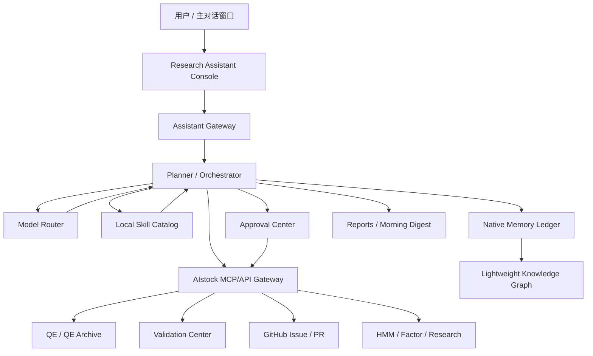
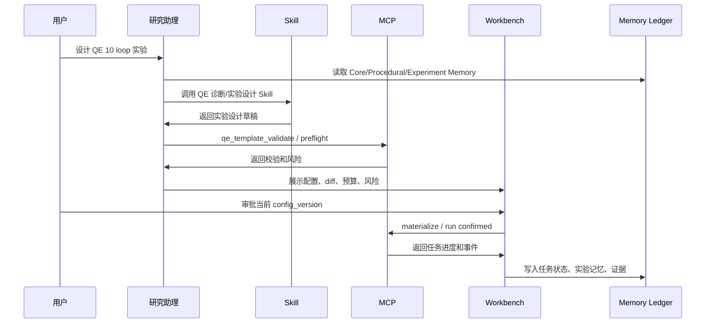
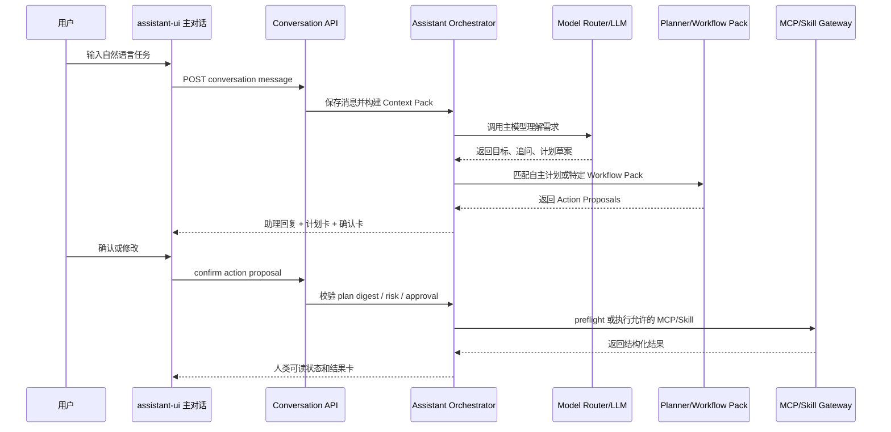

# AIstock 研究与实验综合助理控制台设计方案

> 日期：2026-05-22
> 类型：详细设计方案 v5（对话型主入口纠偏版）
> 状态：正式实施设计稿；本文档定义功能边界、阶段目标和开发验收矩阵，不实现代码
> 分支：`docs/research-assistant-chat-redesign-20260522`
> Worktree：`F:\Dev\AIstock_worktrees\research-assistant-chat-redesign-doc-20260522`
> 范围：研究与实验综合助理、Codex 式对话主入口、assistant-ui 前端基座、左侧图形化任务状态、原生长期记忆、轻量知识图谱、MCP/Skill 能力目录、Workflow Pack + 自主 Planner、多模型调度、Prompt Lab、自我学习闭环、Validation/Pipeline Discovery Stream、External Agent Connector、多模型路由、阶段实施目标和开发验收矩阵
> 非目标：不让该助理控制鼠标键盘，不让该助理编程、改代码、提交代码、合入 main、重启生产服务、绕过 GitHub Issue 审批或执行实盘交易
> ???????? `F:\Dev\AIstock` ? `origin/main = 856b832` ????????? Research Assistant ?? / MCP / ???? / ?????? Phase 1 ?????????????????????????????

---

## 1. 设计结论

AIstock 应建设一个 **研究与实验综合助理控制台**。它不是浏览器点击助手，也不是独立于 AIstock 的另一个 Agent 系统，而是：

> 对话式研究助理 + 原生长期记忆事实源 + MCP/API 执行工作台 + 本地 Skill Catalog + 审批门禁 + 任务/实验/Issue/验证全链路记忆 + 可扩展 UI 控制台。

核心结论：

1. **所有业务操作优先通过 MCP/API 执行**，不控制鼠标键盘，不做页面识别式自动点击。
2. **长期记忆不是 RAG**。RAG/向量检索只能辅助召回，不能作为事实源、规则源、审批源或任务状态源。
3. **长期记忆核心必须由 AIstock 原生自研**。Mem0、Graphiti、LangMem、Letta 等只能作为后续 adapter/PoC/增强能力，不替代 AIstock 原生事实源。
4. **Phase 1 不引入图数据库**。轻量知识图谱先用 AIstock 原生关系表实现；Graphiti/Neo4j/FalkorDB/Kuzu 只作为后续增强候选。
5. **流水线 AI Agent 不再单独设计**。并入研究助理，作为 `Validation / Pipeline Discovery Stream`。
6. **Codex / Claude Code 可以接入助理**，甚至可作为外部主模型，但必须通过 External Agent Connector、MCP、审批、权限和审计，不能绕过风险操作门禁。
7. **多模型路由必须支持成本控制**。国内模型如 DeepSeek、GLM、Qwen、Kimi 可作为 first-class provider；低价模型可写 task-scoped 临时记忆，由主模型审核后提升为长期记忆。
8. **Skill Phase 1 只做本地 Skill Catalog**。不做公共市场、远程安装、多租户、评分发布；未来公共 skill 只能人工筛选、审查、版本锁定后本地导入。
9. **UI 采用 AIstock Console Template**。保留现有 AIstock 左侧导航，研究助理内部使用顶部功能导航、卡片、表格、时间线、抽屉和审批工作台，避免未来驾驶舱扩展时重构。

### 1.1 ???????????

????????????????? AIstock ?????

1. ????? `origin/main = 856b832` ???
2. ?? Research Assistant ???MCP ????????????????????? Phase 1 ???????????????
3. ???? `SectionCard / PaperTable / JsonPanel / DetailDrawer` ??????????? / ?????????????????
4. ???????????????????????????????????????????????????
5. ?????????? `backend/services/research_assistant`?`backend/mcp/modules/research_assistant.py`?`tests/aistock_validation/catalog` ? `frontend/src/app/research-assistant`??????????????????????????

10. **允许分阶段实施，但禁止低完整度交付**。每个纳入阶段的功能都必须按设计完整实现、可验收、可扩展，不能用静态占位、脚本替代或简化版冒充完成。

---

## 2. 用户需求归纳

| 需求 | 设计结论 |
|---|---|
| 一个窗口和智能体交流 | 新增 `/research-assistant/chat` 主对话入口；其他窗口只展示状态 |
| 不控制鼠标键盘 | 所有业务动作走 MCP/API；UI 只做展示、确认和深链 |
| 看到实时进展 | 建立 `agent_task_events`，用 SSE/WebSocket 展示任务和 MCP 调用进展 |
| 创建 QE 多 loop 实验 | 助理生成模板草稿、preflight、配置 diff、审批后调用 MCP 执行 |
| 可讨论和修改配置 | 每次修改生成 config version 和 diff，旧审批自动失效 |
| 确认后执行 | Phase 1 UI 审批；Phase 2 支持对话确认并绑定 plan digest |
| 长期记忆准确可靠 | 结构化 Memory Ledger 为事实源，RAG 仅辅助召回 |
| 记录所有研究进展 | 每个 Research Stream、Task、Experiment、Issue、Validation run 都写入任务账本和记忆 |
| 流水线 AI 探测 | 并入 `Validation / Pipeline Discovery Stream`，不另建独立 Agent |
| Codex / Claude Code 接入 | 通过 External Agent Connector 受控接入，可做外部主模型但不可越权 |
| 低价模型降成本 | 多模型路由；低价模型做摘要、分类、重复任务，并写临时记忆 |
| 支持国内模型 | DeepSeek、GLM、Qwen、Kimi 等作为可配置 provider |
| 语音能力 | Phase 1 只预留；Phase 2/3 优先托管 Realtime 试点，保留本地 STT/TTS |
| 外部搜索 | 中文搜索优先评估博查/秘塔/SearXNG；Firecrawl 降级为高质量抓取备用 |
| UI 可扩展 | 控制台模板 + 顶部功能导航 + 卡片/表格/抽屉，后续驾驶舱不重构数据层 |

---

## 3. 总体架构



核心模块：

| 模块 | 职责 |
|---|---|
| Assistant Gateway | 统一接入 Web UI、未来语音/IM、Codex/Claude Connector |
| Planner / Orchestrator | 生成计划、选择 Skill/MCP/模型、控制任务状态机 |
| Model Router | 多模型路由、成本预算、风险等级、fallback |
| Native Memory Ledger | 原生长期记忆事实源，非 RAG |
| Lightweight Knowledge Graph | 模块、任务、实验、Issue、论文证据之间的关系 |
| MCP/API Gateway | 调用 AIstock 后端、MCP server、Validation、GitHub、QE |
| Local Skill Catalog | 本地专业能力目录，提供 QE/因子/实验诊断等方法能力 |
| Approval Center | L2+ 操作审批、配置版本、plan digest、风险确认 |
| Workbench | MCP 执行进度、配置预览、diff、日志、深链 |
| Reports | 晨报、实验报告、候选 Issue 报告、审计报告 |

---

## 4. 长期记忆核心架构

### 4.1 设计原则

1. **原生事实源**：AIstock 数据库是长期记忆唯一事实源。
2. **非 RAG**：RAG/向量检索只做辅助召回，不决定事实。
3. **结构化优先**：任务、审批、Issue、实验、验证、用户规则必须结构化存储。
4. **证据绑定**：关键结论必须有 `source_ref` 或 `evidence_refs`。
5. **审批治理**：Core/Procedural/Architecture 记忆必须可审批、废弃、替代。
6. **可回放**：每次助理回答和执行都能回放 Context Pack。
7. **可迁移**：支持 JSONL/Markdown/Parquet 导出，外部工具只通过 adapter 接入。

### 4.2 记忆分层

| 层级 | 名称 | 内容 | 写入方式 | 加载策略 |
|---|---|---|---|---|
| L0 | Core Memory | 助理身份、用户硬规则、生产边界 | 用户确认/标准文档 | 每次必载 |
| L1 | Procedural Memory | Issue 流程、验证门禁、工作规范 | 审批后写入 | 按任务类型必载 |
| L2 | Architecture Memory | 模块边界、MCP、API、DB、UI route | 文档/代码扫描 + 审核 | 按模块加载 |
| L3 | Roadmap Memory | 长期规划、阶段目标、研究方向 | 用户确认 | 规划时加载 |
| L4 | Task State Memory | 任务状态、阻塞、下一步 | 自动写入 | 绑定 task/stream |
| L5 | Experiment Memory | QE/HMM/因子实验配置、结果、失败经验 | 自动写入 + 审核 | 相似实验检索 |
| L6 | Episodic Memory | 对话、MCP 调用、日志摘要 | 自动写入 | 按需追溯 |
| L7 | External Evidence | 搜索、论文、网页、新闻、工具资料 | evidence 入库 | 结论需审核 |
| L8 | Personal Agenda | 用户个人事项、提醒、晨报 | 用户确认/任务生成 | 今日事项加载 |

### 4.3 Memory Ledger 数据模型

```text
research_memory_items
  id
  memory_type                -- core / procedural / architecture / roadmap / task_state / experiment / episodic / external / agenda
  namespace                  -- personal / aistock / project / module / stream / task / experiment / tool
  subject_key
  title
  content_json
  content_text
  source_type                -- conversation / mcp_result / doc_scan / validation_run / github_issue / web_search / manual
  source_ref
  source_timestamp
  confidence
  approval_status            -- draft / approved / rejected / expired / superseded
  risk_level                 -- low / medium / high / production_sensitive
  valid_from
  valid_to
  supersedes_id
  created_by
  approved_by
  checksum
  created_at
  updated_at

research_memory_access_log
  id
  memory_id
  task_id
  stream_id
  agent_id
  retrieval_reason
  used_in_prompt
  used_in_report
  retrieved_at
```

### 4.4 长期记忆不是 RAG

不允许的架构：

```text
把对话和文档切 chunk -> embedding -> 查询时向量召回 -> 让 LLM 判断事实
```

正确架构：

```text
Memory Ledger（事实源）
  - research_memory_items
  - research_memory_entities
  - research_memory_relations
  - research_evolution_paths
  - assistant_approval_requests
  - agent_tasks / agent_task_events
  - issue_candidates / GitHub sync records
  - source evidence tables

Retrieval Layer（辅助）
  - full-text search
  - vector search
  - graph traversal
  - time filter
  - module/task/stream scope filter
  - rerank

Context Pack Builder（确定性装配）
  - 必载 Core/Procedural 硬规则
  - approval_status 过滤
  - valid_from / valid_to 过滤
  - supersedes / contradicts 处理
  - source_ref / evidence_refs 绑定
  - omitted_relevant_refs 记录
```

| 事实类型 | 事实源 | 是否允许 RAG 决定 |
|---|---|---|
| 用户硬规则、生产边界 | approved Core/Procedural Memory | 不允许 |
| GitHub Issue 状态 | GitHub API + 本地同步记录 | 不允许 |
| QE/HMM/因子实验状态 | QE Archive / Task Ledger | 不允许 |
| 验证结果 | Validation Center | 不允许 |
| 审批状态 | Approval table | 不允许 |
| 模块依赖 | 原生轻量图谱 + source refs | RAG 仅辅助查说明 |
| 历史对话经验 | Memory Ledger + evidence | 可辅助召回，不能直接定论 |
| 外部论文/网页资料 | evidence table | 可辅助召回，结论需审核 |
| 相似实验经验 | Experiment Memory + graph relation | 可辅助候选召回，最终引用结构化记录 |

### 4.5 Context Pack

```text
assistant_context_packs
  id
  task_id
  agent_id
  model_profile
  token_budget
  core_memory_refs
  procedural_memory_refs
  architecture_memory_refs
  task_state_refs
  experiment_memory_refs
  graph_relation_refs
  external_source_refs
  temp_memory_refs
  omitted_relevant_refs
  pack_summary
  created_at
```

Context Pack 必须可回放：未来换模型后，也能知道当时助理基于哪些记忆、证据和规则做出判断。

---

## 5. 轻量知识图谱

### 5.1 Phase 1 不引入图数据库

Phase 1 不引入 Neo4j、FalkorDB、Kuzu、Amazon Neptune 或其他图数据库。原因：

1. 当前瓶颈是事实源、审批、证据和任务回放，不是图查询性能。
2. 新增图数据库会带来部署、备份、权限、健康检查和迁移成本。
3. 图谱质量控制比图数据库能力更关键。
4. 后续可把原生图谱镜像到 Graphiti，而不是反向依赖外部图引擎。

### 5.2 图谱数据模型

```text
research_memory_entities
  id
  entity_type              -- module / mcp_tool / skill / db_table / ui_route / experiment / factor / model / paper / issue / task / goal
  entity_key
  title
  summary
  namespace
  source_refs
  confidence
  approval_status
  valid_from
  valid_to
  created_at
  updated_at

research_memory_relations
  id
  source_entity_id
  target_entity_id
  relation_type            -- depends_on / exposes / reads / writes / validates / fixes / derived_from / supports / contradicts / next_candidate
  evidence_refs
  confidence
  approval_status
  valid_from
  valid_to
  created_at
  updated_at

research_evolution_paths
  id
  stream_id
  objective
  current_best_entity_id
  rejected_entities_json
  next_candidate_entities_json
  supporting_paper_refs
  decision_notes
  updated_at
```

### 5.3 Graphiti PoC 策略

Phase 2 Graphiti PoC 已确认：

1. 优先只读镜像 AIstock 原生图谱核心实体关系。
2. 只读镜像实体：module、mcp_tool、skill、experiment、issue、validation_run、PR、branch。
3. 只读镜像关系：exposes、requires、derived_from、blocks、fixes、verifies、supports。
4. 论文/外部资料图谱作为补充，不作为首要 PoC。
5. Graphiti 不回写 approved memory，不替代原生图谱。
6. PoC 失败可以直接移除，不影响 AIstock 主系统。

---

## 6. 外部长期记忆工具策略

长期记忆最终选型：**AIstock 原生事实源自研 + 外部工具 adapter 增强**。

| 工具 | 可借鉴优点 | 不直接作为核心事实源的限制 |
|---|---|---|
| Mem0 | 自托管记忆服务、API、metadata filtering、reranker、dashboard、用户/Agent/session 记忆模型 | 偏通用对话/偏好记忆，不天然掌握 AIstock 任务账本、审批门禁、GitHub 强同步、实验谱系和生产边界 |
| Graphiti | temporal knowledge graph、事实有效期、episode/provenance、hybrid retrieval、自定义 ontology | 需要图后端和图谱质量控制；LLM 抽取关系不能直接成为生产级架构事实 |
| LangMem | semantic/episodic/procedural memory、hot path/background memory formation、namespace | 更适合作为 Agent memory primitive，不是 AIstock 领域事实库和审批系统 |
| Letta | stateful agent、memory blocks、shared memory、runs/steps、tools/MCP/human-in-the-loop | 更像 Agent runtime；如果接管任务编排和记忆写入，会削弱 AIstock 原生治理边界 |

Adapter 原则：

1. 外部工具只做增强检索、图谱增强、用户偏好增强、迁移验证或效果对照。
2. 外部工具不得直接写入 approved 记忆。
3. 外部工具输出必须进入 `memory_candidate` 或 `assistant_temp_memories`。
4. 外部 adapter 故障不能影响原生任务账本、审批、Issue 状态、实验谱系和核心规则。

---

## 6A. 对话智能、Capability Registry、Prompt Pack 与工作流边界

### 6A.1 助理不是固定工作流机器人

研究助理必须具备自主分析能力，不能只能按预设工作流机械执行。正确边界是：

1. **自主 Planner 是默认入口**：任何自然语言请求先由主模型结合 Context Pack、Capability Registry 和长期记忆进行理解、拆解、追问和计划生成。
2. **Workflow Pack 是安全护栏和高频模板**：QE 实验创建、GitHub Issue 入库、Validation 执行、候选 Issue 审核等高风险或高频任务使用工作流包约束顺序、确认点和风险边界。
3. **Planner 可以组合多个 Workflow Pack**：例如“分析 QE 结果并提出新实验”可以组合 QE 诊断 Skill、QE Archive 查询、QE Template 创建和审批流程。
4. **未知任务不能强行套工作流**：若没有匹配工作流，助理应先说明不确定性、提出澄清问题、给出只读/低风险探索计划。
5. **高风险动作必须落到工作流门禁**：自主分析不能绕过 MCP preflight、approval、plan digest、risk policy 和 trace。

因此，AIstock 采用 **自主 Planner + 可选 Workflow Pack + 强制安全门禁**，而不是纯工作流系统。

### 6A.2 是否必须引入外部工作流引擎

Phase 1 修复版不必须引入 Temporal、LangGraph、Dify、Flowise 或其他外部工作流引擎。

原因：

1. 当前关键缺口是对话主入口、LLM 调用、能力目录、提示词和人类可读状态，不是分布式工作流调度。
2. 外部工作流引擎会增加部署、状态一致性、回滚和权限边界复杂度。
3. AIstock 已经有任务表、事件表、审批表、Trace 表和 MCP 服务，可以先实现原生轻量状态机。
4. 后续 Phase 3 可以评估 Temporal 或 LangGraph，但只能作为执行编排增强，不替代 AIstock 原生事实源和审批门禁。

Phase 1 必须实现的是：

```text
Conversation -> Planner -> Action Proposal -> Confirmation -> Preflight -> MCP/Skill -> Trace -> Human Report
```

而不是引入大型工作流引擎。

### 6A.3 Capability Registry

助理必须通过能力目录知道自己能做什么。Capability Registry 包含：

```text
assistant_capabilities
  capability_key              -- qe.create_experiment / qe.analyze_result / validation.run / issue.create_candidate
  capability_type             -- mcp_tool / skill / workflow_pack / composite
  title
  natural_language_triggers
  description_for_llm
  risk_level
  required_confirmations
  preferred_model_role
  input_slots
  output_cards
  mcp_tool_refs
  skill_refs
  workflow_pack_ref
  status
  source_ref
  checksum
```

Phase 1 修复版至少要覆盖：

| 能力 | 类型 | 说明 |
|---|---|---|
| `qe.create_experiment_draft` | workflow_pack | 根据自然语言生成 QE 实验草案，不执行 |
| `qe.validate_template` | mcp_tool | 调用 QE template validate |
| `qe.materialize_template` | mcp_tool | 需要二次确认后 materialize |
| `qe.run_experiment` | mcp_tool | 高风险/高成本，必须单独确认 |
| `qe.analyze_result` | skill | 调用 QE 诊断 skill |
| `validation.run_plan` | mcp_tool | 运行验证计划 |
| `issue.create_candidate` | workflow_pack | 只创建候选 Issue，不直接入 GitHub |
| `issue.sync_github` | mcp_tool | 正式 GitHub 同步，必须人工确认 |
| `memory.write_candidate` | workflow_pack | 写临时/候选记忆，不直接 approved |
| `factor.analyze_library` | skill | 因子库分析 |
| `rdagent.analyze_task` | skill | RDAgent 任务分析 |

### 6A.4 MCP/Skill 覆盖策略

当前实现只 seed 少量 MCP/Skill，不能满足助理自主选择工具。Phase 1 修复版必须增加能力同步：

1. 从 AIstock 已注册 MCP server 拉取工具清单，写入 `assistant_mcp_tools`。
2. 从本地 Codex Skill 目录或 AIstock skill registry 拉取可用 Skill，写入 `assistant_skill_registry`。
3. 将 MCP/Skill 转换为 LLM 可读 tool catalog，包含中文说明、适用场景、风险等级、输入槽位、确认要求。
4. 对业务任务建立 intent/capability 映射，不能只依赖模型猜测。
5. 工具目录变化必须有 checksum 和同步时间，避免使用过期工具。

### 6A.5 Prompt Pack

必须新增 Research Assistant Prompt Pack。提示词不能散落在前端或临时代码中，必须版本化、可审计、可测试。

| Prompt | 作用 | 必须包含 |
|---|---|---|
| `assistant_system_v1` | 助理身份和硬边界 | 中文、MCP/API first、禁止越权、禁止显示 JSON、确认后执行 |
| `intent_router_v1` | 意图识别 | 任务类型、风险等级、所需能力、待确认槽位 |
| `tool_planner_v1` | 工具选择 | MCP/Skill 使用规则、工作流匹配、未知任务处理 |
| `qe_experiment_planner_v1` | QE 实验创建 | 固定回测/股票池规则、模板草案、validate、materialize/run 二次确认 |
| `clarification_v1` | 澄清问题 | 只问必要问题，不输出技术字段 |
| `result_renderer_v1` | 结果汇报 | 人类可读、失败原因、下一步、审计链接 |
| `memory_candidate_v1` | 记忆候选 | 不直接 approved，证据绑定，用户确认 |


### 6A.5.1 树型提示词结构

Prompt Pack 必须采用树型结构，而不是把所有提示词拼成一个大 system prompt。根节点是全局主提示词，后续根据用户命令、意图、风险等级、候选能力、MCP/Skill 工具和执行阶段逐层选择。

这里的“树型”不是指每次只能走一条固定分支，而是指：

1. **存储结构是树**：每个提示词节点只有一个主父节点，便于版本管理、权限控制、审计和缓存失效。
2. **运行时可以装配成提示词集合**：跨模块任务可同时加载多个分支，形成一个有序的 prompt bundle。
3. **安全边界始终优先**：无论选择多少业务分支，`assistant_root`、`governance`、`execution_guard` 等基础分支必须先装配。
4. **树与集合的职责分离**：数据库里保留树和边；运行时装配器负责把多个分支拼成当前阶段所需的最小充分集合。

~~~text
assistant_root
  ├─ governance
  │   ├─ production_safety
  │   ├─ github_issue_sync
  │   └─ no_simplified_delivery
  ├─ intent_router
  │   ├─ qe
  │   │   ├─ create_experiment
  │   │   │   ├─ template_create
  │   │   │   ├─ template_validate
  │   │   │   ├─ materialize_guard
  │   │   │   └─ run_guard
  │   │   ├─ analyze_result
  │   │   └─ archive_query
  │   ├─ validation
  │   │   ├─ run_plan
  │   │   └─ issue_candidate_review
  │   ├─ github_issue
  │   │   ├─ create_candidate
  │   │   └─ sync_formal_issue
  │   ├─ factor_research
  │   │   ├─ analyze_library
  │   │   └─ develop_factor_plan
  │   ├─ rdagent
  │   └─ stock_analysis
  ├─ capability_selector
  ├─ execution_guard
  └─ result_renderer
~~~

根提示词每次必载；子树按需加载。任何子树都必须有父子关系、触发条件、风险等级、适用工具、版本号、checksum 和状态。

### 6A.5.2 多分支加载

复杂任务可能同时命中多个分支，不能只选择单一路径。例如：

~~~text
用户：分析最近 QE 实验结果，基于结果创建一个新的 10 loop 实验草案，如果发现平台 bug 就生成候选 Issue。
~~~

需要同时加载：

1. qe.analyze_result 分支；
2. qe.create_experiment 分支；
3. issue.create_candidate 分支；
4. memory.write_candidate 分支；
5. 对应的 execution guard 和 result renderer。

多分支加载规则：

| 场景 | 加载策略 |
|---|---|
| 单模块低风险任务 | 根提示词 + governance 摘要 + intent + 对应 capability 分支 |
| 单模块高风险任务 | 额外加载 execution guard、approval、risk policy |
| 跨模块任务 | 加载多个 capability/workflow 分支，并生成组合计划 |
| 工具执行阶段 | 只加载即将调用工具的 tool prompt 和 guard prompt |
| 结果汇报阶段 | 卸载执行提示词，加载 result renderer 和必要业务摘要 |
| 不确定意图 | 只加载根提示词、intent router、澄清提示词，不加载具体工具长提示词 |

### 6A.5.3 Prompt Registry 数据模型

提示词必须固化到数据库中，数据库是事实源。文件缓存只能用于访问效率，不能成为事实源。

~~~text
assistant_prompt_nodes
  prompt_id
  prompt_key                 -- assistant.root / qe.create_experiment / qe.template_validate
  parent_prompt_id
  tree_path                  -- assistant.root/qe/create_experiment/template_validate
  version
  layer                      -- root / governance / intent / capability / workflow / tool / guard / renderer
  title
  description
  content_md
  trigger_type               -- always / intent / capability / mcp_tool / skill / workflow / risk / phase
  trigger_refs               -- JSON array
  capability_refs            -- JSON array
  mcp_tool_refs              -- JSON array
  skill_refs                 -- JSON array
  risk_level
  token_budget
  priority
  conflict_group
  status                     -- draft / approved / deprecated / blocked
  checksum
  created_at
  updated_at

assistant_prompt_edges
  edge_id
  parent_prompt_id
  child_prompt_id
  condition_json             -- 命中条件、风险条件、阶段条件
  load_mode                  -- required / optional / exclusive / fallback
  priority
  status

assistant_prompt_cache_files
  cache_id
  prompt_id
  version
  checksum
  cache_path
  rendered_for               -- model profile / locale / compact mode
  generated_at
  expires_at
  status

assistant_prompt_selection_traces
  trace_id
  conversation_id
  task_id
  user_message_digest
  selected_prompt_refs
  rejected_prompt_refs
  selection_reason_json
  token_estimate
  cache_hits
  created_at
~~~

约束：

1. approved 状态的提示词才能进入生产对话装配。
2. 每次装配必须记录 assistant_prompt_selection_traces。
3. 文件缓存必须包含 checksum；缓存 checksum 与数据库不一致时必须废弃。
4. 提示词更新后必须使相关缓存失效。
5. 禁止前端硬编码生产提示词。

### 6A.5.4 Prompt Tree Selector 算法

Prompt Tree Selector 负责从树中选择最小但足够的提示词集合。目标是：准确、可解释、低 token、支持跨模块。

输入：

~~~text
user_message
conversation_state
context_pack_summary
capability_registry
available_mcp_tools
available_skills
risk_policy
model_profile
~~~

输出：

~~~text
selected_prompt_nodes
selected_capabilities
selected_workflow_packs
token_estimate
selection_reason
missing_clarifications
~~~

算法步骤：

1. 必载根节点：加载 assistant.root、全局安全边界、用户硬规则摘要。
2. 轻量意图路由：使用短 prompt 判断候选意图、风险等级、模块范围和是否跨模块。
3. 候选能力召回：基于 intent、关键词、Capability Registry、MCP/Skill 标签召回 Top-K 能力。
4. 分支评分：对每个候选 prompt branch 计算分数。

~~~text
score = intent_match * 0.35
      + capability_match * 0.25
      + tool_match * 0.15
      + risk_relevance * 0.10
      + historical_success * 0.05
      + user_context_match * 0.05
      - token_cost_penalty * 0.05
~~~

5. 父子闭包补齐：对所有命中的分支自动补齐祖先节点，确保 root/governance/intent 等上层约束完整加载。
6. 多分支合并：保留所有超过阈值的分支；跨模块任务允许多个分支同时加载；如果多个分支分别属于不同模块，只要都满足阈值，就都进入 bundle。
7. 冲突消解：同一 conflict_group 中选择最高优先级或最新 approved 版本；生产安全类提示词不可被覆盖。
8. token 预算裁剪：保留 root/governance/guard，压缩低优先级说明，必要时只加载 capability summary。
9. 阶段化再装配：计划阶段、执行前、执行中、结果汇报阶段分别重新装配提示词，避免一次加载全部。
10. 记录选择 trace：保存选中和未选中的 prompt、原因、token 估算、缓存命中。
11. 生成 bundle signature：将当前阶段的 prompt 选择集合、版本、checksum、model profile、locale、stage 合成为 bundle signature，作为文件缓存键和审计键。

### 6A.5.5 文件缓存策略

提示词固化在数据库中，但允许生成文件缓存提升访问效率。

缓存原则：

1. 数据库是事实源，文件缓存只读加速。
2. 缓存文件按 prompt tree path、version、checksum、model profile、压缩模式生成。
3. 常用组合可以生成 bundle cache，例如：
   - bundle/assistant_root_zh.md
   - bundle/qe_create_experiment_deepseek.md
   - bundle/github_issue_sync_guard.md
4. 服务启动时可预热 root/governance/常用 QE bundle。
5. prompt 更新、状态变化、checksum 变化时必须失效对应缓存。
6. selection trace 必须记录 cache hit/miss。
7. 文件缓存仅允许由数据库派生生成，禁止手工编辑后回写为事实源。
8. 生成 bundle cache 时必须按 `bundle_signature` 读取缓存；`bundle_signature` 一致则可直接复用，不一致则重新从数据库装配。
9. 缓存命中不得改变 prompt 选择结果，最多只能缩短装配时间。

推荐缓存路径：

~~~text
runtime_cache/research_assistant/prompts/
  root/
  governance/
  qe/
  validation/
  github_issue/
  bundles/
~~~

这些缓存不得提交到 git，必须加入 .gitignore。

### 6A.5.6 QE MCP 分层加载示例

用户输入：

~~~text
帮我创建一个 QE 10 loop 实验，先不要执行。
~~~

装配阶段：

| 阶段 | 加载提示词 |
|---|---|
| 初始理解 | assistant.root、governance.production_safety、intent_router |
| 命中 QE | capability.qe.summary、workflow.qe.create_experiment |
| 生成草案 | tool_planner.qe_mcp、renderer.experiment_draft |
| 用户确认 create/validate | tool.qe_template_create、tool.qe_template_validate、guard.qe_template_write |
| 用户确认 materialize | tool.qe_template_materialize_confirmed、guard.qe_materialize |
| 用户确认 run | tool.qe_template_run_confirmed、guard.qe_run |
| 结果汇报 | renderer.qe_validate_result、renderer.qe_run_status |

不会加载：股票分析、HMM 深度演进、GitHub Issue 正式同步、外部搜索等无关分支。

### 6A.5.7 验收要求

Prompt Tree 必须通过以下验收：

1. 固化到数据库，有版本、状态、checksum、父子关系。
2. 能为 QE 创建任务选择 QE 分支，不加载无关股票分析/GitHub 正式同步分支。
3. 跨模块任务能同时加载 QE + Issue + Memory 等多个分支。
4. 执行前能追加对应 tool guard。
5. 结果汇报能切换到 renderer prompt，且默认不输出 JSON。
6. selection trace 可回放每次提示词选择。
7. 文件缓存命中不改变选择结果；缓存失效后能从数据库重新生成。

### 6A.6 QE Experiment Workflow Pack

“创建 QE 实验”是 Phase 1 修复版的强制验收场景。Workflow Pack 必须定义：

```text
intent: qe.create_experiment
triggers:
  - 创建 QE 实验
  - QE 10 loop
  - 实验模板
  - 回测实验
  - 模型演进实验

steps:
  1. 理解实验目标和边界
  2. 读取 QE MCP/Skill 能力目录
  3. 读取相关记忆和固定业务规则
  4. 向用户确认 loop 数、回测窗口、股票池、模板来源、是否只生成草案
  5. 生成实验草案卡
  6. 用户确认后创建/校验 template
  7. 展示 validate 结果和配置摘要
  8. 用户二次确认后 materialize
  9. 用户再次确认后 run
  10. 轮询状态并汇报结果

guards:
  - 未确认不得 materialize
  - 未二次确认不得 run
  - 股票池/回测窗口规则必须来自 approved Memory 或 QE 配置
  - 失败时必须给出人类可读原因和下一步
```

### 6A.7 主模型和次模型

Phase 1 修复版必须实现真实模型调用（真实 LLM 调用），而不是只存 model profile。

| 模型角色 | 用途 | 写记忆权限 |
|---|---|---|
| 主模型 primary_reasoner | 用户对话、需求理解、高风险计划、最终回复 | 可写候选长期记忆，不能直接 approved |
| 次模型 cheap_worker | 日志摘要、低风险分类、格式化、批量摘要 | 只能写 temp memory |
| 长上下文模型 long_context | 大文档、长日志、研究资料归纳 | 只能写 temp memory 或候选记忆 |
| 外部主模型 external_agent | Codex/Claude 受控接入 | 通过 External Agent Connector 写入 |

必须提供：

1. 模型配置读取。
2. OpenAI-compatible/LiteLLM 调用 client。
3. 主模型/次模型选择 UI。
4. 对话消息必须触发真实 LLM completion，不能只创建任务或返回静态文本。
5. fallback 策略。
6. token、耗时、成本 trace。
7. 低价模型结果进入 temp memory，主模型审核后才能提升。


### 6A.8 多模型调度、次模型提示词与 Prompt Lab

AIstock 助理采用“主模型监督 + 次模型执行子任务 + Prompt Tree 动态装配 + Prompt Lab 离线优化”的设计。多模型调度不是简单 fallback，而是由主模型在权限边界内分配工作，并由系统记录每次提示词和模型选择的证据。

#### 6A.8.1 模型角色

| 角色 | 责任 | 允许动作 | 禁止动作 |
|---|---|---|---|
| `primary_orchestrator` | 用户对话、意图理解、任务拆解、风险判断、最终结论、用户确认 | 读取长期记忆、生成计划、调度次模型、提交候选记忆 | 绕过审批直接执行高风险 MCP |
| `secondary_worker` | 摘要、日志分析、资料初筛、草案生成、批量解释、低风险分类 | 写 task-scoped temp memory、返回结构化 WorkerResult | 直接面向用户给最终结论；直接写 approved 长期记忆 |
| `verifier_critic` | 复核次模型输出、检查遗漏、检查是否违反规则 | 生成风险/遗漏/纠错建议 | 直接执行 MCP；替代主模型确认 |
| `router_model` | 低成本意图初筛、prompt branch 候选召回、模型路由建议 | 输出候选分支和置信度 | 最终决定高风险执行 |
| `long_context_reader` | 长日志、论文、设计文档、实验报告归纳 | 输出证据绑定摘要 | 无证据地改写事实源 |

Phase 1 修复版必须支持主/次模型真实调用和 trace；次模型可以配置为 DeepSeek、GLM、Qwen、Kimi 或本地模型，但所有结果必须进入结构化审计链。

#### 6A.8.2 次模型提示词分层

同一业务分支必须按模型角色拆分提示词，不能让主模型和次模型共用一段大提示词。

~~~text
qe.create_experiment
  ├─ primary_planner_prompt          -- 面向主模型：理解需求、风险、确认点、最终计划
  ├─ secondary_draft_prompt          -- 面向次模型：生成初始 loop/因子/参数草案
  ├─ secondary_config_checker_prompt -- 面向次模型：检查字段完整性、固定回测规则、股票池规则
  ├─ verifier_prompt                 -- 面向 verifier：检查是否遗漏确认、是否违反 QE 固定规则
  ├─ renderer_prompt                 -- 面向结果渲染：人类可读配置卡、确认卡、失败卡
  └─ guard_prompt                    -- 面向执行前门禁：materialize/run/写库/GitHub 同步
~~~

提示词装配必须同时考虑：任务意图、模型角色、执行阶段、风险等级、可用工具和 token 预算。

#### 6A.8.3 主模型调度次模型流程

~~~text
用户输入
  -> 主模型理解任务
  -> Prompt Tree Selector 选择主提示词 bundle
  -> Delegation Planner 判断可委派子任务
  -> 为每个次模型生成最小 Context Pack + role-specific prompt bundle
  -> 次模型执行并返回 WorkerResult
  -> schema 校验和 verifier 复核
  -> 主模型合并、纠偏、生成对用户可读计划
  -> 用户确认
  -> MCP/Skill 执行
  -> 主模型汇报和写入候选记忆
~~~

强制约束：

1. 次模型不得直接调用高风险 MCP；只能通过主模型生成的 action proposal 进入审批。
2. 次模型不得直接写 approved 长期记忆；只能写 temp memory 或 candidate memory。
3. 次模型不得直接生成最终用户结论；最终答复必须由主模型合并和复核。
4. 次模型输出必须使用结构化 `WorkerResult`，schema 校验失败必须重试、降级或升级到主模型。
5. 主模型和次模型之间必须优先使用 JSON/Schema 通信，尽量少使用自由自然语言；自然语言只能作为摘要或证据说明，不能作为执行参数或事实源。
6. 主模型必须记录每个委派任务的 prompt bundle signature、模型、输入摘要、输出摘要、置信度、采纳/拒绝原因。

推荐 `WorkerResult`：

~~~text
assistant_worker_results
  result_id
  conversation_id
  task_id
  worker_role
  model_profile_id
  prompt_bundle_signature
  input_context_digest
  confidence
  summary_for_user
  findings_json
  proposed_actions_json
  missing_information_json
  evidence_refs
  risks_json
  schema_valid
  accepted_by_primary
  primary_review_note
  created_at
~~~

#### 6A.8.4 模型路由与 Prompt 选择联合决策

Model Router 和 Prompt Tree Selector 必须联合决策，不能先固定模型再随意拼提示词，也不能先固定提示词再随意选择模型。

~~~text
route_score =
    task_complexity_match
  + domain_expertise_match
  + prompt_branch_fit
  + historical_quality
  + schema_success_rate
  + latency_fit
  - cost_penalty
  - risk_penalty
~~~

示例：

| 任务 | 模型策略 | Prompt 策略 |
|---|---|---|
| 后端日志摘要 | 次模型执行，主模型复核是否为 Bug | `log_summarizer` + `error_chain_extractor` |
| 创建 QE 10 loop 草案 | 主模型规划，次模型生成草案，verifier 检查，主模型确认 | `qe.create_experiment` + `qe.stock_pool_rule` + `qe.template_guard` |
| QE materialize/run | 主模型直接处理，次模型只可解释配置 | `qe.materialize_guard` / `qe.run_guard` |
| HMM 演进研究 | 主模型制定方向，次模型批量总结实验和论文 | `hmm.research_planner` + `experiment_lineage` + `paper_summary` |
| 因子研发方向 | 主模型综合历史 IC/RankIC/OOS，次模型整理候选因子文献 | `factor.research_planner` + `factor_library_analysis` |

#### 6A.8.5 Prompt Lab

Prompt Lab 用于让提示词体系持续进化，但生产提示词不能在线自动变异。它只产生候选版本、评估报告和发布建议。

数据模型建议：

~~~text
assistant_prompt_variants
  variant_id
  prompt_id
  version
  content_md
  source_type          -- human / llm_candidate / optimizer / rollback
  status               -- draft / evaluating / release_candidate / approved / rejected
  checksum
  created_by
  created_at

assistant_prompt_eval_cases
  case_id
  case_key
  task_type
  user_input
  expected_behavior_md
  required_capabilities_json
  forbidden_behaviors_json
  evidence_refs
  status

assistant_prompt_eval_runs
  run_id
  case_id
  variant_id
  model_profile_id
  prompt_bundle_signature
  output_digest
  metric_json
  judge_notes
  passed
  created_at

assistant_prompt_release_candidates
  release_id
  prompt_id
  variant_id
  baseline_version
  eval_summary_json
  risk_review_json
  approval_status
  approved_by
  released_at
~~~

Prompt Lab 支持四种实验方式：

1. **离线回放**：使用历史对话、历史 QE 请求、历史 Bug 归因和历史实验记录测试候选提示词。
2. **Shadow 测试**：生产仍使用 approved prompt，候选 prompt 后台生成结果，不影响用户和 MCP 执行。
3. **低风险 A/B**：仅用于摘要、解释、资料整理等低风险任务，不用于审批、执行、GitHub 同步或记忆 approved。
4. **人工评分**：用户、Codex、Claude Code 或主模型对候选结果评分，但发布必须走审批。

评估指标：

| 指标 | 含义 |
|---|---|
| `intent_accuracy` | 意图识别是否正确 |
| `tool_selection_accuracy` | MCP/Skill 选择是否正确 |
| `clarification_quality` | 澄清问题是否必要且简洁 |
| `guard_compliance` | 是否遵守审批、生产安全、无 JSON 主入口等规则 |
| `human_correction_rate` | 用户修改或否定的比例 |
| `schema_valid_rate` | 结构化输出通过率 |
| `task_success_rate` | 任务最终完成率 |
| `cost_per_success` | 单次成功任务成本 |
| `latency_p95` | 95 分位延迟 |

禁止事项：

1. 禁止安全/审批/执行类 guard prompt 自动发布。
2. 禁止候选 prompt 未经审批进入生产。
3. 禁止次模型实验结果绕过主模型复核。
4. 禁止用线上高风险 MCP 执行结果作为无审批 prompt 实验。

### 6A.9 自我学习闭环：记忆、反思、评估和提示词优化

AIstock 助理的“自我学习”不定义为模型权重在线训练，也不允许自己静默修改生产规则。Phase 1/2 的自我学习定义为：基于长期记忆事实源、任务结果、用户反馈、实验指标和 Prompt Lab 评估，持续沉淀可审计知识，并向用户提出记忆更新、研究方向和提示词优化建议。

#### 6A.9.1 自我学习边界

| 可以学习 | 学习方式 | 是否需要确认 |
|---|---|---|
| 用户工作风格、偏好、禁忌 | candidate memory + 证据 + 用户确认 | 重要偏好需要确认 |
| 常见操作流程和准确性问题 | procedural memory + task outcome | 高影响流程需要确认 |
| QE/HMM/因子研究进展 | experiment memory + hypothesis memory + lineage | 研究结论入库需要确认 |
| MCP/Skill 使用成功率 | trace 自动统计 | 不需要逐条确认，但需可审计 |
| 提示词缺陷和优化建议 | Prompt Lab candidate + eval report | 发布需要确认 |
| 每日待办、提醒、关注事项 | task memory + notification rule | 需要用户授权或明确指令 |

不允许：

1. 不允许基于单次对话直接改写核心规则。
2. 不允许用 RAG 检索结果替代 Memory Ledger 事实源。
3. 不允许次模型直接形成长期结论。
4. 不允许自动把研究假设当成已验证结论。
5. 不允许为了“学习”而自动执行高成本或高风险实验。

#### 6A.9.2 学习数据来源

~~~text
用户对话和确认/拒绝
任务计划、审批、执行结果
MCP/Skill trace
Validation/Pipeline 结果
GitHub Issue 生命周期
QE/HMM/因子实验指标和失败原因
用户对输出的修改、否定、补充
每日/每周复盘
外部论文、搜索证据和人工标注
~~~

这些数据先进入事件和候选层，只有经过置信度、证据、冲突检查和必要审批后，才进入长期记忆事实源。

#### 6A.9.3 学习记忆类型

| 记忆类型 | 示例 | 生命周期 |
|---|---|---|
| `user_preference` | 用户要求所有设计方案必须中文；禁止简化版；MCP/API first | 长期，支持 supersedes |
| `operation_pattern` | 用户通常希望先看分析，再决定是否合入 main | 长期，可被新规则覆盖 |
| `procedural_rule` | 创建 BUG 必须同步 GitHub；QE run 必须二次确认 | 长期，高优先级 |
| `research_hypothesis` | HMM 某演进方向可能提升换手控制 | 候选/验证中/已否决/已采纳 |
| `experiment_lineage` | QE loop 设计、指标、失败原因、下一步 | 长期，按实验链路组织 |
| `factor_insight` | 某类因子在 OOS 下不稳定，后续降权 | 长期或阶段有效 |
| `prompt_feedback` | 某提示词导致输出 JSON，应拆分 renderer prompt | 候选，进入 Prompt Lab |
| `tool_success_pattern` | 某 MCP 工具组合在 QE 创建中成功率高 | 统计型，可自动更新但需审计 |

#### 6A.9.4 自我学习流程

~~~text
Observe
  -> 从对话、任务、MCP、实验、Issue、验证中收集证据
Reflect
  -> 主模型或 verifier 生成候选反思和学习点
Validate
  -> 检查证据、冲突、置信度、适用范围、过期条件
Approve
  -> 需要用户/主模型/Codex 审核的进入审批
Store
  -> 写入 Memory Ledger、Experiment Lineage、Prompt Lab 或 Task Memory
Retrieve
  -> 后续任务通过 Context Pack 按需加载
Evaluate
  -> 根据任务成功率、用户修正、实验指标继续调整
~~~

此流程借鉴“观察-计划-反思”“语言反馈强化”“技能库累积”和“时间感知记忆”的研究，但落地时必须以 AIstock 数据库为事实源。

#### 6A.9.5 用户风格和日常助理能力

助理应能逐步形成用户画像，但必须可见、可编辑、可废弃。

必须支持：

1. 用户偏好卡片：语言、输出结构、审批习惯、风险偏好、禁忌事项。
2. 工作风格记忆：例如“先分析再动代码”“文档必须中文”“不接受简化版实现”。
3. 每日事项：今天需要处理的 PR、Issue、未完成验证、等待确认实验、需要关注的研究方向。
4. 提醒和复盘：根据用户授权，在指定时间汇报待办和风险。
5. 纠错学习：用户指出错误后，助理必须生成候选记忆或提示词改进建议，而不是只在当前对话道歉。

#### 6A.9.6 HMM、QE、因子研发的持续学习

研究类学习必须区分“事实、指标、假设、结论、下一步”。

| 领域 | 学习对象 | 后续用途 |
|---|---|---|
| QE 实验 | loop 配置、股票池、回测窗口、指标、失败原因、候选策略包 | 自动生成新实验草案、避免重复失败方向 |
| HMM 演进 | 状态定义、特征组合、切换规则、回测表现、已否决路线 | 形成演进路线图和下一步研究计划 |
| 因子研发 | 因子定义、数据依赖、IC/RankIC/OOS、相关性、泄漏检查结论 | 推荐保留/降权/淘汰因子，生成研发任务 |
| 论文/外部资料 | 证据来源、适用市场、可迁移假设、实现难度 | 进入 research_hypothesis，不直接当作结论 |

研究结论必须绑定证据：实验 ID、指标、数据窗口、commit/配置、报告路径或外部来源。没有证据的内容只能作为假设或待验证方向。

#### 6A.9.7 提示词自我优化建议

助理可以持续提出提示词优化方案，但不能自动发布生产提示词。

触发条件：

1. 用户多次纠正同类输出。
2. 某 prompt branch 的任务成功率下降。
3. 某 MCP/Skill 选择错误率升高。
4. 主入口出现 JSON、ID、日志、乱码等违规展示。
5. QE/HMM/因子任务反复遗漏固定规则。
6. Prompt Lab shadow 测试显示候选版本明显优于当前版本。

输出形式：

~~~text
Prompt Improvement Proposal
  现有问题
  证据样本
  影响范围
  建议修改的 prompt node
  修改前后差异
  评估用例
  风险评估
  是否建议进入 release candidate
~~~

发布流程：

~~~text
候选优化 -> 离线评估 -> Shadow 测试 -> 人工审核 -> approved -> 缓存失效 -> 生产启用 -> 回归监控
~~~

#### 6A.9.8 可借鉴研究和开源工具

| 方向 | 可借鉴内容 | AIstock 落地方式 |
|---|---|---|
| MemGPT / Letta | 分层记忆、虚拟上下文、由模型管理上下文窗口 | 参考 Context Pack 和 memory paging，不直接替代事实源 |
| Generative Agents | observation / planning / reflection 结构 | 用于每日反思、任务复盘、用户风格学习 |
| Reflexion | 把失败反馈转成语言反思，供下次执行使用 | 写入 prompt_feedback 和 task reflection |
| Voyager | 自动课程、技能库、执行反馈、自验证 | 用于 HMM/QE/因子长期研究路线和本地 Skill 复用 |
| MemoryBank | 用户画像、重要性、遗忘/强化机制 | 用户偏好和日常助理记忆支持 valid_to/supersedes/importance |
| A-MEM | Zettelkasten 式动态链接和记忆演化 | 参考轻量知识图谱和 memory link，不让 LLM 独立维护事实 |
| Graphiti/Zep | 时间感知知识图谱、动态事实失效 | Phase 2/3 adapter 候选，Phase 1 仍用原生关系表 |
| DSPy MIPROv2 / GEPA | 指令和 few-shot 自动优化、反思式 prompt 演化 | Prompt Lab 离线优化候选，不自动生产发布 |
| OPRO / TextGrad | LLM 作为优化器、文本反馈优化组件 | 生成 prompt improvement proposal 和评估建议 |


### 6A.10 可审计自我学习架构：参考方案筛选与 AIstock 落地设计

本节把前述外部研究和开源工具正式落成 AIstock 设计，不作为“参考资料列表”存在。AIstock 不做模型权重在线训练；所有学习都必须通过 Memory Ledger、Operation Playbook、Reflection Card、Experiment Lineage、Prompt Feedback 和 Prompt Lab 实现，并且可审计、可回放、可人工确认。

#### 6A.10.1 参考方案筛选原则

| 参考来源 | 采纳内容 | 不采纳内容 | AIstock 落地模块 |
|---|---|---|---|
| MemGPT / Letta | core memory、archival memory、上下文分页 | 不让外部 agent runtime 成为事实源 | Memory Ledger、Context Pack、memory paging |
| LangMem | semantic/episodic/procedural memory、后台整理 | 不允许 agent 任意直接写 approved memory | Typed Memory、Memory Candidate、Procedural Rule |
| MemoryBank | 用户画像、重要性、强化/遗忘 | 不把自然语言画像当唯一事实 | User Profile Memory、Preference Card |
| Reflexion | 失败后语言反思、下次执行引用 | 不让反思直接修改生产规则 | Reflection Card、Prompt Feedback |
| Generative Agents | observation/planning/reflection | 不做开放式模拟社会行为 | 每日复盘、任务复盘、研究复盘 |
| Voyager | skill library、自动课程、执行反馈 | 不让 agent 自主写代码或无限试错 | Operation Playbook、Research Curriculum |
| Graphiti / Zep | temporal graph、事实有效期、关系演化 | Phase 1 不引入图数据库 | 原生 memory_links、experiment_lineage_edges |
| DSPy / GEPA / OPRO / TextGrad | prompt 候选优化、评估、反思式改进 | 不自动发布生产提示词 | Prompt Lab、Eval Case、Release Candidate |

筛选原则：

1. 只采纳可审计、可落库、可回放的架构元素。
2. 不采纳会绕过 AIstock DB、MCP、审批、权限和审计的外部 runtime。
3. 任何“学习”结果先进入 candidate，不直接变成事实源或生产规则。
4. 重复出现且有证据的学习点，才能升级为 approved memory、playbook 或 prompt candidate。
5. 生产提示词和 guard prompt 的发布必须人工审批。

#### 6A.10.2 用户画像和工作风格学习

目标：让助理逐步理解用户的工作方式、偏好、禁忌和日常关注点，但所有画像必须结构化、可编辑、可废弃。

数据模型：

~~~text
assistant_user_profile_memories
  memory_id
  profile_type              -- preference / work_style / risk_preference / communication / planning
  subject                   -- language / branch_policy / merge_policy / ui_preference
  statement
  evidence_refs
  confidence
  importance
  status                    -- candidate / approved / superseded / rejected
  valid_from
  valid_to
  supersedes_memory_id
  created_by
  approved_by
  created_at
  updated_at
~~~

必须学习的用户画像类型：

| 类型 | 示例 | 使用位置 |
|---|---|---|
| `language_preference` | 设计方案必须中文 | Context Pack、governance prompt |
| `delivery_standard` | 禁止简化版、最小版、静态占位 | 开发计划、验收矩阵、PR 审核 |
| `execution_style` | 先分析、再确认、再执行 | 主对话 Planner |
| `git_policy` | 新功能使用独立 worktree 和分支 | Issue 修复流程、开发任务 |
| `ui_preference` | 主对话不能展示 JSON/ID/日志 | Renderer prompt、UI 验收 |
| `risk_preference` | 高风险动作必须二次确认 | Approval Guard |
| `daily_attention` | 今日关注 QE/HMM/因子/Issue | 晨报、提醒、任务排序 |

写入规则：

1. 用户明确说“记住”时，创建 candidate memory，并在 UI 展示“建议记住”卡片。
2. 同一偏好重复出现三次以上，助理可主动提出固化建议。
3. 影响生产、Git、MCP 执行、Issue 同步或合入规则的偏好，必须用户确认后 approved。
4. 与旧画像冲突时，必须显示差异，不能自动覆盖。
5. 所有用户画像都必须有 evidence_refs，不能只保存模型猜测。

#### 6A.10.3 平台操作能力学习：Operation Playbook

目标：让助理学习 AIstock 平台的正确操作路径、MCP/Skill 组合、成功顺序和常见失败模式，避免每次临时猜工具。

数据模型：

~~~text
assistant_operation_playbooks
  playbook_id
  playbook_key              -- qe.create_experiment / issue.sync / validation.run_plan
  title
  scope
  preconditions_json
  steps_json
  required_confirmations_json
  guardrails_json
  success_metrics_json
  common_failures_json
  recovery_actions_json
  related_mcp_tools_json
  related_skills_json
  version
  checksum
  status                    -- draft / approved / deprecated
  created_at
  updated_at

assistant_tool_success_patterns
  pattern_id
  capability_key
  mcp_tool_refs_json
  skill_refs_json
  recommended_sequence_json
  success_count
  failure_count
  known_failure_modes_json
  last_success_at
  last_failure_at
  evidence_refs
~~~

示例 Playbook：

~~~text
qe.create_experiment
  preconditions:
    - QE MCP ready
    - fixed backtest window memory loaded
    - stock pool rule loaded
  steps:
    - understand user intent
    - load QE capability catalog
    - draft experiment card
    - ask for confirmation
    - qe_template_create
    - qe_template_validate
    - show validate summary
    - wait for materialize confirmation
    - qe_template_materialize_confirmed
    - wait for run confirmation
    - qe_template_run_confirmed
  guards:
    - no materialize before confirmation
    - no run before second confirmation
    - no raw JSON in main chat
  common_failures:
    - missing stock_pool file
    - wrong PIT pool date
    - backend MCP env missing
~~~

操作学习来源：

1. MCP 执行 trace。
2. 用户确认/拒绝记录。
3. Validation 结果。
4. GitHub Issue 生命周期。
5. 失败 Reflection Card。
6. Codex/Claude 外部 agent connector 回写的候选经验。

Prompt 使用规则：

- Prompt 只要求“执行前必须读取 playbook”；具体步骤和失败模式在 Playbook 数据中。
- 如果 playbook 不存在或不是 approved，助理只能生成只读探索计划，不能直接执行高风险动作。

#### 6A.10.4 失败反思和纠错学习：Reflection Card

目标：把过去失败案例变成可检索、可验证、可防复发的学习资产。

触发条件：

1. 用户指出助理理解错需求。
2. 开发结果与设计方案不一致。
3. MCP/Skill 执行失败。
4. QE/HMM/因子实验失败。
5. GitHub Issue 同步失败。
6. 主入口展示 JSON、ID、后台日志或乱码。
7. 合入前验收漏项。
8. 平台业务 Bug 未被流水线发现。

数据模型：

~~~text
assistant_reflection_cards
  reflection_id
  source_type              -- user_feedback / task_failure / validation_failure / bug / experiment_failure
  source_ref
  failure_class            -- intent_miss / design_drift / tool_misuse / guard_missing / memory_miss / prompt_gap / ui_human_unreadable / business_rule_miss / validation_gap
  what_happened
  root_cause
  missed_memory_refs_json
  missed_prompt_refs_json
  missed_playbook_refs_json
  prevention_rule
  suggested_memory_update_json
  suggested_prompt_update_json
  suggested_playbook_update_json
  suggested_eval_case_json
  status                   -- candidate / approved / rejected / applied
  created_at
  updated_at
~~~

处理规则：

| 失败类型 | 写入位置 | 是否改 prompt |
|---|---|---|
| 单次 MCP 失败 | Reflection Card + Playbook common_failures | 不一定 |
| 重复遗漏用户偏好 | User Profile Memory | 可能升级 governance prompt |
| UI 输出 JSON/日志 | Reflection Card + Prompt Feedback + UI eval case | 是，renderer prompt |
| 漏掉 QE 固定规则 | Procedural Rule + QE Guard Prompt Candidate | 是，QE guard prompt |
| 设计方案未逐项验收 | Operation Playbook + Eval Case | 是，development governance prompt |
| 流水线未发现业务 Bug | Validation Discovery Gap | 可能，测试 prompt 或 playbook |

#### 6A.10.5 QE/HMM/因子实验谱系学习：Experiment Lineage

目标：让研究助理记住研究路线、实验假设、实验结果、失败原因和下一步，不重复历史失败方向。

数据模型：

~~~text
assistant_research_hypotheses
  hypothesis_id
  domain                    -- qe / hmm / factor / stock_analysis
  title
  statement
  rationale
  expected_metric_change_json
  risk_json
  status                    -- candidate / testing / supported / rejected / superseded / archived
  evidence_refs
  created_at
  updated_at

assistant_experiment_lineage_nodes
  node_id
  domain
  node_type                 -- hypothesis / experiment / result / reflection / next_step / external_evidence
  ref_type                  -- qe_experiment / hmm_run / factor_eval / report / paper
  ref_id
  summary
  metric_json
  status
  created_at

assistant_experiment_lineage_edges
  edge_id
  from_node_id
  to_node_id
  relation_type             -- tests / supports / rejects / improves / derived_from / blocks / supersedes
  evidence_refs
  confidence
  created_at
~~~

研究结论约束：

1. 外部论文和搜索资料只能进入 `external_evidence` 或 `research_hypothesis`，不能直接成为结论。
2. 实验结论必须绑定实验 ID、指标、数据窗口、配置、commit 或报告路径。
3. 失败实验必须记录失败原因和避免重复条件。
4. 下一步实验必须说明来自哪个假设、支持/反驳哪个历史结论。
5. QE/HMM/因子任务生成前必须查询相关 lineage，不能只靠模型随机建议。

#### 6A.10.6 研究持续学习和 Research Curriculum

目标：让助理能够长期规划 HMM、QE、因子和股票分析研究，不只是响应单次任务。

数据模型：

~~~text
assistant_research_curriculum_items
  curriculum_id
  domain
  title
  objective
  priority
  depends_on_json
  related_hypotheses_json
  proposed_tasks_json
  expected_cost_json
  expected_evidence_json
  status                    -- proposed / approved / running / done / rejected / paused
  next_review_at
  created_at
  updated_at
~~~

能力要求：

1. 每日/每周生成研究复盘：已完成、失败、阻塞、建议下一步。
2. 基于历史失败路线自动提醒“该方向过去失败过，是否仍要继续”。
3. 基于外部论文只生成候选假设，不直接安排高成本实验。
4. 基于资源预算、任务优先级和用户确认生成研究任务队列。
5. HMM/QE/因子任务并行时，主助理必须能汇总状态，而不是每个窗口独立对话。

#### 6A.10.7 Prompt Lab 与自我优化的落地边界

Prompt Lab 采纳 DSPy/GEPA/OPRO/TextGrad 的“候选生成 + 评估 + 反思改进”思想，但生产发布必须由 AIstock 审批控制。

完整流程：

~~~text
Prompt Problem Detected
  -> Prompt Feedback
  -> Eval Case
  -> Prompt Variant
  -> Offline Replay
  -> Shadow Run
  -> Baseline Comparison
  -> Release Candidate
  -> Human Approval
  -> Approved Prompt
  -> Cache Invalidation
  -> Regression Monitor
~~~

数据模型补充：

~~~text
assistant_prompt_feedback
  feedback_id
  source_type              -- reflection / user_feedback / eval_failure / shadow_run
  source_ref
  prompt_id
  prompt_tree_path
  problem_class            -- missing_rule / wrong_tool / bad_renderer / unsafe_action / too_verbose / json_leak
  evidence_refs
  proposed_change_summary
  status                   -- candidate / converted_to_eval / rejected / applied
  created_at

assistant_prompt_regression_monitors
  monitor_id
  prompt_id
  release_id
  metric_name
  baseline_value
  current_value
  threshold
  status
  last_checked_at
~~~

生产约束：

1. `guard`、`approval`、`production_safety` 类提示词不得自动发布。
2. `renderer`、`summarizer`、`log_extractor` 可做低风险 shadow 或 A/B，但仍需发布审批。
3. 所有 prompt variant 必须有 eval case 覆盖。
4. 发布后必须使 prompt cache 失效，并记录 release trace。
5. Prompt Lab 不能替代 Memory Ledger；它只能优化行为指令和输出方式。

#### 6A.10.8 长期记忆、Prompt、Playbook、Eval Case 的边界

| 内容类型 | 放在哪里 | 示例 |
|---|---|---|
| 事实和历史 | Memory Ledger | 某 QE 实验失败原因、用户确认过的规则 |
| 用户偏好 | User Profile Memory | 设计方案必须中文 |
| 操作步骤 | Operation Playbook | QE 创建必须先 validate 再 materialize |
| 失败教训 | Reflection Card | 上次因未读取固定股票池规则失败 |
| 研究演进 | Experiment Lineage | 某 HMM 假设被实验反驳 |
| 稳定行为约束 | Prompt Tree | 不得在主窗口展示 JSON |
| 提示词缺陷 | Prompt Feedback | renderer prompt 导致人类不可读 |
| 回归测试样例 | Eval Case | 输入“创建 QE 10 loop”必须先生成草案和确认卡 |

升级路径：

~~~text
单次事件 -> Reflection Card / Memory Candidate
重复事件 -> Playbook / User Profile / Prompt Feedback
稳定规则 -> Approved Memory / Prompt Candidate
评估通过 -> Approved Prompt / Regression Case
~~~

#### 6A.10.9 主模型与次模型的结构化通信协议

主模型和次模型之间必须优先使用结构化 JSON/Schema 通信，尽量少使用自由自然语言。自然语言只允许作为面向用户的摘要、证据摘录或调试说明，不得作为工具执行参数、审批判断或长期记忆事实源。

通信对象：

~~~text
AssistantDelegationRequest
  delegation_id
  conversation_id
  parent_task_id
  worker_role
  objective
  task_type
  input_slots_json
  context_pack_refs
  allowed_memory_refs
  allowed_tool_refs
  forbidden_actions_json
  required_output_schema
  risk_level
  token_budget
  deadline_seconds
  prompt_bundle_signature

AssistantWorkerResult
  delegation_id
  worker_role
  model_profile_id
  status                    -- success / needs_clarification / failed / refused
  confidence
  structured_findings_json
  proposed_actions_json
  missing_information_json
  evidence_refs
  risk_flags_json
  memory_candidates_json
  prompt_feedback_candidates_json
  user_facing_summary       -- optional, cannot be final answer
  schema_valid

AssistantPrimaryReview
  delegation_id
  accepted
  accepted_fields_json
  rejected_fields_json
  correction_json
  reason_codes_json
  next_action               -- ask_user / run_verifier / call_mcp / store_candidate / ignore
~~~

强制规则：

1. `required_output_schema` 必须由主模型或系统生成，次模型必须按 schema 返回。
2. 次模型返回结果先做 JSON schema 校验，再进入主模型复核。
3. schema 校验失败时，系统最多重试一次；仍失败则升级主模型或标记失败。
4. `proposed_actions_json` 不能直接执行，必须由主模型生成正式 action proposal 并通过审批。
5. `memory_candidates_json` 不能直接写 approved memory，只能进入候选队列。
6. 面向用户的最终自然语言只能由主模型或授权 renderer 生成。
7. 所有 delegation request/result/review 必须写入 trace，支持回放。

#### 6A.10.10 阶段实施优先级

| 优先级 | 必须实现 | 说明 |
|---|---|---|
| P0 / Phase 1 修复版 | Typed Memory Ledger、User Profile Memory、Reflection Card、Operation Playbook、结构化主次模型通信、Prompt Feedback、基础 Eval Case | 解决不记忆、不反思、次模型不可控、提示词不可验收的问题 |
| P1 / Phase 1B | Prompt Lab 离线回放、Shadow Run、Experiment Lineage、Tool Success Pattern、Research Review | 让提示词和研究路线可持续改进 |
| P2 / Phase 2 | Research Curriculum、Graphiti/Zep adapter PoC、多窗口状态同步、更多外部研究证据接入 | 增强长期研究和关系查询能力 |
| P3 / Phase 3 | 更完整的研究驾驶舱、跨应用产品化 adapter、复杂图谱可视化 | 独立产品化和可视化增强 |


## 7. MCP 执行工作台

### 7.1 MCP 优先原则

MCP 负责“做动作”，Skill 负责“会做事”。

| 场景 | 首选 MCP | 原因 |
|---|---:|---|
| 查询 QE 实验状态 | 是 | 后端事实源，结构化返回 |
| 创建 QE 模板 | 是 | 有 schema、审批、任务 ID 和审计 |
| 物化/运行 QE 实验 | 是 | 涉及数据库、远程节点和长任务 |
| 查询 QE Archive | 是 | 数仓事实查询 |
| 查询 HMM timeline | 是 | 研究任务事实源 |
| 执行 Validation 计划 | 是 | 需要验证记录和 artifacts |
| 创建/同步 GitHub Issue | 是 | 必须强一致和审计 |
| 查询模块质量/覆盖率 | 是 | 来自 Validation Center |
| 数据同步任务 | 是 | 涉及生产/准生产数据边界 |
| 写长期任务状态 | 是 | 任务账本是事实源 |
| 写长期记忆 | 是，通过 Memory API/MCP | 需要权限、索引和审计 |

### 7.2 QE 实验示例流程



### 7.3 任务事件流

```text
agent_task_events
  id
  task_id
  event_type              -- planned / mcp_started / mcp_done / mcp_failed / approval_required / approved / rejected / report_ready
  severity
  message
  payload_json
  evidence_refs
  created_at
```

### 7.4 审批请求

```text
assistant_approval_requests
  id
  task_id
  approval_type            -- create_template / materialize / run_experiment / github_issue / long_compute / production_write
  risk_level
  plan_digest
  config_version_id
  summary
  required_confirmation_text
  status                   -- pending / approved / rejected / expired
  approved_by
  approval_source          -- ui_button / chat_text / codex_review
  approval_text
  approved_at
```

规则：

1. L2+ 写操作必须先生成 plan digest、配置快照和 preflight。
2. 配置版本变化后旧审批自动失效。
3. GitHub Issue 正式入库必须单独确认。
4. 长时间任务必须展示资源预算。
5. 失败后进入 triage，不允许 Agent 自行重复高风险写操作。

---

## 8. 本地 Skill Catalog

Phase 1 只做本地 Skill Catalog，不做公共市场、远程安装、多租户、评分发布。

已确认首批 Skill：

1. QE 诊断。
2. 因子库分析。
3. 因子研发任务包。
4. RDAgent 任务分析。
5. 数据健康检查。

```text
assistant_skill_registry
  id
  skill_key
  title
  version
  description
  domain                    -- qe / hmm / factor / model / strategy / validation / issue / generic
  skill_type                -- analysis / research / development_plan / diagnostics / report / handoff
  entrypoint_type           -- markdown / python / prompt_pack / external
  entrypoint_ref
  input_schema_json
  output_schema_json
  required_mcp_tools
  allowed_side_effect_level -- none / read_only / draft_only / controlled_write
  required_approval_level
  owner
  source_ref
  checksum
  status                    -- draft / approved / deprecated / blocked
  created_at
  updated_at
```

安全规则：

1. Skill 必须本地白名单注册。
2. Skill 必须版本锁定和 checksum 校验。
3. Skill 不能绕过 MCP 写 AIstock 状态。
4. Skill 不能直接创建正式 GitHub Issue。
5. Skill 不能直接写代码、提交代码或合入 main。
6. 公共 skill 未来只能人工筛选、人工审查、版本锁定后导入本地目录。

---

## 9. 流水线 AI Agent 与研究助理关系

流水线 AI Agent 不再作为独立 Agent 系统设计。它并入研究助理，成为 `Validation / Pipeline Discovery Stream`。

| 组件 | 负责内容 |
|---|---|
| 流水线平台 | 测试计划、验证执行、覆盖率、质量数据、夜间任务结果、报告页面、Validation MCP |
| 研究助理 | 跨模块推理、设计/实现一致性检查、夜间探索式测试调度、候选 Issue 归因、晨报、长期记忆沉淀 |
| Issue/GitHub 治理 | 正式 Issue 入库、GitHub 同步、去重、审批和状态一致性 |

约束：

1. 流水线 AI 探测、LLM 夜间报告和候选 Issue 都使用同一套长期记忆、模型路由、审批和证据链。
2. 流水线不另建独立长期记忆或独立 LLM 配置。
3. Validation Stream 产生的问题先进入 `issue_candidates`，正式 Issue 仍需用户或 Codex 审批并同步 GitHub。
4. 夜间测试报告既在流水线 UI 展示，也写入研究助理任务事件和晨报。

---

## 10. External Agent Connector

Codex / Claude Code 可以通过 External Agent Connector 接入助理，甚至作为外部主模型执行完整助理功能，但不能绕过 AIstock 权限和 MCP 门禁。

```text
assistant_external_agent_sessions
  id
  agent_type              -- codex / claude_code / cli / other
  agent_name
  model_profile_id
  auth_scope
  bound_task_id
  bound_stream_id
  can_act_as_primary
  status
  created_at
  last_seen_at

assistant_external_agent_events
  id
  session_id
  event_type              -- request_context / report_progress / attach_evidence / propose_issue / propose_memory / ask_decision
  payload_json
  evidence_refs
  risk_level
  created_at
```

允许能力：

- 查询任务状态。
- 获取 Context Pack。
- 写入任务进度。
- 附加证据。
- 创建候选 Issue。
- 提出记忆候选。
- 请求用户/Codex 审核。

禁止能力：

- 绕过审批启动 L2+ 操作。
- 直接写 approved Core/Procedural/Architecture 记忆。
- 直接创建正式 GitHub Issue。
- 直接合入 main。
- 直接触碰生产服务/DB。

---

## 11. 多模型路由、国内模型与 Persona

### 11.1 模型角色

| 模型角色 | 适合任务 | 记忆权限 |
|---|---|---|
| primary_reasoner | 架构分析、复杂实验方案、跨模块判断、候选 Issue 审核 | 可写 memory candidate，approved 仍走审批 |
| cheap_worker | 日志摘要、MCP 结果归纳、状态分类、重复性报告 | 可写 task-scoped 临时记忆 |
| long_context | 大文档、大代码结构、长实验历史分析 | 可写 evidence summary 和 memory candidate |
| structured | JSON 抽取、字段归一化、报告格式化 | 只写结构化中间结果 |
| embedding / rerank | 检索和证据重排 | 不写业务记忆 |
| reviewer | 候选 Issue、实验方案、研究结论复核 | 可写审核意见，不直接执行 |
| external_agent | Codex / Claude Code 作为外部主模型或执行代理 | 通过 Connector 受控写入 |

### 11.2 国内模型 provider

| Provider | 适合角色 | 设计要求 |
|---|---|---|
| DeepSeek | 主推理、低价推理、代码/Agent 后端候选 | 支持 OpenAI-compatible 调用时复用统一 client |
| 智谱 GLM | Agent、工具调用、结构化输出、MCP 场景 | 验证 function call、JSON 输出、长上下文和成本 |
| Qwen / 阿里 Model Studio | 通用模型、长文本、批量低成本任务 | 适合批量摘要、结构化抽取、成本可控任务 |
| Kimi / Moonshot | 长上下文、长文档、研究资料总结 | 适合大文档和论文资料分析 |
| 其他国内模型 | 补充 provider | 按工具调用、稳定性、价格、上下文、隐私策略评估 |

### 11.3 临时记忆

```text
assistant_temp_memories
  id
  task_id
  stream_id
  model_profile_id
  memory_type              -- progress / observation / log_summary / tool_result_summary / hypothesis
  content_json
  content_text
  evidence_refs
  confidence
  expires_at
  promoted_memory_id
  created_at
```

规则：

1. 低价模型可以写入 task-scoped 临时记忆。
2. 临时记忆默认有过期时间，不进入全局长期记忆检索。
3. 主模型可读取临时记忆并提升为 memory candidate。
4. 低价模型不得写 approved 长期记忆。

### 11.4 Persona

Persona 只影响表达风格和报告结构，不能改变权限、审批、风险等级、MCP、实盘边界或记忆写入规则。

| Persona | 适合场景 |
|---|---|
| 严谨审计型 | Issue 审核、合入前验证、风险分析 |
| 量化研究员型 | QE/HMM/因子实验讨论 |
| 项目经理型 | 今日事项、任务排期、晨报 |
| 简洁执行型 | 状态查询、批量任务、日志摘要 |
| 顾问教练型 | 长期规划、方案解释 |
| 质疑评审型 | 设计审查、Bug 探测 |

---

## 12. 外部搜索和资料证据

### 12.1 Provider 策略

Firecrawl 价格偏高，不作为默认搜索入口。外部搜索采用多 provider、成本可控、证据优先策略。

| 层级 | Provider | 用途 |
|---|---|---|
| L1 中文低成本搜索 | 博查 AI Search API、秘塔 API、SearXNG 自托管 | 中文财经、政策、行业新闻、国内资料 |
| L2 学术/技术搜索 | arXiv MCP、Semantic Scholar MCP、Paper Search MCP、GitHub search | 因子、模型、HMM、事件研究论文和技术资料 |
| L3 高质量抓取/抽取 | Firecrawl MCP、Jina Reader、自建 Playwright crawler | 复杂网页正文抽取、markdown、失败重试、PDF/网页深抓取 |
| L4 金融/宏观补充 | Alpha Vantage、Yahoo Finance、其他行情/宏观 API | 海外市场、商品、宏观指标补充 |

默认策略：

1. 中文财经/政策/行业新闻优先博查/秘塔/SearXNG。
2. 论文/模型/因子研究优先 arXiv/Semantic Scholar/Paper Search。
3. Firecrawl 只在需要完整正文、复杂网页解析或其他 provider 失败时调用。
4. 高频夜间任务默认不走 Firecrawl，除非预算允许或用户确认。
5. 所有 provider 必须记录价格、调用次数、来源、抓取时间、可信度和预算。

### 12.2 Firecrawl 使用边界

Firecrawl 作为高质量网页抓取/抽取候选工具，不作为默认搜索入口。

设计要求：

1. 接入前必须读取官方 pricing，确认 credits、免费额度、额外包和预算上限。
2. 每次调用记录 `creditsUsed`、query、source、task_id、model_profile。
3. 必须支持 daily/monthly budget，超过预算自动暂停外部搜索任务。
4. 中文搜索必须做 PoC，验证中文 query、中文网页抓取、正文抽取、发布时间和反爬稳定性。
5. Firecrawl 结果默认 `untrusted evidence`，不能直接写 Core/Procedural/Architecture memory。

### 12.3 自托管说明

自托管是指把搜索/抓取服务部署在自己的机器或服务器上，由 AIstock 调用本地服务。

优点：

- 成本可控。
- 数据更可控。
- 可以针对中文财经网站优化。
- 可减少对高价外部 API 的依赖。

缺点：

- 需要维护 Docker/Redis/Playwright/代理/升级/监控。
- 搜索质量依赖上游搜索源。
- 中文新闻和财经网页抽取需要调优。
- 反爬和网络稳定性需要持续维护。

### 12.4 证据管线

```text
query -> provider -> fetch/crawl -> source evidence -> trusted/untrusted 标记 -> summary -> memory candidate
```

```text
research_web_sources
  id
  task_id
  provider
  query
  url
  title
  publisher
  published_at
  fetched_at
  summary
  raw_ref
  source_type              -- docs / github / paper / blog / forum / news
  reliability_rating
  trust_level              -- trusted / untrusted / internal / official
  cost_json
  used_in_report
  memory_candidate_id
```

---

## 13. UI 页面设计：assistant-ui 对话主入口 + 后台管理隔离

### 13.1 UI 选型结论

Phase 1 修复版选择 **assistant-ui** 作为主对话窗口前端基座。

使用方式：

1. **直接使用 assistant-ui 组件和运行时**：用于 Thread、Message、Composer、assistant thinking、tool/action card 等对话体验。
2. **不使用 assistant-ui 替代 AIstock 后端**：AIstock 仍负责模型路由、MCP、Skill、Memory、Approval、Trace、任务状态和业务执行。
3. **不复用当前后台模板做主入口**：当前 `SectionCard + DetailDrawer + JsonPanel + 表格` 的页面只允许保留在 Admin/审计区。
4. **可以参考 Vercel Chatbot 的简洁消息流和 CopilotKit/AG-UI 的工具状态卡**，但不引入完整外部聊天系统。

架构边界：

```text
assistant-ui 前端主对话
  -> AIstock Conversation API
  -> Assistant Orchestrator
  -> Prompt Pack + Context Pack + Model Router
  -> Planner / Workflow Pack / Capability Registry
  -> MCP / Skill / Approval / Trace / Memory
```

### 13.2 主入口布局

`/research-assistant` 和 `/research-assistant/chat` 默认显示同一个对话主入口：

```text
┌──────────────────────────┬────────────────────────────────────────────────────┐
│ 左侧任务状态轨道          │ 右侧主对话窗口                                      │
│                          │                                                    │
│ 当前任务：QE 实验创建      │ 用户：帮我创建一个 QE 10 loop 实验，先不要执行       │
│                          │                                                    │
│ ● 理解需求      完成      │ 助理：我理解你要创建一个 QE 回测实验草案……          │
│ ● 读取上下文    完成      │                                                    │
│ ● 生成计划      进行中    │ 需要确认：                                         │
│ ○ 等待确认      未开始    │ 1. 使用固定回测股票池还是指定股票池？               │
│ ○ MCP 预检查    未开始    │ 2. 是否使用已有 QE 模板？                          │
│ ○ 执行          未开始    │ 3. 当前只生成草案，不 materialize/run，对吗？       │
│ ○ 汇报结果      未开始    │                                                    │
│                          │ 推荐计划：                                         │
│ 模型：DeepSeek V4 Pro     │ 1. 读取 QE 能力目录和上下文                         │
│ MCP：已连接               │ 2. 生成 10 loop 草案                                │
│ 风险：确认后执行           │ 3. validate 草案                                    │
│                          │ 4. 展示配置摘要，等待你确认                         │
│                          │                                                    │
│                          │ [确认生成草案] [修改要求] [取消]                    │
│                          │                                                    │
│                          │ 输入框：告诉助理你要研究、实验、分析或验证什么……    │
└──────────────────────────┴────────────────────────────────────────────────────┘
```

左侧状态轨道只展示人类可读状态，不展示 `task_id`、`trace_id`、`payload_json`、后台日志或数据库字段。

### 13.3 禁止在主入口显示的内容

主对话窗口默认禁止出现：

- raw JSON；
- `input_json` / `result_json` / `payload_json`；
- MCP 原始 request/response；
- schema 原文；
- 数据库 ID、trace ID、task ID；
- 后台日志；
- 开发调试字段；
- 中文乱码。

允许存在的方式：

- 以“技术详情 / 审计详情”按钮跳转到 `/research-assistant/admin/...`；
- 默认折叠；
- 明确标注为开发者/审计信息；
- 不影响普通用户完成对话和确认。

### 13.4 路由重定位

| 路由 | 定位 | Phase 1 修复版要求 |
|---|---|---|
| `/research-assistant` | 主对话入口 | 默认打开 assistant-ui 对话窗口 |
| `/research-assistant/chat` | 主对话入口别名 | 与主入口同体验 |
| `/research-assistant/admin` | 后台管理总览 | 当前已开发但未成为主入口的页面、旧版 JSON/表格/抽屉管理页统一迁移/聚合到这里 |
| `/research-assistant/admin/tasks` | Task Ledger 审计 | 可显示 ID/JSON，但必须标为审计详情 |
| `/research-assistant/admin/memory` | Memory 管理 | 后台管理页 |
| `/research-assistant/admin/mcp-tools` | MCP 工具目录 | 后台管理页 |
| `/research-assistant/admin/skills` | Skill Catalog | 后台管理页 |
| `/research-assistant/admin/approvals` | 审批后台 | 后台管理页 |
| `/research-assistant/admin/trace` | Trace/成本 | 后台管理页 |
| `/research-assistant/cockpit` | 后续驾驶舱 | Phase 2/3 |
| `/research-assistant/stock-analysis` | 股票分析 MCP | Phase 2 |

现有已经开发的页面暂时不删除，但不得继续作为主入口体验。

### 13.5 主对话组件

必须新增或等价实现以下组件：

| 组件 | 职责 | 禁止事项 |
|---|---|---|
| `AssistantConversationShell` | 页面总容器，左侧状态 + 右侧对话 | 不得引用后台表格模板 |
| `TaskProgressRail` | 图形化状态轨道 | 不得显示后台日志和 ID |
| `AssistantThread` | assistant-ui 消息流 | 不得显示 raw JSON |
| `AssistantMessageBubble` | 用户/助理消息 | 不得把模型输出当 HTML 注入 |
| `AssistantPlanCard` | LLM 生成的计划 | 不得展示 planner JSON |
| `ClarificationCard` | 待确认问题 | 不得自动执行 |
| `ActionProposalCard` | 待执行动作 | 未确认前不得调用高风险 MCP/Skill |
| `McpPreflightCard` | MCP 预检查摘要 | 原始 response 只能进审计详情 |
| `ExperimentDraftCard` | QE 实验草案摘要 | 不得隐藏关键风险 |
| `ResultReportCard` | 结果汇报 | 不得只给技术状态码 |

### 13.6 主对话端到端交互



### 13.7 第一验收场景：创建 QE 10 loop 实验

固定验收输入：

```text
帮我创建一个 QE 10 loop 实验，先不要执行。
```

必须表现：

1. 页面显示“正在理解需求”。
2. 后端真实调用主模型。
3. 助理用中文复述目标。
4. 助理提出必要确认问题。
5. 助理生成 QE 实验草案计划卡。
6. 左侧状态轨道显示“理解需求、读取上下文、生成计划、等待确认”。
7. 用户确认前不得 materialize 或 run。
8. 默认页面不出现 raw JSON、ID、payload 或日志。
9. 后台 trace 能看到模型、耗时、成本、Context Pack、候选 MCP/Skill。

## 14. 语音能力预留

语音不是 Phase 1 功能。Phase 2/3 优先托管 Realtime 语音模型做体验验证，再按隐私、成本和离线需求补充本地 STT/TTS。

| 子能力 | 作用 | 候选方案 |
|---|---|---|
| VAD | 判断用户是否正在说话 | Silero VAD、WebRTC VAD |
| Wake Word | 本地唤醒词 | openWakeWord |
| STT | 语音转文字 | OpenAI Speech-to-text、Whisper、whisper.cpp、Vosk、国内云 ASR |
| TTS | 助理播报 | OpenAI TTS、Piper、Coqui TTS、国内云 TTS |
| Realtime Voice Agent | 低延迟语音对话和打断 | OpenAI Realtime 或自建 STT + LLM + TTS |

安全规则：

1. 高风险操作不能只靠语音确认，必须转成文本并绑定 approval request、plan digest 和 config version。
2. 低置信度转写只能进入草稿或澄清，不得执行。
3. 语音不能绕过 MCP、审批、记忆写入和实盘不可达边界。

---

## 15. 通知和提醒

Phase 1 只实现 Web 内通知和通知数据模型；Phase 2 再接桌面通知、IM、邮件或语音提醒。

```text
assistant_notifications
  id
  user_id
  source_type          -- task / approval / report / reminder / issue_candidate
  source_id
  title
  message
  severity            -- info / warning / critical
  status              -- unread / read / dismissed / resolved
  action_route
  created_at
  read_at
```

Phase 1 UI 必须展示：

1. 顶部待处理计数。
2. 总览页“待我处理”卡片。
3. Approvals 页面待确认列表。
4. Reports 晨报提醒。
5. 任务详情中的“需要关注”。

---

## 16. 阶段实施目标和功能边界

### Phase 0：设计冻结和实施准备

| 目标 | 交付物 | 验收标准 |
|---|---|---|
| 设计冻结 | 本文档 v4、用户确认记录 | 不存在互相冲突的阶段目标 |
| 实施分支准备 | 独立 worktree、独立 feature 分支 | 不在 main 或生产根目录开发 |
| 数据迁移规划 | Phase 1 表结构、回滚方案 | DDL gate 明确 |
| API/MCP 契约规划 | API、MCP tools、risk level、schema | 写操作有 preflight/approval/idempotency |
| UI 原型规划 | 页面结构、顶部导航、卡片/表格/抽屉模式 | 与现有 Sidebar 不冲突 |

### Phase 1：核心助理能力完整交付

必须实现：

1. Research Assistant 主页面、主对话入口、顶部功能导航和页面模板。
2. MCP 工具目录、schema 展示、健康状态、risk level、preflight 和执行事件。
3. Task Ledger、Agent Task Event Stream、失败 triage、idempotency key。
4. MCP 执行工作台：配置草稿、配置 diff、preflight、执行进度、tool result、业务深链。
5. 原生 Memory Ledger 和非 RAG Context Pack。
6. 轻量知识图谱原生表和关系检索。
7. 本地 Skill Catalog 和首批 Skill。
8. Validation / Pipeline Discovery Stream。
9. External Agent Connector 合同。
10. 多模型路由和临时记忆。
11. UI 审批中心。
12. 候选 Issue 队列和 GitHub 正式入库门禁。
13. 今日事项、晨报、提醒和 personal namespace。
14. Web 内通知。
15. 原生 trace 和成本/耗时记录。

明确不做：

- 不控制鼠标键盘。
- 不写代码、提交代码、创建 PR 或合入 main。
- 不自动创建正式 Issue。
- 不自动运行长时间或高成本实验。
- 不接入语音。
- 不引入图数据库。
- 不接入外部 memory engine 到运行路径。
- 不接入公共 Skill 市场。
- 不注册任何实盘交易 MCP/Skill/审批入口。
- 不实现多窗口对话。

### Phase 2：协同展示、外部增强和业务扩展

必须实现：

1. 对话确认执行：NLU 意图识别、plan digest 匹配、确认原文回放。
2. 多状态窗口 workspace session。
3. HMM/QE/因子/事件 Research Streams 长期任务视图。
4. Mem0/Graphiti/LangMem/Letta adapter 只读或镜像 PoC。
5. QE 10 loop 配置版本、diff、preflight、审批、执行状态完整交互。
6. 股票分析 MCP：复用现有股票分析能力，输入股票代码生成报告，不触发交易。
7. 基础驾驶舱卡片。
8. 外部搜索 provider PoC：中文低成本 provider + 学术 MCP + Firecrawl/Jina 抽取备用。
9. 桌面通知或 IM 通知。
10. 语音 Realtime 试点。

### Phase 3：长期自治研究助手

必须实现：

1. 每日晨报和定时提醒自动化。
2. 自动推进 read-only/dry-run 白名单任务。
3. 多 Agent 分工和 orchestrator 仲裁。
4. 长期记忆审计报告和图谱审计报告。
5. 自动候选 Issue 生成和人工入库审批。
6. 本地 STT/TTS 混合路线验证。
7. Temporal 或同等级工作流引擎技术验证。
8. AIstock 架构图、MCP 拓扑、任务依赖图和资源状态图形化展示。

### Phase 4：独立产品化

必须实现：

1. 抽离 `assistant_product_core`，AIstock 成为首个 domain adapter。
2. 支持其他 MCP/API 应用接入同一助理框架。
3. 支持可替换 Memory Provider、Skill Provider、MCP Gateway、Channel Provider。
4. 支持人工筛选公共 skill 后本地导入。
5. 保持 AIstock 私有策略、生产边界和研究记忆不外泄。

---

## 17. 开发功能验证矩阵

### 17.1 总体验收红线

| 验收项 | 验收标准 | 阻断条件 |
|---|---|---|
| 阶段完整性 | Phase 1 清单中的每个模块均有数据模型、API/MCP、UI、审计和测试证据 | 任一 Phase 1 模块只有静态占位或脚本代替 |
| 真实数据 | UI 接真实 API/MCP 数据，空状态必须说明原因 | 用 mock 数据冒充完成 |
| 可回放 | 任务计划、Context Pack、MCP 调用、Skill 使用、审批、结果、记忆写入都可追溯 | 关键动作缺少 event/trace |
| 非 RAG 记忆 | Memory Ledger 是事实源，向量/RAG 只做辅助召回 | 用向量召回结果决定事实或审批 |
| 安全边界 | 默认无鼠标键盘控制、无代码写入、无 main 合入、无实盘路径 | 任一越权路径存在 |
| GitHub 一致 | 正式 Issue 必须有 GitHub URL 和状态回写 | 本地正式 BUG JSON 无 GitHub 链接 |

### 17.2 Phase 1 验收矩阵

| 模块 | 必须功能 | 验收证据 |
|---|---|---|
| UI 模板 | 顶部功能导航、卡片、表格、抽屉、审批按钮、空状态、详情深链 | Playwright/UI smoke；截图；路由清单 |
| MCP 目录 | server/tool/schema/risk/health、preflight | API 测试；MCP contract 测试 |
| Task Ledger | 创建任务、状态流转、事件写入、失败 triage、idempotency key | 后端单测；事件流回放测试 |
| Workbench | 配置草稿、diff、preflight、执行进度、tool result、业务深链 | E2E 流程测试 |
| Memory Ledger | 分层记忆写入、检索、审批、supersedes/contradicts/valid_to | 后端单测；记忆审计导出 |
| Context Pack | 必载规则、token budget、source refs、可回放 | 快照测试；回放测试 |
| 轻量知识图谱 | entity/relation/evolution path、证据绑定 | 图谱 API 测试；关系检索测试 |
| Skill Catalog | 本地 skill 注册、checksum、权限、trace、禁用 | 后端单测；UI 列表和详情测试 |
| Validation Discovery | 夜间报告、候选 Issue、流水线证据绑定 | Validation MCP 测试；候选 Issue 测试 |
| External Agent Connector | Codex/Claude session、context pack 读取、证据写入、候选 Issue | Contract test；权限边界测试 |
| 多模型路由 | model profile、routing policy、cost、fallback、temp memory | 单测；模型调用 trace 样例 |
| 审批中心 | risk、plan digest、config version、审批失效、审批回放 | E2E；状态机测试 |
| 候选 Issue | 去重、证据、复现、审批、GitHub 正式同步门禁 | 后端单测；GitHub dry-run/同步测试 |
| Web 通知 | assistant_notifications、待处理计数、详情跳转 | API/UI 测试 |
| Trace/成本 | LLM/MCP/Skill 调用次数、耗时、成本、model profile | trace 样例；报告验证 |

### 17.3 Phase 2 验收矩阵

| 模块 | 必须功能 | 验收证据 |
|---|---|---|
| 对话确认 | chat_text approval、plan digest 匹配、版本变化失效 | E2E；审批回放 |
| 多状态窗口 | 主窗口发令，状态窗口同步，SSE/WebSocket 推送 | 多标签测试；事件同步测试 |
| 外部 Memory Adapter PoC | 只读/镜像接入，效果对照，不写 approved 记忆 | PoC 报告；回滚测试 |
| 股票分析 MCP | 输入股票代码生成报告，不触发交易 | MCP 测试；安全测试 |
| 外部搜索 | 中文 provider、学术 MCP、Firecrawl/Jina 抽取备用、证据保存 | 搜索报告样例；中文搜索 PoC；prompt 注入测试 |
| 通知 | 桌面/IM 通知，任务完成/失败/待审批 | 通知测试；订阅配置 |
| 语音 Realtime | 语音转文本、播报、文本审批绑定 | transcript 测试；审批安全测试 |

### 17.4 UI 验收矩阵

| 页面 | 必须展示 | 必须交互 | 验收证据 |
|---|---|---|---|
| 总览 | 今日待确认、运行中任务、失败、候选 Issue、成本 | 点击卡片进入详情 | UI smoke / 截图 |
| Chat | 主对话、计划、配置讨论、确认入口 | 生成计划、提交确认、查看上下文 | E2E |
| Workbench | MCP 调用、配置 diff、preflight、日志、深链 | 执行 dry-run、打开详情、失败 triage | E2E |
| Tasks | 状态、事件、证据、耗时、模型 | 筛选、打开事件、暂停/恢复 | UI/API 测试 |
| Memory | 记忆类型、审批、冲突、来源 | 审批、废弃、查看 source_ref | UI/API 测试 |
| Graph | entity/relation/evolution path | 查看关系详情、证据、有效期 | UI/API 测试 |
| MCP Tools | server/tool/schema/risk/health | 查看 schema、执行 preflight | UI/API 测试 |
| Skills | 本地 skill、checksum、权限、trace | 启用/禁用、查看使用记录 | UI/API 测试 |
| Approvals | risk、plan digest、配置版本、确认原文 | 批准/拒绝、查看执行结果 | E2E |
| Reports | 晨报、实验报告、候选 Issue 报告 | 查看来源、导出、跳转详情 | UI/API 测试 |
| Models | provider、profile、routing、成本 | 启用/禁用、调整策略 | UI/API 测试 |

---

## 18. 已确认决策记录

| 决策项 | 结论 |
|---|---|
| 首批 Skill | QE 诊断、因子库分析、因子研发任务包、RDAgent 任务分析、数据健康检查 |
| Phase 1 通知 | Web 内通知和通知数据模型；桌面/IM 放 Phase 2 |
| 外部搜索 | Firecrawl 不做默认搜索入口；优先中文低成本 provider + 学术 MCP，Firecrawl/Jina 做抽取备用 |
| Graphiti PoC | 优先只读镜像 AIstock 原生图谱核心实体关系，论文图谱作为补充 |
| 语音路线 | Phase 2/3 优先托管 Realtime 试点，保留本地 STT/TTS 混合路线 |
| 长期记忆 | 不是 RAG；Memory Ledger 是事实源，向量/RAG 只做辅助召回 |
| Codex/Claude 接入 | 可作为外部主模型，但不可越权 |
| 图数据库 | Phase 1 不引入；后续只作为增强 PoC |
| Skill 公共平台 | 当前不设计；未来人工筛选后本地导入 |

---

## 19. 待后续确认问题

1. Phase 2 中文搜索 provider 首选博查、秘塔，还是先做 SearXNG 自托管。
2. Phase 2 Firecrawl/Jina/自建 Playwright crawler 的抽取备用优先级。
3. Phase 2 桌面通知优先浏览器通知、Windows toast，还是 IM/企业微信。
4. Phase 2 语音试点使用哪个托管 Realtime provider。
5. Phase 2 国内模型 provider 的首批上线清单和预算。

---

## 20. 参考资料

本节仅保留来源和背景材料，不构成实现边界；所有已采纳的设计、数据模型、流程和验收要求以第 6A.10 节及其前后章节为准。


- Mem0 OSS：`https://docs.mem0.ai/open-source/overview`
- Graphiti GitHub：`https://github.com/getzep/graphiti`
- LangMem Docs：`https://langchain-ai.github.io/langmem/`
- Letta Stateful Agents：`https://docs.letta.com/guides/core-concepts/stateful-agents`
- LangGraph Persistence：`https://docs.langchain.com/oss/python/langgraph/persistence`
- Ant Design Pro Preview：`https://preview.pro.ant.design/`
- Ant Design X Overview：`https://x.ant.design/components/overview/`
- shadcn/ui Blocks：`https://ui.shadcn.com/blocks`
- React Flow：`https://reactflow.dev/`
- MCP Tools Specification：`https://modelcontextprotocol.io/specification/2025-06-18/server/tools`
- Firecrawl Pricing：`https://www.firecrawl.dev/pricing`
- Firecrawl Search API：`https://docs.firecrawl.dev/api-reference/endpoint/search`
- Firecrawl Self-hosting：`https://docs.firecrawl.dev/contributing/self-host`
- 博查 AI 开放平台：`https://open.bochaai.com/`
- SerpApi Baidu Search：`https://serpapi.com/baidu-search-api`
- SearXNG：`https://docs.searxng.org/`
- Perplexica GitHub：`https://github.com/ItzCrazyKns/Perplexica`
- arXiv MCP Server GitHub：`https://github.com/blazickjp/arxiv-mcp-server`
- Semantic Scholar MCP Server GitHub：`https://github.com/awwaiid/semantic-scholar-mcp-server`
- OpenAI Realtime：`https://platform.openai.com/docs/guides/realtime`
- Whisper：`https://github.com/openai/whisper`
- whisper.cpp：`https://github.com/ggml-org/whisper.cpp`
- Vosk：`https://github.com/alphacep/vosk-api`
- Piper TTS：`https://github.com/rhasspy/piper`
- Silero VAD：`https://github.com/snakers4/silero-vad`
- openWakeWord：`https://github.com/dscripka/openWakeWord`
- Temporal Platform Docs：`https://docs.temporal.io/temporal`
- PostgreSQL LISTEN/NOTIFY：`https://www.postgresql.org/docs/current/sql-notify.html`
- Redis Pub/Sub：`https://redis.io/docs/latest/develop/pubsub/`
