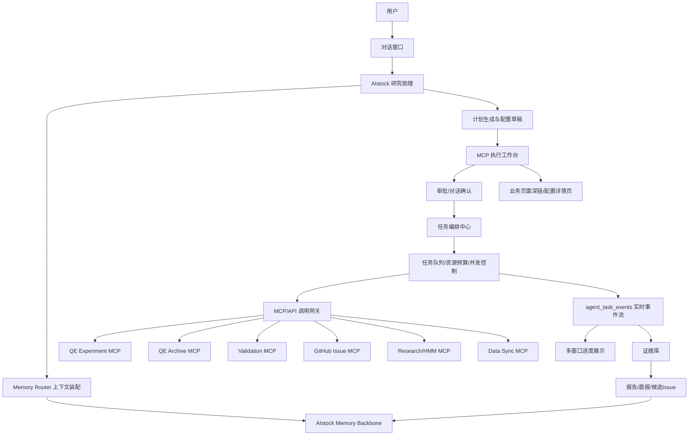
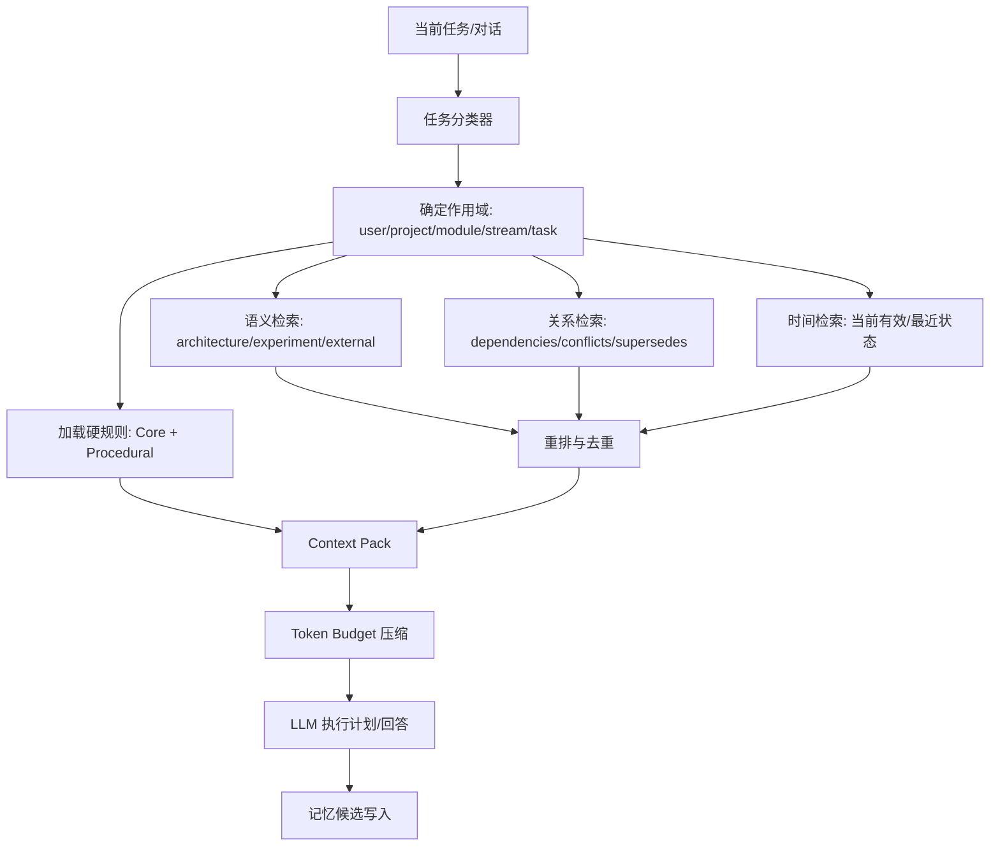
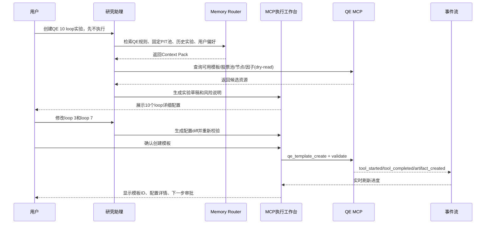
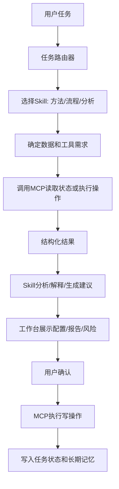
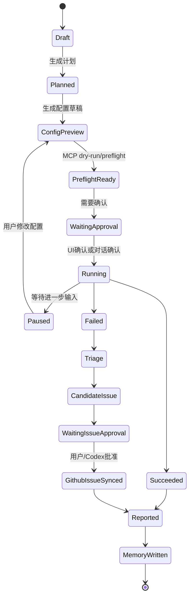

# AIstock 研究与实验综合助理控制台设计方案

> 日期：2026-05-21
> 类型：详细设计方案 v2
> 状态：设计稿，等待用户和 Claude Code 审核；本文档只定义方案，不实现代码
> 分支：`docs/research-agent-console-design-20260520`
> Worktree：`F:\Dev\AIstock_worktrees\research-agent-console-design-20260520`
> 范围：研究与实验综合助理、长期记忆核心架构、MCP 执行工作台、人工/对话确认、多窗口并行研究、多模型可替换、在线搜索、语音能力预留
> 非目标：不让该助理控制鼠标键盘，不让该助理编程、改代码、提交代码、合入 main、重启生产服务、绕过 GitHub Issue 审批或执行实盘交易

---

## 1. 设计结论

AIstock 应建设一个 **研究与实验综合助理控制台**，其核心形态不是“浏览器自动点击助手”，而是：

> 对话式研究助理 + 长期记忆中枢 + MCP/API 执行工作台 + 实时任务进展展示 + 人工/对话确认门禁 + 多窗口并行研究调度。

用户的新思路更加适合 AIstock：

1. **所有业务操作优先通过 MCP/API 执行**，不让智能体控制鼠标键盘。
2. **UI 只承担实时进度、配置预览、报告、审批和深链跳转**，不要求 Agent 识别页面和点击按钮。
3. **长期记忆是核心架构能力**，必须入库、可索引、可审计、可迁移、可替换模型，不依赖某个 LLM 的上下文窗口。
4. **多屏幕/多窗口并行是目标能力**，HMM 演进、QE 实验演进、因子研发、事件处理演进可以在不同窗口同步推进，由同一个研究助理统一调度、汇总和汇报。
5. **Agent 可以执行测试、验证、实验草稿、dry-run、报告和候选 Issue**，但正式 Issue 入库、长时间实验、生产敏感写入仍需用户或 Codex 确认。
6. **开源工具应作为可接入、可复用、可借鉴的组件库**，不替换 AIstock 原生主控台。AIstock 的领域任务账本、实验谱系、审批策略、GitHub 同步规则必须由 AIstock 自己掌握。

---

## 2. 新版用户需求归纳

| 需求 | 设计结论 |
|---|---|
| 一个窗口和智能体交流 | 新增 `/research-assistant/chat` 对话入口，所有任务从对话或任务模板发起 |
| 不控制鼠标键盘 | 废弃默认“UI 点击执行”路线，改为 MCP/API 执行为主 |
| 能看到实时进展 | 建立 `agent_task_events` 事件流，前端实时展示 MCP 调用、状态、日志、产物 |
| 创建 QE 10 loop 实验 | Agent 通过 MCP 生成模板草稿、校验、展示配置、等待确认，再创建/物化/执行 |
| 可对话修改配置 | 每次修改生成配置 diff、重新 preflight、保留配置版本 |
| 确认后执行 | 第一阶段 UI 确认；第二阶段支持对话确认，保存确认原文和 plan digest |
| 长期记忆入库 | 建设 AIstock Memory Backbone，按类型、作用域、时间、来源、置信度、审批状态索引 |
| 模型可替换 | 记忆不绑定 LLM，上下文包由 Memory Router 动态装配，DeepSeek/GLM/OpenAI/本地模型可替换 |
| 随时记住用户要求 | 支持 `remember this` 类记忆写入；关键偏好和流程规则需审批后成为核心记忆 |
| 记录所有研究进展 | 每个 Research Stream 和 Task 自动写 episodic/task-state memory |
| 多屏幕多窗口 | 设计 `assistant_windows` / `workspace_sessions`，多个窗口共享同一任务账本和事件流 |
| 并行长期任务 | HMM、QE、因子、事件等 Research Streams 可并行，受资源预算和审批控制 |
| 支持在线搜索 | 搜索结果落证据表，不直接写核心记忆；重要结论需审核 |
| 让 Claude Code 审核方案 | 文末提供审核重点和风险清单 |

---

## 3. 开源方案调研与可复用性分析

### 3.1 总体判断

目前开源社区已有不少接近能力，但没有一个可以直接替代 AIstock 的研究助理控制台。原因是 AIstock 需要强领域状态：QE 模板、QE Archive、HMM 演进、因子研发、Validation Center、GitHub Issue 强一致、生产数据边界、远程节点资源和长期研究流。

因此最佳路线是：

- **AIstock 原生实现主控台、任务账本、审批、MCP 工具目录、记忆索引和证据链。**
- **参考或接入开源项目的局部能力。**
- **所有外部组件通过 adapter 接入，不成为不可替换核心。**

### 3.2 可参考/接入工具对比

| 工具 | 当前能力 | 可复用/参考点 | AIstock 取舍 |
|---|---|---|---|
| Mem0 OSS | 自托管记忆层，可作为库或 server；支持自有基础设施、dashboard、API key、audit log，默认 server 使用 Postgres + pgvector | 可作为 memory adapter 候选；借鉴 add/search/update/delete、用户/Agent/session 记忆 | Phase 1 不直接依赖；Phase 2 做 PoC adapter |
| Letta | Stateful agent；Agent 包含 system prompt、memory blocks、messages、tools、runs/steps；支持 MCP tool schema | 借鉴 memory blocks、shared memory、runs/steps、工具轨迹 | 不替代 AIstock 任务编排；可参考 Agent runtime 结构 |
| Zep/Graphiti | 开源 temporal knowledge graph，动态整合用户交互和业务数据，支持时间感知和混合检索 | 非常适合“架构事实、任务状态、实验关系随时间变化”的图谱记忆 | Phase 2/3 评估作为 memory graph adapter 或局部图谱引擎 |
| LangGraph / LangMem | Store + checkpointer；支持跨 thread 长期记忆、状态持久化、human-in-the-loop、Postgres checkpointer | 适合作为复杂 Agent workflow / task-state runtime 参考 | 可用于后端状态机，但 AIstock 任务账本仍是事实源 |
| Langfuse | LLM trace、session、agent graph、prompt management、eval、成本/延迟观测 | 适合 LLM 调用观测、prompt 版本、评估和成本分析 | 可选观测后端；Phase 1 先做 AIstock 原生 trace |
| Open WebUI | Chat UI + MCP server 接入 + 工具调用 | 参考聊天 UI 和 MCP server 管理 | 不作为 AIstock 主控；可借鉴工具连接体验 |
| Dify | Agent/Workflow 中使用 MCP tools；MCP 工具作为节点 | 参考 workflow UI 和工具参数固定/自动策略 | 不替换 AIstock；可参考低代码任务模板 |
| Flowise | 开源 Agent/Workflow 平台，含 Human-in-the-loop、tracing、eval、API/SDK | 参考审批节点、Agentflow、多 Agent 可视化 | 不承载 AIstock 主状态 |
| Langflow | Flow 可作为 MCP server 暴露；工具名称和描述影响 Agent 选择 | 可参考把工作流注册为 MCP 工具的方式 | 适合后续把 AIstock 任务模板导出为 MCP tool |

### 3.3 最佳组合建议

| 层 | 推荐实现 | 说明 |
|---|---|---|
| 主控台 | AIstock 原生 | 保证任务、审批、实验、Issue、生产边界一致 |
| 长期记忆默认实现 | AIstock Postgres + pgvector + tsvector + 审计表 | 最可控、最贴合现有本地生产环境 |
| 结构化关系记忆 | AIstock memory_edges；Phase 2 评估 Graphiti | Graphiti 适合动态事实和时间关系，但先 adapter 化 |
| Agent 状态机 | AIstock task ledger；Phase 2 可评估 LangGraph | 避免第一阶段引入框架复杂度 |
| 外部 memory adapter | Mem0 OSS / Graphiti / LangMem adapter | 用 adapter 接口隔离供应商和框架 |
| LLM 观测 | AIstock 原生 trace；可导出 Langfuse | 先满足本项目审计，再考虑成熟观测平台 |
| Chat/MCP UI 参考 | Open WebUI / Dify / Flowise | 只借鉴交互，不接管业务状态 |

---

### 3.4 OpenClaw 参考架构与取舍

OpenClaw 的产品形态与 AIstock 研究助理有较高参考价值：它强调多 channel、gateway、skills、memory、workspace、模型 provider 可替换等能力。这些方向与 AIstock 的“多窗口、多入口、长期记忆、技能库、MCP 工具执行”非常接近。

可借鉴内容：

| OpenClaw 思路 | AIstock 借鉴方式 |
|---|---|
| Gateway 统一接入 | 建设 `assistant_gateway`，接收 Web UI、未来 IM、语音、定时任务、MCP 事件 |
| Channel 抽象 | Web 控制台、未来 Telegram/Slack/企业微信/邮件/桌面通知都作为 channel |
| Session / Workspace | 映射为 `assistant_workspace_sessions` 和 `assistant_windows`，支持多屏幕并行 |
| Skills 目录 | 借鉴为 `assistant_skill_registry`，但必须增加白名单、版本、checksum、审批和权限 |
| Memory 能力 | 借鉴“助理必须有长期状态”的理念，但不照搬文件式记忆作为核心事实源 |
| Model Provider 可替换 | 与 AIstock 的模型无关记忆和 Context Pack 设计一致 |

不建议直接复用内容：

1. 不建议把 OpenClaw gateway 作为 AIstock 主控。AIstock 的任务账本、审批、MCP 权限、GitHub 同步、实验谱系必须由 AIstock 原生掌握。
2. 不建议把 OpenClaw 的文件式 memory 作为 AIstock 核心长期记忆。AIstock 的记忆需要数据库、索引、关系、时间有效性、审批和审计。
3. 不建议直接接入公共 skill 市场。AIstock skill 必须本地白名单、版本锁定、checksum 校验和安全审查。
4. 不建议默认开放主机控制工具。AIstock 研究助理默认不具备 shell、文件写入、git、桌面控制和鼠标键盘控制能力。
5. 不建议让第三方框架决定生产敏感动作。所有 L2+ 操作必须经过 AIstock 审批中心。

OpenClaw 对 AIstock 的主要价值不是“拿来替换”，而是证明 `Gateway + Channel + Skills + Memory + Workspace` 是一个合理产品形态。AIstock 应吸收该形态，但以原生方式实现核心控制面。

### 3.5 即时通讯和外部入口参考

未来 AIstock 研究助理可以支持即时通讯工具，但 IM 不应替代主控制台。

建议入口分级：

| 入口 | 适合能力 | 不适合能力 |
|---|---|---|
| AIstock Web 控制台 | 全量对话、配置预览、审批、进度展示、多窗口工作台 | 无 |
| 桌面通知 | 任务完成、失败、等待确认、晨报提醒 | 参数复杂的审批 |
| IM / 企业微信 / Slack / Telegram | 简短状态查询、晨报、低风险确认、让助理记忆事项 | 高风险实验、生产写入、正式 Issue 入库 |
| 语音 | 快速输入、播报、提醒 | 单独完成高风险确认 |

IM 入口必须遵守以下规则：

1. 任何高风险动作都必须生成 `approval_request_id`。
2. 用户确认文本必须与 `plan_digest`、配置版本、风险等级绑定。
3. IM 只能作为确认来源之一，最终执行仍由 AIstock Orchestrator 完成。
4. 所有 IM 消息必须写入事件流和审计日志。
5. 不同 channel 的身份必须映射到 AIstock 用户身份，不能只依赖昵称。


## 4. 总体架构



### 4.1 MCP 执行优先原则

1. 创建 QE 模板、物化实验、运行实验、查询数仓、执行验证、创建候选 Issue 等操作都通过 MCP/API。
2. 页面只显示任务进度、配置详情、日志、报告、深链和审批按钮。
3. 不使用鼠标键盘控制，不抢占用户当前操作。
4. UI 自动化只作为测试探针或截图证据，不作为业务执行主路径。

### 4.2 多窗口/多屏幕原则

1. 每个窗口是一个 `assistant_window`，可以绑定一个 Research Stream 或 Task。
2. 所有窗口共享同一个 task ledger、memory backbone、approval center 和 event stream。
3. 一个窗口中确认的任务会同步到其他相关窗口。
4. 助理可以在主窗口汇总所有窗口进展，也可以在专项窗口讨论单个任务。
5. 任何高风险动作只允许一个审批来源最终生效，避免多窗口重复执行。

---

### 4.3 独立产品化架构预留

本项目虽然首先在 AIstock 内实现，但架构上应把“研究助理控制台”设计为可独立发布的产品：

> 任何具有 MCP/API 接口的传统应用，都可以通过该框架升级为“AI 助理式应用”。

因此代码结构需要从第一阶段就区分通用核心和 AIstock 适配层。

```text
assistant_product_core/
  gateway/                    # channel 接入、session 路由、事件分发
  memory/                     # Memory Backbone 抽象、Context Pack、索引、审计
  skills/                     # Skill Registry、skill loader、权限和版本治理
  mcp/                        # MCP tool registry、risk policy、tool call trace
  orchestration/              # task ledger、approval、resource budget、event stream
  workbench/                  # 配置预览、实时进度、报告、深链协议
  providers/                  # LLM provider、embedding provider、search provider
  security/                   # 权限、身份、审计、secret redaction

assistant_app_adapters/
  aistock/                    # AIstock 模块、QE/HMM/Validation/GitHub/数仓适配
  generic_mcp_app/            # 通用 MCP 应用适配模板
  future_plugins/             # 其他应用适配器
```

产品化边界：

| 层 | 是否通用 | AIstock 是否依赖 |
|---|---:|---|
| Assistant Gateway | 是 | 使用通用能力 |
| Memory Backbone | 是 | AIstock 扩展领域 schema |
| Skill Registry | 是 | AIstock 注册量化研发 skill |
| MCP Tool Registry | 是 | AIstock 注册 QE/Validation/GitHub 等 MCP |
| Task Ledger / Approval | 是 | AIstock 使用领域风险策略 |
| Workbench | 是 | AIstock 增加 QE/HMM/因子配置视图 |
| AIstock Domain Adapter | 否 | AIstock 专用 |

独立产品需要支持：

1. 应用注册：一个传统应用声明自己的 MCP server、业务模块、页面深链和风险等级。
2. Skill 注册：应用可以注册自己的专业 skill，例如 CRM 助理、数据分析助理、运维助理、量化研究助理。
3. Memory 命名空间：不同应用、用户、租户、项目的记忆隔离。
4. 通用 Workbench：展示计划、配置、MCP 调用、审批、报告和深链。
5. Adapter SDK：让其他应用实现少量 adapter 即可接入。
6. 白标部署：AIstock 中叫“研究助理”，独立产品可叫“Agentic App Console”。

AIstock 第一阶段不需要完整产品化，但代码组织必须避免把所有逻辑写死在 QE/HMM 页面中。通用核心应尽量独立，AIstock 专属逻辑放在 adapter。


## 5. 智能体角色定义

### 5.1 角色名称

推荐名称：**AIstock 研究助理**。
内部标识：`research_assistant_agent`。

### 5.2 角色职责

| 职责 | 是否允许 | 说明 |
|---|---:|---|
| 读取架构、任务、实验、MCP 能力记忆 | 是 | 通过 Memory Router 和权限过滤 |
| 查询 QE Archive、Validation、GitHub、Research Pipeline | 是 | 只读默认允许 |
| 生成实验草稿和配置 diff | 是 | 写入前必须审批 |
| 调用 MCP 执行 dry-run/preflight | 是 | L0/L1 可自动执行 |
| 创建测试模板或测试实验 | 条件允许 | L2，需审批/对话确认 |
| 启动长时间实验或远程节点任务 | 条件允许 | L3，需资源预算和审批 |
| 生成候选 Issue | 是 | 不能直接成为正式 Issue |
| 创建正式 GitHub Issue | 条件允许 | 需用户或 Codex 审批，并同步 GitHub |
| 维护长期记忆 | 是 | 按记忆类型和审批规则执行 |
| 修改代码、提交代码、合入 main | 否 | 不属于该助理能力 |
| 控制鼠标键盘 | 否 | 默认路线明确禁止 |
| 执行实盘交易 | 否 | 默认禁止 |

---

## 6. 长期记忆核心架构

长期记忆是本项目最关键的核心能力。它决定 AIstock 研究助理是否能成为真正的长期研发助手，也决定未来更换模型时是否能保持连续性。

### 6.1 基本原则

1. **记忆必须模型无关**：不能依赖某个模型的上下文窗口或私有记忆能力。
2. **记忆必须入库**：核心记忆、架构记忆、任务记忆、实验记忆、流程记忆都必须持久化。
3. **记忆必须可索引**：支持按用户、项目、模块、任务、实验、时间、关系、语义检索。
4. **记忆必须可审计**：谁写入、为什么写入、来源是什么、是否经审核、何时失效必须可追踪。
5. **记忆必须可纠错**：支持 supersedes、invalidates、contradicts、valid_from、valid_to。
6. **记忆必须可迁移**：支持导出 JSONL/Markdown/Parquet，未来可迁移到 Mem0、Graphiti、LangMem 或其他引擎。
7. **记忆必须分层加载**：不能每次把所有记忆塞进上下文；应逐级检索、压缩、引用。
8. **记忆必须有权限和风险等级**：用户偏好、生产规则、GitHub 凭据相关结论、实盘边界必须受保护。

### 6.2 记忆分层模型

| 层级 | 名称 | 内容 | 写入方式 | 默认加载策略 |
|---|---|---|---|---|
| L0 | Identity/Core Memory | 助理身份、硬边界、用户关键偏好 | 用户确认或标准文档确认 | 每次加载摘要 |
| L1 | Procedural Memory | 工作流程、Issue 流程、验证门禁、禁止事项 | 审核后写入 | 与任务类型匹配时加载 |
| L2 | Architecture Memory | 模块边界、MCP 工具、API、数据表、业务流程 | 文档扫描 + 审核 | 按模块检索加载 |
| L3 | Project Roadmap Memory | 长期规划、阶段目标、待办方向 | 用户确认 | 任务规划时加载 |
| L4 | Task State Memory | 研究流和任务状态、下一步、阻塞点 | 自动写入，可人工修正 | 与 task/stream 绑定加载 |
| L5 | Experiment Memory | QE/HMM/因子/事件实验配置、结果、失败经验 | 自动写入 | 相似实验检索加载 |
| L6 | Episodic Memory | 对话事件、MCP 调用过程、日志摘要 | 自动写入 | 默认不加载，仅按需追溯 |
| L7 | External Knowledge Memory | 在线搜索、论文、工具资料摘要 | 证据入库，结论需审核 | 当前性问题重新搜索 |

### 6.3 记忆数据模型

```text
research_memory_items
  id
  memory_type                -- core / procedural / architecture / roadmap / task_state / experiment / episodic / external
  namespace                  -- user / project / module / stream / task / experiment / tool
  subject_key                -- qe, hmm, factor, validation, github_issue, user_preference 等
  title
  content_json
  content_text
  source_type                -- conversation / mcp_result / doc_scan / validation_run / github_issue / web_search / manual
  source_ref
  source_timestamp
  confidence                 -- 0-1
  approval_status            -- draft / approved / rejected / expired / superseded
  risk_level                 -- low / medium / high / production_sensitive
  valid_from
  valid_to
  supersedes_id
  created_by                 -- user / assistant / codex / system
  approved_by
  embedding_ref
  checksum
  created_at
  updated_at

research_memory_edges
  id
  source_memory_id
  target_memory_id
  relation_type              -- supports / contradicts / supersedes / depends_on / derived_from / same_as / blocks
  confidence
  created_at

research_memory_indexes
  id
  memory_id
  index_type                 -- vector / full_text / graph / time / module / task / experiment
  index_key
  index_payload
  updated_at

research_memory_access_log
  id
  memory_id
  task_id
  stream_id
  agent_id
  window_id
  retrieval_reason
  used_in_prompt             -- true/false
  used_in_report             -- true/false
  retrieved_at
```

### 6.4 记忆检索流程



### 6.5 Context Pack 结构

每次 Agent 执行前，不直接读取全部记忆，而是生成一个 `context_pack`：

```text
assistant_context_packs
  id
  task_id
  agent_id
  model_profile
  token_budget
  core_memory_refs
  procedural_memory_refs
  architecture_memory_refs
  task_state_refs
  experiment_memory_refs
  external_source_refs
  omitted_relevant_refs
  pack_summary
  created_at
```

Context Pack 必须可回放：未来换模型后，也可以知道当时 Agent 基于哪些记忆做了判断。

### 6.6 记忆写入流程

| 写入来源 | 默认状态 | 审批规则 |
|---|---|---|
| 用户明确说“记住这个” | `approved` 或 `needs_review` | 低风险偏好可直接 approved；流程规则需确认 |
| Agent 从对话自动提取 | `draft` | 用户或 Codex 审核后生效 |
| 任务运行状态 | `approved` | 事实型自动写入，可人工修正 |
| 实验配置和结果 | `approved` | 自动写入，绑定实验 ID 和证据 |
| 失败经验 | `draft` | 重要流程性经验需审核成 procedural memory |
| 在线搜索资料 | `external` | 作为证据保存；结论不自动变核心记忆 |
| 设计文档扫描 | `draft` | 需要设计/架构审核后变 architecture memory |

### 6.7 记忆冲突和过期

必须支持：

- `supersedes`：新规则替代旧规则。
- `contradicts`：新事实与旧事实冲突，需要审核。
- `valid_to`：过期时间。
- `confidence_decay`：长期未使用或来源过旧时降低置信度。
- `source_refresh_required`：对于软件版本、接口、法规、外部资料等易变信息，要求重新搜索或重新扫描。

### 6.8 开源 memory adapter 策略

AIstock 第一阶段必须有原生 memory backbone。开源工具作为 adapter：

```text
MemoryProviderAdapter
  - aistock_native_postgres          # 默认事实源
  - mem0_oss_adapter                 # Phase 2 PoC
  - graphiti_temporal_graph_adapter  # Phase 2/3 PoC
  - langgraph_store_adapter          # Phase 2 PoC
  - letta_archival_memory_adapter    # 后续评估
```

Adapter 原则：

1. AIstock 原生表是事实源。
2. 外部 memory engine 可以作为检索增强、图谱增强或压缩增强。
3. 外部返回的记忆必须带 provider、version、retrieval_score、source_ref。
4. 外部组件不可直接修改 Core/Procedural 记忆；必须走 AIstock 审批。
5. 任何 adapter 故障不能阻断 AIstock 原生任务账本和核心记忆读取。

### 6.9 为什么优先考虑 Graphiti/Temporal KG

AIstock 的记忆不是普通聊天偏好，而是大量“会随时间变化”的事实：

- 某个 BUG 曾经 open，后来 fixed，再后来可能 reopened。
- 某个 QE 实验配置在草稿、物化、执行、归档之间变化。
- 某个 HMM 演进方向在不同阶段有不同结论。
- 某个模块的测试覆盖率随每次合入变化。
- 某个流程规则可能被后续标准替代。

因此 temporal graph 非常适合中长期规划。第一阶段先用关系表表达；第二阶段评估 Graphiti 是否能增强以下能力：

- 动态事实的时间范围。
- 实验、模块、任务、Issue、文档之间的关系追踪。
- 过期事实自动失效。
- 混合检索：语义 + 关键词 + 图关系 + 时间。

### 6.10 记忆安全边界

1. 禁止把 API key、GitHub token、数据库密码写入记忆。
2. 用户偏好、流程规则、生产边界属于高权重记忆，必须能追踪来源。
3. Web 搜索内容默认不可信，只能作为外部证据。
4. LLM 对记忆的总结不能替代原始 evidence。
5. 记忆写入必须保留原始片段或 source_ref，避免不可解释。
6. 支持导出“助理记忆审计报告”，给用户和 Claude Code 审核。

---

## 7. MCP 执行工作台设计

### 7.1 替代“浏览器点击”的设计

新版方案将原 Phase 2 “操作展示区”升级为 **MCP 执行工作台**。

它不要求 Agent 操作鼠标键盘，不要求识别页面 DOM，也不要求代替用户点击 UI。它只做：

1. 展示 Agent 计划。
2. 展示待执行配置。
3. 展示 MCP/API 调用进度。
4. 展示业务产物深链。
5. 展示日志、报告和证据。
6. 接收用户确认和对话修改。

### 7.2 QE 10 loop 实验示例流程



### 7.3 配置版本和 diff

```text
assistant_task_config_versions
  id
  task_id
  version
  config_json
  diff_from_previous
  generated_by
  user_instruction_ref
  validation_status
  preflight_result_ref
  created_at
```

### 7.4 事件流

```text
agent_task_events
  id
  task_id
  stream_id
  window_id
  event_type              -- plan_started / memory_retrieved / tool_started / tool_completed / config_generated / approval_required / artifact_created / report_ready
  stage
  mcp_server
  tool_name
  tool_args_summary
  status
  message
  artifact_ref
  route_ref
  evidence_ref
  created_at
```

### 7.5 实时进展展示

前端展示：

- 当前阶段：计划、检索记忆、生成配置、校验、等待确认、执行、完成。
- MCP 调用时间线。
- 当前配置 JSON 的可读摘要。
- 配置 diff。
- 资源预算。
- 风险等级。
- 待确认动作。
- 业务页面深链，例如 QE 模板详情、实验详情、Validation 报告。
- 失败原因和可选修复建议。

---

### 7.6 MCP 与 Skill 双接口架构

AIstock 研究助理未来必须同时具备 MCP 和 Skill 两套接口。

核心定义：

- **MCP 是系统执行接口**：负责调用 AIstock 已有模块、读取事实状态、创建任务、运行实验、同步 GitHub、执行验证。
- **Skill 是专业能力接口**：负责告诉 Agent 如何分析、如何研发、如何组织流程、如何生成方案、如何解释结果。

一句话概括：

> MCP 负责“做动作”，Skill 负责“会做事”。

两者协同关系：



### 7.7 MCP 使用场景

MCP 适合所有需要稳定、结构化、可审计、可回放的系统操作。

| 场景 | 首选 MCP | 原因 |
|---|---:|---|
| 查询 QE 实验状态 | 是 | 后端事实源，结构化返回 |
| 创建 QE 模板 | 是 | 有 schema、审批、任务 ID 和审计 |
| 物化/运行 QE 实验 | 是 | 涉及数据库、远程节点和长任务 |
| 查询 QE Archive | 是 | 数仓事实查询 |
| 查询 HMM timeline | 是 | 研究任务事实源 |
| 执行 Validation 计划 | 是 | 需要验证记录和 artifacts |
| 创建/同步 GitHub Issue | 是 | 必须强一致和审计 |
| 查询模块质量/覆盖率 | 是 | 来自 Validation Center |
| 数据同步任务 | 是 | 涉及生产/准生产数据边界 |
| 写长期任务状态 | 是 | 任务账本是事实源 |
| 写长期记忆 | 是，通过 Memory API/MCP | 需要权限、索引和审计 |

### 7.8 Skill 使用场景

Skill 适合专业流程、方法论、研发范式、复杂分析步骤和可复用研究工作流。

| 场景 | 首选 Skill | 说明 |
|---|---:|---|
| QE 实验结果诊断 | 是 | 需要指标解释、失败归因、稳定性分析 |
| HMM 演进方案设计 | 是 | 需要研究经验、regime 分析、验证计划 |
| 因子研发 | 是 | 需要因子设计、数据约束、IC/OOS 检验流程 |
| 模型研发 | 是 | 需要训练、评估、泄漏检查、稳定性分析 |
| 交易策略设计 | 是 | 需要交易逻辑、风控、回测、执行约束 |
| 事件处理演进 | 是 | 需要误杀/漏判、事件定义、集成路径 |
| Paper v2 业务流程审查 | 是 | 需要跨模块业务理解 |
| 研究报告生成 | 是 | 需要固定结构和审查标准 |
| Issue 修复流程说明 | 是 | 作为流程指导；创建 Issue 仍走 MCP |
| 开发新代码 | Skill 只生成任务包 | 具体编码交给 Codex/Claude 开发流程 |

现有 AIstock skill 应继续复用并纳入治理，例如：

- `qe-evolution-diagnostics`
- `analyze-factor-library`
- `develop-factor`
- `develop-minute-execution-algo`
- `rdagent-task-analyzer`
- `rdagent-data-doctor`
- `tushare`
- `add-tushare-dataset`

这些 skill 是未来研究助理的专业能力来源，但必须进入统一 Skill Registry，不能作为无审计的临时提示词使用。

### 7.9 Skill Registry 设计

```text
assistant_skill_registry
  id
  skill_key
  title
  version
  description
  domain                    -- qe / hmm / factor / model / strategy / validation / issue / generic
  skill_type                -- analysis / research / development_plan / diagnostics / report / handoff
  entrypoint_type           -- markdown / python / prompt_pack / external
  entrypoint_ref
  input_schema_json
  output_schema_json
  required_mcp_tools
  allowed_side_effect_level -- none / read_only / draft_only / controlled_write
  required_approval_level
  owner
  source_ref
  checksum
  status                    -- draft / approved / deprecated / blocked
  created_at
  updated_at
```

Skill 风险等级：

| Skill 类型 | 风险 | 处理方式 |
|---|---:|---|
| 纯分析 skill | 低 | 可自动使用 |
| 报告生成 skill | 低 | 可自动使用 |
| 诊断 skill | 中 | 自动使用，但结论必须绑定证据 |
| 实验设计 skill | 中 | 生成草稿，执行需审批 |
| 因子/模型/策略开发 skill | 高 | 只生成任务包，不由研究助理直接写代码 |
| 带脚本执行 skill | 高 | 必须白名单、审计、沙箱或 MCP controlled runner |
| 第三方下载/安装 skill | 高 | 默认禁止，需安全审查 |

### 7.10 Skill 安全治理

1. Skill 必须本地白名单注册。
2. Skill 必须版本锁定和 checksum 校验。
3. Skill 不能绕过 MCP 写 AIstock 状态。
4. Skill 不能直接创建正式 GitHub Issue。
5. Skill 不能直接写代码、提交代码或合入 main；开发类 skill 只能生成任务包。
6. Skill 使用必须写入 task trace，包括输入、输出、版本、checksum、使用的 MCP 工具和证据。
7. Skill 产生的重要结论默认进入 memory candidate，需要按记忆类型审批。
8. 公共 skill 生态只能作为参考，不能直接安装到生产助理。

### 7.11 MCP + Skill + Memory + Workbench 四层能力

AIstock 研究助理的最终能力栈：

```text
Memory
  长期记忆、任务状态、架构事实、用户规划。

Skills
  方法论、研发流程、分析能力、诊断能力、报告模板。

MCP
  AIstock 模块操作、状态查询、实验执行、Issue 同步、验证执行。

Workbench
  实时进度、配置预览、审批、报告、深链、多窗口展示。
```

- Memory 让它“记得住”。
- Skill 让它“懂方法”。
- MCP 让它“能执行”。
- Workbench 让用户“看得见、能确认、能干预”。


## 8. 多屏幕与多窗口协同

### 8.1 设计目标

用户未来可能使用多个屏幕：

- 屏幕 A：主对话和总览。
- 屏幕 B：HMM 模型演进窗口。
- 屏幕 C：QE 实验演进窗口。
- 屏幕 D：因子研发窗口。
- 屏幕 E：Validation/Issue 窗口。

研究助理必须统一协调这些窗口，避免每个窗口成为孤立 Agent。

### 8.2 数据模型

```text
assistant_workspace_sessions
  id
  user_id
  title
  status
  active_window_id
  created_at
  updated_at

assistant_windows
  id
  workspace_session_id
  window_type              -- main_chat / hmm_stream / qe_stream / factor_stream / validation_stream / report
  bound_stream_id
  bound_task_id
  route
  display_name
  last_seen_at
  status

assistant_window_events
  id
  window_id
  task_event_id
  sync_action              -- show / highlight / notify / require_attention
  created_at
```

### 8.3 并行 Research Streams

```text
research_streams
  id
  stream_key               -- hmm_evolution / qe_evolution / factor_research / event_signal / validation_discovery
  title
  objective
  priority
  status                   -- active / paused / blocked / completed / archived
  current_phase
  owner_agent
  resource_budget_json
  latest_summary
  next_actions_json
  memory_namespace
  created_at
  updated_at
```

### 8.4 多窗口确认规则

1. 同一高风险任务只能有一个 active approval。
2. 任何窗口都可以发起讨论，但执行确认必须绑定 approval ID。
3. 如果多个窗口同时修改同一实验配置，必须产生版本冲突提示。
4. 主窗口总览必须显示所有 stream 的等待确认、失败和下一步。
5. 研究助理每天生成跨 stream 晨报。

---

## 9. 任务编排和人工/对话确认

### 9.1 任务生命周期



### 9.2 对话确认机制

```text
assistant_approval_requests
  id
  task_id
  approval_type            -- create_template / materialize / run_experiment / github_issue / long_compute / production_write
  risk_level
  plan_digest
  config_version_id
  summary
  required_confirmation_text
  status                   -- pending / approved / rejected / expired
  approved_by
  approval_source          -- ui_button / chat_text / codex_review
  approval_text
  approved_at
```

确认规则：

1. 对话确认必须明确，例如“确认执行当前版本配置”。
2. 如果配置版本变化，旧确认自动失效。
3. 如果风险等级提升，必须重新确认。
4. GitHub Issue 正式入库必须单独确认。
5. 长时间任务必须展示资源预算后确认。

---

## 10. 在线搜索与外部资料记忆

在线搜索是研究助理能力之一，但搜索结果不能直接污染核心记忆。

```text
research_web_sources
  id
  task_id
  query
  url
  title
  publisher
  fetched_at
  summary
  source_type              -- docs / github / paper / blog / forum / news
  reliability_rating
  used_in_report
  memory_candidate_id
```

规则：

1. 官方文档、GitHub、论文优先。
2. 当前性问题必须重新搜索。
3. 外部资料只能成为 evidence 或 draft memory。
4. 成为 architecture/procedural memory 前必须审核。

---

## 11. 候选 Issue 与正式 Issue

研究助理可以生成候选 Issue，但不能直接无审批入库。

```text
issue_candidates
  id
  source_task_id
  title
  severity_suggestion
  module_suggestion
  evidence_refs
  reproduction_steps
  expected
  actual
  confidence
  dedupe_candidates
  status                   -- draft / needs_review / approved / rejected / promoted
```

正式入库规则：

1. 必须经用户或 Codex 审批。
2. 必须同步 GitHub Issue。
3. 不允许提交无 GitHub 链接的正式 BUG JSON。
4. GitHub issue number 和 URL 必须回写。
5. 本地状态和 GitHub 状态必须一致。

---

## 12. UI 页面设计

### 12.1 路由

```text
/research-assistant
/research-assistant/chat
/research-assistant/workbench
/research-assistant/tasks
/research-assistant/streams
/research-assistant/memory
/research-assistant/mcp-tools
/research-assistant/approvals
/research-assistant/reports
/research-assistant/settings
```

### 12.2 页面职责

| 页面 | 职责 |
|---|---|
| 总览 | 所有 stream 状态、等待确认、失败、今日报告 |
| Chat | 对话、计划生成、配置讨论、文字/未来语音汇报 |
| Workbench | MCP 执行进度、实验配置预览、配置 diff、业务深链 |
| Tasks | 所有 Agent 任务和事件流 |
| Streams | HMM/QE/因子/事件等长期研究流 |
| Memory | 记忆搜索、审批、废弃、冲突处理、记忆审计 |
| MCP Tools | MCP server/tool/schema/风险等级/健康状态 |
| Approvals | 等待确认动作、风险、参数快照、确认原文 |
| Reports | 晨报、研究报告、实验报告、候选 Issue 报告 |
| Settings | LLM Provider、Prompt、资源预算、Memory Adapter |

### 12.3 与提示词管理关系

现有 `/quantevolver/prompts` 可短期复用，但长期应抽象为通用 Prompt Registry：

- QE prompts。
- Research Assistant prompts。
- HMM evolution prompts。
- Event signal prompts。
- Factor research prompts。
- Validation discovery prompts。

Prompt 版本必须和 Agent trace、报告、任务配置绑定。

---

## 13. LLM 模型和可替换性

### 13.1 模型路由

| 场景 | 模型要求 |
|---|---|
| 简单状态汇报 | 低成本模型 |
| 大文档/大架构分析 | 1M 上下文模型 |
| 实验方案生成 | 强推理模型 |
| Issue 候选审核 | 强推理 + 证据约束 |
| 记忆整理 | 稳定结构化输出模型 |
| 在线搜索总结 | 支持引用和可靠摘要的模型 |

### 13.2 模型替换要求

1. 记忆不依赖模型私有能力。
2. 每次运行记录 model profile。
3. Prompt、Context Pack、工具返回、最终报告都可回放。
4. 更换模型只影响推理，不影响任务账本和记忆事实源。

---

## 14. 语音能力预留

语音不是第一阶段功能，但架构需预留：

- 语音输入转文本。
- 研究晨报语音播报。
- 等待确认提醒。
- 高风险操作不能只用语音确认，必须转文本并绑定 approval。

```text
assistant_voice_events
  id
  task_id
  direction
  transcript
  audio_ref
  confidence
  confirmed_text
  created_at
```

---

## 15. 阶段计划

### Phase 0：文档评审

- 完成本设计文档。
- 用户评审。
- Claude Code 审核。
- 明确长期记忆方案是否采用“AIstock 原生 + adapter”。

### Phase 1：MCP 执行工作台 + 原生长期记忆 MVP

必须实现：

1. Research Assistant 基础页面。
2. MCP 工具目录。
3. Task Ledger。
4. Agent Task Event Stream。
5. MCP 执行工作台。
6. 原生 Memory Backbone 基础表和检索。
7. Context Pack 生成。
8. UI 审批中心。
9. QE Archive 只读分析和 QE Template 草稿/校验流程。
10. 候选 Issue 队列。

明确不做：

- 不控制鼠标键盘。
- 不自动创建正式 Issue。
- 不自动运行长时间实验。
- 不接入语音。
- 不依赖外部 memory server。

### Phase 2：对话确认、多窗口、多 Stream、Memory Adapter PoC

必须实现：

1. 对话确认执行。
2. 多窗口 workspace session。
3. HMM/QE/因子/事件 Research Streams。
4. Mem0 OSS adapter PoC。
5. Graphiti temporal graph adapter PoC。
6. Langfuse 或原生 LLM trace 增强。
7. 工作台支持 QE 10 loop 配置版本和 diff。

### Phase 3：长期自治研究助手

必须实现：

1. 每日晨报。
2. 自动推进 read-only/dry-run 白名单任务。
3. 多 Agent 分工。
4. 长期记忆审计报告。
5. 自动候选 Issue 生成和人工入库审批。
6. 语音输入/播报试点。

---

## 16. 开发验收指标

### 16.1 长期记忆验收

| 项目 | 验收指标 |
|---|---|
| 记忆入库 | Core/Procedural/Architecture/Task/Experiment/Episodic 至少 6 类可写入 |
| 分层检索 | 能按 user/project/module/stream/task/experiment 作用域检索 |
| Context Pack | 每次 Agent 执行能生成可回放上下文包 |
| 记忆审批 | Core/Procedural/Architecture 记忆支持 draft/approved/rejected/superseded |
| 冲突处理 | 支持 supersedes/contradicts/valid_to |
| 模型无关 | 更换模型不影响记忆查询和任务状态 |
| 记忆审计 | 能导出记忆来源、使用记录、写入人、审批状态 |
| 外部 adapter | Phase 2 至少完成 Mem0 或 Graphiti 的只读 PoC |

### 16.2 MCP 执行工作台验收

| 项目 | 验收指标 |
|---|---|
| 实时事件 | MCP 调用开始/完成/失败可实时显示 |
| 配置预览 | QE 实验草稿能以卡片和 JSON 摘要展示 |
| 配置 diff | 对话修改后能显示版本差异 |
| 审批门禁 | 未审批不能执行 L2+ 操作 |
| 深链跳转 | 能跳转到对应 QE/Validation/Issue 页面 |
| 证据绑定 | 报告和候选 Issue 绑定 tool result/evidence ref |

### 16.3 多窗口验收

| 项目 | 验收指标 |
|---|---|
| 多窗口会话 | 不同窗口能绑定不同 Research Stream |
| 状态同步 | 任务状态、审批状态、事件流跨窗口同步 |
| 冲突控制 | 同一配置多窗口修改能提示冲突 |
| 总览汇总 | 主窗口能看到所有 stream 的进展和阻塞 |

### 16.4 安全验收

| 项目 | 验收指标 |
|---|---|
| 禁止鼠标键盘控制 | 默认工具集中不包含桌面控制能力 |
| 禁止编程能力 | 不暴露文件写入、git commit、PR、merge 工具 |
| Token 安全 | 记忆、trace、报告中不出现 token/API key |
| Issue 同步 | 正式 Issue 必须有 GitHub URL |
| 生产边界 | 默认不重启 `8001`/`3000`，不做实盘交易 |

---

## 17. 给 Claude Code 的审核重点

请重点审核以下问题：

1. 长期记忆表结构是否足以支持 AIstock 架构、任务、实验、流程规则和用户偏好长期演进。
2. Memory Adapter 策略是否能避免 Mem0/Graphiti/Letta/LangGraph 造成事实源分裂。
3. Context Pack 是否足以支持模型替换和任务回放。
4. MCP 执行工作台是否完全避免了鼠标键盘控制路线。
5. QE 10 loop 实验示例流程是否能覆盖配置草稿、diff、preflight、审批、物化、执行状态展示。
6. 多窗口和多 Research Stream 是否有重复执行、重复审批、配置冲突风险。
7. 候选 Issue 与正式 GitHub Issue 门禁是否符合 AIstock 现有规范。
8. MCP 与 Skill 的边界是否清晰，Skill 是否不会绕过 MCP 和审批。
9. OpenClaw 参考是否只作为 gateway/channel/skill/product 形态参考，没有引入核心安全风险。
10. 独立产品化抽象是否足以支持其他 MCP 应用接入，同时不削弱 AIstock 首期交付。
11. Phase 1 范围是否足够小，可以先交付可用闭环。

---

## 18. 推荐下一步

1. 用户评审本文档。
2. Claude Code 审核长期记忆和 MCP 工作台方案。
3. 根据审核意见修订 v3。
4. 通过后新建实现分支：`feature/research-agent-console-20260521`。
5. Phase 1 只做：MCP 执行工作台 + 原生长期记忆 MVP + Skill Registry 基础治理 + 任务事件流 + 审批中心。
6. Phase 2 再做：多窗口、多 Stream、对话确认、Mem0/Graphiti adapter PoC。
7. Phase 2/3 评估把通用核心抽离为独立产品包，AIstock 仅作为首个领域 adapter。

---

## 19. 参考资料

- Mem0 OSS：`https://docs.mem0.ai/open-source/overview`
- Letta Stateful Agents：`https://docs.letta.com/guides/core-concepts/stateful-agents`
- Letta Archival Memory：`https://docs.letta.com/guides/ade/archival-memory`
- Zep / Graphiti Open Source：`https://www.getzep.com/product/open-source/`
- Graphiti GitHub：`https://github.com/getzep/graphiti`
- LangChain Long-term Memory：`https://docs.langchain.com/oss/python/langchain/long-term-memory`
- LangGraph Persistence：`https://docs.langchain.com/oss/python/langgraph/persistence`
- LangMem GitHub：`https://github.com/langchain-ai/langmem`
- Langfuse Docs：`https://langfuse.com/docs`
- Open WebUI MCP：`https://docs.openwebui.com/features/mcp/`
- Dify MCP Tools：`https://docs.dify.ai/en/use-dify/build/mcp`
- Flowise Docs：`https://docs.flowiseai.com/`
- Langflow MCP Server：`https://docs.langflow.org/mcp-server`
- MCP Tools Specification：`https://modelcontextprotocol.io/specification/2025-06-18/server/tools`
- OpenClaw What is OpenClaw：`https://openclawdoc.com/docs/getting-started/what-is-openclaw/`
- OpenClaw Agents Overview：`https://openclawdoc.com/docs/agents/overview/`
- OpenClaw Architecture：`https://openclawlab.com/en/docs/start/architecture/`
