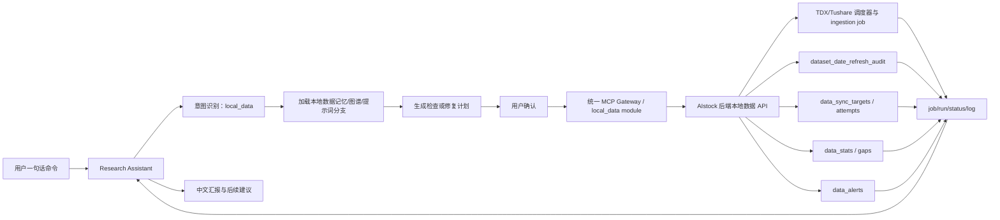

# AIstock 本地数据管理 MCP Gateway 详细设计方案

> 日期：2026-05-23  
> 类型：详细设计方案  
> 关联方案：`docs/architecture/data_sync_autonomous_control_plane_design_20260519.md`、`docs/architecture/research_assistant_memory_graph_bootstrap_design_20260523.md`  
> 本次范围：只新增“本地数据管理 MCP”设计，优先支持助手一句话查询数据状态、检查同步任务、调度执行任务、管理和重置计划任务、执行自动修复。  
> 明确暂不处理：因子独立指标计算、miniQMT / Xtquant 数据同步、实盘交易路径。

## 1. 背景和目标

当前 `/local-data` 页面已经承担本地数据管理、数据入库调度、任务监控、数据看板、数据源测试、告警和部分自动补齐能力。Research Assistant 要成为真正可用的量化研发助理，第一优先级不是先扩展 Paper v2 或 StrategyPackage，而是先能稳定回答并处理：

> “检查当前本地数据同步情况，并自动修复未同步成功的数据。”

本设计要求通过统一 MCP Gateway 暴露本地数据管理能力，让助手可以在用户确认后完成本地数据管理页面中核心操作，但不绕过后端原有 API、调度器、数据审计和告警门禁。

### 1.1 必须达到的能力

1. 查询当前数据整体健康状态，并用中文解释哪些数据可用、哪些数据过期、哪些只是缓存滞后。
2. 检查指定数据集、日期范围、数据源、同步任务、计划任务和告警状态。
3. 生成修复计划，区分只读检查、调度执行、计划任务变更、取消/清理等不同风险级别。
4. 用户确认后，通过 MCP 调度现有后端任务：增量同步、初始化、指定计划任务立即运行、刷新数据看板、检查 gaps、执行自动补齐、确认告警、取消任务和重置计划任务。
5. 所有写操作进入任务 trace，记录工具、参数摘要、确认口令、后端 `job_id` / `run_id` / `schedule_id`、结果和失败原因。
6. 所有结果面向人类可读，禁止把 raw JSON、内部 ID 和后台日志作为主视图；ID 只能作为详情和审计字段。
7. MCP 只调用 AIstock 后端 API，不直接连数据库、不直接 import 调度器、不直接运行脚本。
8. 本地数据管理 MCP 必须进入 Research Assistant 的 Capability Registry、Prompt Tree、长期记忆和轻量图谱。

### 1.2 本次不做事项

| 项目 | 本次处理方式 | 后续接入方式 |
| --- | --- | --- |
| 因子独立指标计算 | 不纳入本地数据管理 MCP 首批工具 | 后续作为 `factor_metrics` 或 `factor_library` capability 接入 |
| miniQMT / Xtquant 数据同步 | 不纳入首批自动修复范围 | 后续作为 `qmt_data` capability 接入，并单独设计外部客户端可用性预检 |
| 实盘交易 | 不提供任何 MCP 操作路径 | 实盘功能上线后单独设计权限、审批、熔断和审计 |
| 直接数据库修复 | 不允许 | 只通过后端正式 API 或受控 migration / repair job |
| 直接运行脚本 | 不允许 | 后端 API 负责创建 job，调度器或 worker 执行 |

## 2. 当前基线分析

| 能力 | 当前入口 | MCP 接入要求 |
| --- | --- | --- |
| 数据源测试 | `/api/testing/*` | 暴露只读查询和确认后运行/维护计划工具 |
| 初始化入库 | `/api/ingestion/init`、`/api/ingestion/run` | 高风险写入，必须确认后执行 |
| 增量入库 | `/api/ingestion/incremental`、`/api/ingestion/run` | 必须先预检查参数，再确认执行 |
| 任务监控 | `/api/ingestion/jobs`、`/api/ingestion/job/{job_id}`、`/api/ingestion/logs` | 只读工具返回摘要，详情可展开 |
| 任务控制 | `/api/ingestion/job/{job_id}/cancel`、`DELETE /api/ingestion/job/{job_id}`、`DELETE /api/ingestion/jobs/queued` | 写操作必须确认，默认不删除历史 |
| 入库计划任务 | `/api/ingestion/schedule*` | 需要计划预览、差异展示、确认应用 |
| 数据看板 | `/api/data-stats`、`/api/data-stats/refresh`、`/api/data-stats/gaps` | 刷新/检查都要可通过 MCP 触发并解释结果 |
| 自动补齐范围 | `/api/ingestion/auto-range` | 作为修复计划输入，不直接替代执行 |
| 交易日历同步 | `/api/calendar/sync` | 写操作需确认 |
| 申万行业构建 | `/api/sector-data/build`、`/api/sector-data/export` | 本次可纳入数据管理调度，但不做因子指标计算 |
| Tushare 数据集 | `/api/ingestion/tushare/datasets`、`/api/ingestion/tushare/sync-all` | 批量同步需风险提示和确认 |
| 告警 | `/api/ingestion/alerts/*` | 只允许确认已理解或已恢复告警，不直接篡改 readiness |
| data sync targets | `market.data_sync_targets`、`market.data_sync_attempts`、`backend/services/data_sync_targets.py` | 作为状态和修复计划依据，不绕过后端执行 |

关键约束：

1. `market.dataset_date_refresh_audit` 是 readiness 权威源，`market.data_stats` 是可重建缓存，`market.ingestion_jobs` 是执行过程证据。
2. `backend/services/data_sync_targets.py` 当前是被动记录，只记录期望同步目标和 attempt，不负责调度和执行。
3. `backend/mcp/gateway.py` 已有统一 Gateway 结构，但当前可用模块只包括 `research` 和 `research_assistant`；本次设计要求新增 `local_data` Gateway module。
4. 本地数据管理 MCP 必须通过 loopback backend API 调用，不能在 MCP server 内直接执行 SQL 或脚本。

## 3. 总体架构



### 3.1 模块命名

| 层级 | 名称 | 说明 |
| --- | --- | --- |
| Gateway module | `local_data` | 与 `/local-data` 页面一致，表示本地数据管理完整操作域 |
| 图谱模块 | `module.data_sync` | 保持既有图谱命名，表示数据同步和本地数据健康 |
| MCP server | `mcp.aistock_gateway` | 统一 Gateway 运行实例 |
| MCP capability | `capability.local_data_management` | Research Assistant 能力目录中面向助手的能力集合 |
| Prompt branch | `prompt.local_data_management` | 本地数据管理提示词分支 |
| Memory subject | `architecture.local_data_management.mcp_gateway` | 长期记忆中的架构事实 |

## 4. 工具分层和风险级别

| 风险级别 | 含义 | 是否需要确认 | 示例 |
| --- | --- | --- | --- |
| `read_only` | 只查询状态，不写数据库，不触发 job | 不需要 | 查询数据健康、任务状态、计划任务列表 |
| `plan_only` | 生成计划，不执行 | 不需要 | 生成修复计划、计划任务重置 diff |
| `write_control_plane` | 只修改计划、告警 ack、任务控制状态 | 需要 | 启停计划任务、确认告警、取消任务 |
| `run_data_job` | 创建或调度数据同步 job | 需要 | 增量同步、初始化、运行计划任务、刷新 stats |
| `destructive` | 删除记录、清理排队任务、truncate 初始化 | 需要二次确认 | 删除任务历史、清空排队任务、带 truncate 的初始化 |

确认口令：

| 操作类别 | 确认口令 |
| --- | --- |
| 运行数据同步 job | `CONFIRM_LOCAL_DATA_RUN` |
| 应用修复计划 | `CONFIRM_LOCAL_DATA_REPAIR` |
| 更新计划任务 | `CONFIRM_LOCAL_DATA_SCHEDULE` |
| 重置计划任务 | `CONFIRM_LOCAL_DATA_RESET_SCHEDULES` |
| 取消任务 | `CONFIRM_LOCAL_DATA_CANCEL_JOB` |
| 删除或清理 | `CONFIRM_LOCAL_DATA_DESTRUCTIVE` |
| 确认告警 | `CONFIRM_LOCAL_DATA_ACK_ALERT` |

## 5. MCP 工具清单

### 5.1 状态查询工具

| 工具名 | 风险 | 后端依据 | 返回要求 |
| --- | --- | --- | --- |
| `local_data_health_overview` | read_only | `/api/data-stats`、active alerts、recent jobs、data_sync_targets | 中文摘要、总体状态、影响模块、需处理项 |
| `local_data_get_dataset_status` | read_only | data_stats、audit、physical summary、alerts | 单个数据集状态、ready_date、physical_max_date、cache_state、last_job |
| `local_data_list_data_stats` | read_only | `GET /api/data-stats` | 数据看板列表，不返回 raw JSON 作为主结果 |
| `local_data_check_gaps` | read_only | `GET /api/data-stats/gaps` | 缺口摘要、可补齐区间、是否影响业务 |
| `local_data_compute_auto_range` | read_only | `GET /api/ingestion/auto-range` | 自动补齐区间建议 |
| `local_data_list_alerts` | read_only | `GET /api/ingestion/alerts/active` | 活跃告警摘要和严重程度 |
| `local_data_get_unack_alert_count` | read_only | `GET /api/ingestion/alerts/unack-count` | 未确认告警数量 |
| `local_data_list_sync_targets` | read_only | data_sync_targets facade | pending/retry/final_blocked/reconciled target 列表 |
| `local_data_get_sync_target` | read_only | data_sync target detail | target 详情和 attempt 摘要 |
| `local_data_list_sync_attempts` | read_only | `market.data_sync_attempts` facade | attempt 时间线 |

### 5.2 任务监控和控制工具

| 工具名 | 风险 | 后端依据 | 返回要求 |
| --- | --- | --- | --- |
| `local_data_list_jobs` | read_only | `GET /api/ingestion/jobs` | 最近任务、运行中任务、失败任务摘要 |
| `local_data_get_job` | read_only | `GET /api/ingestion/job/{job_id}` | 任务进度、数据集、模式、状态、错误摘要 |
| `local_data_get_job_logs` | read_only | `GET /api/ingestion/logs` | 默认只返回摘要和关键错误，详情可展开 |
| `local_data_cancel_job_confirmed` | write_control_plane | `POST /api/ingestion/job/{job_id}/cancel` | 取消结果、是否需要人工检查 |
| `local_data_clear_queued_jobs_confirmed` | destructive | `DELETE /api/ingestion/jobs/queued` | 清理数量和影响说明 |
| `local_data_delete_job_confirmed` | destructive | `DELETE /api/ingestion/job/{job_id}` | 仅用于明确无价值历史任务，不作为常规修复动作 |

### 5.3 调度执行工具

| 工具名 | 风险 | 后端依据 | 返回要求 |
| --- | --- | --- | --- |
| `local_data_run_dataset_sync_confirmed` | run_data_job | `POST /api/ingestion/run` | 创建 job，返回 job_id 和后续查询方式 |
| `local_data_run_incremental_confirmed` | run_data_job | `POST /api/ingestion/incremental` | 按数据集/区间增量同步 |
| `local_data_run_init_confirmed` | run_data_job 或 destructive | `POST /api/ingestion/init` | 初始化任务；含 truncate 时提升为 destructive |
| `local_data_run_schedule_confirmed` | run_data_job | `POST /api/ingestion/schedule/{id}/run` | 立即运行指定计划任务 |
| `local_data_run_single_preset_confirmed` | run_data_job | `POST /api/ingestion/schedule/run-single-preset` | 运行单个预置任务 |
| `local_data_run_all_presets_confirmed` | run_data_job | `POST /api/ingestion/schedule/run-all-presets` | 运行所有预置任务，必须说明范围 |
| `local_data_refresh_stats_confirmed` | run_data_job | `POST /api/data-stats/refresh` | 刷新 data_stats 缓存并重新读取摘要 |
| `local_data_sync_calendar_confirmed` | run_data_job | `POST /api/calendar/sync` | 同步交易日历 |
| `local_data_build_sector_data_confirmed` | run_data_job | `POST /api/sector-data/build` | 构建申万行业数据；不执行因子指标计算 |
| `local_data_export_sector_data_confirmed` | run_data_job | `POST /api/sector-data/export` | 导出行业数据 |
| `local_data_sync_tushare_all_confirmed` | run_data_job | `POST /api/ingestion/tushare/sync-all` | 批量同步 Tushare 数据集，必须说明范围 |

### 5.4 计划任务管理工具

| 工具名 | 风险 | 后端依据 | 返回要求 |
| --- | --- | --- | --- |
| `local_data_list_schedules` | read_only | `GET /api/ingestion/schedule` | 数据入库计划任务列表 |
| `local_data_get_schedule_defaults` | read_only | default schedule facade | 当前推荐默认计划模板 |
| `local_data_upsert_schedule_confirmed` | write_control_plane | `POST /api/ingestion/schedule` | 创建/更新单个计划任务 |
| `local_data_batch_create_schedules_confirmed` | write_control_plane | `POST /api/ingestion/schedule/batch-create` | 批量创建或更新计划任务 |
| `local_data_toggle_schedule_confirmed` | write_control_plane | `POST /api/ingestion/schedule/{id}/toggle` | 启停计划任务 |
| `local_data_delete_schedule_confirmed` | destructive | `DELETE /api/ingestion/schedule/{id}` | 删除计划任务 |
| `local_data_plan_schedule_reset` | plan_only | 当前计划 + 默认模板 + preset stats | 只生成差异计划，不写入 |
| `local_data_apply_schedule_reset_confirmed` | write_control_plane | batch-create/toggle/delete 组合 | 按计划重置，必须记录 diff |
| `local_data_get_preset_stats` | read_only | `GET /api/ingestion/schedule/preset-stats` | 预置计划覆盖情况 |
| `local_data_get_preset_daily_status` | read_only | `GET /api/ingestion/schedule/preset-daily-status` | 当日预置任务状态 |

### 5.5 数据源测试和修复编排工具

| 工具名 | 风险 | 后端依据 | 返回要求 |
| --- | --- | --- | --- |
| `local_data_run_source_test_confirmed` | run_data_job | `POST /api/testing/run` | 运行数据源测试 |
| `local_data_list_source_test_runs` | read_only | `GET /api/testing/runs` | 测试历史摘要 |
| `local_data_list_source_test_schedules` | read_only | `GET /api/testing/schedule` | 测试计划任务列表 |
| `local_data_upsert_source_test_schedule_confirmed` | write_control_plane | `POST /api/testing/schedule` | 创建/更新测试计划 |
| `local_data_toggle_source_test_schedule_confirmed` | write_control_plane | `POST /api/testing/schedule/{id}/toggle` | 启停测试计划 |
| `local_data_run_source_test_schedule_confirmed` | run_data_job | `POST /api/testing/schedule/{id}/run` | 立即运行测试计划 |
| `local_data_plan_repair` | plan_only | overview + gaps + targets + jobs + alerts | 生成修复步骤，不执行 |
| `local_data_apply_repair_confirmed` | run_data_job | 根据 plan 调用 run/refresh/ack/schedule 工具 | 逐步执行，任何步骤失败立即停止并汇报 |
| `local_data_get_repair_status` | read_only | task trace + job ids + target attempts | 修复进度和剩余阻塞 |
| `local_data_explain_business_impact` | read_only | readiness + 模块图谱 | 解释对 QE、Selection、Paper v2、股票分析的影响 |

## 6. 助手自然语言执行流程

用户说“检查当前数据同步情况并自动修复未同步成功的数据”时，助手必须：

1. 识别为 `local_data` 任务，加载 `prompt.local_data_management`、`architecture.local_data_management.mcp_gateway`、`process.local_data.repair_flow`。
2. 调用 `local_data_health_overview`、`local_data_list_jobs`、`local_data_list_alerts`、`local_data_list_sync_targets`。
3. 发现问题后调用 `local_data_plan_repair`，生成中文修复计划。
4. 展示问题、影响模块、将调用的 MCP 工具、是否写库、是否启动长任务、风险级别。
5. 等待用户确认。
6. 用户确认后调用 `local_data_apply_repair_confirmed` 或按计划逐项调用确认型工具。
7. 每个 job 创建后调用 `local_data_get_job` 跟踪状态；长任务进入任务进度卡片，不阻塞对话。
8. 修复完成后重新运行 `local_data_health_overview`，输出对比结论。
9. 如仍失败，生成 issue candidate 或待办；正式 issue 仍需用户/Codex 审核。

## 7. 后端实现设计

### 7.1 Gateway module

新增文件建议：

```text
backend/mcp/modules/local_data.py
```

职责：

1. 注册本设计中的 MCP 工具。
2. 工具只做参数校验、确认口令校验、ID sanitizer、风险元数据包装。
3. 工具通过 `registry.client()` 调用后端 API。
4. 工具不得 import `tdx_scheduler`、不得直接调用 repository、不得直接运行脚本。
5. 工具返回统一 envelope：`summary`、`status`、`business_impact`、`next_actions`、`trace_refs`、`raw_ref`。

### 7.2 后端 facade API

建议新增稳定 facade，避免 MCP 工具直接耦合旧 `/api/*` 路由细节：

```text
/api/v1/local-data/overview
/api/v1/local-data/datasets/{dataset}/status
/api/v1/local-data/jobs
/api/v1/local-data/jobs/{job_id}
/api/v1/local-data/jobs/{job_id}/logs
/api/v1/local-data/jobs/{job_id}/cancel
/api/v1/local-data/schedules
/api/v1/local-data/schedules/{schedule_id}
/api/v1/local-data/schedules/{schedule_id}/run
/api/v1/local-data/schedules/reset-plan
/api/v1/local-data/schedules/reset-apply
/api/v1/local-data/stats/refresh
/api/v1/local-data/gaps
/api/v1/local-data/targets
/api/v1/local-data/targets/{target_id}
/api/v1/local-data/repair-plan
/api/v1/local-data/repair-apply
/api/v1/local-data/alerts
/api/v1/local-data/alerts/{alert_id}/acknowledge
```

facade 负责复用旧 API、转换为稳定结构、加入风险元数据和 trace_id、禁止静默兜底，并把后端异常 fail-fast 返回给助手。

### 7.3 Capability Registry

| 字段 | 值 |
| --- | --- |
| `capability_key` | `local_data_management` |
| `domain` | `data_sync` |
| `primary_mcp_module` | `local_data` |
| `risk_default` | `read_only` |
| `write_requires_approval` | `true` |
| `prompt_branch` | `prompt.local_data_management` |
| `memory_subjects` | `architecture.local_data_management.mcp_gateway`、`process.local_data.repair_flow` |
| `graph_entities` | `module.data_sync`、`api.local_data_facade`、`mcp.local_data` |

## 8. 长期记忆和图谱更新

### 8.1 必须新增的长期记忆

| memory_type | subject_key | 内容 |
| --- | --- | --- |
| `architecture` | `architecture.local_data_management.mcp_gateway` | 本地数据管理通过统一 MCP Gateway 的 `local_data` module 暴露能力，MCP 不直接操作数据库或脚本。 |
| `procedural` | `process.local_data.check_repair_confirm` | 本地数据修复流程必须先只读检查、生成修复计划、用户确认、执行、复查。 |
| `procedural` | `process.local_data.schedule_reset` | 计划任务重置必须先生成 diff，再确认应用，不得静默覆盖。 |
| `architecture` | `architecture.data_readiness.audit_authority` | `dataset_date_refresh_audit` 是 readiness 权威源，`data_stats` 是缓存，`ingestion_jobs` 是执行证据。 |
| `rule` | `rule.local_data.no_direct_db_script_mcp` | 本地数据 MCP 不得直接连数据库或运行脚本，必须调用后端 API。 |
| `roadmap` | `roadmap.local_data_mcp.first_priority` | 本地数据管理 MCP 是助手操作平台的第一优先级，先于 Paper v2 MCP 扩展。 |

### 8.2 必须新增的图谱实体和关系

| 类型 | key | 说明 |
| --- | --- | --- |
| entity | `capability.local_data_management` | 本地数据管理 MCP 能力 |
| entity | `mcp.local_data` | Gateway local_data module |
| entity | `api.local_data_facade` | 本地数据管理 MCP facade API |
| entity | `process.local_data_check_repair` | 本地数据检查与修复流程 |
| entity | `process.local_data_schedule_reset` | 本地数据计划任务重置流程 |
| entity | `data.dataset_date_refresh_audit` | 数据 readiness 权威源 |
| entity | `data.data_stats` | 数据看板缓存 |
| entity | `data.ingestion_jobs` | 数据同步任务账本 |
| entity | `data.data_sync_targets` | 数据同步目标状态源 |
| entity | `data.data_alerts` | 本地数据告警 |
| relation | `module.research_assistant uses capability.local_data_management` | 助手使用本地数据管理能力 |
| relation | `capability.local_data_management exposes mcp.local_data` | 能力由 MCP 暴露 |
| relation | `mcp.local_data calls api.local_data_facade` | MCP 调用后端 facade |
| relation | `api.local_data_facade reads data.dataset_date_refresh_audit` | facade 查询 readiness |
| relation | `data.dataset_date_refresh_audit supports module.qe/module.selection_center/module.paper_v2` | readiness 支撑下游模块 |

## 9. 前端和助手 UI 要求

1. 用户只看到“检查中、发现问题、建议修复、等待确认、执行中、完成/失败”阶段卡片。
2. 主对话不展示 raw JSON；工具调用详情可在“审计详情”中展开。
3. 数据状态使用中文标签：正常、缓存滞后、等待发布、重试中、最终阻断、需要人工处理。
4. 任务进度卡片显示：数据集、模式、进度、已写入行数、当前状态、预计下一步。
5. 计划任务重置显示 diff：新增、更新、启用、禁用、删除；用户确认后才应用。
6. 失败时必须显示后端真实错误和建议处理，禁止静默降级为“已完成”。

## 10. 验收矩阵

| 编号 | 功能 | 验收标准 | 验证方式 |
| --- | --- | --- | --- |
| LDM-MCP-001 | Gateway module 注册 | `local_data` 模块可被 Gateway profile/module 加载，工具数量与文档一致 | 单测 |
| LDM-MCP-002 | 能力目录 | Research Assistant 能列出 `local_data_management` capability，包含风险级别和提示词分支 | API 测试 |
| LDM-MCP-003 | 健康总览 | `local_data_health_overview` 返回中文摘要、状态等级、影响模块、待处理项 | MCP/API 测试 |
| LDM-MCP-004 | 数据集状态 | 指定 dataset 可返回 ready_date、physical_max_date、stats_max_date、cache_state、last_job | API 测试 |
| LDM-MCP-005 | gaps 检查 | 可检查指定数据集 gaps，并给出补齐区间建议 | API 测试 |
| LDM-MCP-006 | target 查询 | 可列出 pending/retry/final_blocked/reconciled target 和 attempts | API 测试 |
| LDM-MCP-007 | 任务查询 | 可列出任务、查看任务详情和关键日志摘要 | MCP/API 测试 |
| LDM-MCP-008 | 运行数据同步 | 确认后能创建同步 job，并返回 job_id 和 trace | 集成测试 |
| LDM-MCP-009 | 运行计划任务 | 确认后能运行指定 schedule，并可追踪 job | 集成测试 |
| LDM-MCP-010 | 刷新 data_stats | 确认后刷新统计缓存，复查后状态变化可见 | 集成测试 |
| LDM-MCP-011 | 计划任务列表 | 可读取所有入库计划任务并按 enabled/frequency/dataset 汇总 | API 测试 |
| LDM-MCP-012 | 计划任务更新 | 确认后可创建/更新/启停计划任务，记录 diff | 集成测试 |
| LDM-MCP-013 | 计划任务重置 | 先生成 reset plan，再确认 apply；不得静默覆盖 | 单测 + 集成测试 |
| LDM-MCP-014 | 取消任务 | 确认后可以取消运行中任务，失败时返回真实原因 | 集成测试 |
| LDM-MCP-015 | 清理排队任务 | 二次确认后可清理 queued jobs，返回清理数量 | 集成测试 |
| LDM-MCP-016 | 告警确认 | 确认后可 ack 告警，但不改变 readiness 事实 | API 测试 |
| LDM-MCP-017 | 修复计划 | `local_data_plan_repair` 能基于状态生成步骤、风险和影响说明，不执行 | 单测 |
| LDM-MCP-018 | 修复执行 | `local_data_apply_repair_confirmed` 逐步执行，任何失败立即停止并记录 | 集成测试 |
| LDM-MCP-019 | 对话集成 | 用户一句话触发检查，助手先只读检查，再请求确认，不直接执行写操作 | UI/API smoke |
| LDM-MCP-020 | 图谱/记忆 | 新增实体、关系和记忆 seed 可预览、可写入、可重复执行 | API/DB 测试 |
| LDM-MCP-021 | 禁止 raw JSON 主视图 | 主对话和任务状态不以 raw JSON 为主 | Playwright smoke |
| LDM-MCP-022 | 禁止直接 DB/脚本 | MCP module 中不得直接使用 DB 连接、subprocess 或调度器 import | 静态检查 |
| LDM-MCP-023 | 排除范围 | 因子独立指标计算、Xtquant/miniQMT 同步不出现在首批可执行工具中 | 工具目录检查 |
| LDM-MCP-024 | 失败不静默 | 后端错误不会被转成成功；错误会进入 trace 和中文报告 | 单测 |
| LDM-MCP-025 | production_ddl_gate | 如新增 DB 对象必须有 migration 和 gate 记录；纯文档更新为 noop | 合入报告 |

## 11. 分阶段实施目标

### Phase 0：设计落地和图谱更新

交付：本设计文档、数据同步控制面文档补充、记忆图谱文档补充、图谱 SVG/PNG 预览更新。验收：文档前后一致，工具清单覆盖本地数据管理主要可执行任务，验收矩阵可作为后续代码开发检查表。

### Phase 1：后端 facade 和 Gateway module

交付：`/api/v1/local-data/*` facade、`backend/mcp/modules/local_data.py`、Gateway profiles、全部只读与确认型工具、后端单测。验收：`LDM-MCP-001` 至 `LDM-MCP-018` 通过，且不触碰因子独立指标计算和 Xtquant 同步。

### Phase 2：助手对话和任务状态集成

交付：Prompt Tree 增加 `local_data_management` 分支；对话可识别“检查数据同步情况并修复”；任务状态卡片展示检查、计划、确认、执行、复查；工具调用详情可审计但不作为主视图。验收：`LDM-MCP-019`、`LDM-MCP-021`、`LDM-MCP-024` 通过。

### Phase 3：记忆/图谱 seed 和长期状态沉淀

交付：本地数据管理架构记忆 seed、图谱实体和关系 seed、修复任务结果进入 `task_state` 或 candidate memory。验收：`LDM-MCP-020` 通过，助手能回答哪些数据状态会影响 QE / Selection Center / Paper v2。

## 12. 核心结论

1. 本地数据管理 MCP 是 Research Assistant 第一优先级能力，先于 Paper v2 / StrategyPackage / Selection Center MCP 扩展。
2. 新能力应加入统一 MCP Gateway 的 `local_data` module，而不是新建完全独立 MCP Server。
3. MCP 要覆盖本地数据管理主要可执行任务：状态查询、任务检查、同步调度、计划任务维护、计划重置、数据看板刷新、gap 检查、告警确认和修复编排。
4. MCP 不直接操作数据库和脚本，只调用后端 facade API。
5. readiness 仍以 `dataset_date_refresh_audit` 为权威源，`data_stats` 只是缓存，`ingestion_jobs` 只是执行证据。
6. 因子独立指标计算和 Xtquant/miniQMT 同步本次不处理，但预留后续 capability 接入空间。