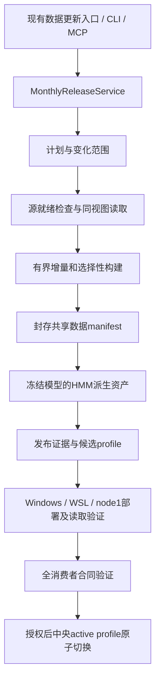

# 共享回测数据集月更、增量构建与一键切换详细设计

> Feature ID: `monthly_unified_dataset_release_v2`
>
> Tier: F2；文档版本：2.0；日期：2026-09-21
>
> 交付阶段：详细设计文档；实现与生产验收尚未完成。
>
> 主责：local_data / qlib_data；业务模块负责其现有消费合同，数据窗口负责发布编排。
> 本文定义后续完整开发的要求；示例接口、schema 和命令标为拟新增，不能作为当前已存在的功能调用。

## 1. Background / 背景、事实与设计关系

本月多轮补录暴露出四类独立问题：数据库缺行或字段为空；导出遗漏历史股票或拼接新旧复权基准；共享行业 authority 不完整；数据已切换而 HMM 派生资产、节点允许根或消费者缓存仍引用旧版本。只补齐文件或只切换 profile 不能同时解决这些问题。

本设计承接 [全局消费者设计](global_dataset_release_consumers_v2_f2_design_20260918.md)，保留单一 active profile、共享行业文本代码、任务创建时冻结 binding、历史任务不漂移的语义。本文统一后续月更的编排；旧设计中的具体日期、行业活跃计数和分阶段手工操作不作为新月份常量。

现有 [月更产品化设计](qe_monthly_dataset_release_productization_f2_design_20260811.md) 和 [MCP Gateway 设计](qlib_backtest_dataset_mcp_gateway_design_20260614.md) 仅提供可复用背景；与现行 direct-v2 流程冲突的全历史 source-freeze、重复 source recheck、资源准入和多次人工审批不恢复。执行规范仍以仓库唯一开发标准和当时生效的月更 Skill 为准。

### 1.1 本次只读核验基线

以下是设计调研证据，不是未来任务的硬编码输入：

| 项目 | 2026-09-21 观察值 |
|---|---|
| 设计工作树起点 | `origin/main=0f776e1f75ebc84b631f314af74549a9b47cf029` |
| active generation | `20260920-v14-unified` |
| release_id / cutoff | `qe_hmm_full_v2_20260831` / `2026-08-31` |
| dataset manifest identity | `433af087e0cf1363f84d708d0cb0bdeeaf6685d153de05fbedc84206b736dd0b` |
| profile file SHA256 | `403f194c01f33bbb547e29ce9bc05f42814d8e449343146604ef980ed654f2ed` |
| candidate basename | `20260831-qe_hmm_full_v2-direct-20260920-r8-unified-candidate` |

执行时重新读取 active profile、文件 manifest、组件回执和节点登记。不能仅凭 R8 标签定位文件；同名家族标签不等于相同内容身份。

### 1.2 已有实现与差距

| 现有位置 | 已有能力 | 本设计要求的处理 |
|---|---|---|
| `backend/services/dataset_release/direct_monthly.py` | 六组件构建、组件级恢复；计划固定为 COMPONENT_REBUILD | 改为明确变化范围驱动，保留受审生产者 |
| `scripts/qlib_authoritative_bin_export.py` | dump_all / dump_update、复权 basis、PIT sidecar | 验证尾部模式并隔离写入，不直接对 active 调用 |
| RD-Agent `scripts/dump_bin.py::DumpDataUpdate` | Qlib追加格式；输入全载入、单股票单区间假设、错误日志 | 不直接用作全市场月更编排；data-owned有界writer适配并做真实Qlib读取验证 |
| `dataset_release/incremental.py`、`mixed_planner.py`、`copy_on_write.py` | 选择性重建、私有写入、旧证据体系 | 复用机制与合同测试，不照搬源分区全量哈希前置要求 |
| `dataset_release/factor_materializer.py` | 有界分区、rolling state、H5/Parquet聚合 | 为 direct-v2 增量接入补足基线分区适配 |
| `adj_factor_history_reconciler.py` | 完整历史双读、并行、事务写入、影响回执 | 保留每日语义；区分尾部增长和旧日期归一化变化 |
| `scripts/ingest_tushare_daily_basic.py` | turnover_rate_f、volume_ratio有限覆盖检查 | 与通用同步入口统一实现，增加期望股票分母与读回 |
| `tushare_sync_engine.py` | 通用同步与旧单字段回执 | 通过适配器升级，旧回执不能直接冒充完整字段检查 |
| `qe_active_dataset_profile.py`、`dispatch_service.py` | 新任务解析全局profile，持久化路径与身份 | 扩展派生资产、消费者清单及缓存身份 |
| `scripts/precompute_hmm_coefficients.py` | 冻结模型恢复、file-only输入、forward filtering | 通过HMM正式producer适配器生成并登记，不重新训练 |
| RD-Agent `qe_dataset_identity.py` | manifest读取及允许根检查 | 现有允许根来自进程环境，需一次性接入节点release登记 |

旧工作树 `feature-monthly-unified-release-20260921` 有未提交的 v1 草案；它需要外部提供源回执、部署回执和 PASS 字符串，且 build 仍使用 `baseline_root=None`。后续实现从最新 main 建立工作树，按本设计逐项吸收有用代码，不能直接认定旧草案已完成，也不能清理其他窗口工作。

## 2. Scope / 目标、范围与成功定义

每次月更只接受一个目标 cutoff 和一个当前权威 predecessor，最终交付一个共享 release、一个待激活 profile。Windows、WSL EXT4、node1 保存同一字节资产；节点路径可以不同。

用户一次提交后，后端完成计划、源检查、受控补齐协调、增量构建、派生资产、验证和部署。未携带有效切换授权时停在 READY_TO_ACTIVATE；已授权时自动完成一次原子切换及读回，不重复询问相同授权。

成功同时要求：

- 新增数据和已知历史修复范围全部检查，无未解释缺失；旧完整历史复用有已验证基线与明确失效边界。
- 日线、分钟线、factor/static、index/benchmark、suspend/limit、PIT六池、行业上下文来自一致输入，字段schema与单位一致。
- 各受支持消费者的新任务只使用同一release；既有冻结任务重试不漂移。
- 正式HMM模型能够生成所需新系数，并与新manifest、完整PIT membership和源股票池绑定。
- 目标节点真实读取及消费者合同验证通过；成功不得仅由任务status或退出码决定。
- 实际增量源读取和计算得到证据；无须每月重新导出全部股票全部分钟历史。

### 2.1 Non-goals / 边界

不改变QE模型、行业黑名单政策窗口、执行算法、研究比较器、HMM特征/seed/阈值或训练策略。不建设券商账户级公司行动清算系统，不依赖LLM、公告语义推理或临时人工填值保证发布。

共享release只覆盖业务中消费冻结研究数据的路径。Selection线上行情、实时荐股任务、Advisory独立CAS、策略包、历史request及因子库定义保持原authority；不能声称切换回测数据会自动刷新这些独立对象。

本轮文档合入不执行数据构建、DEV/生产写库、模型推理、实验、profile切换、依赖安装或进程控制。后续工程接入允许修改数据适配层和消费绑定层；业务语义保持原合同。

## 3. Architecture / 后端编排与唯一状态



后端服务持有全部业务状态；HTTP、CLI、MCP只是同一服务的入口，不能各有构建器或状态机。默认用现有后端worker/执行设施承载长任务，不通过请求处理线程执行数小时导出；实施前确认现有worker接口并做薄适配，不恢复已停用source-freeze控制链。

### 3.1 持久状态与幂等

发布状态放在配置的 repo-external release state root，使用canonical JSON、小型原子状态文件及有界日志；不为发布控制新建业务数据库。拟定布局：

```text
<release_state_root>/monthly/<operation_id>/
  request.json                 # 原始已规范化请求，create-exclusive
  plan.json                    # predecessor、cutoff、变化范围、consumer合同
  state.json                   # 唯一当前步骤，原子replace
  checkpoints/<stage>.json     # 明确输入/output pins和已完成批次
  receipts/                   # 内容寻址结果，不回写历史回执
  logs/                       # 有界运行日志
<build_root>/.work/<operation_id>/  # 私有暂存，不进入消费者路径
<release_root>/<candidate_name>/  # 最终唯一sealed候选
```

`logical_request_key` 由产品profile、cutoff、predecessor identity、producer合同集合及请求语义计算；调用者同时提供 `idempotency_key`。同一key重试返回原operation；同key不同请求返回409。客户端不提供任意目标路径，根目录来自受控配置。

幂等查找先于重新解析active：按认证主体、入口动作和idempotency_key找到原请求，比较用户语义后返回原operation，避免成功激活后重发同请求因predecessor变化而创建新构建。新key才读取当前predecessor并分配logical_request_key。

同一release产品一次只有一个写入owner。通过OS文件锁和持久operation_id实现互斥；锁owner退出后显式resume校验checkpoint。不得仅凭心跳超时就抢占仍持锁的writer；不同owner不能并行修改同一staging。重试不创建第二个可激活候选。

### 3.2 状态机

| 状态 | 进入条件 / 下一步 |
|---|---|
| PLANNED | 请求与predecessor解析、作用范围明确 |
| CHECKING_SOURCE | 检查新增日期、历史修复、消费者依赖及源作业 |
| SOURCE_BLOCKED | 有具体缺失/未授权修复/来源不稳；保留精确缺口和动作 |
| READING_INPUTS | 在§5的一致性视图内读取并检查实际输入分区 |
| SOURCE_READY | 全部实际输入检查已闭合，不是仅有外部PASS文字 |
| BUILDING | 只写私有目标，按冻结action plan构建 |
| DATA_SEALED | staging内数据子树及数据manifest已封存；容器尚未发布，不能再改数据文件 |
| DERIVING | HMM等已声明的必要派生资产生成与验证 |
| VALIDATING | 本地完整结构/变化值/consumer合同验证 |
| DEPLOYING | 复制同字节文件并建立节点不可变登记 |
| READY_TO_ACTIVATE | 三端及全部required consumers通过、候选profile已验证 |
| ACTIVATING | 持有中央发布锁；校验predecessor CAS并原子替换 |
| ACTIVATED | 原子替换已发生；实际新任务绑定读回随后记录 |
| ACTIVATED_VERIFIED | 新任务解析和节点身份读回均通过 |
| FAILED / CANCELLED | 实际执行失败或用户取消；提供最后完整checkpoint |
| ACTIVATED_VERIFY_FAILED | 已切换但读回失败；不得伪装未激活或成功 |

缺数据是SOURCE_BLOCKED；OS/数据库/网络执行错误是FAILED。上游同步任务按现有有界重试策略工作，发布器不叠加无限重试。resume属于同一operation新attempt，保留失败回执。取消只能在批次边界停止，ACTIVATING临界区完成写入与状态判定后响应取消，不能留下半份profile。

## 4. Contracts / 请求、证据和身份

### 4.1 拟新增统一服务契约

挂在现有Qlib数据准备API命名空间下，拟新增 `/api/v1/qlib/monthly-releases`；实施时不得占用同名现有路由。接口统一鉴权、动作审计和现有local_data确认语义。

| 方法 | 路径后缀 | 行为 |
|---|---|---|
| POST | `/plan` | 只读估算与合同检查，不写库、不导出 |
| POST | 空 | 接受请求，返回202、operation_id、状态URL |
| GET | `/{id}` | 当前状态、计数、耗时、阻断摘要 |
| GET | `/{id}/receipts` | 小型证据索引，详情分页 |
| POST | `/{id}/resume` | 验证原请求和checkpoint后继续 |
| POST | `/{id}/cancel` | 协作取消 |
| POST | `/{id}/activate` | 仅对READY_TO_ACTIVATE且有效授权的精确候选切换 |
| POST | `/{id}/rollback` | 按已授权、已验证的精确旧profile恢复指针 |

提交字段：`schema_version=aistock_monthly_release_request_v1`、`target_cutoff`、`product_profile`、`idempotency_key`、`activation_mode=prepare_only|activate_when_ready`、`activation_authorization_ref`（prepare_only时为空）、`repair_authorization_refs`（默认空）。不接受业务模块自传provider路径、手写hash、consumer子集或跳过校验开关。

授权ref必须解析为受认证主体已经授予的、作用于该operation/目标cutoff/前驱及动作范围的授权；任意非空字符串不构成授权。prepare、activate、数据库repair、rollback、进程控制分别检查已有授权范围；不能将允许构建转换为生产DML授权。

目标cutoff必须是已完成月份的正式交易日；默认由官方交易日历解析上月最后交易日，显式请求未闭合月份返回具体原因。数据起点、训练/验证区间从产品与consumer合同继承，不因月份变化自动平移。

拟新增CLI使用同一服务：

```text
monthly-unified plan --cutoff <closed-month-trade-date>
monthly-unified run --cutoff <closed-month-trade-date>
monthly-unified run --cutoff <closed-month-trade-date> --activate --authorization-ref <existing-authorization>
monthly-unified status --operation-id <id>
monthly-unified resume --operation-id <id>
```

普通运行不要求用户逐个提供源回执、节点路径或PASS JSON。MCP新增薄适配到相同API，保留现有入口的操作习惯；Skill给出启动、状态、恢复和读回步骤，不能由LLM判定数据是否完整。

接口错误分开表达：请求schema/日期错误422；幂等冲突、predecessor漂移、未READY切换409；未认证/动作未授权401/403；依赖服务不可用503。已接受operation后的数据缺口不是HTTP成功即发布成功，GET返回SOURCE_BLOCKED和原始producer reason_code、scope及errors_ref。未来错误码至少区分SOURCE_INCOMPLETE、SOURCE_VIEW_LOST、INPUT_CHANGED、WRITER_PARTIAL、COMPONENT_IDENTITY_MISMATCH、CONSUMER_INCOMPATIBLE、NODE_NOT_READY、ACTIVE_PROFILE_CONFLICT、ACTIVATION_READBACK_FAILED；adapter保留底层错误码作为cause，不能全部变为retry_exhausted。

### 4.2 统一回执公共字段

新增回执至少有 `schema_version`、`operation_id`、`attempt_id`、`producer_id/version`、`input_refs`、`output_refs`、`scope`、`status`、`counts`、`errors_ref`、`started_at/finished_at`、`canonical_sha256`。输入输出ref使用相对路径、文件SHA256、size及语义身份；节点根保留在节点映射或节点回执，不注入共享文件。

`scope`明确dataset/fields/instruments/date spans、cutoff和expectation合同。状态必须来自执行与读回，不接受调用者提交裸 `PASS`。errors详情按symbol/date/field/expected/actual/source状态输出，摘要只保留计数和详情hash。

relative ref明确以所属manifest的root为锚；控制状态中的外部回执用受控store_id/object_key及hash，不允许歧义相对路径。最终发布将必要source/validation/lineage证据复制到不可变provenance区，不能只引用即将清理的staging文件。运行日志和live state不进入数据B；输出影响范围与来源证据可在三端读回。

canonical规则调用仓库正式函数：UTF-8、排序key、紧凑separators、allow_nan=false；日期ISO、时间带时区，金额和factor在JSON中用约定精度的十进制文本。JSON回执不保存NaN；parquet/H5中的合法NaN按字段契约表达。文件字节hash与canonical digest分别保存。

每种新schema必须定义canonical参与字段白名单，使用 `digest_named_fields(schema_name, unsigned_fields)` 或该现有合同指定的digest函数；不把canonical_sha256自身、文件字节SHA或文件size放进自身digest。文件字节SHA/size由父回执记录。已有manifest、code map、availability的算法严格沿用其reader，不能统一换算法。新JSON文件使用canonical bytes加一个换行；digest作用于合同规定的unsigned内容，不把换行误算成canonical digest。

### 4.2.1 拟新增证据schema最小字段

下表字段均为必需；空集合与不适用值按schema显式表达，禁止缺字段fallback。公共字段见§4.2；除声明的metadata对象外，未知顶层字段拒绝。

| schema_version | 领域字段 |
|---|---|
| `aistock_monthly_release_plan_v2` | predecessor_profile_ref、predecessor_manifest_ref、cutoff、source_as_of、change_scope_refs、actions、required_consumers、producer_contract_refs、target_roots |
| `aistock_monthly_source_gate_v2` | gate_id、expectation_contract_ref、expected_count、observed_count、explained_missing_count、unexplained_missing_count、duplicate_count、invalid_value_count、exception_refs、snapshot_group_id、readback_ref |
| `aistock_monthly_checkpoint_v2` | stage、request_digest、plan_digest、input_set_digest、producer_digest、completed_units、unit_output_refs、consistent_input_set_complete |
| `aistock_release_closure_v1` | dataset_manifest_ref、derived_asset_refs、consumer_contract_refs、source_readiness_refs、component_validation_refs、lineage_ref |
| `aistock_node_release_registration_v1` | node_id、release_id、dataset_manifest_ref、closure_ref、candidate_root、relative_file_refs、deployment_receipt_ref |
| `aistock_monthly_consumer_readback_v2` | consumer_id、node_id、binding_ref、required_window、resolved_component_refs、derived_asset_refs、coverage_counts、command_or_adapter_version、result_ref、side_effect_flags |
| `aistock_monthly_ready_v2` | candidate_profile_ref、closure_ref、predecessor_profile_ref、node_registration_refs、consumer_readback_refs、source_as_of、unresolved_count |
| `aistock_monthly_activation_v2` | old_profile_ref、new_profile_ref、ready_ref、authorization_ref、intent_at、apply_state、readback_state、rollback_ref |

source gate计数按各域定义单位（symbol-date、bar、field-cell或span），不得相加成含混总gap。required域的unexplained_missing/duplicate/invalid计数为零；合法例外必须能由exception_refs验证。checkpoint只能复用同request/plan/input/producer的输出；producer或输入改变时记录失效单元，不能就地改旧checkpoint的证据。

### 4.3 身份的无环依赖

定义B0为同次构建的基础数据来源manifest、B为最终数据manifest identity、C为派生资产身份集合、E为release closure receipt、P为profile、R为ready receipt、A为activation receipt。

```text
基础输入文件 -> B0 -> sector-context receipt
数据文件及组件receipt（含sector-context） -> B -> C
                         B + C + consumer contract IDs -> E
                         E + B + C + node root mappings -> P
                         P + E + node receipts + consumer receipts -> R
                         old P + new P + R + authorization -> A
```

B不包含C/E/P/R；C引用B及正式HMM输入身份；E不包含P或R；P不包含R。这样不会为登记HMM系数反复重算dataset manifest。

现有sector-context的 `source_dataset_manifest_sha256` 保留其基础来源manifest语义：B0列出本轮真实基础文件及cutoff，不引用尚未生成的sector-context或B。B0作为 `provenance/base_dataset_manifest.json` 保存并由B绑定，只提供构建来源证据，不注册、不独立部署为另一release、不供消费者选取。最终B同时绑定sector_data与sector-context receipt；不得将旧release B填到本轮新基础文件的来源身份。这样延续现有reader字段且不产生循环hash。

保留现有 `qe_dataset_manifest.json` 和dataset-identity读取合同。拟新增 `release_closure_receipt.json` 只承担全流程证据汇总，不能成为另一套可独立激活的数据集身份。profile v4在保留v3路径和组件pins的基础上增加E与派生资产pins、consumer requirements。v1/v2/v3历史读取保留；当前active为v4时，受管消费者缺profile或缺required组件必须失败，不能静默退回环境旧路径。

manifest必须继续提供当前reader要求的deployment_snapshot_id、dataset_manifest_sha256、cutoff_trade_date、qlib_calendar_sha256、qlib_instruments_sha256、st_pit_snapshot_id、st_pit_manifest_sha256及实际组件引用。各身份来自本轮实际文件；继承历史来源时保留明确lineage，不能只换日期沿用旧receipt。最终P保留Windows/WSL/node1映射，并逐项更新day/minute/factor/index/suspend/benchmark/pools/coverage/sector/manifest pins；三端dataset-identity均须complete=true。

generation、revision由服务分配且唯一；release_id绑定真实cutoff和产品合同。保留R8作为显示家族标签不允许复用旧generation或manifest冒充新日期。补丁有单一successor链，不为QE/HMM分叉。

## 5. 源数据一致性与完整性

### 5.1 作用范围计算

范围为：新交易日尾部 + 自predecessor发布以来已知历史补录/修订 + 新增历史证券生命周期 + PIT/规则/producer合同变化所影响的闭包。

复用现有refresh/repair作业的精确影响回执与水位。水位只索引哪些受管写入发生过，不是全历史内容指纹，也不新建全量revision ledger。发现回执缺失、写入绕过受管通道或无法证明变化范围时，重建相关组件并明确原因；不能依靠mtime、总行数、max_date推断没有历史修改。

首次接入用当前已验证release作为baseline；对其之后历史修复是否完整留痕单独核对。没有合法分区或影响证据的旧组件允许一次组件级适配/重建，不能把所有组件自动全量重导，也不能把第一次适配成本隐去。

### 5.2 检查后不重新读出另一份输入

CHECKING_SOURCE提供作业状态和预估缺口；READING_INPUTS才产生本次真正消费的输入。源读取使用只读REPEATABLE READ一致性视图，协调连接导出snapshot，各读取worker在第一次SQL前导入同一snapshot。所有必要源表在同一视图里关联；worker不能混入未导入snapshot的独立查询或provider fallback。

读取在有界股票/月批次内流式完成，并把本次新增/受影响输入转换为私有标准分区，边写边验证；只有全部分区及交叉检查通过才发SOURCE_READY。后续exporter只读这些已验证分区及sealed baseline，不能再通过DBReader读取当前数据库。此处只暂存必要增量和受影响输入，不额外导出全历史原始数据库快照。

暂停、连接丢失或进程崩溃会使活snapshot失效。已完整封存的整个输入集合可直接恢复；尚未闭合的一致性读取阶段必须放弃该attempt的输入集合并重新读取本次变化范围，不能将两个snapshot下的部分输出合并成同一次输入。分区stage不可直接作为业务candidate。

同snapshot只能保证读一致，不能让发布自动反映之后发生的修复。封存前读取受管作业的增量影响水位；只核对新的修复事件是否交叠本次输入，不执行全历史source recheck。若交叠则失效对应构建依赖，重新读取；读取完成后水位之外的修复进入下次successor且显示source_as_of。目标cutoff以后的正常日更不阻断。

初始水位必须在与源表一致的snapshot中读取；修复数据与其已提交影响记录须有现有事务/作业完成证据联系。若现有作业可能先完成DML、稍后才写回执，则存在观测空隙，不能认定无变化：先等待该作业完成可验证readback，或扩大其明确作用范围重新读取。未受管人工写入不具有自动发现保证；发布前的历史复用要求受管写入覆盖已知来源，否则按相关组件范围处理。

长事务成本必须在真实增量验收记录：持续时间、读取行数、DB影响；读取一结束就关闭snapshot再计算/部署。不能改成跨表不一致的短事务来追求快，也不增加资源阈值准入。若生产读取设施不能提供该一致性，实施验收未完成，不能用“都在cutoff前”替代证明。

### 5.3 数据准备检查注册表

检查expected集合由冻结日历、股票生命周期、PIT可执行区间及字段适用性生成；provider catalog是存储目录，不能当作策略股票池。供rolling/burn-in使用的历史观测范围与可执行股票池区间分别保留。

| 检查域 | 必查内容 | 合法例外 / 失败处理 |
|---|---|---|
| calendar / jobs | 截止日、全部交易日、目标批次终态、provider分页完整性 | 数据未到齐等待已有同步任务；不靠推迟固定时间假定成功 |
| daily | 期望股票日期完整、raw OHLC/pre_close、volume/amount、唯一键、价格关系 | 上市前/退市后/停牌按真实authority解释，非停牌缺行必须修复 |
| minute | 标准结束时间标签、会话、重复/缺键、每日bar覆盖 | 全天交易按240根；盘中/全日停牌有明确合同；不造零K线 |
| daily-minute parity | 同raw口径的首尾、高低、量额，统一股/手及元/万元 | 精度和竞价归属按来源版本；容差写入合同，不临时扩大 |
| adj_factor | 有限正值、价格日覆盖、双读一致性回执、历史变化/尾部区分 | 日更现有全历史策略不在本功能内降级为轮转检查 |
| daily_basic | turnover_rate_f、volume_ratio及所有required消费字段；股票日期分母 | 95%采集健康阈值不能替代release无未解释缺失 |
| moneyflow / auxiliaries | 单位、关键字段、H5/static列映射、正负语义 | 净额允许负数；受适用范围约束，不能全列强制正值 |
| suspend / limit / lifecycle | 稀疏事件展开、复牌边界、PIT/ST、规则版本 | 有界规则计算保留来源，禁止缺失即不可交易 |
| six PIT pools | stock_universe/csi300/csi500/csi1000/star50/star100历史成员及行情覆盖 | 不删退市股、不缩短窗口、不加入benchmark股票 |
| sector / HMM context | classification PIT、code map、membership、quote availability、market context、SW L1 | 停发后行情NaN合法，真实moneyflow保留；未停发缺行情不合法 |

09:00和13:00记录依照当前批准的分钟结束时间合同过滤并记录排除数量、来源时间标签；11:30、13:01等合法bar不能被平移或删除。未知timestamp语义返回错误，不能对新来源套用盲目删行规则。正常日240根不意味着可以伪造无成交或停牌分钟。

字段注册表至少声明 `field_id`、source表/列、输出映射、dtype、unit、适用股票/日期谓词、nullable规则、数值域、精度、依赖、版本。财报按available_at/as-published合同处理，不把未来修订倒填为过去已知；不引入账户级公司行动解释门禁。

新版本字段/消费者校验强于baseline回执时，不能直接继承旧PASS。对新增规则所需历史字段、股票与日期执行一次必要检查，发现问题后扩展修复范围；不重扫无关字段或借此重导全部组件。required输入范围也包括模型burn-in、因子lookback和完整训练/验证所需的非可执行观测，不能只用当月可交易股票数作为所有域的分母。

全部日更入口复用同一字段检查器，兼容旧回执需严格adapter。现有adj回执 `status=reconciled|unchanged`、`end_date` 不能直接要求为 `PASS/cutoff/gap_count`；adapter必须读取扫描股票集合、变更范围和DB读回。只有来自声明scope的完整结果才能转为source gate通过。

### 5.4 补齐闭环与授权

缺口先输出typed repair plan（精确表/字段/主键/日期/预计行数、provider、现有脚本、DEV验证要求）。复用正式同步/受控补录器；缺失数据可从权威来源获取，全部落到受检输入前闭合，不允许导出过程中静默补源。

普通已授权每日同步沿用其既有授权；额外生产修复需要具体target、SQL/migration、DEV readback和用户授权。release job只协调外部repair job并保存receipt，不自行全表更新。授权不齐时停SOURCE_BLOCKED并展示精确待授权内容，已有完整授权不重复索要。

原有有限值的覆盖规则按数据域制定：daily_basic补空任务不覆盖有限值；adj历史重述必须按受审reconciler完成整股一致性替换。不能用一个通用upsert规则处理两者。修复后的DB实际readback与provider记录、请求范围和hash绑定，再重新执行对应源检查。

## 6. 增量与选择性重建算法

### 6.1 计划的四种动作

| action | 条件 | 物理操作 |
|---|---|---|
| REUSE | 已验证baseline且无明确失效边 | 保留相同文件字节与hash |
| INCREMENTAL | 仅新增尾部、旧区间语义不变、writer支持尾部 | 私有文件追加或分区尾部计算 |
| SELECTIVE_REBUILD | 有精确股票/月份/字段影响集合 | 重建对应文件及依赖闭包 |
| COMPONENT_REBUILD | 不兼容schema、无法界定修复范围或无合法baseline | 只重建该组件，记录原因与成本 |

计划输出每个component的输入ref、作用范围、create/replace路径白名单、复权basis、预热范围、依赖边及预计读写量。未完成分类不能自动标REUSE。组件全量是诚实fallback，不得静默恢复整个dataset全量。

### 6.2 复权正确性

设旧cutoff为T0、新cutoff为T1：`q0(t)=a0(t)/a0(T0)`，`q1(t)=a1(t)/a1(T1)`。比较的是共同历史日期上的q0/q1及真实新增/修订事实，不是不同长度整个序列hash。

| 情况 | 输出计划 |
|---|---|
| 仅新增日期且共同前缀q值不变 | 新日期INCREMENTAL |
| 新除权事件改变末日分母且旧q值变化 | 该股day/minute以及依赖q的factor历史SELECTIVE_REBUILD |
| 因子整段同比例重标，旧q值不变 | 已有qfq价格可复用；直接输出原factor的字段及metadata按依赖更新 |
| 历史某区间比例修订 | 修复该区间、受影响rolling窗口；无法界定时整股历史 |
| raw OHLC或分钟历史补录 | 修复原行情目标及派生输出，不无故扩大其他股 |

reconciler现有 `qfq_changed` 对序列长度变化也为true。新adapter先使用write_mode、差异日期、共同前缀、分母及已有scope证据分类；不能为每次月更重新抓取全市场历史来做分类。全历史复核由既有日更作业承担，月更只读取其有效回执和必要factor边界数据。

raw价格不覆盖为qfq。价格、复权factor和成交量的转换沿用现有正式exporter合同；不自行以“价格乘factor”概括并修改全部字段。共享因子变更须同时传递day/minute和实际依赖的H5/static，避免两频基准不一致。

### 6.3 Qlib bin 与日历

使用data-owned有界Qlib增量writer适配器，底层序列化遵循现有Qlib格式并以真实Qlib读取验收。现存DumpDataUpdate会全载入输入CSV，且all.txt按单股单区间建dict、部分future失败只写error_code日志；不能直接通过一个 `--dump-subcmd dump_update` 就宣称全市场增量安全。若复用其函数，只能在隔离的有界输入中调用，必须验证其返回与实际目标清单，不把退出码0当写入完整。

写入目标先脱离baseline硬链接。baseline calendar必须为新calendar的严格前缀，不能插入、重排旧日历索引。新完整calendar由冻结交易日历及频率合同生成，不由本批CSV出现的时间取并集。若历史calendar修订，扩大到该频率受偏移影响的所有bin，明确组件重建原因。

明确四组独立参数：`payload_window`（新增/修复数据）、`dataset_window`（完整存储范围）、`selection_spans`（完整PIT可执行区间）、`qfq_basis_window`（完整归一化依据）。现有脚本用start/end同时重写PIT和meta，tail调用会有截短历史风险；适配器必须拆开，完整sidecar与meta只由统一finalizer生成，不能在每个股票批次重写。

校验feature header索引、float数组长度、字段dtype、频率、尾部首日与旧末日相邻关系；已有交易日不能重复append。恢复不能只看calendar最大日期，它可能已更新而feature写入未完成。以完整checkpoint的日历/各文件输出集合决定是否提交批次。

append位置由旧header与数组长度和新完整calendar推导，不以该股“最后实际成交日期+1”猜测。跨长停牌、缺成交段须保留正确的calendar槽位，按已有合同写结构性NaN占位并绑定合法停牌/无观测解释；这些不是虚构分钟K线，不计为已补齐行情。未解释的有效交易日缺失仍阻断。股票批次不得各自推进公共calendar后导致其他批次跳过尚未写入的新日期；公共calendar/catalog仅在全部feature批次成功后一起提交。

新上市/首次进入导出人口、历史退市或合并证券按真实生命周期生成该证券所需完整feature与预热历史；PIT选股区间不替代feature存储范围。all.txt为provider catalog，stock_universe及index_pool文件为选择池，两者分别验证。

### 6.4 H5、Parquet与rolling状态

源读取增量、指标计算增量、最终文件追加是三个不同维度。现有单体H5/Parquet消费路径保留；先复用已验证月分区并计算新/变化分区，再流式生成新aggregate文件。HDF写入同一文件只允许一个writer；不同组件可并行。

从baseline恢复每个producer所需rolling尾部、慢频last-observation状态和归一化basis。producer声明 `lookback_observations`、`forward_invalidation`、`state_schema`；历史修订按依赖传播到后续窗口，不能只替换修订日。状态不够时有界读取必要预热历史；不能在月初重新置零，也不能默认全市场全历史重算。

旧direct-v2没有可复用分区时，一次性由受验H5读取并生成本地构建索引/分区，或对该组件重建；所有分区属于构建缓存而非第二套consumer数据。最终H5/table key、MultiIndex、121列static合同、dtype及单位沿用正式schema。

### 6.5 行业、停牌与股票池

小型PIT、停牌展开、日历、membership和quote-availability文件可完整生成，避免复杂原地span编辑；源读取与大文件行情仍按变化范围增量。边界用交易日闭区间，检查同股交叠、空洞、unknown和非因果回填。

目录数量按冻结taxonomy版本验证；131是当前版本目录要求。active/available/unavailable计数按新窗口计算，不能将119/113/6或527交易日硬编码为9月验收值。若taxonomy变更导致模型不兼容，报告model contract mismatch，不重编号、借用旧行业或生成中性系数掩盖。

market_context按正式定义 `sum_market_sw_daily_vol_all_rows_v1` 使用同一视图的全部正式SW日行情，不从股票sector重复行求和、不仅对113个行业求和。SW L1、12指数benchmark与其正式日历作为HMM输入依赖纳入注册表。

## 7. 私有构建、封存与性能

构建地点从配置选择，一次生成相同字节。默认重IO临时文件和Qlib writer在WSL EXT4；Windows适配器通过现有worker/artifact合同提交与取得产物。需Windows专属实现的组件可在Windows构建一次，再汇入同一staging。不得在三端分别计算H5或系数后期待字节自然相同。

同文件系统可hardlink未变化sealed文件；会变的文件用私有copy或经验证可用的reflink，EXT4环境不能假定支持reflink。跨卷用复制。任何修改前校验writer白名单和文件身份；old/new引用同inode的目标不得写入。seal不得通过chmod共享inode改变旧release权限。

新文件写入临时路径、flush/fsync后原子rename；目录在同一文件系统内一次封存，final root使用create-exclusive。封存后的数据manifest不再改写，失败派生阶段可以在原operation补完外部派生暂存，不能回写B。

DATA_SEALED先固定staging的数据子树和B；C/E只写同一私有容器内的 `derived/`、`release_closure_receipt.json`，它们不属于B的文件列表。完成本地验证后才把整个容器发布为final root。若B因数据修复需要变化，当前派生结果失效，重新构建本operation的新attempt；不能覆盖已经存在的final root。已sealed但未成功的final候选只保留故障证据，若必须修订走明确successor lineage且仅允许一个最终可激活目标。

哈希用途仅为输出与传输完整性：构建时对新字节流计算；未变文件继承已验证manifest与可信不可变文件身份；每端新传输/修改文件在接收时核验。对于不满足不可变可信条件的基线执行必要文件核验。不能在每个阶段重复读取全部历史文件计算Merkle，也不能把size/mtime单独当内容相同证明。

远端传输先生成精确文件清单，可用受控delta传输或节点本地baseline复制；不得使用覆盖active、`--inplace`修改共享inode或无界delete。增量tail可能仍需复制大bin作为私有文件，不能承诺“只新增一天就只写一天字节”。

性能回执分别记录source_rows_read、rows_computed、files_reused/appended/rebuilt、logical/physical_bytes_written、bytes_transferred、hash_bytes_read、stage_seconds、provider_calls及peak_buffer。固定有界并发与单HDF writer；worker数可配置。CPU/内存/swap/磁盘预测仅作telemetry，不增加资源准入、排队或压力阶梯门禁；实际OOM/IO/ENOSPC/timeout按执行失败处理。

## 8. HMM派生资产与所有消费者

### 8.1 HMM生成与登记

DATA_SEALED后调用HMM-owned正式producer，传入B、file-only输入bundle、model/预处理/config的固定hash、请求日期、完整membership和quote authority。不能只改旧系数JSON里的manifest值来“重新绑定”。

生成使用冻结模型推理/forward filtering，不执行fit或参数搜索；保留烧入历史、时间滞后和逐日因果合同。历史输入未变且模型支持精确state恢复时可扩展系数；否则重新推理所需窗口，不等于重新训练。模型来源、训练截止、no-leakage要求、特征维度及taxonomy兼容性必须由正式HMM合同检查。

HMM系数C在三端部署相同字节并由E和P固定。QE新任务通过正式asset resolver按P取得C；若当前登记仍依赖数据库，需要HMM-owned登记适配器和其具体DEV/生产授权，不能由data侧直接写model registry。实现阶段优先扩展现有文件binding，使月更无生产模型注册DML；若不能完成，该项不得标verified。

C可包含多个正式preset/model/window需要的文件，但全部绑定同一B。`derivation_key`由producer版本、model/config/preprocess hash、B、窗口与因果合同计算；按已注册required产品清单生成，不将任意用户实验参数变成月更必算项。未支持的新模型/窗口在业务提交前报兼容错误，不能选择旧C fallback。

现有系数输出包含producer的dataset_root与可能的generated_at。这些字段可以作为固定来源说明随同一文件复制，不能在每个节点重写，也不能用其中路径覆盖当前node binding。任何仍把该字段当执行路径的reader须在I4改为通过已验证binding解析。跨节点比较是同一产物的字节；重新执行producer的语义等价比较不要求时间字段相同。

HMM任一required模型/日期/股票membership/quote-available输入不足，整次共享发布保持未激活。不能交付“HMM专用补丁数据集”；新行业需要重新训练时显式报告业务前置条件，发布器不自动替换模型。

### 8.2 Consumer注册表与任务绑定

profile v4注册以下消费入口；每项required组件、窗口、schema兼容和smoke均来自版本化consumer合同，不由用户每月手工勾选。未启用独立业务能力不能伪造PASS；只有事先登记的产品消费集合决定本次required集合，不能为了本次失败临时移除模块。

| consumer | 覆盖的新建任务入口 | 最小验收 |
|---|---|---|
| qe | single/custom/multi-alpha/统一执行入口 | 同B/C、六池覆盖、P10/HMM绑定、P11实际过滤instrument内容；训练验证区间不变 |
| hmm | 正式file-only preflight及系数producer | 日期/行业/因果membership/quote语义闭合、C绑定B |
| factor_research | 官方因子计算/评价数据准备、RD-Agent研究任务 | Qlib、H5、static/schema/unit读取及cache namespace绑定 |
| selection | 显式消费共享release的训练/回放输入准备 | 实际绑定与字段读取，无需开始训练；线上行情authority不迁移 |
| advisory | 共享release的新建离线输入准备 | 请求携带B、组件身份；原CAS/request保持固定 |
| position_timing | 共享release的新建prepare数据入口 | 原股票/窗口/比较器不变；按已批准factor-only合同检查 |
| unified_backtest | 非QE独立统一回测入口（若已覆盖于qe则登记别名） | day/minute/limit/suspend、instrument解析，统一release身份 |

每个新任务先获取完整P快照，解析一次node root和组件，随后将B/E/P/C及窗口、pool hash、producer版本持久化。后续阶段、排队派发、resume、retry都用冻结binding，不能启动时再次读取active。为旧binding提供显式legacy读取；新受管任务没有profile时返回错误，不fallback到旧常量。

### 8.3 Cache与独立研究资产

因子值缓存、特征缓存、预处理缓存、HMM artifact索引的key至少覆盖实际依赖组件身份、算法/字段版本、窗口、股票池；任务同时记录B。默认新B使用新namespace；只有完整dependency等价验证才复用旧缓存内容，不清空或覆盖历史cache来切换。

历史request、模型、收益结果和策略包不重写。用户固定研究截至日继续固定；新任务使用新release不自动延长显式窗口。荐股线上实时行情不是月度release，本设计仅保证其冻结训练/验证输入可切换。

## 9. 三端部署、节点注册与免重启切换

### 9.1 节点不可变登记

仅中央active profile可变。节点新增只读可消费的release registry条目，键为B/E，包含node_id、root、manifest文件hash、组件refs、schema兼容和部署readback；多个历史release可以共存，没有节点独立active指针。

由受认证部署器在配置的release parent下登记；根规范化、路径包含性、普通文件、无symlink/junction、文件hash和所有relative路径逃逸检查通过后才发布条目。不能因允许父目录就接受任意未知目录。worker/API按请求binding中的B查登记，不接收未登记客户端任意路径。

RD-Agent dataset-identity需要一次性接入该registry。保留旧环境允许根用于显式历史绑定；当前release不得依赖每月修改进程环境。缓存按release identity和已验证登记版本索引，不能将本月根缓存到下月。

### 9.2 验证和原子切换

三端校验文件集合、size、组件及manifest identity；部署新字节核验SHA，旧reuse满足§7证据条件。Windows/WSL/node1使用各自正式环境执行fresh-process最小读取，并对已运行节点API做明确candidate identity请求；fresh process成功不能替代既有API已支持新registry的证据。

R生成前检查所有node部署及consumer receipts均绑定相同B/E/C和合同版本。P中节点路径不同，dataset文件字节相同。哈希正确但组件缺字段、PIT不完整、模型不可用仍不能激活。

ACTIVATING持有中央排他锁，在锁内重读旧profile SHA，与计划predecessor严格相同后，用同目录temp + 原子replace写P。仅做“读SHA再replace”没有锁不是CAS。所有正式切换入口必须共享该锁；人工绕过入口修改profile不受保证并须检测报告。

切换前持久化意图、old/new profile pins及授权；崩溃恢复读实际active SHA：等于new则完成激活回执，不重复切换；等于old则未apply；第三个值报告冲突。新任务在切换前后得到完整old或new binding，不允许半份P。

切换后做新任务只读resolve与节点identity读回，不提交训练/实验。旧任务继续读登记的旧release。常规数据更新不需重启；首次registry/profile适配代码部署如需重启，按目标单独执行，AIstock后端由用户重启。

### 9.3 Rollout / Rollback与保留

激活读回失败记录ACTIVATED_VERIFY_FAILED；若同次授权包含回滚，则在锁内仅当active仍等于本次new P时切回已验证old P并记录结果。无回滚授权时准确报告已apply与故障，不隐瞒切换。不得回滚其他窗口后来激活的release。

旧release删除是独立GC任务，检查active/rollback、运行/排队/retry任务、历史固定request与保留政策的引用。月更不自动删除旧candidate，不要求生产DB备份。保留引用和回滚可用性单独报告；空间压力不能授权删除。

## 10. Verification Plan / 全范围验收与故障注入

验证分三层：源输入的新增与修复范围全部检查；完整候选结构/日历/PIT覆盖检查；全部required消费者读取与绑定检查。未变历史依赖受验baseline和完整失效范围，不再次全量逐值比DB。现存真实缺口必须解释或阻断；不能以收益、IC、任务completed或抽样读取代替完整性。

工程回归用有代表性的有界真实/合成用例做完整计算与增量计算等价对照。合成数据仅验证错误处理和算法分支；真实候选ready需要真实输入与三端证据，不能用fixture宣称成功。文件编码可能使独立H5构建字节不同，等价对照比较有序schema和值；正式三端要求复制同一产物、字节完全一致。

| 测试族 | 必须区分的正确/错误行为 |
|---|---|
| 月界增量 | 正常尾部、月份首个rolling值、跨年、非交易月末；无旧历史源读取 |
| adj四类变化 | 尾部hash变化不误判全重建；真实分母/历史修订传播；同比例重标正确 |
| 股票生命周期 | 新股/旧退市历史新增、ST进入退出、IPO预热、合并边界 |
| 日分钟 | 240根、重复、09:00/13:00、11:30缺失、盘中停牌、单位/量额/价格误差 |
| 字段 | 缺整行与缺字段分开；volume_ratio、合法NaN、分页截断、空交易日、有限值保护 |
| 行业 | 稀疏ID、全PIT池membership、停发行情NaN+moneyflow有限、market总量去重复 |
| source一致性 | 导出期间并发修订、快照丢失、部分批次完成、跨批次不同视图必须拒绝 |
| bin恢复 | calendar已更新但feature未完成、重复append、历史calendar插入 |
| dump适配 | 全载入内存路径禁用、子writer日志报错但退出0、同股多PIT spans、tail不截断meta |
| HMM | 新B+旧C拒绝；新成员完整；模型/schema不兼容拒绝；无fit/DB fallback |
| 缓存与消费者 | 新B不读旧cache，旧任务retry仍用old binding，显式窗口不平移 |
| 发布 | 同key重试、同key异请求、双writer、COW inode污染、跨卷复制失败 |
| 切换 | 双激活CAS、replace前/后崩溃、第三方profile变动、缺节点、回滚与并发 |
| 性能 | source/compute/file/network/hash字节分开；有界内存；单HDF writer |

QE P10/P11 consumer smoke在这里指真实Composer/reader/股票池物化的受控验证，不启动正式Loop或训练。它证明输入可执行，不能等同于正式回测成功。后续业务实验仍须依据真实run.log、recorder、组合产物和完整metrics判定成功，失败不得显示completed。

验收输出精确coverage counts、缺口明细、合法例外、producer版本和scope；包括全窗口及最后两个月（从日历推导）的HMM/QE输入覆盖。新cutoff对应signal_end、backtest_end、label/outcome可观察边界按各consumer正式合同生成，不统一粗暴设为月末。

## 11. Implementation Plan / 完整开发分解

| 阶段 | 交付范围 | 完成证据与依赖 |
|---|---|---|
| I1 合同与状态 | 请求/schema、profile v4、producer/consumer注册、文件状态store、幂等锁 | §4/§3错误路径和兼容测试 |
| I2 源检查适配 | existing sync/repair receipts、全字段检查、snapshot输入读取、影响范围 | DEV并发修订、增量scope与readback；无生产写入推断 |
| I3 增量生产 | Qlib private append/selective、adj分类、factor分区/rolling、共享authority | 月界等价、老candidate不变、真实有限范围性能 |
| I4 派生与消费 | HMM正式producer适配、资产登记、factor/Selection/Advisory/择时绑定和cache | 全consumer注册路径真实合同验证 |
| I5 节点与切换 | 受控部署、RD-Agent registry、数据身份、中央CAS、恢复/回滚 | 三端fresh+已运行API验证，新旧任务隔离 |
| I6 产品与演练 | API/CLI/MCP薄入口、现有UI衔接、Skill/runbook、9月真实演练 | 一次run可恢复到READY；授权切换后新任务同identity |

I2/I3复用现有producer，不批量重写业务模块。跨AIstock/RD-Agent改动分别PR、部署并记录兼容版本；先reader后启用v4 profile，不能只合入AIstock就声称节点免重启已完成。各阶段PR可以逐次合入，但整体feature验收矩阵全部闭合前不得宣布月更功能完成。

预期代码范围（实施时在任务卡登记精确文件）：`backend/services/dataset_release/`、`backend/qlib_exporter/`、现有local_data同步校验适配、`scripts/`月更CLI、现有Qlib router与MCP薄入口、profile/dispatch/cache及HMM-owned输入登记适配、对应测试。RD-Agent仅涉及release registry/identity与新任务binding入口。Skill/运行手册在功能验证后同步受控更新；不得把新脚本伪装成后端已集成。

UI保留现有发起/状态/详情操作：显示cutoff、当前与目标identity、进度、精确缺口、READY或激活读回结果；内部stage、hash详情放证据抽屉，不要求用户逐步调用组件API。操作返回operation_id并支持离开页面后恢复查询。

## 12. Design Acceptance Index / 设计验收索引

稳定ID用于后续代码PR与验收。对应 [实现验收矩阵](monthly_unified_dataset_release_v2_acceptance_20260921.md) 在本次文档交付时全部保持pending，不代表已有能力不存在，而是尚无本功能端到端验收。

| ID | 必须满足的要求 | 设计位置 |
|---|---|---|
| F-001 | 唯一cutoff/release/profile，旧candidate不可变 | §2、§4.3 |
| F-002 | API/CLI/MCP同一后端执行及持久状态 | §3、§4.1 |
| F-003 | 幂等、排他writer、断点恢复与取消 | §3.1–3.2 |
| F-004 | 新增与历史修复影响范围闭合，无全历史扫描前置 | §5.1 |
| F-005 | 验证和导出同snapshot输入，崩溃不混版本 | §5.2 |
| F-006 | calendar/生命周期/六池期望集合与日线完整 | §5.3 |
| F-007 | 分钟会话/停牌/日分钟价格量额交叉检查 | §5.3 |
| F-008 | daily_basic全入口字段合同、nullable与分页 | §5.3 |
| F-009 | adj共同前缀判定与四类重建，不改每日保证 | §6.2 |
| F-010 | 有界DEV/授权生产repair与独立readback | §5.4 |
| F-011 | 四种action与精确writer目标，calendar索引稳定 | §6.1、§6.3 |
| F-012 | 新历史证券跨组件覆盖，provider与股票池隔离 | §6.3 |
| F-013 | factor预热/慢频/修订向后传播、聚合兼容 | §6.4 |
| F-014 | 行业PIT、availability独立、market context全源定义 | §6.5 |
| F-015 | COW不污染旧inode，跨卷、安全封存及传输 | §7 |
| F-016 | 无环manifest/派生/receipt/profile身份，三端字节一致 | §4.3、§9 |
| F-017 | HMM正式模型file-only派生与登记、无fit/假绑定 | §8.1 |
| F-018 | QE所有创建入口P10/P11实际消费和失败语义 | §8.2、§10 |
| F-019 | 因子研发注册与cache身份隔离 | §8.2–8.3 |
| F-020 | Selection/Advisory/择时/统一回测接入，独立authority不改 | §8.2–8.3 |
| F-021 | 旧任务retry冻结，新任务resolve-once | §8.2 |
| F-022 | 节点不可变登记、安全路径与现有API免重启切换 | §9.1–9.2 |
| F-023 | 授权解析、中央锁内CAS、崩溃恢复与读回 | §4.1、§9.2 |
| F-024 | 有界回滚与GC引用保留 | §9.3 |
| F-025 | 全范围覆盖、typed例外，非PASS字符串/收益门禁 | §5.3、§10 |
| F-026 | 真实增量性能、同字节单次生成、不引入资源准入 | §7、§10 |
| F-027 | UI/Skill/MCP复用已有习惯，真实一次run演练 | §4.1、§11 |
| F-028 | 日期、行业数量与模型兼容按合同推导不硬编码 | §6.5、§8.1、§10 |
| F-029 | v3到v4读端先行与跨仓库部署顺序 | §4.3、§11 |
| F-030 | 源码、数据库、候选、激活、运行态分别验收 | §13–14 |

## 13. Design Acceptance Matrix / 合入与验收标准

本文与独立矩阵是后续实现的唯一月更验收索引。矩阵列固定为 `design_item / implementation_refs / test_or_evidence / status / gap_or_exception`；完成实现时填实际代码、已执行测试或真实artifact引用，不将测试计划写成测试已通过。

本次设计文档按docs-fast-new验证格式、链接、需求覆盖与多轮设计审查后可合入。`aistock_feature_workflow.py validate --tier F2` 是实现交付检查器，尚未实现时因pending矩阵失败是预期结果；不得把矩阵改成verified来使文档PR获得假功能验收。后续整体功能交付必须让它真实PASS。

代码开发完成标准：定向错误/边界测试、changed-file lint/compile、L0、对应CI、多轮审核、30条验收证据全部闭合。真实9月演练独立记录source ready、build、derived、deploy、consumer ready；源码合入不等于生产完成。未知消费者入口、未适配节点API或HMM登记仍手工操作，都属于未完成范围。

## 14. Production Gates / 生产动作与失败模式

| 动作 | 本文档交付 | 后续实现/运维 |
|---|---|---|
| 文档commit/PR/merge | 用户已授权，审核和CI后执行 | 不推断功能已实现 |
| DEV数据验证 | 未执行 | 涉及DML/DDL时在现有DEV先验证 |
| production DDL/DML | noop | 具体target/migration及DEV回执授权后执行 |
| candidate构建/部署 | 未执行 | 一次operation只交付唯一release |
| active profile | 未修改 | 对精确ready目标按已有授权切换 |
| backend/API重启 | 未执行 | 首次代码接入按目标授权，AIstock backend由用户执行 |
| 训练/实验/策略收益 | 未执行 | 月更不启动训练和正式实验 |
| dependency install / cleanup | noop | 不把数据更新当依赖安装或旧数据删除授权 |

主要失败模式及处理：来源缺失保留精确缺口；来源snapshot失效重读本次范围；新股/行业与模型不兼容阻断派生；aggregate写入失败按checkpoint恢复；节点不可达不激活；active被并发修改拒绝CAS；已激活读回失败准确保留apply事实并执行已授权回滚。任何错误不得变为默认行业、全零行情、中性系数、缩短历史或删股票。

跨来源补录能力有真实历史保留与权限限制，不能保证TDX/Tushare总能提供任意日期。来源路由遵守现有受审管线，记录原响应内容身份和交叉核验；可重复失败时给出仍缺字段/股票/日期及可用来源状态。自动化保证确定性诊断、恢复和不错误发布，不承诺上游永远没有缺失。

已知成本：QFQ新分母可能导致大量股票分钟历史文件重写；单体aggregate仍需读写其全部字节；既有baseline首次分区适配有一次性成本；快照读取期间占用DB历史版本。通过精确scope、流式处理、单次生成、受控并发与增量传输优化；性能以真实stage回执衡量，不预先保证固定小时数。

## 15. DESIGN-COMPLIANCE-001 与设计修订

1. 不简化交付：本次只交付详细设计；30项实现验收pending，消费者或部署缺一项不能宣布功能完成。
2. 不静默错误：每类缺失、版本漂移、模型不兼容和激活失败都有typed状态与证据。
3. 不改变业务语义：共享数据接入保留PIT/因果/窗口/旧任务复现；不降低adj每日检查保证、不添加公司行动清算门禁。
4. 不私增审批：复用用户既有动作授权，授权齐备自动推进；仅具体生产DML/激活/回滚/进程控制按原边界处理，不引入人工逐组件审批。

设计审查与修订证据见 [审核记录](monthly_unified_dataset_release_v2_design_review_20260921.md)。以后变更必须更新受影响F-ID与验收，不允许代码自行偏离本文。
