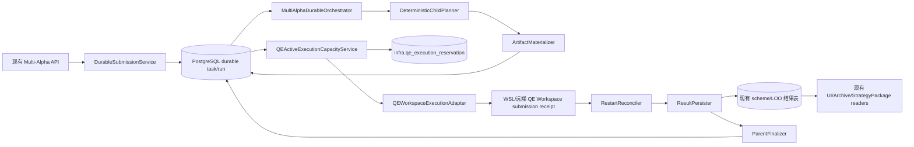

# 多 Alpha P0-1B 持久化执行适配器与 Orchestrator F2 详细设计

- 文档类型：F2 阶段从属实现级详细设计
- 父级权威：`docs/architecture/multi_alpha_qe_evolution_foundation_f2_design_20260718.md`
- 模块：QuantEvolver / Multi-Alpha combine-backtest / QE Workspace / PostgreSQL durable orchestration
- 日期：2026-07-19
- 状态：`IMPLEMENTED_VALIDATED_AWAITING_COMMIT_AND_RUNTIME_ACTIVATION`
- 实施修订：AIstock durable submission/orchestrator、跨来源 reservation ledger、QE Workspace submission receipt、Archive/read-model、execution deadline 证据与结果分类均已实现；BUG-785 初轮相关小矩阵为 `205 passed, 8 skipped`，二次审核后的修复点矩阵为 `45 passed, 3 skipped`，RD-Agent receipt/retry/path/tar 套件为 `24 passed`。更新后的 reservation DDL 已在现有 `127.0.0.1:5433/aistock_dev` 幂等执行两次并通过 preflight、容量原子性、active remote 冲突、终态 retry、lease takeover/fencing 和零残留清理验证；生产 DDL 未执行，代码尚未提交合入，WSL/远端 contract 尚未部署，backend 尚未重启激活
- 范围：仅 P0-1B；不提前实现 P0-2 控制恢复、P0-3 创建器或 P0-4 UI 运行网格
- 运行边界：QE-only；不得读写或调用 Selection、Advisory、Paper、模拟盘、QMT、实时荐股和生产交易路径
- 设计原则：在现有 combine-backtest、`QEWorkspaceClient`、P0-1A durable schema 和 QE Workspace 服务上增量改造；只增加共享执行 reservation ledger 与 submission receipt，不创建“多 Alpha v2”或平行平台
- 科研约束：不增加 PASS/KILL/GO/STOP、数据完整性淘汰、人工审批、promotion 审批或其他研究门禁；缺失数据和失败证据必须保留并可分析

---

## 1. 背景、结论与当前实施事实

P0-1A 已完成以下事实：

1. PR #2464 已合入 durable task/run/child/attempt/event models、repository、migration、schema preflight 和历史回填。
2. 2026-07-19 已在生产 `127.0.0.1:5432/aistock` 应用 migration，SQL 与 application preflight 均为 `ready`。
3. 生产历史回填已生成 12 个 task、关联 41/41 个 run、生成 138 个结果 child；没有伪造 attempt/event，保护摘要执行前后保持一致。
4. 当前 `MultiAlphaCombineBacktestService.submit_run()` 仍由 FastAPI 进程内 daemon thread 持有异步生命周期。
5. 当前 child pred-backtest 仍由 `ThreadPoolExecutor` 调度，节点占用仍包含进程内 `_NODE_RESERVATIONS`。
6. `RemotePredBacktestExecutor` 仍把“准备、提交、轮询、结果获取”压缩在一个同步调用中，并在返回 metrics 后才暴露远端 identity。
7. 当前 `QEWorkspaceClient.create_and_run_loop()` 与 `F:\Dev\RD-Agent-main\rdagent\app\api_endpoints\qe_evolution_api.py` 的 `LoopRunRequest` 都没有 idempotency/submission intent 字段；服务端每次 POST 都会再次注册 background task，客户端仅靠确定性 `task_id/Loop1` 不能证明远端只执行一次。
8. `qe_experiments` 没有权威 `node_id`，现有部分提交路径又在远端 POST 成功后才写 `assigned_node_id/qe_loop_id`；仅把多个业务表做读取并集不能形成“提交前已占位”的全局容量事实。

因此 P0-1B 的目标是让已经存在的 durable schema 成为新 combine-backtest 的权威业务运行状态，同时增加一个不复制业务指标的共享 QE execution reservation ledger，并为 WSL/远端 QE Workspace 增加服务端 submission receipt。两者共同关闭“远端响应丢失重复执行”和“提交后才记录节点导致容量超卖”的窗口。

P0-1B 完成后仍不能宣称整个多 Alpha 底座完成；pause/resume/cancel、三种 child retry、正式创建器和 child/attempt UI 属于 P0-2～P0-4。

## 2. 权威关系与设计边界

### 2.1 父蓝图继续负责

- P0-1～P0-4 总范围和实施顺序。
- F-201～F-218 总体验收要求。
- QE-only 隔离、UI 复用、禁止简化版、禁止静默错误和禁止研究门禁。
- P0-2～P0-4 的后续能力边界。

### 2.2 本文只细化

- F-204：attempt remote identity 与重启接管。
- F-205：WSL/远端统一 `QEWorkspaceClient` 执行。
- F-206：跨 QE 来源的 DB-backed 节点容量事实。
- F-209：child 结果、`not_computable` 和父状态聚合。
- F-210：P0-1B 所需 DB event 和状态原子性。
- F-215：现有组合、权重、LOO、回测与 Archive 结果 parity。
- F-216：QE-only 影响隔离和 schema-unavailable 可见性。
- F-218：restart、concurrency、identity、artifact 和 API 验证。

### 2.3 本文不是新的授权或审批层

本文中的状态验证、schema preflight、identity 校验和 CAS 是运行正确性合同，不是科研方向门禁。任何 child 的 `failed`、`not_computable` 或缺失制品都必须保留证据，不得据此自动删除 Alpha、淘汰研究方向或阻止其他实验设计。

### 2.4 BUG-785 实施审计修订

2026-07-20 按标准 BUG 流程复核现有实现后，修复以下六类执行正确性问题；这些修复不改变模型、因子、标签、组合公式或研究方向：

1. 跨来源 reservation 不再因终态记录永久占用 remote identity；公共 reconciler 依据精确 receipt intent 收口所有来源的终态并释放容量。
2. `waiting_capacity` 不再依赖 UI 再次点击；experiment scanner 自动重新调度普通 QE 和 multi-alpha 待容量节点。
3. retry 使用新的 source execution/intent identity；同一业务 `task_id/LoopN` 只有在前一 attempt 已终态时才能建立新 receipt，历史 receipt 保持不可变。
4. 远端已接受但本地 receipt、retry diagnostic 或 resource-session 状态持久化失败时，保留 `reconciling/running` 远端事实并显式记录错误，不得伪造业务失败；旧 worker 不得借用 successor fencing token 修改新 attempt 或 child。
5. durable orchestrator 暴露进程内 readiness/heartbeat；初始化失败持续重试，worker 未就绪或心跳过期时 write path 明确返回 503，不写入无人消费的 run。
6. RD-Agent 的 task/loop/model-source、experiment file 和 tar artifact 全部经过统一 workspace 边界解析，并使用验证后的目标落盘；拒绝 absolute/drive/parent escape、link/device/special tar member、重复目标和无效 base64，同时保留合法嵌套 `mlruns` 制品。

## 3. In Scope 与 Non-goals

### 3.1 In Scope

1. 现有 submit API 创建或复用 first-class durable task，并原子创建 durable run。
2. 从冻结 request 生成确定性的 baseline/scheme/LOO child plan。
3. 对 child prediction/config/artifact manifest 做可重入、原子发布的 materialization。
4. 为每个待执行 child 创建 initial attempt，并使用 lease/fencing/row-version CAS claim。
5. 以确定性远端 task/loop identity 调用 `QEWorkspaceClient`，WSL 与远端节点走相同生命周期接口。
6. 在远端调用前持久化 submission intent，并由 QE Workspace 服务端以相同 hash 建立原子 submission receipt；响应丢失后查询 receipt/loop，不重复注册第二个 background execution。
7. 抽取共享 QE active-execution capacity service；所有生产提交入口在远端 POST 前先写同一 reservation ledger，统一统计现有 QE 与 durable combine 活跃执行。
8. 节点满载时保持 `queued` + `phase=waiting_capacity`，不把实验伪造成失败。
9. 后端启动后核对 submitting/running/reconciling attempt，并恢复结果收集与父状态收口。
10. 保持现有 scheme/LOO 结果表、组合公式、Archive 和 StrategyPackage 消费语义不变。
11. 保持现有 read API/旧 task-key UI 在 P0-3 前继续可用。

### 3.2 Non-goals

- 不实现 pause/resume/cancel UI 或 remote kill 工作流；这些属于 P0-2。
- 不实现 `backtest_only`、`results_only`、`rematerialize_and_backtest` 的操作 API；P0-1B 只把 initial attempt 和自动结果恢复底座做完整。
- 不实现正式 task creator、多场景创建 UI 或旧 URL 重定向；这些属于 P0-3。
- 不实现 child/attempt grid、SSE 页面和操作面板；这些属于 P0-4。
- 不修改组合算法、权重公式、标签、模型、因子、训练、预测或回测指标定义。
- 不新增 GPU/显存/桌面资源轮询，不调用 `nvidia-smi`、NVML 或任何显卡遥测。
- 不创建平行业务 schema 或复制 scheme/LOO/metrics；P0-1B 允许通过 additive migration 新增唯一的 `infra.qe_execution_reservation` 共享容量 ledger。
- 不在代码中加入需人工批准才能运行的 enable gate、promotion gate 或研究准入流程。

## 4. 当前代码事实与精确缺口

| 当前符号 | 当前行为 | P0-1B 缺口 |
|---|---|---|
| `MultiAlphaCombineBacktestService.submit_run()` | 创建旧 run 后启动 `threading.Thread(..., daemon=True)` | API 进程退出后没有权威 owner；必须改为只提交 durable work |
| `_NODE_RESERVATIONS` | 当前 Python 进程内维护节点占用 | 多进程、重启和多后端不一致；必须由 DB 事实替代 |
| `DatabaseQENodeCapacityChecker` | 只读 `qe_evolution_loops`，满载直接抛错 | 未覆盖全部 QE 来源、存在竞态、满载不应失败 |
| `_run_prediction_tasks()` | `ThreadPoolExecutor` 持有 child 执行 | 后端重启丢失 future；必须由 durable attempt 驱动 |
| `ShellPredBacktestExecutor` | 本地 WSL subprocess 生命周期由后端持有 | WSL 也必须通过 QE Workspace 外部任务执行 |
| `RemotePredBacktestExecutor.execute_pred_backtest()` | materialize、submit、poll、collect 同步封装；内部 `asyncio.run()` | 远端 ID 无法在提交阶段持久化，无法分阶段恢复 |
| `QEWorkspaceClient` | 已支持 create/status/metrics/kill/file/list/cleanup，但 create 无 idempotency key | 继续作为统一客户端，并增加 submission intent/receipt contract；不得只在客户端假设幂等 |
| `MultiAlphaDurableRepository` | 已有 create、claim、heartbeat、CAS transition、event | 需要补 remote identity binding、recoverable listing 和容量原子 claim |
| `infra.dispatch_tasks` / 各 QE 业务表 | 各自记录部分 node/task/status；没有统一远端 identity、lease 与原子 reservation 合同 | 不复用为模糊容量计数；新增最小 `infra.qe_execution_reservation` 作为跨来源 slot 权威，不复制业务状态 |
| `MultiAlphaCombineUIAdapter` | 按 roster/normalize/walk-forward synthetic key 聚合旧 run | P0-1B 保持兼容；P0-3 再切换正式 task UI |
| `backend.main._lifespan()` | 已运行 QE evolution/status/archive 后台扫描任务 | 复用同一 lifespan 模式启动 durable orchestrator；DB 才是生命周期 owner |

## 5. 目标架构



核心所有权：

| 对象 | 权威所有者 |
|---|---|
| task/run/child/attempt 状态 | PostgreSQL durable tables |
| 状态迁移历史 | `multi_alpha_combine_backtest_event`，与 transition 同事务 |
| 远端执行身份 | attempt 的 `node_id/qe_task_id/qe_loop_id/submission_intent_hash` |
| 跨 QE 节点 slot | `infra.qe_execution_reservation`；只记录执行 identity/占用生命周期，不记录 Alpha 指标 |
| QE Workspace create 幂等 | 节点本地原子 submission receipt；相同 identity/hash 只注册一次 execution |
| 预测和配置制品 | child/attempt artifact manifest + 已验证文件/CAS URI |
| 远端实时状态 | 对应节点的 `QEWorkspaceClient` |
| scheme/LOO 业务指标 | 现有 scheme_result/loo 表，不复制到 durable 表 |
| Archive | 现有 QE Archive producer/reader |
| 进程内 asyncio task | 仅扫描和执行当前 lease，不是业务生命周期权威 |

## 6. 组件与文件设计

### 6.1 `durable_submission.py`

新增 `DurableCombineSubmissionService`，职责：

1. 调用现有 `parse_request()`，不复制 request 规则。
2. 调用现有 `preflight_pred_backtest_runtime()` 做提交前确定性参数检查；不得执行远端任务。
3. 解析 first-class task：
   - request 提供 `task_id` 时必须读取并验证 task identity；
   - 旧 API 未提供 `task_id` 时，按当前 `task_key_for_run()` 的 roster hash、normalize method、walk-forward signature 查找已回填 task；
   - 没有匹配 task 时创建确定性 implicit task，task ID 由同一 immutable identity payload 的 hash 生成；
   - task identity 只包含 roster hash/canonical roster、normalize method 和 walk-forward signature；`default_request_json` 中的 OOS、TopK、资金、baseline、node 与 timeout 是 run defaults，不参加 task identity 全量相等判断。
4. 构造 `DurableRunSpec` 和 canonical `request_hash`，调用 `MultiAlphaDurableRepository.create_run()`。
5. 返回 `task_id/run_id/status=queued/phase=submitted/durable=true`。
6. `run_async=true` 不启动 daemon thread。
7. `run_async=false` 只是在 durable submit 后等待 DB 终态；可选 `wait_timeout_seconds` 与执行 deadline 分离。等待超时返回 HTTP 202 和当前 durable status，连接断开或等待方退出不得取消 run；worker 仍可在重启后继续处理。

现有 `MultiAlphaCombineBacktestService` 保留为兼容 facade：组合纯函数、读取、Archive 和旧接口不复制；submit/retry 的新 run 创建委托 durable submission service。

### 6.2 `durable_plan.py`

新增 `DeterministicChildPlanner`：

- baseline key：`baseline:<baseline_leg_id>`，仅在配置 baseline 时存在。
- scheme key：`scheme:<normalized_scheme>`。
- LOO key：`loo:<normalized_scheme>:drop:<leg_id>`，仅当 roster 数量大于 2。
- ordinal 固定为 baseline、按请求 scheme 顺序、每个 scheme 下按 leg ID 排序的 LOO。
- `child_id=make_child_id(run_id, child_key)`，同一 run 重建得到相同 ID。
- `input_manifest` 必须包含 request hash、roster hash、child kind、scheme、dropped leg、OOS 窗口、backtest config hash、prediction source refs 和 planner version。
- planner 只依据冻结 request 生成计划；不得读取未来运行结果后增删 child。

所有计划 child 在昂贵 materialization 前创建。某个组合无法计算时更新现有 child 为 `not_computable` 并记录原因，不删除、不跳过、不影响其他 child 的研究证据。

### 6.3 `durable_execution_adapter.py`

新增 `QEWorkspacePredBacktestAdapter`，拆分为显式阶段：

1. `materialize_child_input()`：复用现有 panel builder、`combine_legs()`、`write_qlib_prediction()`、配置覆盖和 runtime template 函数。
2. `publish_artifacts()`：生成并验证 prediction/config/runtime manifest。
3. `prepare_submission_intent()`：生成确定性 task/loop identity，并在 DB 中绑定。
4. `submit()`：只负责调用 `QEWorkspaceClient.create_and_run_loop()`。
5. `inspect_remote()`：调用 `get_loop_status()`。
6. `collect_result()`：读取并验证 `qlib_results_enhanced.json`，生成 result manifest。

WSL 节点和远端节点都使用 `QEWorkspaceClient.for_node(node_id)`；新 durable path 不调用 `ShellPredBacktestExecutor`，也不在 `RemotePredBacktestExecutor` 中使用 `asyncio.run()`。现有 executor 可暂时保留供旧测试和代码回滚，但不得成为新 durable run 的隐藏 fallback。

### 6.4 `qe_active_execution_capacity.py`

新增共享 `QEActiveExecutionCapacityService` 与最小 `QEExecutionReservationRepository`，从现有 `DatabaseQENodeCapacityChecker` 和 custom-evo parallelism 逻辑抽取，不建立第二套 scheduler。实时容量只以 `infra.qe_execution_reservation` 的 active rows 为权威；各业务表继续持有自己的实验状态和指标。

它必须在同一 PostgreSQL 事务内：

1. 对 `qe_node_capacity:<node_id>` 获取 advisory transaction lock。
2. 只统计该 node 上 `reserved/submitting/running/reconciling` reservation；同一 reservation 只计一次，不从多个业务表重复拼接 active count。
3. 在容量允许时，以确定性的 `reservation_id=hash(source_kind, source_execution_id)` 插入 reservation，并在同一事务内 claim/更新对应 source row；durable combine 必须同时完成 attempt `queued -> submitting`。
4. reservation 在远端 POST 前已经包含 node、expected `qe_task_id/qe_loop_id` 和 `submission_intent_hash`；`source_kind/source_execution_id` 永久唯一，`node_id/qe_task_id/qe_loop_id` 仅在 active reservation 上唯一。前一 attempt 终态后，同一业务 remote identity 可由新的 source execution/intent 合法重试，历史 reservation 不删除、不覆盖。
5. 容量不足时不插入 active reservation，source 保持 `queued`，写入 `waiting_capacity` event/progress 后返回无任务；experiment scanner 后续自动重调度，不要求 UI 刷新或再次点击。
6. 本阶段必须把所有生产 `QEWorkspaceClient.create_and_run_loop()` 提交入口接入同一 coordinator/acquire 原语，避免任一旧入口绕开相同 advisory key 后形成容量竞态。

现有活跃任务只在 P0-1B 激活前做一次受控导入：从 `qe_evolution_loops`、`qe_multi_alpha_groups`、`qe_experiments` 和 QE Workspace 节点查询交叉核对 node/remote identity，再创建 reservation。无法唯一确定节点的活跃任务必须形成结构化 `qe_capacity_identity_unresolved` 诊断；只让相关节点保持 queue-only，其他节点和已运行研究不受影响。不得把无法识别的执行静默漏计，也不得据此淘汰研究方向。

容量合同：

- WSL 节点有效上限不超过 2。
- 远端节点有效上限不超过 4。
- request/node config 可以降低上限，不得静默提高硬上限。
- 满载是排队状态，不是 Alpha 失败。
- capacity service 不采集 GPU、显存或桌面遥测。
- reservation lease 只控制谁可以更新记录；lease 过期不自动释放 slot。只有权威 remote terminal/明确未提交事实才能 release，网络未知继续占用并进入 reconciling。
- 公共 reservation reconciler 扫描所有 active 来源，以 `(task_id, loop_id, submission_intent_hash)` 精确核对 receipt；权威 terminal 恰好释放一次，`not_reserved` 保持可重提的 reconciling 事实，任何本地持久化异常都不得把已接受远端任务伪造成失败。

### 6.5 `durable_orchestrator.py`

新增 `MultiAlphaDurableOrchestrator`，一个实例包含以下短周期扫描器：

- run planner：claim `queued/preparing` run，创建/核对 child plan 和 initial attempts。
- dispatch scanner：按节点容量 claim `queued` attempt，准备 submission intent 并提交。
- reconcile scanner：claim submitting/running/reconciling attempt，核对远端状态并收集结果。
- parent finalizer：对 child 已全部 terminal 的 run 做确定性聚合和 terminal transition；独立 archive-capture pass 在终态提交后处理归档。

后台 task 可由每个 backend 实例启动，但 PostgreSQL lease/fencing/CAS 保证同一实体只有一个有效 owner。进程内 task 取消或进程退出只导致 lease 到期，不改变远端任务状态，也不把 run 标记失败。

worker 对 attempt/child 的任何 mutation 都必须携带自己 claim 时取得的 owner/fencing/row-version lineage。重新读取到 successor 的新 token 不等于旧 worker 重新取得所有权；lineage 不匹配时必须停止写入，由当前 owner 继续处理。

### 6.6 `backend/main.py`

沿用当前 QE scanner 的 lifespan 模式：

- 启动时创建一个 orchestrator loop。
- shutdown 时设置 stop event，只停止新 claim 和本地轮询，不调用 remote kill。
- loop 周期、lease 和 heartbeat 使用有界环境配置；默认值写入代码并接受测试，不添加人工 enable/approval gate。
- orchestrator 初始化失败时记录结构化错误并按 poll interval 持续重试，不得让 background task 静默退出；成功完成初始化和首轮调度准备后更新 process-local readiness/heartbeat。
- multi-alpha durable write path 在建 run 前核对同进程 worker readiness 与 heartbeat；未启动、初始化失败或心跳过期时返回明确 503，不创建无人消费的 durable run。该检查只保证运行正确性，不是研究门禁或人工审批。
- schema 不可用时记录结构化 `multi_alpha_durable_schema_unavailable`，multi-alpha 写接口返回明确 503；非 QE 模块和已有 QE 读取接口继续运行，禁止回退到 daemon path。

### 6.7 两阶段结果收口

远端 child 完成不等于 scheme/LOO 业务行已经可写。新增 `DurableBusinessResultAssembler`（放在 `durable_orchestrator.py`，不建立新平台）：

1. attempt 收回并验证 `qlib_results_enhanced.json` 后，先把 raw scalar metrics、artifact URI/hash 写入 `attempt.result_manifest_json`，attempt transition 为 `succeeded`。
2. child 保持 `reconciling`，并设置 `selected_attempt_id`；该状态明确表示“远端结果有效，等待业务依赖收口”。
3. baseline child 不写 scheme/LOO 表；其 selected attempt metrics 是后续 delta 的权威基线。
4. scheme child 只有在 requested baseline 已成功或 request 没有 baseline 时，才计算 `vs_baseline_*` 并写现有 scheme_result 表。
5. LOO child 只有在同 scheme full child 已成功并可读取其 raw metrics 时，才计算 marginal 并写现有 LOO 表。
6. full scheme 明确 `failed/not_computable/cancelled` 时，其 LOO child 转为 `not_computable`，reason 为 `loo_full_scheme_unavailable`；不伪造 marginal 0。
7. 业务结果 INSERT 与 child `reconciling -> succeeded/not_computable`、selected attempt 和 event 必须在同一 PostgreSQL transaction 中完成。
8. 已存在同 identity 业务行时先 exact compare；完全一致视为幂等成功，不一致报 `multi_alpha_business_result_identity_conflict`，禁止覆盖。

## 7. Task 与 Run 身份解析

### 7.1 旧提交 API

旧 `POST /multi-alpha/combine-backtest/run` 没有 first-class `task_id`。P0-1B 必须保持兼容：

1. 计算与当前 UI adapter 一致的 implicit group identity：`roster_hash + normalize_method + walk_forward_signature`。
2. 优先复用历史回填后已绑定同组 run 的 task。
3. 不存在时，以 canonical group identity hash 创建 `mact_auto_<digest>`。
4. 任务 identity 冲突必须返回结构化错误，不新建一个“差不多相同”的 task。

task 的 immutable identity 明确冻结为：

- `roster_hash` 与 canonical `roster_json`；
- `normalize_method`；
- `walk_forward_signature`；
- 由以上字段生成的 `legacy_group_key` 和 deterministic implicit task ID。

`default_request_json` 是创建器和旧 API 的默认模板，不是完整 identity。OOS 日期、TopK、initial cash、持仓配置、baseline leg、node、scheme/run/read timeout 可以在同一 task 的不同 run 中变化；提交新 run 时不得因这些字段不同创建第二个 task，也不得隐式改写既有 task defaults。

### 7.2 显式 task

为 P0-3 预留可选 `task_id`，但 P0-1B 不开发创建器 UI。显式 task 必须已存在，且上述 immutable identity 与提交 payload 相容；run 场景参数只写入新的 run/request hash，不参与 task identity 冲突。任何不相容都返回结构化 409，不允许静默改写 task。

### 7.3 Run identity

- 保留现有 `macb_*` run ID 格式和 read API。
- `request_hash` 来自 `DurableRunSpec.canonical_request_payload()`。
- 同一用户重新提交相同 payload 仍可生成新的 run，用于不同执行时间/场景记录；task identity 相同不代表 run 去重。
- multi-alpha run retry lineage 只通过 `retry_of_run_id` 表达；P0-2 再开放其正式控制操作。既有 QE loop retry 已使用新的 source execution/intent attempt identity，capacity-wait resume 则复用原 attempt identity，两种语义不互相替代。

## 8. Child Plan 与 Materialization

### 8.1 两阶段计划

1. `plan`：只生成 child identity 和输入 manifest，不执行组合或回测。
2. `materialize`：逐 child 生成 prediction/config/runtime 文件，并更新 artifact URI/hash。

这样后端在 materialization 中断后可以根据同一 child ID 重做，不会生成重复 child。

### 8.2 原子制品发布

- 每个 child 使用独立 workspace：`<root>/<run_id>/<child_id>/`。
- 先写同一文件系统下的临时文件，再计算 SHA256/size，最后使用原子 rename 发布正式文件。
- DB 只在 rename 和 hash 校验成功后写 artifact manifest/child transition。
- 重启发现 `materializing` 且 lease 已失效时允许重新生成相同内容；正式文件 hash 相同则复用，hash 不同必须报 identity/artifact mismatch。
- 不递归删除不属于当前 child 的目录，不通过清理掩盖冲突。

### 8.3 `not_computable` 与 `failed`

- 数学上无法形成组合、覆盖率不足或 LOO 前提不满足：`not_computable`，保留原因和输入证据。
- 文件损坏、网络、程序异常、hash 冲突或远端执行失败：`failed`。
- 分类不用于自动淘汰 Alpha；父 run 和 UI 必须保留两类结果。

### 8.4 显式状态迁移

| 阶段 | Child transition | Attempt transition | 说明 |
|---|---|---|---|
| 计划创建 | `pending` | 无 | child identity 已持久化，尚未生成制品 |
| 制品生成 | `pending -> materializing -> queued` | `queued` | artifact 原子发布后才进入 queued |
| 获得容量 | `queued -> running` | `queued -> submitting` | attempt claim 与 reservation INSERT 同事务 |
| 远端确认 | `running` | `submitting -> running` | receipt/remote status 已确认 |
| 远端未知或已完成待收口 | `running -> reconciling` | `submitting/running -> reconciling` | 保留 slot，继续核对或收集结果 |
| 结果有效 | `reconciling -> succeeded/not_computable` | `reconciling -> succeeded` | attempt 原始结果先成功，child 再等待业务依赖 |
| 技术失败/明确取消 | `* -> failed/cancelled` | `* -> failed/cancelled` | 只依据明确远端或本地证据，不猜测 |

任何实现不得跳过 `materializing/submitting/reconciling` 而把无证据任务直接写成 terminal；状态 event 与 transition 必须同事务。

## 9. Attempt 与远端提交 identity

### 9.1 Initial attempt

每个可执行 child 创建 `attempt_no=1/retry_mode=initial/status=queued`。P0-1B 不为已回填历史 child 伪造 attempt，也不自动为 `not_computable` child 创建远端 attempt。

### 9.2 确定性远端 identity

每个 attempt 使用：

- `qe_task_id = make_remote_task_id(run_id, child_id, attempt_no)`；
- 每个 attempt 使用独立 remote task，固定 `loop_index=1`；
- 预期 `qe_loop_id=Loop1`，接受 QE API 返回的规范等价形式，但归一化后必须等于预期；
- `submission_intent_hash` 覆盖 child、attempt、retry lineage、node、task 和 loop identity。

### 9.3 先绑定、后提交

新增 repository 原语 `bind_attempt_remote_identity()`：

1. 要求有效 attempt ownership token、状态 `submitting`、lease 未过期。
2. 以 CAS 写入 node/task/loop/submission intent，并同事务插入 `submitted` intent event。
3. 事务提交后才允许执行远端 POST。

如果 HTTP 返回前连接中断，reconciler 必须先查询同一 `task_id/Loop1`：

- 查到任务：继续核对，不重复 POST。
- 查到相同 submission receipt：按 receipt 状态继续核对；即使 loop status 尚未生成也不得重复注册 execution。
- 只有 QE Workspace receipt API 权威返回 `not_reserved` 时，才允许以相同 identity/hash 再次 POST；普通 loop status 404 不能证明未接收。
- 网络未知：保持 `reconciling`，不得创建新 identity。

任何 QE API 返回不同 loop identity 的情况都必须 fail loud，并记录 expected/actual；不得静默接受后形成不可核对的映射。

### 9.4 QE Workspace 服务端 submission receipt

客户端 bind-before-submit 不能独立提供 exactly-once。P0-1B 必须包含 QE Workspace owning repository `F:\Dev\RD-Agent-main` 的配套变更，至少修改 `rdagent/app/api_endpoints/qe_evolution_api.py` 及其测试：

1. `LoopRunRequest` 增加必填 `submission_intent_hash`；AIstock `QEWorkspaceClient` 不得在 durable/coordinated submit 中省略该字段，receipt inspect 必须可按 exact intent 查询。
2. 服务端以 `(task_id, loop_id, submission_intent_hash)` 标识一次执行 attempt，并以 `(task_id, loop_id)` 的跨进程锁串行化同一业务 Loop 的 receipt 决策。receipt 存放在 Loop workspace 之外的 task-level receipt 目录，持久化 intent hash、canonical request digest、状态和时间戳；Loop 清理不得删除历史 receipt。Request digest 覆盖 `loop_index/config/experiment_files` 内容 hash、`wsl_command/model_source`，不把仅用于通知的 `callback_url` 当作执行 identity。
3. 第一次请求先原子持久化 `reserved` receipt，再注册一次 background execution；相同 intent/hash/digest 的重复 POST 返回原 loop/receipt，`duplicate_replay=true`，不得再次调用 `background_tasks.add_task()`。
4. 同一业务 Loop 的最新 receipt 尚未终态时，不同 intent 或不同 canonical request digest 返回 HTTP 409 与 `qe_workspace_submission_identity_conflict`；最新 receipt 已终态后，新的 source execution/intent 可建立下一份 receipt 并复用业务 `task_id/LoopN`。新 attempt 启动前可清理旧 Loop workspace，但不得覆盖或删除旧 receipt。
5. receipt 已为 `reserved`、但还没有 started evidence 时不得自动注册第二次 execution；状态 API/receipt API 返回 `reserved_not_started`，AIstock 保持 reconciling。retry 必须使用新的 source execution/intent，capacity-wait 恢复则复用原 attempt identity，二者不得混淆。
6. receipt 状态至少覆盖 `reserved/started/running/completed/failed/cancelled`，并可在 loop status 文件尚未产生时独立查询；旧版单文件 `LoopN.json` receipt 必须可读，并在状态 transition 时迁移为 intent-hash receipt，不得丢失历史事实。
7. worker 必须统一验证 task/loop identity、同节点 `model_source` 和所有 `experiment_files` 输出目标都解析在配置的 workspace/目标 Loop 内，并且实际写入必须使用验证后的 Path；base64 必须严格校验。tar artifact 必须先全量验证 member，再只写 regular file/directory；拒绝 absolute/drive/parent escape、symlink/hardlink/device/special member 和重复目标，同时保留合法嵌套 `mlruns` 文件。
8. WSL 与远端节点部署相同 contract。AIstock 后端不得在任一节点仍运行旧 OpenAPI schema 时激活 coordinated submit，也不得回退为无 receipt POST；这只约束执行正确性，不限制研究方向。

配套服务变更与 AIstock 代码可以分别提交，但运行激活顺序必须先部署并验证两节点 receipt contract，再启动新的 AIstock coordinator。

## 10. QE Workspace 统一执行

### 10.1 WSL 与远端一致

- node catalog 是 endpoint 权威；使用 `QEWorkspaceClient.for_node(node_id)`。
- `wsl2-5080` 也通过本机 QE Workspace API 执行，不由 FastAPI 直接持有 WSL subprocess。
- 远端继续复用现有 artifact endpoint 和 small-file sync 能力。
- callback 可以作为加速通知，但 DB scanner 必须在没有 callback/UI/SSE 的情况下完成收口。

### 10.2 状态映射

| QE Workspace 状态 | Durable attempt 行为 |
|---|---|
| queued/pending/submitted | 保持 submitting/running，记录 remote status |
| running/processing | running，续租并记录 heartbeat |
| completed | 进入 reconciling，拉取并验证结果，随后 succeeded |
| failed | failed，保留远端 reason/log ref |
| cancelled/interrupted | cancelled 或 failed，按远端明确语义记录，不猜测 |
| receipt reserved、loop 尚未 started | reconciling + `reserved_not_started` evidence；不重复 POST，capacity-wait 恢复继续使用原 attempt identity |
| timeout/deadline exceeded 但远端仍 running | reconciling + deadline evidence，继续保留结果回收，不伪造失败 |
| loop status 404、receipt 存在 | 按 receipt 状态核对；404 不触发重提 |
| loop status 404、receipt 权威 not_reserved | 当前 owner 可用相同 identity/hash POST |
| 网络错误或未知状态 | reconciling，记录错误；不重复提交新 task |

### 10.3 Timeout、deadline 与同步等待

三类时间语义必须分离，不得共用一个模糊的“超时即失败”分支：

| 类型 | 来源 | 到期行为 |
|---|---|---|
| HTTP/client transport timeout | `QEWorkspaceClient` 内部连接/读写配置 | 进入 `reconciling` 并查询 receipt/remote status；不推断远端失败 |
| child/run execution deadline | 现有 `scheme_timeout_seconds` / `run_timeout_seconds` | 写 `deadline_exceeded` event/progress；只要远端仍 running/unknown 就保持非终态并继续回收结果，最终按权威 remote/result 状态收口 |
| synchronous wait timeout | additive `wait_timeout_seconds`，仅 `run_async=false` 使用 | 返回 HTTP 202、`wait_timed_out=true` 和当前 durable 状态；不取消、不失败、不影响 worker |

为兼容旧请求，`wait_timeout_seconds` 未提供时默认取 `run_timeout_seconds`。deadline 之后成功返回的有效结果仍持久化，并标记 `completed_after_deadline=true` 供研究分析；不得仅因 deadline 丢弃已完成 loop。P0-2 若以后支持显式 cancel，仍由用户操作决定是否终止远端任务，不把 deadline 偷换成自动取消。

## 11. 节点容量与排队算法

### 11.1 Canonical execution reservation

共享 ledger 输出最小强类型记录：

```text
reservation_id
node_id
source_kind
source_execution_id
qe_task_id
qe_loop_id
submission_intent_hash
status
owner_id / lease_expires_at / fencing_token / row_version
reserved_at / heartbeat_at / released_at
```

SQL 只读取执行调度所需字段，不加载 metrics、prediction 或大型 JSON。业务表与 reservation 的关系是 source reference，不把实验指标、组合结果或完整 request 复制进 ledger。

### 11.2 原子 claim

容量检查、reservation INSERT 和 source claim 必须在同一 transaction/advisory lock 下完成。禁止以下拆分：

1. 先 SELECT active count；
2. 释放事务；
3. 远端 POST 后再补写 reservation 或 claim source。

该拆分会在多个 worker 下超卖容量。

### 11.3 与现有 QE 路径共用

P0-1B 必须覆盖当前生产代码中的所有直接 QE Workspace 提交点，包括：

- durable combine execution adapter；
- `backend/services/quantevolver/executors/backtest.py`；
- `backend/services/quantevolver/multi_alpha_result_collector.py` 的统一回测提交；
- `backend/routers/quantevolver.py` 中仍存在的分布式/主节点提交；
- custom/auto evolution 实际调用的统一 executor。

这些调用点统一通过 `QEWorkspaceSubmissionCoordinator` 获取持久化 reservation 后再调用 client。Coordinator 接受强类型 `source_kind/source_execution_id/node_id/qe_task_id/qe_loop_id/submission_intent_hash`，在同一容量事务内创建 reservation 并调用 source-specific claim callback。既有业务 request、任务 ID、结果收集和状态语义不改变；只统一容量事实、advisory key 和满载排队行为。代码审查必须证明生产路径不存在绕过 coordinator 的直接 `create_and_run_loop()` 调用，测试 double 除外。

`qe_experiments`、`qe_multi_alpha_groups` 或 `qe_evolution_loops` 的字段不再被当作原子 reservation 替代品；它们只用于 source 状态展示、激活前导入和一致性核对。这样避免“远端已经开始、业务表尚未写 node/loop”的不可见窗口。

### 11.4 满载语义

- attempt：`queued`；phase/event：`waiting_capacity`。
- child：`queued`。
- run：`preparing` 或 `running`，progress 显示节点 active/limit。
- 不写 `error_code`，不进入 failed。
- 下一次扫描重新尝试，不依赖 UI 刷新。

## 12. Orchestrator 运行循环

### 12.1 Run planner pass

1. claim run。
2. 验证 request identity。
3. transition `queued -> preparing`。
4. 创建/核对 deterministic child plan。
5. materialize 可执行 child，并创建 initial attempts。
6. transition `preparing -> running`。

### 12.2 Dispatch pass

1. 按 node 和 queued_at 选择 attempt。
2. 共享 capacity transaction 原子 claim。
3. 同事务创建 execution reservation，并绑定 deterministic remote identity/submission intent。
4. 携带 `submission_intent_hash` 提交 QE Workspace。
5. 核对服务端 receipt 与实际返回 identity，transition 到 running；hash/identity 冲突 fail loud。

### 12.3 Reconcile pass

1. claim submitting/running/reconciling attempt。
2. 查询 remote status。
3. running 时 heartbeat；unknown 时保持 reconciling。
4. completed 时下载结果到临时文件、校验、原子发布 result manifest。
5. attempt transition 为 succeeded，child 进入 reconciling 并选择该 attempt。
6. business result assembler 等待 baseline/full-scheme 依赖，写入现有 scheme/LOO 结果表后再 terminal child。
7. 只有权威 remote terminal 或 receipt 明确 `not_reserved` 才 release reservation；网络未知、deadline exceeded 和本地 lease 过期均不得释放 slot。

### 12.4 Parent finalization pass

只有所有计划 child terminal 且预期业务行已完成 exact readback 时才收口：

1. run 已进入取消流程且没有仍成功完成的必要 child：`cancelled`；P0-2 才开放该控制入口。
2. request 指定 baseline，而 baseline child 不是 `succeeded`：`failed`。
3. 成功 scheme 数量为 0：`failed`。
4. 成功 scheme 数量大于 0，并存在任一 `failed/not_computable/cancelled` child：`partial_failed`。
5. baseline（如有）、全部 scheme 和全部计划 LOO 均 `succeeded`：`succeeded`。
6. 不计划的 LOO（例如 roster 数量不大于 2）不参与 partial 判定；planner 不创建该 child。
7. parent terminal transition 与业务结果 readback 在同一事务收口；Archive 不放进该事务，也不阻止 terminal commit。

### 12.5 Archive capture pass

Archive handler 只接受 terminal run，因此归档必须是独立、可重入的 post-terminal pass：

1. 扫描 terminal run，基于 source system、run ID 和 archive schema version 生成确定性 event ID。
2. 调用现有 `QEArchiveEventCapture`；outbox `ON CONFLICT(event_id) DO NOTHING` 保证重复 pass 不重复归档。
3. capture 成功、duplicate、disabled、初始化失败或 enqueue 失败都追加独立 durable event，分别使用 `archive_enqueued/archive_duplicate/archive_skipped_disabled/archive_error`。
4. run list/detail read model 从 durable event 与 QE Archive outbox 派生 `archive_status/archive_reason`；不修改 terminal run status，不覆盖 scheme/LOO metrics，也不要求放宽 terminal transition。
5. Archive 恢复后只重试同一确定性 event，不重算组合、prediction 或回测。

## 13. Restart、Crash Window 与恢复语义

| 中断点 | DB 可见事实 | 恢复动作 |
|---|---|---|
| run 创建后、planner 前 | queued run | 新 owner claim 后生成同一 child plan |
| child 创建后、artifact 发布前 | pending/materializing child | 重新 materialize；hash 相同复用 |
| artifact 发布后、attempt 创建前 | child artifact hash/URI | 创建确定性 initial attempt |
| attempt claim 后、identity bind 前 | submitting attempt，无 remote identity | lease 过期后重新 claim并绑定同一 identity |
| reservation/identity bind 后、HTTP 前 | DB reservation + submission intent 已持久化 | 查询 submission receipt；receipt not_reserved 才以相同 hash 提交 |
| 服务端 receipt 已 reserved、background 尚未 started | receipt=`reserved_not_started` | 保持 reconciling，不重复注册；只有该 receipt 终态后，显式 retry 才能用新 source execution/intent 创建下一 attempt |
| HTTP 已接受、响应丢失 | DB intent + 服务端 receipt | 查询同 identity/hash；禁止新建第二 task 或再次注册 execution |
| remote completed、结果未下载 | running/reconciling + remote identity | 下载并校验结果 |
| result 文件已发布、DB 未 terminal | result manifest 可重建 | 幂等写结果表并 terminal transition |
| child terminal、parent 未 final | terminal children | deterministic parent finalizer 重跑 |
| run terminal、Archive 未入队/失败 | terminal run + archive durable event/outbox state | 使用相同 event ID 补归档，不回滚 run |
| backend shutdown | lease 最终过期，remote 继续 | 新实例接管核对，不 kill remote |

## 14. Lease、Heartbeat 与事务边界

- owner ID：`macb-worker:<hostname>:<pid>:<process-uuid>`，新进程必须生成新 owner。
- lease、heartbeat、poll interval 均为有界配置；heartbeat 必须显著短于 lease。
- 远端 HTTP、文件上传、结果下载和组合计算期间不得持有数据库 transaction。
- 每个状态 transition 与对应 DB event 同事务。
- 所有 owner 写入必须携带 owner/fencing/row_version，lease 过期立即失权。
- stale owner 发现 CAS 失败后停止写入，不以最后写入覆盖新 owner。
- 一个 scanner item 失败不终止整个后台 loop，但必须记录结构化错误和 traceback；不能 `except: pass`。

## 15. API 与兼容语义

### 15.1 保持的接口

- `POST /multi-alpha/combine-backtest/run`
- `GET /multi-alpha/combine-backtest/runs/{run_id}`
- `GET /multi-alpha/combine-backtest/runs`
- 现有 logs/archive/read/task adapter 路径

### 15.2 Submit response

新增字段均为 additive：

```json
{
  "task_id": "mact_...",
  "run_id": "macb_...",
  "status": "queued",
  "phase": "submitted",
  "durable": true
}
```

当 `run_async=false` 时：

- terminal 在 `wait_timeout_seconds` 内完成：返回 HTTP 200 和 terminal durable payload。
- wait 到期但 run 未 terminal：返回 HTTP 202，增加 `wait_timed_out=true`、`status/phase/progress`；run 继续执行。
- 客户端断开：不触发 cancel、不释放 reservation、不修改 run/child/attempt 状态。

### 15.3 错误合同

- schema 不可用：HTTP 503，`reason_code=multi_alpha_durable_schema_unavailable`。
- identity 冲突：HTTP 409。
- QE Workspace submission receipt hash/request digest 冲突：HTTP 409，`reason_code=qe_workspace_submission_identity_conflict`。
- request/preflight 错误：HTTP 400，保留当前结构化 payload。
- 内部/DB 错误：HTTP 500，并在可创建 run 后写入 durable error event。
- 禁止 schema 不可用时回退旧 daemon thread 并返回成功。

### 15.4 旧 read/UI

P0-1B 不移除 synthetic task-key read model。新 run 同时写入已有 run/result 表，因此现有详情、trajectory、Archive 和 StrategyPackage consumer 继续工作。P0-3 再把正式 task API 接入规范 QE 页面。

## 16. 结果与 Archive Parity

P0-1B 必须复用：

- `combine_legs()`、rank fusion、walk-forward 权重和现有 scheme 列表。
- `metric_columns()`、weights/per-window weights 和 LOO marginal 公式。
- `multi_alpha_combine_backtest_scheme_result`、`multi_alpha_combine_backtest_loo`。
- Prediction Store upload 与 manifest 语义。
- QE Archive event capture 和 existing archive-status/archive API。
- StrategyPackage 从 combine run 读取的业务字段。

禁止把指标复制到 durable child/attempt JSON 后改用新公式读取。Durable 层记录生命周期和制品 lineage；现有结果表继续记录业务结果。

Archive parity 的精确定义：

- Archive handler 输入仍来自 terminal run 与现有 scheme/LOO 结果，不改 payload 业务含义。
- terminal status 与 Archive transport 状态分离；后者通过 durable event + outbox/read model 可见。
- capture disabled 不是成功，也不静默；显示 `archive_skipped_disabled`，恢复配置后可用相同 event ID 补归档。
- Archive 失败不得让已成功的 child/run 指标变成失败或空值，也不得阻止后续研究分析。

## 17. Schema 与 Repository 增量

### 17.1 Additive reservation DDL

P0-1A schema 已具备 task/run/child/attempt/event 等业务生命周期对象，但不足以在所有 QE 来源远端 POST 前形成统一容量 reservation。P0-1B 新增 `infra.qe_execution_reservation`，且只承担跨来源执行 slot 与 remote identity 生命周期：

| 列 | 合同 |
|---|---|
| `reservation_id` | TEXT PK；由 source kind/execution identity 确定生成 |
| `node_id` | TEXT NOT NULL，引用 `infra.compute_nodes(node_id)` |
| `source_kind/source_execution_id` | 强类型 attempt 来源映射；永久组合唯一，禁止同一 source execution 重复占位；retry 必须生成新的 source execution identity |
| `qe_task_id/qe_loop_id/submission_intent_hash` | POST 前必填；`node_id+qe_task_id+qe_loop_id` 仅对 `reserved/submitting/running/reconciling` active rows 唯一，终态历史不阻塞后续合法 retry |
| `status` | `reserved/submitting/running/reconciling/released/failed/cancelled` CHECK |
| `remote_status/release_reason_code` | 最近远端事实和释放原因；不得保存完整 metrics |
| `owner_id/lease_expires_at/fencing_token/row_version` | 更新 ownership；lease 过期不自动释放 slot |
| `reserved_at/heartbeat_at/released_at/created_at/updated_at` | 数据库时钟审计字段 |

必须提供 active node partial index、source identity permanent unique constraint、active remote identity partial unique index `uq_qeer_remote_identity_active`、comments、preflight 和 guarded rollback。migration 必须幂等移除旧的永久 `uq_qeer_remote_identity` constraint，保留全部终态行。该表不是第二套 scheduler，也不替代 `qe_evolution_loops`、`qe_experiments`、`qe_multi_alpha_groups` 或 durable attempt；source 业务状态仍由原表权威持有。

任务表不新增场景字段。实现需修改 repository identity compare：`default_request_json` 不再整体参与 task identity；只比较 canonical roster、roster hash 和 canonical group identity。既有默认 request 不被隐式覆盖。

### 17.2 Repository 新原语

计划新增：

- `find_task_for_implicit_group(...)`
- `list_recoverable_runs(...)`
- `list_recoverable_attempts(...)`
- `bind_attempt_remote_identity(...)`
- `reserve_execution_and_claim_source(...)`，在同一 advisory transaction 内 INSERT reservation + source claim
- `heartbeat_execution_reservation(...)`
- `release_execution_reservation(...)`，要求权威 terminal/not-reserved evidence
- `update_attempt_remote_status_with_event(...)`
- `finalize_child_result(...)`
- `list_run_terminal_summary(...)`
- `append_archive_delivery_event(...)` 与 archive-derived read model

每个方法都必须有结构化 reason code、类型/identity 校验和 PostgreSQL 集成测试。不得通过通用 `execute_sql()` 绕过 repository contract。

## 18. 文件修改计划

### 18.1 新文件

- `backend/migrations/qe_execution_reservation_20260719.sql`
- `backend/migrations/qe_execution_reservation_20260719.preflight.sql`
- `backend/migrations/qe_execution_reservation_20260719.rollback.sql`
- `backend/services/multi_alpha/durable_submission.py`
- `backend/services/multi_alpha/durable_plan.py`
- `backend/services/multi_alpha/durable_execution_adapter.py`
- `backend/services/multi_alpha/durable_orchestrator.py`
- `backend/services/multi_alpha/durable_runtime_health.py`
- `backend/services/quantevolver/qe_active_execution_capacity.py`
- `backend/services/quantevolver/qe_execution_reservation.py`
- `backend/tests/multi_alpha/test_durable_submission.py`
- `backend/tests/multi_alpha/test_durable_plan.py`
- `backend/tests/multi_alpha/test_durable_execution_adapter.py`
- `backend/tests/multi_alpha/test_durable_capacity.py`
- `backend/tests/multi_alpha/test_durable_orchestrator_restart.py`
- `backend/tests/multi_alpha/test_durable_parent_finalization.py`
- `backend/tests/multi_alpha/test_durable_contract.py`
- `backend/tests/multi_alpha/test_durable_parity.py`
- `backend/tests/multi_alpha/test_archive_health.py`

### 18.2 修改文件

- `backend/services/multi_alpha/combine_backtest.py`
  - submit 委托 durable service；提取并复用纯组合/materialization函数；新 async run 不再启动 daemon thread。
- `backend/services/multi_alpha/remote_dispatch.py`
  - 保留 artifact/path helper；把同步全生命周期 executor 拆为 adapter 可复用阶段。
- `backend/services/multi_alpha/durable_models.py`
  - 增加 implicit task/expected loop identity helper；不改变现有状态词汇。
- `backend/services/multi_alpha/durable_repository.py`
  - 增加 remote binding、recoverable query、task immutable identity compare、result finalization 和 archive delivery event 原语。
- `backend/services/quantevolver/qe_workspace_client.py`
  - create 必须传 `submission_intent_hash`，并增加 receipt inspect/normalized identity helper；不复制客户端。
- `backend/services/quantevolver/executors/backtest.py`
  - QE Workspace 提交委托共享 submission coordinator，保持现有 backtest request/result 语义。
- `backend/services/quantevolver/multi_alpha_result_collector.py`
  - 统一回测提交接入相同 capacity reservation；结果收集公式不变。
- `backend/services/quantevolver/qe_evolution_service.py`
  - custom/auto loop capacity 进入点复用共享 capacity service；显式 retry 创建新的 source execution/intent identity，capacity resume 复用原 identity。
- `backend/services/quantevolver/qe_experiment_status_scanner.py`
  - 自动恢复 `waiting_capacity` 的普通 QE experiment 和 multi-alpha pending node，不依赖 UI 重提。
- `backend/routers/quantevolver.py`
  - 当前仍存在的直接 QE Workspace submit 调用改为共享 coordinator；不改路由业务 payload。
- `backend/main.py`
  - lifespan 启停 durable orchestrator 与跨来源 reservation reconciler，并维护 worker readiness/heartbeat。
- `backend/routers/multi_alpha.py`
  - additive task_id/durable response、`wait_timeout_seconds`、HTTP 202 和结构化 503/409 映射。
- `backend/tests/test_multi_alpha_combine_backtest.py`
- `backend/tests/test_multi_alpha_remote_dispatch.py`

### 18.3 QE Workspace owning repository 配套修改

P0-1B 的 exactly-once execution contract 不能只在 AIstock 仓库实现。需要在 `F:\Dev\RD-Agent-main` 单独提交并部署：

- `rdagent/app/api_endpoints/qe_submission_receipt.py`
  - intent-hash receipt ledger、Loop 级跨进程锁、terminal retry、legacy receipt migration 与严格状态机。
- `rdagent/app/api_endpoints/qe_evolution_api.py`
  - `LoopRunRequest.submission_intent_hash`、exact-intent receipt inspect、same-intent replay、nonterminal conflict、terminal retry、workspace path/tar 安全。
- `rdagent/app/api_endpoints/qe_workspace_catalog.py`
  - Windows extended path normalization 后再执行 workspace boundary 校验，不放宽目录边界。
- 对应 QE API 测试
  - 并发重复 POST 只注册一次 background execution；reserved-not-started、same-intent replay、nonterminal hash conflict、terminal retry、legacy receipt、服务重启恢复、task/model-source/file path escape、unsafe tar 与合法 nested mlruns。

AIstock PR 与 RD-Agent PR/commit 必须分别记录。代码可以先后合入，但运行激活必须确认 WSL 和远端节点都已部署新 contract；AIstock 不提供旧 schema fallback。

### 18.4 明确不修改

- frontend：P0-1B 不改变页面；P0-3/P0-4 后续处理。
- Selection、Advisory、Paper、simulation、QMT、StrategyPackage 运行实现。
- GPU policy、resource telemetry、模型训练和因子代码。
- 已部署的 P0-1A migration；P0-1B 只新增独立 reservation migration，不改写 P0-1A 表定义。

## 19. Implementation Plan

### P0-1B-0：Remote idempotency 与 Reservation Schema

1. 在 RD-Agent owning repository 实现并验证 submission receipt contract。
2. 在 AIstock 新增 reservation preflight/forward/guarded rollback migration 与 repository。
3. 在 WSL/远端两个 QE Workspace 节点验证 OpenAPI、same-intent replay、nonterminal conflict、terminal retry 与 workspace path/tar contract；不启动 Alpha 训练。

### P0-1B-A：Submission 与 Child Plan

1. 实现 immutable task identity resolve、场景参数分离、durable run submit 和兼容 response。
2. 实现 deterministic child plan 与 initial attempt creation。
3. 实现 `run_async=false` bounded wait/HTTP 202；用纯测试证明重复 planner 不新增 child/attempt。

### P0-1B-B：Artifact 与 QE Workspace Adapter

1. 拆分 materialize/publish/submit/inspect/collect。
2. WSL/远端统一 `QEWorkspaceClient`。
3. 实现 deterministic submission intent、remote identity binding 和 receipt inspect。

### P0-1B-C：共享 Capacity

1. 实现 canonical reservation ledger、激活前 active source import 与 remote identity 去重。
2. 实现 per-node advisory lock + reservation INSERT + source claim 原子事务。
3. 接入 durable combine 与所有现有 custom/auto/single/multi-alpha QE Workspace 提交入口。

### P0-1B-D：Orchestrator、Reconcile 与 Finalize

1. planner/dispatch/reconcile/finalizer/archive-capture passes。
2. lifespan 启停、lease heartbeat 和 shutdown semantics。
3. restart/crash-window、remote unknown、deadline evidence、result recovery 和 reservation release。

### P0-1B-E：Parity 与集成验证

1. 现有 combine result/Archive parity。
2. 两 backend worker 并发 claim、WSL 2/远端 4、满载排队验证。
3. backend restart 后 remote loop 继续并完成结果回收。
4. F2 acceptance matrix、API smoke 和 QE-only impact scan。

## 20. 验证方案

### 20.1 L0 Static

- Ruff/compile changed Python files。
- `git diff --check`。
- 禁止新增 `nvidia-smi`、NVML、GPU telemetry import。
- 禁止新 durable submit path 出现 `daemon=True`、`asyncio.run()` 或 direct subprocess executor。
- import/call-site 扫描证明非 QE 模块不依赖新 orchestrator。

### 20.2 L1 Pure/Unit

- canonical task/run/child/attempt identity；同 task 的 TopK/资金/OOS/baseline/timeout 场景变化不触发 task identity conflict。
- deterministic child order/manifest hash。
- status mapping、parent finalization 和 error classification。
- artifact temp/publish/hash mismatch。
- old request/response compatibility；`run_async=false` wait timeout 返回 202 且 run 继续。

### 20.3 L2 Disposable PostgreSQL 16

- 多 worker 同时 claim 同一 run/attempt 只有一个成功。
- reservation DDL 连续执行两次无漂移，preflight/constraints/comments/indexes 完整。
- 旧永久 remote identity constraint 被幂等替换为 active-only partial unique index；终态 reservation 历史保留且不阻塞新的 source execution/intent retry。
- capacity lock 下 reservation INSERT + source claim 原子，严格不超过 WSL 2、远端 4。
- existing QE active source 受控导入后按 source/remote identity 去重；提交后补写 node 的旧竞态被消除。
- full capacity 保持 queued，不写 error。
- bind remote identity 与 event 同事务；event 失败整事务回滚。
- response-lost、reservation lease-expiry、stale fencing、result-persist-before-terminal fault injection。
- network unknown/deadline exceeded 不释放 reservation；权威 terminal 后恰好释放一次。
- 公共 reconciler 能按 exact intent 收口所有来源；capacity wait 由 scanner 自动重调度，后端重启后也不依赖 UI 触发。
- parent finalizer 幂等。

### 20.4 L2 Fake QE Workspace

- local/remote 两节点使用同一 client contract。
- create 成功响应丢失后通过 submission receipt 找回，不二次注册 execution。
- ordinary loop 404 + existing receipt 不重提；只有 receipt=`not_reserved` 才允许相同 identity/hash POST。
- same-intent duplicate replay、different-intent nonterminal 409、terminal 后新 retry receipt、legacy receipt migration、reserved-not-started、running、completed、failed、cancelled、network unknown 状态矩阵。
- completed 后 result file/hash/JSON 错误显式失败。

### 20.5 L2 QE Workspace owning repository

- 对 `F:\Dev\RD-Agent-main` 的 API contract 测试证明并发相同 POST 只执行一次 `background_tasks.add_task()`。
- 服务重启后 receipt 可恢复；same-intent 返回同一 attempt，different-intent 在旧 attempt nonterminal 时返回结构化 409，旧 attempt terminal 后创建新 receipt。
- task/model-source/experiment file 与 tar artifact 的 escape/link/special-member 输入显式失败，实际写入只使用验证后的 Path，合法嵌套 `mlruns` 文件保持原路径写入 Loop workspace。
- WSL 与远端部署后的 OpenAPI 都包含必填 `submission_intent_hash` 和 receipt inspect endpoint。

### 20.6 L3 API/Restart

- submit 返回 queued durable run，API 请求结束后任务继续。
- `run_async=false` 等待到期返回 202；断开连接不取消 run。
- backend A 提交 remote 后终止，backend B 在 lease 到期后接管并完成。
- stale worker 即使读取到 successor row 也不能复用 successor fencing token；只能由新 owner terminalize attempt/child。
- orchestrator 初始化失败后持续重试并暴露 unavailable；write path 在 worker 未 ready/heartbeat stale 时明确 503 且不创建 run。
- 后端重启不 kill WSL/远端 loop。
- 旧 list/detail/log/archive/task adapter 继续读取。
- terminal run 的 Archive enabled/disabled/duplicate/error 均有 durable event/read-model 状态，补归档不重算。
- 不启动真实 Alpha 训练；canary 只复用已有 prediction 做最小 pred-backtest。

### 20.7 Business Parity

使用固定 prediction fixture 对比旧执行路径和新 durable 路径：

- scheme weights/per-window weights；
- CAGR/Sharpe/Calmar/turnover 等结果列；
- LOO marginal；
- logical `partial_failed`；
- Prediction Store manifest；
- Archive payload；
- StrategyPackage reader 所需字段。

所有数值和业务公式必须 exact 或在原有明确浮点容差内一致；不得以“架构改造”为由改变结果。

## 21. Design Acceptance Index

| ID | 设计要求 |
|---|---|
| F-301 | P0-1B 只在父蓝图和现有 combine/QE Workspace 上增量实现，不创建平行平台。 |
| F-302 | 旧 submit API 创建/复用 first-class task，并只提交 durable run，不启动 daemon owner。 |
| F-303 | `run_async=false` 等待退出不取消或丢失 durable run。 |
| F-304 | baseline/scheme/LOO child plan、ID、ordinal 和 manifest 完全确定且可重入。 |
| F-305 | initial attempt、ownership、lease、fencing 和 row-version CAS 全量使用 P0-1A repository contract。 |
| F-306 | WSL/远端均通过 `QEWorkspaceClient`，新 durable path 不使用 direct subprocess 或同步 `asyncio.run()`。 |
| F-307 | child input/result artifact 先临时写入、hash 校验、原子发布，再更新 DB。 |
| F-308 | deterministic remote task/Loop1 identity 和 submission intent 在远端 POST 前持久化。 |
| F-309 | 提交响应丢失、backend restart、本地持久化异常和 lease takeover 通过 exact-intent submission receipt 保证不产生第二个远端执行；合法 retry 具有新的 source execution/intent。 |
| F-310 | remote unknown/network error 进入 reconciling 并保留证据，不伪造 terminal failure。 |
| F-311 | `infra.qe_execution_reservation` 覆盖所有生产 QE submit 来源，旧 active source 只做受控导入与核对；公共 reconciler 对所有来源收口 terminal receipt。 |
| F-312 | capacity check、reservation INSERT 与 source claim 在同一 PostgreSQL advisory transaction 中原子完成。 |
| F-313 | WSL 上限 2、远端上限 4；满载保持 queued/waiting_capacity，不标记失败，并由 scanner 自动重调度。 |
| F-314 | child result、not_computable/failed 分类和 parent finalization 确定、可见、幂等。 |
| F-315 | scheme/LOO、Prediction Store、Archive 和 StrategyPackage business parity；Archive delivery 状态独立可见且可补偿。 |
| F-316 | schema/worker 不可用仅影响 multi-alpha write path；worker readiness/heartbeat 不满足时明确 503，初始化持续重试；禁止静默回退旧 daemon，非 QE 模块零影响。 |
| F-317 | 不新增 GPU/显存遥测、研究门禁、审批或 promotion 流程。 |
| F-318 | 完成 concurrency、restart、crash-window、API、PostgreSQL、fake workspace 和 parity 验证。 |
| F-319 | QE Workspace owning service 按 intent 持久化 submission receipt；same-intent replay 不重复执行，nonterminal different-intent 返回 409，terminal 后允许新 retry；所有写入限制在 Loop workspace。 |
| F-320 | task immutable identity 与 run 场景参数分离；历史 task 可承载不同 OOS/TopK/资金/baseline/timeout run。 |
| F-321 | additive reservation migration、preflight、comments/indexes、active-source import 和 guarded rollback 合同完整；source identity 永久唯一、remote identity 仅 active rows 唯一。 |
| F-322 | parent terminal 后 Archive capture 使用确定性 event ID；enabled/disabled/duplicate/error 都可见且不覆盖指标。 |
| F-323 | transport timeout、execution deadline 与 synchronous wait timeout 分离；有效 late result 不被丢弃。 |

## 22. Design Acceptance Matrix

| design_item | implementation_refs | test_or_evidence | status | gap_or_exception |
|---|---|---|---|---|
| F-201 | §2、§3、§18 | `git diff --check`; `backend/tests/multi_alpha/test_durable_contract.py` | verified_source | none |
| F-204 | §6.3、§9、§13 | `backend/tests/multi_alpha/test_durable_orchestrator_restart.py` | verified_source_runtime_not_activated | none |
| F-205 | §6.3、§10 | `backend/tests/multi_alpha/test_durable_execution_adapter.py`; `backend/tests/test_multi_alpha_remote_dispatch.py` | verified_source | none |
| F-206 | §6.4、§11、§17.1 | `backend/tests/multi_alpha/test_durable_capacity.py`; `backend/migrations/qe_execution_reservation_20260719.preflight.sql`; `validation-receipt: 127.0.0.1:5433/aistock_dev reservation migration/preflight PASS 2026-07-20` | verified_dev_production_not_applied | none |
| F-209 | §8.3、§12.4 | `backend/tests/multi_alpha/test_durable_parent_finalization.py`; `validation-receipt: DEV atomic business-row validation 2026-07-19` | verified_dev | none |
| F-210 | §12、§14 | `backend/tests/multi_alpha/test_durable_repository.py::test_event_failure_rolls_back_the_state_transition`; `backend/tests/multi_alpha/test_durable_repository.py::test_deadline_evidence_and_event_are_one_idempotent_attempt_transaction` | verified_source | none |
| F-215 | §12.5、§16、§20.7 | `backend/tests/multi_alpha/test_durable_parity.py`; `backend/tests/multi_alpha/test_archive_health.py` | verified_source_runtime_not_activated | none |
| F-216 | §3、§6.6、§18.4 | `backend/tests/multi_alpha/test_durable_contract.py`; `backend/tests/multi_alpha/test_durable_submission.py` | verified_source_runtime_not_activated | none |
| F-218 | §20 | `python -m pytest backend/tests/test_multi_alpha_combine_backtest.py backend/tests/test_multi_alpha_remote_dispatch.py backend/tests/multi_alpha backend/tests/unified_engine/test_qe_workspace_submission_receipt.py backend/tests/unified_engine/test_backtest_executor.py backend/tests/unified_engine/test_qe_backtest_recorder_isolation_hotfix.py -q`; `validation-receipt: F2 workflow PASS` | verified_source_runtime_not_activated | none |
| F-301 | §2、§5、§18 | `git diff --check`; `backend/tests/multi_alpha/test_durable_contract.py` | verified_source | none |
| F-302 | §6.1、§7、§15 | `backend/tests/multi_alpha/test_durable_submission.py::test_default_facade_delegates_submit_without_starting_legacy_execution`; `backend/tests/multi_alpha/test_durable_submission.py::test_production_facade_requires_explicit_test_flag_for_legacy_mode` | verified_source | none |
| F-303 | §6.1、§10.3、§15 | `backend/tests/multi_alpha/test_durable_submission.py::test_sync_wait_timeout_returns_current_state_without_cancelling_run`; `backend/tests/multi_alpha/test_durable_submission.py::test_submit_api_returns_202_for_bounded_wait_timeout` | verified_source | none |
| F-304 | §6.2、§8 | `backend/tests/multi_alpha/test_durable_plan.py` | verified_source | none |
| F-305 | §6.5、§12、§14 | `backend/tests/multi_alpha/test_durable_repository.py`; `backend/tests/multi_alpha/test_durable_orchestrator_restart.py::test_stale_worker_cannot_terminalize_successor_attempt_or_child`; `validation-receipt: DEV lease takeover/fencing stale-owner rejection PASS 2026-07-20` | verified_dev | none |
| F-306 | §6.3、§10 | `backend/tests/multi_alpha/test_durable_execution_adapter.py::test_local_and_remote_nodes_use_same_qe_workspace_client_and_coordinator`; `backend/tests/multi_alpha/test_durable_contract.py::test_all_production_workspace_loop_submission_is_coordinator_owned` | verified_source_runtime_not_activated | none |
| F-307 | §8.2、§10、§13 | `backend/tests/multi_alpha/test_durable_execution_adapter.py::test_materialize_and_atomic_publish_reuses_existing_combiner_and_runtime`; `backend/tests/multi_alpha/test_durable_execution_adapter.py::test_existing_artifact_byte_mismatch_is_loud`; result-manifest test | verified_source | none |
| F-308 | §9 | `backend/tests/multi_alpha/test_durable_repository.py`; `backend/tests/multi_alpha/test_qe_submission_coordinator.py::test_remote_acceptance_survives_local_receipt_transition_failure`; `validation-receipt: DEV reservation INSERT/source claim atomic PASS 2026-07-20` | verified_dev | none |
| F-309 | §9、§13、§20.5 | `backend/tests/multi_alpha/test_qe_submission_coordinator.py::test_transport_response_loss_recovers_persisted_receipt`; `backend/tests/multi_alpha/test_qe_submission_coordinator.py::test_remote_acceptance_survives_local_receipt_transition_failure`; `backend/tests/test_qe_evolution_scheduler.py::test_capacity_waiting_retry_reuses_same_attempt_identity_on_resume`; `backend/tests/test_qe_evolution_scheduler.py::test_remote_acceptance_is_not_failed_when_resource_session_sync_errors`; `artifact: F:/Dev/RD-Agent-worktrees/qe-submission-receipt-20260719/test/app/test_qe_evolution_submission_receipt.py` | verified_source_runtime_not_activated | none |
| F-310 | §10.2、§13 | `backend/tests/multi_alpha/test_qe_submission_coordinator.py::test_transport_and_receipt_unavailable_stays_reconciling_and_keeps_slot`; `backend/tests/multi_alpha/test_durable_orchestrator_restart.py::test_unqualified_remote_timeout_remains_reconciling_not_failed` | verified_source | none |
| F-311 | §6.4、§11、§17.1 | coordinator ownership contract; active execution import tests; `test_reconciler_releases_terminal_receipt_and_keeps_capacity_auditable`; `backend/tests/test_qe_experiment_status_scanner.py` | verified_source_runtime_not_activated | none |
| F-312 | §11.2、§14 | `backend/tests/multi_alpha/test_durable_capacity.py::test_reservation_insert_and_source_claim_share_one_transaction`; `validation-receipt: DEV concurrent capacity=1 produced one acquired/one waiting PASS 2026-07-20` | verified_dev | none |
| F-313 | §6.4、§11.4 | `backend/tests/multi_alpha/test_qe_submission_coordinator.py::test_capacity_contract_is_wsl_two_remote_four_and_request_can_only_lower`; `backend/tests/multi_alpha/test_qe_submission_coordinator.py::test_full_capacity_persists_waiting_and_never_posts`; `backend/tests/test_qe_experiment_status_scanner.py::test_pending_capacity_experiment_is_resubmitted_without_ui`; `backend/tests/test_qe_experiment_status_scanner.py::test_running_multi_alpha_resumes_pending_node_before_status_poll` | verified_source | none |
| F-314 | §8.3、§12.4 | `backend/tests/multi_alpha/test_durable_parent_finalization.py`; `backend/tests/multi_alpha/test_durable_orchestrator_restart.py::test_completed_invalid_result_is_explicitly_failed_not_retried_forever` | verified_source | none |
| F-315 | §12.5、§16、§20.7 | `backend/tests/multi_alpha/test_durable_parity.py::test_durable_result_rows_match_existing_combine_persistence_formula`; `backend/tests/multi_alpha/test_archive_health.py` | verified_source_runtime_not_activated | none |
| F-316 | §6.6、§15.3、§18.4 | `backend/tests/multi_alpha/test_durable_submission.py::test_submission_refuses_to_queue_when_process_worker_is_not_ready`; `backend/tests/multi_alpha/test_durable_orchestrator_restart.py::test_worker_retries_transient_initialization_instead_of_exiting`; `backend/tests/multi_alpha/test_durable_contract.py` | verified_source_runtime_not_activated | none |
| F-317 | §3.2、§20.1 | `backend/tests/multi_alpha/test_durable_contract.py::test_durable_orchestrator_has_no_legacy_daemon_or_gpu_telemetry_fallback` | verified_source | none |
| F-318 | §20 | initial related matrix `205 passed, 8 skipped`; `python -m pytest backend/tests/multi_alpha/test_qe_submission_coordinator.py backend/tests/test_qe_experiment_status_scanner.py backend/tests/test_qe_evolution_scheduler.py backend/tests/multi_alpha/test_durable_orchestrator_restart.py backend/tests/multi_alpha/test_durable_submission.py backend/tests/multi_alpha/test_durable_capacity.py -q -m "not postgres"` => `45 passed, 3 skipped`; DEV transaction receipt；compile/Ruff；`git diff --check`; RD-Agent receipt/path suite `24 passed` | verified_source_and_dev_runtime_not_activated | none |
| F-319 | §9.4、§20.4、§20.5 | `artifact: F:/Dev/RD-Agent-worktrees/qe-submission-receipt-20260719/test/app/test_qe_evolution_submission_receipt.py`; terminal retry、legacy migration、task/model-source/file escape、unsafe tar、nested mlruns；`24 passed` | verified_source_runtime_not_activated | none |
| F-320 | §6.1、§7、§20.2 | `backend/tests/multi_alpha/test_durable_submission.py::test_task_identity_allows_distinct_run_scenarios_and_keeps_original_defaults`; distinct-run test | verified_source | none |
| F-321 | §11、§17.1、§20.3 | migration/preflight/rollback source；`backend/tests/multi_alpha/test_durable_capacity.py`; `backend/tests/multi_alpha/test_active_execution_import.py`; `validation-receipt: DEV migration x2 schema digest/preflight/zero-residue PASS 2026-07-20` | verified_dev_production_not_applied | none |
| F-322 | §12.5、§16、§20.6 | `backend/tests/multi_alpha/test_archive_health.py::test_post_terminal_archive_states_are_visible_and_retry_is_idempotent`; Archive error test | verified_source_runtime_not_activated | none |
| F-323 | §10.3、§15、§20.2、§20.6 | `backend/tests/multi_alpha/test_durable_submission.py`; `backend/tests/multi_alpha/test_durable_orchestrator_restart.py::test_completed_after_deadline_is_ingested_with_evidence`; `backend/tests/multi_alpha/test_durable_execution_adapter.py::test_collect_result_distinguishes_not_visible_from_invalid_content`; `validation-receipt: DEV deadline transaction PASS` | verified_dev | none |

## 23. DESIGN-COMPLIANCE-001 Review

### 23.1 禁止简化版

- 不接受只把 daemon thread 换成另一个内存 queue。
- 不接受只持久化 parent run 而没有 child/attempt/remote identity。
- 不接受只支持远端节点而本地 WSL 继续 direct subprocess。
- 不接受仅靠客户端 deterministic ID 声称远端幂等；服务端必须有 submission receipt。
- 不接受 capacity 满载直接失败、只统计 durable attempts，或在远端 POST 后才补写 reservation。
- 不接受 backend restart 后把所有 running attempt 标记失败。

### 23.2 禁止静默错误

- schema unavailable、task/receipt identity mismatch、remote unknown、reserved-not-started、artifact mismatch、capacity wait、deadline exceeded、Archive disabled/error 和 result invalid 都必须结构化可见。
- 禁止捕获异常后返回空 metrics、默认成功、默认 terminal 或旧路径 fallback。

### 23.3 禁止业务逻辑偏移

- 组合、权重、LOO、回测、Prediction Store、Archive 和 StrategyPackage 公式/字段保持 parity。
- task defaults 不得被错误提升为 immutable identity；不同回测场景必须能在同一 task 下形成独立 run。
- deadline 后返回的有效结果继续持久化并标记 evidence，不以架构改造为由丢弃研究结果。
- P0-1B 不修改模型训练、因子、标签、数据集和 QE 实验研究结论。

### 23.4 禁止未经确认的门禁/审批

- 不增加研究准入、数据完整性淘汰、人工批准、promotion 或发布审批。
- 运行正确性验证只决定状态和证据是否可信，不决定研究方向是否继续。

## 24. Rollout、Rollback、Production Gates 与生产状态

### 24.1 当前生产状态

- P0-1A DDL：`applied_and_verified`。
- P0-1A 历史回填：`applied_and_verified`。
- P0-1B AIstock 源码：`implemented_and_validated_uncommitted`；初轮相关小矩阵 `205 passed, 8 skipped`，二次审核修复点矩阵 `45 passed, 3 skipped`，changed-file compile/Ruff 已通过；尚未提交、合入或激活。
- P0-1B RD-Agent receipt 源码：`implemented_and_validated_uncommitted`；receipt/retry/task/model-source/file/tar 套件 `24 passed`，compile、模块 Ruff 与 API critical Ruff 已通过；WSL/远端服务尚未部署。
- P0-1B reservation DDL：`127.0.0.1:5433/aistock_dev` 已确认并应用更新后的 active-only remote identity contract；migration 连续两次通过，preflight、容量原子性、终态后 retry、lease takeover/fencing 和测试数据零残留均通过。生产库未应用、未修改。
- backend/frontend dependency：`noop`；本阶段没有 frontend 改动和新增依赖。
- 当前没有重启 backend、WSL QE Workspace 或远端 QE Workspace，没有创建 QE 实验；仅修改并清理 DEV 验证数据，未修改生产 DB。

### 24.2 P0-1B rollout

1. 分阶段实现 P0-1B-0～E 并通过 F2 validation；AIstock 与 RD-Agent 分别提交可追踪 PR/commit。
2. 合入代码、应用 reservation DDL、部署 QE Workspace contract 与运行激活分开记录。
3. 经用户单独授权后应用 reservation migration，并执行 preflight/readback；不修改 P0-1A 表。
4. 先部署 WSL 与远端 QE Workspace receipt contract，验证 OpenAPI、same-intent replay、nonterminal different-intent 409、terminal 后 retry receipt 和 path/tar 边界。
5. 再经用户授权重启 backend，使 durable orchestrator/coordinator 启动；不存在旧 create contract fallback。
6. 导入并核对激活前活跃 QE execution reservation，验证 schema health、worker heartbeat、历史 read API。
7. 用已有 prediction 创建一个最小 pred-backtest canary，并在 remote loop 运行期间重启 backend，确认新实例接管并回收结果。
8. 不自动停止、修改或创建其他 QE 实验。

### 24.3 Rollback

- 代码回滚停止新 durable submit/worker，但保留 additive reservation schema、task/run/child/attempt/event 历史。
- 不删除已启动 remote loop；使用持久化 identity 继续查询或由后续明确操作处理。
- 旧 result/read/Archive 路径继续可用。
- 不执行 destructive schema rollback，除非另有明确授权并确认没有运行数据引用。

## 25. 风险与对策

| 风险 | 对策 |
|---|---|
| HTTP create 成功但响应丢失 | bind-before-submit + QE Workspace 原子 receipt；same-intent replay 不再次注册 execution |
| receipt reserved 但 background 未 started | 显式 `reserved_not_started` + reconciling；不自动重提；只有 receipt 终态后才能用新 source execution/intent retry |
| 多 backend 重复 claim | SKIP LOCKED + lease/fencing/row-version CAS；旧 worker 不得借用 successor token |
| orchestrator 初始化失败或后台 task 退出 | process-local readiness/heartbeat + 初始化持续重试；write path 未 ready 时明确 503 且不创建 run |
| 跨 QE 路径容量竞态 | 单一 reservation ledger + 共享 advisory key；reservation INSERT/source claim 先于 POST且同事务 |
| 历史 task 因场景参数不同误报 identity conflict | immutable task identity 与 run defaults 分离；覆盖 TopK/资金/OOS/baseline/timeout 场景测试 |
| materialization 中断留下半文件 | temp + hash + atomic rename；DB 后写 |
| remote completed但结果未收回 | reconciling scanner 按 identity 重取 |
| timeout 把仍运行任务伪造失败 | remote status 优先；unknown/running 保持 reconciling |
| Archive 在 terminal 后失败但无处可见 | 独立 archive durable event/outbox-derived status；同 event ID 幂等补归档 |
| 结果架构改造导致指标漂移 | 固定 prediction fixture 与旧路径 exact parity |
| schema/worker 异常影响全站 | QE-only import/call boundary；multi-alpha write 503，无旧路径 fallback |
| 设计范围扩张到 UI/control | P0-1B 文件范围与 acceptance IDs 固定；P0-2～P0-4 后续单独交付 |

## 26. 退出条件与下一阶段

只有同时满足 F-301～F-323，才能报告 P0-1B 完成。届时允许进入 P0-2 control/recovery 实现；不得因为 P0-1B 完成而宣称 P0-3 UI、P0-4 child grid 或整个多 Alpha 基础底座已经完成。任何缺失的运行证据都必须作为待补实验/诊断保留，不用于淘汰研究方向。
