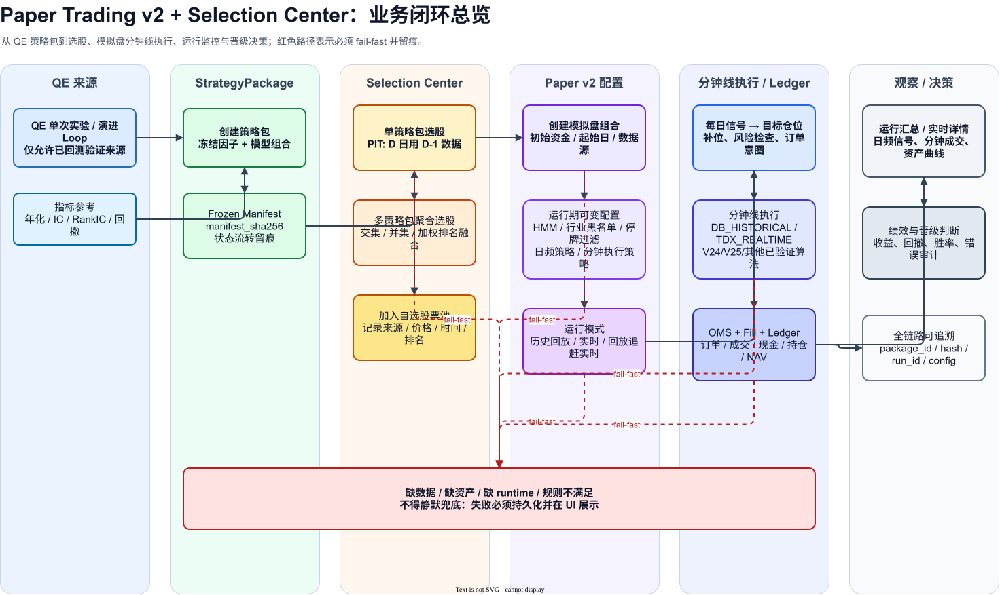
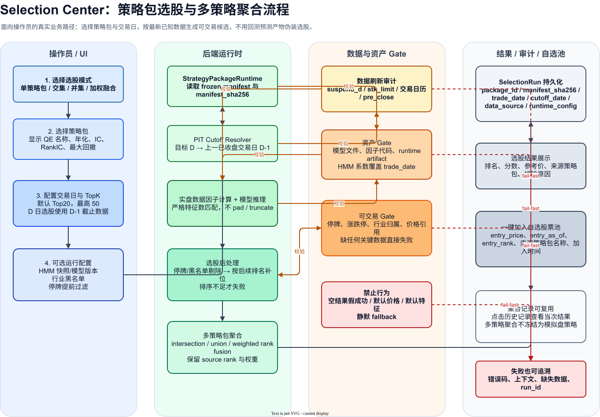
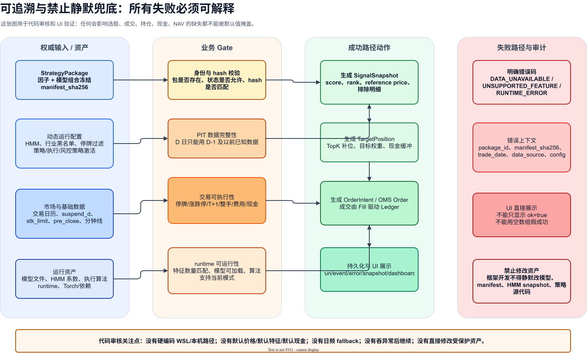

# Paper Trading v2 + Selection Center 业务流程图

> 生成日期：2026-04-30  
> 源文件：`docs/architecture/diagrams/paper_v2_selection_business_flow.drawio`  
> 说明：`.drawio` 是可编辑源文件，`.svg` 可直接插入文档或 PowerPoint；在 PowerPoint 中可将 SVG 转换为形状后继续编辑。

## 01 总览闭环

## 02 选股中心

## 03 模拟盘执行

## 04 可追溯与禁止静默兜底

## 编辑与 PPT 使用

- 用 diagrams.net Desktop 打开 `.drawio` 文件可继续编辑所有页面。
- 若用于 PPT，优先插入对应 `.svg`；在 Microsoft 365 PowerPoint 中可右键转换为形状后继续编辑颜色、文字和布局。
- 若需要单页 PNG/PDF，可从 diagrams.net Desktop 重新导出。
