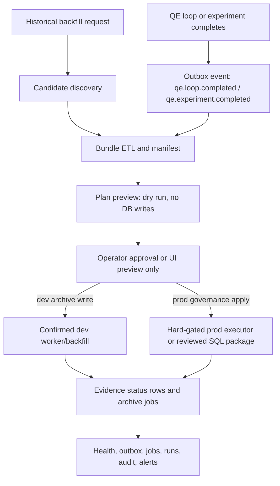

# QE Evidence Pipeline Async Design - 2026-05-12

Date: 2026-05-12
Owner: Task 25 worker D
Scope: architecture/design only; no code, service, DB, production, commit, or push changes

## 1. Goal

Move QE evidence assembly, status tracking, and backfill execution behind an
explicit asynchronous pipeline boundary so UI/API requests return quickly while
operators retain durable evidence status, idempotency, audit, and rollback
signals.

The design must support two classes of work:

- Dev and historical QE archive ETL from existing QE tables into the QE archive
  warehouse.
- Governance evidence backfill packages that may be production-capable only
  through hard-gated executors or reviewed SQL packages.

Interactive UI/API paths should preview, enqueue, or inspect status. They should
not perform long ETL, production applies, or hidden worker starts inside the
request path.

## 2. Current Evidence From Code

| Area | Evidence | Design implication |
|---|---|---|
| QE archive source assembly | `backend/services/qe_archive/source_assembler.py:1` says payloads are assembled from existing database rows and worker artifacts are intentionally omitted. | Bundle ETL should keep source extraction explicit and versioned; worker artifact parsing is a later phase. |
| Backfill candidates | `backend/services/qe_archive/source_assembler.py:220` lists candidates with archive coverage; `backend/services/qe_archive/backfill_service.py:56` processes backfill options. | Candidate discovery and payload assembly are separate from apply execution. |
| Dry-run default | `backend/services/qe_archive/archive_service.py:36` exposes `process_payload(..., dry_run=True)`; `backend/services/qe_archive/backfill_service.py:240` passes `dry_run=not write`. | Preview/dry-run is the default API behavior. |
| QE archive API | `backend/routers/qe_archive.py:65` health, `backend/routers/qe_archive.py:73` outbox, `backend/routers/qe_archive.py:104` jobs, `backend/routers/qe_archive.py:133` backfill, and `backend/routers/qe_archive.py:170` worker run-once. | Status and execution surfaces already exist but need a durable async evidence pipeline contract. |
| Worker disabled by default | `backend/services/qe_archive/worker.py:93` states the worker is not registered with FastAPI startup or any scheduler. | Do not add hidden always-on work without an explicit rollout and operator model. |
| Worker confirmation | `backend/services/qe_archive/worker_service.py:15` defines `QE_ARCHIVE_WORKER_RUN`. | Manual worker execution must remain explicit and auditable. |
| Supported worker events | `backend/services/qe_archive/worker_service.py:16` supports `qe.loop.completed` and `qe.experiment.completed`. | Event types should be enumerated and versioned. |
| Dev-only evidence prep | `scripts/strategy_package_evidence_backfill.py:1` documents preview/dev-only apply and production as a separate authorization gate. | Dev rehearsal scripts must not be repurposed for production. |
| Offline governance plan | `scripts/strategy_package_governance_evidence_backfill_plan.py:1` validates an explicit JSON bundle and never opens a database connection. | Bundle planning can be offline, deterministic, and reviewable. |
| Prod governance executor | `scripts/strategy_package_governance_evidence_backfill_prod_executor.py:30` defines the production token; `:321` validates DR snapshot; `:370` through `:376` enforce token, env, mutex, prod target, and DB-name guards; `:412` requires natural keys for idempotent writes. | Production apply belongs in a hard-gated executor, not in UI request handling. |
| Asset ledger executor | `scripts/protected_asset_ledger_backfill_prod_executor.py:336` through `:343` enforce the same production guard family; `:364` requires natural keys. | Protected asset evidence uses the same production boundary and idempotency model. |
| Production runbook | `docs/operations/r6_prod_apply_runbook_20260511.md` says dev-only guards must not be bypassed and production backfill requires a separate approved executor or reviewed SQL package. | The async design must preserve, not weaken, the R6 safety boundary. |

## 3. Non-Goals

- Do not implement the pipeline in this document.
- Do not make `/qe-archive` run production applies.
- Do not bypass dev-only script guards.
- Do not start a hidden archive worker on FastAPI startup.
- Do not parse worker-side artifact directories in the current source assembler
  without an explicit artifact ETL phase.
- Do not mutate frozen StrategyPackage manifests to make evidence appear valid.
- Do not touch production backend `8001`, frontend `3000`, production DB, Paper
  daemon, live broker, or Claude worktrees.

## 4. Target Pipeline



Key rule: interactive UI/API calls may create an event, generate a preview, or
enqueue a job, then return a durable handle. Heavy ETL and all production apply
paths execute outside the request path.

## 5. Bundle ETL

### 5.1 Bundle sources

Initial bundle ETL sources:

- `qe_experiments` rows for completed single experiments.
- `qe_evolution_tasks` rows for task-level context.
- `qe_evolution_loops` rows for loop-level status and metrics.
- Runtime contract fields already merged by the QE archive source assembler.
- StrategyPackage governance evidence bundles supplied as reviewed JSON.
- Protected asset ledger evidence bundles supplied as reviewed JSON.

Deferred sources:

- Worker artifact directory crawling.
- Remote node artifact copy.
- `mlruns` binary artifact parsing.
- Paper daemon or live broker runtime logs.

### 5.2 Bundle identity

Each evidence bundle should include:

```json
{
  "schema_version": "aistock_qe_evidence_bundle_v1",
  "bundle_id": "<uuid-or-deterministic-id>",
  "bundle_sha256": "<sha256>",
  "source_system": "qe_archive",
  "source_type": "qe.loop.completed",
  "source_id": "<task-or-experiment-id>",
  "source_sub_id": "<loop-id-or-null>",
  "package_ids": [],
  "manifest_sha256": "<strategy-package-manifest-or-null>",
  "created_at": "<utc>",
  "created_by": "<operator-or-system>",
  "payload": {}
}
```

Recommended deterministic hash inputs:

```text
schema_version
source_system
source_type
source_id
source_sub_id
package_ids sorted
manifest_sha256
payload canonical JSON
```

### 5.3 ETL phases

1. `discover`: list candidate source rows or receive an outbox event.
2. `assemble`: build normalized JSON payloads from approved source tables.
3. `fingerprint`: compute bundle SHA and per-artifact hashes.
4. `validate`: check required metrics, manifest alignment, package ids, runtime
   contract, and schema version.
5. `preview`: generate a plan with `db_writes_executed=false`.
6. `approve`: attach operator/release approval when required.
7. `enqueue`: create or reuse a durable job by idempotency key.
8. `apply`: run dev archive write or production executor outside the request
   path.
9. `verify`: query archive/evidence status and quality endpoints.
10. `close`: mark status as verified, failed, rolled_back, or superseded.

## 6. Status Model

Use a status table or job state object with these states:

| Status | Meaning | Terminal |
|---|---|---|
| `discovered` | Source row or outbox event is visible but not planned. | No |
| `assembled` | Bundle payload exists and is fingerprinted. | No |
| `planned` | Dry-run plan exists with no DB writes. | No |
| `blocked` | Validation failed before approval or execution. | Yes until new input |
| `approved` | Required human/release approval is attached. | No |
| `queued` | Job is accepted and waiting for a worker/executor. | No |
| `running` | Worker/executor claimed the job. | No |
| `applied` | Writes were committed by the dev writer or prod executor. | No |
| `idempotent_existing` | Target rows already existed and matched the expected payload. | Yes |
| `verified` | Post-apply quality/audit checks passed. | Yes |
| `failed` | Job failed and may be retried or dead-lettered. | Maybe |
| `rolled_back` | Apply failed and the active transaction or package scope was rolled back. | Yes |
| `superseded` | A newer bundle for the same source/package replaced this job. | Yes |

State transitions must be monotonic except explicit retry from `failed` to
`queued` with incremented attempt count and preserved error history.

## 7. Idempotency

### 7.1 Keys

Recommended keys:

- Archive event key: `sha256(event_type|source_system|source_id|source_sub_id)`.
- Bundle key: `bundle_sha256`.
- Plan key: `plan_preview_sha256`.
- Governance package key: `package_id|manifest_sha256|table|natural_key`.
- Worker job key: `event_id|handler_version`.
- Production apply key: `plan_preview_sha256|dr_snapshot_ref|package_ids sorted`.

### 7.2 Natural keys

Production executors already require natural keys before writes. Preserve that
pattern and extend it to all async evidence writes:

- `strategy_pkg.package_validation_run`: `validation_run_id`.
- `strategy_pkg.package_runtime_variant`: `variant_id`.
- `strategy_pkg.seed_fragility_score`: package and validation identity fields
  defined by the reviewed plan.
- `strategy_pkg.package_asset`: `package_id`, `asset_type`, `asset_ref`.
- QE archive run: `source_system`, `source_type`, `source_id`, `source_sub_id`.
- Outbox event: event type plus source identity.

If an existing row matches the full expected payload, mark
`idempotent_existing`. If the natural key exists but payload differs, fail with
`conflict` and require human review.

### 7.3 Duplicate submit behavior

- UI duplicate click should return the existing queued/running job handle.
- Worker duplicate event should no-op or mark idempotent when the target matches.
- Production duplicate apply should report existing rows and zero new writes
  when payloads match.
- A changed bundle for the same source must create a new bundle/job and mark
  the older pending job `superseded` only if no apply has started.

## 8. Audit Requirements

Every job or executor report should record:

- `schema_version`.
- `job_id`, `bundle_id`, `bundle_sha256`, and `plan_preview_sha256`.
- Source identifiers: `source_system`, `source_type`, `source_id`,
  `source_sub_id`, package ids, manifest hashes.
- Operator identity or system identity.
- Confirmation token hash or operator confirmation SHA.
- DR snapshot ref and DR snapshot SHA for production applies.
- Target label: dev/prod, host, port, database name, user, application name.
- `db_connection_opened`, `db_writes`, `db_writes_executed`, and `ddl` flags.
- Per-package transaction status and row counts.
- Rows inserted, rows updated, rows idempotent-existing, conflicts, failures.
- Error class, message, retry count, next retry time, and dead-letter reason.
- Created/claimed/started/finished timestamps.

Production executor audit reports should remain immutable artifacts. The UI can
index and display them, but must not rewrite or "fix" them.

## 9. Worker And Offload Boundaries

### 9.1 Interactive request path

Allowed:

- Validate request shape.
- Discover candidates with bounded queries.
- Build a preview for small bounded requests.
- Create an outbox event or job row.
- Return `202 Accepted`, `200 preview`, or `409 blocked` with a durable handle.

Not allowed:

- Long-running ETL over unbounded history.
- Production DB writes.
- Production executor apply.
- Service restarts or hidden worker startup.
- Artifact copy from remote nodes.
- Broker, Paper daemon, or live account calls.

### 9.2 Worker path

Allowed after explicit enablement:

- Claim queued jobs with `FOR UPDATE SKIP LOCKED` or equivalent.
- Process a bounded batch.
- Update job status, retry count, and errors.
- Call `QEArchiveBackfillService` for approved dev/archive writes.
- Generate immutable reports.

Not allowed by default:

- Register an always-on worker in FastAPI startup without a rollout decision.
- Process unknown event types.
- Retry forever.
- Hide dead-lettered failures from `/qe-archive/jobs`.

### 9.3 Production apply path

Allowed only through separate authorization:

- Hard-gated production executor.
- Reviewed SQL package validated by the executor.
- DR snapshot verification.
- Operator confirmation that includes token, target, plan SHA, DR snapshot ref,
  and every package id.
- Per-package transaction scope and audit report.

Not allowed:

- Calling prod executors directly from the browser.
- Passing UI confirmation text through to bypass executor safeguards.
- Editing dev-only guards to make a prep script target production.

## 10. API And UI Shape

Recommended API additions or contract clarifications:

```text
POST /api/v1/qe-evidence/bundles/preview
POST /api/v1/qe-evidence/jobs
GET  /api/v1/qe-evidence/jobs/{job_id}
GET  /api/v1/qe-evidence/jobs?status=...
GET  /api/v1/qe-evidence/bundles/{bundle_id}
GET  /api/v1/qe-evidence/audit/{job_id}
```

Recommended response for enqueue:

```json
{
  "status": "queued",
  "job_id": "<job-id>",
  "bundle_id": "<bundle-id>",
  "bundle_sha256": "<sha256>",
  "idempotency_key": "<sha256>",
  "existing_job": false,
  "status_url": "/api/v1/qe-evidence/jobs/<job-id>"
}
```

UI requirements:

- Show dry-run preview separately from apply status.
- Show current status, attempt count, retry count, and latest error.
- Link bundle, plan, audit report, and source run ids.
- Disable production apply controls in normal UI.
- Require exact confirmation for dev write/worker run-once.
- Show a no-go banner if target label is production in a non-production UAT.

## 11. Observability

Use existing QE Archive endpoints as the first observability surface:

- `/api/v1/qe-archive/health`: archive summary and high-level counts.
- `/api/v1/qe-archive/outbox`: event state and retry visibility.
- `/api/v1/qe-archive/jobs`: worker job state and errors.
- `/api/v1/qe-archive/runs`: archived run discovery.
- `/api/v1/qe-archive/runs/{run_id}/quality`: run-level data quality.

Add or standardize metrics:

- Submit acknowledgement latency.
- Queue wait time.
- Worker runtime.
- Rows planned, inserted, idempotent, conflicted, failed.
- Retry count and dead-letter count.
- Age of oldest pending outbox event.
- Age of oldest running job.
- Per-event-type success/failure rate.
- Production executor preview/apply status counts.

Suggested log fields:

```json
{
  "event": "qe_evidence_job_status",
  "job_id": "<job-id>",
  "status": "running",
  "source_type": "qe.loop.completed",
  "source_id": "<task-id>",
  "source_sub_id": "<loop-id>",
  "bundle_sha256": "<sha256>",
  "attempt_count": 1,
  "worker_id": "<worker-id>",
  "duration_ms": 1234
}
```

Alert/no-go thresholds:

- Oldest queued event age exceeds the UAT threshold.
- Any job `running` beyond expected budget without heartbeat.
- Any production-target report appears during dev UAT.
- Conflict count > 0.
- Dead-letter count > 0 for a release-critical package.
- Quality endpoint reports missing required metrics/assets after apply.

## 12. Rollout Plan

### R1 - Contract and status only

- Document event types, bundle schema, and status states.
- Ensure UI shows existing health/outbox/jobs/runs clearly.
- Keep worker manual run-once only.

### R2 - Durable job table

- Add job table and idempotent enqueue.
- Return job handles from new evidence APIs.
- Preserve `/qe-archive/backfill` preview behavior.

### R3 - Dev archive worker

- Claim queued dev archive jobs in bounded batches.
- Expose retry/dead-letter in UI.
- Keep production apply out of the worker.

### R4 - Production executor integration by artifact reference

- UI can display approved prod executor reports and status.
- UI cannot launch production apply.
- Release runbook owns production authorization and execution.

### R5 - Artifact ETL expansion

- Add reviewed artifact manifest parsing.
- Add remote artifact references only after explicit source, retention, and
  checksum rules exist.

## 13. Validation Plan

Static validation:

- Unit tests for bundle hash determinism.
- Unit tests for idempotency-key reuse and conflict detection.
- Unit tests for status transition validity.
- Unit tests for outbox duplicate event handling.
- Unit tests for prod executor guard reports with fake connections only.

Dev UAT:

- Preview returns quickly and contains `db_writes_executed=false`.
- Enqueue returns a `job_id`.
- Duplicate enqueue returns the same active job.
- Worker run-once requires exact confirmation.
- Jobs/outbox UI shows success, failure, retries, and errors.

Production readiness:

- DR snapshot verified.
- Plan preview hash approved.
- Operator confirmation includes token, target, plan SHA, DR snapshot ref, and
  every package id.
- Executor dry-run report stored as immutable evidence.
- Apply report shows per-package transactions and no unexpected DDL or service
  touch.

## 14. Open Decisions

- Whether to create a new `/qe-evidence` router or extend `/qe-archive`.
- Exact storage location for immutable bundle and audit report artifacts.
- Whether job rows live in a new operations schema or the existing archive schema.
- How long to retain successful, failed, and superseded jobs.
- Whether production executor reports are imported by polling artifact files or
  manually attached after release.
- Which role can approve dev archive writes from UI.

## 15. Commands Run By This Worker

Static inspection only:

```powershell
git status --short --branch
git rev-parse --abbrev-ref HEAD
git rev-parse --short HEAD
git rev-parse --short origin/main
rg -n "/qe-archive|WORKER_CONFIRM_TEXT|class QEArchiveWorker|process_payload|source_assembler" backend frontend docs scripts -S
rg -n "CONFIRM_APPLY|ENV_APPLY|MUTEX|DR|plan preview|operator confirmation|natural_key|idempotent|production_services_touched" scripts docs/operations docs/cross_tool -S
```

Not run:

- No tests that touch services, ports, or databases.
- No backend/frontend start.
- No DB read or write.
- No production executor apply.
- No commit or push.
