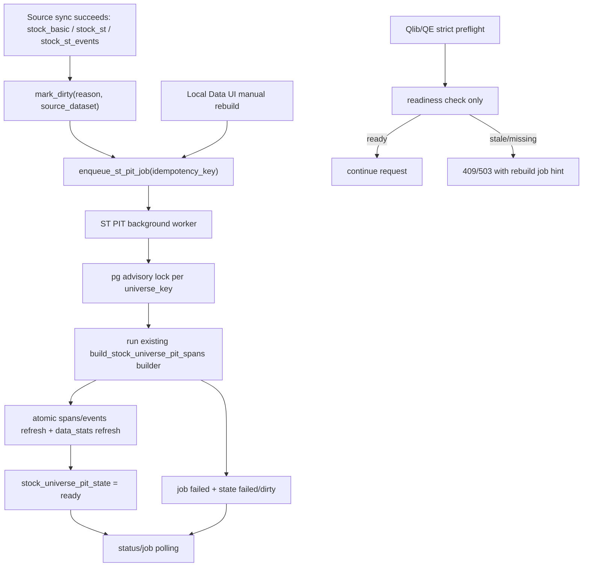

# R7 ST PIT Universe Async Background Design

Date: 2026-05-12
Owner: Task 19 design worker
Scope: design only; no runtime, service, DB, or production changes

## 1. Problem And Current Pain

The ST PIT universe is now part of the critical path for QE, Selection Center, Paper v2, Qlib export, and local-data operations, but its preparation path is still synchronous.

Current behavior observed in the codebase:

- `StockUniversePitService.ensure_st_pit_universe(...)` computes source fingerprints, checks `market.stock_universe_pit_state`, and, when stale, calls `rebuild_st_pit_universe(...)` inline.
- `rebuild_st_pit_universe(...)` takes a PostgreSQL advisory lock, sets state to `building`, imports `scripts.build_stock_universe_pit_spans`, runs the full builder, deletes/reinserts `market.stock_universe_pit_events` and `market.stock_universe_pit_spans`, refreshes `market.data_stats`, then marks state `ready` or `failed`.
- `/api/v1/stock-universe/st-pit/rebuild` and `/api/v1/stock-universe/st-pit/ensure` call the synchronous service directly.
- The Local Data UI calls `/api/v1/stock-universe/st-pit/rebuild` directly and keeps the HTTP request open while showing `stPitLoading`.
- Tushare source sync success for `stock_basic`, `stock_st`, and `stock_st_events` marks the universe dirty and then attempts `ensure_st_pit_universe(strict=False)` inline as a post-sync hook.
- Qlib export and QE composer paths strict-ensure ST PIT spans before export/runtime artifact generation, so an unexpectedly stale universe can turn a submit/export request into a long blocking rebuild.
- Selection/Paper v2 risk-policy consumers correctly treat data management as the owner of PIT rebuilds and only check `market.stock_universe_pit_state` readiness; this is the safer consumer model to preserve.

Operational pain:

- A source-data refresh, manual Local Data click, Qlib export, or QE submit can pay the full rebuild cost inside the request path.
- Long synchronous rebuilds risk FastAPI worker starvation, browser/API timeouts, and misleading operator feedback.
- Current `building` state lacks a durable job row with progress, attempt count, retry policy, requester, source fingerprint, or structured logs.
- Idempotency relies mostly on advisory locking and state inspection; users can submit duplicate manual rebuilds but cannot see that an equivalent job is already queued/running.
- Failure triage is compressed into `last_error` and builder summary; there is no job timeline for source-sync triggered rebuilds versus manual rebuilds.
- A non-strict post-sync rebuild may fail without failing the source sync, which is correct, but the operator still needs a visible queued/failed background job to resolve freshness before Selection/QE/Paper consume it.

## 2. R7 Goal

Move ST PIT universe preparation/computation out of interactive request paths into a durable async background job path while keeping strict consumers fail-fast and production-safe.

R7 should make these operations cheap and predictable:

- Mark source changes dirty immediately after source-table sync.
- Enqueue or reuse a background rebuild job for the same universe/rule/date/source fingerprint.
- Return quickly from UI/API/QE submit/export preflight when rebuild is required.
- Let Selection Center and Paper v2 continue to consume only `ready` ST PIT state and never trigger heavy rebuilds themselves.
- Expose job status, progress, errors, and final state to Local Data and operator tooling.

## 3. Non-Goals

- Do not change the ST PIT rule semantics in R7. Keep `shsz_st_pit_active_v1` and `st_pub_next_trade_restore_active_l_v1` behavior unchanged.
- Do not implement delisting/pause PIT; current scope remains `st_only_active`.
- Do not mutate frozen StrategyPackage manifests or upgrade legacy non-ST-PIT packages.
- Do not change Paper v2/vn.py/trading_core runtime execution ownership or behavior.
- Do not replace production Qlib/H5/Bin datasets as part of the async rebuild path.
- Do not make Selection Center or Paper v2 silently rebuild data; they remain consumers that fail fast when ST PIT state is stale or missing.
- Do not use production backend `8001`, production DB writes, or service restarts for validation without explicit approval.

## 4. Target Architecture

Introduce a dedicated ST PIT universe job layer around the existing builder:



Key points:

- Keep `scripts.build_stock_universe_pit_spans.build(...)` as the single computation engine for now.
- Wrap it with durable job persistence, idempotent enqueue, worker execution, and structured status.
- Split APIs into `ensure/readiness` versus `rebuild/enqueue`; interactive APIs should not run the full builder inline by default.
- Keep PostgreSQL advisory locking as a second-line concurrency guard, but add DB job uniqueness so duplicate requests reuse one pending/running job.
- Use existing `market.stock_universe_pit_state` as the canonical readiness row for consumers; add jobs as operational metadata, not a replacement for state.

## 5. Proposed Data Model

Add a new operational table, preferably in `market` next to the existing PIT tables:

```sql
CREATE TABLE market.stock_universe_pit_jobs (
    job_id UUID PRIMARY KEY,
    universe_key TEXT NOT NULL,
    rule_version TEXT NOT NULL,
    scope TEXT NOT NULL,
    start_date DATE NOT NULL,
    end_date DATE NOT NULL,
    source_fingerprint JSONB NOT NULL DEFAULT '{}'::jsonb,
    source_fingerprint_sha256 TEXT NOT NULL,
    reason TEXT NOT NULL,
    source_dataset TEXT,
    requested_by TEXT NOT NULL DEFAULT 'system',
    idempotency_key TEXT NOT NULL,
    status TEXT NOT NULL,
    priority INTEGER NOT NULL DEFAULT 100,
    attempt_count INTEGER NOT NULL DEFAULT 0,
    max_attempts INTEGER NOT NULL DEFAULT 3,
    progress JSONB NOT NULL DEFAULT '{}'::jsonb,
    result_summary JSONB NOT NULL DEFAULT '{}'::jsonb,
    error_json JSONB,
    created_at TIMESTAMPTZ NOT NULL DEFAULT NOW(),
    queued_at TIMESTAMPTZ NOT NULL DEFAULT NOW(),
    started_at TIMESTAMPTZ,
    finished_at TIMESTAMPTZ,
    updated_at TIMESTAMPTZ NOT NULL DEFAULT NOW()
);

CREATE UNIQUE INDEX ux_stock_universe_pit_jobs_active_key
ON market.stock_universe_pit_jobs (idempotency_key)
WHERE status IN ('queued', 'running', 'retry_wait');

CREATE INDEX ix_stock_universe_pit_jobs_status_priority
ON market.stock_universe_pit_jobs (status, priority, queued_at);

CREATE INDEX ix_stock_universe_pit_jobs_universe_created
ON market.stock_universe_pit_jobs (universe_key, created_at DESC);
```

Recommended status values:

- `queued`: accepted but not started.
- `running`: worker is executing the builder.
- `retry_wait`: failed transiently and is eligible for retry after backoff.
- `succeeded`: builder completed and `stock_universe_pit_state` is `ready` for the requested window/fingerprint.
- `failed`: attempts exhausted or validation failed.
- `cancel_requested`: optional R8 state; R7 can omit cancel if the builder cannot safely interrupt.
- `cancelled`: optional R8 state.
- `superseded`: optional state when a newer source fingerprint job has succeeded before an older queued job starts.

`idempotency_key` should be deterministic, for example:

```text
sha256(universe_key|rule_version|scope|start_date|end_date|source_fingerprint_sha256|reason_family)
```

Use `reason_family` rather than raw free-text reason so repeated manual clicks and repeated post-sync hooks coalesce when they target the same source state.

## 6. Service Boundary

Add a background-oriented service beside `StockUniversePitService`, for example `StockUniversePitJobService`:

- `ensure_or_enqueue(...)`: computes fingerprint and current state; if ready returns ready state; if stale creates/reuses a job and returns `status='queued'|'running'` without rebuilding inline.
- `enqueue_rebuild(...)`: explicit manual/source-sync enqueue; returns existing active job when idempotency matches.
- `claim_next_job(worker_id)`: atomically claims one queued/retryable job with `FOR UPDATE SKIP LOCKED`.
- `run_job(job_id)`: sets running, delegates to existing `StockUniversePitService.rebuild_st_pit_universe(...)`, stores summary/error, updates state.
- `get_job(job_id)`, `list_jobs(...)`: status APIs for UI and operations.
- `latest_job_for_universe(universe_key)`: attach job hints to status/readiness responses.

Keep `StockUniversePitService` focused on state, readiness, and the actual builder wrapper. For R7, it can retain synchronous rebuild for CLI/tests, but production-facing HTTP paths should call the job service unless an explicit `sync=true` admin/debug flag is approved.

## 7. API Design

### 7.1 Readiness/status

`GET /api/v1/stock-universe/st-pit/status?universe_key=...`

Return existing state plus latest job hint:

```json
{
  "universe_key": "shsz_st_pit_active_v1",
  "status": "dirty",
  "dirty": true,
  "rule_version": "st_pub_next_trade_restore_active_l_v1",
  "start_date": "2018-08-01",
  "end_date": "2026-05-12",
  "source_fingerprint_sha256": "...",
  "last_error": null,
  "latest_job": {
    "job_id": "...",
    "status": "running",
    "attempt_count": 1,
    "created_at": "...",
    "started_at": "...",
    "progress": {"phase": "building_spans"}
  }
}
```

### 7.2 Async ensure/enqueue

`POST /api/v1/stock-universe/st-pit/ensure-async`

Request:

```json
{
  "universe_key": "shsz_st_pit_active_v1",
  "start_date": "2018-08-01",
  "end_date": "2026-05-12",
  "rule_version": "st_pub_next_trade_restore_active_l_v1",
  "rebuild_if_stale": true,
  "reason": "manual_local_data"
}
```

Responses:

- `200` when already ready: `{ "ok": true, "ready": true, "state": {...} }`
- `202` when queued/reused: `{ "ok": true, "ready": false, "job": {...}, "poll_url": "/api/v1/stock-universe/st-pit/jobs/{job_id}" }`
- `409` when stale and `rebuild_if_stale=false`: include structured stale reason and latest job hint.

### 7.3 Manual rebuild

Change `POST /api/v1/stock-universe/st-pit/rebuild` to enqueue by default and return `202`.

Optional compatibility:

- Keep the existing sync behavior only behind `?sync=true` or `body.execution_mode='sync'`, disabled in normal UI.
- Document that UI must use async by default.

### 7.4 Job inspection

Add:

- `GET /api/v1/stock-universe/st-pit/jobs?universe_key=...&limit=20`
- `GET /api/v1/stock-universe/st-pit/jobs/{job_id}`
- Optional R8: `POST /api/v1/stock-universe/st-pit/jobs/{job_id}/cancel`
- Optional R8: `POST /api/v1/stock-universe/st-pit/jobs/{job_id}/retry`

### 7.5 Strict consumer responses

Qlib export and QE composer strict preflight should not launch a rebuild in the foreground. Prefer:

- If state is ready for requested end date and source fingerprint: proceed.
- If stale/missing/failed: return a typed `StockUniversePitError`/HTTP `409` with:
  - `universe_key`, `rule_version`, requested `start_date/end_date`
  - stale reason from `_needs_rebuild`
  - latest or newly enqueued `job_id`
  - operator hint: poll job or use Local Data rebuild.

Selection/Paper risk policy should keep current behavior: read state and fail fast when not ready; no enqueue unless an operator-facing preflight explicitly requests it.

## 8. Worker Design

### 8.1 Minimal in-process worker for R7

For the first implementation, use an in-process background worker started from FastAPI lifespan, similar in operational spirit to existing schedulers/scanners, but keep it behind a config flag:

- `ST_PIT_BACKGROUND_WORKER_ENABLED=false` by default for tests/dev safety until rollout.
- `ST_PIT_BACKGROUND_WORKER_POLL_SECONDS=5`
- `ST_PIT_BACKGROUND_WORKER_MAX_CONCURRENCY=1`
- `ST_PIT_BACKGROUND_WORKER_ID=<hostname-pid>`

Worker loop:

1. Claim one `queued` or due `retry_wait` job using `FOR UPDATE SKIP LOCKED`.
2. Set `status='running'`, increment `attempt_count`, set `started_at` if null.
3. Execute `StockUniversePitService.rebuild_st_pit_universe(...)` in a thread executor so the event loop is not blocked.
4. Store builder summary in `result_summary`; mark `succeeded`.
5. On exception, classify retryable vs terminal; update `error_json`, `status='retry_wait'` or `failed`.
6. Always release DB advisory lock in the existing rebuild service.

Because the current builder is synchronous and CPU/DB-heavy, the worker must call it through `loop.run_in_executor(...)` or an equivalent worker-thread path. This matches the recent QE submit lesson: heavy composer/build work must not block the event loop.

### 8.2 Future external worker option

If rebuild cost grows beyond a few seconds/minutes or competes with FastAPI request traffic, promote the same job table to an external CLI/Windows service worker:

```powershell
python -m backend.services.stock_universe_pit_worker --poll --max-concurrency 1
```

The service/API contract should not change; only the worker deployment changes.

## 9. State Model

Keep two distinct state layers:

### Canonical readiness state

`market.stock_universe_pit_state` remains the source of truth for consumers:

- `ready`: safe for Selection/Paper/QE/Qlib consumers when date coverage and source fingerprint match.
- `dirty`: source changed; consumers should fail fast or ask operator to wait for job.
- `building`: worker is actively rebuilding; consumers should fail fast with job hint.
- `failed`: last rebuild failed; consumers should fail fast with error and retry hint.
- `missing`: synthetic API status when no row exists.

### Operational job state

`market.stock_universe_pit_jobs` records intent, attempts, progress, and outcome. Jobs do not make a universe ready by themselves; readiness only changes when the builder successfully refreshes spans/events and updates `stock_universe_pit_state`.

Invariant: A `succeeded` job for fingerprint `X` must imply `stock_universe_pit_state.status='ready'`, `dirty=false`, `source_fingerprint_sha256=X`, and sufficient date coverage for that job.

## 10. Concurrency And Idempotency

Concurrency rules:

- Only one active rebuild per `universe_key` should run at a time.
- Duplicate enqueue requests for the same idempotency key return the existing active job.
- If source data changes while a job is running, `mark_dirty` should preserve `building` state but enqueue a new job with the new fingerprint.
- When a running job finishes, it should mark state ready only if its source fingerprint still matches the current source fingerprint. If sources changed mid-run, mark the job `superseded` or `succeeded_stale`, keep/restore state dirty, and let the newer job run.
- Use DB uniqueness for deduplication and PostgreSQL advisory lock for execution serialization.
- Use `FOR UPDATE SKIP LOCKED` in the worker so multiple worker instances do not claim the same job.

Idempotency details:

- Manual rebuild with same source fingerprint/date/rule should reuse a queued/running job.
- Source-sync post hooks for multiple source datasets may enqueue multiple jobs only when fingerprints differ; otherwise they reuse the same job.
- `force=true` should intentionally produce a new idempotency key by adding a `force_nonce` or requester-provided idempotency key, but UI should not use force by default.

## 11. Failure And Retry

Failure classes:

- Terminal validation failure: builder validation reports invalid spans, overlap errors, event-action violations, or terminal re-entry violations. Mark job `failed`; keep state `failed` or `dirty` with `last_error`; do not auto-retry until source/rule changes or user explicitly retries.
- Transient DB/connectivity failure: retry with exponential backoff up to `max_attempts`.
- Lock contention: normally prevented by job claim plus advisory lock; if encountered, leave queued/retryable.
- Superseded fingerprint: stop old job before execution if current fingerprint no longer matches; mark `superseded` and do not touch readiness state.
- Process crash while `running`: scanner should requeue jobs whose `updated_at` heartbeat is older than a threshold, for example 30 minutes, unless the advisory lock indicates an active builder.

Retry policy:

- Default `max_attempts=3` for transient failures.
- Backoff examples: 1 minute, 5 minutes, 15 minutes.
- Validation failures require manual retry after source correction or rule change.
- Store structured `error_json`: `error_code`, `message`, `traceback_hash`, `retryable`, `phase`, `source_fingerprint_sha256`.

Progress:

R7 can start with coarse phases because the builder is synchronous:

- `queued`
- `fingerprint_checked`
- `building_spans`
- `writing_results`
- `refreshing_data_stats`
- `validating_state`
- `succeeded` / `failed`

If modifying the builder later, add row-count progress for loaded stocks/events/spans.

## 12. Integration Points

### 12.1 Source sync hook

Current source-sync hook should change from:

```text
mark_dirty -> ensure_st_pit_universe(strict=False)
```

to:

```text
mark_dirty -> enqueue_rebuild(reason='source_sync_success', source_dataset=dataset)
```

Source sync should still succeed even if enqueue fails, but the sync job summary must include structured enqueue failure and the ST PIT state must remain dirty.

### 12.2 Local Data UI

Change the ST PIT card from blocking rebuild to async workflow:

- On page load, call status and latest job.
- Rebuild button calls async enqueue endpoint and immediately shows job id/status.
- Poll job endpoint while job is `queued`, `running`, or `retry_wait`.
- Refresh `data_stats` only after job succeeds, not while it is still running.
- Show failed validation/error JSON with retry guidance.

### 12.3 Qlib export

Change export strict ensure to readiness preflight by default:

- If ready: continue.
- If stale/missing: enqueue or reuse a job only if the request explicitly allows `enqueue_if_stale=true`; otherwise fail fast with `409` and job hint.
- Never run builder inline in the export request on normal UI path.

### 12.4 QE composer/submit

ConfigComposer currently builds `qe_event_risk_policy.json` by strict-ensuring ST PIT spans before reading spans. R7 should avoid making QE submit responsible for rebuilding:

- Add a preflight method that checks `stock_universe_pit_state` and throws a typed stale error with job hint.
- Composer reads spans only after readiness passes.
- If API caller wants to prepare data first, it should call async ensure and poll before submitting QE.

### 12.5 Selection Center and Paper v2

No heavy rebuilds should be added to Selection Center or Paper v2 runtime paths.

- `StPitRiskDecisionProvider._require_ready_pit_state(...)` already follows the consumer-only model; keep this behavior.
- Selection Center package health can add an operator-facing `st_pit_universe_ready` check that reads state and latest job but does not enqueue by default.
- Selection run errors should include `universe_key`, `trade_date`, `status`, `dirty`, `end_date`, and latest job id when available.

## 13. Production Safety Boundaries

- R7 implementation must be validated on a non-production dev backend port only; do not restart or use production backend `8001` as proof.
- Do not write to production DB except through explicitly approved dev/validation environments.
- Do not trigger full H5/Bin export, dataset promotion, or production Qlib replacement as part of this change.
- Do not touch `main`, production worktrees, Claude-owned Paper v2/vn.py/trading_core runtime work, or live services.
- Keep the default worker disabled until migration/tests pass and an operator explicitly enables it for the target environment.
- Existing sync rebuild CLI/service path may remain for controlled maintenance, but UI/API should prefer async.

## 14. Validation Plan

### L0 static/unit

- Unit-test idempotency key generation.
- Unit-test enqueue returns existing active job for duplicate source fingerprint/rule/window.
- Unit-test stale-ready decision matrix for `missing`, `dirty`, `building`, `failed`, insufficient coverage, rule mismatch, source fingerprint mismatch, and ready.
- Unit-test retry classification: validation errors terminal, DB/connectivity errors retryable.
- Unit-test source-sync hook calls `mark_dirty` and enqueue, not inline rebuild.

### L1 repository/job tests

- Claim jobs with `FOR UPDATE SKIP LOCKED` semantics using two worker instances/fake transactions.
- Verify active unique index allows historical succeeded/failed jobs but dedupes queued/running/retry_wait.
- Verify crash recovery requeues stale running jobs.
- Verify superseded-fingerprint protection prevents old jobs from marking current state ready.

### L2 API tests

- `POST /st-pit/rebuild` returns `202` and job body without running builder inline.
- `POST /st-pit/ensure-async` returns `200 ready` when state is ready.
- `POST /st-pit/ensure-async` returns `202 queued/reused` when stale and `rebuild_if_stale=true`.
- `POST /st-pit/ensure-async` returns `409` when stale and `rebuild_if_stale=false`.
- `GET /st-pit/status` includes latest job hint.
- `GET /st-pit/jobs/{job_id}` exposes progress/error/result summary.

### L3 integration, dev-only

- Use a temporary dev backend port, not `8001`.
- Seed/fake a stale `stock_universe_pit_state`, enqueue rebuild, run a single worker tick, assert state becomes ready and spans/events refresh.
- Simulate source fingerprint change during a running job; assert old job cannot clear dirty state for the new fingerprint.
- Validate Local Data UI no longer holds a long rebuild HTTP request open and can poll job status.
- Validate Selection Center/Paper v2 with stale state fails fast with structured error and no rebuild side effect.
- Validate QE composer/export preflight returns a structured stale error/job hint instead of blocking the event loop.

### L4 performance/responsiveness

- Add an event-loop responsiveness smoke similar to the QE submit hotfix lesson: while async enqueue/rebuild worker is active, a lightweight endpoint should respond within a small threshold.
- Measure rebuild duration and row counts in job `result_summary`.
- Confirm duplicate clicks do not create duplicate running rebuilds.

## 15. Rollout Plan

1. Add schema migration and repository/service tests with worker disabled.
2. Add async enqueue/status APIs while leaving old sync implementation available behind internal flag.
3. Convert source-sync post hook to enqueue-only and expose job details in sync summary.
4. Convert Local Data UI rebuild button to async enqueue + polling.
5. Convert Qlib export/QE composer strict paths from inline rebuild to readiness preflight with job hint.
6. Add optional in-process worker behind disabled-by-default config; validate on dev port and dev DB only.
7. Enable worker in a controlled dev environment; run L3/L4 validation.
8. Only after explicit approval, enable in the intended production environment; report whether `8001`, `3000`, DB, and datasets were touched.

## 16. Open Questions

- Should Qlib export auto-enqueue when stale, or always fail fast and require an operator to click Local Data rebuild first?
- Should `market.stock_universe_pit_state.status='building'` be kept, or should canonical state remain `dirty` while job state carries `running`?
- Is a single in-process worker sufficient, or should R7 go directly to a separate worker process because rebuild cost competes with FastAPI request serving?
- What heartbeat threshold is safe for marking `running` jobs stale on Windows/dev machines?
- Should manual `force` rebuild be exposed in UI, or restricted to CLI/admin-only to avoid unnecessary recomputation?

## 17. Recommended R7 Acceptance Criteria

R7 is done when:

- Manual Local Data rebuild returns immediately with a job id and does not block the request until computation finishes.
- Source sync marks ST PIT dirty and creates/reuses a rebuild job without doing the full rebuild inline.
- Strict Selection/Paper/QE/Qlib consumers either proceed from a ready universe or fail fast with a structured stale/failed response and job hint.
- Duplicate manual/source-sync requests are idempotent.
- A running rebuild cannot be duplicated and cannot mark stale data ready after source tables change.
- Failed jobs preserve enough structured context for operator diagnosis and retry.
- Validation is completed on non-production dev ports only, with explicit confirmation that production `8001`, production `3000`, production DB writes, dataset promotion, commits, and pushes were not touched.
