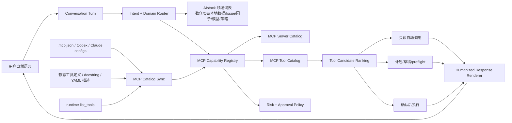

# Research Assistant 全量 MCP 接入、拟人化对话与自主工具路由设计方案

> 日期：2026-05-27  
> 分支：`docs/research-assistant-mcp-orchestration-20260527`  
> worktree：`F:\Dev\AIstock_worktrees\research-assistant-mcp-orchestration-design-20260527`  
> 任务分级：T3 / 架构设计 + 现有功能修复方案  
> 模块：Research Assistant、MCP Gateway、QE Archive / 数仓、本地数据管理、外部 Codex/Claude MCP 注册  
> 运行时边界：本设计阶段不启动、不停止、不重启 `8001` / `3000`。

## 1. 结论

当前 Research Assistant 的问题不是 AIstock 没有 MCP，而是“运行时能力目录、对话提示词、MCP 客户端注册、工具描述和自主路由”没有统一起来：

1. `aistock-qe-archive`（也就是用户口中的 QE 数仓 / 实验归档数仓）已经有 MCP server 和工具脚本，但 Research Assistant 默认工具目录没有把它的工具登记进去，所以对话里看不到“QE 数仓 MCP”。
2. `aistock-local-data` 的后端 MCP 模块已经存在，并且模块内工具远多于当前 Research Assistant 种子目录展示的少量工具；外部 Codex / Claude 客户端侧还需要补齐显式注册。
3. Research Assistant 目前倾向于输出“只能 / 不具备 / 需审批”的能力边界说明，缺少拟人化的“我可以帮你怎么做、我会先查哪个能力、需要你确认时再停下来”的对话层。
4. “数仓”没有被纳入领域词表和意图路由，因此用户问“数仓 MCP”时，助手不能自然映射到 `aistock-qe-archive`、`qe_archive`、`warehouse`、`archive`、`入仓`、`补录`、`归档质量` 等同义概念。
5. 需要把“全量已配置 MCP 发现 + 工具功能描述 + 风险分级 + 意图路由 + 人性化回复”做成 Research Assistant 的基础能力，而不是靠每次人工解释。

目标状态：Research Assistant 能自然回答“我现在能用哪些 AIstock MCP”，知道每个 MCP 大致负责什么，看到任务后能自己判断优先使用哪个 MCP；只在真正要执行高风险动作时，才以计划、preflight 和确认卡片的方式请求用户确认，而不是在普通对话中输出限制清单。

## 2. 当前事实与差距

### 2.1 已发现的现有 MCP 来源

| 来源 | 当前事实 | 设计含义 |
|---|---|---|
| `.mcp.json` | 已登记 `aistock-validation`、`aistock-qe-experiment`、`aistock-qe-archive`、`aistock-research` | 项目侧已经有 QE 数仓和研究流水线 MCP 入口；Research Assistant 目录需要同步这些入口。 |
| `backend/mcp/profiles.py` | 已有 `research`、`research_assistant`、`local_data`、`assistant_with_local_data`、`research_with_assistant_local_data`；`qe_archive`、`qe_experiment`、`validation` 在 future profiles 中 | Gateway 新 profile 尚未覆盖所有实际已存在的专用 server；需要统一 profile 和专用脚本两条路径。 |
| `backend/mcp/modules/local_data.py` | 模块内可登记 47 个本地数据管理工具 | 当前 Research Assistant 展示的本地数据工具只是子集，不能代表完整 local-data MCP 能力。 |
| `backend/mcp/modules/research.py` | 可登记 16 个 Research Pipeline 工具 | Research Assistant 种子目录当前没有把 `aistock-research` 作为同级能力暴露。 |
| `backend/mcp/modules/research_assistant.py` | 可登记 13 个助手自身工具 | 用于任务、上下文、记忆候选、工具目录和 preflight。 |
| `scripts/aistock_qe_experiment_mcp_server.py` | 可登记 26 个 QE 实验 / template / custom-evo 工具 | 当前只登记了 template 子集，实验查询、loop 对比、日志尾部等工具没有完整出现在助手能力目录中。 |
| `scripts/aistock_qe_archive_mcp_server.py` | 可登记 20 个 QE Archive / 数仓工具 | 这是“QE 数仓 MCP”的实际入口，但当前 Research Assistant 工具目录没有展示这些工具。 |
| `scripts/aistock_mcp_server.py` | 可登记 19 个 validation / BUG / GitHub issue / validation-run 工具 | 当前只登记了 `mcp_github_issue_create`，没有完整表达 issue workflow 和验证中心能力。 |

### 2.2 当前用户可见问题

| 问题 | 根因 | 修复方向 |
|---|---|---|
| 回复不拟人化，像限制公告 | prompt 节点强调“只能 / 不调用 / 审批边界”，缺少自然语言渲染层 | 增加 `humanized_response_policy` 和 `capability_answer_style`，普通问答默认回答“我能做什么 + 我会怎么做”。 |
| QE 数仓 MCP 没出现 | `DEFAULT_MCP_TOOLS` / catalog seed 没纳入 `aistock-qe-archive` 20 个工具 | 扩展 catalog seed，并增加运行时全量同步。 |
| 助手不理解“数仓” | 意图枚举和领域词表没有 `qe_warehouse` / `data_warehouse` 概念 | 增加数仓领域 prompt node、同义词表和路由规则。 |
| “所有 MCP”不一致 | `.mcp.json`、Research Assistant 种子、Gateway profiles、Codex/Claude config 各自维护 | 建立 MCP Capability Registry Sync，把配置、静态工具定义和运行时 `list_tools` 合并为一张能力目录。 |
| 工具描述不足 | 工具函数 docstring 和 Assistant 目录 title/description 不完整且部分乱码 | 增加人工维护的 `mcp_capability_catalog.yaml`，以中文业务描述覆盖低质量 docstring。 |
| 不会自主选工具 | 对话模式只知道是否需要工具，缺少“任务类型 -> MCP -> 工具候选 -> 风险策略”路由 | 增加 MCP Tool Router 和 intent-to-capability 映射。 |

## 3. 设计目标

### 3.1 新功能

1. **全量 MCP 能力目录**：Research Assistant 能列出所有已配置 AIstock MCP server、工具、功能描述、风险等级、是否可自动只读调用、是否需要确认。
2. **QE 数仓 MCP 正式可见**：把 `aistock-qe-archive` 作为“QE 数仓 / 实验归档 / warehouse / 入仓 / 补录 / 质量核查”能力暴露给助手。
3. **本地数据 MCP 正式接入外部客户端**：项目 `.mcp.json`、Codex 和 Claude Code 配置均能显式看到 `aistock-local-data`。
4. **拟人化能力问答**：普通能力询问不再输出限制公告，而是给出自然、简短、可执行的说明。
5. **自主工具路由**：用户问本地数据、QE 实验、数仓归档、Issue、验证、研究流水线、因子库、模型库、策略库时，助手能自动定位对应 MCP 或说明需要新增哪个 MCP。
6. **领域词表和同义词**：把“数仓”映射到 `aistock-qe-archive`，把“本地数据 / 数据同步 / 缺口修复”映射到 `aistock-local-data`，把“实验 / loop / 模板 / 跑 QE”映射到 `aistock-qe-experiment`。
7. **可审计但不生硬的安全边界**：只读工具可自动使用；写入、补录、运行实验、清理、GitHub 正式写入必须经过 preflight、确认和审批，但在对话中以“我先给你计划，确认后执行”的形式表达。

### 3.2 现有功能修复

1. 修复 Research Assistant 工具目录只展示 5 server / 15 tool 的不完整目录。
2. 修复 `aistock-qe-archive` 未进入 Research Assistant 可见工具清单的问题。
3. 修复 `aistock-research` 在 `.mcp.json` 存在但 Research Assistant 默认 catalog 不一致的问题。
4. 修复 `aistock-local-data` 后端已合入但外部 MCP 客户端缺少直接注册的问题。
5. 修复 prompt 中“能力边界说明”过度前置的问题。
6. 修复部分中文 title/description 乱码或缺业务解释的问题。
7. 修复能力询问不主动查询 catalog、不生成用户可理解能力分组的问题。

## 4. 总体架构



核心原则：MCP 仍然走后端 API façade，不让 Research Assistant 直接绕过 AIstock 后端连接 DB、任意 Shell 或任意 HTTP。若确实需要文件、Git、HTTP、数仓直查，也应新增受控的 AIstock MCP façade，并在目录中标明权限和审批边界。

## 5. MCP 能力目录设计

### 5.1 目标 server 清单

最终 Research Assistant 应至少看见以下 AIstock MCP：

| MCP server | 中文名称 | 主要任务 | 当前工具数事实 | 默认自动化策略 |
|---|---|---|---:|---|
| `aistock-local-data` | 本地数据管理 MCP | 数据健康、数据集状态、同步目标、缺口检查、修复计划、确认后修复 | 47 | 只读自动；修复/同步需确认。 |
| `aistock-qe-experiment` | QE 实验 MCP | 实验列表、详情、日志、loop 对比、模板创建、校验、物化、运行 | 26 | 查询自动；创建草稿可自动；物化/运行需确认。 |
| `aistock-qe-archive` | QE 数仓 MCP | 入仓健康、归档 run、outbox、backfill、质量、因子使用、模型 trial、seed/hyperparam 查询 | 20 | 查询自动；backfill/worker 执行需确认。 |
| `aistock-validation` | 验证与 Issue MCP | validation run、findings、BUG、GitHub issue、issue workflow sync | 19 | 查询自动；正式创建/同步 GitHub issue 需确认。 |
| `aistock-research` | Research Pipeline MCP | research experiment、stage、artifact refs、HMM backfill、promote/reject | 16 | 查询自动；stage 执行、promote/reject 需确认。 |
| `research-assistant` | 助手自身 MCP | task、context pack、memory candidate、prompt bundle、MCP tool list、preflight | 13 | 内部编排；候选记录可自动，审批由后端状态控制。 |

> 注：工具数来自当前 worktree 静态扫描，不代表所有工具都应默认允许自动执行。目录展示要完整，执行权限要分级。

### 5.2 能力目录字段

在现有 `assistant_mcp_servers`、`assistant_mcp_tools`、`assistant_capabilities` 基础上补齐以下字段或等价 JSON 字段：

| 字段 | 类型 | 用途 |
|---|---|---|
| `server_key` | text | MCP server 唯一键。 |
| `domain_key` | text | `local_data`、`qe_experiment`、`qe_warehouse`、`validation_issue`、`research_pipeline` 等。 |
| `display_name_zh` | text | 中文可见名称，例如“QE 数仓 MCP”。 |
| `description_for_user` | text | 给用户看的自然描述。 |
| `description_for_llm` | text | 给模型路由用的简短功能描述。 |
| `domain_aliases_json` | jsonb | 同义词，如 `['数仓','QE数仓','入仓','归档','warehouse','qe_archive']`。 |
| `example_intents_json` | jsonb | 典型用户问题。 |
| `tool_name` | text | MCP tool 名称。 |
| `side_effect_level` | text | `read_only` / `draft_only` / `write_nonprod` / `run_data_job` / `high_cost_compute` / `production_sensitive`。 |
| `auto_call_policy` | text | `auto_read` / `ask_before_call` / `preflight_then_confirm` / `approval_required`。 |
| `preflight_required` | bool | 是否必须 preflight。 |
| `confirmation_text` | text | 如需确认，要求的确认语。 |
| `source_kind` | text | `manual_yaml` / `static_scan` / `runtime_list_tools` / `seed_default`。 |
| `last_synced_at` | timestamptz | 最近同步时间。 |
| `catalog_quality` | text | `complete` / `partial` / `needs_description` / `stale`。 |

如果选择新增 DB 列，必须配套 migration 和 `COMMENT ON TABLE/COLUMN`；如果先用 JSONB 承载，可减少 DDL 风险，但要有 schema validator。

### 5.3 推荐配置文件

新增：

```text
docs/architecture/research_assistant_full_mcp_orchestration_design_20260527.md
backend/services/research_assistant/mcp_capability_catalog.yaml
backend/services/research_assistant/mcp_catalog_sync.py
backend/tests/research_assistant/test_mcp_catalog_sync.py
prompt_packs/research_assistant/main/nodes/domain.qe_warehouse.md
prompt_packs/research_assistant/main/nodes/tool_router.mcp_capability.md
prompt_packs/research_assistant/main/nodes/renderer.humanized_response.md
```

`mcp_capability_catalog.yaml` 是人工维护的业务解释源，避免直接暴露函数名和乱码描述。

## 6. QE 数仓 MCP 设计

### 6.1 命名与解释

Research Assistant 必须把以下词映射到同一个领域：

```yaml
domain_key: qe_warehouse
canonical_server: aistock-qe-archive
visible_name: QE 数仓 MCP
aliases:
  - 数仓
  - QE数仓
  - QE archive
  - qe_archive
  - 实验归档
  - 入仓
  - 补录
  - backfill
  - outbox
  - 归档质量
  - 因子使用统计
  - 模型trial
```

用户问“数仓是什么”时，助手应回答：

> 在 AIstock 里，数仓通常指 QE Archive 这条链路：把 QE / Paper / 因子 / 模型等运行结果从运行时或任务产物整理成可查询、可审计、可回放的归档数据。你问“入仓、补录、归档质量、outbox、factor usage、model trials”时，我会优先看 `aistock-qe-archive`。

### 6.2 QE 数仓工具分组

| 分组 | 工具 | 用途 | 策略 |
|---|---|---|---|
| 健康与概览 | `qe_archive_health` | 数仓服务健康 | 只读自动。 |
| Run 查询 | `qe_archive_list_runs`、`qe_archive_get_run_quality` | 归档 run 和质量状态 | 只读自动。 |
| Outbox / Job | `qe_archive_list_outbox`、`qe_archive_list_jobs`、`qe_archive_list_skips` | 入仓事件、任务和跳过原因 | 只读自动。 |
| Backfill 预览 | `qe_archive_backfill_preview`、`qe_archive_backfill_selection_preview`、`qe_archive_get_source_status` | 预估补录范围和影响 | 自动或 ask-before-call。 |
| Backfill 执行 | `qe_archive_backfill_execute_confirmed`、`qe_archive_backfill_selection_execute_confirmed`、`qe_archive_worker_run_once_confirmed` | 写入/补录/worker 执行 | preflight + 用户确认 + 审批。 |
| 查询分析 | `qe_archive_query_factor_usage`、`qe_archive_query_factor_importance`、`qe_archive_query_factor_importance_stability`、`qe_archive_query_model_trials`、`qe_archive_query_seed_trials`、`qe_archive_query_hyperparam_history` | 因子、模型、seed、超参历史分析 | 只读自动。 |

## 7. 拟人化对话层设计

### 7.1 回复原则

1. **先回答能做什么，再解释怎么做**：不要先用限制语句开头。
2. **把安全边界变成行动步骤**：不说“我不能直接执行”，改成“我会先生成计划和 preflight，确认后再执行”。
3. **普通能力询问不展示审批墙**：只给能力分组、典型任务和下一步建议。
4. **需要用户确认时才展示确认边界**：例如补录、修复、跑实验、GitHub 正式写入。
5. **少说平台限制，多说可用路径**：如果某能力未登记，说“我会先补登记 / 需要新增受控 MCP façade”，而不是“我不具备”。

### 7.2 示例改写

当前不理想回复：

```text
当前 Research Assistant 只能按已登记的运行时 MCP 目录使用工具，不具备未登记的通用文件、Shell、Git、HTTP 或数仓直连工具。
```

目标回复：

```text
我现在可以围绕 AIstock 的几个方向帮你做事：本地数据健康与修复、QE 实验、QE 数仓归档、验证/Issue、研究流水线和助手任务管理。

如果你问“数据是否缺口”，我会优先查本地数据 MCP；如果你问“入仓、补录、归档质量、因子使用统计”，我会查 QE 数仓 MCP；如果你要跑 QE，我会先创建或校验模板，等你确认后再启动高成本执行。
```

能力缺失时的目标回复：

```text
这个任务需要一个受控的 repo/Git MCP。当前目录里还没有这个 façade，我可以先生成接入方案：只读查状态自动执行，commit/push/branch 删除走确认。
```

### 7.3 Prompt 节点调整

新增 / 修改：

| prompt node | 作用 |
|---|---|
| `renderer.humanized_response.md` | 规定普通对话要自然、少限制词、先给路径。 |
| `domain.qe_warehouse.md` | 定义“数仓”语义和 `aistock-qe-archive` 映射。 |
| `tool_router.mcp_capability.md` | 规定根据意图选择 MCP 的规则。 |
| `tool_guard.mcp_qe_archive.md` | 规定 QE 数仓 read / backfill / worker 的风险边界。 |
| `tool_guard.mcp_registry.md` | 规定全量 MCP 目录同步和工具调用记录。 |

现有 prompt 中的 `只能`、`CRITICAL: 只输出文本`、`不得调用工具` 等语句保留在内部模式 / 压缩任务中，但不能直接成为用户可见的普通回复风格。

## 8. 自主工具路由设计

### 8.1 意图到 MCP 路由表

| 用户意图 | 关键词 | 首选 MCP | 次选 MCP | 动作 |
|---|---|---|---|---|
| 本地数据健康 | 本地数据、数据缺口、同步、Tushare、dataset、修复 | `aistock-local-data` | `aistock-validation` | 先查 health/status，必要时生成 repair plan。 |
| QE 实验状态 | QE、实验、loop、日志、template、run | `aistock-qe-experiment` | `aistock-qe-archive` | 查询实验 / loop / 日志；运行需确认。 |
| QE 数仓 | 数仓、入仓、归档、outbox、backfill、factor usage、model trial | `aistock-qe-archive` | `aistock-qe-experiment` | 查询归档质量或生成补录预览；执行补录需确认。 |
| Issue / BUG | BUG、issue、GitHub、close、sync、workflow | `aistock-validation` | `research-assistant` | 查询/同步前 preflight；正式写入需确认。 |
| 研究流水线 | research pipeline、HMM backfill、stage、artifact refs | `aistock-research` | `aistock-qe-archive` | 查询 pipeline 或 stage；执行/推广需确认。 |
| 助手上下文 | 上下文、记忆、任务、prompt bundle、能力目录 | `research-assistant` | 无 | 构建 context pack 或列能力。 |
| 因子库 | 因子、IC、RankIC、相关性、替换建议 | 未来 `aistock-factor-library` | `aistock-qe-archive` | 先查现有归档统计；完整能力新增 MCP。 |
| 模型库 | 模型、trial、超参、seed、model registry | 未来 `aistock-model-registry` | `aistock-qe-archive` | 先查 archived model trials；注册库另建 MCP。 |
| 策略库 | 策略包、Selection、Paper、执行策略 | 未来 `aistock-strategy-governance` / `aistock-execution-policy` | `aistock-validation` | 先做只读状态和治理计划。 |

### 8.2 路由算法

1. `classify_intent(message)`：识别领域、动作类型、风险等级、是否需要实时证据。
2. `lookup_capabilities(domain, action)`：从 catalog 找 server + tool 候选。
3. `rank_tools(candidates)`：按 domain match、alias match、risk policy、last health、catalog quality 排序。
4. `decide_call_policy(tool)`：
   - `read_only + auto_read`：自动调用或建议调用。
   - `draft_only`：创建草稿或候选记录。
   - `write_nonprod / run_data_job / high_cost_compute`：先 preflight，再确认。
   - `production_sensitive`：需要计划、审批、明确确认文本。
5. `render_response()`：用自然语言解释结果和下一步，不暴露内部限制清单。

## 9. 外部客户端注册设计

### 9.1 项目 `.mcp.json`

在现有 `.mcp.json` 基础上补齐：

```json
{
  "mcpServers": {
    "aistock-local-data": {
      "command": "python",
      "args": ["scripts/aistock_mcp_gateway.py", "--profile=local_data"],
      "env": {
        "AISTOCK_MCP_BASE_URL": "http://127.0.0.1:8001/api/v1"
      }
    },
    "research-assistant": {
      "command": "python",
      "args": ["scripts/aistock_mcp_gateway.py", "--profile=research_assistant"],
      "env": {
        "AISTOCK_MCP_BASE_URL": "http://127.0.0.1:8001/api/v1"
      }
    }
  }
}
```

保留现有：`aistock-validation`、`aistock-qe-experiment`、`aistock-qe-archive`、`aistock-research`。

### 9.2 Codex / Claude Code

Codex 和 Claude Code 应使用同一套 server key 和描述，避免“项目有、客户端没有”的漂移：

| 客户端 | 需要同步 |
|---|---|
| Codex project `.mcp.json` | 作为项目级源。 |
| Codex global `config.toml` / `config.json` | 用户本机可直接调用。 |
| Claude Code `.mcp.json` 或用户配置 | 让 Claude Code 也能看到同名 MCP。 |
| Research Assistant DB catalog | 让 AIstock 内部助手知道这些 MCP 的业务含义。 |

注意：更新客户端配置不会让已经打开的旧会话自动获得新工具；需要新窗口或工具 schema 刷新。设计文案应说“新会话会看到新工具”，不要误导为热生效。

## 10. 未来领域 MCP 设计

用户提出的因子库、因子独立指标计算、因子相关性计算、模型库、策略库、执行策略库都适合做成 MCP，但应分领域拆分，避免一个巨大 MCP 难以治理。

| 未来 MCP | 范围 | 第一阶段工具 | 写入/计算策略 |
|---|---|---|---|
| `aistock-factor-library` | 因子库元数据、覆盖率、版本、来源、质量标签 | `factor_library_list`、`factor_library_get`、`factor_library_search`、`factor_library_get_coverage` | 只读优先。 |
| `aistock-factor-metrics` | 因子独立指标计算，IC/RankIC/稳定性/分组收益 | `factor_metrics_plan`、`factor_metrics_submit_confirmed`、`factor_metrics_get_job`、`factor_metrics_get_result` | 计算走异步 job；提交需确认。 |
| `aistock-factor-correlation` | 因子相关性、冗余、替换建议 | `factor_corr_plan`、`factor_corr_submit_confirmed`、`factor_corr_get_matrix`、`factor_corr_suggest_replacements` | 大计算异步，结果限行限列。 |
| `aistock-model-registry` | 模型库、trial、超参、seed、训练记录、产物 manifest | `model_registry_list`、`model_registry_get`、`model_registry_compare_trials` | 默认只读；注册/冻结需确认。 |
| `aistock-strategy-governance` | 策略包、Selection、Paper、策略生命周期 | `strategy_list_packages`、`strategy_get_health`、`strategy_plan_promotion` | 推广/退役需确认。 |
| `aistock-execution-policy` | 执行策略库、TWAP/VWAP/POV/minute algo、约束和适用条件 | `execution_policy_list`、`execution_policy_get`、`execution_policy_validate` | 实盘/半实盘路径必须审批。 |

统一原则：MCP 不直接连 DB 或执行脚本；MCP 调 backend façade；长任务走 job；结果默认 summary；full detail 需要显式请求；高风险动作必须 preflight + 确认。

## 11. 分阶段实施计划

### Phase 0：现状发现与设计验收索引

- 读取 `.mcp.json`、MCP server scripts、`backend/mcp/modules/*`、Research Assistant seed、prompt nodes。
- 产出 Design Acceptance Index：每条用户要求对应实现文件、测试和验收标准。
- 不改运行时代码，不启动 `8001` / `3000`。

验证：

```powershell
rtk proxy git -C F:/Dev/AIstock_worktrees/research-assistant-mcp-orchestration-design-20260527 status --short --branch
rtk proxy rg -n "aistock-qe-archive|aistock-local-data|assistant_mcp_tools" backend scripts docs prompt_packs
```

### Phase 1：全量 MCP catalog seed 与中文描述

- 新增 `mcp_capability_catalog.yaml`，登记 6 个当前 AIstock MCP server 和核心工具分组。
- 更新 `DEFAULT_MCP_SERVERS` / `DEFAULT_MCP_TOOLS` 或改为从 YAML seed。
- 补 `aistock-qe-archive` 工具目录、`aistock-research` 工具目录、完整 local-data 工具分组。
- 修复现有 title/description 乱码或过度技术化问题。

验证：

- `py_compile` Research Assistant 相关服务。
- seed dry-run 输出 server/tool/capability 计数。
- 单测验证 `aistock-qe-archive`、`aistock-local-data`、`aistock-research` 都进入 catalog。

### Phase 2：MCP Catalog Sync 服务

- 新增 `mcp_catalog_sync.py`：合并 `.mcp.json`、静态工具扫描、runtime `list_tools`、人工 YAML 描述。
- 增加 stale 检测：如果 `.mcp.json` 有 server 但 DB catalog 无 server，标记 `missing_in_assistant_catalog`。
- 增加 partial 检测：如果 server script 可列出 20 个工具但 DB catalog 只有 0 或少量，标记 `partial_catalog`。
- 不依赖 backend 重启；`list_tools` 只做 MCP stdio 握手，不调用业务 endpoint。

验证：

- 直接运行 sync dry-run，确认不会写 DB。
- direct-script `initialize/list_tools` 自测。
- 超时和失败必须 fail-fast，不能静默少登记。

### Phase 3：意图路由和数仓领域理解

- 增加 `DialogueIntent.QE_WAREHOUSE_REQUEST`、`MCP_CAPABILITY_INQUIRY`、`FACTOR_LIBRARY_REQUEST` 等。
- 新增 `domain.qe_warehouse.md`，包含“数仓”同义词和业务解释。
- 新增 Tool Router：根据领域 + 动作 + 风险选择 MCP。
- `assistant_chat_turn` 的 prompt bundle 默认注入 compact capability map。

验证：

- 单测：输入“QE 数仓为什么没看到”“查入仓质量”“backfill 预览”“因子使用统计”，都路由到 `aistock-qe-archive`。
- 单测：输入“本地数据缺口 / trade_date 同步 / 修复计划”，路由到 `aistock-local-data`。
- 单测：输入“有哪些 MCP”，返回分组能力说明，而不是限制公告。

### Phase 4：拟人化回复渲染

- 新增 `renderer.humanized_response.md`。
- 调整能力问答模板：能力询问默认输出“我能帮你做这些事”。
- 将审批边界放到 action proposal / preflight 卡片中，而不是普通回复开头。
- 对高风险动作，统一文案：“我先给你计划和影响范围；你确认后我再执行”。

验证：

- snapshot 测试：能力询问中不得出现大段“只能 / 不具备 / 未登记 / 限制”清单。
- 高风险动作仍必须出现确认步骤。
- 只读查询可以说明“我会优先查哪个 MCP”。

### Phase 5：外部客户端配置同步

- `.mcp.json` 增加 `aistock-local-data` 和 `research-assistant`。
- Codex global config 和 Claude Code 配置按同名 server 同步。
- 增加配置解析测试和 direct-script list_tools 验证。

验证：

- JSON/TOML 解析通过。
- direct-script `initialize/list_tools` 通过。
- 明确说明旧会话需要新开窗口才能看到新工具。

### Phase 6：未来领域 MCP 逐步落地

优先顺序：

1. `aistock-factor-library`：只读元数据和覆盖率，低风险，最适合先做。
2. `aistock-factor-metrics`：异步 job + 结果摘要，补齐因子独立指标计算。
3. `aistock-factor-correlation`：异步相关性矩阵和替换建议。
4. `aistock-model-registry`：模型 trial、seed、超参、artifact manifest。
5. `aistock-strategy-governance`：策略包治理和 Paper / Selection 状态。
6. `aistock-execution-policy`：执行策略库，只读优先，实盘相关动作最高风险审批。

## 12. Design Acceptance Index

| 编号 | 用户要求 | 设计响应 | 验收标准 |
|---|---|---|---|
| DAI-001 | 回复更拟人化，不要限制类话术 | 第 7 章 humanized response | 能力询问输出自然能力说明；限制词只在执行确认时出现。 |
| DAI-002 | QE 数仓 MCP 要出现 | 第 6 章 QE 数仓 MCP | `assistant_list_mcp_tools(server_key=aistock-qe-archive)` 能列出数仓工具。 |
| DAI-003 | 助手理解“数仓” | 第 6.1 和第 8 章 | “数仓 / 入仓 / 归档 / backfill” 均路由到 `qe_warehouse`。 |
| DAI-004 | 接入所有 MCP | 第 5.1 server 清单 | 6 个当前 AIstock MCP 全部进入 catalog，且有描述和状态。 |
| DAI-005 | 了解每个 MCP 大概功能 | 第 5.1、第 5.2 | 每个 server 有中文名称、用户描述、LLM 描述、alias、example intents。 |
| DAI-006 | 自主判断任务使用哪个 MCP | 第 8 章 Tool Router | 单测覆盖本地数据、QE、QE 数仓、Issue、研究流水线、助手上下文。 |
| DAI-007 | 之前本地数据 MCP 方案继续有效 | 第 5.1、第 9 章 | `aistock-local-data` 在 Research Assistant catalog 和外部 MCP config 均可见。 |
| DAI-008 | 包含未来因子/模型/策略/执行策略 MCP 设计 | 第 10 章 | 未来 MCP 拆分清晰，有 read/confirmed/async job 边界。 |
| DAI-009 | 包含现有功能修复内容 | 第 3.2、第 11 章 | catalog、数仓、拟人化、路由、外部注册都有修复 phase。 |
| DAI-010 | 不重启运行服务 | 全文运行时边界 | 实施和验证不主动 start/stop/restart `8001` / `3000`。 |

## 13. 测试与验收计划

### 13.1 静态验证

```powershell
rtk proxy python -m py_compile backend/services/research_assistant/service.py backend/services/research_assistant/models.py backend/services/research_assistant/repository.py
rtk proxy python -m py_compile backend/mcp/gateway.py backend/mcp/profiles.py backend/mcp/modules/local_data.py backend/mcp/modules/research.py backend/mcp/modules/research_assistant.py
rtk proxy git diff --check
```

### 13.2 Catalog 单测

建议新增：

```text
backend/tests/research_assistant/test_mcp_capability_catalog.py
backend/tests/research_assistant/test_mcp_tool_router.py
backend/tests/research_assistant/test_humanized_capability_response.py
```

覆盖：

- catalog seed 后至少包含 6 个 server。
- `aistock-qe-archive` 至少包含健康、run 查询、outbox/job、backfill preview、query 分析工具。
- “数仓”路由到 `qe_warehouse`。
- 能力询问使用 humanized renderer。
- 高风险工具仍要求 preflight / confirmation。

### 13.3 MCP handshake 验证

不启动 backend，只验证 stdio 工具 schema：

```powershell
rtk proxy python scripts/aistock_qe_archive_mcp_server.py --self-test-list-tools
rtk proxy python scripts/aistock_qe_experiment_mcp_server.py --self-test-list-tools
rtk proxy python scripts/aistock_mcp_gateway.py --profile=local_data --self-test-list-tools
```

如果现有脚本没有 `--self-test-list-tools`，新增一个只做 MCP `initialize/list_tools` 的测试 harness，不能调用业务写接口。

### 13.4 可选运行时验证

仅当用户已经自行启动 backend 后，才做只读 API 验证：

```powershell
rtk proxy curl.exe -s http://127.0.0.1:8001/api/v1/research-assistant/health
rtk proxy curl.exe -s "http://127.0.0.1:8001/api/v1/research-assistant/mcp/tools?server_key=aistock-qe-archive&limit=50"
```

Codex 不主动启动或重启 backend。

## 14. 风险与边界

1. **全量展示不等于全量自动执行**：目录必须完整；执行仍按风险分级。
2. **不引入任意 Shell / DB 直连**：如果用户需要这类能力，应新增受控 AIstock façade MCP，例如 `aistock-repo-ops`、`aistock-warehouse-query`。
3. **旧会话工具列表可能缓存**：配置同步后，Codex / Claude Code 旧窗口可能看不到新 MCP，需要新会话。
4. **大结果必须 summary-first**：QE 数仓、因子相关性、模型 trial 查询不能默认返回大 JSON 或大矩阵。
5. **生产端口不由助手管理**：代码可见和配置可见不等于重启服务；运行时激活由用户决定。

## 15. 合入标准

实施 PR 合入前必须满足：

- `aistock-qe-archive`、`aistock-local-data`、`aistock-research`、`aistock-qe-experiment`、`aistock-validation`、`research-assistant` 全部进入 Research Assistant catalog。
- 每个 server 至少有中文名称、用户描述、LLM 描述、同义词、典型任务。
- “数仓”相关意图全部路由到 `aistock-qe-archive`。
- 能力询问回复不再是限制公告。
- 高风险工具 preflight、confirmation、approval 仍保持。
- 外部 `.mcp.json` 和本地 Codex / Claude Code 注册方案有验证记录。
- `production_ddl_gate` 明确：若只改 prompt/YAML/seed 且无 DB schema，报告 `noop`；若新增 DB 列，必须 migration + comments + production DDL gate。
- `production_frontend_dependency_gate=noop`，除非新增前端依赖。
- `production_backend_dependency_gate=noop`，除非新增 Python 依赖。

## 16. 推荐下一步

建议按两条线推进：

1. **快速修复线**：先补 `aistock-qe-archive`、`aistock-research`、`aistock-local-data` 的 catalog seed 和 humanized prompt，让用户立刻看到数仓与本地数据 MCP。
2. **系统化能力线**：再做 `mcp_catalog_sync.py`、Tool Router、外部客户端配置同步和未来因子/模型/策略 MCP。

快速修复线完成后，Research Assistant 对“你有哪些 MCP / 数仓 MCP 在哪里 / 本地数据能不能查 / 该用哪个工具”这类问题应该能直接、自然、准确地回答。
