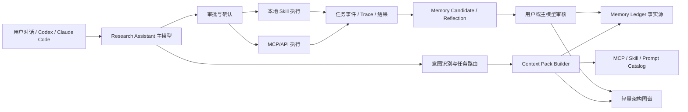
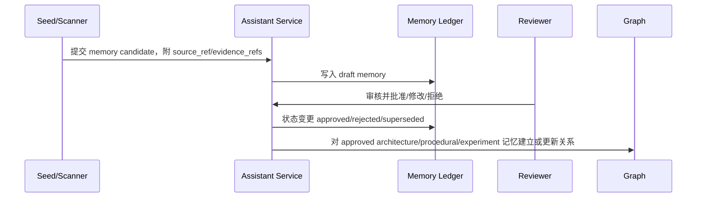
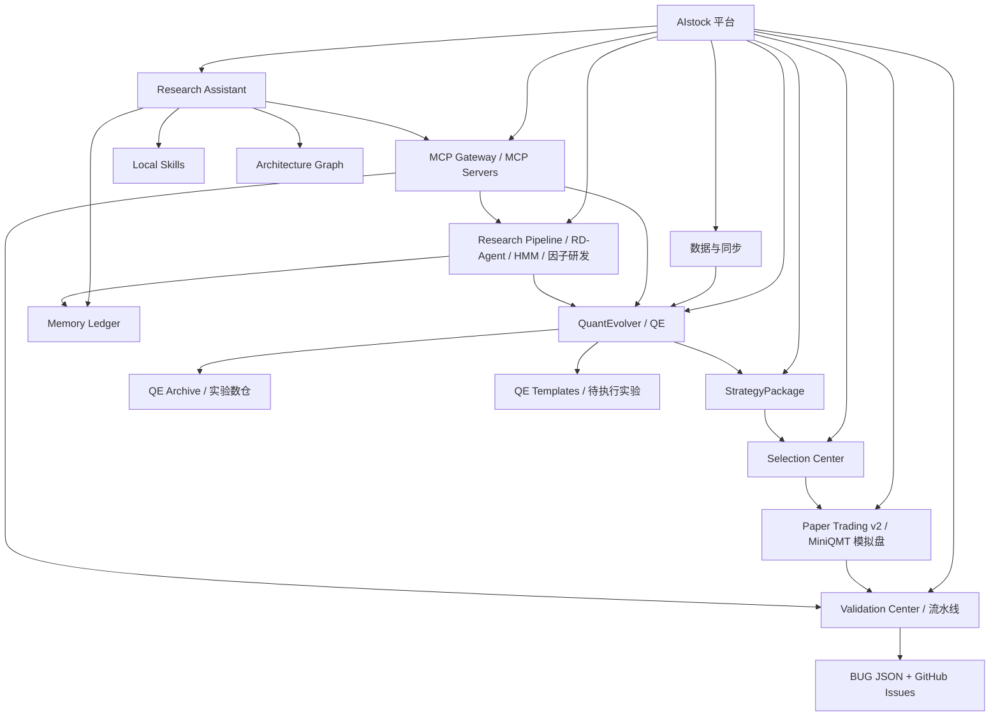
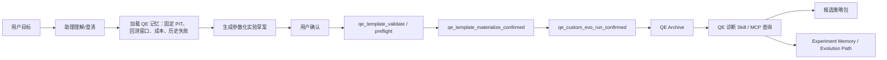
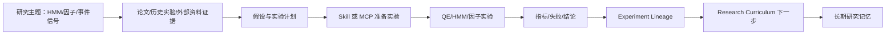

# AIstock 研究助理长期记忆与架构图谱设计方案

版本：v1.0  
日期：2026-05-23  
分支：`docs/research-assistant-memory-graph-design-20260523`  
适用范围：Research Assistant 长期记忆、AIstock 架构图谱、Context Pack、MCP/Skill 能力理解、任务流程记忆初始化。

## 1. 设计目标

本方案解决 Research Assistant 当前只有记忆/图谱表结构和 API、但缺少可用内容的问题。目标是让助理能稳定理解 AIstock 的整体软件架构、用户长期要求、研发/实验/流水线/Issue 流程，并在对话中按任务意图加载必要记忆，避免依赖模型临场猜测。

本阶段只做设计和后续实施边界定义，不改动生产服务，不重启后端，不写生产数据。

### 1.1 必须达到的能力

1. 助理能回答“AIstock 目前有哪些模块、各模块关系是什么、某个命令应该走哪个 MCP/Skill/API”。
2. 助理能在收到 QE、HMM、因子、Paper v2、Validation、Issue、GitHub、数据同步等请求时，加载对应模块记忆和流程规则。
3. 助理能把用户确认过的长期要求写成结构化候选记忆，经审批后变成 approved memory。
4. 助理能维护轻量架构图谱，表达模块、API、MCP、Skill、数据产物、流程、Issue 和实验之间的关系。
5. 助理能记录长期研究任务、实验演进路径、失败反思和下一步计划。
6. 助理不能把 RAG/向量召回结果当成事实源；Memory Ledger 和图谱记录必须有证据、状态、有效期和审批。
7. 助理不得把设计示例固化成默认行为；所有示例只能作为 eval case，不能进入运行提示词的固定目标。

### 1.2 非目标

1. Phase 1 不引入图数据库，继续使用 AIstock 原生表 `research_memory_entities`、`research_memory_relations`、`research_evolution_paths`。
2. Phase 1 不接管 Codex/Claude Code 的开发权限，不赋予助理写代码能力。
3. Phase 1 不允许助理绕过 MCP/API/审批直接操作生产数据。
4. Phase 1 不做复杂驾驶舱图形化，只保证数据模型、API、可读 UI 和 Context Pack 能力完整。
5. Phase 1 不依赖外部 Mem0、Graphiti、LangMem、Letta；它们后续只能作为只读镜像、评估或增强 adapter。

## 2. 当前基线分析

### 2.1 已存在能力

| 能力 | 当前实现位置 | 当前状态 | 缺口 |
| --- | --- | --- | --- |
| Memory Ledger 表 | `backend/db/init_research_assistant_schema_20260521.py` | 已有 `research_memory_items`、审批状态、证据字段、有效期字段 | 缺少系统化 seed、审批 UI、候选提升流程 |
| Context Pack 表 | `assistant_context_packs` | 已能记录引用和 checksum | 当前选择逻辑只按 memory_type 粗粒度拉取，未按任务意图、模块、风险分层 |
| 轻量图谱表 | `research_memory_entities`、`research_memory_relations` | 已有实体、关系、证据字段 | 当前运行库图谱为空，缺少本体、种子数据、关系规则 |
| 演进路径表 | `research_evolution_paths` | 已可记录 objective、current_best、rejected、evidence | 缺少 QE/HMM/因子研发线路的标准结构 |
| 记忆 API | `backend/routers/research_assistant.py` | `/memories`、`/context-packs` 已存在 | 需要增加 seed、导入、审计、候选审批和可读视图设计 |
| 图谱 API | `backend/routers/research_assistant.py` | `/graph/entities`、`/graph/relations`、`/graph/summary` 已存在 | 需要 graph seed、关系校验、查询路径和 Context Pack 联动 |
| MCP/Skill Catalog | `backend/services/research_assistant/service.py` | 已有能力目录和 seed | 需要与架构图谱、提示词选择、任务流程绑定 |
| Prompt Tree | `assistant_prompt_nodes` | 已有树型提示词 | 需要去除具体示例固化，改为参数化流程记忆 |

### 2.2 当前运行状态风险

最近检查生产后端接口时，`/api/v1/research-assistant/overview` 显示 `approved_memories=0`，`/api/v1/research-assistant/graph/summary` 显示实体、关系、演进路径均为 0。说明助理还没有真实长期记忆和架构图谱，只具备容器和接口。

因此，后续如果直接要求助理“理解 AIstock”，模型只能依赖当前提示词和临时上下文，无法稳定复用用户长期规则，也无法知道模块间边界。

### 2.3 设计约束来源

| 来源 | 设计约束 |
| --- | --- |
| `docs/architecture/aistock_research_agent_console_design_20260520.md` | Memory Ledger 是事实源；非 RAG；Phase 1 不引入图数据库；Context Pack 按需加载；MCP/API 优先。 |
| `docs/architecture/aistock_research_agent_console_validation_matrix_20260521.md` | 每个能力必须有验收矩阵；不能用简化版或后台 JSON 页面冒充完成。 |
| `docs/standards/aistock_development_standard_v1.5_20260523.md` | 禁止 raw JSON 主视图；生产 backend 8001 由用户重启；Issue 创建必须同步 GitHub；设计必须完整实现。 |
| `docs/standards/aistock_issue_fix_parallel_workflow_standard_20260514.md` | Issue/BUG 生命周期、同模块批处理、allowed_write_scope、MCP 持久化、GitHub 同步规则。 |
| `backend/services/research_assistant/service.py` | 已有记忆、图谱、Context Pack、Skill、MCP、模型路由服务基础。 |
| `backend/routers/research_assistant.py` | 已有 REST API，后续应复用而不是重建。 |
| `frontend/src/lib/navigation/nav-groups.ts` | 当前 UI 导航显示 AIstock 已有模块和页面，可作为架构图谱初始实体来源之一。 |

## 3. 总体方案

### 3.1 架构总览



### 3.2 三层事实模型

| 层级 | 作用 | 存储 | 是否可直接进入提示词 | 审批要求 |
| --- | --- | --- | --- | --- |
| Approved Memory | 用户规则、架构事实、流程事实、研究结论 | `research_memory_items` | 可以，但必须按 Context Pack 预算加载 | 必须有证据和审批 |
| Knowledge Graph | 模块、流程、实体和关系 | `research_memory_entities` / `research_memory_relations` | 通过关系摘要进入 | 实体可 draft，关键关系需 approved |
| Temp/Candidate Memory | 任务进展、次模型结果、未确认观察 | `assistant_temp_memories` 或 draft memory | 不直接作为事实，只能标注为待确认 | 主模型或用户审核后提升 |

## 4. 长期记忆种子设计

### 4.1 Memory 类型与命名规范

| memory_type | 用途 | subject_key 示例 | 加载时机 |
| --- | --- | --- | --- |
| `core` | 用户硬规则、生产边界、助理身份 | `user.rule.design.no_simplified_delivery` | 每次对话或高风险任务必载 |
| `procedural` | Issue、Git、验证、审批、MCP 流程 | `process.issue.github_sync` | Issue/修复/合入/验证任务 |
| `architecture` | 模块职责、API、数据流、边界 | `architecture.qe.lifecycle` | 模块相关任务 |
| `roadmap` | 长期规划、阶段目标、后续路线 | `roadmap.research_assistant.phase1` | 规划、优先级、复盘 |
| `task_state` | 当前任务、分支、PR、阻塞 | `task.BUG-109.status` | 当前任务上下文 |
| `experiment` | QE/HMM/因子实验配置、结论、失败 | `experiment.qe.fixed_pit_pool_rule` | 研究和实验任务 |
| `episodic` | 对话摘要、操作记录 | `episode.20260523.prompt_bug` | 追溯上下文 |
| `external` | 搜索、论文、行业资料证据 | `external.paper.factor_model.xxx` | 外部研究 |
| `agenda` | 提醒、待办、关注事项 | `agenda.daily.attention` | 每日汇报和提醒 |

### 4.2 Phase 1 必须初始化的核心记忆

| 编号 | memory_type | subject_key | 内容摘要 | evidence_refs |
| --- | --- | --- | --- | --- |
| M-CORE-001 | core | `user.rule.language.design_chinese` | 设计方案和正式方案文档必须使用中文，技术标识除外。 | 用户确认记录、设计规范 |
| M-CORE-002 | core | `user.rule.no_simplified_delivery` | 不允许最小版、简化版、POC 冒充完成；必须按设计和验收矩阵逐项实现。 | 开发规范、用户确认 |
| M-CORE-003 | core | `runtime.boundary.backend_restart_user_owned` | 后端服务启动/重启由用户执行；Codex 不擅自重启生产 backend。 | 开发规范 |
| M-CORE-004 | core | `ui.rule.no_raw_json_main_view` | 面向用户的主流程 UI 不得以 raw JSON、ID、后台日志作为主要视图。 | 开发规范、Research Assistant 纠偏记录 |
| M-PROC-001 | procedural | `process.issue.create_sync_github` | 正式 BUG/Issue 必须通过 Validation MCP 或等效流程分配唯一编号并同步 GitHub。 | Issue 规范、BUG allocator 设计 |
| M-PROC-002 | procedural | `process.worktree.feature_branch` | 非平凡开发默认新 worktree + 新分支，root checkout 主要作为生产运行和同步目标。 | 开发规范 |
| M-PROC-003 | procedural | `process.production_ddl_gate` | 合入 main 后如果有 DB 变更，必须报告并执行 production_ddl_gate。 | 开发规范 |
| M-ARCH-001 | architecture | `architecture.qe.backtest_fixed_pit_pool` | QE 回测与实盘必须区分；回测使用固定 PIT 股票池或用户指定股票池。 | BUG/QE 设计记录 |
| M-ARCH-002 | architecture | `architecture.research_assistant.mcp_api_first` | 助理通过 MCP/API 操作，不控制鼠标键盘；操作前要有可读计划和确认。 | Research Assistant 设计 |
| M-ARCH-003 | architecture | `architecture.paper_v2.selection_strategy_package_flow` | StrategyPackage -> Selection Center -> Paper v2 模拟盘是核心业务链路。 | Paper v2 架构图 |
| M-ROAD-001 | roadmap | `roadmap.assistant.memory_graph_phase1` | Phase 1 重点补齐长期记忆、架构图谱、Context Pack 和中文可读 UI。 | 本方案 |

### 4.3 记忆写入流程



### 4.4 审批规则

1. `core`、`procedural`、`architecture` 类型不得由次模型直接 approved。
2. `source_ref` 或 `evidence_refs` 为空时不得批准。
3. 同一 `subject_key` 新事实与旧事实冲突时，必须设置 `supersedes_id` 或 `contradicts_id`。
4. 用户明确说“记住”时，生成 draft/candidate；用户确认后才能 approved。
5. 低价模型、长上下文模型只能写 `assistant_temp_memories` 或 draft candidate，不能直接写 approved memory。

## 5. 轻量架构图谱设计

### 5.1 实体类型

| entity_type | 说明 | entity_key 示例 |
| --- | --- | --- |
| `module` | AIstock 一级功能模块 | `module.qe`, `module.paper_v2`, `module.validation_center` |
| `submodule` | 模块内子系统 | `submodule.qe_templates`, `submodule.selection_center` |
| `api_router` | 后端 API 路由 | `api.research_assistant`, `api.qe_templates` |
| `frontend_route` | 前端页面 | `ui.research_assistant.chat`, `ui.quantevolver.templates` |
| `mcp_server` | MCP 服务 | `mcp.aistock_validation`, `mcp.qe_experiment` |
| `mcp_tool` | MCP 工具 | `mcp_tool.qe_template_materialize_confirmed` |
| `skill` | 本地 Skill 能力 | `skill.qe_evolution_diagnostics`, `skill.develop_factor` |
| `data_asset` | DB 表、artifact、manifest、股票池、模型文件 | `data.qe_archive`, `data.fixed_pit_stock_pool` |
| `process` | 业务流程 | `process.qe_experiment_lifecycle`, `process.issue_fix_lifecycle` |
| `rule` | 约束/门禁 | `rule.no_raw_json_ui`, `rule.github_issue_sync` |
| `issue` | BUG/GitHub Issue | `issue.BUG-109` |
| `experiment` | QE/HMM/因子实验 | `experiment.qe.<id>` |
| `research_topic` | 长期研究主题 | `topic.hmm_evolution`, `topic.factor_research` |

### 5.2 关系类型

| relation_type | 含义 | 示例 |
| --- | --- | --- |
| `contains` | 模块包含子模块/API/UI | `module.qe contains submodule.qe_templates` |
| `exposes` | 模块暴露 API/MCP/Skill | `module.validation_center exposes mcp.aistock_validation` |
| `uses` | 流程使用工具或模块 | `process.qe_experiment_lifecycle uses mcp.qe_experiment` |
| `depends_on` | 依赖数据、模块或规则 | `module.selection_center depends_on module.strategy_package` |
| `produces` | 产生数据资产或结果 | `process.qe_experiment_lifecycle produces data.qe_archive` |
| `consumes` | 消费数据资产 | `module.paper_v2 consumes data.strategy_package_manifest` |
| `guards` | 规则保护流程 | `rule.fixed_pit_pool guards process.qe_backtest` |
| `blocks` | Issue 阻塞流程 | `issue.BUG-109 blocks process.assistant_qe_planning` |
| `verifies` | 流水线验证模块/流程 | `module.validation_center verifies module.qe` |
| `owned_by` | 工具/团队职责边界 | `module.paper_v2 owned_by claude_code_boundary` |
| `supersedes` | 新规则替代旧规则 | 新规范 supersedes 旧规范 |
| `relates_to` | 研究主题或证据关联 | 论文证据 relates_to factor_research |

### 5.3 初始架构图谱



### 5.4 Phase 1 图谱种子实体清单

| entity_key | entity_type | title | 核心摘要 |
| --- | --- | --- | --- |
| `module.research_assistant` | module | 研究助理 | 对话入口、任务计划、MCP/Skill 编排、长期记忆和图谱。 |
| `module.validation_center` | module | 流水线中心 | 测试计划、模块质量、BUG registry、GitHub Issue 同步。 |
| `module.qe` | module | QuantEvolver | 因子、模型、实验、模板、自动演进、候选策略包。 |
| `module.qe_archive` | submodule | QE 实验数仓 | 归档实验结果、质量指标、trial、seed、hyperparam、factor usage。 |
| `module.strategy_package` | module | 策略包 | 冻结模型/因子/manifest，作为 Selection Center 和 Paper v2 输入。 |
| `module.selection_center` | module | 统一选股中心 | 基于策略包执行 PIT 选股和聚合选股。 |
| `module.paper_v2` | module | Paper Trading v2 | 组合、运行配置、模拟盘执行、运行监控。 |
| `module.hmm` | module | HMM / 市场状态 | 市场状态、风险门控、模型演进和 Paper v2 runtime 配置。 |
| `module.rdagent` | module | RD-Agent | 多节点调度、任务资产同步、因子/模型研发。 |
| `module.data_sync` | module | 数据同步 | 本地数据、数仓、Tushare/市场数据同步。 |
| `mcp.aistock_validation` | mcp_server | Validation MCP | BUG/Issue、验证计划、质量结果、GitHub 同步。 |
| `mcp.qe_experiment` | mcp_server | QE Experiment MCP | QE template、custom evo、实验状态、日志和 trade stats。 |
| `mcp.qe_archive` | mcp_server | QE Archive MCP | QE Archive 查询、backfill、worker、质量查询。 |
| `skill.qe_evolution_diagnostics` | skill | QE 实验诊断 Skill | 分析 QE loop 指标、label horizon、IC/RankIC、稳定性。 |
| `skill.develop_factor` | skill | 因子研发 Skill | 因子开发、验证、指标计算、分类和 IC 筛选。 |

### 5.5 初始关键关系清单

| source | relation_type | target | 说明 |
| --- | --- | --- | --- |
| `module.research_assistant` | `uses` | `mcp.aistock_validation` | 登记/查询/同步 Issue 和验证结果。 |
| `module.research_assistant` | `uses` | `mcp.qe_experiment` | 创建/验证/物化/运行 QE 实验。 |
| `module.research_assistant` | `uses` | `mcp.qe_archive` | 查询 QE 历史与实验质量。 |
| `module.research_assistant` | `uses` | `skill.qe_evolution_diagnostics` | 复杂实验诊断。 |
| `module.research_assistant` | `uses` | `skill.develop_factor` | 因子研发场景。 |
| `module.qe` | `produces` | `module.strategy_package` | 候选策略包来自 QE 实验/演进结果。 |
| `module.strategy_package` | `depends_on` | `module.qe_archive` | 策略包需可追溯实验和 manifest。 |
| `module.selection_center` | `depends_on` | `module.strategy_package` | 选股应基于已验证策略包，但平台过滤规则不能绑定到单个策略包 artifact。 |
| `module.paper_v2` | `consumes` | `module.selection_center` | 模拟盘接收选股结果。 |
| `module.validation_center` | `verifies` | `module.research_assistant` | 流水线验证助理 API、UI、MCP、记忆。 |
| `rule.github_issue_sync` | `guards` | `process.issue_fix_lifecycle` | 创建 issue 时必须同步 GitHub。 |
| `rule.fixed_pit_pool` | `guards` | `process.qe_backtest` | QE 回测使用固定 PIT 股票池。 |
| `issue.BUG-109` | `blocks` | `process.assistant_qe_planning` | 示例 10 loop 固化会误导 QE 计划。 |

## 6. 核心业务流程图谱

### 6.1 QE 实验创建与演进流程



关键记忆加载：`architecture.qe.backtest_fixed_pit_pool`、`process.qe.experiment_approval`、`experiment.qe.failure_lessons`、`tool.qe_mcp.preflight_required`。

### 6.2 Issue/BUG 发现与修复流程


关键记忆加载：`process.issue.create_sync_github`、`process.worktree.feature_branch`、`process.production_ddl_gate`、`process.issue.batch_same_module`。

### 6.3 StrategyPackage 到 Paper v2 流程


关键记忆加载：`architecture.paper_v2.selection_strategy_package_flow`、`rule.strategy_package_manifest_frozen`、`rule.selection_platform_data_boundary`、`process.paper_v2.runtime_approval`。

### 6.4 HMM、因子和长期研究流程



关键记忆加载：`research_topic.hmm_evolution`、`research_topic.factor_research`、`experiment.lineage.*`、`external.paper.*`。

## 7. Context Pack 选择算法

### 7.1 输入

| 输入 | 来源 |
| --- | --- |
| 用户消息 | 主对话窗口 |
| 当前 conversation/task | `assistant_conversations`、`research_agent_tasks` |
| 意图分类 | Prompt Tree + 规则/模型混合 |
| 模块关键词 | QE、HMM、因子、Paper、Issue、GitHub、流水线、数据同步等 |
| 风险等级 | 只读、草稿、preflight、写入、生产敏感 |
| 工具需求 | MCP/Skill/API |
| token_budget | 模型路由策略 |

### 7.2 选择步骤

1. 识别任务域：`qe`、`issue`、`paper_v2`、`validation`、`hmm`、`factor`、`data_sync`、`assistant_memory`。
2. 必载 `core` 记忆：用户硬规则、生产边界、UI 可读性、审批边界。
3. 按任务域加载 `procedural` 记忆：Issue 流程、QE 审批流程、Paper v2 流程、验证流程。
4. 按模块加载 `architecture` 记忆和图谱邻接关系：当前模块、上游、下游、MCP、Skill、关键数据资产。
5. 如果是研究任务，加载相关 `experiment` 和 `research_topic` 演进路径。
6. 如果是当前任务延续，加载 `task_state` 和同 conversation 历史摘要。
7. 把召回内容压缩为中文 Context Pack 摘要，明确列出“已加载事实”和“未加载但可能相关”。
8. 记录 `research_memory_access_log`，用于事后审计：为什么加载、是否进入 prompt、是否影响结论。

### 7.3 选择伪代码

```text
build_context_pack(user_message, task_id, phase, token_budget):
  intent = classify_intent(user_message)
  domains = detect_domains(user_message, intent)
  risk = classify_risk(user_message, phase)

  required = core_memories(always=True)
  required += procedural_memories(domains, risk)
  required += architecture_memories(domains)
  graph_refs = graph_neighbors(domains, relation_types=[uses, depends_on, guards, produces, consumes])

  if task_id:
    required += task_state_memories(task_id)
    required += temp_memories(task_id)

  if domains include research/qe/hmm/factor:
    required += experiment_memories(domains, recent_or_relevant=True)
    graph_refs += evolution_paths(domains)

  ranked = rank_by(approval_status, risk_match, recency, evidence_strength, subject_specificity)
  selected, omitted = fit_token_budget(ranked, token_budget)
  return context_pack(selected, graph_refs, omitted, summary)
```

### 7.4 防止误加载和 token 浪费

1. 不因用户提到“实验”就加载全部 QE 文档；只加载 QE 核心规则、相关 MCP、历史失败摘要。
2. 不把所有开发规范全文塞入 prompt；只加载已拆分的 `core/procedural` 规则。
3. 不把 GitHub Issue 全量列表塞入 prompt；只加载当前 issue 或相关模块 open P0/P1 摘要。
4. 不把图谱全图塞入 prompt；只加载当前实体 1-2 跳邻居和关键 guard 关系。
5. 大文档和历史日志先由次模型生成 temp summary，主模型审核后进入 candidate memory。

## 8. 种子数据生成方案

### 8.1 数据来源

| 来源 | 采集方式 | 入库类型 |
| --- | --- | --- |
| `frontend/src/lib/navigation/nav-groups.ts` | 解析导航组和页面 | `frontend_route` 实体、模块实体 |
| `backend/main.py` | 解析 `include_router` | `api_router` 实体、模块 API 关系 |
| `backend/services/*` | 目录扫描 | `module/submodule` 实体 |
| `backend/mcp/modules/*`、`scripts/aistock_*mcp*.py` | 解析 MCP server/tool | `mcp_server`、`mcp_tool` 实体 |
| `docs/architecture/*` | 人工 curated 摘要，不做 LLM 自动事实确认 | `architecture` memory、graph 关系 |
| `docs/standards/*` | 规则拆分 | `core/procedural` memory、`rule` 实体 |
| `tests/aistock_validation/bugs/*.json` | 读取 open P0/P1、模块、GitHub 链接 | `issue` 实体、blocks 关系 |
| QE Archive / QE Templates API | 只读查询 | `experiment` memory、evolution path |

### 8.2 Seed 工具设计

新增后续实现脚本或服务能力：

| 能力 | 建议位置 | 行为 |
| --- | --- | --- |
| 架构扫描 | `backend/services/research_assistant/bootstrap/architecture_scanner.py` | 扫描导航、router、service、MCP，生成 draft entities/relations |
| 规范拆分 | `backend/services/research_assistant/bootstrap/standards_seed.py` | 把开发规范拆为 core/procedural memory candidates |
| 业务流程 seed | `backend/services/research_assistant/bootstrap/process_seed.py` | 写入 QE、Issue、Paper v2、HMM、因子流程模板 |
| 图谱校验 | `backend/services/research_assistant/bootstrap/graph_validator.py` | 检查孤立实体、无证据关系、重复 key、无效 source/target |
| API | `POST /api/v1/research-assistant/memory-bootstrap/preview` | 预览待写入数据，不落库 |
| API | `POST /api/v1/research-assistant/memory-bootstrap/apply-confirmed` | 经确认写入 draft/approved，必须可审计 |

### 8.3 写入策略

1. 系统自动扫描产生的事实默认 `draft`。
2. 来自已合入规范的硬规则可通过确认批次转为 `approved`。
3. 来自代码结构的实体可 `approved`，但关系必须附文件路径证据。
4. 来自用户对话的偏好先 `draft`，用户明确确认后 `approved`。
5. 后续代码变更时，seed 工具要能识别过期实体并设置 `valid_to`，不能直接删除历史关系。

## 9. 管理 UI 设计

### 9.1 主对话入口

主对话入口不显示 raw JSON。它只展示：

1. 本轮理解：助理复述任务目标。
2. 本轮加载记忆：用中文卡片展示 3-8 条关键记忆，包括来源和状态。
3. 本轮需要确认：哪些操作需要用户确认。
4. 本轮计划：可执行步骤、使用 MCP/Skill、风险等级。
5. 执行进展：图形化步骤条、状态灯、错误摘要。
6. 结果总结：做了什么、证据、下一步。

### 9.2 记忆管理页

路由建议：`/research-assistant/memory`

页面卡片：

| 卡片 | 功能 |
| --- | --- |
| 记忆总览 | approved/draft/rejected/expired 数量，按类型统计 |
| 待确认记忆 | 用户可以批准、修改、拒绝 |
| 关键规则 | core/procedural 记忆列表，展示证据和有效期 |
| 架构记忆 | 模块说明、API、边界、来源 |
| 研究记忆 | QE/HMM/因子实验结论和下一步 |
| 冲突记忆 | contradicts/supersedes 需要处理的记录 |

### 9.3 图谱管理页

路由建议：`/research-assistant/graph`

Phase 1 不要求复杂驾驶舱，但必须有可读表格和小型关系视图：

1. 实体列表：模块、API、MCP、Skill、流程、规则、Issue。
2. 实体详情：摘要、证据、入边、出边、相关记忆。
3. 关系列表：source、relation、target、证据、状态。
4. 选中实体一跳关系图：可用简单节点图或分组卡片，不显示 JSON。
5. 图谱健康：孤立实体、draft 关系、无证据关系、过期关系。

### 9.4 Context Pack 审计页

路由建议：`/research-assistant/context-packs`

用于回答“助理为什么这样理解”：

1. 本轮加载了哪些记忆。
2. 哪些图谱关系进入 prompt。
3. 哪些记忆因为 token 预算被省略。
4. 哪些内容来自临时记忆，不能作为正式事实。
5. 本轮回答引用了哪些 evidence_refs。

## 10. MCP 与 Skill 理解规则

### 10.1 MCP 场景

MCP 适合操作 AIstock 已有模块和受控流程：

| 场景 | MCP |
| --- | --- |
| 创建/验证/物化/运行 QE 模板 | `aistock-qe-experiment` |
| 查询 QE Archive、backfill、质量指标 | `aistock-qe-archive` |
| 创建/查询/同步 BUG 和 GitHub Issue | `aistock-validation` |
| 执行验证计划、查询流水线结果 | `aistock-validation` |
| 未来股票分析报告 | 新增 `aistock-stock-analysis` MCP |

### 10.2 Skill 场景

Skill 适合复杂分析、研发、离线处理和解释型任务：

| 场景 | Skill |
| --- | --- |
| QE loop 深度诊断 | `qe-evolution-diagnostics` |
| 因子开发和验证 | `develop-factor` |
| 因子库分析 | `analyze-factor-library` |
| RDAgent 数据健康检查 | `rdagent-data-doctor` |
| RDAgent task 分析 | `rdagent-task-analyzer` |

### 10.3 MCP + Skill 联合流程

示例：用户要求“基于最近 QE 结果设计新实验”。

1. MCP 查询 QE Archive 获取结构化实验结果。
2. Skill 做复杂诊断和候选方向分析。
3. 助理生成实验草案和确认问题。
4. 用户确认后 MCP 创建模板。
5. 结果进入 Experiment Memory 和 Evolution Path。

## 11. 数据质量和一致性规则

1. 所有 approved memory 必须有 evidence_refs。
2. 所有 relation 必须有 source_entity_id、target_entity_id、relation_type、evidence_refs。
3. 同一 namespace 下 `(entity_type, entity_key)` 唯一。
4. 图谱 relation 不得引用不存在的实体。
5. 关系状态变更不得删除历史，使用 `valid_to` 和新关系替代。
6. 记忆和图谱写入必须记录 actor、source、checksum。
7. Context Pack 必须记录 omitted_relevant_refs，避免误以为未加载内容不存在。
8. 任何生产敏感流程只允许加载 approved core/procedural 规则作为门禁依据。

## 12. 分阶段实施计划

### Phase 0：设计冻结和基线确认

交付物：

1. 本设计方案合入 main。
2. 当前 Research Assistant 记忆/图谱状态快照。
3. 种子来源清单和验收矩阵。
4. BUG-109 作为提示词示例固化问题单独修复，不混入本阶段。

验收：

- 文档前后一致；没有“简化版”“最小版”交付描述。
- 方案覆盖 Memory、Graph、Context Pack、UI、MCP/Skill、流程和验证。

### Phase 1：Memory/Graph Bootstrap 完整交付

交付物：

1. Bootstrap preview/apply API。
2. 架构扫描器：router、service、frontend nav、MCP、Skill。
3. 规范/流程 seed：core/procedural/architecture/roadmap 初始记忆。
4. 图谱 seed：模块、API、MCP、Skill、流程、规则、Issue。
5. Context Pack 选择器升级：按意图/模块/风险加载。
6. 中文可读 Memory/Graph/Context Pack 管理 UI。
7. 单测、API 测试、前端 typecheck 和 UI smoke。

验收：

- `/graph/summary` 不再为空，至少包含 Phase 1 种子实体和关系。
- `/memories` 至少包含 approved core/procedural/architecture 基础记忆。
- 对 QE、Issue、Paper v2、HMM、因子五类输入，Context Pack 加载不同记忆集合。
- UI 不以 raw JSON 作为主视图。
- 所有 seed 都可预览、可审计、可重复执行、不会重复写入。

### Phase 2：研究演进和外部证据增强

交付物：

1. Experiment Lineage 和 Research Curriculum UI。
2. QE/HMM/因子实验结果进入长期记忆的审核流。
3. 外部搜索/论文证据作为 `external` memory candidate。
4. Graphiti/Zep 只读镜像 PoC，不替代原生事实源。

### Phase 3：多任务长期助理

交付物：

1. 多长期任务并行状态：HMM、QE、因子、事件信号。
2. 日报/提醒/待办 agenda memory。
3. 主模型调度次模型，次模型写 temp memory，主模型审核提升。
4. 语音能力预留接口接入。

## 13. 功能验收矩阵

| 编号 | 功能 | 验收标准 | 验证方式 |
| --- | --- | --- | --- |
| MG-001 | Memory seed preview | 能预览将写入的 core/procedural/architecture/roadmap 记忆，不落库 | API 测试 |
| MG-002 | Memory seed apply | 确认后写入 draft/approved，重复执行不重复 | API + DB 查询 |
| MG-003 | Evidence gate | approved memory 无 evidence_refs 时拒绝 | 单测 |
| MG-004 | Graph seed preview | 能预览模块、API、MCP、Skill、流程、规则实体和关系 | API 测试 |
| MG-005 | Graph seed apply | 写入实体关系，关系引用有效实体，重复执行幂等 | 单测 + API |
| MG-006 | Graph evidence gate | 关系无 evidence_refs 时拒绝 | 单测 |
| MG-007 | Context Pack by domain | QE/Issue/Paper/HMM/Factor 输入加载不同 memory refs | 单测 |
| MG-008 | Context Pack audit | 记录 loaded refs、omitted refs、retrieval reason | API 测试 |
| MG-009 | Assistant chat integration | 对话返回中文说明“本轮加载了哪些记忆”，不显示 raw JSON | UI/API smoke |
| MG-010 | Memory UI | 可读卡片展示记忆，支持筛选、批准、拒绝、过期 | Playwright smoke |
| MG-011 | Graph UI | 可读展示实体、关系、一跳邻居和图谱健康 | Playwright smoke |
| MG-012 | No RAG facts | 向量/外部证据不得直接作为 approved fact | 单测/代码检查 |
| MG-013 | BUG/Issue linkage | open P0/P1 issue 能进入图谱并关联模块 | API 测试 |
| MG-014 | Experiment lineage | QE/HMM/因子研究结果能形成 evolution path candidate | API 测试 |
| MG-015 | Token budget | Context Pack 不加载全文规范，只加载拆分规则和摘要 | 单测/快照 |
| MG-016 | UI raw JSON guard | 主入口和管理页不以 JSON 作为主要视图 | UI smoke + grep |
| MG-017 | Source consistency | seed 数据来源路径存在，checksum 可复算 | 单测 |
| MG-018 | Production boundary | 不启动/重启 backend，不直接写生产敏感数据 | 执行记录 |

## 14. 实施注意事项

1. 本方案是在现有 Research Assistant 基础上扩展，不重建模块。
2. 数据库表已存在时优先复用；缺字段时通过正式 DDL 和 production_ddl_gate 处理。
3. BUG-109 修复应在独立 bug worktree 中完成，本设计分支不混入该修复。
4. 所有运行提示词中的示例必须参数化，避免再次把“10 loop”这类示例固化为默认行为。
5. Seed 工具必须 fail-fast，不能因解析失败而静默跳过关键来源。
6. 文档、代码、UI、测试必须按验收矩阵逐项交付，不能只交付后台 JSON 管理页。

## 15. AIstock 全架构与流程记忆映射

本章把当前 AIstock 已存在的主要模块映射为助理可理解的长期记忆和图谱实体。后续 seed 工具应以此为初始白名单，再结合代码扫描自动补充。

### 15.1 前端功能导航到图谱实体

| 导航组 | 关键页面 | 图谱模块 | 助理理解重点 |
| --- | --- | --- | --- |
| QuantEvolver | `/quantevolver`、`/quantevolver/factors`、`/quantevolver/models`、`/quantevolver/strategies`、`/quantevolver/templates`、`/quantevolver/evolution`、`/quantevolver/prompts` | `module.qe` | 因子、模型、策略、模板、实验、提示词、自动演进是 QE 研发闭环。 |
| QE Archive | `/qe-archive` | `module.qe_archive` | QE 结果数仓，支持实验质量、trial、seed、hyperparam、factor usage 查询。 |
| RD-Agent 管理 | `/rdagent/dispatch`、`/rdagent/tasks-sync`、`/rdagent/tasks`、`/rdagent/task-selection` | `module.rdagent` | 多节点调度、任务资产同步、RDAgent 研发任务和选股。 |
| 自动化流水线 | `/validation-center`、`/research-pipeline`、`/research-assistant` | `module.validation_center`、`module.research_pipeline`、`module.research_assistant` | 测试验证、Issue、分支、LLM 探测、助理调度。 |
| 系统与数据 | `/config`、`/local-data`、`/rdagent/dispatch/system-monitor`、`/rdagent/dispatch/db-monitor` | `module.data_sync`、`module.system_monitoring` | 环境、数据、主机资源、DB 状态。 |
| 股票分析 | `/analysis`、`/analysis-trend` | `module.stock_analysis` | 未来应补充股票分析 MCP，输入股票代码生成分析报告。 |
| 选股板块 | `/watchlist`、`/cloud-screening`、`/market-news` | `module.watchlist`、`module.cloud_screening`、`module.market_news` | 自选股、云选股、市场资讯。 |
| 投资管理 | `/portfolio`、`/smart-monitor`、`/monitor` | `module.portfolio`、`module.smart_monitor` | 持仓分析、AI 盯盘、实时监控。 |
| QMT 模拟盘交易 | `/qmt/positions`、`/qmt/strategies`、`/qmt/virtual-strategies` | `module.qmt_sim` | 当前模拟盘/虚拟策略，不等同未来实盘权限。 |
| Paper Trading v2 | `/paper-v2`、`/paper-v2/packages`、`/paper-v2/selection`、`/paper-v2/portfolios`、`/paper-v2/model-hmm` | `module.paper_v2`、`module.strategy_package`、`module.selection_center`、`module.hmm` | 策略包治理、统一选股、模拟盘组合、HMM runtime。 |

### 15.2 后端 Router 到图谱实体

| Router | 图谱实体 | 助理用途 |
| --- | --- | --- |
| `research_assistant` | `api.research_assistant` | 对话、任务、记忆、图谱、MCP/Skill、模型路由、审批。 |
| `validation` | `api.validation_center` | 流水线、BUG registry、验证计划、GitHub Issue。 |
| `qe_templates` | `api.qe_templates` | QE 待执行实验模板创建、验证、物化。 |
| `quantevolver` / `quantevolver_evolution` | `api.qe` | QE 实验、演进、因子指标、日志。 |
| `qe_archive` | `api.qe_archive` | QE 数仓查询、归档、质量。 |
| `strategy_packages` | `api.strategy_package` | 策略包、manifest、候选策略包治理。 |
| `selection_center` | `api.selection_center` | 统一选股和平台选股能力。 |
| `paper_trading_v2` / `simulation_runtime` | `api.paper_v2` | 模拟盘组合、运行、ledger、runtime。 |
| `hmm_training` / `market_regime` | `api.hmm` | HMM 训练、市场状态、runtime gate。 |
| `rdagent*` / `dispatch` | `api.rdagent` | RD-Agent 配置、任务、调度、模型配置。 |
| `qmt` / `qmt_strategy_ledger` | `api.qmt` | QMT 模拟盘、订单、持仓和策略 ledger。 |
| `stocks` / `stock_universe` / `analysis` / `cloud_screening` | `api.stock_analysis` | 股票分析、股票池、云选股。 |
| `ingestion` / `quant` / `config_env` | `api.data_sync` | 数据接入、量化数据、环境配置。 |

### 15.3 服务目录到图谱实体

| 服务目录 | 图谱实体 | 记忆类型 |
| --- | --- | --- |
| `backend/services/research_assistant` | `module.research_assistant` | architecture/procedural |
| `backend/services/research_pipeline` | `module.research_pipeline` | architecture |
| `backend/services/validation` | `module.validation_center` | procedural/architecture |
| `backend/services/qe_templates` | `module.qe_templates` | architecture/experiment |
| `backend/services/qe_archive` | `module.qe_archive` | architecture/experiment |
| `backend/services/quantevolver` | `module.qe` | architecture/experiment |
| `backend/services/strategy_package` | `module.strategy_package` | architecture/process |
| `backend/services/selection_center` | `module.selection_center` | architecture/process |
| `backend/services/paper_trading_v2` | `module.paper_v2` | architecture/process |
| `backend/services/simulation_runtime` | `module.simulation_runtime` | architecture/process |
| `backend/services/qmt_strategy_ledger` | `module.qmt_strategy_ledger` | architecture/process |
| `backend/services/trading_core` | `module.trading_core` | architecture/risk_boundary |
| `backend/services/model_registry` | `module.model_registry` | architecture/experiment |
| `backend/services/event_signal` | `module.event_signal` | experiment/architecture |
| `backend/services/rl_execution` | `module.rl_execution` | architecture/experiment |
| `backend/services/sync_modules` | `module.data_sync` | architecture/procedural |

### 15.4 MCP 到图谱实体

| MCP 服务 | 关键能力 | 关系 |
| --- | --- | --- |
| `aistock-validation` | BUG/Issue、验证计划、质量汇总、GitHub 同步 | `module.research_assistant uses mcp.aistock_validation` |
| `aistock-qe-experiment` | QE template、custom evo、实验状态、日志、trade stats | `module.research_assistant uses mcp.qe_experiment` |
| `aistock-qe-archive` | QE Archive 查询、backfill、worker、质量查询 | `module.research_assistant uses mcp.qe_archive` |
| `research_assistant` gateway module | 助理任务、记忆、图谱、Context Pack、MCP/Skill 目录 | `mcp.gateway exposes module.research_assistant` |
| `research` gateway module | Research Pipeline 能力 | `mcp.gateway exposes module.research_pipeline` |

### 15.5 关键流程到记忆包

| 用户命令类型 | 必载 core/procedural | 必载 architecture | 可选 experiment/task |
| --- | --- | --- | --- |
| “创建 QE 实验” | 审批门禁、固定 PIT 股票池、MCP preflight、禁止示例固化 | QE、QE Templates、QE Archive、MCP qe_experiment | 最近相似实验、失败反思、候选因子来源 |
| “分析 QE 结果” | 只读查询、证据引用 | QE Archive、QE 诊断 Skill | 实验 lineage、loop 指标、历史结论 |
| “修复 BUG/Issue” | BUG 编号、GitHub 同步、worktree、验证、DDL gate | Validation Center、相关模块架构 | 当前 BUG JSON、GitHub issue、历史失败 |
| “检查流水线状态” | 只读验证、不得重启生产 backend | Validation Center、GitHub Actions、模块质量 | 最新验证结果、open P0/P1 |
| “创建策略包并选股” | 策略包 manifest、Selection Center 平台边界、Paper v2 审批 | StrategyPackage、Selection Center、Paper v2 | 候选策略包、选股历史、模拟盘状态 |
| “HMM 演进研究” | 研究任务记录、实验验证、不能静默降级 | HMM、Market Regime、QE、Paper v2 runtime | HMM lineage、论文证据、历史失败 |
| “开发因子” | Skill 执行边界、IC/RankIC、数据泄漏边界 | 因子库、QE、RDAgent | 因子实验记录、替换建议、失败反思 |
| “股票代码分析” | 只读查询、外部搜索证据标记 | Stock Analysis、Market News、未来股票 MCP | 个股报告、行业新闻、提醒 |

### 15.6 助理必须能回答的架构问题

完成本方案实施后，助理至少要能基于 Memory/Graph 回答：

1. “创建 QE 实验应该用哪些 MCP？为什么要先确认固定 PIT 股票池？”
2. “发现 Bug 后怎样创建唯一编号并同步 GitHub？”
3. “StrategyPackage、Selection Center、Paper v2 的上下游关系是什么？”
4. “HMM runtime 与 Paper v2 的边界是什么？”
5. “当前 AIstock 哪些模块可以通过 MCP 操作，哪些需要 Skill 分析？”
6. “本轮回答加载了哪些长期记忆？哪些内容是临时记忆，不能作为事实？”
7. “某个模块有哪些 open P0/P1 issue 阻塞？”
8. “我之前确认过哪些硬规则会影响这次任务？”

## 16. 后续实施建议

建议下一步创建实现分支：

- worktree：`F:\Dev\AIstock_worktrees\research-assistant-memory-graph-bootstrap-20260523`
- branch：`feature/research-assistant-memory-graph-bootstrap-20260523`

实施顺序：

1. 后端 bootstrap preview/apply API 和幂等 seed 写入。
2. 架构 scanner 和 seed 数据生成。
3. Context Pack selector 升级。
4. Memory/Graph 中文可读 UI。
5. Chat 主入口展示“本轮加载记忆”和“依据哪些图谱关系”。
6. 单测、API、前端 typecheck、UI smoke、设计验收矩阵逐项核对。

