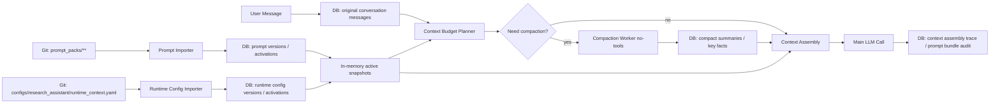

# Research Assistant Prompt & Context Runtime Governance 统一设计方案

- **版本**: v1.0
- **日期**: 2026-05-24
- **状态**: 统一实施设计；整合 Prompt Pack 运行时治理、上下文压缩、Claude Code 可借鉴机制、配置化要求与 P0 类人对话治理
- **适用范围**: Research Assistant 主提示词、压缩提示词、恢复提示词、上下文预算、自动压缩、上下文装配、运行审计
- **关联文档**:
  - `docs/architecture/research_assistant_prompt_pack_runtime_design_20260524.md`
  - `docs/architecture/research_assistant_context_compression_design_20260524.md`
- **硬约束**: 所有可调参数和用户可见对话模板必须来自配置版本、Prompt Pack、capability catalog、UI copy config 或运行 activation；业务代码不得硬编码 token 限制、消息条数、fresh tail 长度、压缩阈值、模型温度、输出 token、模型名、工具权限、能力问答话术、确认问题或 workflow 路由规则。
- **本次提交边界**: 仅更新设计文档；不修改运行时代码、不触碰生产 `8001`/`3000`、不写生产 DB。

## 1. 统一结论

Research Assistant 的提示词治理和对话上下文压缩不应作为两个独立项目实施。它们都属于同一个运行时装配链：

```text
Active Prompt Pack
  + Active Runtime Config
  + Context Pack / Memory
  + Compact Summaries / Key Facts
  + Fresh Tail
  + Current User Message
  -> Final LLM Input
```

统一后的最佳方案是：

1. **Prompt Pack 管提示词**：主提示词、压缩提示词、恢复提示词、key-fact 提取提示词、guard prompt、renderer prompt 都进入 Git 文件权威源、DB version/activation、内存热缓存。
2. **Runtime Config 管参数**：上下文窗口比例、压缩触发、fresh tail、历史分页、检索、压缩 worker、输出 token、重试、降级策略全部进入配置文件和 DB activation。
3. **Context Runtime 管对话生命周期**：原始消息永久保留；压缩摘要、关键事实、检索片段和上下文装配 trace 都是可追溯派生产物。
4. **Chat Runtime 只读 active snapshot**：每轮请求从内存读取 active prompt snapshot 和 active runtime config snapshot，不在热路径反复读文件或扫描全量 DB。
5. **超限自动处理且用户无感**：在预计超出模型上下文前主动压缩；如果 provider 返回上下文超限，再执行 reactive compact + retry；用户无需手动清理上下文。
6. **不承诺“摘要绝对无损”，但实现“关键事实不丢 + 原文可回溯”**：压缩摘要是派生上下文，原始消息仍是事实源；关键确认、参数、审批和待办必须结构化保存并带 source refs。
7. **对话治理先于执行治理**：能力询问、概念解释、状态查询、bug 诊断和普通对话必须先得到简洁直接回答；只有明确任务请求才进入 planner、proposal、confirmation、preflight 和 execute。

### 1.1 P0 类人对话治理统一要求

Prompt、context、runtime config 和 MCP/Skill 执行闭环必须共享同一套意图理解规则：

1. 用户问“能做什么”时，回答能力范围、输入要求和边界；不追加计划卡，不解释内部意图分类，不主动进入任务流程。
2. 用户问“是什么/为什么/当前状态”时，回答解释或状态；不因关键词召回而自动创建 workflow。
3. 用户明确要求“设计/创建/校验/运行/提交/诊断”时，才进入相应任务链路，并按风险展示必要确认。
4. `QE`、`实验`、`回测`、`bug`、`issue`、`MCP` 等词只作为候选召回信号，不能作为 workflow trigger。
5. 所有 active prompt、runtime config、backend/frontend 用户可见文案不得默认出现特定 loop 数；迭代数量只能来自用户输入、能力 schema 必填项或已保存任务事实。
6. 主回答默认只保留结论和必要澄清；过程卡、trace、上下文健康、候选能力和 preflight 细节应折叠展示。

## 2. 与 Claude Code 方案的匹配和边界

| Claude Code 机制 | 是否采用 | AIstock 改造方式 |
| --- | --- | --- |
| 文件化长期指令 | 采用 | 对应 `prompt_packs/**`，但必须增加 DB activation 和审计 |
| AutoCompact | 采用 | 改为可配置阈值、结构化摘要、source refs、key facts、DB 可回溯 |
| Fresh Tail | 采用 | 长度和单位由 runtime config 控制，不在代码中写死 |
| 压缩子调用禁用工具 | 采用 | 不只靠 prompt；由 worker policy 强制 `tools_enabled=false` |
| Hooks / lifecycle | 采用 | 映射为 `before_context_assembly`、`before_compaction`、`after_compaction`、`after_llm_call` |
| Subagent 独立上下文 | 部分采用 | 只用于受控 `compaction_worker`，不开放任意自动代理 |
| 权限设置 | 采用 | 映射到 MCP/API gate、approval、tool risk policy、DB role |
| cache edits | 不采用为基线 | 供应商专属能力，不适合作为多模型 RA 基线 |
| 头部截断保底 | 仅限非关键 artifact | 用户确认、参数、审批、风险边界不得用截断兜底 |

借鉴重点是“机制”，不是直接照搬实现。AIstock 必须保留产品系统所需的版本、审计、回滚、UI 查询和生产边界。

## 3. 统一架构



## 4. 配置优先原则

### 4.1 不允许硬编码的参数类别

以下内容不得以 Python 常量、前端常量或 SQL 默认行为的方式写死：

| 参数类别 | 示例 | 配置来源 |
| --- | --- | --- |
| 模型窗口 | context window、effective window、provider token estimator | `model_profiles` + runtime config |
| 预算比例 | prompt/context/history/fresh tail/response/safety buffer 分配 | runtime config |
| 历史读取 | page size、max pages、排序、停止条件、角色包含策略 | runtime config |
| Fresh Tail | 保留单位、最小轮次、最小消息数、最大 token 比例 | runtime config |
| 压缩触发 | proactive threshold、mandatory threshold、reactive error codes、最小消息数 | runtime config |
| 压缩 worker | model profile policy、temperature、max output、tool policy、retry、timeout | runtime config + capability registry |
| 检索恢复 | top-k、最小相似度、source range、是否自动展开原文 | runtime config |
| 降级策略 | LLM 压缩失败后的处理、是否允许 artifact 引用、是否停止高风险执行 | runtime config |
| UI 展示 | 是否显示“已自动整理上下文”、trace 可见性、摘要展开权限、过程卡默认折叠策略 | runtime config |
| 用户可见对话模板 | 能力问答、澄清问题、确认文案、计划卡标题、欢迎语、placeholder、示例问题 | Prompt Pack + capability catalog + UI copy config |
| workflow 路由策略 | intent taxonomy、触发条件、歧义澄清策略、关键词候选召回权重 | runtime config + capability registry + tests |

允许代码硬编码的内容仅限：

1. schema version 名称；
2. config key 的读取入口；
3. enum 集合；
4. fail-fast 错误类型；
5. 安全边界的强制执行逻辑。

### 4.2 配置权威源

配置也采用与 Prompt Pack 相同的治理链：

```text
Git config file -> importer dry-run -> DB immutable version -> DB activation -> in-memory active snapshot
```

建议文件：

```text
configs/
  research_assistant/
    runtime_context.yaml
```

DB 建议模型：

```text
assistant_runtime_config_sources
  source_id
  config_key
  config_version
  source_path
  source_commit
  source_sha256
  imported_at
  imported_by

assistant_runtime_config_versions
  config_version_id
  source_id
  config_key
  semantic_version
  config_json
  normalized_sha256
  status
  validation_run_id
  approved_by
  approved_at
  created_at

assistant_runtime_config_activations
  activation_id
  assistant_key
  environment
  config_key
  config_version_id
  source_commit
  status
  active_from
  active_to
  activated_by
  activation_reason
  created_at
```

未来 DDL 必须为每张表和每个字段补充 PostgreSQL `COMMENT ON TABLE` / `COMMENT ON COLUMN`。

## 5. Runtime Config 草案

下面是配置结构示例。数值只是可 review 的默认配置，不得复制成代码常量。

```yaml
schema_version: aistock_research_assistant_runtime_config_v1
config_key: research_assistant.runtime_context
config_version: 1.0.0
owner: research_assistant
environment_scope: [dev, staging, production]

model_context:
  window_source: model_profile
  token_estimator:
    provider_report_preferred: true
    fallback_strategy: chars_per_token
    fallback_chars_per_token: 2.0
  safety_buffer:
    mode: ratio
    ratio: 0.08
    min_tokens: 8192

budget:
  planner: proportional_with_minimums
  prompt_bundle:
    max_ratio: 0.12
  context_pack:
    max_ratio: 0.12
  compact_summaries:
    max_ratio: 0.18
  fresh_tail:
    max_ratio: 0.30
  retrieved_raw_snippets:
    max_ratio: 0.12
  response:
    reserved_ratio: 0.10
    min_reserved_tokens: 4096
  overflow_action_order:
    - compact_old_history
    - retrieve_key_facts
    - reduce_low_priority_context_pack
    - reduce_raw_snippets
    - fail_fast_for_high_risk_if_still_over_budget

history_fetch:
  page_size: 200
  max_pages: 20
  include_roles: [user, assistant, system, tool]
  stop_condition: budget_satisfied
  preserve_message_integrity: true

fresh_tail:
  unit: turns
  min_turns: 8
  min_messages: 16
  max_budget_ratio: 0.30
  never_compact_current_turn: true

compaction:
  trigger:
    proactive_utilization_ratio: 0.60
    mandatory_utilization_ratio: 0.80
    min_turns_before_compaction: 8
    min_messages_before_compaction: 16
    reactive_error_codes:
      - prompt_too_long
      - context_length_exceeded
  worker:
    model_profile_policy: dedicated_low_cost_or_current_provider
    temperature: 0.2
    max_output_ratio: 0.08
    tools_enabled: false
    timeout_seconds: 90
    max_retries: 2
  output:
    format: xml_with_typed_json_payload
    require_source_message_ids: true
    require_source_sha256: true
    require_key_facts: true
    require_open_tasks: true
    require_decisions: true
    require_approval_state: true
  lifecycle:
    store_original_messages: always
    store_summary_as_derivative: true
    allow_summary_of_summaries: true
    max_summary_depth: 2

retrieval:
  enabled: true
  strategy: source_refs_then_text_search
  top_k: 8
  include_raw_snippets_when:
    - user_refs_previous_decision
    - key_fact_confidence_low
    - high_risk_task

assembly:
  order:
    - active_prompt_bundle
    - runtime_policy_summary
    - approved_context_pack
    - compact_summaries
    - key_facts
    - retrieved_raw_snippets
    - fresh_tail
    - current_user_message
  trace_every_turn: true
  record_budget_breakdown: true

ui:
  notify_auto_compaction: silent_by_default
  allow_user_expand_summary: true
  show_context_health_badge: true
```

## 6. 上下文数据模型

### 6.1 原始消息

`assistant_conversation_messages` 继续作为原始消息事实源。任何压缩、摘要、检索都不得删除或覆盖原始消息。

### 6.2 派生上下文片段

建议新增统一表，而不是把压缩摘要伪装为普通 system message：

```text
assistant_context_segments
  segment_id
  conversation_id
  segment_type          -- compact_summary / key_fact_block / retrieved_raw_snippet / runtime_policy
  source_message_ids
  source_range_json
  source_sha256
  content_text
  content_json
  prompt_activation_id
  runtime_config_activation_id
  model_profile_id
  token_estimate
  confidence_json
  status
  created_at
```

### 6.3 关键事实

结构化关键事实用于防止“摘要读起来对，但关键参数丢失”：

```text
assistant_context_key_facts
  fact_id
  conversation_id
  fact_type             -- confirmed_param / decision / approval / open_task / risk_boundary / evidence_ref
  fact_key
  fact_value_json
  source_message_ids
  source_sha256
  confidence
  status                -- active / superseded / rejected
  created_at
  updated_at
```

### 6.4 装配审计

```text
assistant_context_assembly_traces
  assembly_trace_id
  conversation_id
  task_id
  prompt_activation_id
  runtime_config_activation_id
  model_profile_id
  budget_json
  selected_segment_refs
  omitted_segment_refs
  compaction_run_refs
  final_input_sha256
  created_at
```

## 7. 运行时算法

### 7.1 Context Budget Planner

Budget Planner 不接受硬编码窗口。它每轮读取：

1. active `model_profile.context_window_tokens`；
2. active runtime config；
3. active prompt bundle token estimate；
4. active Context Pack token estimate；
5. 当前 fresh tail 和 compact summary token estimate；
6. 当前请求的风险等级与响应预算策略。

预算计算只允许通过配置表达，例如：

```text
effective_window = model_profile.context_window_tokens
                 - response_reserved_from_config
                 - safety_buffer_from_config
```

所有后续分配都从 `effective_window` 和配置比例、最小值、优先级派生。

### 7.2 主动压缩

当 `estimated_input_tokens / effective_window` 达到配置中的 proactive threshold 时，系统自动执行压缩：

1. 锁定当前 conversation 的 compaction lease，避免并发重复压缩。
2. 根据 config 保护 fresh tail。
3. 选择 fresh tail 之前且未被 active summary 覆盖的原始消息。
4. 使用 Prompt Pack 中 active 的 `context.compaction.structured_summary` prompt。
5. 通过 `compaction_worker` 调用模型，代码层禁用工具。
6. 写入 `assistant_context_segments` 和 `assistant_context_key_facts`。
7. 记录 compaction trace。
8. 重新运行 Budget Planner。

### 7.3 被动恢复

如果 provider 返回上下文超限错误：

1. 记录 `prompt_too_long` trace。
2. 触发 reactive compact，使用 config 中的 reactive error code 列表判断。
3. 重新装配上下文并 retry。
4. retry 次数来自 config。
5. 仍超限时，高风险任务 fail-fast；低风险任务可提示用户需要拆分，但必须保留原始消息和任务状态。

### 7.4 上下文装配顺序

装配顺序由 config 的 `assembly.order` 控制。默认推荐：

1. active prompt bundle；
2. runtime policy summary；
3. approved Context Pack；
4. compact summaries；
5. key facts；
6. retrieved raw snippets；
7. fresh tail；
8. current user message。

如果预算不足，只能按 config 的优先级裁剪低优先级派生上下文。用户确认、审批状态、风险边界和 open task 不得被静默丢弃。

## 8. 与 Prompt Pack 的统一方式

新增 Prompt Pack 节点：

```text
context.budget.runtime_policy
context.compaction.structured_summary
context.compaction.key_fact_extraction
context.compaction.summary_of_summaries
context.recovery.continue_after_compaction
context.recovery.prompt_too_long_retry
context.renderer.context_health
```

这些节点必须和主提示词一样：

1. 文件化保存；
2. importer 校验；
3. DB version 化；
4. activation 后进入内存 snapshot；
5. 每次压缩或恢复记录 `prompt_activation_id` 和 prompt checksum。

这样可以避免压缩 prompt 成为新的 Python 硬编码提示词。

## 9. 参数配置校验

Runtime config importer 必须执行：

1. schema 校验；
2. 比例总和校验；
3. 最小/最大预算边界校验；
4. provider/model profile 引用校验；
5. tool policy 校验；
6. compaction prompt key 存在性校验；
7. dangerous downgrade 校验；
8. environment override diff 输出。

CI 应增加静态扫描，阻断以下模式：

```text
_PRIOR_MESSAGES_TOKEN_BUDGET = ...
_TOKEN_ESTIMATE_CHARS_PER_TOKEN = ...
limit=500
token_budget=64000
temperature=0.2
max_tokens=1600
fresh_tail = 8
history_tokens > 500_000
```

扫描目标不是禁止这些数值出现在配置文件，而是禁止它们作为运行代码常量出现。

## 10. 验收标准

| 编号 | 验收项 | 标准 |
| --- | --- | --- |
| A0 | P0 类人对话治理 | 能力询问/概念解释/状态查询不触发 workflow；主回答简洁；过程细节默认折叠 |
| A0.1 | 无默认 loop 示例 | active prompt、runtime config、backend/frontend 用户可见文案不含默认 `10 loop` 或 `10 个 loop` 任务 |
| A0.2 | 无硬编码用户话术 | 能力问答、确认问题、计划卡标题、placeholder、示例问题不作为 `.py`/`.tsx` 业务常量存在 |
| A1 | 无硬编码运行参数 | 代码扫描证明 token、消息数、压缩阈值、temperature、max output、fresh tail 均来自 runtime config |
| A2 | 自动压缩 | 长会话达到配置阈值后无需用户操作自动生成 compact summary |
| A3 | 用户无感继续 | 压缩前后连续追问，助手能从中断处继续，不要求用户重复背景 |
| A4 | 关键事实不丢 | 用户确认参数、审批状态、风险边界、open tasks 进入 key facts 且带 source ids |
| A5 | 原文可回溯 | 每条 summary 能定位原始 message ids 和 source checksum |
| A6 | Prompt Pack 统一 | 压缩 prompt、恢复 prompt、key-fact prompt 均来自 active prompt activation |
| A7 | Config activation | 每轮 context assembly trace 记录 runtime config activation |
| A8 | Reactive compact | 模拟 provider 上下文超限后自动 compact + retry |
| A9 | 高风险 fail-fast | 如果自动恢复仍超限，高风险任务停止并保留完整 trace，不静默降级 |
| A10 | 生产边界 | 不触碰生产 runtime；上线前明确 `production_ddl_gate` 状态 |

## 11. 实施阶段

### Phase 0: P0 类人对话治理、默认示例清理与 BUG 修复

1. 先实现类人对话治理：直接回答能力/概念/状态问题，明确任务请求才进入 workflow。
2. 清理默认 `10 loop` / `10 个 loop` 内容，确保 loop 数只来自用户明确输入或结构化任务事实。
3. 修复 `BUG-117`，删除未开发能力负向禁用项，并把该修复并入本项目开发验收，不作为绕过验证的独立关闭项。
4. 将 Prompt Pack 和 Context Compression 文档统一到本方案。
5. 明确所有可调参数、用户可见话术和 workflow 路由策略配置化。

### Phase 1: 配置文件与 importer

1. 新增 `configs/research_assistant/runtime_context.yaml`。
2. 新增 runtime config dry-run importer。
3. 先不改变运行路径，只输出当前代码常量和 config 的 drift 报告。
4. CI 加硬编码扫描。

### Phase 2: Budget Planner 替换硬编码

1. 移除固定历史预算、固定消息 limit、固定 Context Pack budget、固定 model routing estimate。
2. 每轮从 active runtime config 和 model profile 计算预算。
3. 记录 `assistant_context_assembly_traces`。

### Phase 3: 结构化压缩落地

1. 新增 context segment/key fact 表。
2. 压缩 prompt 进入 Prompt Pack。
3. compaction worker 禁用工具。
4. 支持主动 compact 和 reactive compact。

### Phase 4: UI 与评估闭环

1. UI 展示 context health。
2. 提供摘要展开和原文回溯。
3. 增加 long-session replay eval。
4. 将压缩失败、摘要漂移、关键事实遗漏纳入 prompt feedback。

## 12. 最终边界

统一项目不是“让模型记住更多文本”，而是建立可治理的上下文生命周期：

```text
配置决定预算
Prompt Pack 决定压缩和恢复行为
DB 保存原文、摘要、关键事实、装配 trace
内存缓存服务热路径
代码强制安全边界
```

只要坚持这些边界，Research Assistant 就可以在超出单次上下文限制时自动整理上下文，让用户连续使用而不被迫重新描述背景，同时避免把关键参数、确认、审批状态和用户真实意图丢失在普通摘要中。后续执行闭环、Prompt Pack、上下文压缩和 UI 方案均必须满足 P0 类人对话治理要求；如有冲突，先修改冲突方案再继续开发。
