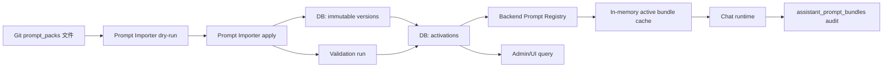
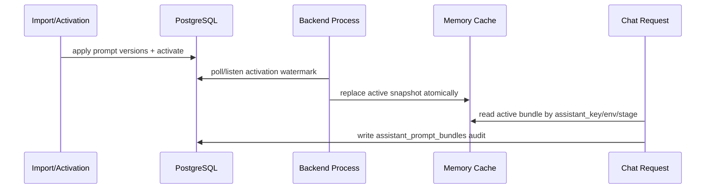

# Research Assistant Prompt Pack 运行时治理设计方案

- **版本**: v1.0
- **日期**: 2026-05-24
- **状态**: 建议方案，已按当前最佳方案提交；后续实现需单独拆分任务
- **适用范围**: Research Assistant 主提示词、Prompt Tree、运行时 Prompt Bundle、Prompt 版本发布与回滚
- **关联问题**: GitHub Issue #186 / `BUG-117`（删除未开发 mouse/keyboard 与 code-write 能力的负向禁用提示）
- **本次提交边界**: 仅新增设计文档与 BUG 登记；不修改运行时代码、不触碰生产 `8001`/`3000`、不写生产 DB

## 1. 结论

AIstock 的提示词存储不应在“文件”和“数据库”之间二选一。最佳方案是：

1. **Git 文件是权威源**：所有主提示词、能力分支、guard、renderer、eval prompt 以 `prompt_packs/` 下的 YAML/Markdown 文件保存，进入 code review、diff、commit、PR、rollback。
2. **PostgreSQL 是运行注册表**：DB 保存不可变 prompt version、activation、审批、验证、回滚、运行审计和 UI 查询结果，但不作为人工手写提示词的唯一编辑入口。
3. **内存热缓存是聊天热路径**：每个 backend 进程在启动或 activation 变化时加载 active bundle 到内存；每轮聊天只从内存取 active prompt，并写入 bundle audit，不在热路径反复读文件或查 DB。
4. **Python 代码只保留最小 bootstrap**：业务提示词不得再硬编码在 `.py` 中；Python 只保留 schema、loader、selector、错误提示和“无法加载 prompt pack 时失败”的最小引导。
5. **安全边界由代码强制，不靠提示词表达**：MCP/API gate、approval、权限、DB role、tool risk policy、测试和审计是硬边界；prompt 只能解释流程，不能替代权限控制。

这套结构同时满足效率、审计、可回滚、多人协作和生产安全：文件适合治理和版本管理，DB 适合运行状态和审计，内存缓存负责性能。

## 2. 当前问题基线

### 2.1 已发现的具体问题

| 问题 | 位置 | 影响 |
| --- | --- | --- |
| 主提示词硬编码在 Python | `backend/services/research_assistant/service.py:270` 的 `DEFAULT_PROMPT_NODES` | 修改提示词必须改代码，review 粒度差，无法独立发布/回滚 |
| 根提示词包含未开发能力的负向禁用项 | `backend/services/research_assistant/service.py:281` | 产品语义变成“禁止某功能”，但实际情况是该功能未实现；用户体验和能力说明不准确 |
| seed 逻辑从 Python 常量写入 DB | `backend/services/research_assistant/service.py:652` | DB 中的提示词可能滞后于代码或手工修正，缺少导入版本和 activation 记录 |
| Prompt Bundle 运行时拼接 | `backend/services/research_assistant/service.py:686` 至 `:735` | 已具备 bundle/audit 雏形，但 source、version、activation、cache 责任边界不清 |
| 聊天系统后缀仍在 Python 中拼接 | `backend/services/research_assistant/service.py:974` 至 `:979` | 运行时行为规则与业务 prompt 混在代码中，未来难以统一治理 |
| `/health` 暴露负向能力布尔值 | `backend/services/research_assistant/service.py:505` 至 `:506` | 对用户或上层 UI 暗示存在被禁用的未开发能力 |

`BUG-117` 应单独修复这些负向禁用项；本设计不直接删除运行时代码中的文本。

### 2.2 已有可复用基础

| 已有基础 | 当前位置 | 设计中的定位 |
| --- | --- | --- |
| `assistant_prompt_nodes` | `backend/db/init_research_assistant_schema_20260521.py:465` | Phase 1 可兼容读取；长期应演进为 immutable version 或由 version 表取代 |
| `assistant_prompt_bundles` | `backend/db/init_research_assistant_schema_20260521.py:490` | 继续作为每轮运行审计表，补充 `activation_id`、`version_refs`、`source_pack_checksum` |
| `PROMPT_CACHE_DIR` | `backend/services/research_assistant/service.py:54` | 可保留为派生缓存目录，但不能成为事实源 |
| Prompt Tree selector | `build_prompt_bundle()` / `_select_prompt_nodes()` | 继续负责按阶段、意图、风险选择最小必要提示词集合 |
| 通用 `app.prompt_pack` 草案 | `backend/db/init_prompt_schema.py` | 可作为历史参考；Research Assistant 需要更明确的 source/version/activation/audit 模型 |

## 3. 外部参考结论

### 3.1 主流工具的提示词/指令存储方式

| 工具/平台 | 存储方式 | 对 AIstock 的启发 |
| --- | --- | --- |
| OpenAI Codex | repo 级指令使用 `AGENTS.md`，官方 Codex docs 也将 AGENTS 指令作为文件化、层级化上下文 | 长期规则应进 Git 文件，便于 review、范围继承和跨环境一致 |
| Claude Code | 使用 `CLAUDE.md` 记忆文件、`.claude/settings.json` 配置、`.claude/agents/*.md` 子代理文件 | 主流 coding agent 将长期指令和 agent 定义放在文件中，运行时再加载 |
| GitHub Copilot | repo 指令使用 `.github/copilot-instructions.md`，也支持路径级 `.instructions.md` | 文件化指令适合随代码演进和按目录生效 |
| Continue | 规则通过 `.continue/rules` 等文件组织 | IDE/agent 规则倾向于 repo 内文件，便于开发者本地编辑和版本化 |
| Aider | 通过 convention / instruction 文件让 repo 规则进入模型上下文 | 小型 coding agent 也优先使用文件作为项目约定输入 |
| CrewAI | agent/task 通常由 YAML 配置，prompt 可自定义 | 业务 agent 适合把 role、goal、task、prompt 模板配置化，而不是散落在代码中 |
| OpenHands | agent/运行配置强调文件化工程上下文 | 文件是开源 agent 与 repo 结合的低摩擦方式 |
| LangSmith | 提供 prompt 管理、版本和运行追踪 | 当 prompt 需要实验、版本、标签、运行关联时，需要 registry/audit 能力 |
| Langfuse | 提供 prompt management、版本、label、生产调用 | 运行时 activation、版本标签和观测能力适合由服务/DB 承担 |

### 3.2 推导

- **开源 coding agent** 倾向于把长期提示词/规则放在 repo 文件中，因为它们需要代码评审、分支隔离和目录作用域。
- **PromptOps 平台** 倾向于把 prompt 版本、label、activation、observability 放在服务或数据库中，因为它们需要运行态查询、发布、回滚和实验。
- AIstock 同时是产品系统和研发平台，因此需要混合方案：**文件负责治理，DB 负责运行状态，缓存负责性能**。

## 4. 目标与非目标

### 4.1 目标

1. 消除 Python 业务提示词硬编码。
2. 支持 prompt pack 的 review、diff、commit、rollback。
3. 支持 DB 中查询当前 active prompt、历史版本、激活记录和每轮 bundle 使用情况。
4. 支持 UI 查看 prompt tree、activation、bundle signature、checksum、变更说明和验证结果。
5. 支持灰度/回滚：不改代码即可把 active activation 切回上一版本。
6. 支持静态检查：阻断未登记的 `.py` 业务提示词、危险能力描述和缺失 schema metadata。
7. 保持聊天热路径高效：每轮不扫描文件、不组装全量 DB prompt tree。

### 4.2 非目标

1. 本设计不实现 mouse/keyboard 或 code-write 能力。
2. 本设计不移除任何真实的 MCP/API、approval、trace、memory/audit 安全边界。
3. 本设计不要求前端直接编辑生产 prompt；前端只提交候选变更或显示 activation 状态。
4. 本设计不把 prompt cache 文件作为事实源。
5. 本设计不要求本次提交执行生产 DB migration。

## 5. 推荐总体架构



### 5.1 权威源流向

1. 开发者修改 `prompt_packs/**` 文件。
2. CI 或本地 `prompt_importer --dry-run` 解析、校验、计算 checksum、输出 diff。
3. 合并到 `main` 后，受控执行 `prompt_importer --apply` 写入 DB 的 immutable version 表。
4. 只有通过验证的 version 才能创建或更新 `assistant_prompt_activations`。
5. backend 监听 activation 变化或定期刷新，将 active activation 加载到内存。
6. 聊天请求读取内存中的 active prompt bundle；每轮只记录实际使用的 version refs、checksum、selector trace。

### 5.2 责任边界

| 层 | 事实责任 | 性能责任 | 审计责任 |
| --- | --- | --- | --- |
| Git 文件 | 人工编辑和 review 的事实源 | 不在热路径读取 | commit/PR/diff/rollback |
| DB version 表 | 运行时可查询的版本事实 | activation 查询，低频 | version、approval、validation、actor |
| DB activation 表 | 当前运行生效状态 | 启动/刷新读取 | active_from/active_to/rollback |
| 内存缓存 | 无事实权威，只是 active snapshot | 聊天热路径 O(1) | cache signature 进入 bundle audit |
| 文件缓存 | 派生缓存，不可手改回写 | cold start 或大 bundle 加速 | cache hit/miss 记录 |

## 6. 文件存储设计

### 6.1 目录布局

建议新增 repo 根目录级 `prompt_packs/`，避免把业务提示词混入 Python 包：

```text
prompt_packs/
  research_assistant/
    main/
      pack.yaml
      prompts/
        root.assistant.md
        governance.no_silent_action.md
        intent.planning.md
        domain.qe_experiment.md
        workflow.qe_draft_then_approval.md
        tool_guard.mcp_qe.md
        renderer.human_cards.md
        memory.candidate_only.md
      evals/
        root_prompt_contract.yaml
      README.md
```

### 6.2 `pack.yaml` 草案

```yaml
schema_version: aistock_prompt_pack_v1
pack_key: research_assistant.main
pack_version: 1.0.0
owner: research_assistant
locale: zh-CN
status: draft
source_commit: null
activation_policy:
  environments: [dev, staging, production]
  default_stage: planning
  requires_validation: true
  requires_approval_for: [production]
selector:
  algorithm: ancestor_closed_keyword_multibranch_v2
  required_keys:
    - root.assistant
    - governance.no_silent_action
nodes:
  - prompt_key: root.assistant
    file: prompts/root.assistant.md
    category: root
    tree_path: /root
    phase: planning
    risk_level: medium
    trigger: { always: true }
    token_budget: 600
```

### 6.3 Markdown 节点格式

每个节点文件使用 YAML frontmatter 加正文，正文只放该节点真正需要的提示词：

```markdown
---
prompt_key: root.assistant
version: 1.0.0
category: root
phase: planning
risk_level: medium
status: draft
summary: Research Assistant 根身份和最小工作方式
---
你是 AIstock 研究与实验综合助理。
你需要先理解用户意图，用中文复述目标，提出必要确认问题，再生成可审计计划。
所有高风险操作必须通过已实现的 MCP/API、审批、Trace 与 Memory/Audit 流程。
```

关键要求：

1. 不写未开发能力的负向禁止项。
2. 不把安全边界写成唯一防线；prompt 只说明流程，硬边界由代码实现。
3. 每个节点必须有 `prompt_key`、`version`、`category`、`phase`、`risk_level`、`status`、`summary`。
4. 每个文件导入 DB 后生成 `content_sha256` 和 `normalized_sha256`。
5. Markdown 正文不得包含环境密钥、生产连接串、个人 token 或不可公开路径。

## 7. 数据库存储设计

### 7.1 推荐数据模型

长期建议新增 version/activation 模型，而不是继续让 `assistant_prompt_nodes.prompt_key` 唯一承载所有版本。

```text
assistant_prompt_sources
  source_id
  pack_key
  pack_version
  source_path
  source_commit
  source_sha256
  importer_version
  imported_at
  imported_by

assistant_prompt_node_versions
  prompt_version_id
  source_id
  prompt_key
  semantic_version
  category
  tree_path
  parent_key
  phase
  risk_level
  trigger_json
  prompt_text
  metadata_json
  content_sha256
  normalized_sha256
  status               -- imported / validating / approved / deprecated / rejected
  approved_by
  approved_at
  created_at

assistant_prompt_activations
  activation_id
  assistant_key        -- research_assistant
  environment          -- dev / staging / production
  activation_name
  pack_key
  pack_version
  source_commit
  version_refs         -- JSON array of prompt_version_id + prompt_key + checksum
  selector_config_json
  validation_run_id
  status               -- active / inactive / rolled_back / scheduled
  active_from
  active_to
  activated_by
  activation_reason
  created_at

assistant_prompt_activation_events
  event_id
  activation_id
  event_type           -- created / validated / activated / rolled_back / disabled
  actor
  message
  metadata_json
  created_at
```

### 7.2 兼容当前表的迁移策略

| 阶段 | 策略 |
| --- | --- |
| Phase 1 | 保留 `assistant_prompt_nodes`，从 prompt pack 导入时同步写入当前 enabled 节点，避免一次性改动 selector |
| Phase 2 | 新增 `assistant_prompt_node_versions` 和 `assistant_prompt_activations`，`assistant_prompt_nodes` 改为 active view 或兼容投影 |
| Phase 3 | `build_prompt_bundle()` 读取 active activation 的内存 snapshot，不再每次 list `assistant_prompt_nodes` |
| Phase 4 | `assistant_prompt_nodes` 仅保留为视图或废弃兼容层，所有运行审计引用 immutable version id |

### 7.3 与 `assistant_prompt_bundles` 的关系

当前 `assistant_prompt_bundles` 应保留，但需要补充字段或在 `bundle_json` 中强制包含：

| 字段 | 作用 |
| --- | --- |
| `activation_id` | 标记本轮使用哪个 active prompt set |
| `source_commit` | 追溯到 Git 文件版本 |
| `version_refs` | 每个 prompt node 的 immutable version id 和 checksum |
| `selector_version` | 追溯选择算法版本 |
| `cache_signature` | 证明内存/文件缓存与 DB activation 一致 |
| `prompt_policy_warnings` | 记录被 selector 剪裁、压缩或拒绝的 prompt 分支 |

## 8. 运行时缓存与效率设计

### 8.1 文件读取与数据库读取效率比较

| 访问方式 | 单次读取速度 | 一致性/审计 | 适用场景 | 风险 |
| --- | --- | --- | --- | --- |
| 本地文件读取 | 小文件通常很快，单进程冷读开销低 | 依赖 Git 和文件 checksum；无法直接表达 active/approval | 导入、dry-run、开发 review、cold start fallback | 多机部署时需要文件同步；热路径反复读会产生不必要 IO |
| DB 查询 | 单次网络/连接/SQL 开销高于本地小文件 | 天然适合 active、approval、audit、rollback、UI 查询 | activation 查询、版本管理、审计、运维 UI | 热路径每轮查 DB 会增加延迟和故障面 |
| 内存缓存 | 最快，O(1) 读取 | 不是事实源，必须有 signature 和失效策略 | 聊天请求热路径 | 多进程一致性需要刷新/通知机制 |

因此效率上不是“文件或 DB 谁绝对更快”，而是：

1. **冷路径**：文件导入和 DB activation 都可以接受，差异不影响用户体验。
2. **热路径**：两者都不应每轮访问，应该读取内存 active snapshot。
3. **治理路径**：文件优于 DB 手写，因为 Git review/diff/rollback 更可靠。
4. **运行路径**：DB 优于文件，因为 activation、approval、audit、UI 查询需要事务和历史记录。

### 8.2 缓存策略



缓存规则：

1. backend 启动时加载当前 `assistant_prompt_activations.status=active`。
2. 每个 active snapshot 包含 `activation_id`、`source_commit`、`version_refs`、`bundle_signature`、`loaded_at`。
3. 每 30 至 60 秒轮询 activation watermark；未来可升级 PostgreSQL `LISTEN/NOTIFY`。
4. activation 变化时原子替换内存 snapshot；正在处理的请求继续使用旧 snapshot 并记录旧 `activation_id`。
5. 如果 DB 不可用但已有内存 snapshot，低风险对话可继续；高风险执行前必须重新确认 registry 可用。
6. 如果启动时无 active snapshot，应 fail fast，不回退到 Python 硬编码业务 prompt。

## 9. 发布、回滚与审批流程

### 9.1 正常发布

1. 在独立 worktree/branch 修改 `prompt_packs/**`。
2. 本地执行 `prompt_importer --dry-run --pack research_assistant.main`。
3. CI 执行格式、schema、禁用短语、token budget、selector 覆盖和 eval smoke。
4. PR review 合并到 `main`。
5. 运行 `prompt_importer --apply --commit <sha>` 写入 DB version。
6. 创建 activation candidate，绑定 validation run。
7. 非生产环境可自动激活；生产环境必须由有权限的 operator 激活。
8. 激活后 backend cache 刷新，聊天运行审计记录新 `activation_id`。

### 9.2 回滚

1. UI 或 CLI 选择上一条已验证 activation。
2. 写入 `assistant_prompt_activation_events(event_type='rolled_back')`。
3. 将当前 activation `active_to` 置为回滚时间。
4. 将上一版本重新设为 active，生成新 rollback activation event。
5. backend cache 刷新。
6. 后续 chat bundle audit 自动记录回滚后的 `activation_id`。

### 9.3 审批边界

| 操作 | 是否需要人工审批 | 理由 |
| --- | --- | --- |
| 修改 prompt 文件并开 PR | 需要 code review | prompt 是运行行为的一部分 |
| dry-run import | 不需要 | 只读验证 |
| dev activation | 可由开发者执行 | 不影响生产 |
| production activation | 需要 operator/owner | 改变用户可见行为 |
| rollback 到已验证版本 | 需要记录 actor/reason；紧急场景可低门槛 | 回滚仍改变生产行为 |
| 从 UI 直接编辑 active prompt | 不允许 | 绕过 Git review 和可回滚源 |

## 10. 安全边界设计

### 10.1 不能靠 prompt 解决的事项

以下事项必须由代码、权限和测试强制：

1. 是否允许执行 MCP/API。
2. 是否允许写 DB 或触发生产运行。
3. 是否允许创建/同步 GitHub Issue。
4. 是否允许读取本地文件、远程日志或外部网页。
5. 是否允许高风险工具调用。
6. 是否允许生产 backend/frontend restart。

Prompt 只能向用户解释“将通过哪些已实现能力、需要哪些确认、会留下哪些审计记录”。如果某能力未实现，不应该写成“禁止使用该能力”，而应该从 capability registry 中不暴露该能力。

### 10.2 Capability Registry 与 Prompt 的关系

| 信息类型 | 存储位置 | Prompt 中如何使用 |
| --- | --- | --- |
| 能力是否存在 | `assistant_mcp_tools` / `assistant_skill_registry` / code registry | selector 按已实现能力选择分支 |
| 能力风险等级 | tool registry + risk policy | 选择 guard prompt，并触发 approval |
| 用户可见能力说明 | positive capability summary | 展示“可做什么”，不是列出未实现能力 |
| 禁止或拒绝规则 | code gate + tests + approval | prompt 只解释原因，不作为唯一阻断 |

## 11. 实施路线

### Phase 0: 立即修复 `BUG-117`

范围：只处理当前发现的误导性提示词和 health metadata。

验收：

1. `root.assistant` 源文本不再包含未开发 mouse/keyboard 与 code-write 能力的负向禁用项。
2. 现有 DB `assistant_prompt_nodes.root.assistant` 已 backfill。
3. `/health` 对外只展示正向已实现能力，或不展示未实现能力布尔值。
4. 保留 MCP/API、approval、Trace、Memory/Audit 真实边界。
5. 后端测试覆盖源 prompt 与 live prompt-node listing。

### Phase 1: Research Assistant prompt pack 文件化

范围：

1. 新增 `prompt_packs/research_assistant/main/**`。
2. 从 `DEFAULT_PROMPT_NODES` 迁移现有业务 prompt。
3. `DEFAULT_PROMPT_NODES` 缩减为最小 bootstrap 或移除。
4. 新增 importer dry-run，校验 pack schema、必填字段、checksum、禁用短语、token budget。
5. 继续同步写入当前 `assistant_prompt_nodes`，保持运行路径最小变更。

### Phase 2: Version/Activation 运行注册表

范围：

1. 新增 `assistant_prompt_sources`、`assistant_prompt_node_versions`、`assistant_prompt_activations`、`assistant_prompt_activation_events`。
2. 所有新增表/字段必须有 PostgreSQL `COMMENT ON TABLE` / `COMMENT ON COLUMN`。
3. `build_prompt_bundle()` 记录 `activation_id` 与 immutable version refs。
4. backend 启动加载 active activation 到内存。
5. 管理 UI 查询 active/previous versions、validation runs、bundle audit。

### Phase 3: 跨模块 prompt 治理

范围：

1. 迁移 QuantEvolver/QE agent prompts。
2. 迁移 RD-Agent、本地数据管理、research memory graph 相关 prompt。
3. 将旧 `qe_agent_prompts`、`app.prompt_pack` 与新 registry 建立映射或废弃路线。
4. 建立 eval case 与 prompt variant 流程。

### Phase 4: PromptOps 与评估闭环

范围：

1. prompt feedback 进入 candidate 队列。
2. 同一 prompt 支持 variant、evaluation、promotion、rollback。
3. 高风险 prompt 发布前要求离线回放和人工审查。
4. 运行指标关联：任务成功率、clarification 次数、approval 拒绝率、token 成本、bug 反馈率。

## 12. 测试与验收矩阵

| 类型 | 检查项 | 通过标准 |
| --- | --- | --- |
| 静态检查 | `.py` 中不得新增完整业务 prompt 文本 | 允许短错误消息、schema、loader；禁止多段业务提示词常量 |
| 静态检查 | 禁用短语扫描 | Research Assistant active prompt 不包含未开发能力的负向禁用项 |
| Schema 检查 | prompt pack YAML/Markdown | 必填字段完整，版本合法，checksum 稳定 |
| Import dry-run | 文件到 DB diff | 能展示新增/修改/删除节点，不写 DB |
| Import apply | immutable version 写入 | 同一 checksum 幂等，不重复写版本 |
| Activation | active 切换 | active_from/active_to 正确，旧请求仍可追溯 |
| Cache | activation 变化刷新 | 新请求使用新 activation，bundle audit 记录正确 |
| Rollback | 切回旧版本 | 不改 Git 文件即可恢复上一 active prompt |
| API | prompt-node listing | 不泄漏 draft/rejected prompt，默认展示 active approved |
| UI | prompt admin/read-only view | 可读展示当前版本、来源 commit、验证状态和回滚入口 |
| 安全 | 高风险工具 gate | prompt 变更不能绕过 MCP/API approval |
| 审计 | `assistant_prompt_bundles` | 每轮记录 activation/version/checksum/selector trace |

## 13. 设计约束和风险

| 风险 | 缓解 |
| --- | --- |
| 文件与 DB 不一致 | DB version 必须记录 `source_commit`、`source_sha256`；importer dry-run 显示 drift |
| 多进程缓存不一致 | activation watermark + 定时刷新；未来升级 `LISTEN/NOTIFY` |
| UI 直接改 prompt 绕过 Git | UI 只创建候选 patch 或 draft，不允许直接改 active source |
| Prompt 变更绕过测试 | CI 加 schema、禁用短语、token budget、eval smoke |
| 旧 DB 手工 prompt 残留 | Phase 1 backfill；Phase 2 active view；Phase 3 清理 legacy 表 |
| 回滚找不到代码来源 | activation 记录 `source_commit` 和 `pack_version`，每个 version 记录 checksum |
| 安全规则被 prompt 文案弱化 | 安全规则落在 code gate、approval、DB role、tests，不依赖文案 |

## 14. 打开问题

1. 是否需要将 prompt pack 与模型配置 pack 合并发布，还是保持独立 activation？建议先独立，避免模型切换和提示词切换相互阻塞。
2. 是否需要多环境 activation（dev/staging/production）全部落库？建议需要，否则 UI 无法解释“当前生产用哪个 prompt”。
3. 是否允许紧急热修 prompt？建议允许“紧急 activation 到上一 approved version”，不允许直接手写生产 prompt。
4. 是否需要接入 Langfuse/LangSmith 这类 PromptOps 平台？建议短期不接入，先用本地 Git+DB 满足审计；未来若需要跨模型实验平台再评估。

## 15. 推荐落地优先级

1. **先修 BUG-117**：删除误导性未开发能力禁用项，并 backfill 当前 DB。
2. **再做文件化**：将 Research Assistant 当前 prompt tree 迁移到 `prompt_packs/research_assistant/main`。
3. **再做 activation**：引入 immutable version 和 active registry。
4. **最后做跨模块治理**：统一 QE、RD-Agent、local-data、memory graph 的 prompt 生命周期。

## 16. 参考资料

- OpenAI Codex AGENTS.md docs: https://developers.openai.com/codex/guides/agents-md
- OpenAI Codex open-source docs `agents_md.md`: https://github.com/openai/codex/blob/main/docs/agents_md.md
- Claude Code memory docs: https://docs.anthropic.com/en/docs/claude-code/memory
- Claude Code settings docs: https://docs.anthropic.com/en/docs/claude-code/settings
- Claude Code subagents docs: https://docs.anthropic.com/en/docs/claude-code/sub-agents
- GitHub Copilot custom instructions: https://docs.github.com/en/copilot/customizing-copilot/adding-repository-custom-instructions-for-github-copilot
- Continue rules docs: https://docs.continue.dev/customize/deep-dives/rules
- Aider conventions docs: https://aider.chat/docs/usage/conventions.html
- CrewAI agents docs: https://docs.crewai.com/en/concepts/agents
- CrewAI customizing prompts docs: https://docs.crewai.com/en/guides/advanced/customizing-prompts
- OpenHands file-based agent guide: https://docs.openhands.dev/sdk/guides/agent-file-based
- LangSmith prompt management docs: https://docs.smith.langchain.com/prompt_engineering/how_to_guides/manage_prompts_programmatically/
- Langfuse prompt management docs: https://langfuse.com/docs/prompt-management/get-started
