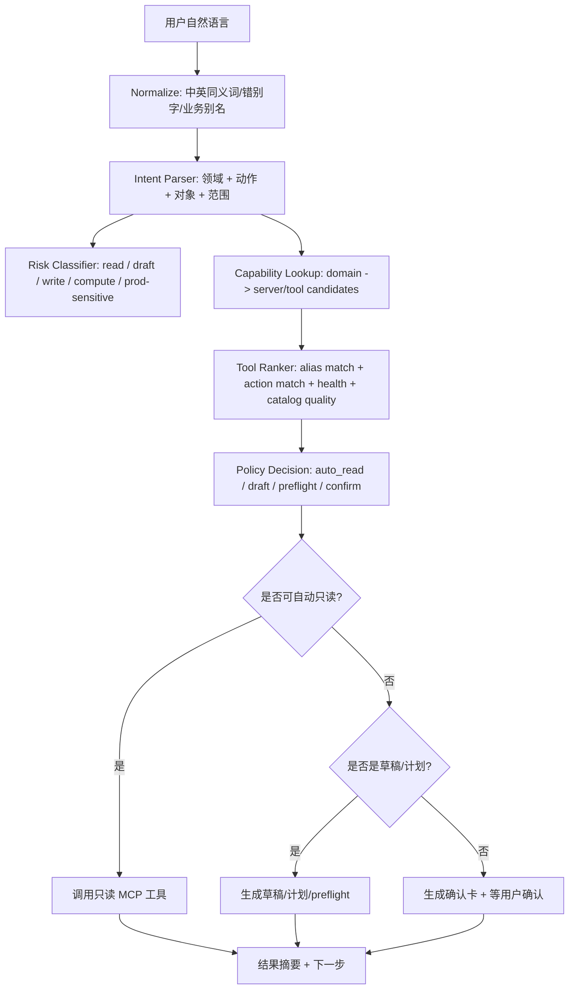
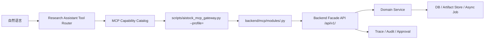

# Research Assistant 统一 MCP 自然语言理解与工具编排设计方案

> 日期：2026-05-27  
> 分支：`docs/research-assistant-mcp-orchestration-20260527`  
> worktree：`F:\Dev\AIstock_worktrees\research-assistant-mcp-orchestration-design-20260527`  
> 任务分级：T3 / 统一架构设计  
> 覆盖范围：Research Assistant 自然语言理解、MCP 能力目录、工具路由、执行审批、现有 MCP 方案统一、未来领域 MCP 扩展  
> 运行边界：本设计不启动、不停止、不重启 `8001` / `3000`，不直接改生产配置。

## 1. 设计结论

Research Assistant 应成为 AIstock 内部的“自然语言 MCP 编排器”：用户不需要记住 MCP server 名称、tool 名称、参数或风险等级，只要用自然语言表达需求，助手就能：

1. 理解用户说的业务对象、动作、范围和风险。
2. 在统一 MCP 能力目录中找到合适的 server 和 tool。
3. 对只读工具自动调用或建议调用。
4. 对草稿、preflight、计划类工具先生成可审阅结果。
5. 对写入、补录、运行实验、GitHub 正式同步、数据修复等动作，先做 preflight，再拿到明确确认后执行。
6. 用拟人化、面向业务的语言回复，而不是把内部限制清单直接丢给用户。

一句话目标：**用户说“帮我看看数仓有没有漏入仓”“这个 QE loop 为什么差”“把 BUG 同步一下”“本地数据 trade_date 是否缺口”“因子相关性是否太高”，Research Assistant 都能自己判断该用哪个 MCP，并按风险边界推进。**

## 2. 已有方案统一关系

本方案不是新开一套 MCP 体系，而是把已有设计归并为一个上层编排规范。

| 既有方案/实现 | 已提供能力 | 本方案统一后的定位 |
|---|---|---|
| `docs/architecture/research_pipeline_and_mcp_gateway_design_v2.md` | 统一 `backend/mcp/` gateway 骨架、Research MCP、未来 qe_archive/qe_experiment/validation 迁移方向 | 作为 MCP 平台层和迁移路线基础。 |
| `docs/architecture/local_data_management_mcp_gateway_design_20260523.md` | 本地数据管理 MCP、47 个工具、只读/确认写入、Research Assistant capability seed | 作为本地数据领域 MCP 的完整落地样板。 |
| `docs/architecture/research_assistant_mcp_skill_execution_closure_design_20260525.md` | Dialogue mode router、workflow/agent 分离、MCP/Skill 执行闭环 | 作为自然语言意图到执行状态机的基础。 |
| `docs/architecture/research_assistant_prompt_context_runtime_governance_design_20260524.md` | Prompt Pack、runtime config、capability catalog、权限和上下文治理 | 作为 prompt、能力目录和工具权限的治理源。 |
| `docs/architecture/research_assistant_prompt_pack_runtime_design_20260524.md` | Prompt Pack 文件化、能力问答样式、对话路由提示词 | 作为拟人化对话和可审阅 prompt 源。 |
| `docs/architecture/data_warehouse_extension_design_20260510.md` | `qe_archive` 数仓扩展、outbox/worker/archive_job、factor/model/paper 数据入仓 | 作为 QE 数仓和未来因子/模型/策略库 MCP 的数据底座。 |
| `docs/architecture/qe_mcp_template_archive_research_design_20260515.md` | QE template/archive/research MCP 组合 | 作为 QE 实验、归档、研究协同的业务场景。 |
| `docs/architecture/mcp_server_for_validation_center_design_20260509.md` | Validation Center / BUG / GitHub issue MCP 思路 | 作为 Issue workflow 和验证中心 MCP 的治理场景。 |
| `docs/process/*mcp_server*.md` | Codex、Claude Code、MCP 协议和注册流程 | 作为外部客户端注册和工具可见性方案。 |
| `docs/analysis/mcp_token_audit_20260526.md` | MCP payload token 成本问题 | 作为 summary-first、按需 detail 的返回策略依据。 |
| `docs/architecture/research_assistant_full_mcp_orchestration_design_20260527.md` | 已提出全量 MCP catalog、QE 数仓可见、拟人化回复和未来 MCP 拆分 | 本文在其基础上补齐“自然语言理解到工具选择”的统一流程。 |

## 3. 设计目标

### 3.1 用户体验目标

用户只说自然语言，不需要说工具名：

| 用户自然语言 | 助手应理解 | 首选 MCP |
|---|---|---|
| “数仓有没有漏入仓？” | QE Archive 归档完整性 / outbox / backfill source status | `aistock-qe-archive` |
| “这个 QE loop 为什么指标变差？” | QE 实验状态、loop metrics、analysis、日志、必要时归档质量 | `aistock-qe-experiment` + `aistock-qe-archive` |
| “本地 trade_date 是不是又没同步？” | 本地数据 dataset 状态、gap、sync attempt、repair plan | `aistock-local-data` |
| “把 BUG-120 的闭环状态同步一下” | Validation / BUG JSON / GitHub issue sync workflow | `aistock-validation` |
| “最近因子库哪些因子相关性太高？” | 因子相关性分析，当前可先用 archive 查询，未来用 factor-correlation MCP | `aistock-factor-correlation`（未来）/ `aistock-qe-archive`（过渡） |
| “这个模型 trial 和之前 seed 表现差异大吗？” | model trial / seed / hyperparam 历史 | `aistock-qe-archive`，未来 `aistock-model-registry` |
| “这个策略能不能进入 Paper v2？” | strategy package health / selection / paper readiness / promotion plan | 未来 `aistock-strategy-governance` |
| “执行策略库里有什么 minute algo？” | execution policy / algo library / risk limits | 未来 `aistock-execution-policy` |

### 3.2 系统目标

1. 所有已登记 MCP 对 Research Assistant 可见。
2. 每个 MCP 有中文业务描述、英文 server/tool key、同义词、典型问题、风险策略。
3. 自然语言意图路由不靠单一关键词，而是结合领域对象、动作、目标产物、时间范围和风险。
4. 工具选择可解释：助手能说明“我会先查哪个 MCP，为什么”。
5. 工具调用可审计：所有 preflight、confirmed action、失败和结果摘要写入 Trace / Audit。
6. 能力目录可同步：`.mcp.json`、Codex config、Claude Code config、Research Assistant DB catalog、静态工具定义保持一致。
7. 响应 summary-first：默认返回人类可读摘要，必要时再取 detail，避免 MCP payload 膨胀。

## 4. 当前 MCP 总目录

当前 worktree 静态扫描到 6 个已存在 AIstock MCP server，总工具数 141：

| MCP server | 当前工具数 | 业务名称 | 主要能力 | 状态 |
|---|---:|---|---|---|
| `aistock-local-data` | 47 | 本地数据管理 MCP | 数据健康、dataset 状态、gap、sync target、job、schedule、source test、repair plan、confirmed repair | 已实现，需进入全量助手目录和外部客户端注册。 |
| `research-assistant` | 13 | 助手自身 MCP | task、event、chat turn、prompt bundle、prompt nodes、memory candidate、context pack、tool list、preflight、approval | 已实现，作为编排内核。 |
| `aistock-research` | 16 | Research Pipeline MCP | research experiment、stage、artifact refs、backtest records、HMM backfill、promote/reject | 已实现，需进入助手统一目录。 |
| `aistock-qe-experiment` | 26 | QE 实验 MCP | experiment 查询、状态、日志、metrics、trade stats、custom evo、loop 对比、template create/validate/materialize/run | 已实现，需补完整目录和自然语言路由。 |
| `aistock-qe-archive` | 20 | QE 数仓 MCP | archive health、run quality、outbox、jobs、skips、backfill preview/execute、factor/model/seed/hyperparam query | 已实现，是“数仓 MCP”的当前实体。 |
| `aistock-validation` | 19 | 验证与 Issue MCP | validation plan/run/finding、BUG、agent context、GitHub issue list/search/create/sync、assign/status | 已实现，需完整暴露 issue workflow 能力。 |

### 4.1 必须解决的不一致

| 不一致 | 影响 | 统一方案 |
|---|---|---|
| `.mcp.json` 有 `aistock-qe-archive`，Research Assistant catalog 没完整登记 | 用户问“数仓 MCP”看不到 | Catalog Sync 把 server/tool 自动纳入助手目录。 |
| Local Data MCP 模块 47 工具，但用户看到的工具少 | 误以为本地数据 MCP 未完成 | 目录按分组展示完整能力，执行仍分风险。 |
| Research Pipeline MCP 存在但助手能力问答不表达 | “研究流水线”和 “Research Assistant”混淆 | 把 `aistock-research` 定义为独立领域。 |
| Validation MCP 工具多，但只登记 GitHub create | BUG workflow finish/sync 不自然 | 将 issue lifecycle 工具完整归类。 |
| Future profiles 把 `qe_archive/qe_experiment/validation` 视为 future-only | Gateway profile 与专用 server 现状不一致 | 保留专用 server，同时设计 Phase 2 迁移到 unified gateway。 |

## 5. 统一能力模型

### 5.1 MCP Server Capability

每个 MCP server 必须有一条能力记录：

```yaml
server_key: aistock-qe-archive
domain_key: qe_warehouse
display_name_zh: QE 数仓 MCP
display_name_en: QE Archive MCP
summary_for_user: 查询 QE 入仓、归档质量、outbox、补录预览、因子/模型/seed/超参历史。
summary_for_llm: Use for warehouse/archive/backfill/outbox/run-quality/factor-usage/model-trial queries.
aliases:
  - 数仓
  - QE数仓
  - 入仓
  - 归档
  - archive
  - warehouse
  - outbox
  - backfill
example_user_intents:
  - 数仓有没有漏入仓？
  - 帮我看这个 run 的归档质量
  - 最近因子使用情况怎样？
default_auto_call_policy: auto_read
write_policy: preflight_then_confirm
source_refs:
  - scripts/aistock_qe_archive_mcp_server.py
  - docs/architecture/data_warehouse_extension_design_20260510.md
```

### 5.2 MCP Tool Capability

每个 tool 必须有一条工具能力记录：

```yaml
tool_ref: aistock-qe-archive/qe_archive_backfill_execute_confirmed
tool_name: qe_archive_backfill_execute_confirmed
display_name_zh: 执行 QE 数仓补录
intent_tags: [qe_warehouse, backfill, archive_job, confirmed_write]
action_type: execute_confirmed
side_effect_level: run_data_job
risk_level: production_sensitive
auto_call_policy: preflight_then_confirm
requires_preflight: true
requires_confirmation: true
confirmation_text: QE_ARCHIVE_BACKFILL
summary_first: true
max_default_items: 20
```

### 5.3 Domain Ontology

新增统一领域词表：

| domain_key | 同义词 | 常见对象 | 常见动作 | 首选 MCP |
|---|---|---|---|---|
| `local_data` | 本地数据、同步、缺口、trade_date、Tushare、dataset、source test | dataset、gap、job、schedule、alert、sync target | 查状态、查缺口、生成修复计划、确认修复 | `aistock-local-data` |
| `qe_experiment` | QE、实验、loop、自定义演进、template、回测、日志 | experiment、task、loop、metrics、config、log | 查状态、对比 loop、看日志、校验模板、运行实验 | `aistock-qe-experiment` |
| `qe_warehouse` | 数仓、入仓、归档、archive、warehouse、outbox、backfill、归档质量 | run、outbox、archive_job、skip、factor usage、model trial | 查质量、查入仓、补录预览、执行补录 | `aistock-qe-archive` |
| `validation_issue` | BUG、issue、GitHub、闭环、sync、验证记录、workflow | bug json、GitHub issue、validation run、finding | 创建、认领、同步、关闭、查验证 | `aistock-validation` |
| `research_pipeline` | 研究流水线、research、stage、artifact、HMM backfill | experiment、stage、artifact_ref、backtest record | 创建研究、跑 stage、查 artifact、promote/reject | `aistock-research` |
| `assistant_runtime` | 助手、上下文、记忆、prompt、capability、工具目录 | task、memory candidate、context pack、prompt bundle | 建任务、列工具、preflight、建上下文 | `research-assistant` |
| `factor_library` | 因子库、因子覆盖、IC、RankIC、因子质量 | factor、coverage、metric、version | 查因子、查覆盖、查指标 | 未来 `aistock-factor-library` |
| `factor_correlation` | 相关性、冗余、替换、cluster | correlation matrix、factor pair、replacement | 计算相关性、建议替换 | 未来 `aistock-factor-correlation` |
| `model_registry` | 模型库、trial、seed、超参、模型产物 | model、trial、seed、hyperparam、artifact | 查模型、比较 trial、冻结/注册 | 未来 `aistock-model-registry` |
| `strategy_governance` | 策略库、策略包、Selection、Paper、候选策略 | strategy package、portfolio、selection run | 查健康、评估推广、退役 | 未来 `aistock-strategy-governance` |
| `execution_policy` | 执行策略、minute algo、TWAP、VWAP、POV、实盘前置 | execution algo、policy、risk limit | 查策略、校验适用性 | 未来 `aistock-execution-policy` |

## 6. 自然语言理解流程

### 6.1 Pipeline



### 6.2 Intent Parser 输出结构

```json
{
  "user_message": "帮我看数仓有没有漏入仓",
  "domains": ["qe_warehouse"],
  "primary_domain": "qe_warehouse",
  "action": "check_archive_completeness",
  "objects": ["archive_run", "outbox", "backfill_source"],
  "time_range": null,
  "identifiers": [],
  "risk_hint": "read_only",
  "needs_tool": true,
  "confidence": 0.86,
  "route_reason": "数仓/漏入仓 maps to qe_archive source status, outbox and run quality"
}
```

### 6.3 工具选择输出结构

```json
{
  "selected_server": "aistock-qe-archive",
  "candidate_tools": [
    "qe_archive_health",
    "qe_archive_list_outbox",
    "qe_archive_list_jobs",
    "qe_archive_get_source_status",
    "qe_archive_backfill_preview"
  ],
  "auto_call_tools": ["qe_archive_health", "qe_archive_list_outbox"],
  "ask_before_tools": ["qe_archive_get_source_status", "qe_archive_backfill_preview"],
  "blocked_until_confirmed": ["qe_archive_backfill_execute_confirmed"],
  "response_hint": "先查健康、outbox 和最近 job；如发现缺口，再生成补录预览，执行补录前再确认。"
}
```

## 7. 路由决策规则

### 7.1 多 MCP 组合场景

有些需求天然需要多个 MCP：

| 场景 | 路由顺序 |
|---|---|
| “这个 QE loop 指标差，是否因为没入仓？” | `aistock-qe-experiment` 查 loop metrics/logs -> `aistock-qe-archive` 查 run quality/outbox。 |
| “BUG 修了没，GitHub 和 JSON 是否闭环？” | `aistock-validation` 查 BUG/issue -> `research-assistant` 记录 task/context。 |
| “本地数据缺口会不会影响 QE？” | `aistock-local-data` 查 dataset/gap -> `aistock-qe-experiment` 或 `aistock-qe-archive` 查受影响实验。 |
| “因子相关性高是否影响最近模型 trial？” | 未来 `aistock-factor-correlation` -> `aistock-qe-archive` 查 model trial/factor importance。 |
| “策略能否进 Paper v2 并使用某执行算法？” | 未来 `aistock-strategy-governance` -> `aistock-execution-policy` -> validation preflight。 |

### 7.2 风险策略

| 工具类型 | 例子 | 策略 | 用户可见表达 |
|---|---|---|---|
| 只读查询 | health、list、get、query | 可自动调用 | “我先查一下状态。” |
| 草稿/候选 | create template draft、issue candidate、memory candidate | 可自动生成草稿，不正式提交 | “我先生成一个草稿，你确认后再进入正式流程。” |
| preflight / preview | validate、backfill preview、repair plan | 可自动或 ask-before-call | “我先做预检/预览，不会写入。” |
| 确认写入 | repair apply、backfill execute、schedule update | 必须确认 | “这一步会写入/启动任务，我先列影响范围，确认后执行。” |
| 高成本计算 | QE run、factor metrics job、correlation job | preflight + 成本说明 + 确认 | “这是高成本任务，我会先估算资源和范围。” |
| 生产敏感 | 数据修复、GitHub issue 正式创建/同步、执行策略、实盘相关 | approval + confirmation + trace | “需要你明确批准，我会保留审计记录。” |

### 7.3 拟人化响应要求

普通能力问答：

```text
可以。我会按你的描述先判断任务属于哪类：本地数据、QE 实验、QE 数仓、Issue/验证、研究流水线，或者未来的因子/模型/策略库。比如你说“数仓漏入仓”，我会优先用 QE 数仓 MCP；你说“trade_date 缺口”，我会优先用本地数据 MCP。
```

不应再这样回答：

```text
当前只能按已登记目录使用工具，不具备未登记工具。
```

如果确实缺工具，应表达为：

```text
这个动作需要新增受控 MCP。我会把它设计成只读查询自动、写入执行确认、长任务异步 job 的形式，并登记到统一能力目录。
```

## 8. 统一 MCP Catalog Sync

### 8.1 数据源

统一目录由四类来源合并：

| 来源 | 用途 | 优先级 |
|---|---|---:|
| 手工维护 YAML | 中文业务描述、同义词、风险策略、典型问题 | 最高 |
| `.mcp.json` / Codex / Claude config | 当前客户端可见 server | 高 |
| 静态工具扫描 | 从 Python MCP server 提取 tool 名 | 中 |
| runtime list_tools | 实际运行 MCP schema | 中高，但可能受会话缓存影响 |
| Research Assistant DB seed | 当前助手可见能力 | 需要被校验和更新 |

### 8.2 Sync 规则

1. `.mcp.json` 有 server，而助手 DB 没有：标记 `missing_in_assistant_catalog`。
2. Python server 有工具，而助手 DB 少登记：标记 `partial_tool_catalog`。
3. 手工 YAML 缺描述：标记 `needs_description`，不阻止只读工具使用，但能力问答要避免生硬函数名。
4. runtime `list_tools` 失败：标记 `runtime_unverified`，不能删除静态目录。
5. server 不在客户端配置：标记 `not_client_registered`，助手可解释“代码存在但当前客户端不可见”。
6. 旧会话工具未注入：标记 `session_schema_stale`，提示新开会话或刷新工具 schema。

### 8.3 建议文件

```text
backend/services/research_assistant/mcp_capability_catalog.yaml
backend/services/research_assistant/mcp_catalog_sync.py
backend/services/research_assistant/tool_router.py
backend/services/research_assistant/domain_ontology.py
backend/tests/research_assistant/test_mcp_catalog_sync.py
backend/tests/research_assistant/test_tool_router.py
backend/tests/research_assistant/test_natural_language_mcp_routing.py
```

## 9. 已有 MCP 的统一分组

### 9.1 `aistock-local-data`

| 分组 | 典型工具 | 自然语言触发 |
|---|---|---|
| 健康概览 | `local_data_health_overview` | “本地数据健康吗？” |
| Dataset 状态 | `local_data_get_dataset_status`、`local_data_list_data_stats` | “trade_date 到哪天？”、“这个数据集 ready 吗？” |
| 缺口检查 | `local_data_check_gaps`、`local_data_compute_auto_range` | “有没有缺口？”、“需要补哪段？” |
| 同步目标和历史 | `local_data_list_sync_targets`、`local_data_list_sync_attempts` | “同步失败了吗？” |
| Job 和日志 | `local_data_list_jobs`、`local_data_get_job_logs` | “任务卡住了吗？” |
| Schedule | `local_data_list_schedules`、`local_data_upsert_schedule_confirmed` | “计划任务配置对吗？” |
| Repair | `local_data_plan_repair`、`local_data_apply_repair_confirmed` | “帮我修复数据问题。” |

### 9.2 `aistock-qe-experiment`

| 分组 | 典型工具 | 自然语言触发 |
|---|---|---|
| 实验查询 | `qe_experiment_list`、`qe_experiment_get`、`qe_experiment_get_status` | “这个实验现在怎么样？” |
| 日志和指标 | `qe_experiment_get_logs_tail`、`qe_experiment_get_enhanced_metrics`、`qe_experiment_get_trade_stats` | “为什么失败？”、“指标如何？” |
| Custom Evo | `qe_custom_evo_list_tasks`、`qe_custom_evo_loop_comparison`、`qe_custom_evo_get_loop_metrics` | “哪个 loop 最好？” |
| Template | `qe_template_create`、`qe_template_validate`、`qe_template_materialize_confirmed`、`qe_template_run_confirmed` | “创建/校验/运行模板。” |
| 执行控制 | `qe_experiment_run_confirmed`、`qe_experiment_stop_confirmed` | “启动/停止实验。” |

### 9.3 `aistock-qe-archive`

| 分组 | 典型工具 | 自然语言触发 |
|---|---|---|
| 数仓健康 | `qe_archive_health` | “数仓健康吗？” |
| 归档质量 | `qe_archive_list_runs`、`qe_archive_get_run_quality` | “这个 run 入仓质量怎样？” |
| Outbox/Job/Skip | `qe_archive_list_outbox`、`qe_archive_list_jobs`、`qe_archive_list_skips` | “为什么没入仓？” |
| Backfill | `qe_archive_backfill_preview`、`qe_archive_backfill_execute_confirmed` | “补录这些实验。” |
| 因子分析 | `qe_archive_query_factor_usage`、`qe_archive_query_factor_importance`、`qe_archive_query_factor_importance_stability` | “哪些因子常用/稳定？” |
| 模型分析 | `qe_archive_query_model_trials`、`qe_archive_query_seed_trials`、`qe_archive_query_hyperparam_history` | “模型 trial/seed/超参历史怎样？” |

### 9.4 `aistock-validation`

| 分组 | 典型工具 | 自然语言触发 |
|---|---|---|
| 验证计划 | `list_plans`、`get_plan` | “有哪些验证计划？” |
| 验证运行 | `list_validation_runs`、`get_validation_run`、`start_validation_execution` | “跑验证/查验证结果。” |
| Findings | `list_findings` | “有什么失败项？” |
| BUG | `list_bugs`、`get_bug_agent_context`、`assign_bug`、`update_bug_status` | “BUG 处理到哪了？” |
| GitHub issue | `mcp_github_issue_list`、`mcp_github_issue_search`、`mcp_github_issue_create`、`mcp_github_issue_sync_bug` | “同步 GitHub issue。” |

### 9.5 `aistock-research`

| 分组 | 典型工具 | 自然语言触发 |
|---|---|---|
| Research experiment | `research_create_experiment`、`research_list_experiments`、`research_get_experiment` | “创建/查看研究流水线。” |
| Stage | `research_run_stage`、`research_retry_stage`、`research_get_stage_result` | “跑/重试某个 stage。” |
| Artifact | `research_list_artifact_refs`、`research_list_backtest_records` | “有哪些研究产物？” |
| HMM backfill | `research_hmm_backfill_preview`、`research_hmm_backfill_execute` | “补 HMM 回测时间线。” |
| Issue / promote | `research_create_issue`、`research_promote`、`research_reject` | “把研究结果转 issue / 推广 / 拒绝。” |

### 9.6 `research-assistant`

| 分组 | 典型工具 | 自然语言触发 |
|---|---|---|
| 任务与对话 | `assistant_create_task`、`assistant_chat_turn`、`assistant_add_task_event` | “记录成任务 / 继续对话。” |
| Prompt | `assistant_build_prompt_bundle`、`assistant_list_prompt_nodes` | “当前用了哪些 prompt？” |
| 记忆与上下文 | `assistant_create_memory_candidate`、`assistant_build_context_pack`、`assistant_create_temp_memory` | “做上下文包 / 记录临时记忆。” |
| MCP 目录 | `assistant_list_mcp_tools`、`assistant_preflight_mcp_tool` | “你有哪些工具 / 先预检这个工具。” |
| Issue 候选 | `assistant_create_issue_candidate` | “先生成 issue 候选。” |

## 10. 新 MCP Server 模块统一设计

未来新增因子库、因子独立指标、因子相关性、模型库、策略库、执行策略库 MCP 时，**不再新增独立脚本式 MCP server**，统一使用 `backend/mcp/gateway.py` + `backend/mcp/modules/<module>.py` + `scripts/aistock_mcp_gateway.py --profile=<profile>` 的 Gateway 形态。



### 10.1 统一 Gateway 规则

| 规则 | 要求 |
|---|---|
| 模块位置 | 新 MCP 模块必须放在 `backend/mcp/modules/`，例如 `factor_library.py`、`factor_metrics.py`。 |
| Profile | 新增 profile 必须登记到 `backend/mcp/profiles.py`，例如 `factor_library`、`factor_research`、`model_registry`、`strategy_governance`。 |
| 启动入口 | 统一用 `scripts/aistock_mcp_gateway.py --profile=<profile>`；不再为每个新领域新增 `scripts/aistock_xxx_mcp_server.py`。 |
| 后端访问 | MCP module 只调用 loopback backend façade API，不直接连接 DB、不直接 import 业务 service、不直接跑脚本。 |
| 工具命名 | 工具名使用 `<domain>_<action>`，confirmed 写入使用 `_confirmed` 后缀。 |
| 结果策略 | 默认 summary-first，列表默认 limit，矩阵/大表必须返回摘要和 artifact/job 引用。 |
| 风险策略 | read-only 自动；plan/preview 可自动；submit/execute/register/freeze/delete 必须 preflight + confirmation。 |
| 异步任务 | 大计算统一走 backend async job，不在 MCP stdio 进程内长时间计算。 |
| 能力登记 | 每个 server/tool 必须进入 `mcp_capability_catalog.yaml`、Research Assistant DB catalog 和外部客户端配置。 |
| 可观测性 | preflight、confirmed action、job submit、job result、失败必须写 Trace/Audit。 |

### 10.2 统一目录与 profile 命名

```text
backend/mcp/modules/factor_library.py
backend/mcp/modules/factor_metrics.py
backend/mcp/modules/factor_correlation.py
backend/mcp/modules/model_registry.py
backend/mcp/modules/strategy_governance.py
backend/mcp/modules/execution_policy.py

backend/services/research_assistant/mcp_capability_catalog.yaml
backend/services/research_assistant/domain_ontology.py
backend/services/research_assistant/tool_router.py
```

建议 profile：

| profile | modules | 对外 server key |
|---|---|---|
| `factor_library` | `['factor_library']` | `aistock-factor-library` |
| `factor_metrics` | `['factor_metrics']` | `aistock-factor-metrics` |
| `factor_correlation` | `['factor_correlation']` | `aistock-factor-correlation` |
| `model_registry` | `['model_registry']` | `aistock-model-registry` |
| `strategy_governance` | `['strategy_governance']` | `aistock-strategy-governance` |
| `execution_policy` | `['execution_policy']` | `aistock-execution-policy` |
| `factor_research` | `['factor_library','factor_metrics','factor_correlation']` | `aistock-factor-research` 可选组合 profile |
| `strategy_ops` | `['strategy_governance','execution_policy']` | `aistock-strategy-ops` 可选组合 profile |
| `research_full` | `['research','research_assistant','local_data','factor_library','factor_metrics','factor_correlation','model_registry','strategy_governance','execution_policy']` | 仅限内部验证，不建议普通客户端默认启用 |

### 10.3 后端 façade 统一要求

每个新 MCP 不直接实现业务逻辑，而是通过后端 API façade：

| MCP | 后端 façade 建议 | 说明 |
|---|---|---|
| 因子库 | `/api/v1/factor-library/*` | 查因子元数据、覆盖率、指标缓存、版本和标签。 |
| 因子独立指标 | `/api/v1/factor-metrics/*` | plan/submit/job/result；计算 IC/RankIC/分组收益等。 |
| 因子相关性 | `/api/v1/factor-correlation/*` | plan/submit/job/matrix/top-pairs/replacement suggestions。 |
| 模型库 | `/api/v1/model-registry/*` | 查 model trial、artifact manifest、seed、hyperparam、freeze/register plan。 |
| 策略库 | `/api/v1/strategy-governance/*` | 查 StrategyPackage、Selection/Paper readiness、promotion/retirement plan。 |
| 执行策略库 | `/api/v1/execution-policy/*` | 查 execution algo、适用性、风险限制、策略适配验证。 |

后端 façade 必须：

1. 控制分页、limit、时间范围和字段投影。
2. 对大计算返回 job，而不是同步计算。
3. 对写入型动作提供 plan/preview，再由 confirmed API 执行。
4. 返回中文可读摘要字段，如 `summary_zh`、`business_impact`、`next_actions`。
5. 保留 `trace_id`、`job_id`、`artifact_ref`、`source_refs`。
6. DB schema 如有新增，必须有 PostgreSQL COMMENT 和 production DDL gate。

### 10.3.1 MCP 返回数据与 Token 预算硬契约

所有 MCP server 和 backend façade 必须遵守 **summary-first / detail-on-demand** 契约。任何列表、搜索、概览、对比、矩阵、日志、历史查询都不得默认返回大 JSON、全量指标、全量配置、全量明细、全量矩阵或长日志。默认返回应足够让助手判断下一步，但不能把完整数据塞进一次 MCP response。

#### 10.3.1.1 返回层级

| 层级 | 适用工具 | 默认返回 | 禁止默认返回 |
|---|---|---|---|
| `list_summary` | list/search/query list | id、name/title、status、type、updated_at、关键 3-8 个摘要指标、detail_ref 或 `get_*` 提示 | 全量 JSONB、完整指标序列、完整 config、完整 artifact 内容、所有字段。 |
| `overview` | health/overview/dashboard | 总数、状态分布、最近异常、top risks、next_actions | 全量对象列表、全量历史、全量日志。 |
| `detail` | get by id | 单对象完整业务详情，但仍要裁剪大字段并提供 refs | 关联对象全量展开、长日志、全量矩阵、大表。 |
| `diagnostic` | preflight/validate/plan | 检查项、PASS/FAIL、阻塞原因、影响范围、估算成本、确认要求 | 原始中间数据、完整扫描结果。 |
| `job_result_summary` | get job/result | job 状态、摘要指标、top findings、artifact_ref | 全量计算结果、完整 dataframe/parquet 内容。 |
| `artifact_ref` | matrix/log/detail export | URI/ref、sha256、row_count、schema、生成时间 | 直接把 artifact 内容内联返回。 |

#### 10.3.1.2 默认预算

| 类型 | 默认上限 | 说明 |
|---|---:|---|
| list/search 默认 `limit` | 20 | 用户未指定时不能超过 20。 |
| list/search 最大 `limit` | 100 | 超过必须拒绝或要求 artifact export。 |
| 单个 MCP response 推荐 token | <= 2,000 tokens | 普通工具目标预算。 |
| 单个 MCP response 硬上限 | <= 6,000 tokens | 超过必须返回摘要 + `detail_ref` / `artifact_ref`。 |
| 日志默认 tail | 200 行以内 | 更长日志必须 `log_ref`。 |
| top findings/pairs | 20-50 | 相关性、异常、失败项默认返回 top subset。 |
| 矩阵/表格 | 不内联全量 | 返回 shape、top pairs、artifact_ref。 |

如果 backend API 原始结果较大，MCP module 必须请求 summary endpoint 或 summary 参数；不得在 MCP 侧拿全量再简单截断后丢失审计语义。后端 façade 应提供稳定的 summary/detail endpoint。

#### 10.3.1.3 通用响应 Schema

每个 MCP 工具应返回下列通用字段的子集：

```json
{
  "response_mode": "summary|detail|diagnostic|job_result_summary|artifact_ref",
  "summary_zh": "给用户看的中文摘要",
  "items": [],
  "item_count": 0,
  "returned_count": 0,
  "truncated": false,
  "next_actions": [],
  "detail_tool": "<server>/<get_detail_tool>",
  "detail_args_hint": {},
  "artifact_ref": null,
  "trace_id": "...",
  "warnings": []
}
```

当 `truncated=true` 时必须提供 `detail_tool`、`detail_args_hint`、`artifact_ref` 或下一步查询方式，不能只丢弃数据。

#### 10.3.1.4 分领域返回约束

| MCP | 列表/概览默认返回 | 详情工具才允许返回 | 大字段处理 |
|---|---|---|---|
| `aistock-factor-library` | 因子名、类型、状态、coverage 摘要、最近 IC/RankIC 摘要、质量标签 | 单因子的完整元数据、指标摘要、版本历史、来源、使用记录摘要 | 完整指标序列、全量 coverage 明细、因子值样本必须 artifact_ref。 |
| `aistock-factor-metrics` | job 列表、factor、窗口、状态、核心指标摘要 | 单 job 的指标详情和诊断 | IC time series、分组收益明细、全量 OOS 表必须 artifact_ref。 |
| `aistock-factor-correlation` | 任务摘要、factor_count、top correlated pairs、cluster 摘要 | 单 job 的 top pairs、cluster、替换建议 | 完整相关性矩阵必须 artifact_ref，禁止内联。 |
| `aistock-model-registry` | model_id、类型、状态、主要指标、seed 稳定性摘要、artifact 状态 | 单模型 trial、feature schema 摘要、artifact manifest、超参摘要 | 模型权重、完整训练日志、完整 feature importance 表必须 ref。 |
| `aistock-strategy-governance` | package_id、状态、health、readiness、阻塞原因摘要 | 单策略包 manifest 摘要、promotion plan、validation gates | frozen manifest 可摘要展示，完整 manifest 走 detail/ref。 |
| `aistock-execution-policy` | algo 名称、适用场景、风险等级、支持状态 | 单算法参数、约束、适配诊断 | 长回测/仿真/逐笔执行结果必须 artifact_ref。 |
| `aistock-qe-archive` | run/outbox/job/skips 摘要、质量状态、top issues | 单 run quality、source status、backfill preview | 完整 payload、全量 run_config、长事件历史必须 ref。 |
| `aistock-qe-experiment` | experiment/task/loop 摘要、核心指标、状态 | 单实验/loop 详情、配置摘要、日志 tail | 完整 config_json、metrics_json、agent_analysis、长日志必须 detail/ref。 |
| `aistock-local-data` | dataset readiness、gap 摘要、job/schedule 状态 | 单 dataset/job/schedule 详情 | 大范围 gap 明细、日志、全量 data_stats 必须 ref 或分页。 |
| `aistock-validation` | BUG/issue/run/finding 摘要 | 单 BUG agent context、validation run detail | 长验证日志、完整 GitHub body/history 必须 ref/tail。 |

#### 10.3.1.5 因子库示例契约

`factor_library_list` 默认只能返回概要：

```json
{
  "response_mode": "summary",
  "items": [
    {
      "factor_name": "price_volume_corr_20d",
      "factor_type": "price_volume",
      "status": "active",
      "coverage_end": "2026-05-27",
      "quality_label": "usable",
      "latest_rank_ic": 0.031,
      "stability_label": "medium",
      "detail_tool": "aistock-factor-library/factor_library_get",
      "detail_args_hint": {"factor_name": "price_volume_corr_20d"}
    }
  ],
  "returned_count": 20,
  "truncated": true,
  "next_actions": ["如需某个因子的完整指标和版本历史，请调用 factor_library_get。"]
}
```

`factor_library_get` 只针对一个因子返回详情；如果指标序列很长，仍必须拆为 summary + artifact_ref：

```json
{
  "response_mode": "detail",
  "factor_name": "price_volume_corr_20d",
  "metadata": {},
  "metric_summary": {},
  "version_history": [],
  "usage_summary": {},
  "long_metric_series_ref": "artifact://factor_library/price_volume_corr_20d/metrics.parquet",
  "truncated": true
}
```

#### 10.3.1.6 测试要求

每个 MCP server 必须有 payload budget 测试：

1. list/search 不包含禁止字段，例如 `metrics_json`、`config_json`、`agent_analysis`、`full_matrix`、`raw_rows`、`full_manifest`、`log_text`。
2. list/search 默认 limit 为 20。
3. 大字段存在时返回 `artifact_ref` 或 detail tool hint。
4. 单个 response 序列化后大小低于配置阈值。
5. detail 工具只对单 id/factor/model/package 返回详情，拒绝无范围全量 detail。
6. 相关性矩阵、日志、parquet、模型权重、因子值明细永不内联。

### 10.4 因子库 MCP：`aistock-factor-library`

定位：让助手理解“因子库有什么、因子来自哪里、覆盖到哪天、质量如何、是否适合继续用于 QE/模型/策略”。

| 项 | 设计 |
|---|---|
| Gateway module | `backend/mcp/modules/factor_library.py` |
| Profile | `factor_library` |
| Server key | `aistock-factor-library` |
| 后端 façade | `/api/v1/factor-library/*` |
| 数据来源 | 因子 registry、指标缓存、ST PIT 官方指标、QE Archive 因子使用统计、artifact manifest。 |
| 默认策略 | 只读自动，注册/废弃/改标签需确认。 |
| 自然语言 | “因子库有哪些动量因子？”、“这个因子覆盖到哪天？”、“哪些因子最近 IC 稳定？”、“这个因子能用于 ST PIT QE 吗？” |

首批工具：

| 工具 | 类型 | 功能 | 策略 |
|---|---|---|---|
| `factor_library_list` | read_only | 按类型、来源、状态、标签列因子 | 自动。 |
| `factor_library_search` | read_only | 按自然语言/关键词搜索因子 | 自动。 |
| `factor_library_get` | read_only | 获取单因子元数据、版本、来源和质量标签 | 自动。 |
| `factor_library_get_coverage` | read_only | 返回覆盖日期、股票数、缺失率、ST PIT 兼容情况 | 自动。 |
| `factor_library_get_metric_summary` | read_only | 返回已缓存 IC/RankIC/稳定性摘要 | 自动。 |
| `factor_library_get_usage_summary` | read_only | 汇总 QE Archive 中因子使用和重要性历史 | 自动。 |
| `factor_library_plan_register` | draft_only | 生成新因子登记计划，不写入 | 自动。 |
| `factor_library_register_confirmed` | write_nonprod/controlled_write | 登记或更新因子 registry | preflight + confirmation。 |
| `factor_library_plan_deprecate` | draft_only | 生成废弃/替换计划 | 自动。 |
| `factor_library_deprecate_confirmed` | controlled_write | 废弃因子或改状态 | approval + confirmation。 |

工具示例：

```python
@registry.mcp.tool(name="factor_library_search")
def factor_library_search(query: str, factor_type: str | None = None, limit: int = 20) -> Any:
    """Search factor registry with business aliases and quality filters."""
    return client.get("/search", params={"query": query, "factor_type": factor_type, "limit": limit})
```

### 10.5 因子独立指标 MCP：`aistock-factor-metrics`

定位：把“给某个因子算独立 IC / RankIC / 分组收益 / 稳定性”的需求做成可审计异步计算能力。

| 项 | 设计 |
|---|---|
| Gateway module | `backend/mcp/modules/factor_metrics.py` |
| Profile | `factor_metrics` |
| Server key | `aistock-factor-metrics` |
| 后端 façade | `/api/v1/factor-metrics/*` |
| 数据来源 | 因子库、Qlib/H5、ST PIT universe、收益标签、指标缓存、QE Archive。 |
| 默认策略 | plan/read 自动；submit 计算需确认；结果 summary-first。 |
| 自然语言 | “帮我算这个因子最近三年 RankIC。”、“这个因子的分组收益稳定吗？”、“重新算一下独立指标。” |

首批工具：

| 工具 | 类型 | 功能 | 策略 |
|---|---|---|---|
| `factor_metrics_plan` | draft_only | 生成计算计划，包含 universe、时间窗、label、资源估计 | 自动。 |
| `factor_metrics_validate_inputs` | read_only/preflight | 校验因子、标签、数据范围、ST PIT 覆盖 | 自动。 |
| `factor_metrics_submit_confirmed` | high_cost_compute | 提交异步指标计算 job | preflight + confirmation。 |
| `factor_metrics_get_job` | read_only | 查询 job 状态、进度和失败原因 | 自动。 |
| `factor_metrics_get_result` | read_only | 获取 summary、IC/RankIC、分组收益、稳定性 | 自动，默认摘要。 |
| `factor_metrics_compare_versions` | read_only | 比较不同版本/时间窗指标 | 自动。 |
| `factor_metrics_export_result_ref` | read_only | 返回 artifact_ref，不直接返回大表 | 自动。 |

异步 job contract：

```json
{
  "job_id": "factor_metrics_...",
  "factor_name": "...",
  "universe_key": "shsz_st_pit_active_v1",
  "date_range": ["2021-01-01", "2026-05-27"],
  "label_horizons": ["1d", "5d", "20d"],
  "status": "queued|running|succeeded|failed",
  "summary_ref": "artifact://factor_metrics/.../summary.json",
  "detail_ref": "artifact://factor_metrics/.../detail.parquet"
}
```

### 10.6 因子相关性 MCP：`aistock-factor-correlation`

定位：处理“因子是否冗余、哪些因子相似、是否有替代因子”的自然语言问题。该 MCP 与因子独立指标分开，避免相关性大矩阵计算污染单因子指标链路。

| 项 | 设计 |
|---|---|
| Gateway module | `backend/mcp/modules/factor_correlation.py` |
| Profile | `factor_correlation` |
| Server key | `aistock-factor-correlation` |
| 后端 façade | `/api/v1/factor-correlation/*` |
| 数据来源 | 因子库、factor metrics cache、Qlib/H5、QE Archive 因子重要性。 |
| 默认策略 | plan/top-pairs 自动；submit 大矩阵需确认；默认不返回完整矩阵。 |
| 自然语言 | “这些因子是不是太像？”、“找低相关替代。”、“最近新因子和旧因子相关性高吗？” |

首批工具：

| 工具 | 类型 | 功能 | 策略 |
|---|---|---|---|
| `factor_corr_plan` | draft_only | 生成相关性计算计划，估算矩阵规模和内存 | 自动。 |
| `factor_corr_validate_inputs` | preflight | 校验 factor set、日期、universe、缺失率 | 自动。 |
| `factor_corr_submit_confirmed` | high_cost_compute | 提交异步相关性计算 job | confirmation。 |
| `factor_corr_get_job` | read_only | 查询 job 状态 | 自动。 |
| `factor_corr_get_top_pairs` | read_only | 返回 top 正/负相关因子对 | 自动。 |
| `factor_corr_get_clusters` | read_only | 返回冗余簇/主题簇 | 自动。 |
| `factor_corr_suggest_replacements` | read_only/analysis | 根据相关性 + 指标给替换建议 | 自动。 |
| `factor_corr_get_matrix_ref` | read_only | 返回矩阵 artifact_ref，不直接输出大矩阵 | 自动。 |

大矩阵边界：

- 默认最多返回 top 50 pairs。
- 完整矩阵必须通过 artifact_ref 下载或 UI 展示。
- job 必须记录 row/column count、date range、universe、factor count、内存估计。

### 10.7 模型库 MCP：`aistock-model-registry`

定位：把模型 trial、seed、超参、训练产物、artifact manifest 和冻结版本纳入可查询、可比较、可审计的模型库能力。

| 项 | 设计 |
|---|---|
| Gateway module | `backend/mcp/modules/model_registry.py` |
| Profile | `model_registry` |
| Server key | `aistock-model-registry` |
| 后端 façade | `/api/v1/model-registry/*` |
| 数据来源 | QE Archive model trials、MLflow/artifact manifest、StrategyPackage manifest、训练记录。 |
| 默认策略 | 查询自动；注册/冻结/废弃/删除需确认。 |
| 自然语言 | “这个模型和上次 trial 差在哪？”、“seed 稳定吗？”、“这个模型能冻结成候选吗？” |

首批工具：

| 工具 | 类型 | 功能 | 策略 |
|---|---|---|---|
| `model_registry_list` | read_only | 按模型类型、状态、任务列模型 | 自动。 |
| `model_registry_get` | read_only | 获取模型元数据、训练窗口、feature schema、artifact refs | 自动。 |
| `model_registry_compare_trials` | read_only | 比较 trial 指标、seed、超参、训练数据 | 自动。 |
| `model_registry_get_seed_stability` | read_only | 查看 seed 稳定性 | 自动。 |
| `model_registry_get_hyperparam_history` | read_only | 查看超参历史 | 自动。 |
| `model_registry_get_artifacts` | read_only | 返回模型 artifact manifest | 自动。 |
| `model_registry_plan_register` | draft_only | 生成模型登记/冻结计划 | 自动。 |
| `model_registry_register_confirmed` | controlled_write | 登记模型或冻结候选版本 | approval + confirmation。 |
| `model_registry_deprecate_confirmed` | controlled_write | 废弃模型版本 | approval + confirmation。 |

模型库必须检查：

- feature schema 是否与推理数据一致。
- artifact manifest 是否包含 sha256、size、producer、source_task、source_loop。
- 是否违反 protected asset 规则。
- 是否需要 StrategyPackage / Paper v2 联动验证。

### 10.8 策略库 MCP：`aistock-strategy-governance`

定位：让助手回答“有哪些策略包、哪个可运行、能否进入 Selection/Paper、推广或退役需要什么条件”。

| 项 | 设计 |
|---|---|
| Gateway module | `backend/mcp/modules/strategy_governance.py` |
| Profile | `strategy_governance` |
| Server key | `aistock-strategy-governance` |
| 后端 façade | `/api/v1/strategy-governance/*` |
| 数据来源 | StrategyPackage、Selection Center、Paper v2 readiness、QE Archive、Validation Center。 |
| 默认策略 | 查询和 promotion plan 自动；状态变更、推广、退役需确认。 |
| 自然语言 | “这个策略能进 Paper v2 吗？”、“哪些策略包不可运行？”、“帮我生成推广计划。” |

首批工具：

| 工具 | 类型 | 功能 | 策略 |
|---|---|---|---|
| `strategy_governance_list_packages` | read_only | 列策略包和状态 | 自动。 |
| `strategy_governance_get_package` | read_only | 获取 manifest 摘要和冻结状态 | 自动。 |
| `strategy_governance_get_health` | read_only | 查询 strategy package health/preflight | 自动。 |
| `strategy_governance_get_selection_readiness` | read_only | Selection Center 可运行性 | 自动。 |
| `strategy_governance_get_paper_readiness` | read_only | Paper v2 readiness | 自动。 |
| `strategy_governance_plan_promotion` | draft_only | 生成策略推广计划和 validation gate | 自动。 |
| `strategy_governance_plan_retirement` | draft_only | 生成退役/替换计划 | 自动。 |
| `strategy_governance_promote_confirmed` | controlled_write | 推广策略状态 | approval + confirmation。 |
| `strategy_governance_retire_confirmed` | controlled_write | 退役策略 | approval + confirmation。 |

策略库 MCP 不得修改 frozen manifest；如果需要新版本，必须生成新 StrategyPackage 或 promotion record。

### 10.9 执行策略库 MCP：`aistock-execution-policy`

定位：让助手能理解“执行策略库、minute algo、TWAP/VWAP/POV、适用市场状态、交易约束”，并将其与策略包或 Paper/实盘前置验证连接。

| 项 | 设计 |
|---|---|
| Gateway module | `backend/mcp/modules/execution_policy.py` |
| Profile | `execution_policy` |
| Server key | `aistock-execution-policy` |
| 后端 façade | `/api/v1/execution-policy/*` |
| 数据来源 | execution algo registry、Paper v2 execution config、minute execution algo、risk limit、validation records。 |
| 默认策略 | 只读和适用性校验自动；绑定到策略或实盘相关配置需最高审批。 |
| 自然语言 | “有哪些 minute algo 可用？”、“这个策略适合 POV 吗？”、“执行策略风险限制是什么？” |

首批工具：

| 工具 | 类型 | 功能 | 策略 |
|---|---|---|---|
| `execution_policy_list_algos` | read_only | 列执行算法：TWAP/VWAP/POV/自研 minute algo | 自动。 |
| `execution_policy_get_algo` | read_only | 获取算法参数、适用场景、风险限制 | 自动。 |
| `execution_policy_validate_for_strategy` | read_only/preflight | 校验某策略是否适配某执行算法 | 自动。 |
| `execution_policy_get_market_state_constraints` | read_only | 返回停牌、涨跌停、无 bar、流动性等约束 | 自动。 |
| `execution_policy_plan_binding` | draft_only | 生成策略-执行算法绑定计划 | 自动。 |
| `execution_policy_bind_confirmed` | production_sensitive | 确认绑定或变更执行策略 | approval + confirmation。 |
| `execution_policy_retire_confirmed` | production_sensitive | 退役执行策略 | approval + confirmation。 |

执行策略 MCP 红线：

- 不直接触发实盘交易。
- 不默认降级到 TWAP。
- 不用缺省价格、缺省成交量、缺省资金伪装成功。
- 与 Paper v2 / QMT / future live path 相关动作都必须最高风险审批。

### 10.10 新 MCP 模块代码骨架

所有新模块遵循同一骨架：

```python
"""<Domain> MCP tool wrappers.

This module is a thin MCP Gateway layer. It validates identifiers and confirmation
text, then calls the loopback backend facade API. It does not connect to the DB,
import business services, run scripts, or perform long-running compute locally.
"""

from __future__ import annotations

from typing import Any

from backend.mcp.registry import ModuleRegistry

TOOL_NAMES = (
    "<domain>_health",
    "<domain>_list",
    "<domain>_get",
    "<domain>_plan_<action>",
    "<domain>_<action>_confirmed",
)
TOOL_COUNT = len(TOOL_NAMES)


def register(registry: ModuleRegistry) -> None:
    client = registry.client("<backend-facade-prefix>")

    @registry.mcp.tool(name="<domain>_list")
    def list_items(limit: int = 20) -> Any:
        """List <domain> records with summary-first output."""
        return client.get("/items", params={"limit": limit})

    @registry.mcp.tool(name="<domain>_<action>_confirmed")
    def action_confirmed(item_id: str, confirmation_text: str | None = None) -> Any:
        """Execute confirmed <domain> action after backend preflight."""
        registry.require_confirmation(confirmation_text, "CONFIRM_<DOMAIN>_<ACTION>", "confirmation_text")
        return client.post(f"/items/{item_id}/actions/<action>", {"confirmation_text": confirmation_text})

    registry.register_tool_count("<module_name>", TOOL_COUNT)
```

如当前 `ModuleRegistry` 尚无 `require_confirmation` helper，可沿用 `backend/mcp/common.py` 或 `scripts/aistock_mcp_common.py` 的确认模式，并在统一 gateway 中补一个共享 helper。

### 10.11 外部 MCP client 配置模板

项目 `.mcp.json` 和 Codex/Claude Code 配置应使用统一 gateway：

```json
{
  "mcpServers": {
    "aistock-factor-library": {
      "command": "python",
      "args": ["scripts/aistock_mcp_gateway.py", "--profile=factor_library"],
      "env": {"AISTOCK_MCP_BASE_URL": "http://127.0.0.1:8001/api/v1"}
    },
    "aistock-factor-metrics": {
      "command": "python",
      "args": ["scripts/aistock_mcp_gateway.py", "--profile=factor_metrics"],
      "env": {"AISTOCK_MCP_BASE_URL": "http://127.0.0.1:8001/api/v1"}
    },
    "aistock-factor-correlation": {
      "command": "python",
      "args": ["scripts/aistock_mcp_gateway.py", "--profile=factor_correlation"],
      "env": {"AISTOCK_MCP_BASE_URL": "http://127.0.0.1:8001/api/v1"}
    },
    "aistock-model-registry": {
      "command": "python",
      "args": ["scripts/aistock_mcp_gateway.py", "--profile=model_registry"],
      "env": {"AISTOCK_MCP_BASE_URL": "http://127.0.0.1:8001/api/v1"}
    },
    "aistock-strategy-governance": {
      "command": "python",
      "args": ["scripts/aistock_mcp_gateway.py", "--profile=strategy_governance"],
      "env": {"AISTOCK_MCP_BASE_URL": "http://127.0.0.1:8001/api/v1"}
    },
    "aistock-execution-policy": {
      "command": "python",
      "args": ["scripts/aistock_mcp_gateway.py", "--profile=execution_policy"],
      "env": {"AISTOCK_MCP_BASE_URL": "http://127.0.0.1:8001/api/v1"}
    }
  }
}
```

旧会话可能缓存 MCP tool schema；配置落地后应在新 Codex/Claude 会话中验证。

### 10.12 新 MCP Design Acceptance Index

| 编号 | 要求 | 验收标准 |
|---|---|---|
| NEW-MCP-001 | 新 MCP 必须使用统一 Gateway | 不新增 `scripts/aistock_<domain>_mcp_server.py`；使用 `scripts/aistock_mcp_gateway.py --profile=<profile>`。 |
| NEW-MCP-002 | 新 MCP module 必须薄封装 | `backend/mcp/modules/*.py` 不直接 DB、不 import business service、不 subprocess。 |
| NEW-MCP-003 | 每个新 MCP 有 backend façade | `/api/v1/<domain>/*` 提供分页、summary、preflight、confirmed API。 |
| NEW-MCP-004 | 因子库 MCP 完整定义 | `factor_library` profile、tools、catalog、路由、测试计划齐全。 |
| NEW-MCP-005 | 因子独立指标 MCP 完整定义 | plan/validate/submit/job/result 异步闭环齐全。 |
| NEW-MCP-006 | 因子相关性 MCP 完整定义 | plan/submit/top-pairs/clusters/replacement/matrix-ref 齐全。 |
| NEW-MCP-007 | 模型库 MCP 完整定义 | trial/seed/hyperparam/artifact/register/deprecate 齐全。 |
| NEW-MCP-008 | 策略库 MCP 完整定义 | package health、selection/paper readiness、promotion/retirement 齐全。 |
| NEW-MCP-009 | 执行策略库 MCP 完整定义 | algo list/get/validate/bind/retire 和实盘红线齐全。 |
| NEW-MCP-010 | 自然语言路由可识别新增领域 | 因子/模型/策略/执行策略自然语言单测通过。 |

## 11. 实施路线

### Phase A：统一设计和目录规范

- 本文落地。
- 将 `research_assistant_full_mcp_orchestration_design_20260527.md` 作为详细设计补充引用。
- 确认所有已有 MCP 方案引用关系。

验收：文档存在，`git diff --check` 通过。

### Phase B：MCP Capability Catalog YAML

- 新增 `backend/services/research_assistant/mcp_capability_catalog.yaml`。
- 登记 6 个当前 server、141 个工具的分组和高价值工具描述。
- 每个 server 至少有 aliases、example intents、risk policy。

验收：静态 schema 校验；缺 description 的工具不能进入 `catalog_quality=complete`。

### Phase C：Catalog Sync 服务

- 新增 `mcp_catalog_sync.py`。
- 支持 dry-run、apply、diff。
- 检查 `.mcp.json`、静态 tool scan、DB catalog 的不一致。

验收：dry-run 能指出当前 `aistock-qe-archive` / `aistock-research` / local-data 子集登记不完整。

### Phase D：Natural Language Tool Router

- 新增 `domain_ontology.py` 和 `tool_router.py`。
- 扩展 `DialogueIntent`：`QE_WAREHOUSE_REQUEST`、`MCP_CAPABILITY_INQUIRY`、`FACTOR_LIBRARY_REQUEST`、`MODEL_REGISTRY_REQUEST`、`STRATEGY_GOVERNANCE_REQUEST`、`EXECUTION_POLICY_REQUEST`。
- 将 route decision 写入 `assistant_trace_events`。

验收：单测覆盖至少 40 条自然语言表达。

### Phase E：Prompt Pack 和拟人化回复

- 新增/更新：
  - `domain.qe_warehouse.md`
  - `domain.mcp_capability_router.md`
  - `renderer.humanized_response.md`
  - `tool_guard.mcp_qe_archive.md`
  - `tool_guard.mcp_all.md`
- 能力询问不再输出限制清单。

验收：snapshot 测试确认常见能力问答自然、简短、可操作。

### Phase F：外部客户端全量注册

- `.mcp.json` 补 `aistock-local-data`、`research-assistant`，并明确现有 4 个 server。
- Codex global config / Claude Code config 使用同名 server。
- 新会话工具 schema 可见性说明进入 docs/process。

验收：配置 parse；direct-script list_tools；不启动/重启 `8001`。

### Phase G：未来 MCP 分域落地

优先顺序：

1. `aistock-factor-library` 只读。
2. `aistock-factor-metrics` 异步 job。
3. `aistock-factor-correlation` 异步矩阵。
4. `aistock-model-registry` 只读 + 注册确认。
5. `aistock-strategy-governance` 只读 + 推广计划。
6. `aistock-execution-policy` 只读 + 验证。

## 12. Design Acceptance Index

| 编号 | 用户要求 | 设计位置 | 验收标准 |
|---|---|---|---|
| U-MCP-001 | 助手理解各种自然语言描述 | 第 6、7 章 | 40 条自然语言路由单测通过。 |
| U-MCP-002 | 自动判断需要使用什么工具 | 第 7、8、9 章 | route decision 包含 server/tool/reason/policy。 |
| U-MCP-003 | 使用所有 MCP 工具 | 第 4、8、9 章 | 当前 6 个 server / 141 个工具进入统一目录。 |
| U-MCP-004 | 与之前其他 MCP 服务设计统一 | 第 2 章 | 引用并整合 Research Pipeline、Local Data、QE Archive、Validation、Prompt Runtime、MCP setup 等方案。 |
| U-MCP-005 | 独立 worktree 和分支 | 文档头部 | worktree/branch 独立且 clean。 |
| U-MCP-006 | 方案落地到分支中 | 本文 + commit | 文档提交并推送。 |
| U-MCP-007 | 数仓自然语言可理解 | 第 5.3、6、9.3 | “数仓/入仓/归档/backfill/outbox” 全部路由 `aistock-qe-archive`。 |
| U-MCP-008 | 不再限制公告式回复 | 第 7.3、11E | 能力问答 snapshot 不出现大段“只能/不具备”清单。 |
| U-MCP-009 | 高风险仍受控 | 第 7.2 | 写入/运行/补录/GitHub sync 均需 preflight/confirm/approval。 |
| U-MCP-010 | 未来 MCP 可扩展 | 第 10、11G | 因子、模型、策略、执行策略 MCP 都有统一接入模板。 |
| TOKEN-MCP-001 | MCP 返回不得占用大量 token | 第 10.3.1 | list/search/overview 默认 summary-first，禁止全量详情。 |
| TOKEN-MCP-002 | 因子库列表不得返回全量指标 | 第 10.3.1.4、10.3.1.5 | `factor_library_list` 只返回概要，单因子详情走 `factor_library_get`。 |
| TOKEN-MCP-003 | 大矩阵/日志/明细必须 artifact_ref | 第 10.3.1.2、10.3.1.4 | correlation matrix、长日志、parquet、权重不内联。 |
| FULL-MCP-001 | 禁止最小实现/简化版/POC | 第 12A | 六个新增 MCP、catalog、router、tests、client config 全部完成才可称完整。 |

## 12A. 完整实现门禁：禁止最小实现、简化版和 POC

本项目明确禁止把本方案落地为“最小实现”“简化版”“子集版”“占位版”“mock-only”“只登记目录不实现工具”“只做一个示例 MCP”“只做 read-only 但声称完整”“只做后端不接 Research Assistant 路由”“只做 catalog 不接外部 MCP client”。

### 12A.1 完整实现定义

完整实现必须同时满足：

1. **六个新增 MCP server 全部实现**：`aistock-factor-library`、`aistock-factor-metrics`、`aistock-factor-correlation`、`aistock-model-registry`、`aistock-strategy-governance`、`aistock-execution-policy`。
2. **统一 Gateway 全部接入**：每个 MCP 都有 `backend/mcp/modules/<module>.py`、`backend/mcp/profiles.py` profile、`.mcp.json` / Codex / Claude 配置模板、direct list_tools 验证。
3. **后端 façade 全部具备**：每个 MCP 有对应 `/api/v1/<domain>/*` summary/detail/preflight/confirmed 或 job API；不能只写 MCP wrapper。
4. **Research Assistant 全部可见**：每个 server/tool 进入 `mcp_capability_catalog.yaml`、DB seed/sync、自然语言领域词表、Tool Router、prompt guard、humanized response。
5. **自然语言路由全部覆盖**：因子库、因子指标、因子相关性、模型库、策略库、执行策略库都有多表达方式测试。
6. **Token 契约全部落实**：每个 list/search/overview/query 工具都有 payload budget 测试和 summary-first 返回。
7. **风险闭环全部具备**：read/plan/preflight/submit/confirmed/approval/trace 的边界按工具类型落实。
8. **异步计算闭环全部具备**：因子指标、因子相关性等大计算必须有 job submit/status/result/artifact_ref，不允许同步长计算。
9. **文档和验收矩阵全部同步**：Design Acceptance Index 每一项都有实现位置和验证命令。
10. **生产门禁明确**：DDL、backend dependency、frontend dependency、运行时重启需求必须逐项报告。

### 12A.2 禁止交付形态

| 禁止形态 | 说明 |
|---|---|
| 只实现 `factor_library` 一个 MCP | 不满足六个新增 MCP 全部接入。 |
| 只写设计，不写 catalog/router/tests，却声称可用 | 不满足 Research Assistant 可用性。 |
| 只在 `.mcp.json` 登记 server，但无 backend façade | 不满足工具闭环。 |
| MCP wrapper 直接查 DB 或执行脚本 | 违反统一 Gateway 和 façade 原则。 |
| list 工具返回全量详情 | 违反 token 契约。 |
| 大计算同步阻塞 MCP stdio | 违反异步 job 契约。 |
| 只有 mock API / mock data | 不满足真实业务可用。 |
| 只做 read-only，却声称完整支持修复/注册/推广 | 违反完整实现定义。 |
| 跳过 Codex/Claude client 注册 | 不满足“所有 MCP 工具可被助手/外部 agent 使用”。 |
| 没有测试或只有 smoke | 不满足完整验收。 |

### 12A.3 分阶段可以拆，但最终不能降级

允许开发执行上分 PR / 分阶段推进，但每个阶段都必须明确“尚未完整”，不得合并后宣称最终完成。只有所有 DAI / NEW-MCP / TOKEN-MCP 验收项全部通过，才能报告“完整实现完成”。

## 13. 测试计划

### 13.1 文档阶段

```powershell
rtk proxy git -C F:/Dev/AIstock_worktrees/research-assistant-mcp-orchestration-design-20260527 diff --check
rtk proxy rg -n "U-MCP-001|aistock-qe-archive|自然语言|Tool Router" docs/architecture/research_assistant_unified_mcp_natural_language_orchestration_design_20260527.md
```

### 13.2 代码实施阶段

```powershell
rtk proxy python -m py_compile backend/services/research_assistant/mcp_catalog_sync.py backend/services/research_assistant/tool_router.py backend/services/research_assistant/domain_ontology.py
rtk proxy pytest -q backend/tests/research_assistant/test_mcp_catalog_sync.py backend/tests/research_assistant/test_tool_router.py backend/tests/research_assistant/test_natural_language_mcp_routing.py -p no:cacheprovider
```

### 13.3 MCP 可见性验证

不启动 backend，仅验证 MCP stdio schema 和配置：

```powershell
rtk proxy python debug_tools/mcp/list_tools_smoke.py --server aistock-qe-archive
rtk proxy python debug_tools/mcp/list_tools_smoke.py --server aistock-qe-experiment
rtk proxy python debug_tools/mcp/list_tools_smoke.py --server aistock-local-data
rtk proxy python debug_tools/mcp/list_tools_smoke.py --server aistock-validation
rtk proxy python debug_tools/mcp/list_tools_smoke.py --server aistock-research
rtk proxy python debug_tools/mcp/list_tools_smoke.py --server research-assistant
```

如果需要运行时业务验证，必须由用户自行启动 backend 后再执行只读 API smoke。

## 14. 运行与生产边界

- 本方案阶段不触碰 `8001` / `3000`。
- 后续实施也不得把“代码可见”误解为“重启生效”。
- 任何生产数据修复、入仓补录、QE run、GitHub 正式写入，都必须有 preflight、确认和审计。
- MCP 不直接连 DB、不直接执行任意 Shell、不绕过 backend façade。
- 若未来确需文件/Git/HTTP/DB 查询能力，应新增受控 MCP：例如 `aistock-repo-ops`、`aistock-warehouse-query`，并只开放白名单动作。

## 15. 合入标准

统一方案进入 `main` 前：

1. 文档通过 `git diff --check`。
2. 方案引用所有既有 MCP 设计来源，不形成 competing architecture。
3. 明确当前 6 个已存在 MCP server 和未来 MCP 扩展边界。
4. 明确自然语言路由、工具选择、风险策略、拟人化回复。
5. 明确 implementation phases 和测试计划。
6. `production_ddl_gate=noop`，除非后续实施新增 DB 字段。
7. `production_frontend_dependency_gate=noop`。
8. `production_backend_dependency_gate=noop`。
