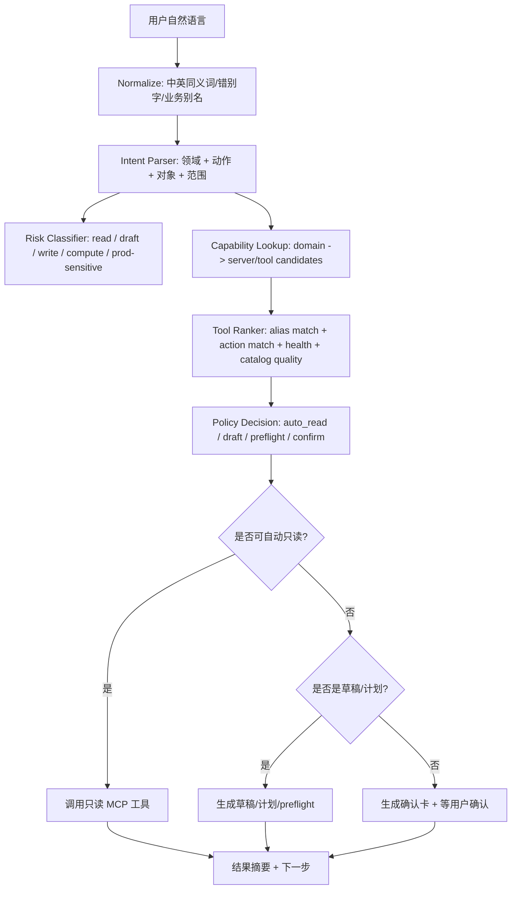
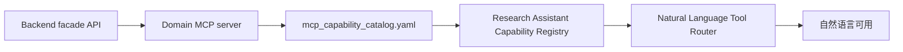

# Research Assistant 统一 MCP 自然语言理解与工具编排设计方案

> 日期：2026-05-27  
> 分支：`docs/research-assistant-mcp-orchestration-20260527`  
> worktree：`F:\Dev\AIstock_worktrees\research-assistant-mcp-orchestration-design-20260527`  
> 任务分级：T3 / 统一架构设计  
> 覆盖范围：Research Assistant 自然语言理解、MCP 能力目录、工具路由、执行审批、现有 MCP 方案统一、未来领域 MCP 扩展  
> 运行边界：本设计不启动、不停止、不重启 `8001` / `3000`，不直接改生产配置。

## 1. 设计结论

Research Assistant 应成为 AIstock 内部的“自然语言 MCP 编排器”：用户不需要记住 MCP server 名称、tool 名称、参数或风险等级，只要用自然语言表达需求，助手就能：

1. 理解用户说的业务对象、动作、范围和风险。
2. 在统一 MCP 能力目录中找到合适的 server 和 tool。
3. 对只读工具自动调用或建议调用。
4. 对草稿、preflight、计划类工具先生成可审阅结果。
5. 对写入、补录、运行实验、GitHub 正式同步、数据修复等动作，先做 preflight，再拿到明确确认后执行。
6. 用拟人化、面向业务的语言回复，而不是把内部限制清单直接丢给用户。

一句话目标：**用户说“帮我看看数仓有没有漏入仓”“这个 QE loop 为什么差”“把 BUG 同步一下”“本地数据 trade_date 是否缺口”“因子相关性是否太高”，Research Assistant 都能自己判断该用哪个 MCP，并按风险边界推进。**

## 2. 已有方案统一关系

本方案不是新开一套 MCP 体系，而是把已有设计归并为一个上层编排规范。

| 既有方案/实现 | 已提供能力 | 本方案统一后的定位 |
|---|---|---|
| `docs/architecture/research_pipeline_and_mcp_gateway_design_v2.md` | 统一 `backend/mcp/` gateway 骨架、Research MCP、未来 qe_archive/qe_experiment/validation 迁移方向 | 作为 MCP 平台层和迁移路线基础。 |
| `docs/architecture/local_data_management_mcp_gateway_design_20260523.md` | 本地数据管理 MCP、47 个工具、只读/确认写入、Research Assistant capability seed | 作为本地数据领域 MCP 的完整落地样板。 |
| `docs/architecture/research_assistant_mcp_skill_execution_closure_design_20260525.md` | Dialogue mode router、workflow/agent 分离、MCP/Skill 执行闭环 | 作为自然语言意图到执行状态机的基础。 |
| `docs/architecture/research_assistant_prompt_context_runtime_governance_design_20260524.md` | Prompt Pack、runtime config、capability catalog、权限和上下文治理 | 作为 prompt、能力目录和工具权限的治理源。 |
| `docs/architecture/research_assistant_prompt_pack_runtime_design_20260524.md` | Prompt Pack 文件化、能力问答样式、对话路由提示词 | 作为拟人化对话和可审阅 prompt 源。 |
| `docs/architecture/data_warehouse_extension_design_20260510.md` | `qe_archive` 数仓扩展、outbox/worker/archive_job、factor/model/paper 数据入仓 | 作为 QE 数仓和未来因子/模型/策略库 MCP 的数据底座。 |
| `docs/architecture/qe_mcp_template_archive_research_design_20260515.md` | QE template/archive/research MCP 组合 | 作为 QE 实验、归档、研究协同的业务场景。 |
| `docs/architecture/mcp_server_for_validation_center_design_20260509.md` | Validation Center / BUG / GitHub issue MCP 思路 | 作为 Issue workflow 和验证中心 MCP 的治理场景。 |
| `docs/process/*mcp_server*.md` | Codex、Claude Code、MCP 协议和注册流程 | 作为外部客户端注册和工具可见性方案。 |
| `docs/analysis/mcp_token_audit_20260526.md` | MCP payload token 成本问题 | 作为 summary-first、按需 detail 的返回策略依据。 |
| `docs/architecture/research_assistant_full_mcp_orchestration_design_20260527.md` | 已提出全量 MCP catalog、QE 数仓可见、拟人化回复和未来 MCP 拆分 | 本文在其基础上补齐“自然语言理解到工具选择”的统一流程。 |

## 3. 设计目标

### 3.1 用户体验目标

用户只说自然语言，不需要说工具名：

| 用户自然语言 | 助手应理解 | 首选 MCP |
|---|---|---|
| “数仓有没有漏入仓？” | QE Archive 归档完整性 / outbox / backfill source status | `aistock-qe-archive` |
| “这个 QE loop 为什么指标变差？” | QE 实验状态、loop metrics、analysis、日志、必要时归档质量 | `aistock-qe-experiment` + `aistock-qe-archive` |
| “本地 trade_date 是不是又没同步？” | 本地数据 dataset 状态、gap、sync attempt、repair plan | `aistock-local-data` |
| “把 BUG-120 的闭环状态同步一下” | Validation / BUG JSON / GitHub issue sync workflow | `aistock-validation` |
| “最近因子库哪些因子相关性太高？” | 因子相关性分析，当前可先用 archive 查询，未来用 factor-correlation MCP | `aistock-factor-correlation`（未来）/ `aistock-qe-archive`（过渡） |
| “这个模型 trial 和之前 seed 表现差异大吗？” | model trial / seed / hyperparam 历史 | `aistock-qe-archive`，未来 `aistock-model-registry` |
| “这个策略能不能进入 Paper v2？” | strategy package health / selection / paper readiness / promotion plan | 未来 `aistock-strategy-governance` |
| “执行策略库里有什么 minute algo？” | execution policy / algo library / risk limits | 未来 `aistock-execution-policy` |

### 3.2 系统目标

1. 所有已登记 MCP 对 Research Assistant 可见。
2. 每个 MCP 有中文业务描述、英文 server/tool key、同义词、典型问题、风险策略。
3. 自然语言意图路由不靠单一关键词，而是结合领域对象、动作、目标产物、时间范围和风险。
4. 工具选择可解释：助手能说明“我会先查哪个 MCP，为什么”。
5. 工具调用可审计：所有 preflight、confirmed action、失败和结果摘要写入 Trace / Audit。
6. 能力目录可同步：`.mcp.json`、Codex config、Claude Code config、Research Assistant DB catalog、静态工具定义保持一致。
7. 响应 summary-first：默认返回人类可读摘要，必要时再取 detail，避免 MCP payload 膨胀。

## 4. 当前 MCP 总目录

当前 worktree 静态扫描到 6 个已存在 AIstock MCP server，总工具数 141：

| MCP server | 当前工具数 | 业务名称 | 主要能力 | 状态 |
|---|---:|---|---|---|
| `aistock-local-data` | 47 | 本地数据管理 MCP | 数据健康、dataset 状态、gap、sync target、job、schedule、source test、repair plan、confirmed repair | 已实现，需进入全量助手目录和外部客户端注册。 |
| `research-assistant` | 13 | 助手自身 MCP | task、event、chat turn、prompt bundle、prompt nodes、memory candidate、context pack、tool list、preflight、approval | 已实现，作为编排内核。 |
| `aistock-research` | 16 | Research Pipeline MCP | research experiment、stage、artifact refs、backtest records、HMM backfill、promote/reject | 已实现，需进入助手统一目录。 |
| `aistock-qe-experiment` | 26 | QE 实验 MCP | experiment 查询、状态、日志、metrics、trade stats、custom evo、loop 对比、template create/validate/materialize/run | 已实现，需补完整目录和自然语言路由。 |
| `aistock-qe-archive` | 20 | QE 数仓 MCP | archive health、run quality、outbox、jobs、skips、backfill preview/execute、factor/model/seed/hyperparam query | 已实现，是“数仓 MCP”的当前实体。 |
| `aistock-validation` | 19 | 验证与 Issue MCP | validation plan/run/finding、BUG、agent context、GitHub issue list/search/create/sync、assign/status | 已实现，需完整暴露 issue workflow 能力。 |

### 4.1 必须解决的不一致

| 不一致 | 影响 | 统一方案 |
|---|---|---|
| `.mcp.json` 有 `aistock-qe-archive`，Research Assistant catalog 没完整登记 | 用户问“数仓 MCP”看不到 | Catalog Sync 把 server/tool 自动纳入助手目录。 |
| Local Data MCP 模块 47 工具，但用户看到的工具少 | 误以为本地数据 MCP 未完成 | 目录按分组展示完整能力，执行仍分风险。 |
| Research Pipeline MCP 存在但助手能力问答不表达 | “研究流水线”和 “Research Assistant”混淆 | 把 `aistock-research` 定义为独立领域。 |
| Validation MCP 工具多，但只登记 GitHub create | BUG workflow finish/sync 不自然 | 将 issue lifecycle 工具完整归类。 |
| Future profiles 把 `qe_archive/qe_experiment/validation` 视为 future-only | Gateway profile 与专用 server 现状不一致 | 保留专用 server，同时设计 Phase 2 迁移到 unified gateway。 |

## 5. 统一能力模型

### 5.1 MCP Server Capability

每个 MCP server 必须有一条能力记录：

```yaml
server_key: aistock-qe-archive
domain_key: qe_warehouse
display_name_zh: QE 数仓 MCP
display_name_en: QE Archive MCP
summary_for_user: 查询 QE 入仓、归档质量、outbox、补录预览、因子/模型/seed/超参历史。
summary_for_llm: Use for warehouse/archive/backfill/outbox/run-quality/factor-usage/model-trial queries.
aliases:
  - 数仓
  - QE数仓
  - 入仓
  - 归档
  - archive
  - warehouse
  - outbox
  - backfill
example_user_intents:
  - 数仓有没有漏入仓？
  - 帮我看这个 run 的归档质量
  - 最近因子使用情况怎样？
default_auto_call_policy: auto_read
write_policy: preflight_then_confirm
source_refs:
  - scripts/aistock_qe_archive_mcp_server.py
  - docs/architecture/data_warehouse_extension_design_20260510.md
```

### 5.2 MCP Tool Capability

每个 tool 必须有一条工具能力记录：

```yaml
tool_ref: aistock-qe-archive/qe_archive_backfill_execute_confirmed
tool_name: qe_archive_backfill_execute_confirmed
display_name_zh: 执行 QE 数仓补录
intent_tags: [qe_warehouse, backfill, archive_job, confirmed_write]
action_type: execute_confirmed
side_effect_level: run_data_job
risk_level: production_sensitive
auto_call_policy: preflight_then_confirm
requires_preflight: true
requires_confirmation: true
confirmation_text: QE_ARCHIVE_BACKFILL
summary_first: true
max_default_items: 20
```

### 5.3 Domain Ontology

新增统一领域词表：

| domain_key | 同义词 | 常见对象 | 常见动作 | 首选 MCP |
|---|---|---|---|---|
| `local_data` | 本地数据、同步、缺口、trade_date、Tushare、dataset、source test | dataset、gap、job、schedule、alert、sync target | 查状态、查缺口、生成修复计划、确认修复 | `aistock-local-data` |
| `qe_experiment` | QE、实验、loop、自定义演进、template、回测、日志 | experiment、task、loop、metrics、config、log | 查状态、对比 loop、看日志、校验模板、运行实验 | `aistock-qe-experiment` |
| `qe_warehouse` | 数仓、入仓、归档、archive、warehouse、outbox、backfill、归档质量 | run、outbox、archive_job、skip、factor usage、model trial | 查质量、查入仓、补录预览、执行补录 | `aistock-qe-archive` |
| `validation_issue` | BUG、issue、GitHub、闭环、sync、验证记录、workflow | bug json、GitHub issue、validation run、finding | 创建、认领、同步、关闭、查验证 | `aistock-validation` |
| `research_pipeline` | 研究流水线、research、stage、artifact、HMM backfill | experiment、stage、artifact_ref、backtest record | 创建研究、跑 stage、查 artifact、promote/reject | `aistock-research` |
| `assistant_runtime` | 助手、上下文、记忆、prompt、capability、工具目录 | task、memory candidate、context pack、prompt bundle | 建任务、列工具、preflight、建上下文 | `research-assistant` |
| `factor_library` | 因子库、因子覆盖、IC、RankIC、因子质量 | factor、coverage、metric、version | 查因子、查覆盖、查指标 | 未来 `aistock-factor-library` |
| `factor_correlation` | 相关性、冗余、替换、cluster | correlation matrix、factor pair、replacement | 计算相关性、建议替换 | 未来 `aistock-factor-correlation` |
| `model_registry` | 模型库、trial、seed、超参、模型产物 | model、trial、seed、hyperparam、artifact | 查模型、比较 trial、冻结/注册 | 未来 `aistock-model-registry` |
| `strategy_governance` | 策略库、策略包、Selection、Paper、候选策略 | strategy package、portfolio、selection run | 查健康、评估推广、退役 | 未来 `aistock-strategy-governance` |
| `execution_policy` | 执行策略、minute algo、TWAP、VWAP、POV、实盘前置 | execution algo、policy、risk limit | 查策略、校验适用性 | 未来 `aistock-execution-policy` |

## 6. 自然语言理解流程

### 6.1 Pipeline



### 6.2 Intent Parser 输出结构

```json
{
  "user_message": "帮我看数仓有没有漏入仓",
  "domains": ["qe_warehouse"],
  "primary_domain": "qe_warehouse",
  "action": "check_archive_completeness",
  "objects": ["archive_run", "outbox", "backfill_source"],
  "time_range": null,
  "identifiers": [],
  "risk_hint": "read_only",
  "needs_tool": true,
  "confidence": 0.86,
  "route_reason": "数仓/漏入仓 maps to qe_archive source status, outbox and run quality"
}
```

### 6.3 工具选择输出结构

```json
{
  "selected_server": "aistock-qe-archive",
  "candidate_tools": [
    "qe_archive_health",
    "qe_archive_list_outbox",
    "qe_archive_list_jobs",
    "qe_archive_get_source_status",
    "qe_archive_backfill_preview"
  ],
  "auto_call_tools": ["qe_archive_health", "qe_archive_list_outbox"],
  "ask_before_tools": ["qe_archive_get_source_status", "qe_archive_backfill_preview"],
  "blocked_until_confirmed": ["qe_archive_backfill_execute_confirmed"],
  "response_hint": "先查健康、outbox 和最近 job；如发现缺口，再生成补录预览，执行补录前再确认。"
}
```

## 7. 路由决策规则

### 7.1 多 MCP 组合场景

有些需求天然需要多个 MCP：

| 场景 | 路由顺序 |
|---|---|
| “这个 QE loop 指标差，是否因为没入仓？” | `aistock-qe-experiment` 查 loop metrics/logs -> `aistock-qe-archive` 查 run quality/outbox。 |
| “BUG 修了没，GitHub 和 JSON 是否闭环？” | `aistock-validation` 查 BUG/issue -> `research-assistant` 记录 task/context。 |
| “本地数据缺口会不会影响 QE？” | `aistock-local-data` 查 dataset/gap -> `aistock-qe-experiment` 或 `aistock-qe-archive` 查受影响实验。 |
| “因子相关性高是否影响最近模型 trial？” | 未来 `aistock-factor-correlation` -> `aistock-qe-archive` 查 model trial/factor importance。 |
| “策略能否进 Paper v2 并使用某执行算法？” | 未来 `aistock-strategy-governance` -> `aistock-execution-policy` -> validation preflight。 |

### 7.2 风险策略

| 工具类型 | 例子 | 策略 | 用户可见表达 |
|---|---|---|---|
| 只读查询 | health、list、get、query | 可自动调用 | “我先查一下状态。” |
| 草稿/候选 | create template draft、issue candidate、memory candidate | 可自动生成草稿，不正式提交 | “我先生成一个草稿，你确认后再进入正式流程。” |
| preflight / preview | validate、backfill preview、repair plan | 可自动或 ask-before-call | “我先做预检/预览，不会写入。” |
| 确认写入 | repair apply、backfill execute、schedule update | 必须确认 | “这一步会写入/启动任务，我先列影响范围，确认后执行。” |
| 高成本计算 | QE run、factor metrics job、correlation job | preflight + 成本说明 + 确认 | “这是高成本任务，我会先估算资源和范围。” |
| 生产敏感 | 数据修复、GitHub issue 正式创建/同步、执行策略、实盘相关 | approval + confirmation + trace | “需要你明确批准，我会保留审计记录。” |

### 7.3 拟人化响应要求

普通能力问答：

```text
可以。我会按你的描述先判断任务属于哪类：本地数据、QE 实验、QE 数仓、Issue/验证、研究流水线，或者未来的因子/模型/策略库。比如你说“数仓漏入仓”，我会优先用 QE 数仓 MCP；你说“trade_date 缺口”，我会优先用本地数据 MCP。
```

不应再这样回答：

```text
当前只能按已登记目录使用工具，不具备未登记工具。
```

如果确实缺工具，应表达为：

```text
这个动作需要新增受控 MCP。我会把它设计成只读查询自动、写入执行确认、长任务异步 job 的形式，并登记到统一能力目录。
```

## 8. 统一 MCP Catalog Sync

### 8.1 数据源

统一目录由四类来源合并：

| 来源 | 用途 | 优先级 |
|---|---|---:|
| 手工维护 YAML | 中文业务描述、同义词、风险策略、典型问题 | 最高 |
| `.mcp.json` / Codex / Claude config | 当前客户端可见 server | 高 |
| 静态工具扫描 | 从 Python MCP server 提取 tool 名 | 中 |
| runtime list_tools | 实际运行 MCP schema | 中高，但可能受会话缓存影响 |
| Research Assistant DB seed | 当前助手可见能力 | 需要被校验和更新 |

### 8.2 Sync 规则

1. `.mcp.json` 有 server，而助手 DB 没有：标记 `missing_in_assistant_catalog`。
2. Python server 有工具，而助手 DB 少登记：标记 `partial_tool_catalog`。
3. 手工 YAML 缺描述：标记 `needs_description`，不阻止只读工具使用，但能力问答要避免生硬函数名。
4. runtime `list_tools` 失败：标记 `runtime_unverified`，不能删除静态目录。
5. server 不在客户端配置：标记 `not_client_registered`，助手可解释“代码存在但当前客户端不可见”。
6. 旧会话工具未注入：标记 `session_schema_stale`，提示新开会话或刷新工具 schema。

### 8.3 建议文件

```text
backend/services/research_assistant/mcp_capability_catalog.yaml
backend/services/research_assistant/mcp_catalog_sync.py
backend/services/research_assistant/tool_router.py
backend/services/research_assistant/domain_ontology.py
backend/tests/research_assistant/test_mcp_catalog_sync.py
backend/tests/research_assistant/test_tool_router.py
backend/tests/research_assistant/test_natural_language_mcp_routing.py
```

## 9. 已有 MCP 的统一分组

### 9.1 `aistock-local-data`

| 分组 | 典型工具 | 自然语言触发 |
|---|---|---|
| 健康概览 | `local_data_health_overview` | “本地数据健康吗？” |
| Dataset 状态 | `local_data_get_dataset_status`、`local_data_list_data_stats` | “trade_date 到哪天？”、“这个数据集 ready 吗？” |
| 缺口检查 | `local_data_check_gaps`、`local_data_compute_auto_range` | “有没有缺口？”、“需要补哪段？” |
| 同步目标和历史 | `local_data_list_sync_targets`、`local_data_list_sync_attempts` | “同步失败了吗？” |
| Job 和日志 | `local_data_list_jobs`、`local_data_get_job_logs` | “任务卡住了吗？” |
| Schedule | `local_data_list_schedules`、`local_data_upsert_schedule_confirmed` | “计划任务配置对吗？” |
| Repair | `local_data_plan_repair`、`local_data_apply_repair_confirmed` | “帮我修复数据问题。” |

### 9.2 `aistock-qe-experiment`

| 分组 | 典型工具 | 自然语言触发 |
|---|---|---|
| 实验查询 | `qe_experiment_list`、`qe_experiment_get`、`qe_experiment_get_status` | “这个实验现在怎么样？” |
| 日志和指标 | `qe_experiment_get_logs_tail`、`qe_experiment_get_enhanced_metrics`、`qe_experiment_get_trade_stats` | “为什么失败？”、“指标如何？” |
| Custom Evo | `qe_custom_evo_list_tasks`、`qe_custom_evo_loop_comparison`、`qe_custom_evo_get_loop_metrics` | “哪个 loop 最好？” |
| Template | `qe_template_create`、`qe_template_validate`、`qe_template_materialize_confirmed`、`qe_template_run_confirmed` | “创建/校验/运行模板。” |
| 执行控制 | `qe_experiment_run_confirmed`、`qe_experiment_stop_confirmed` | “启动/停止实验。” |

### 9.3 `aistock-qe-archive`

| 分组 | 典型工具 | 自然语言触发 |
|---|---|---|
| 数仓健康 | `qe_archive_health` | “数仓健康吗？” |
| 归档质量 | `qe_archive_list_runs`、`qe_archive_get_run_quality` | “这个 run 入仓质量怎样？” |
| Outbox/Job/Skip | `qe_archive_list_outbox`、`qe_archive_list_jobs`、`qe_archive_list_skips` | “为什么没入仓？” |
| Backfill | `qe_archive_backfill_preview`、`qe_archive_backfill_execute_confirmed` | “补录这些实验。” |
| 因子分析 | `qe_archive_query_factor_usage`、`qe_archive_query_factor_importance`、`qe_archive_query_factor_importance_stability` | “哪些因子常用/稳定？” |
| 模型分析 | `qe_archive_query_model_trials`、`qe_archive_query_seed_trials`、`qe_archive_query_hyperparam_history` | “模型 trial/seed/超参历史怎样？” |

### 9.4 `aistock-validation`

| 分组 | 典型工具 | 自然语言触发 |
|---|---|---|
| 验证计划 | `list_plans`、`get_plan` | “有哪些验证计划？” |
| 验证运行 | `list_validation_runs`、`get_validation_run`、`start_validation_execution` | “跑验证/查验证结果。” |
| Findings | `list_findings` | “有什么失败项？” |
| BUG | `list_bugs`、`get_bug_agent_context`、`assign_bug`、`update_bug_status` | “BUG 处理到哪了？” |
| GitHub issue | `mcp_github_issue_list`、`mcp_github_issue_search`、`mcp_github_issue_create`、`mcp_github_issue_sync_bug` | “同步 GitHub issue。” |

### 9.5 `aistock-research`

| 分组 | 典型工具 | 自然语言触发 |
|---|---|---|
| Research experiment | `research_create_experiment`、`research_list_experiments`、`research_get_experiment` | “创建/查看研究流水线。” |
| Stage | `research_run_stage`、`research_retry_stage`、`research_get_stage_result` | “跑/重试某个 stage。” |
| Artifact | `research_list_artifact_refs`、`research_list_backtest_records` | “有哪些研究产物？” |
| HMM backfill | `research_hmm_backfill_preview`、`research_hmm_backfill_execute` | “补 HMM 回测时间线。” |
| Issue / promote | `research_create_issue`、`research_promote`、`research_reject` | “把研究结果转 issue / 推广 / 拒绝。” |

### 9.6 `research-assistant`

| 分组 | 典型工具 | 自然语言触发 |
|---|---|---|
| 任务与对话 | `assistant_create_task`、`assistant_chat_turn`、`assistant_add_task_event` | “记录成任务 / 继续对话。” |
| Prompt | `assistant_build_prompt_bundle`、`assistant_list_prompt_nodes` | “当前用了哪些 prompt？” |
| 记忆与上下文 | `assistant_create_memory_candidate`、`assistant_build_context_pack`、`assistant_create_temp_memory` | “做上下文包 / 记录临时记忆。” |
| MCP 目录 | `assistant_list_mcp_tools`、`assistant_preflight_mcp_tool` | “你有哪些工具 / 先预检这个工具。” |
| Issue 候选 | `assistant_create_issue_candidate` | “先生成 issue 候选。” |

## 10. 未来 MCP 统一纳入方式

未来新增因子、模型、策略、执行策略 MCP 时，不再单独写散落方案，而必须按本方案接入：



### 10.1 因子库 MCP

| 项 | 设计 |
|---|---|
| server | `aistock-factor-library` |
| 范围 | 因子元数据、版本、来源、覆盖率、指标缓存、质量标签 |
| 首批工具 | `factor_library_list`、`factor_library_get`、`factor_library_search`、`factor_library_get_coverage`、`factor_library_get_metric_summary` |
| 自然语言 | “因子库有哪些动量因子？”、“这个因子覆盖到哪天？”、“IC 最近怎么样？” |
| 风险 | 默认只读；新增/废弃因子需确认。 |

### 10.2 因子独立指标 MCP

| 项 | 设计 |
|---|---|
| server | `aistock-factor-metrics` |
| 范围 | IC/RankIC、分组收益、稳定性、覆盖率、OOS 指标 |
| 首批工具 | `factor_metrics_plan`、`factor_metrics_submit_confirmed`、`factor_metrics_get_job`、`factor_metrics_get_result` |
| 自然语言 | “帮我算这个因子的独立 IC。”、“最近 3 年 RankIC 稳定吗？” |
| 风险 | 大计算异步 job；submit 需确认；结果 summary-first。 |

### 10.3 因子相关性 MCP

| 项 | 设计 |
|---|---|
| server | `aistock-factor-correlation` |
| 范围 | 因子相关性矩阵、冗余聚类、替换建议 |
| 首批工具 | `factor_corr_plan`、`factor_corr_submit_confirmed`、`factor_corr_get_matrix`、`factor_corr_suggest_replacements` |
| 自然语言 | “这些因子是不是太像？”、“帮我找低相关替代。” |
| 风险 | 大矩阵必须限范围/异步；默认返回 top pairs 和摘要。 |

### 10.4 模型库 MCP

| 项 | 设计 |
|---|---|
| server | `aistock-model-registry` |
| 范围 | 模型 trial、seed、超参、训练指标、artifact manifest、冻结版本 |
| 首批工具 | `model_registry_list`、`model_registry_get`、`model_registry_compare_trials`、`model_registry_get_artifacts` |
| 自然语言 | “这个模型和上次 trial 差在哪？”、“seed 稳定吗？” |
| 风险 | 默认只读；注册/冻结/删除需确认。 |

### 10.5 策略库 MCP

| 项 | 设计 |
|---|---|
| server | `aistock-strategy-governance` |
| 范围 | StrategyPackage、Selection Center、Paper readiness、候选策略推广/退役 |
| 首批工具 | `strategy_list_packages`、`strategy_get_health`、`strategy_get_selection_readiness`、`strategy_plan_promotion` |
| 自然语言 | “这个策略能进 Paper v2 吗？”、“哪些包不可运行？” |
| 风险 | 推广/退役/状态变更需确认和 validation gate。 |

### 10.6 执行策略库 MCP

| 项 | 设计 |
|---|---|
| server | `aistock-execution-policy` |
| 范围 | minute execution algo、TWAP/VWAP/POV、风险限制、适用市场状态 |
| 首批工具 | `execution_policy_list`、`execution_policy_get`、`execution_policy_validate_for_strategy` |
| 自然语言 | “哪些 minute algo 可用？”、“这个策略适合 POV 吗？” |
| 风险 | 只读优先；实盘或半实盘路径必须最高审批。 |

## 11. 实施路线

### Phase A：统一设计和目录规范

- 本文落地。
- 将 `research_assistant_full_mcp_orchestration_design_20260527.md` 作为详细设计补充引用。
- 确认所有已有 MCP 方案引用关系。

验收：文档存在，`git diff --check` 通过。

### Phase B：MCP Capability Catalog YAML

- 新增 `backend/services/research_assistant/mcp_capability_catalog.yaml`。
- 登记 6 个当前 server、141 个工具的分组和高价值工具描述。
- 每个 server 至少有 aliases、example intents、risk policy。

验收：静态 schema 校验；缺 description 的工具不能进入 `catalog_quality=complete`。

### Phase C：Catalog Sync 服务

- 新增 `mcp_catalog_sync.py`。
- 支持 dry-run、apply、diff。
- 检查 `.mcp.json`、静态 tool scan、DB catalog 的不一致。

验收：dry-run 能指出当前 `aistock-qe-archive` / `aistock-research` / local-data 子集登记不完整。

### Phase D：Natural Language Tool Router

- 新增 `domain_ontology.py` 和 `tool_router.py`。
- 扩展 `DialogueIntent`：`QE_WAREHOUSE_REQUEST`、`MCP_CAPABILITY_INQUIRY`、`FACTOR_LIBRARY_REQUEST`、`MODEL_REGISTRY_REQUEST`、`STRATEGY_GOVERNANCE_REQUEST`、`EXECUTION_POLICY_REQUEST`。
- 将 route decision 写入 `assistant_trace_events`。

验收：单测覆盖至少 40 条自然语言表达。

### Phase E：Prompt Pack 和拟人化回复

- 新增/更新：
  - `domain.qe_warehouse.md`
  - `domain.mcp_capability_router.md`
  - `renderer.humanized_response.md`
  - `tool_guard.mcp_qe_archive.md`
  - `tool_guard.mcp_all.md`
- 能力询问不再输出限制清单。

验收：snapshot 测试确认常见能力问答自然、简短、可操作。

### Phase F：外部客户端全量注册

- `.mcp.json` 补 `aistock-local-data`、`research-assistant`，并明确现有 4 个 server。
- Codex global config / Claude Code config 使用同名 server。
- 新会话工具 schema 可见性说明进入 docs/process。

验收：配置 parse；direct-script list_tools；不启动/重启 `8001`。

### Phase G：未来 MCP 分域落地

优先顺序：

1. `aistock-factor-library` 只读。
2. `aistock-factor-metrics` 异步 job。
3. `aistock-factor-correlation` 异步矩阵。
4. `aistock-model-registry` 只读 + 注册确认。
5. `aistock-strategy-governance` 只读 + 推广计划。
6. `aistock-execution-policy` 只读 + 验证。

## 12. Design Acceptance Index

| 编号 | 用户要求 | 设计位置 | 验收标准 |
|---|---|---|---|
| U-MCP-001 | 助手理解各种自然语言描述 | 第 6、7 章 | 40 条自然语言路由单测通过。 |
| U-MCP-002 | 自动判断需要使用什么工具 | 第 7、8、9 章 | route decision 包含 server/tool/reason/policy。 |
| U-MCP-003 | 使用所有 MCP 工具 | 第 4、8、9 章 | 当前 6 个 server / 141 个工具进入统一目录。 |
| U-MCP-004 | 与之前其他 MCP 服务设计统一 | 第 2 章 | 引用并整合 Research Pipeline、Local Data、QE Archive、Validation、Prompt Runtime、MCP setup 等方案。 |
| U-MCP-005 | 独立 worktree 和分支 | 文档头部 | worktree/branch 独立且 clean。 |
| U-MCP-006 | 方案落地到分支中 | 本文 + commit | 文档提交并推送。 |
| U-MCP-007 | 数仓自然语言可理解 | 第 5.3、6、9.3 | “数仓/入仓/归档/backfill/outbox” 全部路由 `aistock-qe-archive`。 |
| U-MCP-008 | 不再限制公告式回复 | 第 7.3、11E | 能力问答 snapshot 不出现大段“只能/不具备”清单。 |
| U-MCP-009 | 高风险仍受控 | 第 7.2 | 写入/运行/补录/GitHub sync 均需 preflight/confirm/approval。 |
| U-MCP-010 | 未来 MCP 可扩展 | 第 10、11G | 因子、模型、策略、执行策略 MCP 都有统一接入模板。 |

## 13. 测试计划

### 13.1 文档阶段

```powershell
rtk proxy git -C F:/Dev/AIstock_worktrees/research-assistant-mcp-orchestration-design-20260527 diff --check
rtk proxy rg -n "U-MCP-001|aistock-qe-archive|自然语言|Tool Router" docs/architecture/research_assistant_unified_mcp_natural_language_orchestration_design_20260527.md
```

### 13.2 代码实施阶段

```powershell
rtk proxy python -m py_compile backend/services/research_assistant/mcp_catalog_sync.py backend/services/research_assistant/tool_router.py backend/services/research_assistant/domain_ontology.py
rtk proxy pytest -q backend/tests/research_assistant/test_mcp_catalog_sync.py backend/tests/research_assistant/test_tool_router.py backend/tests/research_assistant/test_natural_language_mcp_routing.py -p no:cacheprovider
```

### 13.3 MCP 可见性验证

不启动 backend，仅验证 MCP stdio schema 和配置：

```powershell
rtk proxy python debug_tools/mcp/list_tools_smoke.py --server aistock-qe-archive
rtk proxy python debug_tools/mcp/list_tools_smoke.py --server aistock-qe-experiment
rtk proxy python debug_tools/mcp/list_tools_smoke.py --server aistock-local-data
rtk proxy python debug_tools/mcp/list_tools_smoke.py --server aistock-validation
rtk proxy python debug_tools/mcp/list_tools_smoke.py --server aistock-research
rtk proxy python debug_tools/mcp/list_tools_smoke.py --server research-assistant
```

如果需要运行时业务验证，必须由用户自行启动 backend 后再执行只读 API smoke。

## 14. 运行与生产边界

- 本方案阶段不触碰 `8001` / `3000`。
- 后续实施也不得把“代码可见”误解为“重启生效”。
- 任何生产数据修复、入仓补录、QE run、GitHub 正式写入，都必须有 preflight、确认和审计。
- MCP 不直接连 DB、不直接执行任意 Shell、不绕过 backend façade。
- 若未来确需文件/Git/HTTP/DB 查询能力，应新增受控 MCP：例如 `aistock-repo-ops`、`aistock-warehouse-query`，并只开放白名单动作。

## 15. 合入标准

统一方案进入 `main` 前：

1. 文档通过 `git diff --check`。
2. 方案引用所有既有 MCP 设计来源，不形成 competing architecture。
3. 明确当前 6 个已存在 MCP server 和未来 MCP 扩展边界。
4. 明确自然语言路由、工具选择、风险策略、拟人化回复。
5. 明确 implementation phases 和测试计划。
6. `production_ddl_gate=noop`，除非后续实施新增 DB 字段。
7. `production_frontend_dependency_gate=noop`。
8. `production_backend_dependency_gate=noop`。
