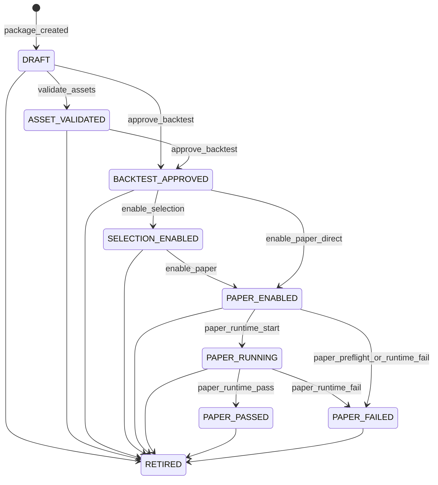

# StrategyPackage enable-selection/enable-paper 生命周期持久化 F2 设计

- 文档类型: F2 跨模块/生产关键状态机设计
- 日期: 2026-06-29
- 分支: `feature/strategy-package-enable-lifecycle-20260629`
- Worktree: `F:\Dev\AIstock_worktrees\strategy-package-enable-lifecycle-20260629`
- 当前同步基线: `origin/main` = `a4897918cc4a4198dfc753a2002e7f07212377d9` (2026-06-29 rebase)
- 初始设计基线: `origin/main` = `64e80733ad1ec90a0b530c8c859d2a4fb207cab0`
- 关联背景: PR #1701 文档 `docs/analysis/qe_to_paper_chain_closure_gap_and_multi_alpha_paper_admission_design_20260628.md` §2.9.1/§3.6 在 `origin/docs/qe-paper-chain-closure-gap-20260628` 中提示本缺口；当前 `origin/main` 尚未包含该分析文档。

## 1. Background / 背景与第 0 步 reconcile

### 1.1 当前不一致

`backend/services/strategy_package/models.py` 中 `PackageStatus` 已定义 `SELECTION_ENABLED`、`PAPER_ENABLED`、`PAPER_RUNNING`、`PAPER_PASSED`、`PAPER_FAILED`。但当前 `backend/services/strategy_package/service.py` 的 `STATUS_TRANSITIONS` 只保留 `DRAFT -> ASSET_VALIDATED -> BACKTEST_APPROVED` 和任意非 RETIRED -> `RETIRED`，且 `_is_deprecated_runtime_admission_status()` 把上述五个状态当作“deprecated runtime admission status”。`enable_selection()` / `enable_paper()` 只调用 asset eligibility 后原样返回 record，不再写 `strategy_pkg.package.package_status`，因此现行代码不能产生 DB 中已存在的 `SELECTION_ENABLED`/`PAPER_ENABLED` 状态。

### 1.2 第 0 步 reconcile 证据

本设计采用“保留状态并恢复正式生命周期”的结论，证据如下：

1. Git 历史显示这些状态不是孤立脏数据，而是早期正式状态机的一部分。
   - `eb3385bf feat(paper-v2): add explicit selection artifact and watchlist flow` 新增 `STATUS_TRANSITIONS`，包含 `BACKTEST_APPROVED -> SELECTION_ENABLED -> PAPER_ENABLED -> PAPER_RUNNING -> {PAPER_PASSED,PAPER_FAILED}`，并且 `enable_selection()` / `enable_paper()` 均调用 `transition_status()` 写库。
   - `07e66ac6 feat(paper-v2): decouple package gates and runtime services` 仍保留上述状态机，只把 `PAPER_ENABLED` 的门禁收窄为 Paper simulation admission。
   - `ce6e11b8 feat(paper-v2): remove package admission gates` 删除五个 runtime admission target 的 transition，并引入 `_is_deprecated_runtime_admission_status()` 与 enable no-op。这是“门禁清理”时把生命周期持久化一起移除导致的退化。
2. 生产只读实测（未 DDL/DML）确认当前数据状态:
   - DB target: `aistock` / user `postgres` / host `172.17.0.3/32` / port `5432`。
   - `strategy_pkg.package`: `BACKTEST_APPROVED=9`、`SELECTION_ENABLED=5`、`PAPER_ENABLED=1`。
   - 五条 `SELECTION_ENABLED` 都是 single-alpha package，且有 `package_status_event` 审计，reason 为 `enable_selection`：`pkg_006a423...`、`pkg_99142c...`、`pkg_b668f...`、`pkg_cfa3c...`、`pkg_2a9f...`。
   - 一条 `PAPER_ENABLED` 为 `pkg_5a5ccb56...`，事件 reason=`synthetic_evidence_9:30_sanity`，context 明确 `synthetic_evidence_pre_real_etl`，来源脚本为 `scripts/r6_cutover_synthetic_evidence_rollback.py` 的回滚说明与 synthetic evidence cutover 历史；该脚本可回滚为 `BACKTEST_APPROVED`，但当前生产仍保留该状态。
   - `strategy_pkg.package` 当前没有 `package_status` CHECK 约束；因此本任务无需 DDL 规整旧值即可让状态机识别现有 rows。
3. 文档历史同样支持“这些状态曾是正式产品语义”。`docs/analysis/enable_paper_audit_20260510.md` 记录当时 `enable_paper()` 是唯一入口，`STATUS_TRANSITIONS[PAPER_ENABLED]={BACKTEST_APPROVED,SELECTION_ENABLED}`，repository 层用 compare-and-set + `package_status_event` 审计。

### 1.3 Reconcile 决策

- 保留五个 PackageStatus 作为正式生命周期状态，不规整 6 条存量数据。
- 理由:
  - 用户目标是 `enable-selection/enable-paper` 真正落库生命周期，且 single-alpha 与 multi-alpha 父包 parity。
  - 历史 5 条 `SELECTION_ENABLED` 由正式 `enable_selection` 路径写入，不能当废弃值清理。
  - 1 条 `PAPER_ENABLED` 虽来自 synthetic cutover，但已有审计上下文，且与正式 lifecycle 兼容；保留能避免把历史可查状态抹掉。
- DDL/DML 结论: 本阶段不新增 migration，不做生产 DDL/DML；`production_ddl_gate=noop`。若未来要给 `package_status` 增加 CHECK 约束，应单独走 DDL gate。

## 2. Scope / 范围

本 F2 只处理 StrategyPackage 生命周期持久化：

- 恢复并固定 `STATUS_TRANSITIONS` 中 `SELECTION_ENABLED` / `PAPER_ENABLED` / `PAPER_RUNNING` / `PAPER_PASSED` / `PAPER_FAILED` 的合法 transition。
- `enable_selection()` 在 asset eligibility 通过后用 repository `transition_status()` 原子落 `SELECTION_ENABLED` 并写 `package_status_event`。
- `enable_paper()` 在 asset eligibility 通过后用 repository `transition_status()` 原子落 `PAPER_ENABLED` 并写 `package_status_event`。
- single-alpha 和 multi-alpha parent package 走同一 `StrategyPackageService`、同一 `STATUS_TRANSITIONS`、同一 repository CAS，无 alpha 分叉。
- 保持 PaperPortfolio 单 `package_id` 契约不变。
- 更新与该语义冲突的单测/路由测/e2e 断言。

## 3. Non-goals / 非目标与硬边界

- 不启动/重启 backend、frontend、TDX、Paper v2 scheduler 或任何生产服务。
- 不执行生产 DDL/DML；只允许 read-only DB reconcile 查询。
- 不修改 `backend/services/strategy_package/multi_alpha_promotion.py`。
- 不修改 `models.py` 的 `SourceType` 枚举块；本轮无需新增 `PackageStatus` 枚举值，原则上不碰 `models.py`。
- 不改 combine-backtest 前端。
- 不改 PaperPortfolio 单 `package_id` 契约，多 Alpha 父包仍是普通 StrategyPackage。
- 不把 `PAPER_ENABLED` 等同实盘/Live approval；live approval 仍由 `LiveApprovalStatus` 独立状态机控制。
- 不引入新 DB schema/comment/constraint。

## 4. Architecture / 架构

### 4.1 生命周期图

### 4.2 状态机恢复原则

- `SELECTION_ENABLED` 只能从 `BACKTEST_APPROVED` 进入。
- `PAPER_ENABLED` 可从 `BACKTEST_APPROVED` 直接进入，或从 `SELECTION_ENABLED` 进入；这是为了兼容现有 Paper v2 调用方可以直接 enable paper，不强迫先选股。
- `PAPER_RUNNING`、`PAPER_PASSED`、`PAPER_FAILED` 先在状态机承认，便于业务/测试直接使用 `transition_status()`；本任务不新增 runtime writer。
- `RETIRED` 保持从任意非 retired 状态进入，并保留现有“single-alpha child 被 active multi-alpha parent 引用时不得 retire”的保护。
- 再次 enable 同一 target 不是幂等成功；repository 会抛 `InvalidStateTransitionError`，错误包含 `package_id/from_status/to_status/allowed_from`，防止 silent success。

### 4.3 多 Alpha parity

- 多 Alpha 父包由 `AlphaMode.MULTI_ALPHA` manifest 表示，但 package row、package_status、status_event 与 single-alpha 相同。
- `enable_paper()` 不重复 admission 判断；现有 `asset_eligibility.require_eligible(record, broker_backend=...)` 会通过 `_multi_alpha_runtime_blockers()` 读取 manifest admission 与 `MultiAlphaPaperAdmissionRepository`，未过 dry-run 的 multi-alpha parent 自然失败。
- 本任务只保证通过 admission 的 multi-alpha parent 进入同一 `PAPER_ENABLED` 状态，失败时由 asset eligibility 的 `PackageAssetInvalidError` 提供 blockers/context。

## 5. Contracts / API、DB、错误契约

### 5.1 API contract

- `POST /strategy-packages/{package_id}/enable-selection`
  - 成功: `ok=true`，返回 package payload，其中 `package_status=SELECTION_ENABLED`。
  - 失败: asset eligibility 或非法 transition 原样转换为 `TradingCoreError.to_dict()`；不吞错。
- `POST /strategy-packages/{package_id}/enable-paper`
  - 成功: `ok=true`，返回 package payload，其中 `package_status=PAPER_ENABLED`。
  - 失败: 与 enable-selection 相同；`InvalidStateTransitionError` 按现有 router 约定映射到 HTTP 409。
- `POST /strategy-packages/{package_id}/transition-status`
  - 恢复支持上述五个状态 target，不再把它们作为 no-op。

### 5.2 DB contract

- `strategy_pkg.package.package_status`: 存储当前生命周期状态，取值由 Python enum/state machine 管控；当前 DB 无 CHECK，本任务不变更 schema。
- `strategy_pkg.package_status_event`: 每次状态 transition 写一条审计行，`from_status`、`to_status`、`reason`、`context` 可查。
- repository `transition_status()` 已提供 compare-and-set:
  - 先读当前 record，校验 `record.package_status in allowed_from`。
  - `UPDATE ... WHERE package_id=%s AND package_status=%s`。
  - rowcount 不是 1 时抛 lost CAS race。

### 5.3 错误 contract / no-silent

- asset eligibility 失败: `PackageAssetInvalidError("strategy package alpha core asset eligibility failed", context=result.to_dict())`。
- 非法状态 target: `StrategyPackageValidationError("unsupported strategy package target status", context={package_id,to_status})`。
- 非法 transition: `InvalidStateTransitionError("invalid strategy package status transition", context={package_id,from_status,to_status,allowed_from})`。
- CAS race: `InvalidStateTransitionError("strategy package status transition lost compare-and-set race", context={package_id})`。

## 6. Design Acceptance Index

- F-001: 第 0 步 reconcile 必须有 git 历史、生产只读 DB、事件审计、脚本/文档证据，并给出保留/规整结论。
- F-002: `STATUS_TRANSITIONS` 必须恢复并覆盖 `SELECTION_ENABLED/PAPER_ENABLED/PAPER_RUNNING/PAPER_PASSED/PAPER_FAILED/RETIRED`。
- F-003: `enable_selection()` 必须在 asset eligibility 通过后真写 `SELECTION_ENABLED`，并产生 `package_status_event`。
- F-004: `enable_paper()` 必须在 asset eligibility 通过后真写 `PAPER_ENABLED`，并产生 `package_status_event`。
- F-005: single-alpha 与 multi-alpha parent 必须使用同一状态机/同一路径，无 alpha 分叉。
- F-006: 非法 transition 必须 fail-fast，并携带具体 context；不得 no-op 或 silent success。
- F-007: 存量 5 条 `SELECTION_ENABLED` + 1 条 `PAPER_ENABLED` 必须被状态机识别；本阶段不规整历史状态。
- F-008: 不修改 PaperPortfolio 单 `package_id` 契约，不新增 runtime/PaperPortfolio 分叉。
- F-009: 不执行生产 DDL/DML，不新增 migration；DDL gate 明确为 noop。
- F-010: 与批 1 paper admission 关系清晰: `enable_paper()` 不重复 admission 逻辑，只复用 `require_eligible()`，multi-alpha 未过 dry-run 自然被挡。
- F-011: 更新回归测试覆盖 router、service、repository、selection/paper 调用方兼容。
- F-012: 最终 PR/汇报必须包含设计路径、reconcile 结论、验证命令与矩阵、生产门禁、未验证项。

## 7. Implementation Plan / 实施方案

1. 保留本设计在 `docs/architecture/strategy_package_enable_lifecycle_f2_design_20260629.md`，先跑 `scripts/aistock_feature_workflow.py validate --tier F2`。
2. 在 `backend/services/strategy_package/service.py`:
   - 删除 `_is_deprecated_runtime_admission_status()` 对五个 lifecycle target 的 no-op 分支。
   - 恢复 `STATUS_TRANSITIONS` 的完整 lifecycle 图。
   - `enable_selection()` 改为 `self.transition_status(... SELECTION_ENABLED, reason="enable_selection")`。
   - `enable_paper()` 改为 `self.transition_status(... PAPER_ENABLED, reason="enable_paper")`。
   - `transition_status()` 在 `SELECTION_ENABLED`/`PAPER_ENABLED` target 前调用 `asset_eligibility.require_eligible(record)`，确保 eligibility 仍是进入 Selection/Paper 的门禁；其他 runtime terminal target 只做状态机 transition。
3. 更新测试:
   - service/repository: enable selection/paper 落库 + event；direct paper；re-entry/非法状态失败。
   - router: 成功返回新 status；validation error 仍 400；re-entry 409。
   - multi-alpha: 用 in-memory admission reader 验证同一路径成功/失败。
   - 兼容: 现有 selection/e2e 测试中对 no-op 的断言改为真实状态。
4. 运行 L0/L1/L2 验证并记录 validation history。
5. 提交分支并创建 PR，PR body 填 design acceptance matrix 与 reconcile 证据。

## 8. Verification Plan / 验证计划

- L0:
  - `python -m compileall -q backend/services/strategy_package backend/routers`
  - `git diff --check`
  - `python scripts/aistock_feature_workflow.py validate --design docs/architecture/strategy_package_enable_lifecycle_f2_design_20260629.md --tier F2`
- L1:
  - `python -m pytest backend/tests/strategy_package/test_repository_service.py -q -k "enable_selection or enable_paper or status_transition"`
  - `python -m pytest backend/tests/strategy_package/test_enable_paper_invariants.py backend/tests/strategy_package/test_enable_paper_router_409.py -q`
  - 新增 multi-alpha parent parity 单测。
- L2/L3 safe:
  - 只跑不启动服务的现有 StrategyPackage / Selection / Paper 相关测试子集。
  - read-only DB reconcile 查询可重复执行；不执行生产 DDL/DML。
- 业务 oracle:
  - enable-selection 后 record/DB status 为 `SELECTION_ENABLED`，event reason=`enable_selection`。
  - enable-paper 后 record/DB status 为 `PAPER_ENABLED`，event reason=`enable_paper`。
  - multi-alpha parent 与 single-alpha 相同 reason、status、event 字段。
  - `DRAFT -> PAPER_ENABLED` 或 `PAPER_ENABLED -> PAPER_ENABLED` 失败，错误 context 可查。

### 8.1 Verification Results / 本轮验证结果

- L0 compile: `rtk python -m compileall -q backend/services/strategy_package backend/routers` 通过。
- F2 workflow: `rtk python scripts/aistock_feature_workflow.py validate --design docs/architecture/strategy_package_enable_lifecycle_f2_design_20260629.md --tier F2` 通过，`design_items=12 matrix_rows=12 warnings=0`。
- L1/L2 targeted: `rtk python -m pytest backend/tests/strategy_package/test_repository_service.py backend/tests/strategy_package/test_enable_paper_invariants.py backend/tests/strategy_package/test_enable_paper_router_409.py backend/tests/strategy_package/test_multi_alpha_paper_admission.py -q` 通过，`50 passed`。
- StrategyPackage module: `rtk python -m pytest backend/tests/strategy_package -q` 通过，`240 passed`。
- Selection Center module: `rtk python -m pytest backend/tests/selection_center -q` 通过，`86 passed`。
- Paper Trading v2 module: `rtk python -m pytest backend/tests/paper_trading_v2 -q` 通过，`397 passed, 1 skipped, 2 xfailed`。
- Dev DB lifecycle compat: `rtk python -m pytest backend/tests/paper_trading_v2/test_runtime_enable_paper_compat.py -q` 通过，`2 passed`。
- Safe E2E probe: `rtk python -m pytest backend/tests/e2e/test_paper_v2_qe_candidate_platform_devdb.py -q` 跳过，原因是 dev DB fixture 不满足该 e2e 的前置数据；未触碰生产 DB。
- Non-gating E2E probe: `rtk python -m pytest backend/tests/e2e/test_paper_v2_full_lifecycle.py -q` 在 happy-path 的 `governance_eligibility` dev DB 抽样处失败，错误为既有 dev DB package `stored manifest_sha256 does not match stored manifest`；该 probe 未修改本任务代码，且本任务主验证不依赖该历史漂移数据。
- Diff hygiene: `rtk git diff --check` 通过。

## 9. Design Acceptance Matrix

| design_item | implementation_refs | test_or_evidence | status | gap_or_exception |
|---|---|---|---|---|
| F-001 | §1.2 reconcile; git commits `eb3385bf`/`07e66ac6`/`ce6e11b8`; `docs/analysis/enable_paper_audit_20260510.md` | Read-only DB evidence in §1.2: `BACKTEST_APPROVED=9, SELECTION_ENABLED=5, PAPER_ENABLED=1`; events show `enable_selection` and `synthetic_evidence_9:30_sanity`; no `package_status` CHECK | pass | none |
| F-002 | `backend/services/strategy_package/service.py:62` | `test_strategy_package_repository_persists_frozen_manifest_and_status_flow`; module tests `240 passed` | pass | none |
| F-003 | `backend/services/strategy_package/service.py:411`; `backend/services/strategy_package/service.py:422` | `test_strategy_package_repository_persists_frozen_manifest_and_status_flow` verifies `SELECTION_ENABLED` and `enable_selection` event | pass | none |
| F-004 | `backend/services/strategy_package/service.py:411`; `backend/services/strategy_package/service.py:429` | `test_enable_paper_endpoint_allows_simulation_despite_governance_blockers`; `test_runtime_enable_paper_enabled_status_reentry_fails_fast`; Paper v2 tests `397 passed, 1 skipped, 2 xfailed` | pass | none |
| F-005 | `backend/services/strategy_package/service.py:386`; `backend/services/strategy_package/repository.py:537`; `backend/services/strategy_package/repository.py:2231` | `test_multi_alpha_parent_enable_lifecycle_uses_shared_status_machine_after_dry_run` verifies same status/event sequence for multi-alpha parent | pass | none |
| F-006 | `backend/services/strategy_package/repository.py:542`; `backend/services/strategy_package/repository.py:2249` | `test_enable_paper_rejects_draft_direct_transition_with_context`; `test_enable_paper_rejects_already_enabled_reentry_with_context`; router 409 test verifies HTTP mapping | pass | none |
| F-007 | `backend/services/strategy_package/asset_eligibility.py:311`; §1.3 no migration | `test_asset_eligibility_accepts_paper_status_as_formal_lifecycle_state`; read-only DB evidence confirms existing statuses remain recognized | pass | none |
| F-008 | §3 non-goals; no changes to PaperPortfolio services/schema | Diff scope scan found no `PaperPortfolio` contract, frontend, migration, `multi_alpha_promotion.py`, or `models.py` changes | pass | none |
| F-009 | §1.3/§3/§12; no `backend/migrations` or `backend/db/init_*` changes | `production_ddl_gate=noop`; DDL scope scan found no migration/schema files | pass | none |
| F-010 | `backend/services/strategy_package/service.py:411`; `backend/services/strategy_package/asset_eligibility.py:379` | `test_multi_alpha_parent_enable_paper_without_dry_run_fails_before_transition` verifies admission blocker prevents transition; `test_multi_alpha_parent_enable_lifecycle_uses_shared_status_machine_after_dry_run` verifies success after dry-run | pass | none |
| F-011 | §8.1 | compileall, F2 validate, targeted 50 tests, StrategyPackage 240, Selection Center 86, Paper v2 397/1 skipped/2 xfailed, diff check all passed | pass | none |
| F-012 | §12; PR body | PR/final report will include design link, reconcile conclusion, validation commands, gates, and Tier2 review request | pass | none |

## 10. Rollout / Rollback

### Rollout

1. 合入代码后，无需服务立即重启； runtime 激活由用户按生产窗口决定。
2. 无 DDL/migration，因此无需 DB schema gate。
3. 下一次 backend 进程加载新代码后，enable endpoints 开始持久化生命周期状态。

### Rollback

1. Git 回滚本 PR 可恢复 enable no-op 行为，但不建议再把新状态当废弃值。
2. 若 rollback 后已有新 `SELECTION_ENABLED`/`PAPER_ENABLED` rows，它们仍可被 enum 解析，因 DB 无 `package_status` CHECK；旧 no-op 代码也能读取。
3. 不执行数据回滚；生命周期事件作为审计历史保留。

## 11. Risks / Failure Modes

- 风险: 恢复 transition 后重复点击 enable 不再 200 no-op，而是 409。缓解: 这是防 silent success 的预期行为，router 测试覆盖。
- 风险: Paper v2 某调用方依赖 `enable_paper()` 对 `PAPER_ENABLED` row 幂等返回。缓解: 更新测试/调用方预期；若 UI 需要幂等，应在 UI/API 层显式处理 already-enabled 状态，不在业务 service silent no-op。
- 风险: 多 Alpha dry-run admission 与 lifecycle 混淆。缓解: 只复用 `asset_eligibility.require_eligible()`，不新增 admission 分支。
- 风险: `PAPER_RUNNING/PAPER_PASSED/PAPER_FAILED` 有状态机但暂无本任务 writer。缓解: 本任务仅恢复已定义 enum 的合法 transition；runtime writer 不在 scope。

## 12. Production Gates / 生产门禁

- `production_ddl_gate=noop`: 不新增/修改 migration、DB schema、COMMENT、constraint；不执行生产 DDL/DML。
- `production_frontend_dependency_gate=noop`: 不改 frontend，不安装依赖。
- `production_backend_dependency_gate=noop`: 不改 backend 依赖，不安装依赖。
- 服务运行门禁: 本任务不启动/重启任何生产服务；代码合入不等于运行时激活。
