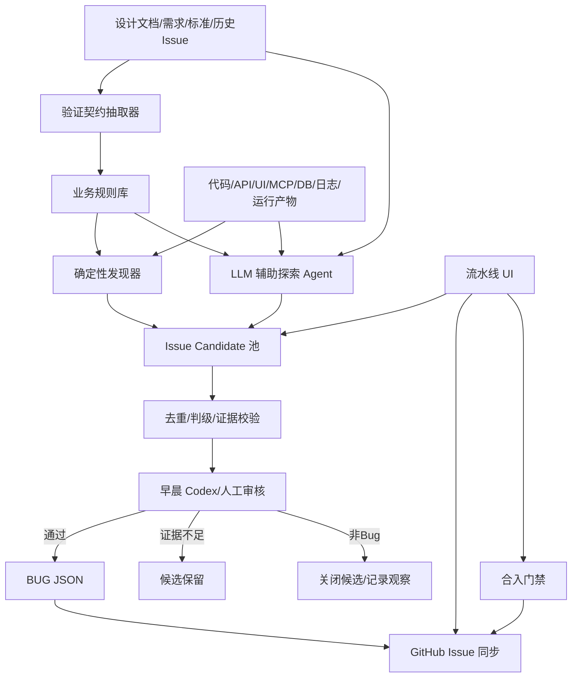
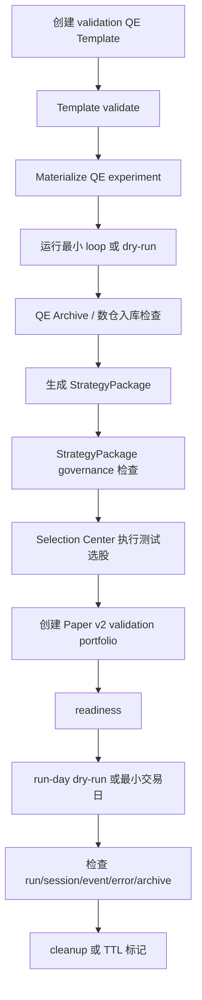
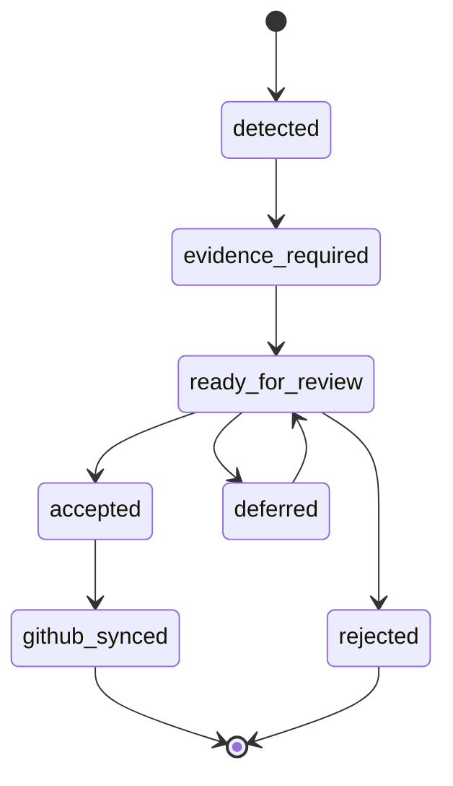
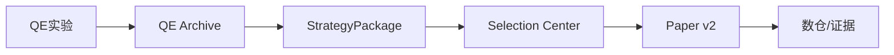

# AIstock 主动质量发现平台完整设计方案

状态：设计草案  
日期：2026-05-20  
分支：`docs/active-bug-discovery-design-20260520`  
工作区：`F:\Dev\AIstock_worktrees\active-bug-discovery-design-20260520`  
范围：设计主动发现 Bug、候选 Issue、LLM 辅助探索、生产库验证任务、QE 到 Paper v2 全链路探针；本文仅设计，不实现代码，不触碰生产服务或生产 DB。

## 1. 执行结论

当前 AIstock 流水线中心已经具备测试计划目录、模块质量、受控 nox runner、GitHub Issue 同步、BUG JSON registry、UI route catalog、资源策略草案等基础能力，但核心定位仍然偏向“合入前验证”。它可以回答“这批已知测试是否通过”，但不能稳定回答“系统里还有哪些未知 Bug”。

本设计建议将流水线升级为“主动质量发现平台”：

1. **确定性发现器是主体**：业务规则扫描、UI 功能覆盖扫描、API/MCP/前端对齐扫描、端到端业务探针、日志异常发现、数据一致性检查必须先建立，确保即使没有 LLM 也能发现大量真实问题。
2. **LLM Agent 只是辅助探索层**：DeepSeek、GLM 5.1 或其他 LLM 可用于理解设计文档、生成探索场景、发现跨模块疑点、整理候选问题，但不得直接把问题升级为正式 GitHub Issue。
3. **设计文档必须成为测试 Oracle**：每个高风险功能要从设计文档抽取验证契约，明确业务规则、UI 要求、API 要求、异常场景和 Issue 严重级别。
4. **先进入 Issue Candidate，再每日审核**：夜间自动发现的问题先进入候选池，第二天早上由 Codex/人工严格审核。只有证据充分、可复现、去重完成、严重级别明确的问题，才能创建或重开 GitHub Issue，并同步本地 BUG JSON。
5. **允许生产库内创建可清理验证任务**：QE 实验、数仓入库、策略包、Paper v2 测试组合等复杂流程可在生产库中创建带 `validation_run_id`、`is_validation=true`、TTL 和 cleanup policy 的验证资源，定期人工或自动清理。
6. **最高价值探针是全业务链路**：QE 模板/实验 -> QE Archive/数仓 -> StrategyPackage -> Selection Center -> Paper v2 portfolio/readiness/run-day 的最小闭环探针，是发现真实业务断点的核心能力。

## 2. 背景与问题定义

### 2.1 当前流水线能做什么

现有基础主要来自以下文件和能力：

- `docs/architecture/validation_center_phase1_backend_design_20260515.md`：流水线中心一期页面、Issue 修复流程、合入门禁、模块质量展示设计。
- `docs/architecture/validation_platform_p0p1_hardening_design_20260519.md`：平台健康、目录一致性、Nightly/Runner、失败转 BUG 的 P0/P1 加固设计。
- `docs/architecture/validation_test_plan_resource_policy_design_20260519.md`：测试计划资源策略、生产相邻验证资源、cleanup policy 设计。
- `tests/aistock_validation/catalog/test_plans.yaml`：现有测试计划目录。
- `tests/aistock_validation/catalog/ui_targets.yaml`：UI route 与模块/测试计划映射目录。
- `tests/aistock_validation/catalog/resource_policies.yaml`：验证资源隔离策略草案。
- `tests/aistock_validation/bugs/README.md`：BUG JSON schema、GitHub 同步要求、Issue 生命周期规范。
- `scripts/validation_failure_event_to_bug.py`：失败事件转 BUG JSON/GitHub 同步的基础脚本。
- `scripts/aistock_mcp_server.py`：Validation MCP 的 BUG、GitHub Issue、受控 runner、模块质量查询能力。

这些能力让流水线可以：

- 执行已登记测试计划；
- 展示模块质量和部分覆盖率；
- 展示 GitHub Issue/PR/分支等状态；
- 通过 MCP 启动受控 runner；
- 通过 BUG JSON 和 GitHub Issue 做修复闭环；
- 对目录、runner、端口、GitHub 同步做基础治理。

### 2.2 当前不能做什么

当前缺口集中在“主动发现”而不是“执行测试”：

| 缺口 | 表现 | 影响 |
|---|---|---|
| 缺业务 Oracle | 测试不知道正确业务行为是什么 | QE 固定 PIT、HMM/ST PIT 边界、策略包语义等问题无法自动发现 |
| 缺 UI 功能覆盖发现 | 页面能打开不代表功能已实现 | 后端/MCP 有功能但 UI 无入口、无按钮、无状态展示 |
| 缺跨模块探针 | 只测单模块，不走完整业务 | QE 到策略包到选股到 Paper v2 的真实断点无法暴露 |
| 缺日志异常闭环 | 500/MCP 错误依赖人工贴日志 | 后端错误不会自动变成候选 Issue |
| 缺数据一致性发现 | 状态机和数仓对账不系统 | task completed 但 archive 缺失、session failed 但 run running 等问题漏检 |
| 缺独立 QA 角色 | 修复者自测容易漏问题 | PR #102 类误关闭 Issue 难以及时发现 |
| 缺候选 Issue 审核池 | 自动建 Issue 容易误报，本地草稿又易漂移 | GitHub 和本地 BUG 状态不稳定 |

## 3. 设计目标与非目标

### 3.1 目标

1. 建立 AIstock 主动发现 Bug 的平台能力，而不是只做合入前验证。
2. 将“设计文档 -> 验证契约 -> 发现器 -> 证据 -> Issue Candidate -> 审核 -> GitHub Issue”的流程标准化。
3. 通过确定性发现器稳定发现业务规则违背、UI 缺功能、API/MCP/前端不一致、运行时异常和数据一致性问题。
4. 使用 LLM Agent 辅助发现设计实现不一致和跨模块隐藏问题，但保留严格审核和证据门槛。
5. 支持夜间自动探测、早晨集中审核、正式 Issue 同步 GitHub 和 BUG JSON。
6. 支持在生产库中创建可标记、可追溯、可清理的验证任务，逐步走通 QE/Paper/策略包全链路。
7. 在流水线 UI 中清晰区分“合入门禁”和“主动发现”。

### 3.2 非目标

1. 不让 LLM 直接创建正式 P0/P1 Issue。
2. 不让 LLM 自动关闭 Issue 或修改 Issue 严重级别。
3. 不允许任意 shell 从 UI 执行；所有执行必须通过 test_plans allowlist 或专门 discovery runner allowlist。
4. 不默认在 PR CI 中运行长耗时 QE/训练/生产库写入任务。
5. 不把测试任务混入真实业务统计、正式排行榜、正式收益评估。
6. 不替代人工对模型效果、投资价值、策略上线决策的判断。

## 4. 核心原则

1. **确定性优先**：能用规则、API、Playwright、DB 查询、日志 fingerprint 确认的问题，不依赖 LLM 判断。
2. **LLM 只做辅助**：LLM 提供探索方向、场景生成、设计理解和候选整理，不作为最终裁判。
3. **设计即契约**：高风险设计文档必须被转为验证契约；没有契约就不能要求流水线准确判断业务正确性。
4. **证据先于 Issue**：没有证据、复现或明确业务规则的问题，只能保留为候选观察。
5. **发现与修复分离**：发现问题的 QA Agent 不负责修复同一问题，避免自研自验盲区。
6. **生产相邻写入必须可回收**：所有测试资源必须有 namespace、TTL、cleanup、owner、run_id。
7. **正式 Issue 必须双写一致**：进入正式流程的问题必须 GitHub Issue 和本地 BUG JSON 同步，不允许新本地 BUG 长期无 GitHub 链接。
8. **夜间发现不等于合入阻断**：合入门禁只阻断高置信、已确认、影响当前变更的 P0/P1；探索发现先进入审核池。

## 5. 总体架构



## 6. 确定性发现器设计

确定性发现器是平台主体，必须先于 LLM 建立。所有发现器输出统一的 `IssueCandidate`。

### 6.1 业务规则扫描器

#### 6.1.1 职责

将明确业务规则写成可执行检查，发现违反设计和标准的实现。

#### 6.1.2 首批规则建议

| rule_id | 模块 | 严重级别 | 检查内容 |
|---|---|---|---|
| `QE-BT-001` | QE | P1 | QE 回测必须使用固定 PIT 股票池，不得默认依赖最新 PIT 股票池 |
| `QE-BT-002` | QE | P1 | QE 模板物化前必须 preflight 检查 stock pool、因子、模型、节点状态 |
| `SP-BOUNDARY-001` | StrategyPackage | P0 | StrategyPackage 不得保存 HMM/ST PIT/event-signal 平台 runtime 状态 |
| `SP-BOUNDARY-002` | StrategyPackage | P0 | runtime variant 不得接纳 HMM/ST PIT 平台能力作为 package-bound state |
| `PAPER-STPIT-001` | Paper v2 | P0 | `st_pit_authoritative=true` 时必须启用 `runtime_profile.risk_policy.enabled=true` |
| `PAPER-HMM-001` | Paper v2 | P1 | HMM 启用时必须显式确定 coefficient artifact 或持久化后端解析结果 |
| `VALIDATION-GH-001` | Validation | P0 | 新 BUG JSON 必须同步 GitHub Issue，不能提交 local-only BUG |
| `ISSUE-CLOSE-001` | Validation | P1 | PR 自动关闭 Issue 后必须有独立 QA 复核记录 |
| `UI-COVERAGE-001` | Frontend | P1 | 高风险后端/MCP 功能必须在 UI route、按钮、状态或详情页中有入口 |
| `DW-LINEAGE-001` | QE Archive | P1 | QE/Paper 关键运行结果必须有数仓 lineage 和 archive status |

#### 6.1.3 输入

- 设计文档验证契约。
- 源代码搜索结果。
- OpenAPI schema。
- MCP tool list。
- UI route catalog。
- BUG/Issue 状态。

#### 6.1.4 输出

每条命中输出：

```json
{
  "detector_id": "business_rule_scanner",
  "rule_id": "PAPER-STPIT-001",
  "candidate_id": "ic_20260520_paper_stpit_001",
  "module": "paper_v2",
  "severity_suggested": "P0",
  "confidence": 0.92,
  "evidence": [
    {"kind": "file", "uri": "frontend/src/app/paper-v2/selection/page.tsx", "line": 212},
    {"kind": "file", "uri": "backend/services/selection_center/package_health.py", "line": 188}
  ],
  "reproduce_command": "rg -n \"st_pit_authoritative|risk_policy.enabled\" ...",
  "issue_action_suggested": "reopen_or_comment"
}
```

### 6.2 UI 功能覆盖扫描器

#### 6.2.1 职责

发现“后端/API/MCP 已实现，但 UI 没入口、没按钮、没状态、没错误提示”的问题。

#### 6.2.2 数据源

- `tests/aistock_validation/catalog/ui_targets.yaml`
- 前端路由目录：`frontend/src/app/**/page.tsx`
- 前端 API client：`frontend/src/lib/**`
- 后端 OpenAPI：`/openapi.json`
- MCP tool 定义：`scripts/aistock_mcp_server.py`、`scripts/aistock_qe_experiment_mcp_server.py`、`scripts/aistock_qe_archive_mcp_server.py`
- 设计文档中的 UI 要求

#### 6.2.3 检查项

| 检查项 | 示例 |
|---|---|
| route 存在性 | `ui_targets.yaml` 中 route 是否存在实际页面 |
| 菜单入口 | 高风险 route 是否出现在页面导航或全局导航 |
| 关键操作按钮 | QE 模板是否有 approve/materialize/run，Paper v2 是否有 readiness/run-day |
| 状态展示 | 任务状态、GitHub sync 状态、cleanup 状态是否可见 |
| 错误提示 | 后端错误是否被 UI 展示为可理解信息 |
| API 字段展示 | response 中关键字段是否被页面消费 |
| Playwright ARIA 快照 | 按钮/表格/卡片/警告是否在可访问树中出现 |

#### 6.2.4 发现的问题类型

- UI 完全缺入口。
- 页面有入口但缺按钮。
- 页面调用 API 但不显示错误。
- API 返回字段新增但 UI 不展示。
- MCP 能执行，但流水线页面没有显示能力或状态。

### 6.3 API/MCP/前端对齐扫描器

#### 6.3.1 职责

发现后端 API、MCP 工具、前端调用、测试计划之间的不一致。

#### 6.3.2 检查矩阵

| 来源 A | 来源 B | 发现问题 |
|---|---|---|
| 后端 OpenAPI | 前端 API client | endpoint 未封装、字段不匹配、错误处理缺失 |
| MCP tools | 后端 API | MCP 参数缺失、错误处理缺失、环境变量缺失 |
| MCP tools | UI | MCP 能力没有页面展示或操作入口 |
| test_plans.yaml | noxfile.py | plan 指向不存在 session |
| test_plans.yaml | plan_catalog.py | command_key 未 allowlist |
| ui_targets.yaml | test_plans.yaml | UI route 无测试计划 |

### 6.4 端到端业务探针

#### 6.4.1 职责

通过真实或生产相邻的小规模流程，发现单元测试和 mock UI 无法发现的业务断点。

#### 6.4.2 探针分层

| 层级 | 名称 | 写入范围 | 运行频率 | 目标 |
|---|---|---|---|---|
| L3 | 只读链路探针 | 只读 | 每日/每 PR 可选 | 检查现有对象链路是否完整 |
| L4 | 最小写入探针 | validation namespace | 夜间 | 创建小任务并清理 |
| L5 | 生产相邻长流程探针 | 生产库测试任务 | 每周/手动 | 验证真实训练/回测/策略包/选股闭环 |

#### 6.4.3 QE 到 Paper v2 全链路探针



#### 6.4.4 必须验证的业务断点

- QE 模板能否通过 preflight。
- 固定 PIT 股票池是否存在且与回测期一致。
- QE 实验是否能 materialize。
- 任务失败是否有结构化错误。
- loop 产物是否可归档。
- 数仓是否有 run/trial/model/factor/metric 记录。
- StrategyPackage 是否可生成 manifest。
- StrategyPackage 是否不携带平台 runtime 状态。
- Selection Center 是否可执行选股。
- HMM/ST PIT runtime profile 是否正确。
- Paper v2 是否可创建 validation portfolio。
- readiness/run-day 是否返回可解释状态。
- 所有测试资源是否可追踪和清理。

### 6.5 日志/异常发现器

#### 6.5.1 职责

自动收集后端日志、MCP 错误、API 500、任务失败，将其转成候选 Issue。

#### 6.5.2 输入

- 后端 uvicorn 日志。
- MCP tool 错误返回。
- Validation runner job log。
- GitHub Actions logs。
- QE task logs。
- Paper v2 session/run error 表。

#### 6.5.3 Fingerprint

建议 fingerprint 字段：

```text
module + route/tool + exception_type + top_stack_file + business_object_kind + normalized_message
```

示例：

```text
qe_template_materialize + RuntimeError + stock_pool_sync.py + missing_filtered_pool
```

#### 6.5.4 自动候选策略

- 同一 fingerprint 首次出现：生成候选。
- 同一 fingerprint 连续出现 3 次：提高 confidence。
- 已有 open Issue：追加证据，不新建。
- 已关闭 Issue 再现：标记 `suggested_action=reopen`。

### 6.6 数据一致性发现器

#### 6.6.1 职责

发现状态机、数仓、业务对象之间的不一致。

#### 6.6.2 首批检查

| 检查 | 示例 |
|---|---|
| QE 状态对账 | experiment completed 但 archive 缺失 |
| Paper v2 状态对账 | session failed 但 run running |
| StrategyPackage 对账 | package enabled 但 manifest/artifact 缺失 |
| GitHub/BUG 对账 | GitHub closed 但 BUG JSON open，或 BUG JSON 缺 GitHub link |
| UI/API 对账 | API 有 open issue 但 UI 显示 0 |
| cleanup 对账 | TTL 过期 validation resource 未清理 |

## 7. LLM 辅助探索层设计

### 7.1 定位

LLM Agent 是探索增强层，不是最终判定层。

推荐使用场景：

- 读取设计文档并抽取验证契约草案。
- 分析“设计要求”和“当前实现”是否一致。
- 发现跨模块语义冲突。
- 为端到端探针生成测试 charter。
- 对候选 Issue 进行去重和严重级别建议。
- 生成早晨审核报告。

禁止使用场景：

- 直接创建正式 P0/P1 Issue。
- 直接关闭或降级 Issue。
- 直接修改生产数据。
- 直接合入代码。
- 没有证据时断言 Bug。

### 7.2 模型选择

| 模型/Agent | 建议用途 |
|---|---|
| DeepSeek | 代码/设计一致性扫描、长文档抽取、候选问题初筛 |
| GLM 5.1 | 中文业务规则理解、跨模块流程推理、报告生成 |
| Codex | 严格审核、证据复核、Issue 创建、代码级定位 |
| Claude/Paper v2 窗口 | Paper v2 具体修复实现 |

### 7.3 LLM 输入包

每晚生成 `DiscoveryContextPack`：

```json
{
  "schema_version": "aistock_discovery_context_pack_v1",
  "run_id": "disc_20260521_nightly",
  "commit": "...",
  "changed_files": [],
  "design_docs": [],
  "open_bugs": [],
  "recent_closed_issues": [],
  "test_plan_catalog": "tests/aistock_validation/catalog/test_plans.yaml",
  "ui_targets": "tests/aistock_validation/catalog/ui_targets.yaml",
  "logs_excerpt_paths": [],
  "known_business_rules": []
}
```

### 7.4 LLM 输出包

LLM 只能输出 `IssueCandidateDraft`：

```json
{
  "schema_version": "aistock_issue_candidate_draft_v1",
  "candidate_title": "Paper v2 run-console 未继承 HMM coefficient artifact",
  "module": "paper_v2",
  "severity_suggested": "P1",
  "confidence": 0.74,
  "design_rule_refs": [],
  "evidence_refs": [],
  "reproduce_suggestion": "...",
  "requires_deterministic_verification": true,
  "suggested_next_probe": "run rg + Playwright + API payload capture"
}
```

LLM 输出必须经过确定性验证器补证据后才能进入正式候选池。

## 8. 设计文档到验证契约

### 8.1 验证契约 Schema

新增目录建议：

```text
tests/aistock_validation/contracts/
  paper_v2_runtime_contract.yaml
  qe_backtest_contract.yaml
  strategy_package_boundary_contract.yaml
  validation_github_issue_contract.yaml
```

示例：

```yaml
schema_version: aistock_validation_contract_v1
contract_id: paper_v2_hmm_runtime_coefficients
module: paper_v2
source_docs:
  - docs/architecture/paper_trading_v2_runtime_profile_execution_policy_design.md
  - docs/architecture/paper_v2_qe_candidate_strategy_warehouse_design_20260512.md
business_rules:
  - rule_id: PAPER-HMM-001
    severity: P1
    statement: HMM 启用时必须明确 coefficient artifact，不能在多个 artifact 覆盖同一 trade_date 时静默自动选择。
    deterministic_checks:
      - kind: code_search
        pattern: coefficients_path
      - kind: api_payload
        route: /api/v1/paper-v2/*
      - kind: playwright
        route: /paper-v2/portfolios/*/run-console
ui_requirements:
  - route: /paper-v2/portfolios
    required_controls: [hmm_snapshot_selector, hmm_coefficients_selector]
  - route: /paper-v2/portfolios/{portfolioId}/run-console
    required_controls: [runtime_hmm_coefficients_path]
issue_policy:
  auto_candidate: true
  auto_github_issue: false
  morning_review_required: true
```

### 8.2 契约生成方式

1. 手工为 P0/P1 规则编写契约。
2. LLM 从设计文档生成契约草案。
3. Codex 审核契约草案。
4. 契约进入 repository 后由确定性发现器执行。

### 8.3 契约有效性

契约应与设计文档版本绑定：

- `source_doc_path`
- `source_doc_commit`
- `last_reviewed_at`
- `review_owner`
- `supersedes`
- `deprecated_at`

## 9. Issue Candidate 机制

### 9.1 Candidate 状态机



### 9.2 Candidate Schema

建议新增目录：

```text
tests/aistock_validation/issue_candidates/
```

Schema：

```json
{
  "schema_version": "aistock_issue_candidate_v1",
  "candidate_id": "ic_20260521_001",
  "status": "ready_for_review",
  "title": "...",
  "module": "paper_v2",
  "severity_suggested": "P1",
  "confidence": 0.86,
  "detectors": ["business_rule_scanner", "llm_design_reviewer"],
  "business_rules": ["PAPER-HMM-001"],
  "evidence": [
    {"kind": "file", "uri": "...", "line": 123},
    {"kind": "api_response", "uri": "tmp/validation/discovery/.../response.json"},
    {"kind": "log_excerpt", "uri": "tmp/validation/discovery/.../error.log"}
  ],
  "reproduce_command": "...",
  "dedupe": {
    "fingerprint": "...",
    "existing_bug_id": null,
    "existing_github_issue": null
  },
  "review": {
    "morning_review_required": true,
    "reviewer": null,
    "decision": null,
    "decision_reason": null
  },
  "promotion": {
    "bug_id": null,
    "github_issue_number": null,
    "github_issue_url": null
  }
}
```

### 9.3 正式 Issue 晋级标准

必须全部满足：

1. 有明确业务规则、设计文档或用户确认作为依据。
2. 有确定性证据：文件、API、日志、截图、DB 查询、MCP 响应之一。
3. 有复现命令或复现步骤。
4. 已与现有 BUG JSON 和 GitHub Issue 去重。
5. 严重级别可解释。
6. 有模块 owner 或修复窗口归属。
7. P0/P1 经过早晨 Codex/人工审核。

### 9.4 自动动作策略

| 置信度 | 严重级别 | 动作 |
|---|---|---|
| >= 0.9 | P0/P1 | 进入 `ready_for_review`，早晨优先审核 |
| >= 0.8 | P2/P3 | 可自动创建候选，人工批量审核 |
| 0.5-0.8 | 任意 | 保留候选，等待补证据 |
| < 0.5 | 任意 | 只记录观察，不进入候选池 |

正式 GitHub Issue 默认不自动创建，除非未来明确开启 `auto_github_issue_for_high_confidence=true`，且仅允许 P2/P3 或经过审核的 P0/P1。

## 10. 早晨审核流程

### 10.1 审核输入

每天早上生成：

```text
tmp/validation/discovery/YYYYMMDD/morning_review.md
```

内容包括：

- 新候选总数。
- 按 P0/P1/P2/P3 分组。
- 高置信候选。
- 疑似重复候选。
- 建议重开 Issue。
- 证据不足候选。
- 需要人工判断的业务问题。

### 10.2 审核结论

每个候选只能有以下结论：

| 结论 | 动作 |
|---|---|
| `accept_new_issue` | 创建 BUG JSON + GitHub Issue |
| `accept_reopen_issue` | 重开现有 GitHub Issue，更新 BUG JSON |
| `comment_existing_issue` | 给现有 Issue 追加证据 |
| `need_more_evidence` | 保留候选，补探针 |
| `not_a_bug` | 关闭候选 |
| `design_question` | 转为设计确认，不建 Bug |

### 10.3 审核责任

- LLM Agent：生成候选。
- 确定性发现器：提供证据。
- Codex/人工：审核是否进入正式 Issue。
- Paper v2/QE 等模块窗口：按 Issue 修复。
- 独立 QA：修复后复验。

## 11. 生产库验证任务策略

### 11.1 允许策略

生产库可以创建测试任务，但必须满足：

- 明确 `is_validation=true`。
- 必须有 `validation_run_id`。
- 必须有 `test_tag`。
- 必须有 `created_by=validation_agent`。
- 必须有 TTL 或 cleanup policy。
- 不参与正式排行榜、正式收益统计、正式选股推荐。
- 不触发真实交易或真实 MiniQMT 下单。
- 可通过统一查询找到并清理。

### 11.2 标准字段

建议所有验证资源统一携带：

```json
{
  "validation_run_id": "vad_20260521_qe_e2e_001",
  "is_validation": true,
  "test_tag": "active_discovery_qe_to_paper_v2",
  "created_by": "validation_agent",
  "created_at": "2026-05-21T01:00:00+08:00",
  "ttl_hours": 72,
  "cleanup_after": "2026-05-24T01:00:00+08:00",
  "business_scope": "validation",
  "linked_issue_candidate_id": null
}
```

### 11.3 资源类型

| 资源 | 允许创建 | 清理策略 |
|---|---|---|
| QE template | 允许 | 按 validation_run_id 删除或标记 archived |
| QE experiment/task | 允许小样本 | 保留 evidence，清理 workspace |
| QE archive 记录 | 允许标记 validation | 可保留用于质量追踪，需排除正式 leaderboard |
| StrategyPackage | 允许 validation package | 标记 `validation`，不得 paper/live enabled |
| Selection run | 允许 | TTL 清理或保留 evidence |
| Paper portfolio | 允许 validation portfolio | 停止 session 后清理 |
| Paper orders/fills | 仅模拟 | 不触发真实交易，TTL 清理 |
| 文件 artifact | 允许 tmp/validation | 按 retention 清理 |

### 11.4 Cleanup Runner

新增建议计划：

```yaml
plan_key: validation_resource_cleanup
module: validation.active_discovery
level: L2
resource_policy:
  resource_mode: prod_approved_write
  cleanup_required: true
runtime_policy:
  manual_approval_required: false
  runner_enabled_allowed: true
```

注意：cleanup 对 validation namespace 的删除是平台维护动作，不等同业务写入，但仍必须审计。

## 12. QE / 训练 / 回测验证设计

### 12.1 验证分层

| 层级 | 目标 | 例子 |
|---|---|---|
| 任务层 | 任务能创建、启动、完成/失败且状态明确 | QE template materialize、custom evo run |
| 产物层 | 模型、metrics、预测、workspace、archive 产物存在 | model.pkl、metrics.json、trial record |
| 业务层 | 数据范围、PIT、回测窗口、无未来函数符合设计 | 固定 PIT 股票池、截至 4 月底回测 |
| 下游层 | 产物可被策略包/选股/Paper v2 消费 | StrategyPackage、Selection run、portfolio readiness |

### 12.2 QE 小样本探针参数

建议首版只做最小资源：

- 固定 validation stock pool。
- 固定回测时间窗口。
- 1 个 loop。
- 1 个 seed。
- 少量股票。
- 小模型或 dry-run 模式。
- 明确 artifact size 上限。

### 12.3 QE 探针成功条件

- Template validate 通过。
- Materialize 通过。
- Experiment/task 状态可追踪。
- 若执行训练/回测，必须有 metrics 和 artifact。
- Archive 出现对应 validation_run_id。
- StrategyPackage 可从该实验生成。
- StrategyPackage manifest 通过边界扫描。
- Selection Center 可消费。
- 失败时自动生成 Issue Candidate。

### 12.4 回测固定数据规则

强制规则：

1. 回测使用固定 PIT 股票池或固定 validation stock pool。
2. 回测日期不得默认使用当前最新日期。
3. 回测和实盘/实时选股必须使用不同 runtime profile。
4. 实验配置中必须记录 stock_pool_path、stock_pool_digest、as_of_date、backtest_end_date。
5. materialize 前必须 preflight 检查文件存在、digest 匹配、日期范围符合设计。

## 13. API 与后端设计建议

### 13.1 新增服务

```text
backend/services/validation/active_discovery/
  contracts.py
  candidate_store.py
  detector_registry.py
  business_rule_scanner.py
  ui_coverage_scanner.py
  api_mcp_alignment_scanner.py
  log_exception_scanner.py
  data_consistency_scanner.py
  e2e_probe_runner.py
  llm_agent_gateway.py
  morning_review.py
  cleanup.py
```

### 13.2 新增 API

```text
GET  /api/v1/validation/discovery/summary
GET  /api/v1/validation/discovery/candidates
GET  /api/v1/validation/discovery/candidates/{candidate_id}
POST /api/v1/validation/discovery/candidates/{candidate_id}/review
POST /api/v1/validation/discovery/candidates/{candidate_id}/promote
POST /api/v1/validation/discovery/run
GET  /api/v1/validation/discovery/runs
GET  /api/v1/validation/discovery/contracts
GET  /api/v1/validation/discovery/rules
GET  /api/v1/validation/discovery/resources
POST /api/v1/validation/discovery/resources/cleanup
```

### 13.3 新增 MCP 工具

```text
validation_discovery_list_candidates
validation_discovery_get_candidate
validation_discovery_run_detector
validation_discovery_review_candidate
validation_discovery_promote_candidate_to_issue
validation_discovery_run_e2e_probe
validation_discovery_cleanup_resources
validation_discovery_generate_morning_review
```

MCP 限制：

- `promote_candidate_to_issue` 必须要求 `confirm_promote`。
- P0/P1 promotion 必须要求 reviewer 和 evidence checklist。
- L4/L5 e2e probe 默认不可由普通 UI 启动，需 allowlist 和 resource policy。

## 14. 前端 UI 设计

在现有流水线中心顶部导航中新增或扩展两个页面。

### 14.1 主动发现页面

顶部卡片：

- 今日候选数。
- P0/P1 待审核数。
- 高置信候选数。
- 建议重开 Issue 数。
- 证据不足候选数。
- 夜间探针运行状态。
- cleanup 逾期资源数。

列表维度：

- 候选 ID。
- 模块。
- 来源 detector。
- 严重级别建议。
- 置信度。
- 证据完整度。
- 去重结果。
- 推荐动作。
- 审核状态。

详情页：

- 设计规则。
- 证据链。
- 复现命令。
- 日志/截图/API 响应。
- LLM 分析摘要。
- 确定性验证结果。
- 审核按钮：接受、追加证据、重开、拒绝、设计确认。

### 14.2 业务探针页面

卡片：

- QE -> Archive -> StrategyPackage -> Selection -> Paper v2 全链路状态。
- 最近探针 run。
- 各步骤耗时。
- 创建资源数量。
- cleanup 状态。
- 失败 fingerprint。

流程图：



颜色规则：

- 绿色：通过。
- 黄色：警告或候选问题。
- 红色：已确认 P0/P1。
- 灰色：未运行或不可判断。

## 15. 与合入门禁的关系

主动发现和合入门禁必须分离。

| 类型 | 运行时机 | 是否阻断合入 |
|---|---|---|
| L0/L1 快速门禁 | PR/本地提交前 | 是，确定性失败阻断 |
| L2 模块测试 | PR/变更触发 | 是，触达模块失败阻断 |
| L3 UI/API smoke | PR 可选/nightly | 高风险失败可阻断 |
| 主动发现候选 | nightly | 默认不阻断 |
| 已审核 P0/P1 Issue | 任何时间 | 影响当前变更或主链路时阻断 |
| L4/L5 业务探针 | nightly/手动 | 不直接阻断 PR，但进入风险看板 |

## 16. 数据存储建议

### 16.1 文件优先，后续可入库

第一阶段使用文件存储：

```text
tests/aistock_validation/contracts/*.yaml
tests/aistock_validation/discovery_rules/*.yaml
tests/aistock_validation/issue_candidates/*.json
tests/aistock_validation/history/discovery/YYYYMMDD/*.md
tmp/validation/discovery/<run_id>/*
```

后续可增加 DB 表，但第一阶段不依赖新 schema，降低开发风险。

### 16.2 Evidence Manifest

每次 discovery run 生成：

```json
{
  "schema_version": "aistock_discovery_evidence_manifest_v1",
  "discovery_run_id": "disc_20260521_nightly",
  "commit": "...",
  "detectors": [],
  "candidates": [],
  "artifacts": [],
  "resources_created": [],
  "cleanup_required": []
}
```

## 17. 安全与权限边界

1. 所有生产相邻写入必须通过 validation resource policy。
2. 所有 L4/L5 探针必须写 evidence manifest。
3. 所有测试资源必须可按 validation_run_id 查询。
4. 所有 cleanup 必须生成审计记录。
5. UI 不允许任意 shell。
6. LLM 不接收 token、SSH key、DB 密码原文。
7. GitHub Issue 创建使用既有 MCP/GitHub sync 路径，不在 LLM 环境暴露 token。
8. P0/P1 正式 Issue 必须人审或 Codex 审核。

## 18. 分阶段开发计划

### 阶段 0：设计与契约基线，2-3 天

产出：

- 本设计文档。
- 首批 validation contracts 草案。
- Issue Candidate schema。
- 主动发现 UI 信息架构。
- QE/Paper 全链路探针 runbook。

验收：

- 文档通过 review。
- 明确第一阶段不直接运行生产写入。
- 确定 P0/P1 首批规则。

### 阶段 1：确定性发现器 MVP，5-8 天

实现：

- `IssueCandidateStore`。
- 业务规则扫描器。
- UI 功能覆盖扫描器。
- API/MCP/前端对齐扫描器。
- GitHub/BUG 去重查询。
- Morning review Markdown。

验收：

- 能发现至少 5 类历史已知问题模式。
- 能生成候选而非直接创建 Issue。
- 能从候选晋级为 BUG JSON + GitHub Issue。

### 阶段 2：日志异常与数据一致性，1-2 周

实现：

- 日志/500/MCP 错误 fingerprint。
- Validation failure event 接入 candidate。
- QE/Paper/BUG/GitHub 数据一致性扫描。
- 流水线 UI 主动发现页面。

验收：

- 后端 500 可以生成候选。
- BUG JSON/GitHub 状态不一致可被发现。
- Paper session/run 状态不一致可被发现。

### 阶段 3：LLM 辅助探索，1-2 周

实现：

- LLM context pack。
- DeepSeek/GLM Agent adapter。
- LLM 输出 draft candidate。
- 确定性补证据流程。
- 每日审核包。

验收：

- LLM 只能创建 draft candidate。
- 高风险候选必须经过确定性证据补齐。
- Morning review 可展示 LLM 建议和确定性证据差异。

### 阶段 4：QE/Paper 全链路最小探针，2-3 周

实现：

- validation QE template。
- QE materialize/run 最小流程。
- QE archive 检查。
- StrategyPackage 生成检查。
- Selection Center 选股。
- Paper v2 validation portfolio/readiness/run-day。
- validation resource cleanup。

验收：

- 能完整走通最小链路，或失败时生成候选 Issue。
- 所有资源带 validation_run_id。
- cleanup 可查询、可执行、可审计。

### 阶段 5：Nightly 自动化与门禁联动，1-2 周

实现：

- nightly discovery job。
- UI 趋势图。
- 已审核 P0/P1 与合入门禁联动。
- 历史发现率统计。

验收：

- 每天自动生成 morning review。
- 已审核 P0/P1 可影响合入门禁。
- 未审核候选不直接阻断 PR。

## 19. 首批落地规则清单

建议第一批实现以下规则，全部来自近期真实问题：

1. `VALIDATION-GH-001`：新 BUG JSON 必须同步 GitHub。
2. `PAPER-STPIT-001`：ST PIT authoritative 必须启用 runtime risk policy。
3. `PAPER-HMM-001`：Paper v2 HMM 必须明确 coefficient artifact。
4. `SP-BOUNDARY-001`：StrategyPackage 不得保存 HMM/ST PIT 平台状态。
5. `QE-BT-001`：QE 回测不得默认使用最新 PIT 股票池。
6. `QE-PREFLIGHT-001`：QE template materialize 前必须 preflight stock pool 和 artifact。
7. `UI-COVERAGE-001`：MCP/API 高风险能力必须有 UI 入口或明确非 UI 说明。
8. `ISSUE-CLOSE-001`：PR 自动关闭后必须有独立 QA 复核。

## 20. 风险与缓解

| 风险 | 缓解 |
|---|---|
| LLM 误报过多 | 只进入候选，正式 Issue 需审核 |
| 生产库测试污染 | validation_run_id + TTL + cleanup + dashboard |
| 探针耗时过长 | 分 L3/L4/L5，nightly/weekly 调度 |
| 规则过硬影响效率 | 候选发现和合入门禁分离 |
| 设计文档过期 | contract 绑定 source_doc_commit 和 review 状态 |
| GitHub 同步失败 | candidate 不晋级，BUG JSON 不提交 main |
| 清理误删正式数据 | 只清理 `is_validation=true` 且 namespace 匹配资源 |

## 21. 验收标准

### 21.1 平台能力验收

- 能运行确定性发现器并生成候选。
- 能运行 LLM draft 但不直接建 Issue。
- 能生成 morning review。
- 能将审核通过候选晋级为 BUG JSON + GitHub Issue。
- 能在 UI 展示候选、证据、审核状态、GitHub 同步状态。

### 21.2 业务能力验收

- 能发现至少一个 UI 功能覆盖缺失候选。
- 能发现至少一个设计实现不一致候选。
- 能发现至少一个 BUG/GitHub 状态不一致候选。
- 能运行一次只读 QE/Paper 链路检查。
- 能运行一次 validation resource cleanup dry-run。

### 21.3 安全验收

- 不触碰生产端口 `8001`/`3000`，除非显式授权。
- L4/L5 写入任务默认不在 PR CI 运行。
- 生产库测试资源全部可按 validation_run_id 查询。
- cleanup 只处理 validation namespace。

## 22. 后续建议

建议下一步按阶段 0 完成以下文件：

```text
tests/aistock_validation/contracts/strategy_package_boundary_contract.yaml
tests/aistock_validation/contracts/paper_v2_runtime_contract.yaml
tests/aistock_validation/contracts/qe_backtest_validation_contract.yaml
tests/aistock_validation/discovery_rules/active_discovery_rules_v1.yaml
docs/operations/validation_active_discovery_morning_review_runbook_20260520.md
```

随后进入阶段 1 开发。阶段 1 不需要直接跑生产库写入，只实现候选池、规则扫描、UI 覆盖扫描和 morning review，先把“能发现问题并受控进入审核”的闭环建立起来。
