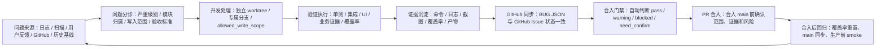

# AIstock 流水线中心一期增强设计方案：Issue 修复流程、合入门禁与卡片化页面

日期：2026-05-15
状态：设计草案，已纳入 Issue 修复并行开发规范与合入门禁设计
范围：一期实现“流水线中心卡片化页面 + Issue 修复流程可视化 + 合入门禁只读裁决 + 可展开详情”。二期工程健康驾驶舱仍暂不实现，不引入图数据库。

参考规范：

- `docs/standards/aistock_issue_fix_parallel_workflow_standard_20260514.md`
- `docs/architecture/github_issues_integration_design_20260512.md`

## 1. 本次更新结论

原方案已经覆盖“按页面分卡片展示不同内容”和“点击展开详情”的基础能力，但从完整业务流程看，还需要把 Issue 修复规范、并行开发隔离、验证证据、合入门禁和生产同步边界纳入流水线中心。

本次更新后的核心原则是：

1. 流水线中心不仅展示状态，还要指导 Issue 从发现、分诊、修复、验证、PR、合入、生产同步的完整流程。
2. 合入门禁必须准确，但不能过度阻塞开发效率；门禁应按变更影响范围、严重级别、模块归属和证据完整性动态裁决。
3. 历史基线问题不应默认阻塞每次合入；新增问题、恶化问题、触达模块的阻塞问题才应成为硬阻塞。
4. 覆盖率必须按模块和提交绑定；只有触达模块的过期覆盖率才进入合入门禁硬判断，未触达模块作为提示或风险背景。
5. 所有高风险动作默认只读或 dry-run；合并 main、生产 checkout 同步、`8001/3000` 重启、生产 DB 写入必须由用户明确授权。

## 2. 完整业务流程

流水线中心应围绕下面的业务闭环设计，而不是只展示孤立页面。



一期需要先把这个闭环的数据结构、只读接口和页面可视化做出来；动作执行可以逐步开放。

## 3. 页面分类与导航结构

AIstock 已有全局左侧导航，流水线中心内部导航必须放在页面顶部。建议一期顶部页签如下：

| 页面 | 页面定位 | 一期后端目标 |
| --- | --- | --- |
| 总览 | 只显示关键卡片和跳转入口 | 汇总各页面健康状态、风险分、门禁结论和入口路由 |
| 合入门禁 | 回答“当前分支是否可以合入 main” | 汇总阻塞项、警告项、人工确认项和最小下一步动作 |
| Issue 修复流程 | 按规范展示 Issue 生命周期 | 展示 Open、Triaged、In Progress、Review Ready、Fixed、Verified、Closed 状态和缺失字段 |
| 流水线测试 | 展示各类测试任务状态 | 展示测试命令、最近执行结果、日志、覆盖率产物和失败原因 |
| 功能验证 | 按菜单/路由展示功能验证 | 展示接口证明、页面冒烟、业务证据和缺失项 |
| 模块质量 | 按模块独立展示质量状态 | 展示每个模块覆盖率、覆盖率有效性、Issue、分支、PR、未提交文件 |
| GitHub 议题 | 展示本地 BUG 与 GitHub Issue 同步状态 | 展示链接缺口、远端状态、本地状态、下一步同步建议 |
| 分支与 PR | 展示本地和远端分支治理 | 展示 ahead/behind、PR 状态、是否已合入、风险动作建议 |
| 历史遗留 | 汇总历史扫描与遗留债务 | 按债务类型聚合，支持展开 child BUG 计划与修复验证命令 |
| MCP 自动化 | 展示自动化闭环能力 | 展示 gh、token、MCP 工具、dry-run、最近同步元数据，不泄露密钥 |

总览页建议突出三个最关键卡片：

- 当前分支合入门禁。
- 高风险 Issue 修复流程状态。
- 触达模块质量状态。

## 4. 非目标

一期明确不做以下事情：

- 不引入图数据库。
- 不实现二期工程健康驾驶舱、架构流程图节点染色、全局模块依赖图。
- 不默认执行写操作。
- 不写生产数据库。
- 不自动合并分支、不自动合并 PR、不通过只读接口自动创建 GitHub Issue。
- 不替换已有 Validation Center 接口；优先复用现有接口和服务，再新增聚合层。
- 不把缺失数据伪装成通过状态；缺失即返回明确的不可用状态和原因。
- 不把历史基线问题全部升级为每次合入 main 的硬阻塞。

## 5. 后端设计原则

### 5.1 摘要优先，详情按需加载

所有页面顶部只展示摘要卡片，不在总览页塞入大表格。对象详情通过点击列表项后加载，避免一次接口返回过大数据。

### 5.2 BUG JSON 是 source of truth

本地 BUG JSON 是 Issue 状态、写入范围、验收条件和关闭条件的事实源。GitHub Issue 是工作流镜像和协作 UI，不替代本地 bug registry。

### 5.3 合入门禁按影响范围动态裁决

门禁不能只按全仓库静态状态粗暴拦截，而应基于当前分支 diff、触达模块、Issue 严重级别、覆盖率产物和验证证据动态计算。

核心规则：

- 只阻塞当前变更直接触达的风险。
- 历史基线问题默认不阻塞，但新增、恶化、触达模块 P0/P1 未解决问题必须阻塞或要求人工确认。
- 文档类、测试类、小范围前端文案类变更走快速路径。
- Paper live、QE runtime、DB migration、生产配置、高冲突共享文件走严格路径。

### 5.4 数据不可用不能静默成功

GitHub、覆盖率产物、分支元数据、gh CLI 或 MCP 状态不可用时，接口必须返回 `data_state=unavailable` 或对象级 `state=unknown`，并附带原因码。前端应显示灰色或黄色，不显示为绿色。

### 5.5 合入与生产激活分离

PR 合入 main 不等于生产生效。生产 checkout 同步、`8001/3000` 重启、生产 DB 写入、Paper live session、QMT/miniQMT live 配置修改，都必须作为独立操作显示和授权。

### 5.6 一期为二期预留字段，但不依赖二期

一期接口统一返回以下字段，方便二期工程健康驾驶舱直接复用：

- `domain`
- `health_tone`
- `risk_score`
- `reason_codes`
- `linked_entities`
- `merge_gate_state`
- `workflow_state`

一期不需要返回完整图边，也不需要做图数据库建模。

## 6. 可复用现有数据源

新增后端应优先包装现有服务和文件，不重复实现扫描器。

| 数据类型 | 现有来源 |
| --- | --- |
| BUG 注册表 | `backend/services/validation/finding_store.py`，`tests/aistock_validation/bugs/*.json` |
| Issue 修复规范 | `docs/standards/aistock_issue_fix_parallel_workflow_standard_20260514.md` |
| BUG 摘要 | `GET /api/v1/validation/bugs/summary` |
| finding 摘要 | `GET /api/v1/validation/findings/summary` |
| 模块质量摘要 | `GET /api/v1/validation/modules/quality-summary` |
| 功能菜单验证 | `GET /api/v1/validation/ui-targets`，`GET /api/v1/validation/ui-targets/summary` |
| 工作区状态 | `GET /api/v1/validation/git/workspace-status` |
| 分支状态 | `GET /api/v1/validation/git/branch-status` |
| GitHub Issue 链接 | BUG JSON 中的 `github_issue_number` 与 `github_issue_url` |
| GitHub/MCP 工具 | `scripts/aistock_mcp_server.py`，`scripts/bug_github_sync.py` |
| 历史遗留扫描 | guardrail baseline、历史 finding、BUG 聚合文档 |
| PR/分支元数据 | git、gh CLI、GitHub API；不可用时返回 `data_state=unavailable` |

## 7. 核心数据模型

### 7.1 模块目录模型

模块质量、覆盖率过期和门禁都依赖模块归属目录。建议新增或聚合一个只读模块目录服务。

```json
{
  "module_id": "paper_v2_runtime",
  "display_name": "Paper v2 运行时",
  "domain": "paper",
  "owned_paths": [
    "backend/services/paper_trading_v2/",
    "backend/routers/paper_trading_v2.py"
  ],
  "shared_paths": [
    "backend/services/strategy_package/"
  ],
  "risk_level": "high",
  "default_test_commands": [
    "python -m pytest backend/tests/paper_trading_v2 -q"
  ],
  "coverage_threshold": {
    "line_percent_min": 60,
    "strict_for_merge": true
  },
  "merge_gate_required": true,
  "default_owner": "claude-code"
}
```

要求：

- 一个源码文件必须能映射到主模块。
- 跨模块共享文件必须显式标记为 `shared_paths`。
- 生成文件、历史归档和测试产物不得错误计入源码模块。
- 高冲突文件必须能被门禁识别。

### 7.2 Issue 工作流模型

Issue 工作流模型应吸收规范文档中的字段。

```json
{
  "bug_id": "BUG-039",
  "status": "triaged",
  "workflow_state": "triaged",
  "severity": "P1",
  "module_id": "qe_data_freshness",
  "risk_area": "data_freshness_policy",
  "allowed_write_scope": [
    "backend/services/quantevolver/",
    "backend/tests/quantevolver/"
  ],
  "non_goals": ["不放宽 Paper v2 最新数据 fail-fast 规则"],
  "required_verification": [
    "QE 历史窗口可命中缓存",
    "Paper/Paper v2 最新数据缺失时仍 fail-fast"
  ],
  "closure_requirements": [
    "PR 合入后记录 fix_commit",
    "平台验证通过后标记 verified"
  ],
  "conflict_sensitive_files": ["backend/services/quantevolver/config_composer.py"],
  "assigned_agent": null,
  "fix_branch": null,
  "worktree_path": null,
  "integration_owner": "codex-app",
  "workflow_gate": "triage_only_until_allowed_write_scope_is_set"
}
```

### 7.3 验证证据包模型

每次修复或门禁判断都应绑定证据包，避免“测试通过”无法追溯。

```json
{
  "bundle_id": "evd-20260515-bug039-001",
  "target_type": "bug",
  "target_id": "BUG-039",
  "branch": "bug/BUG-039-qe-data-freshness",
  "commit": "abc1234",
  "commands": [
    "python -m pytest backend/tests/quantevolver -q"
  ],
  "results": [
    {
      "command": "python -m pytest backend/tests/quantevolver -q",
      "status": "passed",
      "duration_seconds": 42,
      "logs_uri": "tests/aistock_validation/history/...md"
    }
  ],
  "coverage_artifacts": [],
  "screenshots": [],
  "data_state": "complete",
  "generated_at": "2026-05-15T00:00:00Z"
}
```

### 7.4 合入门禁模型

门禁模型不直接合并，只返回裁决和原因。

```json
{
  "decision": "blocked",
  "decision_label": "暂不建议合入",
  "target_branch": "main",
  "source_branch": "bug/BUG-039-qe-data-freshness",
  "head_commit": "abc1234",
  "change_class": "runtime_high_risk",
  "blocking_reasons": ["scope_violation", "missing_required_verification"],
  "warnings": ["historical_p2_debt_exists"],
  "manual_confirmations": ["production_restart_needed_after_merge"],
  "required_next_actions": [
    "修正超出 allowed_write_scope 的文件或更新 Issue scope",
    "补齐 required_verification 对应测试记录"
  ],
  "data_state": "complete"
}
```

## 8. 页面与接口设计

### 8.1 总览卡片接口

接口：`GET /api/v1/validation/cards/summary`

用途：为 `/validation-center` 总览页提供卡片入口数据。总览页只展示摘要，不展开大表。

新增要求：总览卡片必须包含合入门禁摘要和 Issue 工作流摘要。

```json
{
  "schema_version": "aistock_validation_cards_v2",
  "generated_at": "2026-05-15T00:00:00Z",
  "repo": {
    "root": "F:/Dev/AIstock",
    "current_branch": "bug/BUG-039-qe-data-freshness",
    "head_commit": "abc1234",
    "origin_main": "1898268"
  },
  "cards": [
    {
      "card_id": "merge_gate",
      "title": "合入门禁",
      "primary_route": "/validation-center/merge-gate",
      "health_tone": "red",
      "risk_score": 86,
      "summary": {
        "decision": "blocked",
        "blocking_count": 2,
        "warning_count": 1,
        "manual_confirm_count": 1
      },
      "reason_codes": ["scope_violation", "missing_required_verification"]
    },
    {
      "card_id": "issue_workflow",
      "title": "Issue 修复流程",
      "primary_route": "/validation-center/issues/workflow",
      "health_tone": "yellow",
      "summary": {
        "open_count": 11,
        "triage_only_count": 3,
        "in_progress_count": 2,
        "review_ready_count": 1,
        "missing_scope_count": 3
      }
    }
  ]
}
```

### 8.2 合入门禁接口

摘要接口：`GET /api/v1/validation/merge-gate/summary?branch=<branch>&target=main`

详情接口：`GET /api/v1/validation/merge-gate/detail?branch=<branch>&target=main`

用途：准确回答“当前分支是否可以合入 main”。该接口只读，不执行 merge。

返回结构示例：

```json
{
  "schema_version": "aistock_merge_gate_v1",
  "generated_at": "2026-05-15T00:00:00Z",
  "decision": "warning",
  "decision_label": "可人工确认后合入",
  "source_branch": "bug/BUG-039-qe-data-freshness",
  "target_branch": "main",
  "head_commit": "abc1234",
  "base_commit": "1898268",
  "change_class": "backend_targeted_bugfix",
  "checks": [
    {
      "check_id": "workspace_clean",
      "title": "工作区干净",
      "level": "blocking",
      "status": "pass",
      "reason_codes": []
    },
    {
      "check_id": "allowed_write_scope",
      "title": "写入范围符合 Issue scope",
      "level": "blocking",
      "status": "pass",
      "reason_codes": []
    },
    {
      "check_id": "historical_baseline",
      "title": "历史基线问题",
      "level": "warning",
      "status": "warning",
      "reason_codes": ["historical_p2_debt_exists"],
      "message": "仅存在未触达模块的历史 P2/P3 债务，不阻塞本次合入。"
    }
  ],
  "blocking_reasons": [],
  "warnings": ["historical_p2_debt_exists"],
  "manual_confirmations": [],
  "recommended_next_actions": ["确认 warning 后可创建或合并 PR"],
  "evidence_bundles": ["evd-20260515-bug039-001"],
  "data_state": "complete"
}
```

### 8.3 Issue 修复流程接口

摘要接口：`GET /api/v1/validation/issues/workflow/summary`

列表接口：`GET /api/v1/validation/issues/workflow`

详情接口：`GET /api/v1/validation/issues/{bug_id}/workflow`

用途：把规范文档中的 Issue 生命周期落到 UI 和后端校验中。

列表字段：

| 字段 | 说明 |
| --- | --- |
| `bug_id` | 本地 BUG 标识 |
| `github_issue_number` | GitHub Issue 编号，可为空 |
| `workflow_state` | 当前生命周期状态 |
| `severity` | 严重级别 |
| `module_id` | 归属模块 |
| `allowed_write_scope_state` | 写入范围是否完整 |
| `worktree_state` | worktree 是否匹配规范 |
| `fix_branch` | 修复分支 |
| `assigned_agent` | 当前认领窗口或 agent |
| `integration_owner` | 集成责任方 |
| `required_verification_state` | 验证要求是否已满足 |
| `closure_requirements_state` | 关闭条件是否已满足 |
| `next_action` | 下一步建议 |
| `gate_state` | 是否允许进入下一阶段 |

生命周期状态：

| 状态 | 含义 | 是否允许编码 |
| --- | --- | --- |
| `open` | 已发现但未完成分诊 | 否 |
| `triaged` | 已确认模块、根因、scope 和验收条件 | 是 |
| `in_progress` | 已认领，正在独立 worktree 修复 | 是，仅限 scope |
| `review_ready` | 已提交变更并完成基础验证，等待 PR/review | 否，除非修复 review 问题 |
| `fixed` | PR 已合入或修复提交已落地 | 否，等待平台验证 |
| `verified` | 验证通过 | 否，可准备关闭 |
| `closed` | 已关闭 | 否 |

### 8.4 模块质量列表接口

接口：`GET /api/v1/validation/modules/detail-summary?include=issues,coverage,workspace,commits,merge_gate`

用途：为 `/validation-center/modules` 提供逐模块质量列表。必须满足“每个模块单独列出覆盖率和 Issue，点击可查看详情”的要求。

新增字段：

- `owned_paths`
- `shared_paths`
- `coverage_threshold`
- `touched_by_current_branch`
- `merge_gate_state`
- `blocking_issue_count_for_current_branch`
- `historical_issue_count`

关键要求：

- 列表必须按模块展示，不允许只按目录或系统总量粗略聚合。
- 每个模块显示覆盖率百分比、覆盖率状态、Issue 数量、P0/P1 数量、未提交文件数量、关联分支/PR。
- 覆盖率过期时必须显示过期原因和建议重跑命令。
- 只有当前分支触达模块且覆盖率过期时，才进入合入门禁硬判断；未触达模块显示为背景风险。

### 8.5 流水线测试页面接口

摘要接口：`GET /api/v1/validation/pipeline/tests/summary`

列表接口：`GET /api/v1/validation/pipeline/tests`

详情接口：`GET /api/v1/validation/pipeline/tests/{test_id}`

新增字段：

- `blocking_for_change_classes`
- `fast_path_eligible`
- `evidence_bundle_id`
- `rerun_cost_level`

测试任务应分级：

| 测试级别 | 含义 | 门禁用途 |
| --- | --- | --- |
| `blocking` | 必须通过 | 失败阻塞合入 |
| `warning` | 建议通过 | 失败不自动阻塞，但需说明 |
| `informational` | 仅作观察 | 不阻塞 |

### 8.6 功能验证页面接口

摘要接口：`GET /api/v1/validation/features/summary`

列表接口：`GET /api/v1/validation/features`

详情接口：`GET /api/v1/validation/features/{route_id}`

新增要求：

- 功能验证应按菜单/路由映射到模块。
- 当前分支触达某个功能路由时，该路由的核心 proof 缺失可进入门禁 warning 或 blocking。
- 未触达路由的 proof 缺失只作为背景风险，不应阻塞无关合入。

### 8.7 GitHub 议题页面接口

摘要接口：`GET /api/v1/validation/github/issues/summary`

列表接口：`GET /api/v1/validation/github/issues`

新增要求：

- 显示 BUG JSON 与 GitHub Issue 的双向同步状态。
- 显示本地 workflow state 与 GitHub label/state 是否一致。
- 显示 `allowed_write_scope`、`required_verification`、`closure_requirements` 是否已同步或可同步。
- 默认只读；写入 GitHub 必须通过 dry-run action。

`sync_state` 取值建议：

| 状态 | 含义 |
| --- | --- |
| `linked` | 本地 BUG 已有 GitHub 链接 |
| `missing_link` | 应同步但本地缺少 GitHub 链接 |
| `not_in_scope` | 当前同步策略不要求同步 |
| `stale_remote` | 本地链接存在但远端状态可能过期 |
| `remote_only` | GitHub 上存在但本地 BUG JSON 缺失 |
| `workflow_mismatch` | 本地生命周期与 GitHub 状态或 label 不一致 |
| `unavailable` | 无法读取远端或工具不可用 |

### 8.8 分支与 PR 页面接口

分支摘要接口：`GET /api/v1/validation/git/branches/detail-summary`

PR 摘要接口：`GET /api/v1/validation/github/prs/summary`

PR 列表接口：`GET /api/v1/validation/github/prs`

新增要求：

- 每个分支必须显示是否绑定 BUG 或功能任务。
- 显示是否符合“一 issue 一分支一 worktree”。
- 显示 PR 是否包含规范要求的 checklist。
- 显示 PR 是否声明生产触碰、DB migration、QMT、Paper live runtime。
- 显示 PR 对应 merge gate 结论。

### 8.9 历史遗留问题页面接口

摘要接口：`GET /api/v1/validation/legacy-debt/summary`

聚合列表接口：`GET /api/v1/validation/legacy-debt/groups`

聚合详情接口：`GET /api/v1/validation/legacy-debt/groups/{debt_group_id}`

新增历史基线策略：

| 状态 | 含义 | 是否阻塞当前合入 |
| --- | --- | --- |
| `baseline_existing` | 历史基线中已存在 | 默认不阻塞 |
| `new_regression` | 当前分支新引入 | 阻塞或至少需人工确认 |
| `worsened` | 当前分支使历史问题恶化 | 阻塞 |
| `resolved` | 当前分支已解决 | 不阻塞，作为正向证据 |
| `false_positive` | 已确认误报 | 不阻塞，但需记录原因 |

### 8.10 MCP 自动化页面接口

接口：`GET /api/v1/validation/automation/summary`

新增要求：展示动作分级，而不只是工具是否可用。

| 等级 | 动作类型 | 默认策略 |
| --- | --- | --- |
| L0 | 只读检查 | 允许自动执行 |
| L1 | dry-run 分析 | 允许自动执行 |
| L2 | 本地文件修复 | 限定分支和 scope 后执行 |
| L3 | 创建/更新 GitHub Issue | 先 dry-run，再执行 |
| L4 | 创建 PR | 需展示标题、正文、变更范围 |
| L5 | 合并 PR、删除分支、关闭 Issue | 必须人工确认 |
| L6 | 生产服务重启、生产 DB 写入 | 禁止自动执行，除非用户明确授权 |

## 9. 合入门禁详细规则

### 9.1 门禁状态

| `decision` | 中文含义 | 是否可合入 |
| --- | --- | --- |
| `pass` | 可合入 | 可以进入 PR 合入确认 |
| `warning` | 可人工确认后合入 | 不自动阻塞，但需要记录确认 |
| `blocked` | 暂不建议合入 | 不应合入 main |
| `need_confirm` | 需要用户确认 | 涉及生产、权限、范围扩展或高风险动作 |
| `unknown` | 数据不足 | 不应视为可合入 |

### 9.2 硬阻塞规则

以下情况默认 hard block：

- 当前分支存在未提交且未归属的文件。
- P0/P1 修复没有 linked BUG。
- 代码变更没有 `allowed_write_scope`。
- P0/P1 修复 diff 超出 `allowed_write_scope`。
- 修改高冲突共享文件但未声明 integrator。
- 触达模块的必需测试失败。
- 触达模块的覆盖率产物缺失或过期，且该模块配置为 `strict_for_merge=true`。
- 修改 DB schema、migration、workflow，但缺少对应说明和验证证据。
- 修改 Paper live、trading、QE runtime，但缺少对应测试或业务证据。
- 关闭 Issue 前缺少验证记录。
- GitHub/BUG JSON 状态冲突且影响当前 PR 的关闭或合入判断。

### 9.3 警告但不阻塞规则

以下情况默认 warning：

- 未触达模块存在历史 P2/P3 债务。
- 未触达模块覆盖率过期。
- GitHub Issue 链接缺口存在，但不影响当前变更对应 BUG。
- 文档或测试变更未覆盖完整业务路径，但已声明为非生产影响。
- PR checklist 中有非关键项缺失，但不影响代码质量判断。
- gh CLI 或远端 GitHub 暂时不可用，但本地 BUG JSON 和 git 证据完整。

### 9.4 需要人工确认规则

以下情况进入 `need_confirm`：

- 需要合并到 main。
- 需要同步生产 checkout。
- 需要重启 backend `8001` 或 frontend `3000`。
- 需要写生产 DB。
- 需要触发 Paper live session。
- 需要修改 QMT/miniQMT live 配置。
- 需要扩大 `allowed_write_scope` 到高冲突文件。
- 需要关闭 P0/P1 GitHub Issue。

### 9.5 快速路径设计

为保证开发效率，应根据变更类型选择最小必要门禁。

| 变更类型 | 快速路径检查 | 不需要默认执行 |
| --- | --- | --- |
| 文档变更 | `git diff --check`、路径 scope、无生产触碰声明 | 全量后端测试、全量 UI 冒烟 |
| 测试文件变更 | `git diff --check`、目标测试自洽 | 全仓覆盖率 |
| 小范围前端文案 | 类型检查或目标页面 smoke | 后端全量测试 |
| 后端普通 bugfix | 触达模块测试、scope、证据包 | 无关模块全量测试 |
| P0/P1 修复 | linked BUG、scope、触达模块测试、证据包 | 无关历史债务清零 |
| DB/schema/migration | migration evidence、回滚说明、目标测试 | 生产 DB 写入 |
| Paper/QE/trading runtime | 目标 runtime 测试、业务证据、生产触碰声明 | 直接生产验证 |

快速路径不是降低质量，而是避免无关检查拖慢开发。

### 9.6 历史基线与新增问题区分

门禁必须区分历史问题和当前分支新增问题。

- 历史基线存在的问题：进入风险背景或 warning。
- 当前分支新增 P0/P1：hard block。
- 当前分支新增 P2/P3：至少 warning；如果触达核心 runtime，可升级为 hard block。
- 当前分支修复历史问题但未全部清零：不要求一次性清零，只要求不恶化。
- 误报：必须有 `false_positive_reason` 和复查时间。

## 10. Issue 修复流程落地设计

### 10.1 创建 Issue

创建 BUG JSON 和 GitHub Issue 时应持久化：

- `bug_id`
- `title`
- `module`
- `severity`
- `risk_area`
- `description`
- `reproduce_command`
- `suspected_modules`
- `required_verification`
- `closure_requirements`
- `allowed_write_scope`
- `non_goals`
- `conflict_sensitive_files`
- `integration_owner`

如果 `allowed_write_scope` 为空，应自动设置：

```json
{
  "workflow_gate": "triage_only_until_allowed_write_scope_is_set"
}
```

### 10.2 分诊

分诊完成后必须补齐：

- 根因判断。
- 影响模块。
- 最小修复范围。
- 非目标。
- 是否需要拆分子 Issue。
- 是否触达高冲突共享文件。
- 验证标准。

### 10.3 认领与开发

认领 Issue 前必须满足：

- 从最新 `origin/main` 创建独立 worktree。
- 创建 Issue 专属分支。
- 写入 `assigned_agent`、`fix_branch`、`worktree_path`、`integration_owner`。
- 确认 `allowed_write_scope` 非空。
- 多窗口并行时，文件写入范围不重叠。

流水线中心应显示当前 Issue 是否满足这些条件。

### 10.4 Review Ready

提交 PR 前必须满足：

- `git status --short --branch` 只显示当前 Issue 相关改动。
- `git diff --check` 通过。
- 所有改动文件都在 `allowed_write_scope` 内，或 Issue 已更新 scope 并记录原因。
- 已运行 Issue 要求的测试。
- PR title/body 引用 `BUG-NNN` 和 GitHub Issue。
- 明确声明是否触碰生产 `8001/3000`、DB 写入、migration、QMT、Paper live runtime。

### 10.5 Fixed、Verified 与 Closed

- PR 合入后只能标记 `fixed`，不能直接标记 `verified`。
- 平台验证通过后才能标记 `verified`。
- 关闭前必须满足 `closure_requirements`、GitHub Issue 与 BUG JSON 状态同步、无未提交 source-of-truth JSON 修改。
- 如果生产同步尚未完成，状态不能超过 `fixed`，除非明确该 Issue 不需要生产同步。

## 11. 覆盖率过期判定模型

### 11.1 覆盖率记录必须包含的字段

每条模块覆盖率记录必须包含：

- `coverage_run_id`
- `coverage_run_commit`
- `coverage_run_at`
- `coverage_command`
- `coverage_artifact_uri`
- `line_percent`
- `branch_percent`
- `covered_file_count`
- `missing_file_count`

每条模块质量记录必须包含：

- `latest_module_commit`
- `latest_module_commit_at`
- `owned_paths`
- `changed_files_since_coverage`
- `coverage_state`
- `touched_by_current_branch`

### 11.2 计算逻辑

```python
def coverage_state(module):
    if not module.coverage_run_id:
        return "missing"
    if not module.latest_module_commit:
        return "unknown"
    if module.coverage_run_commit == module.latest_module_commit:
        return "valid"
    changed = git_changed_files(module.coverage_run_commit, module.latest_module_commit)
    owned_changed = [p for p in changed if path_belongs_to_module(p, module.owned_paths)]
    if owned_changed:
        return "stale"
    return "valid"
```

### 11.3 新代码合入后的重置规则

每次有新代码合入后，后端不需要立即改写覆盖率产物，可以在读取时动态计算覆盖率是否过期：

1. 找到模块归属路径的最新提交。
2. 与覆盖率执行提交对比。
3. 如果覆盖率执行后有模块归属文件变更，则返回 `coverage_state=stale`。
4. 如果当前分支触达该模块，合入门禁按模块配置判断是否阻塞。
5. 如果当前分支未触达该模块，只作为背景风险展示。

## 12. 健康颜色与风险分

风险分用于排序和展示，不等同于合入阻塞。是否阻塞必须由合入门禁规则决定。

建议计算公式：

```text
risk_score = 0
+ P0_count * 35
+ P1_count * 18
+ P2_count * 6
+ failed_test_count * 20
+ stale_coverage_count * 12
+ missing_coverage_count * 18
+ dirty_file_count * 3
+ blocked_pr_count * 15
+ sync_gap_count * 4
+ scope_violation_count * 30
+ missing_required_verification_count * 20
```

颜色映射：

```text
0-19 green
20-39 yellow
40-69 orange
70+ red
unknown gray
```

页面中文显示建议：

| `health_tone` | 中文含义 |
| --- | --- |
| `green` | 正常 |
| `yellow` | 需关注 |
| `orange` | 风险较高 |
| `red` | 优先处理 |
| `gray` | 数据不可用或未知 |

## 13. 统一展开详情契约

一期所有页面遵循同一个展开详情模式：

1. 页面顶部展示摘要卡片。
2. 页面主体展示对象列表。
3. 点击对象后展开右侧详情抽屉或进入独立详情页。
4. 详情中展示证据、关联 Issue、PR、分支、文件、提交、命令、门禁状态和下一步建议。

通用详情结构：

```json
{
  "object_id": "BUG-039",
  "object_type": "issue",
  "title": "QE 与 Paper 数据实时性策略隔离",
  "health_tone": "orange",
  "risk_score": 68,
  "workflow_state": "triaged",
  "merge_gate_state": "warning",
  "summary": {},
  "evidence": [],
  "linked_entities": {
    "issues": [],
    "prs": [],
    "branches": [],
    "files": [],
    "tests": [],
    "evidence_bundles": []
  },
  "recommended_actions": [],
  "data_state": "complete",
  "reason_codes": []
}
```

## 14. MCP 自动化与审计

一期后端默认只读。任何可能产生副作用的动作必须进入后续 action 接口，并满足以下规则：

- 默认先 dry-run。
- 明确展示将要修改的对象。
- 不返回或记录密钥明文。
- 不自动合入 main。
- 不自动关闭 GitHub Issue。
- 不自动删除分支。
- 不写生产数据库。
- 不以生产服务作为验证唯一依据。
- 每次 action 生成审计记录。

审计记录建议字段：

- `action_id`
- `action_type`
- `actor`
- `target_type`
- `target_id`
- `dry_run`
- `before_state`
- `after_state`
- `started_at`
- `finished_at`
- `status`
- `logs_uri`

## 15. 与二期工程健康驾驶舱的衔接

一期不做驾驶舱，但接口字段需要提前兼容二期。

| 二期需要 | 一期预留字段 |
| --- | --- |
| 节点 ID | `module_id`、`route_id`、`card_id`、`bug_id` |
| 节点颜色 | `health_tone` |
| 风险排序 | `risk_score` |
| 门禁状态 | `merge_gate_state` |
| 流程状态 | `workflow_state` |
| 节点说明 | `reason_codes` |
| 节点关联对象 | `linked_entities` |
| 详情面板 | 统一展开详情契约 |
| 架构归属 | `domain`、`primary_module_id` |

## 16. 分 PR 实施计划

### PR 1：只读数据模型与模块目录

目标：先补齐模块目录、证据包、总览卡片、模块质量详情的后端基础。

变更建议：

- 新增或聚合 `backend/services/validation/module_catalog.py`。
- 新增 `backend/services/validation/evidence_bundle.py`。
- 新增 `backend/services/validation/card_summary.py`。
- 新增 `backend/services/validation/module_detail_summary.py`。
- 增加 `/cards/summary`、`/modules/detail-summary`、`/modules/{module_id}/detail`。

### PR 2：Issue 修复流程与 scope guardrail

目标：把规范文档中的 Issue 生命周期和并行开发隔离规则落到流水线中心。

变更建议：

- 新增 Issue workflow summary/list/detail 服务。
- 读取 BUG JSON 中的 `allowed_write_scope`、`required_verification`、`closure_requirements`。
- 新增 diff-vs-allowed-write-scope 只读检查。
- 标记高冲突文件和 integrator 要求。

### PR 3：合入门禁只读裁决

目标：准确回答当前分支是否可以合入 main，同时避免过度阻塞。

变更建议：

- 新增 `backend/services/validation/merge_gate.py`。
- 新增 `/merge-gate/summary` 和 `/merge-gate/detail`。
- 支持 change class 快速路径。
- 支持 hard block、warning、need_confirm、unknown 分类。
- 支持历史基线与新增问题区分。

### PR 4：流水线测试、功能验证、GitHub 议题、分支与 PR 页面补齐

目标：补齐所有页面的只读数据来源。

变更建议：

- 新增流水线测试摘要和详情接口。
- 新增功能验证摘要和详情接口，包装现有 UI target catalog。
- 新增 GitHub Issues 同步缺口只读接口。
- 新增分支与 PR 门禁关联字段。

### PR 5：前端页面接入

目标：接入顶部导航版卡片化页面。

变更建议：

- `/validation-center`：总览卡片入口。
- `/validation-center/merge-gate`：合入门禁页面。
- `/validation-center/issues/workflow`：Issue 修复流程页面。
- `/validation-center/modules`：模块列表与详情抽屉。
- `/validation-center/pipeline`：流水线测试页面。
- `/validation-center/features`：功能验证页面。
- `/validation-center/github`：GitHub 议题页面。
- `/validation-center/branches`：分支与 PR 页面。
- `/validation-center/legacy`：历史遗留页面。
- `/validation-center/automation`：MCP 自动化页面。

### PR 6：MCP action 与审计，分阶段开放

目标：在只读能力稳定后，逐步开放 dry-run 和安全动作。

顺序建议：

1. L0 只读检查。
2. L1 dry-run 分析。
3. L3 GitHub Issue 同步 dry-run 与执行。
4. L4 创建 PR。
5. L5/L6 只保留人工确认入口，不自动执行。

## 17. 验证计划

### 17.1 后端验证

建议执行：

```powershell
python -m pytest backend/tests/validation -q
python -m py_compile backend/services/validation/card_summary.py backend/services/validation/module_detail_summary.py backend/services/validation/merge_gate.py backend/routers/validation.py
git diff --check
```

如果测试目录或文件尚未创建，应先用新增服务对应的目标测试替代。

### 17.2 非生产接口冒烟

建议只在非生产端口启动后端，验证新增接口：

```powershell
curl http://127.0.0.1:<dev-port>/api/v1/validation/cards/summary
curl http://127.0.0.1:<dev-port>/api/v1/validation/merge-gate/summary
curl http://127.0.0.1:<dev-port>/api/v1/validation/issues/workflow/summary
curl http://127.0.0.1:<dev-port>/api/v1/validation/modules/detail-summary
curl http://127.0.0.1:<dev-port>/api/v1/validation/github/issues/summary
curl http://127.0.0.1:<dev-port>/api/v1/validation/git/branches/detail-summary
```

要求：

- 不重启生产 `8001`。
- 不写生产数据库。
- 不执行真实 GitHub 写操作。
- GitHub 不可用时返回明确不可用状态。

### 17.3 行为验收

必须覆盖以下场景：

- 没有 `allowed_write_scope` 的 Issue 只能进入 triage，不能进入 in progress。
- diff 超出 `allowed_write_scope` 时，P0/P1 修复被 hard block。
- 触达高冲突文件但没有 integrator 时，门禁返回 blocked 或 need_confirm。
- 文档-only 变更走快速路径，不要求全量后端测试。
- 历史基线 P2/P3 不阻塞无关合入。
- 当前分支新增 P0/P1 finding 阻塞合入。
- 触达模块覆盖率过期时按模块配置阻塞或警告。
- 未触达模块覆盖率过期只作为背景风险。
- GitHub 同步缺口能区分 `missing_link`、`not_in_scope`、`workflow_mismatch`。
- gh CLI 或 GitHub API 不可用时返回 `data_state=unavailable`，不能返回空成功。
- 详情接口包含关联 Issue、PR、分支、文件、提交、证据包和建议命令。

## 18. 待确认问题

后续实现前建议确认：

1. 覆盖率产物长期保存位置使用 `tests/aistock_validation/coverage/`、CI artifact，还是两者并行。
2. P2/P3 BUG 是否默认同步 GitHub，还是只在人工提升后同步。
3. 分支与 PR 页面是否展示全部历史 worktree，还是只展示生产根目录和活跃 worktree。
4. 一期的建议动作是否仅展示命令文本，还是允许加入受保护的 MCP action 按钮。
5. 历史遗留聚合的 child BUG 拆分粒度是按文件、按模块、按风险类型，还是按 owner。
6. 合入门禁初期是否采用 warning-first 落地，稳定后再升级 blocking。
7. 各模块的 `coverage_threshold` 和 `strict_for_merge` 是否需要按模块单独配置。

## 19. 当前设计稿路径

顶部导航版效果图已按“AIstock 已有全局左侧导航，流水线中心内部导航放在页面顶部”的原则生成。当前图片仍是页面布局草图，后续应在前端实现时补充“合入门禁”和“Issue 修复流程”两个顶部页签的视觉稿。

- `F:\Dev\AIstock\docs\ui_mockups\validation_center_phase1_topnav_modules_20260515.png`
- `F:\Dev\AIstock\docs\ui_mockups\validation_center_phase1_topnav_overview_20260515.png`
- `F:\Dev\AIstock\docs\ui_mockups\validation_center_phase1_topnav_full_20260515.png`
- `F:\Dev\AIstock\docs\ui_mockups\validation_center_phase1_topnav_20260515.html`
