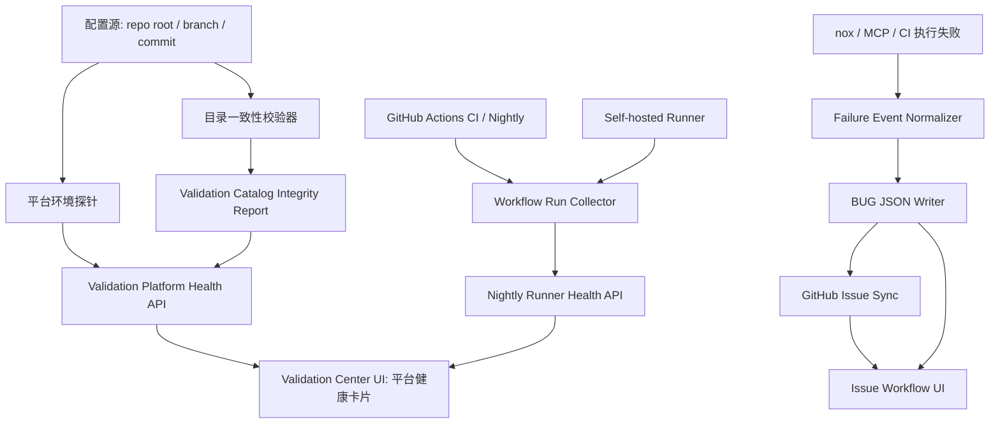
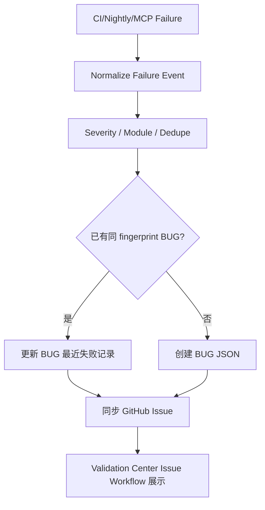

# AIstock 流水线平台 P0/P1 加固详细设计方案

日期：2026-05-19
状态：设计草案
分支：`codex/validation-platform-p0p1-design-20260519`
工作区：`F:\Dev\AIstock_worktrees\validation-platform-p0p1-design-20260519`
范围：仅设计流水线平台 P0/P1 级能力，不实现二期工程健康驾驶舱，不改生产服务，不写生产 DB。

## 1. 执行结论

当前 AIstock 流水线已经具备模块登记、测试计划、GitHub Actions、Validation Center UI、MCP 受控执行、GitHub Issue 同步等基础能力，但距离“可信的工程治理平台”仍缺少几个高优先级能力。

本方案建议优先补齐四个能力包：

1. **P0-1 固定运行环境绑定与平台自检**：Validation Center / MCP / CI 必须明确自己读取哪个 repo root、branch、commit、dirty 状态和配置来源，避免被开发中 worktree 或半成品分支污染。
2. **P0-2 测试计划目录一致性自检**：统一校验 `module_registry.yaml`、`test_plans.yaml`、`ui_targets.yaml`、`file_ownership.yaml`、`plan_catalog.py`、`noxfile.py`、前端导航和 GitHub workflow 的一致性。
3. **P1-1 Nightly / Runner 可用性与最近运行状态展示**：Validation Center 需要直接显示 self-hosted runner、nightly queue、DR/L3/live 阶段、最近失败和下一次计划执行状态。
4. **P1-2 失败自动 BUG 闭环落地**：CI/nightly/MCP 执行失败应形成机器可读 bug 上下文，自动写入本地 BUG JSON 并同步 GitHub Issue，避免只停留在 PR 评论或 workflow notice。

优先级判断：P0-1 和 P0-2 是平台可信度的前置条件；P1-1 和 P1-2 是自动化闭环能力。覆盖率 baseline、变更影响测试推荐、合入门禁总览可作为后续 P1/P2 继续扩展，但本次设计必须预留接口字段。

## 2. 目标与非目标

### 2.1 目标

- 让流水线平台能够自证当前读取的是稳定、可预期的代码与配置。
- 让新增功能漏配测试目录、漏配 nox session、漏配 UI route、误开 runner 权限等问题在 L0/CI 前置发现。
- 让夜间任务是否真正可用一眼可见，而不是只看到 workflow 文件存在。
- 让失败自动进入 BUG / GitHub Issue / Validation Center 三方可追踪闭环。
- 保持开发效率：快速门禁阻断基础不一致，长耗时任务进入 nightly，不要求每个开发提交都跑完整 L3/L4。

### 2.2 非目标

- 不实现二期工程健康驾驶舱图谱。
- 不引入图数据库。
- 不把所有 L3/UI/live 测试默认开放为 MCP 可执行。
- 不允许 UI 执行任意 shell。
- 不自动合并 PR，不自动推送生产，不重启生产端口 `8001` / `3000`。
- 不让 GitHub Issue 取代本地 BUG JSON；本地 BUG JSON 仍是机器可读源，GitHub Issue 是协作镜像。

## 3. 现有基础

| 能力 | 当前基础 | 缺口 |
|---|---|---|
| 模块登记 | `tests/aistock_validation/catalog/module_registry.yaml` | 需要与测试计划、文件归属、UI route 做强一致性校验 |
| 测试计划 | `tests/aistock_validation/catalog/test_plans.yaml` | 需要校验 command_key、nox_session、runner_enabled 安全性 |
| 执行 allowlist | `backend/services/validation/plan_catalog.py` | 需要防止 test_plans 中出现非 allowlisted command_key 导致 MCP health 500 |
| nox 入口 | `noxfile.py` | 需要自动发现 session 是否存在、是否与计划一致 |
| UI route 覆盖 | `tests/aistock_validation/catalog/ui_targets.yaml` | 需要与前端导航同源校验，并输出缺失 route |
| GitHub Actions | `.github/workflows/test.yml`、`nightly.yml` 等 | 需要从 UI 展示 workflow/run/runner 状态，并处理 queued/runner offline |
| MCP 受控执行 | `start_validation_execution`、`runner_enabled` | 需要固定 repo root，并在 health 中暴露配置源和一致性结果 |
| BUG 闭环 | `tests/aistock_validation/bugs`、`bug_github_sync.py`、Issue workflows | 失败自动入库仍不完整，需要统一 failure event 模型 |

## 4. 总体架构



核心原则：

- **先校验目录，再执行测试**：目录不一致时，不能假装计划可用。
- **平台 health 不只返回 alive**：必须返回 repo、catalog、runner、workflow、MCP 工具、GitHub 连接等分项状态。
- **不确定状态不能显示为绿色**：未知、不可用、权限不足、runner 离线都必须是 `unknown` 或 `blocked`。
- **长任务与快速门禁分层**：快速门禁用于开发效率，nightly 用于长耗时验证。

## 5. P0-1 固定运行环境绑定与平台自检

### 5.1 问题定义

当前 Validation Center / MCP 容易受当前进程启动目录影响。如果某个窗口在 `F:\Dev\AIstock` 主目录直接切到开发分支并写入半成品 `test_plans.yaml`，MCP health 可能读取该配置并失败。这个问题不一定来自代码质量，而是平台运行环境未显式绑定。

### 5.2 目标行为

- Validation Center 后端启动时明确解析一个权威 repo root。
- MCP Server 与后端必须使用同一套 repo root 解析规则。
- UI 必须展示当前平台绑定的 repo root、branch、commit、dirty 状态、origin/main 差异、配置文件 hash。
- 如果 repo root 不存在、不是 git repo、branch 非预期、配置不一致，health 应返回降级状态，而不是直接 500。

### 5.3 配置项

| 配置项 | 默认值 | 说明 |
|---|---|---|
| `AISTOCK_VALIDATION_REPO_ROOT` | 当前进程 repo root 自动发现 | 推荐生产/长期服务显式配置，指向干净 main worktree |
| `AISTOCK_VALIDATION_BASELINE_REF` | `origin/main` | 用于判断当前绑定 commit 是否落后或偏离 |
| `AISTOCK_VALIDATION_ALLOW_DIRTY` | `0` | 是否允许 dirty repo 作为平台权威源，默认不允许 |
| `AISTOCK_VALIDATION_EXPECT_BRANCH` | 空 | 可选，生产服务可设置为 `main` |
| `AISTOCK_VALIDATION_CONFIG_STRICT` | `1` | 目录一致性失败是否让 health 标为 blocked |

### 5.4 RepoRootResolver 设计

新增服务：`backend/services/validation/repo_context.py`

职责：

1. 读取环境变量。
2. 解析 repo root。
3. 执行 git 探针。
4. 生成 `ValidationRepoContext`。
5. 所有 Validation Center catalog 读取、MCP server、runner 统一使用该上下文。

示例模型：

```json
{
  "repo_root": "F:/Dev/AIstock_worktrees/validation-main-runtime",
  "source": "env:AISTOCK_VALIDATION_REPO_ROOT",
  "branch": "main",
  "commit": "733be35...",
  "baseline_ref": "origin/main",
  "ahead": 0,
  "behind": 0,
  "dirty": false,
  "untracked_count": 0,
  "config_hashes": {
    "test_plans.yaml": "sha256:...",
    "module_registry.yaml": "sha256:...",
    "ui_targets.yaml": "sha256:..."
  },
  "state": "healthy",
  "warnings": []
}
```

### 5.5 API 设计

新增或扩展：

- `GET /api/v1/validation/platform/health`
- `GET /api/v1/validation/platform/repo-context`
- `GET /api/v1/validation/platform/config-hashes`

`/platform/health` 返回：

```json
{
  "state": "healthy|degraded|blocked|unknown",
  "repo_context": {},
  "catalog_integrity": {},
  "runner_health": {},
  "github_connectivity": {},
  "mcp_tools": {},
  "generated_at": "2026-05-19T12:00:00+08:00"
}
```

### 5.6 UI 设计

Validation Center 首页增加“平台运行环境”卡片：

- 当前 repo root。
- branch / commit / baseline ref。
- dirty 状态。
- 配置来源：env / auto-discovery。
- 最近 health 检查时间。
- 风险提示：非 main、dirty、落后 origin/main、catalog blocked、GitHub CLI 不可用。

颜色规则：

| 状态 | 颜色 | 含义 |
|---|---|---|
| healthy | 绿色 | 固定 root、clean、catalog 通过 |
| degraded | 黄色 | 非致命问题，例如 gh 不可用、runner unknown |
| blocked | 红色 | catalog 不一致、repo 不可用、runner 误配置 |
| unknown | 灰色 | 数据不可用，不能判断 |

### 5.7 验收标准

- 设置 `AISTOCK_VALIDATION_REPO_ROOT` 后，MCP 和后端读取同一路径。
- repo dirty 时，health 不再 500，而是返回 `state=blocked` 和原因码。
- `test_plans.yaml` 出现非 allowlisted command_key 时，health 返回 catalog error，不导致整个 `/plans` 500。
- UI 可展示当前绑定 worktree 与 commit。

## 6. P0-2 测试计划目录一致性自检

### 6.1 问题定义

新增功能时，经常会出现：

- 新增 nox session 但未加入 `test_plans.yaml`。
- `test_plans.yaml` 增加 command_key，但 `plan_catalog.py` 未 allowlist。
- `runner_enabled=true` 的计划依赖 backend/frontend 或可能写业务状态。
- 新增页面 route 未进入 `ui_targets.yaml`。
- 模块 registry 未覆盖新增文件归属。

这些问题应作为流水线平台目录错误，而不是等到业务测试阶段才失败。

### 6.2 新增 nox session

新增：`validation_catalog_integrity`

执行内容：

```powershell
python -m nox -s validation_catalog_integrity
```

建议纳入：

- PR CI 的 `static-gate`。
- MCP health。
- Validation Center backend 测试。
- 新功能分支合入前标准验证。

### 6.3 校验项

| 编号 | 校验项 | 失败级别 | 说明 |
|---|---|---|---|
| CATALOG-001 | YAML 可解析 | P0 | 任一 catalog YAML 解析失败则 blocked |
| CATALOG-002 | plan_key 唯一 | P0 | 重复会导致 UI/API 状态错乱 |
| CATALOG-003 | command_key 在 allowlist 中 | P0 | 防止 MCP health 500 |
| CATALOG-004 | nox_session 存在 | P0 | 防止运行时失败 |
| CATALOG-005 | runner_enabled 安全 | P0 | runner_enabled 计划不得写业务状态，不得依赖生产端口 |
| CATALOG-006 | module 存在于 module_registry | P1 | 防止测试计划无法归属 |
| CATALOG-007 | required_on_change 引用 plan_key 存在 | P1 | 防止模块门禁失效 |
| CATALOG-008 | ui_targets href 与前端导航一致 | P1 | 防止新增页面无测试覆盖目录 |
| CATALOG-009 | ui_targets 引用模块存在 | P1 | 防止 UI route 质量汇总错误 |
| CATALOG-010 | file_ownership 模块存在 | P1 | 防止变更影响模块推导错误 |
| CATALOG-011 | workflow 中引用 nox session 存在 | P1 | 防止 GitHub Actions 调用不存在 session |
| CATALOG-012 | L3/live 计划默认 runner_enabled=false | P1 | 防止 UI/MCP 误触发长耗时或端口依赖任务 |

### 6.4 输出格式

生成：`tmp/validation/catalog/integrity_report.json`

```json
{
  "schema_version": "aistock_validation_catalog_integrity_v1",
  "state": "passed|failed",
  "summary": {
    "error_count": 0,
    "warning_count": 2,
    "plans": 23,
    "modules": 55,
    "ui_targets": 42,
    "nox_sessions": 38
  },
  "findings": [
    {
      "finding_id": "CATALOG-003",
      "severity": "P0",
      "file": "tests/aistock_validation/catalog/test_plans.yaml",
      "message": "plan data_sync_autonomy_backend uses non-allowlisted command_key",
      "expected": "command_key appears in backend/services/validation/plan_catalog.py",
      "actual": "missing allowlist mapping",
      "suggested_fix": "add mapping or set enabled=false until implementation is complete"
    }
  ]
}
```

### 6.5 API 设计

新增：

- `GET /api/v1/validation/catalog/integrity`
- `GET /api/v1/validation/catalog/integrity/findings`

返回最近一次计算结果；如果没有缓存，则可即时只读计算。即时计算必须有 timeout。

### 6.6 UI 设计

新增“目录一致性”卡片：

- 总状态：通过 / 阻塞 / 警告。
- 关键计数：modules、plans、runner-enabled plans、ui targets、nox sessions。
- P0/P1 findings 列表。
- 点击展开每个 finding 的文件、字段、期望、实际、建议修复。

### 6.7 验收标准

- 故意加入一个非 allowlisted command_key，`validation_catalog_integrity` 必须失败并报告具体 plan_key。
- 故意新增一个前端 route 不登记 ui target，必须失败或警告，按配置决定是否 blocked。
- GitHub workflow 引用不存在 nox session 时，必须失败。
- `runner_enabled=true` 且 `writes_database=true` 的计划必须失败，除非显式白名单并声明安全边界。

## 7. P1-1 Nightly / Runner 可用性与最近运行状态展示

### 7.1 问题定义

存在 `nightly.yml` 不代表夜间验证真实可用。Nightly 依赖 self-hosted Windows runner、本地 conda、Docker、DB、备份目录和端口策略。只看 workflow 文件无法判断是否 queued、runner offline、失败未建 BUG 或 artifact 缺失。

### 7.2 数据来源

| 数据 | 来源 | 说明 |
|---|---|---|
| workflow 定义 | `.github/workflows/nightly.yml` | 解析计划 job 和 cron |
| 最近 runs | `gh run list --workflow nightly.yml` 或 GitHub REST | 需要 GitHub token |
| run job 明细 | `gh run view <id> --json jobs` | 解析 DR/L3/live/full-summary |
| self-hosted runner | GitHub REST `/actions/runners` | 需要 repo 权限；失败返回 unknown |
| 本地运行证据 | `tests/aistock_validation/history/<date>/nightly_*.md` | 本地 evidence |
| artifact | GitHub run artifacts | 可选，先展示链接 |

### 7.3 API 设计

新增：

- `GET /api/v1/validation/nightly/summary`
- `GET /api/v1/validation/nightly/runs?limit=10`
- `GET /api/v1/validation/nightly/runner-health`

`nightly/summary` 示例：

```json
{
  "state": "healthy|queued|failed|blocked|unknown",
  "workflow": {
    "name": "AIstock Nightly L3 + DR",
    "file": ".github/workflows/nightly.yml",
    "cron": "7 19 * * *",
    "next_run_hint": "03:07 Asia/Shanghai"
  },
  "latest_run": {
    "run_id": 26059234354,
    "status": "queued",
    "conclusion": null,
    "created_at": "2026-05-18T20:41:17Z",
    "queue_duration_seconds": 7200,
    "url": "https://github.com/..."
  },
  "jobs": [
    {"name": "DR snapshot prod DB", "status": "queued", "conclusion": null},
    {"name": "DR validation", "status": "waiting", "conclusion": null}
  ],
  "runner": {
    "required_labels": ["self-hosted", "windows"],
    "matching_runner_count": 0,
    "online_count": 0,
    "state": "blocked"
  },
  "issue_sync": {
    "failure_issue_created": false,
    "state": "not_applicable"
  }
}
```

### 7.4 UI 设计

新增“夜间验证”页面或卡片：

- 当前状态：最近 run 成功 / 失败 / queued / blocked。
- Runner 状态：是否有 self-hosted Windows runner 在线。
- 阶段状态：DR snapshot、DR validate、L3、paper-v2-live、summary。
- 最近 7 次运行趋势。
- 最近失败对应 BUG/Issue 链接。
- 手动触发按钮：第一阶段只显示命令，不直接触发；第二阶段可通过 GitHub workflow_dispatch 触发。

### 7.5 状态规则

| 条件 | 状态 |
|---|---|
| 最近 run queued 超过阈值且无 online runner | blocked |
| 最近 run queued 但有 runner busy | queued |
| 最近 run completed success | healthy |
| 最近 run completed failure/cancelled | failed |
| GitHub 不可访问 | unknown |

### 7.6 验收标准

- 没有 self-hosted runner 时，UI 显示红色 blocked，而不是绿色。
- 最近 run queued 时，能显示 queue 时长和卡在哪个 job。
- workflow 不存在或被禁用时，显示 blocked。
- GitHub token 不可用时，显示 unknown，并给出配置建议，不报 500。

## 8. P1-2 失败自动 BUG 闭环落地

### 8.1 问题定义

当前失败自动化有多个入口：CI workflow、nightly full-summary、MCP execution、guardrail workflow。但失败事件格式不统一，有些只是 PR 评论或 workflow notice，没有真正进入 BUG JSON + GitHub Issue + Validation Center UI 的闭环。

### 8.2 统一 Failure Event 模型

新增统一模型：`aistock_validation_failure_event_v1`

```json
{
  "schema_version": "aistock_validation_failure_event_v1",
  "event_id": "ci-26073670429-validation_center_backend",
  "source": "github_actions|mcp_execution|local_nox|nightly|guardrail",
  "severity": "P0|P1|P2|P3",
  "module": "validation_center",
  "plan_key": "validation_center_backend",
  "run_url": "https://github.com/...",
  "commit": "733be35...",
  "branch": "main",
  "title": "Validation Center backend failed: missing UI target for /research-pipeline",
  "expected": "all frontend routes are registered in ui_targets.yaml",
  "actual": "missing href /research-pipeline",
  "reproduce_command": "python -m nox -s validation_center_backend",
  "files": [
    "tests/aistock_validation/catalog/ui_targets.yaml",
    "frontend/src/lib/navigation/nav-groups.ts"
  ],
  "logs_excerpt": "FAILED backend/tests/test_validation_ui_target_catalog.py...",
  "dedupe_key": "validation_center_backend:/research-pipeline:ui_target_missing"
}
```

### 8.3 处理流程



### 8.4 新增/扩展脚本

建议新增：

- `scripts/validation_failure_event.py`
- `scripts/ci_register_failure_as_bug.py`

职责：

- 从 GitHub Actions env 或本地 JSON 读取失败上下文。
- 生成 failure event。
- 调用现有 `report_bug` / `bug_github_sync.py` 机制。
- 支持 `--dry-run` 和 `--apply`。
- 支持 fingerprint 去重。

### 8.5 Workflow 改造

`.github/workflows/test.yml`：

- 将 `failure-bug-register` 从“提示评论”升级为真正执行 `ci_register_failure_as_bug.py --apply`。
- PR 场景：创建/更新 BUG JSON 可能需要写分支；如果 GitHub Actions 无法 push，则至少创建 GitHub Issue 并在 issue body 标注“BUG JSON backfill required”。
- main push 场景：允许创建 GitHub Issue，BUG JSON 由后续 MCP worker 或人工确认 backfill。

`.github/workflows/nightly.yml`：

- full-summary 已有自动 BUG 逻辑，但应改为统一 failure event 模型。
- DR validate 失败、runner blocked、queued timeout 都要有独立 reason code。

`issue-on-test-fail.yml` / `issue-on-guardrail-fail.yml`：

- 统一调用同一个脚本或同一个 JSON schema。
- 避免多个 workflow 为同一失败重复建 issue。

### 8.6 BUG JSON 扩展字段

建议新增可选字段：

```json
{
  "validation_failure": {
    "event_id": "ci-26073670429-validation_center_backend",
    "source": "github_actions",
    "plan_key": "validation_center_backend",
    "run_url": "https://github.com/...",
    "dedupe_key": "...",
    "first_seen_commit": "...",
    "last_seen_commit": "...",
    "last_seen_at": "...",
    "failure_count": 3
  }
}
```

### 8.7 验收标准

- 一个 CI 失败可生成 failure event JSON。
- 相同 dedupe_key 的失败不会重复创建多个 BUG。
- BUG JSON 可同步 GitHub Issue。
- Validation Center UI 可看到该 BUG 的来源 run、plan_key、reproduce command。
- 如果 GitHub token 不可用，脚本仍写本地 dry-run 输出并返回明确错误。

## 9. 与现有页面的集成

### 9.1 页面结构

在 Validation Center 现有卡片化页面中新增/增强：

| 页面/卡片 | 新增内容 |
|---|---|
| 平台总览 | 运行环境、catalog integrity、nightly、CI、MCP、GitHub 连接总状态 |
| 目录一致性 | P0/P1 findings、计划/模块/route/nox/workflow 关系图 |
| 夜间验证 | runner、nightly runs、阶段结果、失败 issue |
| Issue 修复流程 | failure event 来源、BUG JSON、GitHub Issue、修复验证状态 |
| 合入门禁 | 读取 catalog 和 failure event，判断是否存在 blocking 状态 |

### 9.2 合入门禁预留字段

虽然本方案不完整实现合入门禁，但新增 API 应预留：

```json
{
  "merge_gate_inputs": {
    "repo_context_state": "healthy",
    "catalog_integrity_state": "passed",
    "ci_state": "passed|failed|unknown",
    "nightly_state": "healthy|pending|blocked|unknown",
    "open_p0_p1_count": 0,
    "required_plan_failures": [],
    "missing_evidence": []
  }
}
```

## 10. 安全边界

- `runner_enabled=true` 只允许受控、短耗时、无业务状态写入的计划。
- Nightly 可以执行长任务，但必须在 self-hosted runner 上，并且 workflow 明确环境和 skip flag。
- UI 第一阶段不触发 GitHub workflow，只展示状态和手动命令。
- GitHub token 不得进入前端，不得写入日志。
- Failure event 日志只保存摘要和关键错误，不保存超大日志全文。
- 任何生产 DB 写入必须显式禁止；DR snapshot 只能按既有 `nightly.yml` 受控路径执行。

## 11. 分阶段实施计划

### 阶段 A：P0 平台可信基础

1. 新增 `RepoRootResolver` 与 `/validation/platform/repo-context`。
2. 新增 `validation_catalog_integrity` 脚本和 nox session。
3. 将 catalog integrity 纳入 MCP health 和 PR CI static-gate。
4. UI 增加平台运行环境卡片和目录一致性卡片。

验收：MCP 不再因单个 plan catalog 错误直接 500；错误以结构化 finding 返回。

### 阶段 B：P1 夜间可用性可视化

1. 新增 GitHub workflow/run collector。
2. 新增 nightly summary API。
3. UI 增加夜间验证卡片。
4. 支持 token 不可用时降级为 unknown。

验收：self-hosted runner 不在线时 UI 明确显示 blocked，最近 queued run 可见。

### 阶段 C：P1 失败自动 BUG 闭环

1. 定义 failure event schema。
2. 新增 `ci_register_failure_as_bug.py`。
3. 改造 `test.yml`、`nightly.yml` 和 issue workflows。
4. UI Issue 页面展示 failure event 来源。

验收：CI 失败可自动创建或更新 BUG，并同步 GitHub Issue。

### 阶段 D：后续预留

- 变更文件自动推荐测试计划。
- 覆盖率 baseline 刷新。
- 合入门禁总览页。
- 工程健康驾驶舱二期。

## 12. 测试方案

| 层级 | 命令 | 目的 |
|---|---|---|
| L0 | `python -m nox -s validation_catalog_integrity` | catalog 自检 |
| L0 | `python -m nox -s validation_module_registry_l0` | 模块登记 |
| L2 | `python -m nox -s validation_center_backend` | API 和服务测试 |
| L3 | `python -m nox -s validation_center_ui` | UI mock 测试 |
| L3 | `python -m nox -s validation_center_real_port_ui` | dev port real UI smoke |
| CI | `.github/workflows/test.yml` | PR/push 快速门禁 |
| Nightly | `.github/workflows/nightly.yml` | 长任务和 DR 验证 |

故障注入测试：

1. 插入非 allowlisted command_key，验证 catalog integrity fail。
2. 删除一个 nox session，验证 workflow/session 引用 fail。
3. 新增 fake UI route 不登记，验证 route catalog fail。
4. 模拟 GitHub token 缺失，nightly API 返回 unknown 而不是 500。
5. 模拟 CI failure event，验证 dry-run BUG payload。

## 13. 风险与缓解

| 风险 | 影响 | 缓解 |
|---|---|---|
| 过度门禁降低开发效率 | 开发提交变慢 | P0 只阻断目录/安全不一致，长任务进入 nightly |
| GitHub API 不可用 | UI 状态 unknown | 降级展示，不影响本地 nox |
| self-hosted runner 离线 | nightly queued | UI blocked 显示，并生成运维提示 |
| 多 worktree 误读配置 | MCP health 异常 | 固定 repo root 与 repo context 卡片 |
| 自动 BUG 重复创建 | Issue 噪音 | dedupe_key + fingerprint 去重 |
| workflow 无权限写 BUG JSON | 闭环不完整 | 先创建 GitHub Issue，标注 backfill required，由 MCP worker 回填 |

## 14. 决策点

需要确认的设计决策：

1. 生产/常驻 Validation Center 是否固定使用一个专用 main worktree，例如 `F:\Dev\AIstock_worktrees\validation-runtime-main`。
2. `validation_catalog_integrity` 是否作为 PR CI 必过项；建议是必过。
3. Nightly runner 状态是否允许通过 GitHub REST 读取；需要 token 具备 Actions read 权限。
4. CI 自动失败是否允许直接创建 GitHub Issue；建议允许，但 BUG JSON 写入可由 MCP worker backfill。
5. UI 是否第一阶段只读展示 workflow_dispatch 命令；建议第一阶段只读，第二阶段再开放受控触发。

## 15. 建议结论

建议立即按阶段 A 开始实现，因为它直接解决流水线平台可信度问题。阶段 A 完成后，再实现夜间可用性展示和失败自动 BUG 闭环。这样可以在不牺牲开发效率的前提下，让 AIstock 流水线从“有很多测试入口”升级为“能够自证健康、自动发现目录问题、自动形成缺陷闭环”的平台。

## 16. 生产相邻功能的隔离验证设计补充

### 16.1 背景

AIstock 中有大量功能天然接近生产环境：模拟盘、Paper v2、MiniQMT、QE 实验、RDAgent、数据同步、Qlib/H5/Bin 数据生成、DR 备份、实盘前数据检查等。这些功能如果只做 mock 测试，无法证明真实业务链路可用；但如果直接在生产数据、生产账户或生产路径上验证，又会带来不可接受的污染和交易风险。

因此，流水线需要支持“可清理的真实验证”，而不是在“完全 mock”和“直接动生产”之间二选一。

### 16.2 分层验证策略

| 层级 | 目标 | 允许资源 | 禁止事项 | 合入关系 |
|---|---|---|---|---|
| L0/L1 静态与单元 | 快速发现目录、类型、纯函数问题 | 本地文件、mock、内存 fake | 访问生产 DB、启动交易、长任务 | PR 必过 |
| L2 后端契约 | 验证服务、schema、API contract | 临时 DB、fixture、小样本、dry-run | 写生产 DB、依赖交易时段 | PR 必过或按模块必过 |
| L3 隔离集成 | 验证 dev port / dev DB / UI / API | dev DB、临时 portfolio、临时 experiment、mock worker | 写生产账户、改生产 Qlib 路径 | 合入前强建议，高风险模块必过 |
| L4 夜间真实小样本 | 验证真实依赖的小规模闭环 | self-hosted runner、dev DB、临时命名空间、小样本真实数据 | 生产表无标记写入、不可清理写入 | 可先合入但标记 `L4 pending`；生产启用前必须过 |
| L5 发布前候选 | 验证长耗时/准生产链路 | 显式批准的候选数据、备份、生产相同路径的影子副本 | 未批准替换生产数据 | 生产启用或数据替换前必须过 |

### 16.3 隔离资源命名规范

所有可清理验证资源必须有统一命名和 TTL：

```text
validation_<plan_key>_<run_id>_<yyyymmddhhmmss>
```

示例：

- Paper portfolio：`validation_paper_v2_l3_26073670429_202605190307`
- QE experiment：`validation_qe_smoke_26073670429_202605190307`
- Data sync job：`validation_data_sync_autonomy_26073670429_202605190307`
- Qlib candidate path：`F:/Dev/AIstock/qlib_candidates/validation_<run_id>/...`
- Temporary DB schema：`validation_<run_id>` 或表内 `validation_run_id` 字段。

每个资源必须记录：

- `validation_run_id`
- `plan_key`
- `created_at`
- `ttl_hours`
- `cleanup_command`
- `owner`：`ci` / `nightly` / `mcp` / `manual`
- `business_state_write=false|isolated|prod_approved`

### 16.4 写入隔离规则

| 场景 | 推荐方式 | 清理方式 |
|---|---|---|
| Paper v2 / 模拟盘 | 创建独立 validation portfolio/account/session，禁止复用生产 portfolio | 按 `validation_run_id` 删除 session/portfolio 或标记 archived |
| MiniQMT 模拟 | 使用 `miniqmt_sim` broker backend 与专用 validation account | 删除/归档 validation account ledger 与 orders |
| QE 实验 | 使用 `validation_*` experiment/task id，限制 loop、seed、股票池、日期范围 | 通过 archive/job cleanup 标记 validation artifact，可保留摘要 evidence |
| RDAgent / worker | 使用独立 workspace root，禁止写真实 worker production workspace | 删除 workspace 或保留 manifest 后压缩归档 |
| 数据同步 | 使用 dev DB、shadow schema、small symbol/date window、dry-run plan | 按 run_id 删除 shadow rows 或 drop schema |
| Qlib/H5/Bin 生成 | 生成 candidate path，不覆盖 `/home/lc999/data/qlib_bin` 等生产路径 | 删除 candidate path 或保留 manifest |
| DR snapshot | 只读生产 DB，输出到受控备份目录 | 按 retention 策略清理旧备份 |

### 16.5 正向业务验证要求

高风险模块不能只依赖 fail-fast 负向测试，还需要至少一个正向成功路径：

- Paper v2：能创建 validation portfolio，生成 target，执行一个隔离 day run，产出 ledger/session evidence。
- QE 实验：能创建小样本 validation experiment，完成至少一个轻量 loop 或 replay，产出 metrics/artifact manifest。
- 数据同步：能对少量 symbol/date 做 dry-run + shadow write + reconciliation，证明不会写错生产表。
- Research Pipeline：能读取/回填一个小样本 HMM backtest timeline，证明 artifact-ref/backtest-record 链路可查。
- Qlib candidate：能在非生产路径初始化 provider，读取样本 calendar/instrument/features，并跑一个 mini backtest smoke。

### 16.6 清理与审计

新增建议：

- `scripts/validation_resource_cleanup.py`
- `tests/aistock_validation/catalog/resource_policies.yaml`
- `tmp/validation/resources/<run_id>.json`

资源清单示例：

```json
{
  "schema_version": "aistock_validation_resources_v1",
  "run_id": "26073670429",
  "plan_key": "paper_v2_l3",
  "resources": [
    {
      "resource_type": "paper_portfolio",
      "resource_id": "validation_paper_v2_l3_26073670429_202605190307",
      "storage": "dev_db",
      "ttl_hours": 72,
      "cleanup_command": "python scripts/validation_resource_cleanup.py --run-id 26073670429 --apply",
      "state": "created"
    }
  ]
}
```

清理策略：

- L2/L3 临时资源默认 TTL 24-72 小时。
- L4/L5 可保留摘要 evidence 和 manifest，但清理大文件、临时 DB 行、临时 workspace。
- 清理失败必须生成 P1/P2 BUG，不能静默忽略。

### 16.7 流水线目录扩展建议

为了让“可清理真实验证”进入平台目录，应在 `test_plans.yaml` 中扩展字段：

```yaml
resource_policy:
  business_state_write: isolated
  allowed_db_targets: [dev_db, shadow_schema]
  forbidden_db_targets: [prod_db]
  creates_validation_resources: true
  cleanup_required: true
  ttl_hours: 72
  max_runtime_minutes: 30
  max_sample_symbols: 20
  max_date_window_days: 5
  production_promotion_required: false
```

新增 catalog integrity 校验：

- `writes_business_state=true` 但没有 `resource_policy`，必须失败。
- `resource_policy.cleanup_required=true` 但没有 cleanup command，必须失败。
- `allowed_db_targets` 包含 prod 时，必须要求人工批准字段。
- L4/L5 计划必须声明 timeout、样本规模和 artifact 上限。

### 16.8 近期功能接入流水线的现状判断

按当前 main 快照观察：

- Validation Center、QE archive、QE read、Paper v2、model registry、market regime、RL execution、data quality、DR 已有测试计划或 nox session。
- Research Pipeline 已有 `research_pipeline_backend` nox session，但尚未完整进入 `test_plans.yaml` / `plan_catalog.py` / `ui_targets.yaml`，因此当前 CI 已能发现 `/research-pipeline` route 缺登记。这说明门禁有效，但该新功能的流水线目录接入还不完整。
- QE MCP / QE template 已有 nox session：`qe_mcp_backend`、`qe_template_ui`、`qe_mcp_l3`，但是否进入 test_plans allowlist 需要单独补齐，否则不能被 Validation Center/MCP 统一调度。
- Data Sync Autonomy 在开发分支中已经开始加入 `data_sync_autonomy_backend`，但需要确保 `noxfile.py`、`plan_catalog.py`、`test_plans.yaml` 三者一起合入，并补 resource policy，避免被视为半注册计划。
- MiniQMT / 模拟盘迁移相关 bug 和设计较多，但目前更偏专项验证与 issue 修复流程，建议新增独立 `miniqmt_sim_backend` / `miniqmt_strategy_ledger_l3` 测试计划，并明确使用 validation account，不触碰真实账户。

### 16.9 建议新增的高优先级测试计划

| plan_key | 模块 | 层级 | 目的 | 资源策略 |
|---|---|---|---|---|
| `research_pipeline_backend` | research_pipeline | L2 | 验证 research pipeline schema/service/API contract | 无业务写入或临时 fixture |
| `research_pipeline_ui` | research_pipeline | L2/L3 | 验证页面只读 API 和 route coverage | mock API / dev backend |
| `data_sync_autonomy_backend` | local_data | L2 | 验证数据同步状态机、dry-run、reconciliation | dev DB / shadow schema |
| `data_sync_autonomy_shadow_l3` | local_data | L3 | 小样本真实 sync 到 shadow schema | cleanup required |
| `qe_mcp_backend` | qe_mcp | L2 | 验证 MCP template/archive/tool contract | 不写生产 DB |
| `qe_mcp_l3` | qe_mcp | L3 | 验证受控 MCP + backend/dev port | artifact cleanup |
| `qe_smoke_validation_experiment_l4` | qe | L4 | 夜间创建小样本 validation QE 实验 | validation experiment + cleanup |
| `miniqmt_sim_backend` | qmt | L2 | 验证 sim broker / ledger / order preflight | 内存或 dev DB validation account |
| `miniqmt_strategy_ledger_l3` | qmt | L3 | 验证少量模拟盘 order/fill/ledger 闭环 | validation account + cleanup |
| `qlib_candidate_smoke_l4` | qlib_data | L4 | 验证非生产 Qlib candidate 可用 | candidate path + manifest |

### 16.10 结论

可以实现对模拟盘、QE 实验、数据同步这类生产相邻功能的验证，关键不是完全禁止写入，而是把写入限制在可识别、可清理、可审计、非生产的 validation namespace 中。流水线应把“是否创建资源、是否清理、是否触碰生产、是否需要人工批准”作为测试计划的一等字段，而不是靠口头约定。

近期新功能已经有一部分加入了 nox 或测试目录，但还没有全部进入统一 Validation Center catalog。下一步应把 Research Pipeline、Data Sync Autonomy、QE MCP、MiniQMT simulation、Qlib candidate smoke 按上述 resource policy 方式补入流水线。
